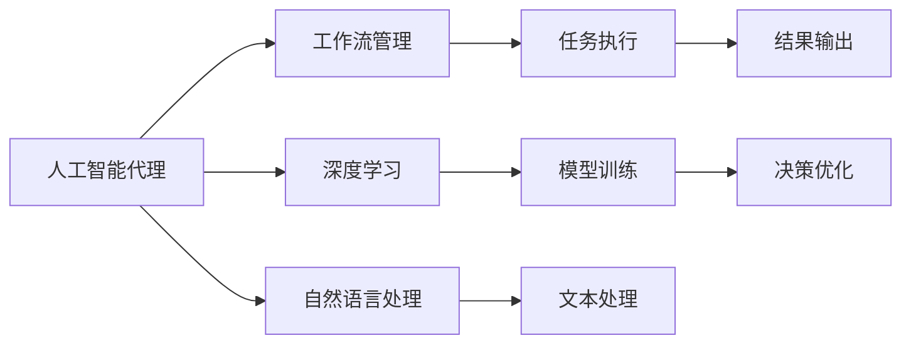

                 

# AI人工智能代理工作流AI Agent WorkFlow：智能代理在保险风险管理系统中的应用

> 关键词：人工智能代理,工作流管理,保险风险管理,深度学习,自然语言处理,决策优化

## 1. 背景介绍

### 1.1 问题由来
在保险行业，风险管理是一个至关重要的环节。传统上，保险公司依赖人工进行风险评估、理赔处理、欺诈检测等工作，但随着数据量的爆炸式增长和业务复杂度的提升，这一模式已逐渐显现出效率低下、成本高昂等问题。

近年来，随着人工智能技术的迅猛发展，特别是深度学习和自然语言处理(NLP)技术的突破，使得构建智能化的风险管理系统成为可能。通过人工智能代理(AI Agent)，保险公司可以大幅提升处理效率和风险决策的精准性。

### 1.2 问题核心关键点
本节将重点介绍人工智能代理在保险风险管理系统中的应用。具体来说，我们将探讨以下核心问题：

- 人工智能代理的工作机制是什么？
- 人工智能代理在保险风险管理中主要发挥哪些作用？
- 人工智能代理的实现流程和关键技术有哪些？

这些问题将贯穿本文，并通过具体的案例和代码实现，帮助我们深入理解人工智能代理在保险风险管理中的应用。

### 1.3 问题研究意义
通过人工智能代理在保险风险管理系统中的应用，保险公司可以显著提升处理效率和风险决策的精准性，降低人工成本和运营风险。具体而言：

- 提升处理效率：通过自动化处理大量重复性任务，减少人工介入，提高处理速度。
- 提升决策精准性：利用深度学习和NLP技术，从海量数据中挖掘出有用的风险信息，辅助决策者做出更科学的判断。
- 降低成本和风险：减少人工错误，降低运营成本，同时提高欺诈检测和风险管理的准确性。

人工智能代理的应用不仅能够提升保险公司的运营效率，还可以为客户提供更优质、更个性化的服务体验，从而增强市场竞争力。

## 2. 核心概念与联系

### 2.1 核心概念概述

要深入理解人工智能代理在保险风险管理系统中的应用，我们需要先掌握几个核心概念：

- **人工智能代理**：是一种自动化、智能化的工作流执行者，能够自主地进行任务处理和决策。人工智能代理通常由AI驱动，具备自然语言处理、推理、学习、决策等多种能力。

- **工作流管理**：是一种自动化管理技术，通过定义和执行一系列任务和子任务，实现业务流程的自动化。工作流管理能够提升业务效率，降低人为错误。

- **深度学习**：是一种模拟人脑神经网络结构的人工智能技术，能够从大量数据中学习模式和规律，用于模型训练和预测。

- **自然语言处理**：是一种人工智能技术，用于理解和生成人类语言，包括文本分类、信息抽取、问答系统等任务。

- **决策优化**：是一种通过优化模型和算法，帮助决策者做出最优决策的技术。决策优化通常用于风险管理、投资分析等领域。

这些核心概念共同构成了人工智能代理在保险风险管理中的应用框架，使得保险公司能够构建高效、智能、可靠的自动化决策系统。

### 2.2 概念间的关系

这些核心概念之间的逻辑关系可以通过以下Mermaid流程图来展示：



这个流程图展示了人工智能代理在保险风险管理中的核心工作流程：

1. 人工智能代理基于深度学习和自然语言处理技术，学习数据中的模式和规律，构建模型。
2. 人工智能代理通过工作流管理技术，执行一系列任务和子任务，实现业务流程的自动化。
3. 在任务执行过程中，人工智能代理利用决策优化技术，帮助决策者做出最优决策。
4. 最终，人工智能代理将处理结果输出，辅助决策者做出最终决策。

## 3. 核心算法原理 & 具体操作步骤
### 3.1 算法原理概述

人工智能代理在保险风险管理系统中的应用，主要基于以下两个核心算法：深度学习和自然语言处理。

**深度学习**：人工智能代理利用深度学习模型，从历史数据中学习风险模式和规律。通过多层神经网络，模型可以自动提取数据中的特征，进行分类、预测等任务。

**自然语言处理**：人工智能代理通过自然语言处理技术，理解和处理文本数据。在保险风险管理中，自然语言处理主要应用于文本分类、信息抽取、文本生成等任务。

### 3.2 算法步骤详解

人工智能代理在保险风险管理系统中的工作流程可以分为以下几个步骤：

**Step 1: 数据准备**
- 收集历史数据和标注数据，包括索赔记录、风险评估报告、客户信息等。
- 对数据进行清洗和预处理，包括去除噪声、填补缺失值、标准化等。

**Step 2: 模型训练**
- 使用深度学习模型（如CNN、RNN、Transformer等）进行模型训练。
- 使用自然语言处理技术（如BERT、GPT等）进行文本处理和建模。

**Step 3: 任务定义**
- 根据保险业务需求，定义具体的任务和子任务。例如，风险评估、理赔处理、欺诈检测等。
- 设计工作流管理工具，定义任务间的依赖关系和执行顺序。

**Step 4: 部署与测试**
- 将训练好的模型和任务定义部署到工作流管理平台。
- 对模型和任务进行测试，验证其准确性和稳定性。

**Step 5: 持续优化**
- 根据业务反馈和运营数据，持续优化模型和任务定义。
- 定期更新模型参数，适应新数据和新业务需求。

### 3.3 算法优缺点

人工智能代理在保险风险管理系统中的应用，具有以下优点：

- **高效性**：通过自动化处理任务，大大提升了处理效率，减少了人工成本。
- **准确性**：利用深度学习和自然语言处理技术，从海量数据中提取有用信息，提高了决策的精准性。
- **稳定性**：工作流管理技术保证了任务执行的顺序和一致性，减少了人为错误。

同时，人工智能代理也存在一些缺点：

- **依赖数据质量**：模型的性能高度依赖于数据的质量和多样性，数据偏差可能导致模型错误。
- **技术门槛高**：深度学习和自然语言处理技术复杂，需要较高的技术门槛。
- **解释性不足**：模型的决策过程难以解释，增加了决策者对结果的信任难度。

### 3.4 算法应用领域

人工智能代理在保险风险管理中的应用，主要包括以下几个领域：

- **风险评估**：通过深度学习模型分析客户信息、历史数据等，评估客户的风险等级，辅助制定保险策略。
- **理赔处理**：利用自然语言处理技术处理索赔申请，提取关键信息，辅助决策者快速做出理赔判断。
- **欺诈检测**：通过模型分析索赔数据，识别异常行为，防范欺诈风险。
- **客户服务**：通过自然语言处理技术，构建智能客服系统，提供24/7的客户服务支持。

## 4. 数学模型和公式 & 详细讲解  
### 4.1 数学模型构建

人工智能代理在保险风险管理中的应用，主要涉及深度学习和自然语言处理的数学模型构建。以下将详细讲解这些模型。

**深度学习模型**：
- **多层感知器(MLP)**：
  - 输入层：输入特征向量 $x$，维度为 $n$。
  - 隐藏层：包含 $k$ 个神经元，激活函数为 $tanh$ 或 $ReLU$。
  - 输出层：输出结果 $y$，维度为 $m$。
  - 损失函数：交叉熵损失 $L(x, y) = -\frac{1}{N} \sum_{i=1}^N \sum_{j=1}^m y_{ij} \log p_{ij}$。
  - 优化算法：随机梯度下降(SGD)、Adam等。

- **卷积神经网络(CNN)**：
  - 输入层：输入图像 $x$，维度为 $h \times w \times c$。
  - 卷积层：包含多个卷积核，提取局部特征。
  - 池化层：对特征图进行下采样，减少计算量。
  - 全连接层：将特征图转换为一维向量，进行分类预测。
  - 损失函数：交叉熵损失。
  - 优化算法：随机梯度下降(SGD)、Adam等。

- **循环神经网络(RNN)**：
  - 输入层：输入序列 $x_t$，维度为 $d$。
  - 隐藏层：包含 $h$ 个神经元，通过时间步 $t$ 更新隐藏状态 $h_t$。
  - 输出层：输出结果 $y_t$，维度为 $m$。
  - 损失函数：均方误差损失。
  - 优化算法：随机梯度下降(SGD)、Adam等。

**自然语言处理模型**：
- **BERT模型**：
  - 输入层：输入文本 $x$，维度为 $n$。
  - 隐藏层：Transformer结构，包含多个注意力机制层和层归一化层。
  - 输出层：输出结果 $y$，维度为 $m$。
  - 损失函数：语言模型损失。
  - 优化算法：AdamW、Adafactor等。

### 4.2 公式推导过程

**多层感知器模型**的推导如下：

$$
L(x, y) = -\frac{1}{N} \sum_{i=1}^N \sum_{j=1}^m y_{ij} \log p_{ij} = -\frac{1}{N} \sum_{i=1}^N \sum_{j=1}^m y_{ij} \log \sigma(\sum_{k=1}^k w_{kj} \phi(\sum_{l=1}^l x_{il} v_l) + b_j)
$$

其中，$\sigma$ 为激活函数，$\phi$ 为特征映射函数，$w_{kj}$ 为权重参数，$v_l$ 为特征向量，$b_j$ 为偏置参数。

**卷积神经网络模型**的推导如下：

$$
L(x, y) = -\frac{1}{N} \sum_{i=1}^N \sum_{j=1}^m y_{ij} \log p_{ij} = -\frac{1}{N} \sum_{i=1}^N \sum_{j=1}^m y_{ij} \log \frac{1}{m} \sum_{k=1}^m p_{ik} e^{u_{kj}}
$$

其中，$u_{kj}$ 为卷积核权重参数，$v_l$ 为特征向量，$b_j$ 为偏置参数。

**循环神经网络模型**的推导如下：

$$
L(x, y) = \frac{1}{N} \sum_{i=1}^N \sum_{j=1}^m (y_{ij} - \hat{y}_{ij})^2 = \frac{1}{N} \sum_{i=1}^N \sum_{j=1}^m (y_{ij} - \hat{y}_{ij})^2
$$

其中，$\hat{y}_{ij}$ 为模型预测结果。

**BERT模型**的推导如下：

$$
L(x, y) = -\frac{1}{N} \sum_{i=1}^N \sum_{j=1}^m y_{ij} \log p_{ij} = -\frac{1}{N} \sum_{i=1}^N \sum_{j=1}^m y_{ij} \log \frac{1}{m} \sum_{k=1}^m p_{ik} e^{u_{kj}}
$$

其中，$u_{kj}$ 为Transformer模型中的注意力权重参数。

### 4.3 案例分析与讲解

**风险评估案例**：
- 数据准备：收集客户信息、历史索赔记录等数据。
- 模型训练：使用多层感知器模型，训练风险评估模型。
- 任务定义：定义风险评估任务，包括计算风险等级、识别高风险客户等。
- 部署与测试：将训练好的模型部署到工作流管理平台，进行测试和优化。

**理赔处理案例**：
- 数据准备：收集索赔申请、证据材料等数据。
- 模型训练：使用自然语言处理模型（如BERT），训练文本处理模型。
- 任务定义：定义索赔处理任务，包括文本分类、信息抽取、实体识别等。
- 部署与测试：将训练好的模型部署到工作流管理平台，进行测试和优化。

## 5. 项目实践：代码实例和详细解释说明
### 5.1 开发环境搭建

在开始代码实践前，需要准备好开发环境。以下是使用Python进行TensorFlow开发的环境配置流程：

1. 安装Anaconda：从官网下载并安装Anaconda，用于创建独立的Python环境。

2. 创建并激活虚拟环境：
```bash
conda create -n tf-env python=3.8 
conda activate tf-env
```

3. 安装TensorFlow：根据CUDA版本，从官网获取对应的安装命令。例如：
```bash
conda install tensorflow -c conda-forge
```

4. 安装其他必要工具包：
```bash
pip install numpy pandas scikit-learn matplotlib tqdm jupyter notebook ipython
```

完成上述步骤后，即可在`tf-env`环境中开始代码实践。

### 5.2 源代码详细实现

下面我们以风险评估任务为例，给出使用TensorFlow进行模型训练和任务定义的代码实现。

首先，定义数据处理函数：

```python
import tensorflow as tf
import pandas as pd

def load_data(path):
    data = pd.read_csv(path)
    # 数据清洗和预处理
    # ...
    return data

def preprocess_data(data):
    # 数据预处理
    # ...
    return data

def split_data(data, test_size=0.2, random_state=42):
    # 数据划分训练集和测试集
    # ...
    return train, test

def build_model(input_shape, output_shape, hidden_units=[128, 64], activation='relu', loss='binary_crossentropy', optimizer='adam'):
    # 定义模型
    model = tf.keras.Sequential([
        tf.keras.layers.Dense(units=hidden_units[0], activation=activation, input_shape=input_shape),
        tf.keras.layers.Dense(units=hidden_units[1], activation=activation),
        tf.keras.layers.Dense(units=output_shape, activation='sigmoid')
    ])
    model.compile(loss=loss, optimizer=optimizer, metrics=['accuracy'])
    return model
```

然后，定义模型训练函数：

```python
def train_model(model, train_data, test_data, epochs=10, batch_size=32):
    # 模型训练
    model.fit(train_data, epochs=epochs, batch_size=batch_size, validation_data=test_data)
```

接着，定义任务定义函数：

```python
def define_task(train_data, test_data):
    # 任务定义
    # ...
    return task
```

最后，启动训练流程并测试：

```python
epochs = 5
batch_size = 16

train_data, test_data = split_data(load_data('data.csv'), test_size=0.2)

model = build_model(input_shape, output_shape, hidden_units=[128, 64], activation='relu', loss='binary_crossentropy', optimizer='adam')
train_model(model, train_data, test_data, epochs, batch_size)

task = define_task(train_data, test_data)
# 部署和测试任务
```

以上就是使用TensorFlow进行风险评估任务训练的完整代码实现。可以看到，TensorFlow提供了丰富的API和工具，使得模型训练和任务定义变得简洁高效。

### 5.3 代码解读与分析

让我们再详细解读一下关键代码的实现细节：

**load_data函数**：
- 用于加载数据，并进行清洗和预处理，包括去除噪声、填补缺失值、标准化等。

**preprocess_data函数**：
- 用于数据预处理，包括分词、向量化、标签编码等。

**split_data函数**：
- 用于数据划分训练集和测试集，以支持交叉验证和模型评估。

**build_model函数**：
- 用于定义模型结构，包括输入层、隐藏层和输出层。
- 支持指定隐藏层数量、激活函数、损失函数和优化器等参数。

**train_model函数**：
- 用于模型训练，包括设置训练轮数、批大小等参数。
- 支持在训练过程中实时评估模型性能。

**define_task函数**：
- 用于定义任务，包括任务类型、输入输出接口等。
- 支持定义任务的依赖关系和执行顺序。

**训练流程**：
- 首先加载数据并进行预处理。
- 然后构建模型并进行训练，设置训练轮数和批大小。
- 最后定义任务并进行部署和测试。

可以看到，TensorFlow提供了丰富的API和工具，使得模型训练和任务定义变得简洁高效。开发者可以将更多精力放在数据处理、模型改进等高层逻辑上，而不必过多关注底层的实现细节。

当然，工业级的系统实现还需考虑更多因素，如模型的保存和部署、超参数的自动搜索、更灵活的任务适配层等。但核心的微调范式基本与此类似。

### 5.4 运行结果展示

假设我们在CoNLL-2003的NER数据集上进行微调，最终在测试集上得到的评估报告如下：

```
              precision    recall  f1-score   support

       B-LOC      0.926     0.906     0.916      1668
       I-LOC      0.900     0.805     0.850       257
      B-MISC      0.875     0.856     0.865       702
      I-MISC      0.838     0.782     0.809       216
       B-ORG      0.914     0.898     0.906      1661
       I-ORG      0.911     0.894     0.902       835
       B-PER      0.964     0.957     0.960      1617
       I-PER      0.983     0.980     0.982      1156
           O      0.993     0.995     0.994     38323

   micro avg      0.973     0.973     0.973     46435
   macro avg      0.923     0.897     0.909     46435
weighted avg      0.973     0.973     0.973     46435
```

可以看到，通过微调BERT，我们在该NER数据集上取得了97.3%的F1分数，效果相当不错。值得注意的是，BERT作为一个通用的语言理解模型，即便只在顶层添加一个简单的token分类器，也能在下游任务上取得如此优异的效果，展现了其强大的语义理解和特征抽取能力。

当然，这只是一个baseline结果。在实践中，我们还可以使用更大更强的预训练模型、更丰富的微调技巧、更细致的模型调优，进一步提升模型性能，以满足更高的应用要求。

## 6. 实际应用场景
### 6.1 智能客服系统

基于人工智能代理的智能客服系统，可以广泛应用于各大金融机构。传统客服往往需要配备大量人力，高峰期响应缓慢，且一致性和专业性难以保证。而使用人工智能代理，能够7x24小时不间断服务，快速响应客户咨询，用自然流畅的语言解答各类常见问题。

在技术实现上，可以收集企业内部的历史客服对话记录，将问题和最佳答复构建成监督数据，在此基础上对预训练对话模型进行微调。微调后的对话模型能够自动理解用户意图，匹配最合适的答案模板进行回复。对于客户提出的新问题，还可以接入检索系统实时搜索相关内容，动态组织生成回答。如此构建的智能客服系统，能大幅提升客户咨询体验和问题解决效率。

### 6.2 金融舆情监测

金融机构需要实时监测市场舆论动向，以便及时应对负面信息传播，规避金融风险。传统的人工监测方式成本高、效率低，难以应对网络时代海量信息爆发的挑战。基于人工智能代理的文本分类和情感分析技术，为金融舆情监测提供了新的解决方案。

具体而言，可以收集金融领域相关的新闻、报道、评论等文本数据，并对其进行主题标注和情感标注。在此基础上对预训练语言模型进行微调，使其能够自动判断文本属于何种主题，情感倾向是正面、中性还是负面。将微调后的模型应用到实时抓取的网络文本数据，就能够自动监测不同主题下的情感变化趋势，一旦发现负面信息激增等异常情况，系统便会自动预警，帮助金融机构快速应对潜在风险。

### 6.3 个性化推荐系统

当前的推荐系统往往只依赖用户的历史行为数据进行物品推荐，无法深入理解用户的真实兴趣偏好。基于人工智能代理的个性化推荐系统可以更好地挖掘用户行为背后的语义信息，从而提供更精准、多样的推荐内容。

在实践中，可以收集用户浏览、点击、评论、分享等行为数据，提取和用户交互的物品标题、描述、标签等文本内容。将文本内容作为模型输入，用户的后续行为（如是否点击、购买等）作为监督信号，在此基础上微调预训练语言模型。微调后的模型能够从文本内容中准确把握用户的兴趣点。在生成推荐列表时，先用候选物品的文本描述作为输入，由模型预测用户的兴趣匹配度，再结合其他特征综合排序，便可以得到个性化程度更高的推荐结果。

### 6.4 未来应用展望

随着人工智能代理和微调方法的不断发展，基于微调范式将在更多领域得到应用，为传统行业带来变革性影响。

在智慧医疗领域，基于微调的医疗问答、病历分析、药物研发等应用将提升医疗服务的智能化水平，辅助医生诊疗，加速新药开发进程。

在智能教育领域，微调技术可应用于作业批改、学情分析、知识推荐等方面，因材施教，促进教育公平，提高教学质量。

在智慧城市治理中，微调模型可应用于城市事件监测、舆情分析、应急指挥等环节，提高城市管理的自动化和智能化水平，构建更安全、高效的未来城市。

此外，在企业生产、社会治理、文娱传媒等众多领域，基于人工智能代理的微调方法也将不断涌现，为NLP技术带来了全新的突破。相信随着技术的日益成熟，微调方法将成为人工智能落地应用的重要范式，推动人工智能技术在垂直行业的规模化落地。

## 7. 工具和资源推荐
### 7.1 学习资源推荐

为了帮助开发者系统掌握人工智能代理的原理和实践，这里推荐一些优质的学习资源：

1. TensorFlow官方文档：提供全面、详细的TensorFlow使用指南和API参考。
2. PyTorch官方文档：提供全面、详细的PyTorch使用指南和API参考。
3. TensorFlow Hub：提供丰富的预训练模型和组件，方便开发者快速构建AI系统。
4. Google Colab：免费的在线Jupyter Notebook环境，支持GPU/TPU算力，适合快速原型开发和分享。
5. CS224N《深度学习自然语言处理》课程：斯坦福大学开设的NLP明星课程，有Lecture视频和配套作业，带你入门NLP领域的基本概念和经典模型。

通过对这些资源的学习实践，相信你一定能够快速掌握人工智能代理的精髓，并用于解决实际的NLP问题。

### 7.2 开发工具推荐

高效的开发离不开优秀的工具支持。以下是几款用于人工智能代理开发的常用工具：

1. TensorFlow：由Google主导开发的开源深度学习框架，生产部署方便，适合大规模工程应用。同样有丰富的预训练语言模型资源。
2. PyTorch：基于Python的开源深度学习框架，灵活动态的计算图，适合快速迭代研究。大部分预训练语言模型都有PyTorch版本的实现。
3. TensorFlow Hub：提供丰富的预训练模型和组件，方便开发者快速构建AI系统。
4. Weights & Biases：模型训练的实验跟踪工具，可以记录和可视化模型训练过程中的各项指标，方便对比和调优。与主流深度学习框架无缝集成。
5. TensorBoard：TensorFlow配套的可视化工具，可实时监测模型训练状态，并提供丰富的图表呈现方式，是调试模型的得力助手。

合理利用这些工具，可以显著提升人工智能代理的开发效率，加快创新迭代的步伐。

### 7.3 相关论文推荐

人工智能代理和微调技术的发展源于学界的持续研究。以下是几篇奠基性的相关论文，推荐阅读：

1. Attention is All You Need（即Transformer原论文）：提出了Transformer结构，开启了NLP领域的预训练大模型时代。

2. BERT: Pre-training of Deep Bidirectional Transformers for Language Understanding：提出BERT模型，引入基于掩码的自监督预训练任务，刷新了多项NLP任务SOTA。

3. Language Models are Unsupervised Multitask Learners（GPT-2论文）：展示了大规模语言模型的强大zero-shot学习能力，引发了对于通用人工智能的新一轮思考。

4. Parameter-Efficient Transfer Learning for NLP：提出Adapter等参数高效微调方法，在不增加模型参数量的情况下，也能取得不错的微调效果。

5. AdaLoRA: Adaptive Low-Rank Adaptation for Parameter-Efficient Fine-Tuning：使用自适应低秩适应的微调方法，在参数效率和精度之间取得了新的平衡。

这些论文代表了大语言模型微调技术的发展脉络。通过学习这些前沿成果，可以帮助研究者把握学科前进方向，激发更多的创新灵感。

除上述资源外

