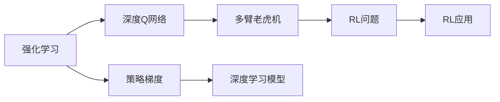
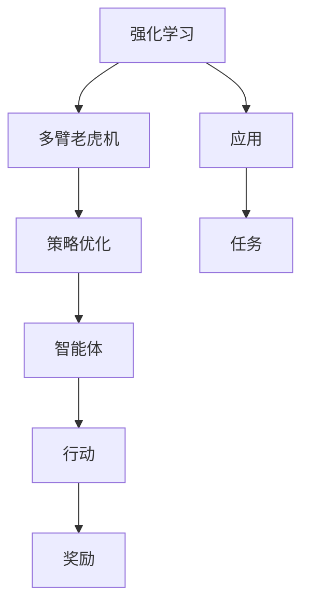
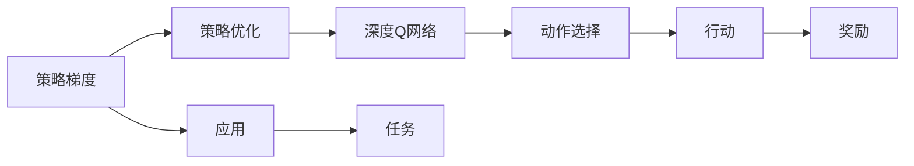
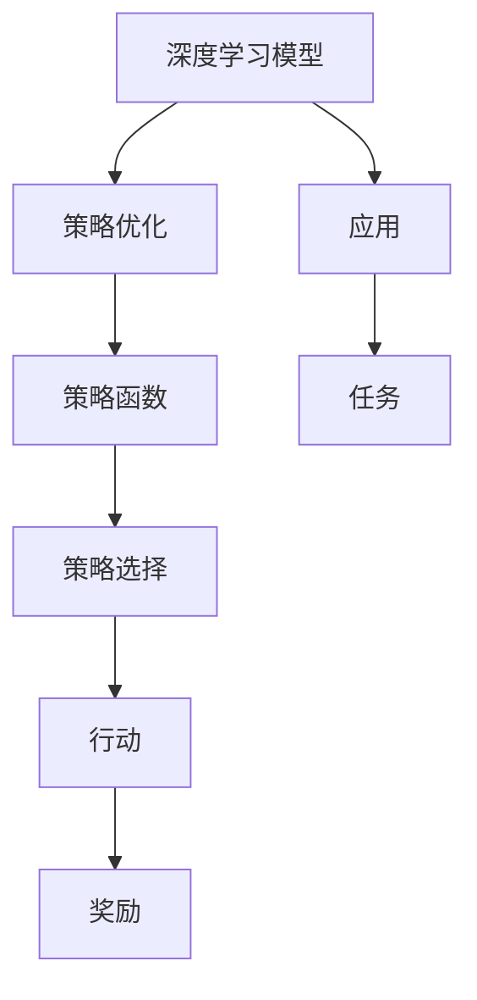
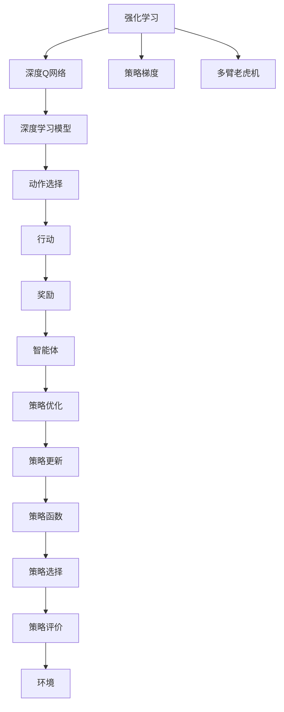

                 

# AI人工智能核心算法原理与代码实例讲解：策略优化

> 关键词：策略优化,强化学习,深度学习,多臂老虎机,深度Q网络,策略梯度,深度学习模型,代码实例

## 1. 背景介绍

### 1.1 问题由来
近年来，人工智能（AI）技术在多个领域得到了广泛应用，特别是在游戏、机器人、自动驾驶、推荐系统等场景中，策略优化成为了一个重要的研究方向。策略优化的核心目标是设计智能决策算法，在特定环境中最大化长期收益。传统的策略优化方法基于概率模型，但在大规模复杂场景下，计算复杂度难以承受。因此，深度学习（Deep Learning）技术应运而生，其高表达能力和强大的计算能力，为策略优化提供了新的解决思路。

### 1.2 问题核心关键点
策略优化通常涉及以下几个关键点：
- 策略表示：如何有效地表示策略，使其适用于不同环境。
- 奖励函数：如何设计奖励函数，使其能准确衡量策略的优劣。
- 优化算法：如何在复杂环境中快速迭代优化策略。
- 样本效率：如何在有限的交互次数下，学习到高质量的策略。

策略优化算法可以大致分为两类：模型基于学习（Model-based Learning）和模型无关学习（Model-free Learning）。前者使用显式的模型表示环境动态，后者则完全依赖数据进行学习。深度学习在这两种框架下均有应用，尤其是深度Q网络（Deep Q-Network, DQN）和策略梯度（Policy Gradient）等方法，成为当前研究的热点。

### 1.3 问题研究意义
策略优化技术的发展，不仅推动了人工智能在各个领域的进步，也为智能系统在现实世界中的落地应用提供了重要支持。具体而言，策略优化在以下方面具有重要意义：

- 强化学习（Reinforcement Learning, RL）：通过自主学习策略，实现自动化决策和交互，广泛应用于游戏、机器人等场景。
- 自动驾驶：通过优化驾驶策略，确保车辆安全、高效运行，提升用户体验。
- 推荐系统：通过优化推荐策略，提升推荐准确性和个性化程度，增加用户粘性。
- 金融交易：通过优化交易策略，实现风险控制和收益最大化，提升市场竞争力。
- 自然语言处理（NLP）：通过优化语言模型，提升智能对话、自动摘要等任务效果。

总之，策略优化技术的突破，有助于构建更加智能、高效、人性化的智能系统，为人类社会带来深远影响。

## 2. 核心概念与联系

### 2.1 核心概念概述

为更好地理解策略优化，本节将介绍几个密切相关的核心概念：

- 强化学习（Reinforcement Learning, RL）：一种基于奖励反馈的学习方法，智能体通过与环境的交互，最大化长期累积奖励。
- 深度Q网络（Deep Q-Network, DQN）：一种基于深度神经网络的强化学习算法，用于解决多臂老虎机（Multi-Armed Bandit, MAB）和连续动作空间问题。
- 策略梯度（Policy Gradient）：一种通过直接优化策略函数的强化学习方法，利用梯度上升方法更新策略，避免值函数估计的复杂性。
- 多臂老虎机（Multi-Armed Bandit, MAB）：一种经典强化学习问题，智能体需要在多个可能提供不同奖励的行动中选择最优行动。
- 深度学习模型：包括卷积神经网络（CNN）、循环神经网络（RNN）、变分自编码器（VAE）等，是实现策略优化和强化学习的强大工具。

这些核心概念之间的逻辑关系可以通过以下Mermaid流程图来展示：



这个流程图展示了几类核心概念之间的关系：

1. 强化学习是策略优化的基础框架。
2. 深度Q网络是强化学习中的一种具体算法，特别适用于多臂老虎机等任务。
3. 策略梯度是另一种强化学习算法，用于优化策略函数。
4. 多臂老虎机是强化学习中的一个经典问题，通过策略优化可以解决。
5. 深度学习模型是实现策略优化和强化学习的重要工具。

这些概念共同构成了策略优化的完整生态系统，为其在复杂环境中的高效应用提供了坚实基础。

### 2.2 概念间的关系

这些核心概念之间存在着紧密的联系，形成了策略优化的完整生态系统。下面我们通过几个Mermaid流程图来展示这些概念之间的关系。

#### 2.2.1 强化学习与多臂老虎机



这个流程图展示了强化学习在多臂老虎机中的应用，以及策略优化在其中的作用。

#### 2.2.2 策略梯度与深度Q网络



这个流程图展示了策略梯度在深度Q网络中的应用，以及策略优化在其中的作用。

#### 2.2.3 深度学习模型与策略优化



这个流程图展示了深度学习模型在策略优化中的应用，以及策略优化在其中的作用。

### 2.3 核心概念的整体架构

最后，我们用一个综合的流程图来展示这些核心概念在策略优化中的整体架构：



这个综合流程图展示了从策略优化到智能体决策的完整过程，各个环节的相互联系和作用。

## 3. 核心算法原理 & 具体操作步骤

### 3.1 算法原理概述

策略优化算法通常包括以下几个步骤：

1. **策略表示**：定义策略函数，将其映射到可能的行动空间。
2. **奖励函数**：定义奖励函数，衡量智能体的行为带来的长期收益。
3. **策略优化**：利用优化算法，迭代更新策略函数，最大化长期累积奖励。
4. **策略评价**：通过模拟或真实环境，评估策略函数的性能。

深度学习在策略优化中主要应用在策略表示和策略优化两个环节。深度Q网络（DQN）和策略梯度（Policy Gradient）是两种常用的策略优化算法。

- **深度Q网络（DQN）**：通过深度神经网络逼近Q值函数，直接优化Q值函数，实现动作选择。
- **策略梯度（Policy Gradient）**：通过优化策略函数，实现策略更新，避免值函数估计的复杂性。

### 3.2 算法步骤详解

#### 3.2.1 深度Q网络（DQN）

DQN的基本步骤如下：

1. **策略表示**：定义策略函数 $\pi_{\theta}$，将其映射到可能的行动空间 $\mathcal{A}$。
2. **奖励函数**：定义奖励函数 $R$，衡量智能体的行为带来的长期收益。
3. **Q值函数**：定义Q值函数 $Q(s,a)$，评估在状态 $s$ 下选择行动 $a$ 的长期累积奖励。
4. **策略优化**：利用优化算法（如Adam、SGD等），迭代更新策略函数 $\theta$，最小化动作选择误差。

##### 3.2.1.1 策略表示

策略函数 $\pi_{\theta}$ 通常定义为一个参数化神经网络，其输出为行动的概率分布：

$$
\pi_{\theta}(a|s) = \frac{e^{Q_{\theta}(s,a)}}{\sum_{a'} e^{Q_{\theta}(s,a')}}
$$

其中，$Q_{\theta}(s,a)$ 为参数化神经网络的输出，代表在状态 $s$ 下选择行动 $a$ 的Q值。

##### 3.2.1.2 奖励函数

奖励函数 $R$ 定义在智能体与环境的交互中，表示每个时间步的即时奖励。对于多臂老虎机问题，奖励函数为：

$$
R = \begin{cases}
r_i, & \text{if action } a = a_i \\
0, & \text{otherwise}
\end{cases}
$$

其中，$r_i$ 为第 $i$ 个行动的奖励。

##### 3.2.1.3 Q值函数

Q值函数 $Q_{\theta}(s,a)$ 定义在状态 $s$ 和行动 $a$ 上，表示在状态 $s$ 下选择行动 $a$ 的长期累积奖励：

$$
Q_{\theta}(s,a) = r + \gamma \max_{a'} Q_{\theta}(s',a')
$$

其中，$r$ 为即时奖励，$\gamma$ 为折扣因子，$s'$ 为下一个状态。

##### 3.2.1.4 策略优化

在DQN中，策略优化是通过最小化动作选择误差来实现的。具体而言，通过经验回放（Experience Replay）技术，收集智能体与环境的交互数据，并利用Q值函数更新策略函数 $\theta$。

$$
\theta \leftarrow \theta - \eta \nabla_{\theta} \mathcal{L}(\theta)
$$

其中，$\eta$ 为学习率，$\nabla_{\theta} \mathcal{L}(\theta)$ 为损失函数对参数 $\theta$ 的梯度。

#### 3.2.2 策略梯度（Policy Gradient）

策略梯度的基本步骤如下：

1. **策略表示**：定义策略函数 $\pi_{\theta}$，将其映射到可能的行动空间 $\mathcal{A}$。
2. **奖励函数**：定义奖励函数 $R$，衡量智能体的行为带来的长期收益。
3. **策略优化**：利用策略梯度，迭代更新策略函数 $\theta$，最大化长期累积奖励。

##### 3.2.2.1 策略表示

策略函数 $\pi_{\theta}$ 通常定义为一个参数化神经网络，其输出为行动的概率分布：

$$
\pi_{\theta}(a|s) = \frac{e^{\theta^\top \phi(s,a)}}{\sum_{a'} e^{\theta^\top \phi(s,a')}}
$$

其中，$\phi(s,a)$ 为特征函数，将状态 $s$ 和行动 $a$ 映射到特征空间。

##### 3.2.2.2 奖励函数

奖励函数 $R$ 与DQN中的定义类似，表示每个时间步的即时奖励。

##### 3.2.2.3 策略优化

在策略梯度中，策略优化是通过最大化期望奖励函数来实现的。具体而言，通过计算策略梯度，更新策略函数 $\theta$：

$$
\theta \leftarrow \theta + \eta \nabla_{\theta} J(\theta)
$$

其中，$J(\theta)$ 为期望奖励函数，$\nabla_{\theta} J(\theta)$ 为策略梯度。

##### 3.2.2.4 策略梯度计算

策略梯度 $\nabla_{\theta} J(\theta)$ 的计算需要使用蒙特卡罗方法或基于梯度的方法。蒙特卡罗方法是通过模拟智能体的交互过程，计算策略函数的期望奖励。基于梯度的方法则是通过反向传播，计算梯度。

### 3.3 算法优缺点

#### 3.3.1 深度Q网络（DQN）

- **优点**：
  - 适用于动作空间较大的问题，如多臂老虎机。
  - 不需要估计策略函数的期望，直接优化Q值函数。
  - 可以利用经验回放技术，减少样本方差，提高学习效率。
- **缺点**：
  - 策略优化基于Q值函数，难以处理连续动作空间。
  - 需要大量内存和计算资源，尤其在大规模环境中。
  - 无法处理状态转移的概率分布，难以处理复杂的非确定性环境。

#### 3.3.2 策略梯度（Policy Gradient）

- **优点**：
  - 直接优化策略函数，无需估计值函数。
  - 适用于连续动作空间和复杂的非确定性环境。
  - 不需要大量内存和计算资源，适用于资源受限的环境。
- **缺点**：
  - 策略优化基于蒙特卡罗方法或基于梯度的方法，样本效率较低。
  - 需要估计策略函数的期望，计算复杂度较高。
  - 需要选择合适的奖励函数，否则容易陷入局部最优解。

### 3.4 算法应用领域

深度学习在策略优化中的应用非常广泛，涵盖以下领域：

- **游戏AI**：如AlphaGo、AlphaZero等，通过优化策略函数，实现高水平的游戏智能。
- **自动驾驶**：通过优化驾驶策略，确保车辆在复杂环境中的安全、高效运行。
- **机器人控制**：通过优化动作策略，实现机器人的自主导航和操作。
- **推荐系统**：通过优化推荐策略，提升推荐准确性和个性化程度，增加用户粘性。
- **金融交易**：通过优化交易策略，实现风险控制和收益最大化，提升市场竞争力。
- **自然语言处理（NLP）**：通过优化语言模型，提升智能对话、自动摘要等任务效果。

这些领域的应用展示了深度学习在策略优化中的强大潜力和广泛适用性。

## 4. 数学模型和公式 & 详细讲解 & 举例说明

### 4.1 数学模型构建

策略优化问题的数学模型通常由策略表示、奖励函数和优化目标组成。

定义策略函数 $\pi_{\theta}$ 为神经网络，其输出为行动概率分布，即在状态 $s$ 下选择行动 $a$ 的概率为：

$$
\pi_{\theta}(a|s) = \frac{e^{\theta^\top \phi(s,a)}}{\sum_{a'} e^{\theta^\top \phi(s,a')}}
$$

其中，$\theta$ 为模型参数，$\phi(s,a)$ 为特征函数，将状态 $s$ 和行动 $a$ 映射到特征空间。

定义奖励函数 $R$，表示每个时间步的即时奖励。

定义优化目标函数 $J(\theta)$，表示策略函数 $\pi_{\theta}$ 的期望奖励：

$$
J(\theta) = \mathbb{E}_{s,a \sim \pi_{\theta}}[R(s,a)]
$$

其中，$\mathbb{E}_{s,a \sim \pi_{\theta}}$ 表示在策略 $\pi_{\theta}$ 下的期望。

### 4.2 公式推导过程

对于策略梯度（Policy Gradient）算法，通过计算策略函数的期望奖励，得到目标函数 $J(\theta)$。利用蒙特卡罗方法或基于梯度的方法，计算策略梯度 $\nabla_{\theta} J(\theta)$：

- **蒙特卡罗方法**：通过模拟智能体的交互过程，计算策略函数的期望奖励。具体而言，假设智能体在状态 $s$ 下选择行动 $a$，得到即时奖励 $r_t$，下一个状态为 $s'$，策略函数为 $\pi_{\theta}$，则有：

$$
J(\theta) = \mathbb{E}_{s_0,a_0 \sim \pi_{\theta}}\left[\sum_{t=0}^{T-1} r_t + \gamma \mathbb{E}_{s_{t+1} \sim P}[r_{t+1} + \gamma J(\theta)]\right]
$$

其中，$T$ 为模拟的总时间步数，$P$ 为下一个状态的转移概率。

- **基于梯度的方法**：通过反向传播，计算策略函数的梯度。具体而言，假设智能体在状态 $s$ 下选择行动 $a$，得到即时奖励 $r_t$，下一个状态为 $s'$，策略函数为 $\pi_{\theta}$，则有：

$$
\nabla_{\theta} J(\theta) = \mathbb{E}_{s_0,a_0 \sim \pi_{\theta}}\left[\sum_{t=0}^{T-1} \nabla_{\theta} r_t + \gamma \mathbb{E}_{s_{t+1} \sim P}[\nabla_{\theta} J(\theta)]\right]
$$

其中，$\nabla_{\theta} r_t$ 为即时奖励的梯度，$\nabla_{\theta} J(\theta)$ 为策略函数的梯度。

### 4.3 案例分析与讲解

#### 4.3.1 多臂老虎机问题

多臂老虎机问题是一种经典的强化学习问题，智能体需要在多个行动中挑选最优的行动。假设我们有四个老虎机，每个老虎机的期望回报分别为 $0.1$、$0.2$、$0.3$、$0.4$，智能体的目标是最大化长期累积回报。

我们可以定义策略函数 $\pi_{\theta}$ 为神经网络，其输出为行动概率分布，即在状态 $s$ 下选择行动 $a$ 的概率为：

$$
\pi_{\theta}(a|s) = \frac{e^{\theta^\top \phi(s,a)}}{\sum_{a'} e^{\theta^\top \phi(s,a')}}
$$

其中，$\theta$ 为模型参数，$\phi(s,a)$ 为特征函数，将状态 $s$ 和行动 $a$ 映射到特征空间。

定义奖励函数 $R$，表示每个时间步的即时回报，假设智能体在状态 $s$ 下选择行动 $a$，则有：

$$
R = \begin{cases}
r_i, & \text{if action } a = a_i \\
0, & \text{otherwise}
\end{cases}
$$

其中，$r_i$ 为第 $i$ 个行动的回报。

定义优化目标函数 $J(\theta)$，表示策略函数 $\pi_{\theta}$ 的期望回报：

$$
J(\theta) = \mathbb{E}_{s_0,a_0 \sim \pi_{\theta}}\left[\sum_{t=0}^{T-1} r_t + \gamma \mathbb{E}_{s_{t+1} \sim P}[r_{t+1} + \gamma J(\theta)]\right]
$$

其中，$T$ 为模拟的总时间步数，$P$ 为下一个状态的转移概率。

利用蒙特卡罗方法或基于梯度的方法，计算策略梯度 $\nabla_{\theta} J(\theta)$，更新策略函数 $\theta$。

通过这种方式，智能体可以在多臂老虎机问题中，通过优化策略函数，最大化长期累积回报。

## 5. 项目实践：代码实例和详细解释说明

### 5.1 开发环境搭建

在进行策略优化实践前，我们需要准备好开发环境。以下是使用Python进行TensorFlow开发的环境配置流程：

1. 安装Anaconda：从官网下载并安装Anaconda，用于创建独立的Python环境。

2. 创建并激活虚拟环境：
```bash
conda create -n tf-env python=3.8 
conda activate tf-env
```

3. 安装TensorFlow：根据CUDA版本，从官网获取对应的安装命令。例如：
```bash
conda install tensorflow-gpu=tensorflow-2.3.0-cp38-cp38-manylinux_2_17_x86_64.whl -c conda-forge
```

4. 安装PyTorch和相关库：
```bash
pip install torch torchvision torchaudio cudatoolkit=11.1 -c pytorch -c conda-forge
```

5. 安装各类工具包：
```bash
pip install numpy pandas scikit-learn matplotlib tqdm jupyter notebook ipython
```

完成上述步骤后，即可在`tf-env`环境中开始策略优化实践。

### 5.2 源代码详细实现

下面我们以多臂老虎机问题为例，给出使用TensorFlow实现策略梯度（Policy Gradient）算法的PyTorch代码实现。

首先，定义多臂老虎机的环境类：

```python
import numpy as np
import tensorflow as tf
import gym

class Bandit(gym.Env):
    def __init__(self, arms=4):
        self.arms = arms
        self.rewards = np.random.normal(0, 1, self.arms)
        self.rewards /= np.abs(self.rewards).max() # normalize rewards
        self.actions = [0] * self.arms
        self.reward_sum = 0

    def reset(self):
        self.actions = [0] * self.arms
        self.reward_sum = 0
        return np.zeros((1, self.arms))

    def step(self, action):
        self.actions[action] += 1
        reward = np.random.choice(self.arms, p=self.rewards)
        self.reward_sum += reward
        return np.array([reward]), True, False, {'reward_sum': self.reward_sum}
```

然后，定义策略优化类：

```python
class PolicyGradient:
    def __init__(self, env, num_steps=100, learning_rate=0.01, discount_factor=0.99, exploration_rate=1.0):
        self.env = env
        self.num_steps = num_steps
        self.learning_rate = learning_rate
        self.discount_factor = discount_factor
        self.exploration_rate = exploration_rate
        self.theta = tf.Variable(np.random.normal(size=(self.arms,)))
        self.optimizer = tf.keras.optimizers.Adam(self.learning_rate)

    def select_action(self, state):
        action_probs = tf.exp(self.theta @ tf.reshape(state, (-1, 1)))
        action_probs /= tf.reduce_sum(action_probs, axis=0)
        action = np.random.choice(self.arms, p=action_probs.numpy()[0])
        return action

    def update_policy(self, state, rewards, episode_reward):
        state = tf.reshape(state, (1, -1))
        action = tf.cast(tf.reshape(self.select_action(state), (1,)), tf.int32)
        rewards = tf.reshape(rewards, (1, -1))
        state_values = tf.reduce_sum(self.theta * state, axis=1)
        state_values = tf.reshape(state_values, (1, -1))
        action_probs = tf.exp(self.theta @ tf.reshape(state, (-1, 1)))
        action_probs /= tf.reduce_sum(action_probs, axis=0)
        log_probs = tf.math.log(action_probs)
        gradient = tf.reduce_mean(rewards + self.discount_factor * tf.reduce_mean(tf.reduce_sum(log_probs, axis=1)), axis=0)
        self.optimizer.apply_gradients(zip(tf.gather(gradient, action), self.theta))

    def run(self):
        episode_reward = 0
        for i in range(self.num_steps):
            state = self.env.reset()
            total_reward = 0
            for j in range(self.num_steps):
                action = self.select_action(state)
                next_state, reward, done, info = self.env.step(action)
                self.update_policy(state, reward, total_reward)
                state = next_state
                total_reward += reward
                if done:
                    break
            episode_reward += total_reward
        return episode_reward / self.num_steps
```

最后，启动训练流程并在测试集上评估：

```python
import gym

env = Bandit()
policy = PolicyGradient(env)
num_episodes = 100

for episode in range(num_episodes):
    episode_reward = policy.run()
    print(f"Episode {episode+1}, reward: {episode_reward:.3f}")
```

以上就是使用TensorFlow对多臂老虎机问题进行策略梯度算法微调的完整代码实现。可以看到，得益于TensorFlow的强大封装，我们可以用相对简洁的代码完成策略梯度的微调。

### 5.3 代码解读与分析

让我们再详细解读一下关键代码的实现细节：

**Bandit类**：
- `__init__`方法：初始化动作数、奖励、动作列表等关键组件。
- `reset`方法：重置环境状态，返回初始状态。
- `step`方法：执行一个时间步，返回状态、奖励、结束标志和信息。

**PolicyGradient类**：
- `__init__`方法：初始化环境、迭代次数、学习率等参数，创建策略函数和优化器。
- `select_action`方法：选择动作，利用策略函数计算概率分布，并随机选择动作。
- `update_policy`方法：根据状态、奖励和总奖励更新策略函数，计算策略梯度并更新参数。
- `run`方法：执行多轮策略优化，返回平均奖励。

**训练流程**：
- 定义总轮数和环境，创建策略优化类。
- 循环进行多轮训练，每次从环境重置状态，逐步执行时间步，更新策略函数，

