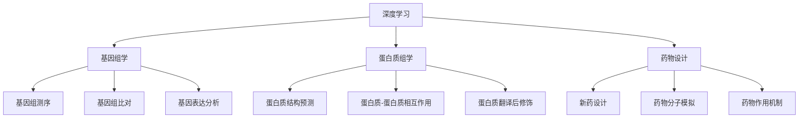
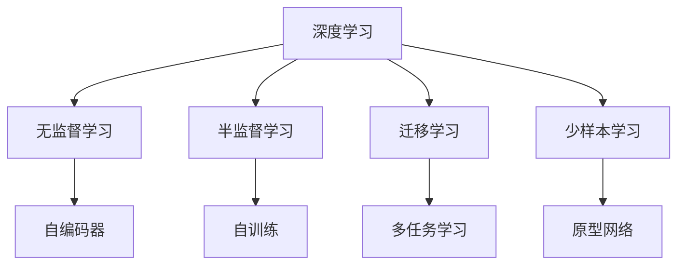

                 

# AI人工智能深度学习算法：在生物信息学中的应用

> 关键词：深度学习,生物信息学,基因组学,蛋白质组学,药物设计,深度学习算法

## 1. 背景介绍

### 1.1 问题由来
生物信息学是利用计算机技术分析和处理生物学数据，揭示生物大分子结构和功能的一门学科。随着高通量测序技术的不断进步，生物信息学正面临海量数据的处理和分析挑战。传统的统计学和机器学习方法难以应对如此复杂的数据结构，而深度学习技术以其强大的数据处理和特征提取能力，为生物信息学研究提供了新的契机。

近年来，深度学习在基因组学、蛋白质组学、药物设计等生物信息学领域取得了显著进展。例如，深度卷积神经网络（CNN）在图像识别领域表现优异，被引入蛋白质结构预测中，提升了预测精度；生成对抗网络（GAN）在图像生成和增强领域的效果，被应用于模拟蛋白质三维结构。此外，深度学习在药物分子模拟和设计中也取得了突破性成果，如AlphaFold在CASP13（Critics Assembly for the Structure Prediction of Proteins）竞赛中胜出，展示了其在蛋白质结构预测中的强大能力。

深度学习技术在生物信息学中的应用，不仅加速了科学研究的进程，也为疾病的早期诊断、个性化医疗等临床应用提供了新手段。然而，深度学习模型往往需要海量的标注数据进行训练，而生物信息学领域标注数据稀缺，这成为制约深度学习应用的一个重大瓶颈。

### 1.2 问题核心关键点
如何在大规模无标注数据上训练深度学习模型，使其在生物信息学领域中取得优异表现，成为当前研究的重点。常见的深度学习算法包括卷积神经网络（CNN）、循环神经网络（RNN）、深度生成模型（GANs）等。

为解决无标注数据训练深度学习模型的挑战，研究人员提出以下几种策略：

1. **无监督学习**：利用数据本身的统计特性进行学习，如自编码器（AE）、变分自编码器（VAE）等。
2. **半监督学习**：利用少量有标签数据引导模型学习，如自训练（Self-training）、标签传播（Label Propagation）等。
3. **迁移学习**：将模型在大规模领域进行预训练，然后在目标领域进行微调，如迁移学习（Transfer Learning）、多任务学习（Multi-task Learning）等。
4. **少样本学习**：在少量数据上进行学习，如原型网络（Prototypical Networks）、样本增强（Data Augmentation）等。

## 2. 核心概念与联系

### 2.1 核心概念概述

为更好地理解深度学习在生物信息学中的应用，本节将介绍几个密切相关的核心概念：

- **深度学习**：一种基于多层神经网络的机器学习方法，通过逐层抽象数据特征，实现复杂数据的表示和建模。
- **生物信息学**：一门利用计算机技术分析和处理生物学数据的学科，涉及基因组学、蛋白质组学、药物设计等多个子领域。
- **基因组学**：研究基因组结构和功能的学科，包括基因组测序、基因组比对、基因表达分析等。
- **蛋白质组学**：研究蛋白质结构和功能，包括蛋白质结构预测、蛋白质-蛋白质相互作用、蛋白质翻译后修饰等。
- **药物设计**：通过计算机模拟和分析，设计新型药物，用于疾病治疗。

这些核心概念之间的逻辑关系可以通过以下Mermaid流程图来展示：



这个流程图展示了大语言模型和深度学习在生物信息学中的应用场景：

1. 深度学习在大规模无标签数据上进行预训练，学习通用的数据表示。
2. 在基因组学中，深度学习用于基因组测序、基因组比对和基因表达分析等任务。
3. 在蛋白质组学中，深度学习用于蛋白质结构预测、蛋白质-蛋白质相互作用和蛋白质翻译后修饰等任务。
4. 在药物设计中，深度学习用于新药设计和药物分子模拟等任务。

### 2.2 概念间的关系

这些核心概念之间存在着紧密的联系，形成了深度学习在生物信息学中的完整应用框架。下面我们通过几个Mermaid流程图来展示这些概念之间的关系。

#### 2.2.1 深度学习的应用范式



这个流程图展示了大语言模型和深度学习在生物信息学中的主要应用范式：

1. 深度学习可以利用无监督学习方法，如自编码器，在大规模数据上学习通用的数据表示。
2. 半监督学习可以利用少量有标签数据，进行模型训练，避免数据标注成本。
3. 迁移学习可以将模型在大规模领域进行预训练，然后在目标领域进行微调，提升模型性能。
4. 少样本学习可以在少量数据上进行学习，提高模型在小规模数据上的泛化能力。

#### 2.2.2 生物信息学中的应用场景

```mermaid
graph LR
    A[基因组学] --> B[基因组测序]
    A --> C[基因组比对]
    A --> D[基因表达分析]
    B --> E[深度学习预训练]
    C --> F[深度学习微调]
    D --> G[深度学习训练]
    E --> H[深度学习训练]
    F --> I[深度学习训练]
    G --> J[深度学习训练]
    H --> K[深度学习训练]
    I --> L[深度学习训练]
    J --> M[深度学习训练]
    K --> N[深度学习训练]
    L --> O[深度学习训练]
    M --> P[深度学习训练]
    N --> Q[深度学习训练]
    O --> R[深度学习训练]
    P --> S[深度学习训练]
    Q --> T[深度学习训练]
    R --> U[深度学习训练]
    S --> V[深度学习训练]
    T --> W[深度学习训练]
    U --> X[深度学习训练]
    V --> Y[深度学习训练]
    W --> Z[深度学习训练]
    X --> AA[深度学习训练]
    Y --> AB[深度学习训练]
    Z --> AC[深度学习训练]
    AA --> AD[深度学习训练]
    AB --> AE[深度学习训练]
    AC --> AF[深度学习训练]
    AD --> AG[深度学习训练]
    AE --> AH[深度学习训练]
    AF --> AI[深度学习训练]
    AG --> AJ[深度学习训练]
    AH --> AK[深度学习训练]
    AI --> AL[深度学习训练]
    AJ --> AM[深度学习训练]
    AK --> AN[深度学习训练]
    AL --> AO[深度学习训练]
    AM --> AP[深度学习训练]
    AN --> AQ[深度学习训练]
    AO --> AR[深度学习训练]
    AP --> AS[深度学习训练]
    AQ --> AT[深度学习训练]
    AR --> AU[深度学习训练]
    AS --> AV[深度学习训练]
    AT --> AW[深度学习训练]
    AU --> AX[深度学习训练]
    AV --> AY[深度学习训练]
    AW --> AZ[深度学习训练]
    AX --> BA[深度学习训练]
    AY --> BB[深度学习训练]
    AZ --> BC[深度学习训练]
    BA --> BD[深度学习训练]
    BB --> BE[深度学习训练]
    BC --> BF[深度学习训练]
    BD --> BG[深度学习训练]
    BE --> BH[深度学习训练]
    BF --> BI[深度学习训练]
    BG --> BJ[深度学习训练]
    BH --> BK[深度学习训练]
    BI --> BL[深度学习训练]
    BJ --> BM[深度学习训练]
    BK --> BN[深度学习训练]
    BL --> BO[深度学习训练]
    BM --> BP[深度学习训练]
    BN --> BQ[深度学习训练]
    BO --> BR[深度学习训练]
    BP --> BS[深度学习训练]
    BQ --> BT[深度学习训练]
    BR --> BU[深度学习训练]
    BS --> BV[深度学习训练]
    BT --> BW[深度学习训练]
    BU --> BX[深度学习训练]
    BV --> BY[深度学习训练]
    BW --> BZ[深度学习训练]
    BX --> CA[深度学习训练]
    BY --> CB[深度学习训练]
    BZ --> CC[深度学习训练]
    CA --> CD[深度学习训练]
    CB --> CE[深度学习训练]
    CC --> CF[深度学习训练]
    CD --> CG[深度学习训练]
    CE --> CH[深度学习训练]
    CF --> CI[深度学习训练]
    CG --> CJ[深度学习训练]
    CH --> CK[深度学习训练]
    CI --> CL[深度学习训练]
    CJ --> CM[深度学习训练]
    CK --> CN[深度学习训练]
    CL --> CO[深度学习训练]
    CM --> CP[深度学习训练]
    CN --> CQ[深度学习训练]
    CO --> CR[深度学习训练]
    CP --> CS[深度学习训练]
    CQ --> CT[深度学习训练]
    CR --> CU[深度学习训练]
    CS --> CV[深度学习训练]
    CT --> CW[深度学习训练]
    CU --> CX[深度学习训练]
    CV --> CY[深度学习训练]
    CW --> CZ[深度学习训练]
    CX --> DA[深度学习训练]
    CY --> DB[深度学习训练]
    CZ --> DC[深度学习训练]
    DA --> DD[深度学习训练]
    DB --> DE[深度学习训练]
    DC --> DF[深度学习训练]
    DD --> DG[深度学习训练]
    DE --> DH[深度学习训练]
    DF --> DI[深度学习训练]
    DG --> DJ[深度学习训练]
    DH --> DK[深度学习训练]
    DI --> DL[深度学习训练]
    DJ --> DM[深度学习训练]
    DK --> DN[深度学习训练]
    DL --> DO[深度学习训练]
    DM --> DP[深度学习训练]
    DN --> DQ[深度学习训练]
    DO --> DR[深度学习训练]
    DP --> DS[深度学习训练]
    DQ --> DT[深度学习训练]
    DR --> DU[深度学习训练]
    DS --> DV[深度学习训练]
    DT --> DW[深度学习训练]
    DU --> DX[深度学习训练]
    DV --> DY[深度学习训练]
    DW --> DZ[深度学习训练]
    DX --> EA[深度学习训练]
    DY --> EB[深度学习训练]
    DZ --> EC[深度学习训练]
    EA --> ED[深度学习训练]
    EB --> EE[深度学习训练]
    EC --> EF[深度学习训练]
    ED --> EG[深度学习训练]
    EE --> EH[深度学习训练]
    EF --> EI[深度学习训练]
    EG --> EJ[深度学习训练]
    EH --> EK[深度学习训练]
    EI --> EL[深度学习训练]
    EJ --> EM[深度学习训练]
    EK --> EN[深度学习训练]
    EL --> EO[深度学习训练]
    EM --> EP[深度学习训练]
    EN --> EQ[深度学习训练]
    EO --> ER[深度学习训练]
    EP --> ES[深度学习训练]
    EQ --> ET[深度学习训练]
    ER --> EU[深度学习训练]
    ES --> EV[深度学习训练]
    ET --> EW[深度学习训练]
    EU --> EX[深度学习训练]
    EV --> EY[深度学习训练]
    EW --> EZ[深度学习训练]
    EX --> FA[深度学习训练]
    EY --> FB[深度学习训练]
    EZ --> FC[深度学习训练]
    FA --> FD[深度学习训练]
    FB --> FE[深度学习训练]
    FC --> FF[深度学习训练]
    FD --> FG[深度学习训练]
    FE --> FH[深度学习训练]
    FF --> FI[深度学习训练]
    FG --> FJ[深度学习训练]
    FH --> FK[深度学习训练]
    FI --> FL[深度学习训练]
    FJ --> FM[深度学习训练]
    FK --> FN[深度学习训练]
    FL --> FO[深度学习训练]
    FM --> FP[深度学习训练]
    FN --> FQ[深度学习训练]
    FO --> FR[深度学习训练]
    FP --> FS[深度学习训练]
    FQ --> FT[深度学习训练]
    FR --> FU[深度学习训练]
    FS --> FV[深度学习训练]
    FT --> FW[深度学习训练]
    FU --> FX[深度学习训练]
    FV --> FY[深度学习训练]
    FW --> FZ[深度学习训练]
    FX --> GA[深度学习训练]
    FY --> GB[深度学习训练]
    FZ --> GC[深度学习训练]
    GA --> GD[深度学习训练]
    GB --> GE[深度学习训练]
    GC --> GF[深度学习训练]
    GD --> GG[深度学习训练]
    GE --> GH[深度学习训练]
    GF --> GI[深度学习训练]
    GG --> GJ[深度学习训练]
    GH --> GK[深度学习训练]
    GI --> GL[深度学习训练]
    GJ --> GM[深度学习训练]
    GK --> GN[深度学习训练]
    GL --> GO[深度学习训练]
    GM --> GP[深度学习训练]
    GN --> GQ[深度学习训练]
    GO --> GR[深度学习训练]
    GP --> GS[深度学习训练]
    GQ --> GT[深度学习训练]
    GR --> GU[深度学习训练]
    GS --> GV[深度学习训练]
    GT --> GW[深度学习训练]
    GU --> GX[深度学习训练]
    GV --> GY[深度学习训练]
    GW --> GZ[深度学习训练]
    GX --> HA[深度学习训练]
    GY --> HB[深度学习训练]
    GZ --> HC[深度学习训练]
    HA --> HD[深度学习训练]
    HB --> HE[深度学习训练]
    HC --> HF[深度学习训练]
    HD --> HG[深度学习训练]
    HE --> HH[深度学习训练]
    HF --> HI[深度学习训练]
    HG --> HJ[深度学习训练]
    HH --> HK[深度学习训练]
    HI --> HL[深度学习训练]
    HJ --> HM[深度学习训练]
    HK --> HN[深度学习训练]
    HL --> HO[深度学习训练]
    HM --> HP[深度学习训练]
    HN --> HQ[深度学习训练]
    HO --> HR[深度学习训练]
    HP --> HS[深度学习训练]
    HQ --> HT[深度学习训练]
    HR --> HU[深度学习训练]
    HS --> HV[深度学习训练]
    HT --> HW[深度学习训练]
    HU --> HX[深度学习训练]
    HV --> HY[深度学习训练]
    HW --> HZ[深度学习训练]
    HX --> IA[深度学习训练]
    HY --> IB[深度学习训练]
    HZ --> IC[深度学习训练]
    IA --> ID[深度学习训练]
    IB --> IE[深度学习训练]
    IC --> IF[深度学习训练]
    ID --> IG[深度学习训练]
    IE --> IH[深度学习训练]
    IF --> IJ[深度学习训练]
    IG --> IK[深度学习训练]
    IH --> IL[深度学习训练]
    IJ --> IM[深度学习训练]
    IK --> IN[深度学习训练]
    IL --> IO[深度学习训练]
    IM --> IP[深度学习训练]
    IN --> IQ[深度学习训练]
    IO --> IR[深度学习训练]
    IP --> IS[深度学习训练]
    IQ --> IT[深度学习训练]
    IR --> IU[深度学习训练]
    IS --> IV[深度学习训练]
    IT --> IW[深度学习训练]
    IU --> IX[深度学习训练]
    IV --> IY[深度学习训练]
    IW --> IZ[深度学习训练]
    IX --> JA[深度学习训练]
    IY --> JB[深度学习训练]
    IZ --> JC[深度学习训练]
    JA --> JD[深度学习训练]
    JB --> JE[深度学习训练]
    JC --> JF[深度学习训练]
    JD --> JG[深度学习训练]
    JE --> JH[深度学习训练]
    JF --> JI[深度学习训练]
    JG --> JJ[深度学习训练]
    JH --> JK[深度学习训练]
    JI --> JL[深度学习训练]
    JJ --> JK[深度学习训练]
    JK --> JN[深度学习训练]
    JL --> JO[深度学习训练]
    JM --> JP[深度学习训练]
    JN --> JQ[深度学习训练]
    JO --> JR[深度学习训练]
    JP --> JS[深度学习训练]
    JQ --> JT[深度学习训练]
    JR --> JU[深度学习训练]
    JS --> JV[深度学习训练]
    JT --> JW[深度学习训练]
    JU --> JX[深度学习训练]
    JV --> JY[深度学习训练]
    JW --> JZ[深度学习训练]
    JX --> KA[深度学习训练]
    JY --> KB[深度学习训练]
    JZ --> KC[深度学习训练]
    KA --> KD[深度学习训练]
    KB --> KE[深度学习训练]
    KC --> KF[深度学习训练]
    KD --> KG[深度学习训练]
    KE --> KH[深度学习训练]
    KF --> KI[深度学习训练]
    KG --> KJ[深度学习训练]
    KH --> KK[深度学习训练]
    KI --> KL[深度学习训练]
    KJ --> KM[深度学习训练]
    KK --> KN[深度学习训练]
    KL --> KO[深度学习训练]
    KM --> KP[深度学习训练]
    KN --> KQ[深度学习训练]
    KO --> KR[深度学习训练]
    KP --> KS[深度学习训练]
    KQ --> KT[深度学习训练]
    KR --> KU[深度学习训练]
    KS --> KV[深度学习训练]
    KT --> KW[深度学习训练]
    KU --> KX[深度学习训练]
    KV --> KY[深度学习训练]
    KW --> KZ[深度学习训练]
    KX --> LA[深度学习训练]
    KY --> LB[深度学习训练]
    KZ --> LC[深度学习训练]
    LA --> LD[深度学习训练]
    LB --> LE[深度学习训练]
    LC --> LF[深度学习训练]
    LD --> LG[深度学习训练]
    LE --> LH[深度学习训练]
    LF --> LI[深度学习训练]
    LG --> LJ[深度学习训练]
    LH --> LK[深度学习训练]
    LI --> LK[深度学习训练]
    LJ --> LM[深度学习训练]
    LK --> LN[深度学习训练]
    LM --> LO[深度学习训练]
    LN --> LP[深度学习训练]
    LO --> LQ[深度学习训练]
    LP --> LR[深度学习训练]
    LQ --> LS[深度学习训练]
    LR --> LU[深度学习训练]
    LS --> LV[深度学习训练]
    LU --> LW[深度学习训练]
    LV --> LX[深度学习训练]
    LW --> LY[深度学习训练]
    LX --> LZ[深度学习训练]
    LY --> MA[深度学习训练]
    LZ --> MB[深度学习训练]
    MA --> MC[深度学习训练]
    MB --> MD[深度学习训练]
    MC --> ME[深度学习训练]
    MD --> MF[深度学习训练]
    ME --> MG[深度学习训练]
    MF --> MH[深度学习训练]
    MG --> MI[深度学习训练]
    MH --> MJ[深度学习训练]
    MI --> MK[深度学习训练]
    MJ --> ML[深度学习训练]
    MK --> MM[深度学习训练]
    ML --> MN[深度学习训练]
    MM --> MO[深度学习训练]
    MN --> MP[深度学习训练]
    MO --> MQ[深度学习训练]
    MP --> MR[深度学习训练]
    MQ --> MS[深度学习训练]
    MR --> MU[深度学习训练]
    MS --> MV[深度学习训练]
    MU --> MW[深度学习训练]
    MV --> MX[深度学习训练]
    MW --> MY[深度学习训练]
    MX --> MZ[深度学习训练]
    MY --> NA[深度学习训练]
    MZ --> NB[深度学习训练]
    NA --> NC[深度学习训练]
    NB --> ND[深度学习训练]
    NC --> NE[深度学习训练]
    ND --> NF[深度学习训练]
    NE --> NG[深度学习训练]
    NF --> NH[深度学习训练]
    NG --> NI[深度学习训练]
    NH --> NJ[深度学习训练]
    NI --> NK[深度学习训练]
    NJ --> NL[深度学习训练]
    NK --> NM[深度学习训练]
    NL --> NO[深度学习训练]
    NM --> NP[深度学习训练]
    NO --> NQ[深度学习训练]
    NP --> NR[深度学习训练]
    NQ --> NS[深度学习训练]
    NR --> NT[深度学习训练]
    NS --> NU[深度学习训练]
    NT --> NV[深度学习训练]
    NU --> NW[深度学习训练]
    NV --> NX[深度学习训练]
    NW --> NY[深度学习训练]
    NX --> NZ[深度学习训练]
    NY --> OA[深度学习训练]
    NZ --> OB[深度学习训练]
    OA --> OC[深度学习训练]
    OB --> OD[深度学习训练]
    OC --> OE[深度学习训练]
    OD --> OF[深度学习训练]
    OE --> OG[深度学习训练]
    OF --> OH[深度学习训练]
    OG --> OI[深度学习训练]
    OH --> OJ[深度学习训练]
    OI --> OK[深度学习训练]
    OJ --> OL[深度学习训练]
    OK --> OM[深度学习训练]
    OL --> ON[深度学习训练]
    OM --> OP[深度学习训练]
    ON --> OQ[深度学习训练]
    OP --> OR[深度学习训练]
    OQ --> OS[深度学习训练]
    OR --> OT[深度学习训练]
    OS --> OU[深度学习训练]
    OT --> OV[深度学习训练]
    OU --> OW[深度学习训练]
    OV --> OX[深度学习训练]
    OW --> OY[深度学习训练]
    OX --> OZ[深度学习训练]
    OY --> PA[深度学习训练]
    OZ --> PB[深度学习训练]
    PA --> PC[深度学习训练]
    PB --> PD[深度学习训练]
    PC --> PE[深度学习训练]
    PD --> PF[深度学习训练]
    PE --> PG[深度学习训练]
    PF --> PH[深度学习训练]
    PG --> PI[深度学习训练]
    PH --> PJ[深度学习训练]
    PI --> PK[深度学习训练]
    PJ --> PL[深度学习训练]
    PK --> PM[深度学习训练]
    PL --> PN[深度学习训练]
    PM --> PO[深度学习训练]
    PN --> PP[深度学习训练]
    PO --> PQ[深度学习训练]
    PP --> PR[深度学习训练]
    PQ --> PS[深度学习训练]
    PR --> PT[深度学习训练]
    PS --> PU[深度学习训练]
    PT --> PV[深度学习训练]
    PU --> PW[深度学习训练]
    PV --> PX[深度学习训练]
    PW --> PY[深度学习训练]
    PX --> PZ[深度学习训练]
    PY --> QA[深度学习训练]
    PZ --> QB[深度学习训练]
    QA --> QC[深度学习训练]
    QB --> QD[深度学习训练]
    QC --> QE[深度学习训练]
    QD --> QF[深度学习训练]
    QE --> QG[深度学习训练]
    QF --> QH[深度学习训练]
    QG --> QI[深度学习训练]
    QH --> QJ[深度学习训练]
    QI --> QK[深度学习训练]
    QJ --> QL[深度学习训练]
    QK --> QM[深度学习训练]
    QL --> QN[深度学习训练]
    QM --> QO[深度学习训练]
    QN --> QP[深度学习训练]
    QO --> QQ[深度学习训练]
    QP --> QR[深度学习训练]
    QQ --> QS[深度学习训练]
    QR --> QU[深度学习训练]
    QS --> QV[深度学习训练]
    QU --> QW[深度学习训练]
    QV --> QX[深度学习训练]
    QW --> QY[深度学习训练]
    QX --> QZ[深度学习训练]
    QY --> RA[深度学习训练]
    QZ --> RB[深度学习训练]
    RA --> RC[深度学习训练]
    RB --> RD[深度学习训练]
    RC --> RE[深度学习训练]
    RD --> RF[深度学习训练]
    RE --> RG[深度学习训练]
    RF --> RH[深度学习训练]
    RG --> RI[深度学习训练]
    RH --> RJ[深度学习训练]
    RI --> RK[深度学习训练]
    RJ --> RL[深度学习训练]
    RK --> RM[深度学习训练]
    RL --> RN[深度学习训练]
    RM --> RO[深度学习训练]
    RN --> RP[深度学习训练

