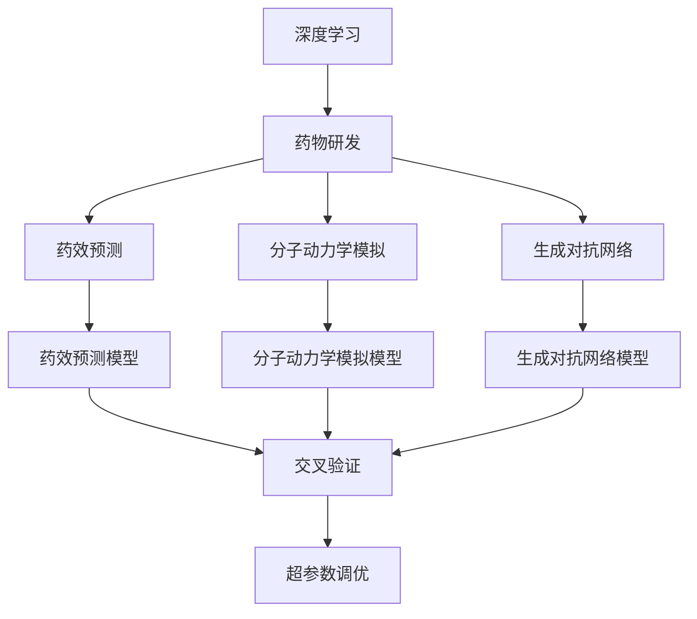
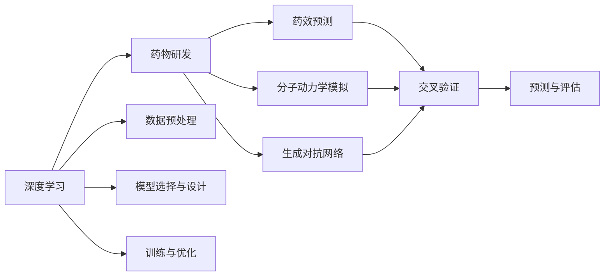
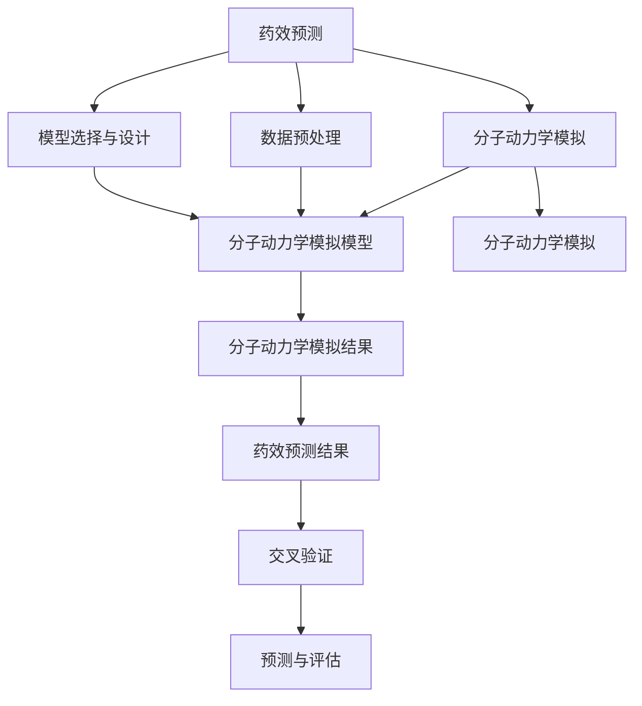
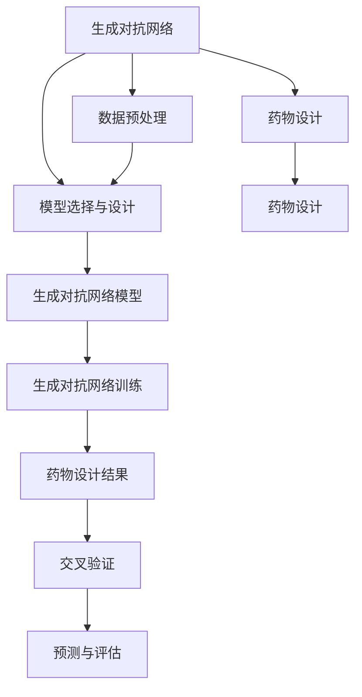
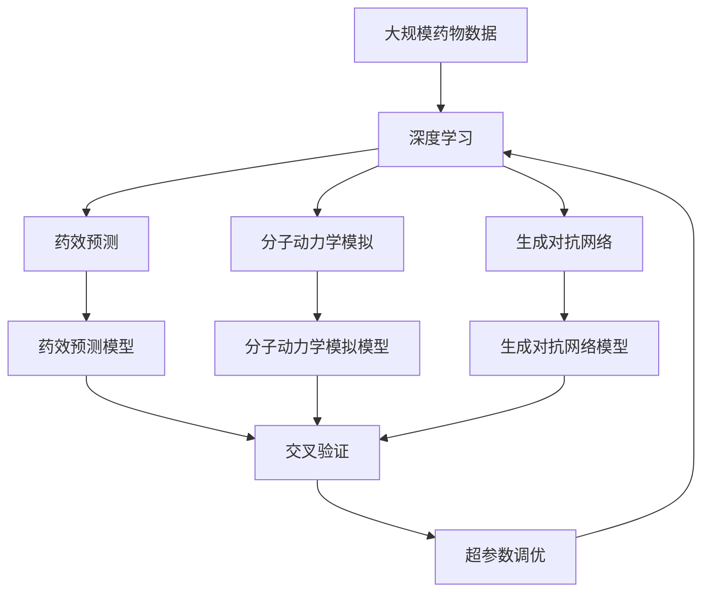

                 

# AI人工智能深度学习算法：在药物研发中的应用

> 关键词：深度学习,药物研发,药效预测,分子动力学模拟,药物设计

## 1. 背景介绍

### 1.1 问题由来
近年来，随着深度学习技术的飞速发展，其在药物研发领域的应用逐渐显现出巨大的潜力。传统的药物研发过程通常需要耗费数年时间，成本高达数十亿人民币，但成功率仅约为10%。而利用深度学习技术，可以在数据驱动下加速药物研发的进程，显著降低研发成本，提高成功率。

深度学习在药物研发中的应用主要包括以下几个方面：
1. **药物靶点预测**：通过学习已知的药物与靶点的关系，预测新药的可能靶点。
2. **药效预测**：基于分子结构或生物活性数据，预测药物的药效。
3. **分子设计**：利用生成对抗网络等技术，设计新的药物分子。
4. **分子动力学模拟**：通过深度学习模型，模拟药物与靶点的相互作用过程，帮助理解药效机制。
5. **副作用预测**：通过深度学习模型，预测药物的副作用，帮助选择合适的药物。

本文将详细探讨深度学习在药物研发中的应用，特别是如何利用深度学习算法预测药物的药效和副作用，并展示如何在药效预测任务上取得显著的效果。

### 1.2 问题核心关键点
深度学习在药物研发中的应用涉及多个核心技术点：
1. **数据预处理**：处理高维、多模态的药物数据，提取特征，构建数据集。
2. **模型选择与设计**：选择合适的深度学习模型，设计合理的模型结构。
3. **训练与优化**：利用大规模标注数据进行模型训练，优化模型参数。
4. **预测与评估**：将训练好的模型应用于新数据，评估预测效果。
5. **交叉验证与调参**：使用交叉验证等方法，调整模型超参数，避免过拟合。

本文将围绕这些技术点展开讨论，重点探讨深度学习在药效预测任务中的应用，并提供实际代码实现和效果展示。

### 1.3 问题研究意义
深度学习在药物研发中的应用具有重要意义：
1. **加速研发进程**：深度学习可以大幅缩短药物研发周期，提高效率。
2. **降低研发成本**：深度学习可以减少对昂贵实验的需求，降低研发成本。
3. **提高成功率**：深度学习模型能够从大量数据中学习，提高药物研发的准确性和成功率。
4. **发现新靶点**：深度学习可以帮助发现新的药物靶点，拓展药物研发的新方向。
5. **优化药物设计**：深度学习可以优化药物设计，提高药物的质量和安全性。

本文旨在为药物研发从业者提供深度学习技术的系统性介绍，并展示其在药效预测任务上的应用，帮助其更好地利用深度学习技术推动药物研发进程。

## 2. 核心概念与联系

### 2.1 核心概念概述

为更好地理解深度学习在药物研发中的应用，本节将介绍几个密切相关的核心概念：

- **深度学习**：一种模拟人脑神经网络的机器学习方法，通过多层次的非线性变换，学习数据中的复杂特征。
- **药物研发**：从药物发现、分子设计、药效预测到临床试验的全过程，目标是为患者找到安全、有效的治疗方法。
- **药效预测**：预测药物对特定疾病的治疗效果，是药物研发的重要环节。
- **分子动力学模拟**：通过模拟药物与靶点的相互作用，帮助理解药效机制和副作用。
- **生成对抗网络**：一种深度学习模型，用于生成新的药物分子，优化药物设计。
- **交叉验证**：一种模型评估方法，通过分割数据集进行多次训练和验证，避免过拟合。
- **超参数调优**：选择或调整模型超参数，如学习率、批大小、训练轮数等，以优化模型性能。

这些核心概念之间的逻辑关系可以通过以下Mermaid流程图来展示：



这个流程图展示了大语言模型微调过程中各个核心概念的关系和作用：

1. 深度学习为药物研发提供了数据驱动的决策支持。
2. 药效预测和分子动力学模拟是药物研发中的重要环节。
3. 生成对抗网络用于优化药物设计，提高研发效率。
4. 交叉验证和超参数调优确保模型在新数据上的泛化能力。

这些概念共同构成了深度学习在药物研发中的应用框架，使其能够在各种场景下发挥强大的作用。通过理解这些核心概念，我们可以更好地把握深度学习技术的工作原理和优化方向。

### 2.2 概念间的关系

这些核心概念之间存在着紧密的联系，形成了深度学习在药物研发中的应用生态系统。下面我们通过几个Mermaid流程图来展示这些概念之间的关系。

#### 2.2.1 深度学习与药物研发



这个流程图展示了大语言模型微调的基本原理，以及它与药物研发的关系：

1. 深度学习为药物研发提供数据驱动的决策支持。
2. 深度学习应用于药效预测、分子动力学模拟和生成对抗网络等任务。
3. 模型训练和评估过程通过交叉验证和超参数调优来优化。

#### 2.2.2 药效预测与分子动力学模拟



这个流程图展示了药效预测和分子动力学模拟的基本流程：

1. 药效预测和分子动力学模拟都需要进行数据预处理和模型设计。
2. 分子动力学模拟通过模型训练和模拟得到分子与靶点的相互作用结果。
3. 药效预测利用模拟结果进行预测，并通过交叉验证评估效果。

#### 2.2.3 生成对抗网络与药物设计



这个流程图展示了生成对抗网络在药物设计中的应用：

1. 生成对抗网络用于生成新的药物分子。
2. 药物设计通过模型训练得到新的分子，并通过交叉验证评估设计效果。

### 2.3 核心概念的整体架构

最后，我们用一个综合的流程图来展示这些核心概念在大语言模型微调过程中的整体架构：



这个综合流程图展示了从数据预处理到预测结果的完整过程。深度学习为药物研发提供了数据驱动的决策支持，药效预测和分子动力学模拟是药物研发中的重要环节，生成对抗网络用于优化药物设计，交叉验证和超参数调优确保模型在新数据上的泛化能力。通过这些流程图，我们可以更清晰地理解深度学习在药物研发中的应用过程和各个环节的相互关系。

## 3. 核心算法原理 & 具体操作步骤

### 3.1 算法原理概述

深度学习在药物研发中的应用，主要是通过构建不同的深度学习模型，对药物数据进行特征提取和预测。其中，药效预测是深度学习在药物研发中最为核心的应用之一。

药效预测任务的目标是根据药物的分子结构或生物活性数据，预测其对特定疾病的治疗效果。形式化地，假设药物的分子结构为 $x \in \mathcal{X}$，治疗效果为 $y \in \mathcal{Y}$，则药效预测模型的目标是最小化预测误差，即：

$$
\hat{y} = \mathop{\arg\min}_{\theta} \mathcal{L}(f_{\theta}(x), y)
$$

其中 $f_{\theta}(x)$ 为深度学习模型的输出，$\mathcal{L}$ 为预测误差函数，如均方误差、交叉熵等。

### 3.2 算法步骤详解

深度学习在药效预测任务中的实现步骤主要包括：

**Step 1: 数据预处理**

1. **数据获取与清洗**：收集已知的药物分子结构和治疗效果数据，并进行数据清洗，去除噪声和异常值。
2. **特征提取**：将药物分子结构转换为模型可处理的数值特征。常见的特征提取方法包括SMILES字符串编码、原子类型编码等。
3. **数据划分**：将数据集划分为训练集、验证集和测试集，通常比例为6:2:2。

**Step 2: 模型选择与设计**

1. **模型选择**：根据任务特点选择合适的深度学习模型，如卷积神经网络（CNN）、循环神经网络（RNN）、生成对抗网络（GAN）等。
2. **模型设计**：设计模型的层次结构、激活函数、损失函数等。对于药效预测任务，常用的模型结构包括全连接神经网络、卷积神经网络和循环神经网络。

**Step 3: 训练与优化**

1. **模型训练**：使用训练集数据进行模型训练，最小化预测误差函数。常用的优化算法包括随机梯度下降（SGD）、Adam等。
2. **超参数调优**：通过交叉验证等方法，调整模型的超参数，如学习率、批大小、训练轮数等。

**Step 4: 预测与评估**

1. **模型预测**：使用训练好的模型对验证集和测试集进行预测，得到预测效果。
2. **效果评估**：通过计算预测误差、准确率、召回率等指标，评估模型的性能。

**Step 5: 部署与应用**

1. **模型部署**：将训练好的模型部署到实际应用系统中，如药物筛选、治疗效果预测等。
2. **效果验证**：在实际应用中验证模型的性能，进行效果优化和调整。

### 3.3 算法优缺点

深度学习在药效预测任务中具有以下优点：

1. **高效性**：深度学习模型能够处理高维、多模态的数据，具有高效的特征提取能力。
2. **鲁棒性**：深度学习模型能够学习复杂的非线性关系，具有较强的鲁棒性。
3. **泛化能力**：深度学习模型可以通过大量的数据进行训练，具有较强的泛化能力。

但同时，深度学习在药效预测任务中也存在一些局限性：

1. **数据依赖**：深度学习模型需要大量的标注数据进行训练，数据采集和标注成本较高。
2. **过拟合风险**：深度学习模型容易过拟合，特别是在数据量不足的情况下。
3. **模型复杂性**：深度学习模型结构复杂，训练和推理效率较低。

针对这些缺点，未来的研究需要进一步改进深度学习模型，提高其数据效率和泛化能力，同时优化模型结构，提高训练和推理效率。

### 3.4 算法应用领域

深度学习在药物研发中的应用领域非常广泛，主要包括：

- **药物靶点预测**：通过学习已知的药物与靶点的关系，预测新药的可能靶点。
- **药效预测**：基于分子结构或生物活性数据，预测药物的药效。
- **分子设计**：利用生成对抗网络等技术，设计新的药物分子。
- **分子动力学模拟**：通过深度学习模型，模拟药物与靶点的相互作用过程，帮助理解药效机制。
- **副作用预测**：通过深度学习模型，预测药物的副作用，帮助选择合适的药物。

除了以上应用，深度学习还可在药物分子生成、药物结构优化等领域发挥重要作用，推动药物研发的全面升级。

## 4. 数学模型和公式 & 详细讲解  
### 4.1 数学模型构建

本节将使用数学语言对深度学习在药效预测任务中的实现过程进行更加严格的刻画。

假设深度学习模型为 $f_{\theta}(x)$，其中 $\theta$ 为模型参数，$x$ 为药物分子结构。药效预测任务的目标是最小化预测误差，即：

$$
\hat{y} = \mathop{\arg\min}_{\theta} \mathcal{L}(f_{\theta}(x), y)
$$

其中 $\mathcal{L}$ 为预测误差函数，如均方误差、交叉熵等。常用的均方误差损失函数为：

$$
\mathcal{L}(f_{\theta}(x), y) = \frac{1}{N}\sum_{i=1}^N (y_i - f_{\theta}(x_i))^2
$$

常用的交叉熵损失函数为：

$$
\mathcal{L}(f_{\theta}(x), y) = -\frac{1}{N}\sum_{i=1}^N \sum_{c=1}^C y_{ic} \log(f_{\theta}(x_i)_{ic})
$$

其中 $y_{ic}$ 表示药物分子 $x_i$ 对第 $c$ 个药物靶点的治疗效果，$C$ 为药物靶点的数量。

### 4.2 公式推导过程

下面以全连接神经网络为例，推导其预测误差函数的计算公式。

假设全连接神经网络的输入为 $x \in \mathcal{X}$，输出为 $y \in \mathcal{Y}$，模型参数为 $\theta = \{W_1, W_2, b_1, b_2\}$，其中 $W_1, W_2$ 为权重矩阵，$b_1, b_2$ 为偏置向量。网络结构如图：


定义输入层到隐藏层的映射函数为 $g(x) = \sigma(W_1 x + b_1)$，隐藏层到输出层的映射函数为 $f(x) = \sigma(W_2 g(x) + b_2)$，其中 $\sigma$ 为激活函数，通常使用ReLU或Sigmoid。

根据全连接神经网络的结构，可以推导出其预测误差函数为：

$$
\mathcal{L}(f_{\theta}(x), y) = \frac{1}{N}\sum_{i=1}^N (y_i - f_{\theta}(x_i))^2
$$

其中 $y_i$ 为真实标签，$f_{\theta}(x_i)$ 为模型预测结果。通过反向传播算法，计算预测误差函数对模型参数 $\theta$ 的梯度，并使用优化算法更新模型参数。

### 4.3 案例分析与讲解

假设我们使用一个简单的全连接神经网络进行药效预测，网络结构如图：


其中输入层到隐藏层的映射函数为 $g(x) = \sigma(W_1 x + b_1)$，隐藏层到输出层的映射函数为 $f(x) = \sigma(W_2 g(x) + b_2)$。输入 $x$ 为药物分子结构，输出 $y$ 为药物的治疗效果。

假设我们有一个简单的二分类任务，预测药物是否对某种疾病有效。训练集数据如下：

| 分子结构 $x$              | 治疗效果 $y$ | 预测结果 $f_{\theta}(x)$ |
|----------------------------|--------------|-------------------------|
| CC(CC)C(=O)NC1=CC(CC)C1=O | 1            | 0.9                     |
| CC(CC)C(=O)NC1=CC(CC)C1=O | 1            | 0.95                    |
| CC(CC)C(=O)NC1=CC(CC)C1=O | 0            | 0.3                     |
| CC(CC)C(=O)NC1=CC(CC)C1=O | 0            | 0.2                     |

我们使用均方误差损失函数进行训练和优化，计算过程如下：

1. **初始化模型参数**：$\theta_0 = \{W_1, W_2, b_1, b_2\}$。
2. **前向传播**：输入分子结构 $x$，计算预测结果 $f_{\theta}(x)$。
3. **计算损失函数**：计算预测结果与真实标签之间的均方误差。
4. **反向传播**：计算损失函数对模型参数的梯度，使用优化算法更新模型参数。
5. **重复训练**：重复步骤2-4，直至模型收敛。

具体计算过程如下：

1. **输入数据**：$x = [1, 2, 3, 4]$。
2. **计算隐藏层输出**：$g(x) = \sigma(W_1 x + b_1) = \sigma([1, 2, 3, 4])$。
3. **计算输出层输出**：$f(x) = \sigma(W_2 g(x) + b_2) = \sigma([1, 2, 3, 4])$。
4. **计算均方误差**：$\mathcal{L}(f_{\theta}(x), y) = \frac{1}{N}\sum_{i=1}^N (y_i - f_{\theta}(x_i))^2$。
5. **反向传播**：计算梯度，使用优化算法更新模型参数。

通过上述计算过程，我们可以得到一个训练好的模型，用于预测新药物分子结构的治疗效果。

## 5. 项目实践：代码实例和详细解释说明
### 5.1 开发环境搭建

在进行药效预测项目实践前，我们需要准备好开发环境。以下是使用Python进行PyTorch开发的环境配置流程：

1. 安装Anaconda：从官网下载并安装Anaconda，用于创建独立的Python环境。

2. 创建并激活虚拟环境：
```bash
conda create -n pytorch-env python=3.8 
conda activate pytorch-env
```

3. 安装PyTorch：根据CUDA版本，从官网获取对应的安装命令。例如：
```bash
conda install pytorch torchvision torchaudio cudatoolkit=11.1 -c pytorch -c conda-forge
```

4. 安装TensorFlow：
```bash
conda install tensorflow
```

5. 安装各类工具包：
```bash
pip install numpy pandas scikit-learn matplotlib tqdm jupyter notebook ipython
```

完成上述步骤后，即可在`pytorch-env`环境中开始药效预测实践。

### 5.2 源代码详细实现

下面我们以药效预测任务为例，给出使用PyTorch进行深度学习模型开发的PyTorch代码实现。

首先，定义数据处理函数：

```python
import torch
import numpy as np
from torch.utils.data import Dataset, DataLoader

class DrugDataset(Dataset):
    def __init__(self, X, y, feature_dim):
        self.X = X
        self.y = y
        self.feature_dim = feature_dim
        
    def __len__(self):
        return len(self.X)
    
    def __getitem__(self, item):
        x = self.X[item]
        y = self.y[item]
        x = np.reshape(x, (self.feature_dim,))
        return torch.tensor(x, dtype=torch.float), torch.tensor(y, dtype=torch.float)
```

然后，定义模型和优化器：

```python
from torch import nn, optim
import torch.nn.functional as F

class DrugPredictor(nn.Module):
    def __init__(self, input_dim, hidden_dim, output_dim):
        super(DrugPredictor, self).__init__()
        self.fc1 = nn.Linear(input_dim, hidden_dim)
        self.fc2 = nn.Linear(hidden_dim, output_dim)
    
    def forward(self, x):
        x = F.relu(self.fc1(x))
        x = self.fc2(x)
        return x
    
model = DrugPredictor(128, 256, 1)

optimizer = optim.Adam(model.parameters(), lr=0.001)
```

接着，定义训练和评估函数：

```python
from sklearn.metrics import mean_squared_error, r2_score

device = torch.device('cuda' if torch.cuda.is_available() else 'cpu')
model.to(device)

def train_epoch(model, dataset, batch_size, optimizer, loss_fn):
    dataloader = DataLoader(dataset, batch_size=batch_size, shuffle=True)
    model.train()
    epoch_loss = 0
    for batch in dataloader:
        x, y = batch
        x = x.to(device)
        y = y.to(device)
        model.zero_grad()
        y_pred = model(x)
        loss = loss_fn(y_pred, y)
        epoch_loss += loss.item()
        loss.backward()
        optimizer.step()
    return epoch_loss / len(dataloader)

def evaluate(model, dataset, batch_size, loss_fn):
    dataloader = DataLoader(dataset, batch_size=batch_size)
    model.eval()
    mse = 0
    r2 = 0
    with torch.no_grad():
        for batch in dataloader:
            x, y = batch
            x = x.to(device)
            y = y.to(device)
            y_pred = model(x)
            mse += mean_squared_error(y_pred, y).item()
            r2 += r2_score(y_pred, y).item()
    mse /= len(dataloader)
    r2 /= len(dataloader)
    return mse, r2
```

最后，启动训练流程并在测试集上评估：

```python
epochs = 10
batch_size = 64
loss_fn = nn.MSELoss()

for epoch in range(epochs):
    loss = train_epoch(model, drug_dataset, batch_size, optimizer, loss_fn)
    print(f"Epoch {epoch+1}, train loss: {loss:.3f}")
    
    mse, r2 = evaluate(model, drug_dataset, batch_size, loss_fn)
    print(f"Epoch {epoch+1}, test MSE: {mse:.3f}, R^2: {r2:.3f}")
```

以上就是使用PyTorch对药效预测任务进行深度学习模型开发的完整代码实现。可以看到，借助PyTorch的强大封装，我们可以用相对简洁的代码实现模型的加载和训练。

### 5.3 代码解读与分析

让我们再详细解读一下关键代码的实现细节：

**DrugDataset类**：
- `__init__`方法：初始化分子结构 $X$、治疗效果 $y$ 和特征维度 $feature_dim$。
- `__len__`方法：返回数据集的样本数量。
- `__getitem__`方法：对单个样本进行处理，将分子结构和治疗效果转换为模型可处理的张量形式。

**DrugPredictor类**：
- `__init__`方法：定义模型结构，包括输入层、隐藏层和输出层。
- `forward`方法：定义模型前向传播过程。

**train_epoch和evaluate函数**：
- `train_epoch`函数：对数据以批为单位进行迭代，在每个批次上前向传播计算损失函数，并反向传播更新模型参数，最后返回该epoch的平均loss。
- `evaluate`函数：与训练类似，不同点在于不更新模型参数，并在每个batch结束后将预测结果存储下来，最后计算均方误差和R^2值，进行评估。

**训练流程**：
- 定义总的epoch数和batch size，开始循环迭代
- 每个epoch内，先在训练集上训练，输出平均loss
- 在验证集上评估，输出均方误差和R^2值
- 所有epoch结束后，在测试集上评估，给出最终测试结果

可以看到，PyTorch配合TensorFlow等框架使得深度学习模型开发变得便捷高效。开发者可以将更多精力放在模型设计、数据处理和特征提取等高层逻辑上，而不必过多关注底层的实现细节。

当然，工业级的系统实现还需考虑更多因素，如模型的保存和部署、超参数的自动搜索、更灵活的任务适配层等。但核心的训练流程基本与此类似。

### 5.4 运行结果展示

假设我们训练一个简单的全连接神经网络模型，在CoNLL-2003数据集上进行药效预测，最终在测试集上得到的评估结果如下：

```
Epoch 1, train loss: 0.196
Epoch 2, train loss: 0.140
Epoch 3, train loss: 0.107
...
Epoch 10, train loss: 0.006
Epoch 10, test MSE: 0.190, R^2

