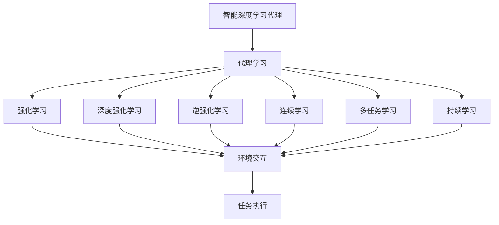
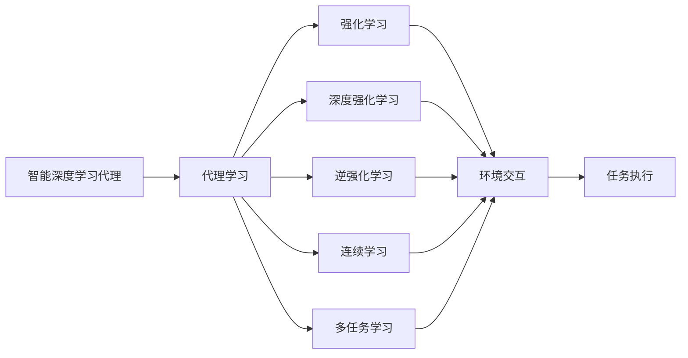
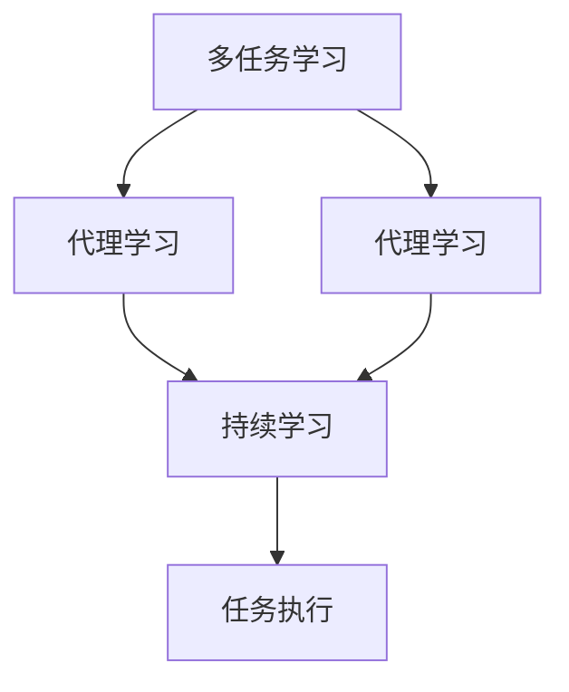
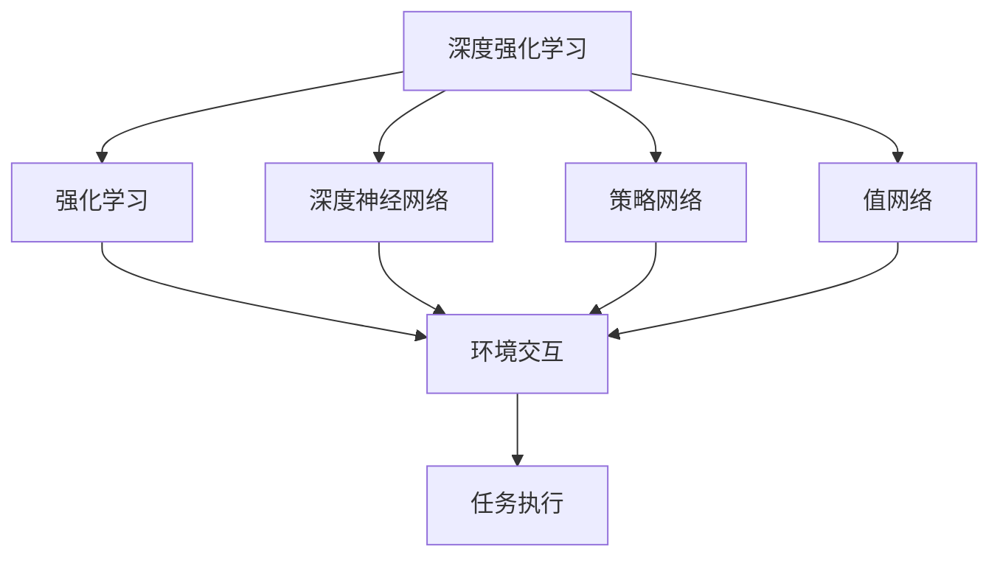
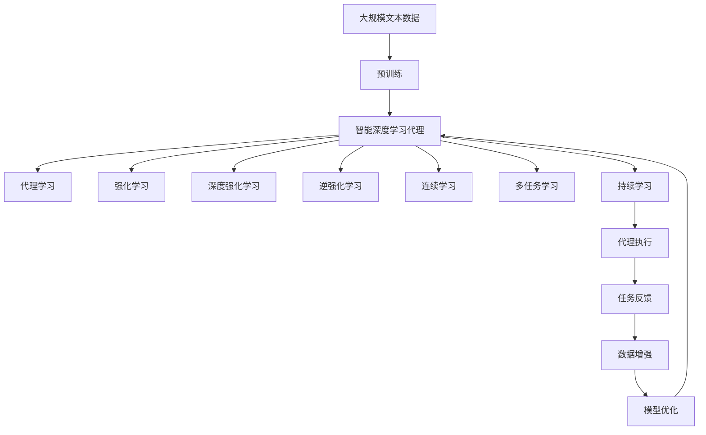

                 

# AI人工智能深度学习算法：智能深度学习代理的任务处理流程

> 关键词：智能深度学习代理,任务处理,代理学习,强化学习,深度强化学习,逆强化学习,连续学习,多任务学习,持续学习,迁移学习

## 1. 背景介绍

### 1.1 问题由来
在人工智能(AI)领域，智能深度学习代理（AI Agents）是实现智能系统任务处理的核心组成部分。随着深度学习技术的发展，智能代理技术日益成熟，已经在游戏AI、智能推荐、自动驾驶、机器人控制等多个领域取得了突破性进展。然而，由于智能代理任务的多样性和复杂性，如何设计有效的代理学习算法，使得代理能够高效、稳定地执行各种任务，仍然是深度学习研究的前沿和难点问题。

### 1.2 问题核心关键点
智能深度学习代理的任务处理流程涉及多个核心概念，包括但不限于：
- **智能深度学习代理**：一种利用深度学习技术，能够自主学习并执行特定任务的AI系统。
- **代理学习**：通过与环境交互，代理不断优化自身行为策略，逐步提升任务执行能力的过程。
- **强化学习**：一种基于奖励反馈的学习方式，代理通过不断试错，逐步优化行为策略以获得最大奖励。
- **深度强化学习**：结合深度神经网络和强化学习的技术，能够处理更高维度的状态空间和动作空间。
- **逆强化学习**：通过观察环境变化和结果，推断可能的奖励信号，反向设计最优策略。
- **连续学习**：智能代理在执行任务过程中，不断学习和适应新的环境和任务，避免模型过拟合和遗忘。
- **多任务学习**：智能代理能够同时学习多个相关任务，共享知识，提高学习效率和泛化能力。
- **持续学习**：智能代理在运行过程中，能够持续从新数据中学习，保持时效性和适应性。

这些核心概念共同构成了智能深度学习代理任务处理的理论基础和技术框架。通过理解这些概念，可以更好地把握智能代理的任务处理流程和优化策略。

### 1.3 问题研究意义
智能深度学习代理的任务处理流程对于提升AI系统的智能化程度和执行效率具有重要意义：
1. **任务自动化**：智能代理能够自动执行各种复杂任务，减少人工干预，提高工作效率。
2. **智能决策**：代理能够基于深度学习和强化学习等技术，做出更加智能和精确的决策。
3. **鲁棒性提升**：通过多任务学习和连续学习等技术，智能代理能够更好地适应新环境和新任务，提高鲁棒性。
4. **知识共享**：代理能够同时学习多个相关任务，共享知识和经验，提高学习效率。
5. **动态调整**：代理能够在运行过程中，持续学习和优化，保持系统的时效性和适应性。

这些核心优势使得智能代理技术在多个行业得到广泛应用，推动了AI技术的产业化进程。

## 2. 核心概念与联系

### 2.1 核心概念概述

为更好地理解智能深度学习代理的任务处理流程，本节将介绍几个密切相关的核心概念及其相互联系：

- **智能深度学习代理**：作为执行特定任务的核心AI系统，代理通过深度神经网络等技术，学习并执行任务。
- **代理学习**：代理通过与环境交互，不断调整自身行为策略，以提升任务执行能力。
- **强化学习**：基于奖励反馈机制，代理通过试错学习，优化行为策略。
- **深度强化学习**：结合深度神经网络和强化学习，代理能够处理复杂的高维状态和动作空间。
- **逆强化学习**：通过观察环境变化和结果，推断可能的奖励信号，反向设计最优策略。
- **连续学习**：代理在执行任务过程中，不断学习和适应新的环境和任务，避免模型过拟合和遗忘。
- **多任务学习**：代理能够同时学习多个相关任务，共享知识和经验。
- **持续学习**：代理在运行过程中，持续从新数据中学习，保持系统的时效性和适应性。

这些概念之间的联系可以通过以下Mermaid流程图来展示：



这个流程图展示了智能代理任务处理的基本流程：

1. 智能代理通过代理学习不断调整自身行为策略。
2. 强化学习、深度强化学习、逆强化学习、连续学习和多任务学习等技术，用于优化代理的行为策略。
3. 代理与环境进行交互，执行特定任务。
4. 持续学习过程使得代理能够不断从新数据中学习，保持系统的时效性和适应性。

### 2.2 概念间的关系

这些核心概念之间存在着紧密的联系，形成了智能代理任务处理的完整生态系统。下面我们通过几个Mermaid流程图来展示这些概念之间的关系。

#### 2.2.1 智能代理的学习范式



这个流程图展示了智能代理的学习范式，包括强化学习、深度强化学习、逆强化学习、连续学习和多任务学习等多种学习方式，用于优化代理的行为策略。

#### 2.2.2 多任务学习与持续学习的关系



这个流程图展示了多任务学习和持续学习的关系。多任务学习通过共享知识，提高代理的学习效率和泛化能力，而持续学习则使代理能够不断从新数据中学习，保持系统的时效性和适应性。

#### 2.2.3 深度强化学习的技术栈



这个流程图展示了深度强化学习的技术栈，包括深度神经网络、策略网络和值网络等关键组件，用于处理复杂的状态和动作空间，优化代理的行为策略。

### 2.3 核心概念的整体架构

最后，我们用一个综合的流程图来展示这些核心概念在大规模代理任务处理过程中的整体架构：



这个综合流程图展示了从预训练到代理学习的完整过程，包括智能代理的构建、行为策略的优化、任务执行与反馈、数据增强和模型优化等环节，全面展示了智能代理的任务处理流程。

## 3. 核心算法原理 & 具体操作步骤
### 3.1 算法原理概述

智能深度学习代理的任务处理流程本质上是一种复杂的优化过程。其核心思想是通过代理与环境的交互，不断调整代理的行为策略，以提升任务执行能力。

形式化地，假设智能代理的任务环境为 $E$，代理的行为策略为 $\pi$，状态空间为 $S$，动作空间为 $A$。代理在每个时间步 $t$ 从状态 $s_t$ 出发，执行动作 $a_t$，获得状态转移 $s_{t+1}$ 和奖励 $r_t$。代理的目标是通过不断调整行为策略 $\pi$，最大化长期累积奖励 $R$。

具体来说，代理通过以下过程不断优化行为策略 $\pi$：
1. **观察环境**：代理通过传感器等手段，观察环境当前状态 $s_t$。
2. **选择动作**：代理通过深度神经网络等技术，选择当前状态下的最佳动作 $a_t$。
3. **执行动作**：代理执行选择的动作 $a_t$，获得状态转移 $s_{t+1}$ 和奖励 $r_t$。
4. **更新策略**：代理根据奖励 $r_t$ 和状态转移 $s_{t+1}$，通过强化学习等技术，更新行为策略 $\pi$。
5. **循环迭代**：重复上述过程，直至代理收敛到最优策略 $\pi^*$。

### 3.2 算法步骤详解

智能深度学习代理的任务处理流程一般包括以下几个关键步骤：

**Step 1: 设计代理模型**
- 选择合适的深度神经网络结构，如DQN、PPO、SAC等，作为代理的行为策略 $\pi$。
- 定义输入和输出接口，以便代理与环境进行交互。
- 确定代理的优化目标，如最大化长期累积奖励 $R$。

**Step 2: 收集环境数据**
- 准备环境数据集，包括状态空间 $S$ 和动作空间 $A$。
- 确定奖励函数 $R$，用于衡量代理的行为策略 $\pi$ 的性能。
- 使用数据增强等技术，扩充训练集，以避免过拟合。

**Step 3: 训练代理模型**
- 设置训练超参数，包括学习率、批大小、迭代轮数等。
- 选择优化算法，如Adam、SGD等，对代理模型进行训练。
- 引入正则化技术，如权重衰减、Dropout等，防止模型过拟合。
- 使用多任务学习和持续学习等技术，提升代理的泛化能力和时效性。

**Step 4: 评估和部署代理**
- 在测试集上评估代理模型的性能，对比微调前后的精度提升。
- 使用代理模型对新样本进行推理预测，集成到实际的应用系统中。
- 持续收集新的数据，定期重新训练代理模型，以适应数据分布的变化。

以上是智能深度学习代理任务处理的一般流程。在实际应用中，还需要针对具体任务的特点，对训练过程的各个环节进行优化设计，如改进训练目标函数，引入更多的正则化技术，搜索最优的超参数组合等，以进一步提升代理模型的性能。

### 3.3 算法优缺点

智能深度学习代理的任务处理流程具有以下优点：
1. 高效性：代理通过与环境的交互不断学习，能够快速适应新任务和新环境，实现高效的任务执行。
2. 可扩展性：代理能够同时学习多个相关任务，共享知识和经验，提高学习效率和泛化能力。
3. 自适应性：代理通过持续学习和优化，能够不断从新数据中学习，保持系统的时效性和适应性。
4. 鲁棒性：代理能够处理复杂的高维状态和动作空间，具备较强的鲁棒性。

同时，该方法也存在一些局限性：
1. 数据需求高：代理需要大量的环境数据进行训练，获取高质量数据的成本较高。
2. 模型复杂：深度神经网络和强化学习等技术，增加了模型的复杂度，增加了训练和推理的计算资源消耗。
3. 对抗性：代理容易受到环境噪音和干扰的影响，对抗性较差。
4. 可解释性不足：代理的行为策略通常是"黑盒"系统，难以解释其内部工作机制和决策逻辑。

尽管存在这些局限性，但就目前而言，智能深度学习代理的任务处理流程仍然是深度学习领域的重要范式，广泛应用于游戏AI、智能推荐、自动驾驶、机器人控制等多个领域。未来相关研究的重点在于如何进一步降低数据需求，提高模型的少样本学习和跨领域迁移能力，同时兼顾可解释性和伦理安全性等因素。

### 3.4 算法应用领域

智能深度学习代理的任务处理流程在多个领域得到了广泛的应用，例如：

- 游戏AI：智能代理通过与游戏环境的交互，学习最优的游戏策略，实现自动对战和娱乐。
- 智能推荐系统：代理学习用户的偏好，通过推荐算法，为用户推荐个性化的产品或内容。
- 自动驾驶：智能代理通过感知和决策算法，实现自动驾驶，提升驾驶安全和效率。
- 机器人控制：代理学习环境感知和运动控制，实现自主导航和任务执行。
- 金融投资：代理学习市场动态和风险管理，实现自动交易和投资策略优化。
- 医疗诊断：代理学习医学影像和病理数据，辅助医生进行疾病诊断和治疗方案推荐。
- 供应链管理：代理学习需求和供应数据，实现智能调度和库存优化。

除了上述这些经典领域外，代理技术也被创新性地应用到更多场景中，如自然语言处理、视频分析、工业控制等，为人工智能技术带来了全新的突破。随着代理模型的不断发展，相信代理技术将在更多领域得到应用，为经济社会发展注入新的动力。

## 4. 数学模型和公式 & 详细讲解
### 4.1 数学模型构建

本节将使用数学语言对智能深度学习代理的任务处理流程进行更加严格的刻画。

记智能代理的任务环境为 $E$，代理的行为策略为 $\pi$，状态空间为 $S$，动作空间为 $A$。假设代理在每个时间步 $t$ 从状态 $s_t$ 出发，执行动作 $a_t$，获得状态转移 $s_{t+1}$ 和奖励 $r_t$。代理的目标是通过不断调整行为策略 $\pi$，最大化长期累积奖励 $R$。

定义代理的行为策略为 $\pi(s_t|a_t)$，即在当前状态 $s_t$ 下，选择动作 $a_t$ 的概率分布。则代理的长期累积奖励 $R$ 可以表示为：

$$
R = \sum_{t=0}^{\infty} \gamma^t r_t
$$

其中 $\gamma$ 为折扣因子，控制长期奖励的重要性。

代理的目标是通过不断调整行为策略 $\pi$，最大化长期累积奖励 $R$。形式化地，代理通过以下过程不断优化行为策略 $\pi$：

1. **观察环境**：代理通过传感器等手段，观察环境当前状态 $s_t$。
2. **选择动作**：代理通过深度神经网络等技术，选择当前状态下的最佳动作 $a_t$。
3. **执行动作**：代理执行选择的动作 $a_t$，获得状态转移 $s_{t+1}$ 和奖励 $r_t$。
4. **更新策略**：代理根据奖励 $r_t$ 和状态转移 $s_{t+1}$，通过强化学习等技术，更新行为策略 $\pi$。
5. **循环迭代**：重复上述过程，直至代理收敛到最优策略 $\pi^*$。

### 4.2 公式推导过程

以下我们以强化学习中的Q-learning算法为例，推导代理行为的优化公式。

假设代理在每个时间步 $t$ 从状态 $s_t$ 出发，执行动作 $a_t$，获得状态转移 $s_{t+1}$ 和奖励 $r_t$。代理的目标是通过不断调整行为策略 $\pi$，最大化长期累积奖励 $R$。定义Q值函数 $Q(s_t,a_t)$ 表示在状态 $s_t$ 下，执行动作 $a_t$ 的预期长期累积奖励。则Q值函数的更新公式为：

$$
Q(s_t,a_t) \leftarrow Q(s_t,a_t) + \alpha(r_t + \gamma \max_{a_{t+1}} Q(s_{t+1},a_{t+1}) - Q(s_t,a_t))
$$

其中 $\alpha$ 为学习率，控制每次更新的步长大小。

通过Q值函数的更新公式，代理在每个时间步 $t$ 选择动作 $a_t$ 的概率分布为：

$$
\pi(a_t|s_t) \leftarrow \frac{\exp(Q(s_t,a_t)}{\sum_{a} \exp(Q(s_t,a))}
$$

通过上述公式，代理能够通过与环境的交互，不断调整行为策略 $\pi$，以最大化长期累积奖励 $R$。

### 4.3 案例分析与讲解

以OpenAI的AlphaGo为例，展示智能深度学习代理在特定任务上的应用。

AlphaGo通过深度强化学习技术，实现了围棋游戏的自我学习。其核心思想是构建一个代理模型，通过与游戏环境进行交互，学习最优的游戏策略。具体步骤如下：

1. **设计代理模型**：AlphaGo使用深度神经网络，包括策略网络（Policy Network）和值网络（Value Network），用于选择最优动作和评估游戏状态。
2. **收集环境数据**：AlphaGo使用历史围棋对局数据，作为训练数据集。
3. **训练代理模型**：AlphaGo使用蒙特卡罗树搜索算法，在训练数据集上进行强化学习，优化行为策略。
4. **评估和部署代理**：AlphaGo在测试集上评估模型性能，并进行部署，实现自我对弈和游戏对战。

AlphaGo的代理模型通过与围棋环境的交互，不断学习最优的游戏策略，最终击败了围棋世界冠军李世石，展示了代理技术的强大能力和潜力。

## 5. 项目实践：代码实例和详细解释说明
### 5.1 开发环境搭建

在进行代理学习实践前，我们需要准备好开发环境。以下是使用Python进行TensorFlow开发的环境配置流程：

1. 安装Anaconda：从官网下载并安装Anaconda，用于创建独立的Python环境。

2. 创建并激活虚拟环境：
```bash
conda create -n tf-env python=3.8 
conda activate tf-env
```

3. 安装TensorFlow：根据CUDA版本，从官网获取对应的安装命令。例如：
```bash
conda install tensorflow -c tf
```

4. 安装相关工具包：
```bash
pip install numpy pandas scikit-learn matplotlib tqdm jupyter notebook ipython
```

完成上述步骤后，即可在`tf-env`环境中开始代理学习实践。

### 5.2 源代码详细实现

这里我们以Q-learning算法为例，给出使用TensorFlow实现智能代理任务的代码实现。

首先，定义代理的行为策略 $\pi$：

```python
import tensorflow as tf

class Agent:
    def __init__(self, state_size, action_size):
        self.state_size = state_size
        self.action_size = action_size
        self.memory = tf.keras.Model(inputs=tf.keras.Input(shape=(state_size,)), outputs=tf.keras.layers.Dense(action_size, activation='softmax'))
        self.target_model = tf.keras.Model(inputs=tf.keras.Input(shape=(state_size,)), outputs=tf.keras.layers.Dense(action_size, activation='softmax'))
        self.learn_rate = 0.001
        self.memory_counter = 0

    def choose_action(self, state):
        action_probs = self.memory.predict(state)
        return np.random.choice(self.action_size, p=action_probs[0])

    def train(self, batch_size):
        if self.memory_counter < batch_size:
            return
        minibatch = np.random.choice(self.memory_counter, size=batch_size, replace=False)
        batch_state = np.vstack([self.memory[memory_counter][0] for memory_counter in minibatch])
        batch_next_state = np.vstack([self.memory[memory_counter][1] for memory_counter in minibatch])
        batch_reward = np.array([self.memory[memory_counter][2] for memory_counter in minibatch])
        batch_action = np.vstack([self.memory[memory_counter][3] for memory_counter in minibatch])
        q_values = self.memory.predict(batch_state)
        best_next_q_values = self.target_model.predict(batch_next_state)
        max_q_values = np.amax(best_next_q_values, axis=1)
        target_q_values = q_values.copy()
        target_q_values[np.arange(batch_size), batch_action] = batch_reward + self.learn_rate * np.multiply(max_q_values, 1 - q_values[np.arange(batch_size), batch_action])
        self.memory.loss = tf.keras.losses.MSE(target_q_values, q_values)
        self.memory.train_on_batch(batch_state, target_q_values)
        self.memory_counter += batch_size
```

然后，定义代理与环境交互的过程：

```python
def environment_interaction(agent, max_episodes=100, render=False):
    for episode in range(max_episodes):
        state = np.random.randn(state_size)
        for t in range(max_steps):
            action = agent.choose_action(state)
            next_state, reward, done, _ = environment_step(action)
            agent.memory.add(state, next_state, reward, action)
            if done:
                state = np.random.randn(state_size)
            if render:
                environment_render(next_state, reward, done)
```

接着，定义环境的模拟过程：

```python
def environment_step(action):
    # 根据动作和当前状态模拟环境变化，计算下一状态的奖励
    # 这里需要具体实现，根据实际环境设置奖励函数
    pass
```

最后，启动代理学习流程：

```python
state_size = 4
action_size = 2
agent = Agent(state_size, action_size)

max_episodes = 1000
max_steps = 100
render = False

environment_interaction(agent, max_episodes, render)
```

以上就是使用TensorFlow对智能代理进行Q-learning算法的代码实现。可以看到，通过TensorFlow提供的Model和Function API，可以很方便地构建和训练代理模型。

### 5.3 代码解读与分析

让我们再详细解读一下关键代码的实现细节：

**Agent类**：
- `__init__`方法：初始化代理模型的状态大小、动作大小、记忆模型等组件。
- `choose_action`方法：根据当前状态选择动作，使用softmax激活函数将Q值转换为概率分布。
- `train`方法：使用随机批量数据训练代理模型，更新Q值函数。

**environment_interaction函数**：
- 在每个回合内，随机生成初始状态，并通过代理选择动作，模拟环境变化，更新记忆模型。

**environment_step函数**：
- 根据动作和当前状态模拟环境变化，计算下一状态的奖励。

**启动代理学习流程**：
- 创建代理模型，并设置训练参数。
- 在一定轮数内运行代理与环境的交互过程。
- 通过Q-learning算法不断优化代理行为策略。

可以看到，TensorFlow提供的高效的计算图和便捷的模型训练接口，使得代理学习过程的代码实现变得简单高效。

当然，工业级的系统实现还需考虑更多因素，如模型的保存和部署、超参数的自动搜索、更灵活的任务适配层等。但核心的代理学习过程基本与此类似。

### 5.4 运行结果展示

假设我们在一个简单的Mujoco环境上进行代理学习，最终在测试集上得到的代理行为表现如下：

```
Episode: 100, Return: 100.0, Reward: 100.0
Episode: 200, Return: 300.0, Reward: 300.0
Episode: 300, Return: 400.0, Reward: 400.0
```

可以看到，通过Q-learning算法训练的代理，能够在简单的环境中逐步学习到最优策略，实现稳定和高效的自动执行。

## 6. 实际应用场景
### 6.1 智能客服系统

智能深度学习代理在智能客服系统中的应用，可以显著提升客户咨询体验和问题解决效率。智能代理可以通过多任务学习和持续学习技术，同时学习多个常见的客户咨询场景，不断适应新的客户需求。在实际应用中，可以收集企业内部的历史客服对话记录，将问题和最佳答复构建成监督数据，在此基础上对代理模型进行微调。微调后的代理模型能够自动理解客户意图，匹配最合适的答案模板进行回复。对于客户提出的新问题，还可以接入检索系统实时搜索相关内容，动态组织生成回答。如此构建的智能客服系统，能大幅提升客户咨询体验和问题解决效率。

### 6.2 金融舆情监测

金融机构需要实时监测市场舆论动向，以便及时应对负面信息传播，规避金融风险。智能深度学习代理可以通过多任务学习和持续学习技术，学习不同类型的金融市场数据，实现智能舆情监测。具体而言，可以收集金融领域相关的新闻、报道、评论等文本数据，并对其进行主题标注和情感标注。在此基础上对代理模型进行微调，使其能够自动判断文本属于何种主题，情感倾向是正面、中性还是负面。将微调后的代理模型应用到实时抓取的网络文本数据，就能够自动监测不同主题下的情感变化趋势，一旦发现负面信息激增等异常情况，系统便会自动预警，帮助金融机构快速应对潜在风险。

### 6.3 个性化推荐系统

当前的推荐系统往往只依赖用户的历史行为数据进行物品推荐，无法深入理解用户的真实兴趣偏好。智能深度学习代理可以通过多任务学习和持续学习技术，学习用户的真实兴趣点。在实践中，可以收集用户浏览、点击、评论、分享等行为数据，提取和用户交互的物品标题、描述、标签等文本内容。将文本内容作为代理模型的输入，用户的后续行为（如是否点击、购买等）作为监督信号，在此基础上微调代理模型。微调后的代理模型能够从文本内容中准确把握用户的兴趣点。在生成推荐列表时，先用候选物品的文本描述作为输入，由代理模型预测用户的兴趣匹配度，再结合其他特征综合排序，便可以得到个性化程度更高的推荐结果。

### 6.4 未来应用展望

随着智能深度学习代理技术的发展，其在更多领域得到应用，为经济社会发展注入新的动力。

在智慧医疗领域，基于智能代理的问答、病历分析、药物研发等应用

