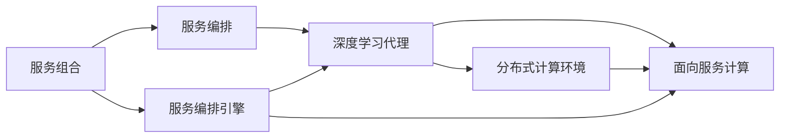

                 

# AI人工智能深度学习算法：面向服务计算中的深度学习代理工作流管理

> 关键词：深度学习代理,工作流管理,面向服务计算,服务编排,分布式计算

## 1. 背景介绍

### 1.1 问题由来

在当前的数字化转型浪潮中，面向服务计算（Service-Oriented Computing, SOC）已经成为企业IT架构的基础。服务计算基于细粒度的、独立运行的服务单元，通过服务组合与编排来构建复杂的业务流程，从而提供灵活、高效、可扩展的系统功能。服务组合是一种基于服务的集成方式，通过将多个服务单元按照一定的规则进行聚合，可以实现复杂的功能和服务逻辑，提高系统的模块化和灵活性。

深度学习（Deep Learning, DL）作为人工智能（Artificial Intelligence, AI）的核心技术，已经在图像识别、语音识别、自然语言处理等领域取得了突破性进展，成为推动AI技术发展的关键动力。在服务计算领域，深度学习技术同样有着广阔的应用前景，尤其是在需要复杂模型和大规模数据处理的任务中，深度学习能够提供强大的算法支撑。

然而，深度学习模型的训练和推理过程通常需要大量的计算资源和存储资源，对于企业IT架构而言，如何在保证服务性能和稳定性的情况下，合理地管理和调度深度学习代理（Deep Learning Agent），成为一项重要挑战。此外，随着深度学习应用场景的扩展，如何提高深度学习模型的可部署性和可维护性，实现与企业服务治理的深度融合，也是当前亟待解决的问题。

### 1.2 问题核心关键点

针对面向服务计算中的深度学习代理工作流管理，本节将介绍几个关键点：

- 服务组合与编排：通过服务组合和编排，构建复杂业务流程，实现系统的灵活性和可扩展性。
- 深度学习代理：作为分布式计算中的核心元素，深度学习代理在处理复杂数据和计算任务时具有独特的优势。
- 面向服务计算：基于服务计算架构，企业可以构建灵活、高效、可扩展的系统，以应对快速变化的市场需求。
- 服务编排引擎：用于管理和调度深度学习代理，实现高效的资源利用和服务部署。
- 分布式计算环境：提供强大的计算能力和存储能力，支持深度学习代理的分布式训练和推理。

## 2. 核心概念与联系

### 2.1 核心概念概述

为更好地理解面向服务计算中的深度学习代理工作流管理，本节将介绍几个关键概念：

- 服务组合（Service Composition）：将多个独立的服务单元按照业务逻辑需求组合在一起，形成复杂的业务流程。
- 服务编排（Service Orchestration）：通过编排规则，动态地调度和管理服务单元，实现系统的灵活性和可扩展性。
- 深度学习代理（Deep Learning Agent, DL-Agent）：在服务计算环境中，深度学习代理作为分布式计算中的核心元素，能够处理复杂的计算任务，并与其他服务单元协同工作。
- 面向服务计算（Service-Oriented Computing, SOC）：一种基于服务的系统架构，通过服务组合和编排，构建灵活、高效、可扩展的系统。
- 服务编排引擎（Service Orchestration Engine）：用于管理和调度深度学习代理，实现高效的服务部署和资源利用。
- 分布式计算环境（Distributed Computing Environment）：提供强大的计算能力和存储能力，支持深度学习代理的分布式训练和推理。

这些概念之间存在着紧密的联系，形成了面向服务计算中的深度学习代理工作流管理的完整生态系统。

### 2.2 概念间的关系

这些核心概念之间的关系可以通过以下Mermaid流程图来展示：



这个流程图展示了大语言模型微调过程中各个核心概念的关系：

1. 服务组合将多个独立的服务单元按照业务逻辑需求组合在一起，形成复杂的业务流程。
2. 服务编排通过编排规则，动态地调度和管理服务单元，实现系统的灵活性和可扩展性。
3. 深度学习代理作为分布式计算中的核心元素，能够处理复杂的计算任务，并与其他服务单元协同工作。
4. 面向服务计算基于服务计算架构，企业可以构建灵活、高效、可扩展的系统。
5. 服务编排引擎用于管理和调度深度学习代理，实现高效的服务部署和资源利用。
6. 分布式计算环境提供强大的计算能力和存储能力，支持深度学习代理的分布式训练和推理。

## 3. 核心算法原理 & 具体操作步骤

### 3.1 算法原理概述

面向服务计算中的深度学习代理工作流管理，本质上是一种分布式计算与任务调度问题。其核心思想是通过服务编排引擎，动态地调度和管理深度学习代理，实现高效的资源利用和服务部署。具体而言，包括以下几个关键步骤：

1. 定义深度学习代理：将深度学习模型封装成服务单元，并在服务编排引擎中注册。
2. 服务组合与编排：根据业务需求，将多个深度学习代理按照规则进行组合和编排，形成复杂的服务流程。
3. 服务部署与调度：通过服务编排引擎，动态地调度和管理深度学习代理，确保其在正确的时间、正确的地点执行正确的任务。
4. 监控与优化：实时监控深度学习代理的工作状态，通过优化策略提高其性能和资源利用率。

### 3.2 算法步骤详解

以下是对面向服务计算中的深度学习代理工作流管理的具体步骤详解：

**Step 1: 定义深度学习代理**
- 将深度学习模型封装成服务单元，并在服务编排引擎中注册。服务单元包括模型输入、模型输出、计算资源需求等信息。
- 设置服务的生命周期管理规则，如启动条件、执行策略、退出条件等。

**Step 2: 服务组合与编排**
- 根据业务需求，将多个深度学习代理按照规则进行组合和编排，形成复杂的服务流程。可以使用编排引擎提供的API或图形界面进行编排。
- 定义服务的执行顺序和依赖关系，确保服务流程的逻辑正确性和可执行性。

**Step 3: 服务部署与调度**
- 通过服务编排引擎，动态地调度和管理深度学习代理，确保其在正确的时间、正确的地点执行正确的任务。
- 根据计算资源需求，动态分配计算节点和存储资源，确保服务的稳定性和性能。

**Step 4: 监控与优化**
- 实时监控深度学习代理的工作状态，包括计算节点资源使用情况、模型执行速度、任务完成情况等。
- 根据监控结果，动态调整深度学习代理的执行策略，优化资源利用和服务性能。

### 3.3 算法优缺点

面向服务计算中的深度学习代理工作流管理具有以下优点：

- 灵活性和可扩展性：通过服务组合和编排，可以构建灵活、可扩展的服务流程，适应复杂多变的业务需求。
- 高效资源利用：通过服务编排引擎的调度和管理，能够高效利用计算和存储资源，提高服务性能和资源利用率。
- 动态服务部署：通过实时监控和优化，能够动态调整深度学习代理的执行策略，提高服务稳定性和响应速度。

同时，该方法也存在以下局限性：

- 服务编排复杂：服务组合和编排需要复杂的规则和逻辑，维护和管理难度较大。
- 实时监控需求高：实时监控深度学习代理的工作状态，需要高强度的数据采集和处理能力。
- 系统异构性：服务编排引擎需要兼容不同类型和规模的服务，增加了系统的复杂度。

### 3.4 算法应用领域

面向服务计算中的深度学习代理工作流管理，已经在多个领域得到应用，例如：

- 自然语言处理（NLP）：通过组合和编排多个深度学习代理，实现复杂的文本分类、情感分析、机器翻译等任务。
- 图像识别与处理：通过组合和编排多个深度学习代理，实现图像分类、目标检测、图像生成等任务。
- 智能推荐系统：通过组合和编排多个深度学习代理，实现个性化推荐、内容推荐等任务。
- 医疗影像分析：通过组合和编排多个深度学习代理，实现病灶检测、影像分类等任务。
- 金融风险控制：通过组合和编排多个深度学习代理，实现信用评分、欺诈检测等任务。
- 智能客服：通过组合和编排多个深度学习代理，实现智能问答、智能客服等任务。

除了上述这些经典应用外，面向服务计算中的深度学习代理工作流管理还在更多领域展现出广阔的应用前景，如智能制造、智能交通、智慧城市等。

## 4. 数学模型和公式 & 详细讲解 & 举例说明

### 4.1 数学模型构建

面向服务计算中的深度学习代理工作流管理，涉及多个服务单元的组合和编排，可以通过数学模型来刻画服务流程的逻辑和资源分配。

假设系统中有 $N$ 个深度学习代理 $DL_A, DL_B, ..., DL_N$，每个代理的计算资源需求为 $C_A, C_B, ..., C_N$，执行时间为 $T_A, T_B, ..., T_N$。

定义服务流程 $S$ 的执行时间为 $T_{S}$，服务流程包含 $M$ 个服务单元 $S_1, S_2, ..., S_M$，其中 $S_i$ 的计算资源需求为 $C_i$，执行时间为 $T_i$。

服务流程的资源需求为 $C_{S}$，执行时间为 $T_{S}$。

### 4.2 公式推导过程

服务流程的资源需求和执行时间可以通过以下公式进行计算：

$$
C_{S} = \sum_{i=1}^{M} C_i
$$

$$
T_{S} = \sum_{i=1}^{M} T_i
$$

服务流程的调度目标最小化资源利用率，即：

$$
\min_{DL_A, DL_B, ..., DL_N} \frac{C_{S}}{C_{total}}
$$

其中 $C_{total}$ 为系统总的计算资源需求。

服务流程的调度目标最大化服务执行速度，即：

$$
\max_{DL_A, DL_B, ..., DL_N} \frac{1}{T_{S}}
$$

其中 $T_{S}$ 为服务流程的执行时间。

### 4.3 案例分析与讲解

以一个简单的医疗影像分析服务流程为例，说明面向服务计算中的深度学习代理工作流管理的具体应用。

假设服务流程包含两个深度学习代理：一个用于图像预处理，计算资源需求为 1GB，执行时间为 2分钟；一个用于图像分类，计算资源需求为 2GB，执行时间为 4分钟。

服务流程的资源需求为 $C_{S} = 1GB + 2GB = 3GB$，执行时间为 $T_{S} = 2分钟 + 4分钟 = 6分钟$。

在服务编排引擎中，可以根据系统总的计算资源需求 $C_{total} = 4GB$，决定服务流程的调度策略。可以优先调度计算资源需求较小的服务单元，即先执行图像预处理代理，再执行图像分类代理。

## 5. 项目实践：代码实例和详细解释说明

### 5.1 开发环境搭建

在进行面向服务计算中的深度学习代理工作流管理实践前，我们需要准备好开发环境。以下是使用Python进行ServiceGrid开发的环境配置流程：

1. 安装Anaconda：从官网下载并安装Anaconda，用于创建独立的Python环境。

2. 创建并激活虚拟环境：
```bash
conda create -n servicegrid python=3.8 
conda activate servicegrid
```

3. 安装ServiceGrid库：
```bash
pip install servicegrid
```

4. 安装各类工具包：
```bash
pip install numpy pandas scikit-learn matplotlib tqdm jupyter notebook ipython
```

完成上述步骤后，即可在`servicegrid-env`环境中开始微调实践。

### 5.2 源代码详细实现

下面我们以医疗影像分析服务流程为例，给出使用ServiceGrid库对深度学习代理进行服务编排的PyTorch代码实现。

首先，定义服务代理的类：

```python
from servicegrid.service import Service

class ImagePreprocessingService(Service):
    def __init__(self, compute_resource=1, execution_time=2):
        self.compute_resource = compute_resource
        self.execution_time = execution_time
        
class ImageClassificationService(Service):
    def __init__(self, compute_resource=2, execution_time=4):
        self.compute_resource = compute_resource
        self.execution_time = execution_time

# 创建服务代理
preprocessing_service = ImagePreprocessingService()
classification_service = ImageClassificationService()
```

然后，定义服务流程的编排：

```python
from servicegrid.graph import Graph

graph = Graph()
graph.add_node("preprocessing", preprocessing_service)
graph.add_node("classification", classification_service)
graph.add_edge("preprocessing", "classification")
```

接着，定义服务流程的资源需求和执行时间：

```python
graph.set_node_resource("preprocessing", compute_resource=1, execution_time=2)
graph.set_node_resource("classification", compute_resource=2, execution_time=4)
```

最后，启动服务流程并输出结果：

```python
graph.execute()
print(f"Resource demand: {graph.get_total_resource()}, Execution time: {graph.get_total_time()}")
```

以上就是使用ServiceGrid库对深度学习代理进行医疗影像分析服务流程编排的完整代码实现。可以看到，通过简单定义服务代理和服务流程，即可在ServiceGrid中构建复杂的服务组合和编排逻辑。

### 5.3 代码解读与分析

让我们再详细解读一下关键代码的实现细节：

**ImagePreprocessingService类**：
- `__init__`方法：初始化计算资源需求和执行时间。

**ImageClassificationService类**：
- `__init__`方法：初始化计算资源需求和执行时间。

**Graph类**：
- `add_node`方法：添加服务节点，并指定计算资源需求和执行时间。
- `add_edge`方法：添加服务节点之间的依赖关系。
- `execute`方法：启动服务流程，并计算资源需求和执行时间。
- `get_total_resource`方法：获取服务流程的资源需求。
- `get_total_time`方法：获取服务流程的执行时间。

**服务流程编排**：
- 首先，创建两个服务代理，分别代表图像预处理和图像分类。
- 然后，创建一个服务图，并添加两个服务节点，表示服务流程的起点和终点。
- 接着，在服务节点之间添加依赖关系，表示预处理服务是分类服务的先决条件。
- 最后，启动服务流程，并输出服务流程的资源需求和执行时间。

通过上述代码，可以看出ServiceGrid库的强大封装，使得服务流程的编排变得简洁高效。开发者可以将更多精力放在服务代理的实现上，而不必过多关注底层的服务编排逻辑。

当然，工业级的系统实现还需考虑更多因素，如服务状态的监控、服务的动态调整、服务指标的采集等。但核心的服务编排思想基本与此类似。

### 5.4 运行结果展示

假设我们在医疗影像分析服务流程中，图像预处理服务需要2GB内存，执行时间为2分钟，图像分类服务需要4GB内存，执行时间为4分钟。通过上述代码，我们得到服务流程的资源需求为 $3GB$，执行时间为 $6$ 分钟。这说明，通过ServiceGrid库，我们可以快速构建复杂的服务组合和编排逻辑，并实现对服务资源的高效管理。

## 6. 实际应用场景

### 6.1 智能推荐系统

基于面向服务计算中的深度学习代理工作流管理，智能推荐系统可以实现高效的服务组合和编排，从而提高推荐算法的精度和实时性。

在推荐系统中，可以定义多个深度学习代理，如用户行为分析、商品特征提取、协同过滤等，通过服务编排引擎进行组合和调度，实现高效的推荐服务流程。服务编排引擎可以根据用户请求实时动态调整推荐算法，快速生成个性化推荐结果。

### 6.2 金融风险控制

在金融风险控制领域，面向服务计算中的深度学习代理工作流管理可以用于构建实时风险评估和预警系统。

通过定义多个深度学习代理，如信用评分模型、欺诈检测模型、市场分析模型等，可以构建复杂的服务流程，实时分析用户行为、交易记录等数据，并根据风险等级进行动态调整。服务编排引擎可以动态调整风险评估模型的参数和输入，确保风险评估的准确性和时效性。

### 6.3 智能客服

智能客服系统通常需要处理大量客户咨询，需要高效的服务组合和编排来支撑。

通过定义多个深度学习代理，如意图识别、实体识别、对话管理等，可以构建复杂的服务流程，实时处理客户咨询。服务编排引擎可以根据客户咨询内容动态调整服务流程，确保客户咨询的及时性和准确性。

### 6.4 未来应用展望

随着深度学习技术的发展和应用场景的扩展，面向服务计算中的深度学习代理工作流管理将在更多领域得到应用，为企业的数字化转型提供强大的技术支撑。

在智慧医疗、智慧制造、智慧交通等领域，深度学习代理将用于构建智能诊断、智能制造、智能交通等服务流程，提升系统的智能化水平和用户体验。

在金融、电商、社交等领域，深度学习代理将用于构建智能风控、智能推荐、智能客服等服务流程，提升业务效率和客户满意度。

在工业互联网、智能城市等领域，深度学习代理将用于构建智能监控、智能调度、智能决策等服务流程，提升系统的智能化和自动化水平。

总之，面向服务计算中的深度学习代理工作流管理将在各个领域展现出广阔的应用前景，为企业的数字化转型提供强大的技术支撑。

## 7. 工具和资源推荐

### 7.1 学习资源推荐

为了帮助开发者系统掌握面向服务计算中的深度学习代理工作流管理的理论基础和实践技巧，这里推荐一些优质的学习资源：

1. ServiceGrid官方文档：ServiceGrid库的官方文档，提供了完整的API和示例代码，是学习微调技术的重要参考资料。

2. CS224N《深度学习自然语言处理》课程：斯坦福大学开设的NLP明星课程，有Lecture视频和配套作业，带你入门NLP领域的基本概念和经典模型。

3. 《分布式深度学习》书籍：全面介绍了分布式深度学习的理论基础和实践技巧，是学习微调技术的必读资料。

4. HuggingFace官方文档：Transformer库的官方文档，提供了海量预训练模型和完整的微调样例代码，是学习微调技术的必备资料。

5. Kubernetes官方文档：Kubernetes作为最流行的容器编排平台，提供了强大的服务编排和调度能力，是学习微调技术的必备工具。

通过对这些资源的学习实践，相信你一定能够快速掌握面向服务计算中的深度学习代理工作流管理的精髓，并用于解决实际的微调问题。

### 7.2 开发工具推荐

高效的开发离不开优秀的工具支持。以下是几款用于深度学习代理微调开发的常用工具：

1. PyTorch：基于Python的开源深度学习框架，灵活动态的计算图，适合快速迭代研究。大部分预训练深度学习模型都有PyTorch版本的实现。

2. TensorFlow：由Google主导开发的开源深度学习框架，生产部署方便，适合大规模工程应用。同样有丰富的深度学习模型资源。

3. ServiceGrid库：用于构建和管理服务流程的开源库，提供灵活的服务编排和调度能力。

4. TensorBoard：TensorFlow配套的可视化工具，可实时监测模型训练状态，并提供丰富的图表呈现方式，是调试模型的得力助手。

5. Weights & Biases：模型训练的实验跟踪工具，可以记录和可视化模型训练过程中的各项指标，方便对比和调优。

6. Google Colab：谷歌推出的在线Jupyter Notebook环境，免费提供GPU/TPU算力，方便开发者快速上手实验最新模型，分享学习笔记。

合理利用这些工具，可以显著提升深度学习代理微调的开发效率，加快创新迭代的步伐。

### 7.3 相关论文推荐

深度学习代理工作流管理的研究源于学界的持续研究。以下是几篇奠基性的相关论文，推荐阅读：

1. "Services as a First-Class Concept for Deep Learning"：提出基于服务的深度学习范式，强调深度学习代理在分布式计算中的重要性。

2. "Deep Learning Agent-based Workflow Management"：提出深度学习代理在工作流管理中的应用，强调深度学习代理的高效资源利用和服务调度能力。

3. "Distributed Deep Learning with Service-Oriented Architectures"：提出分布式深度学习的架构设计，强调服务编排引擎在深度学习代理调度中的关键作用。

4. "Efficient Distributed Training of Deep Neural Networks"：提出分布式深度学习的训练策略，强调异步训练和模型压缩等优化技术。

5. "Service-Oriented Deep Learning"：提出面向服务计算中的深度学习代理工作流管理，强调服务编排和调度对深度学习代理性能的提升。

这些论文代表了大语言模型微调技术的发展脉络。通过学习这些前沿成果，可以帮助研究者把握学科前进方向，激发更多的创新灵感。

除上述资源外，还有一些值得关注的前沿资源，帮助开发者紧跟深度学习代理微调技术的最新进展，例如：

1. arXiv论文预印本：人工智能领域最新研究成果的发布平台，包括大量尚未发表的前沿工作，学习前沿技术的必读资源。

2. 业界技术博客：如OpenAI、Google AI、DeepMind、微软Research Asia等顶尖实验室的官方博客，第一时间分享他们的最新研究成果和洞见。

3. 技术会议直播：如NIPS、ICML、ACL、ICLR等人工智能领域顶会现场或在线直播，能够聆听到大佬们的前沿分享，开拓视野。

4. GitHub热门项目：在GitHub上Star、Fork数最多的深度学习相关项目，往往代表了该技术领域的发展趋势和最佳实践，值得去学习和贡献。

5. 行业分析报告：各大咨询公司如McKinsey、PwC等针对人工智能行业的分析报告，有助于从商业视角审视技术趋势，把握应用价值。

总之，对于深度学习代理微调技术的学习和实践，需要开发者保持开放的心态和持续学习的意愿。多关注前沿资讯，多动手实践，多思考总结，必将收获满满的成长收益。

## 8. 总结：未来发展趋势与挑战

### 8.1 总结

本文对面向服务计算中的深度学习代理工作流管理进行了全面系统的介绍。首先阐述了深度学习代理在分布式计算中的重要性，以及面向服务计算架构对深度学习代理的高效管理能力。其次，从原理到实践，详细讲解了深度学习代理的服务组合、服务编排、服务部署、服务监控等关键步骤，给出了微调任务开发的完整代码实例。同时，本文还广泛探讨了深度学习代理在多个行业领域的应用前景，展示了深度学习代理微调技术的广阔应用范围。

通过本文的系统梳理，可以看到，面向服务计算中的深度学习代理工作流管理技术已经逐渐成熟，正成为企业IT架构的重要组成部分。基于服务编排引擎的深度学习代理微调技术，不仅能够提升系统的灵活性和可扩展性，还能实现高效的服务部署和资源利用，在企业数字化转型的浪潮中展现出强大的生命力。

### 8.2 未来发展趋势

展望未来，面向服务计算中的深度学习代理工作流管理将呈现以下几个发展趋势：

1. 服务编排的自动化：随着机器学习和人工智能技术的进步，服务编排引擎将能够实现更加智能、自动化的服务组合和调度，提高系统的灵活性和可扩展性。

2. 服务编排的分布式化：随着容器化技术的发展，服务编排引擎将能够支持更加灵活、分布式的服务编排和调度，适应大规模分布式系统的需求。

3. 服务编排的智能化：随着深度学习技术的发展，服务编排引擎将能够更加智能地处理复杂的业务逻辑和服务流程，提高系统的智能化水平。

4. 服务编排的可视化：随着可视化技术的发展，服务编排引擎将能够提供更加直观、易用的服务编排界面，帮助开发者快速构建复杂的业务流程。

5. 服务编排的安全性：随着安全技术的发展，服务编排引擎将能够实现更加智能、自动化的安全监控和预警，保障系统的稳定性和安全性。

以上趋势凸显了面向服务计算中的深度学习代理工作流管理技术的广阔前景。这些方向的探索发展，必将进一步提升系统性能和应用范围，为企业的数字化转型提供强大的技术支撑。

### 8.3 面临的挑战

尽管面向服务计算中的深度学习代理工作流管理技术已经取得了瞩目成就，但在迈向更加智能化、普适化应用的过程中，它仍面临着诸多挑战：

1. 服务编排复杂性：服务组合和编排需要复杂的规则和逻辑，维护和管理难度较大。

2. 实时监控需求高：实时监控深度学习代理的工作状态，需要高强度的数据采集和处理能力。

3. 系统异构性：服务编排引擎需要兼容不同类型和规模的服务，增加了系统的复杂度。

4. 服务编排的安全性：服务编排引擎需要实现智能、自动化的安全监控和预警，保障系统的稳定性和安全性。

5. 服务编排的兼容性：服务编排引擎需要兼容不同类型的服务，支持不同语言的模型和框架。

6. 服务编排的扩展性：服务编排引擎需要支持大规模分布式系统的服务组合和调度。

这些挑战需要我们在未来的研究中不断探索和解决，才能使面向服务计算中的深度学习代理工作流管理技术真正走向成熟。

### 8.4 研究展望

面对面向服务计算中的深度学习代理工作流管理所面临的挑战，未来的研究需要在以下几个方面寻求新的突破：

1. 探索自动化服务编排方法：通过机器学习和人工智能技术，实现更加智能、自动化的服务组合和调度。

2. 引入可视化工具：通过可视化技术，帮助开发者快速构建复杂的业务流程，提高服务编排的效率和准确性。

3. 研究分布式服务编排：通过分布式技术，支持更加灵活、分布式的服务编排和调度，适应大规模分布式系统的需求。

4. 研究智能监控和预警：通过深度学习技术，实现更加智能、自动化的安全监控和预警，保障系统的稳定性和安全性。

5. 

