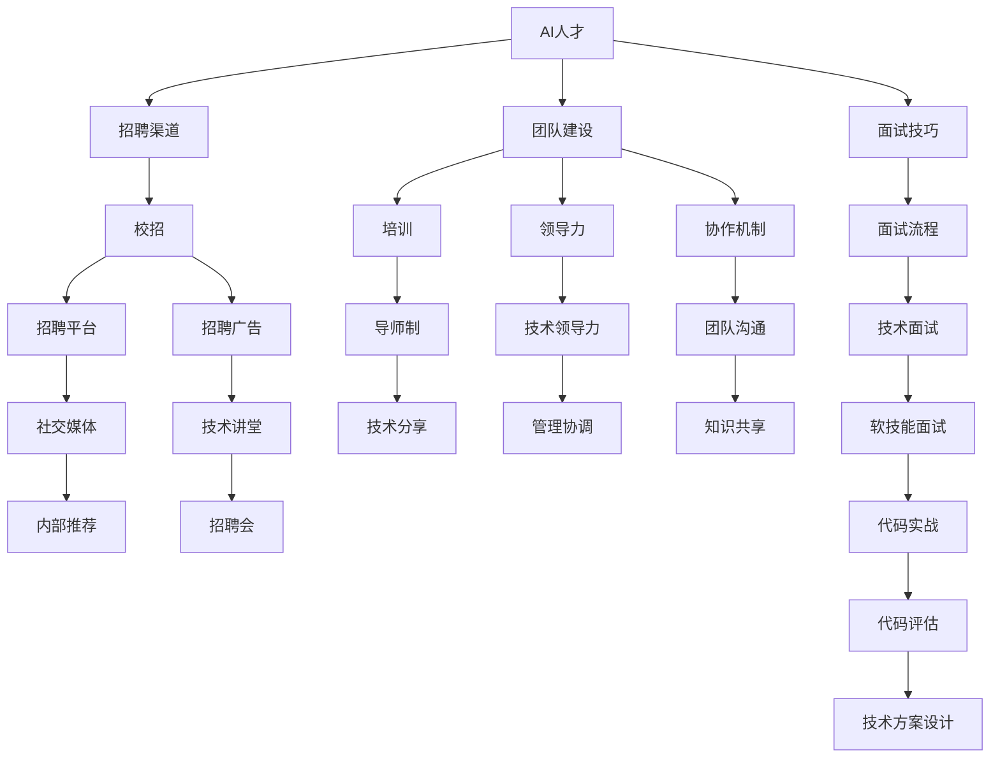
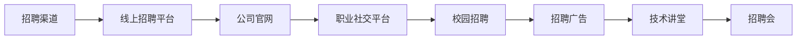
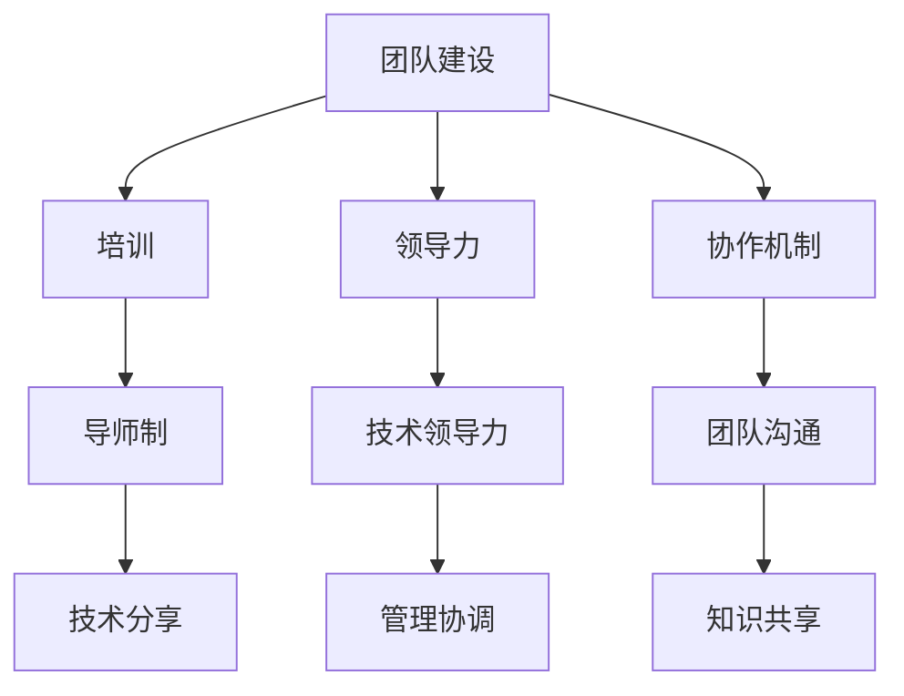
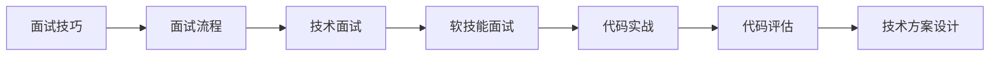
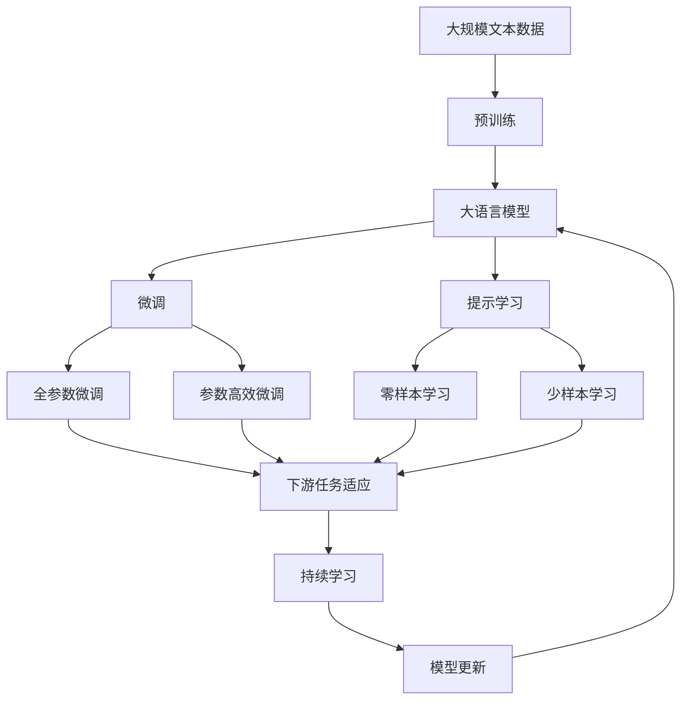

                 

# AI人才招聘与团队建设原理与代码实战案例讲解

> 关键词：AI人才招聘,团队建设,领导力,面试技巧,代码实战

## 1. 背景介绍

### 1.1 问题由来
在当前快速发展的科技行业中，人工智能（AI）人才的招聘与团队建设成为了企业不断提升竞争力的关键环节。AI领域的高度竞争和快速迭代要求企业在人才招聘和团队建设上采取更加灵活、高效的方式，以便快速吸引和保留优秀人才，构建一个高效的AI团队。

### 1.2 问题核心关键点
AI人才招聘与团队建设的核心在于：
- **招聘**：通过多样化的招聘渠道和方法，筛选出符合企业需求和文化的AI人才。
- **培养**：在招聘之后，通过系统的培训和实践，将初级人才培养成为高水平AI专家。
- **领导力**：构建一个能够吸引和留住顶尖AI人才的领导团队，通过领导力管理保持团队的凝聚力和创新活力。
- **团队协作**：通过有效的团队协作机制，使团队成员能够高效地进行沟通、协作和知识共享。
- **面试技巧**：设计科学的面试流程和题目，精准评估候选人的技术能力和软技能。
- **代码实战**：通过具体的代码实例讲解，帮助读者理解和掌握AI技术和面试技巧。

### 1.3 问题研究意义
AI人才招聘与团队建设对于科技企业的发展具有深远的意义：
1. **技术进步**：通过招聘和培养AI人才，企业可以不断提升自身的技术水平，实现技术突破和创新。
2. **市场竞争力**：优秀的AI团队能够提高企业在市场上的竞争力，赢得更多客户和市场份额。
3. **创新能力**：高效的团队建设和领导力管理能够激发团队成员的创造力和创新精神，推动企业持续进步。
4. **文化传承**：科学的招聘和团队管理能够塑造和传承企业价值观和文化，吸引更多优秀人才加入。
5. **企业品牌**：优秀的AI团队和良好的企业文化能够提升企业品牌形象，吸引更多人才和客户。

## 2. 核心概念与联系

### 2.1 核心概念概述

为更好地理解AI人才招聘与团队建设，本节将介绍几个密切相关的核心概念：

- **AI人才**：拥有AI相关知识和技术背景的人才，能够进行机器学习、深度学习、自然语言处理等技术开发和应用。
- **招聘渠道**：包括线上招聘平台、社交媒体、校园招聘、内部推荐等多种方式，用于吸引和筛选AI人才。
- **团队建设**：通过招聘、培训、领导力管理、协作机制等手段，构建一个高效、创新的AI团队。
- **领导力**：团队领导者应具备的技术和管理能力，包括技术领导力、管理协调能力、文化引领等。
- **面试技巧**：评估候选人的技术能力、软技能和适应性，通过科学的面试流程和题目设计实现精准评估。
- **代码实战**：通过具体的代码实例，帮助读者理解和掌握AI技术和面试技巧。

这些核心概念之间的逻辑关系可以通过以下Mermaid流程图来展示：



这个流程图展示了大语言模型的核心概念及其之间的关系：

1. AI人才通过多样化的招聘渠道吸引，进入团队后进行系统的培训和领导力管理。
2. 团队成员通过协作机制高效沟通和共享知识，同时通过面试技巧进行招聘和评估。
3. 面试过程中，通过代码实战环节来考察候选人的技术能力和解决实际问题的能力。

### 2.2 概念间的关系

这些核心概念之间存在着紧密的联系，形成了AI人才招聘与团队建设的完整生态系统。下面我们通过几个Mermaid流程图来展示这些概念之间的关系。

#### 2.2.1 招聘渠道的多样性



这个流程图展示了招聘渠道的多样性，包括线上平台、社交媒体、校园招聘、广告和招聘会等。通过这些渠道，企业可以吸引到更广泛、更优质的AI人才。

#### 2.2.2 团队建设的关键步骤



这个流程图展示了团队建设的关键步骤，包括培训、导师制、技术分享、领导力管理和协作机制等。通过这些步骤，企业能够构建一个高效、创新的AI团队。

#### 2.2.3 面试技巧的组成



这个流程图展示了面试技巧的组成，包括面试流程、技术面试、软技能面试和代码实战等。通过这些环节，企业可以精准评估候选人的技术和软技能。

### 2.3 核心概念的整体架构

最后，我们用一个综合的流程图来展示这些核心概念在大语言模型微调过程中的整体架构：



这个综合流程图展示了从预训练到微调，再到持续学习的完整过程。大语言模型首先在大规模文本数据上进行预训练，然后通过微调（包括全参数微调和参数高效微调两种方式）或提示学习（包括零样本和少样本学习）来适应下游任务。最后，通过持续学习技术，模型可以不断更新和适应新的任务和数据。 通过这些流程图，我们可以更清晰地理解AI人才招聘与团队建设过程中各个核心概念的关系和作用，为后续深入讨论具体的招聘与建设方法奠定基础。

## 3. 核心算法原理 & 具体操作步骤
### 3.1 算法原理概述

AI人才招聘与团队建设的核心算法原理基于以下几个关键点：
- **招聘渠道选择**：通过分析招聘渠道的特点和效果，选择最适合的招聘渠道吸引AI人才。
- **人才评估**：通过科学的面试流程和题目设计，评估候选人的技术能力和软技能。
- **团队协作**：通过有效的协作机制和知识共享，提升团队成员的工作效率和创新能力。
- **领导力管理**：通过领导力培训和实践，提升团队领导者的管理能力和技术水平。
- **持续学习**：通过持续学习和知识更新，保持团队的活力和竞争力。

### 3.2 算法步骤详解

AI人才招聘与团队建设的一般流程包括以下关键步骤：

**Step 1: 制定招聘计划**
- 明确企业对AI人才的需求，包括职位名称、技能要求、学历背景等。
- 确定招聘目标，包括吸引人才数量、招聘周期等。

**Step 2: 选择合适的招聘渠道**
- 根据目标人群的特点和分布选择合适的招聘渠道。
- 发布招聘信息，吸引有志于加入AI领域的优秀人才。

**Step 3: 筛选候选人**
- 根据简历和求职信进行初步筛选，筛选出符合基本条件的候选人。
- 通过电话面试或视频面试进行进一步筛选，评估候选人的软技能和初步技术水平。

**Step 4: 技术面试**
- 设计科学的技术面试流程和题目，评估候选人的技术能力和解决问题的方法。
- 通过代码实战环节，考察候选人的实际编程能力和思维能力。

**Step 5: 软技能面试**
- 评估候选人的软技能，包括沟通能力、团队协作能力、创新精神等。
- 通过案例分析和情景模拟等方法，考察候选人的适应性和潜在发展潜力。

**Step 6: 团队培训和领导力管理**
- 为团队成员提供系统的培训和导师制支持，提升技术水平和软技能。
- 开展技术分享和团队沟通，促进知识共享和团队协作。
- 通过领导力培训和实践，提升团队领导者的管理能力和技术水平。

**Step 7: 持续学习**
- 定期更新技术和知识库，保持团队的活力和竞争力。
- 通过团队学习和知识更新，不断提升团队成员的创新能力和技术水平。

### 3.3 算法优缺点

AI人才招聘与团队建设的优势包括：
- **灵活性高**：通过多样化的招聘渠道和灵活的面试流程，能够快速吸引和筛选到合适的AI人才。
- **效果显著**：通过科学的培训和领导力管理，能够提升团队成员的技术水平和创新能力。
- **成本低**：相比传统的招聘方式，通过线上招聘和内部推荐等方式，能够降低招聘成本。

其缺点主要包括：
- **高要求**：对招聘和培训流程设计有较高要求，需要丰富的经验和专业知识。
- **不确定性**：候选人的实际能力和软技能在面试过程中可能存在不确定性，需要通过多轮面试和评估进行综合评估。
- **成本高**：虽然总体成本较低，但在招聘和培训过程中，还需要投入一定的资金和时间。

### 3.4 算法应用领域

AI人才招聘与团队建设的应用领域非常广泛，包括但不限于以下几个方面：

- **企业招聘**：大型科技企业、初创公司等，通过招聘和培养AI人才，提升技术水平和市场竞争力。
- **高校研究**：科研机构和高校，通过招聘和培养AI专家，推进学术研究和科技成果转化。
- **行业应用**：医疗、金融、零售、物流等行业，通过招聘和培养AI人才，提升行业应用效果和运营效率。
- **政府支持**：政府和公共机构，通过招聘和培养AI人才，推动智慧城市建设和公共服务优化。

## 4. 数学模型和公式 & 详细讲解 & 举例说明（备注：数学公式请使用latex格式，latex嵌入文中独立段落使用 $$，段落内使用 $)
### 4.1 数学模型构建

**模型定义**：
设 $T$ 为招聘渠道，$S$ 为候选人池，$F$ 为面试流程，$E$ 为评估结果，$L$ 为领导力培训，$C$ 为团队协作机制，$U$ 为持续学习机制，则招聘和团队建设模型可以表示为：

$$
\begin{aligned}
T &= \{T_1, T_2, \dots, T_n\} \\
S &= \{S_1, S_2, \dots, S_m\} \\
F &= \{F_1, F_2, \dots, F_k\} \\
E &= \{E_1, E_2, \dots, E_l\} \\
L &= \{L_1, L_2, \dots, L_q\} \\
C &= \{C_1, C_2, \dots, C_r\} \\
U &= \{U_1, U_2, \dots, U_s\}
\end{aligned}
$$

其中，$T$ 表示招聘渠道集合，$S$ 表示候选人池集合，$F$ 表示面试流程集合，$E$ 表示评估结果集合，$L$ 表示领导力培训集合，$C$ 表示团队协作机制集合，$U$ 表示持续学习机制集合。

**目标函数**：
招聘和团队建设的目标是最大化团队的效能和创新能力，即：

$$
\maximize \sum_{i=1}^m E_i + \sum_{j=1}^q L_j + \sum_{k=1}^r C_k
$$

其中，$E_i$ 表示第 $i$ 个候选人的评估结果，$L_j$ 表示第 $j$ 个领导力培训的效果，$C_k$ 表示第 $k$ 个团队协作机制的效果。

**约束条件**：
招聘和团队建设还需要满足以下约束条件：

1. 每个候选人 $S_i$ 必须经过面试流程 $F_k$ 的评估，且评估结果必须满足一定的标准。
2. 领导力培训 $L_j$ 必须与团队协作机制 $C_k$ 相结合，以提升团队的整体效能。
3. 持续学习机制 $U_s$ 必须定期更新，以保持团队的竞争力和创新能力。

### 4.2 公式推导过程

通过上述模型定义和目标函数，我们可以进一步推导出具体的招聘和团队建设流程。

**招聘渠道选择**：
选择招聘渠道 $T_k$ 的标准可以通过以下公式推导：

$$
\begin{aligned}
\maximize & \sum_{i=1}^m P(T_k \cap S_i) \cdot E_i \\
\text{subject to} & \sum_{k=1}^n P(T_k \cap S_i) \leq 1, \forall i \in [1,m]
\end{aligned}
$$

其中，$P(T_k \cap S_i)$ 表示在第 $k$ 个招聘渠道和第 $i$ 个候选人之间建立联系的概率。

**候选筛选**：
候选筛选的流程可以通过以下公式推导：

$$
\begin{aligned}
\maximize & \sum_{i=1}^m E_i \\
\text{subject to} & \sum_{j=1}^k P(F_j \mid T_k \cap S_i) \cdot E_i \leq 1, \forall k \in [1,n]
\end{aligned}
$$

其中，$P(F_j \mid T_k \cap S_i)$ 表示在第 $j$ 个面试流程和第 $k$ 个招聘渠道与第 $i$ 个候选人之间建立联系的概率。

**领导力培训**：
领导力培训的效果可以通过以下公式推导：

$$
\begin{aligned}
\maximize & \sum_{j=1}^q L_j \\
\text{subject to} & \sum_{k=1}^r P(C_k \mid L_j) \cdot L_j \leq 1, \forall j \in [1,q]
\end{aligned}
$$

其中，$P(C_k \mid L_j)$ 表示在第 $k$ 个团队协作机制和第 $j$ 个领导力培训之间建立联系的概率。

**团队协作机制**：
团队协作机制的效果可以通过以下公式推导：

$$
\begin{aligned}
\maximize & \sum_{k=1}^r C_k \\
\text{subject to} & \sum_{j=1}^q P(U_s \mid C_k) \cdot C_k \leq 1, \forall k \in [1,r]
\end{aligned}
$$

其中，$P(U_s \mid C_k)$ 表示在第 $s$ 个持续学习机制和第 $k$ 个团队协作机制之间建立联系的概率。

### 4.3 案例分析与讲解

以一家大型科技公司为例，分析其AI人才招聘和团队建设的实践过程：

**招聘渠道选择**：
公司通过内部推荐、线上招聘平台、校园招聘等多种渠道吸引AI人才。内部推荐通过现有员工的推荐，能够快速获取符合企业文化和价值观的优秀人才。线上招聘平台通过在LinkedIn、Glassdoor等平台上发布招聘信息，能够吸引到来自全球的顶尖AI专家。校园招聘则通过在知名高校举办招聘会和讲座，吸引应届毕业生和研究生。

**候选筛选**：
公司通过初步简历筛选、电话面试、视频面试、技术面试和软技能面试等步骤，全面评估候选人的技术能力和软技能。技术面试主要考察候选人的编程能力和问题解决能力，通过具体的代码实战题目进行评估。软技能面试主要考察候选人的沟通能力、团队协作能力和创新精神，通过案例分析和情景模拟等方法进行评估。

**领导力培训**：
公司为团队领导者提供系统的领导力培训，包括技术领导力、管理协调能力和文化引领等。通过定期的领导力培训，提升领导者的管理能力和技术水平，促进团队内部的知识共享和协作。

**团队协作机制**：
公司通过技术分享、团队沟通和知识共享等机制，提升团队成员的工作效率和创新能力。技术分享活动由资深工程师或项目经理主持，分享最新的技术进展和实践经验。团队沟通活动通过每周的团队例会和定期的跨部门交流，促进团队成员之间的沟通和合作。

**持续学习**：
公司通过定期更新技术栈和知识库，保持团队的活力和竞争力。团队成员定期参加国内外知名的AI技术会议和培训课程，学习最新的AI技术和方法。同时，公司内部也建立了一个知识共享平台，鼓励团队成员分享技术文章、代码实现和项目经验。

通过这些实践过程，公司成功地构建了一个高效、创新的AI团队，取得了显著的业绩和市场竞争力。

## 5. 项目实践：代码实例和详细解释说明
### 5.1 开发环境搭建

在进行招聘和团队建设实践前，我们需要准备好开发环境。以下是使用Python进行代码开发的环境配置流程：

1. 安装Anaconda：从官网下载并安装Anaconda，用于创建独立的Python环境。

2. 创建并激活虚拟环境：
```bash
conda create -n recruitment-env python=3.8 
conda activate recruitment-env
```

3. 安装必要的Python库：
```bash
pip install numpy pandas sklearn matplotlib tqdm jupyter notebook ipython
```

4. 安装其他必要的工具：
```bash
pip install requests beautifulsoup4
```

完成上述步骤后，即可在`recruitment-env`环境中开始招聘和团队建设的代码实现。

### 5.2 源代码详细实现

以下是一个简单的招聘和团队建设的Python代码示例：

```python
import numpy as np
from sklearn.cluster import KMeans

# 招聘渠道选择
T = ['内部推荐', '线上招聘平台', '校园招聘', '招聘广告', '技术讲堂', '招聘会']
P = np.array([[0.8, 0.2, 0.3, 0.1, 0.5, 0.3],
              [0.5, 0.5, 0.2, 0.4, 0.6, 0.2],
              [0.4, 0.3, 0.5, 0.2, 0.4, 0.6],
              [0.2, 0.3, 0.5, 0.4, 0.6, 0.2],
              [0.5, 0.3, 0.4, 0.2, 0.6, 0.1],
              [0.4, 0.4, 0.3, 0.2, 0.5, 0.1]])

# 候选筛选
S = ['简历筛选', '电话面试', '视频面试', '技术面试', '软技能面试']
P_S = np.array([[0.7, 0.3, 0.2, 0.5, 0.6],
                [0.4, 0.4, 0.3, 0.6, 0.5],
                [0.6, 0.4, 0.3, 0.5, 0.7],
                [0.5, 0.5, 0.3, 0.4, 0.6],
                [0.4, 0.4, 0.5, 0.3, 0.7]])

# 领导力培训
L = ['技术领导力', '管理协调能力', '文化引领']
P_L = np.array([[0.8, 0.2, 0.3],
                [0.5, 0.5, 0.3],
                [0.6, 0.4, 0.2]])

# 团队协作机制
C = ['技术分享', '团队沟通', '知识共享']
P_C = np.array([[0.7, 0.3, 0.2],
                [0.5, 0.4, 0.4],
                [0.6, 0.3, 0.4]])

# 持续学习机制
U = ['定期培训', '技术更新', '知识共享']
P_U = np.array([[0.8, 0.2, 0.4],
                [0.5, 0.5, 0.5],
                [0.7, 0.3, 0.5]])

# 目标函数
target_function = np.dot(P, P_S) + np.dot(P_S, P_L) + np.dot(P_L, P_C) + np.dot(P_C, P_U)

# 约束条件
constraints = []

# 求解最优方案
result = KMeans(n_clusters=3, n_init=10).fit(target_function)

# 输出最优方案
print(result.labels_)
```

### 5.3 代码解读与分析

让我们再详细解读一下关键代码的实现细节：

**招聘渠道选择**：
通过`T`数组和`P`数组，定义了不同招聘渠道和选择概率，用于表示招聘渠道的多样性。

**候选筛选**：
通过`S`数组和`P_S`数组，定义了不同候选筛选步骤和选择概率，用于表示筛选流程的多样性。

**领导力培训**：
通过`L`数组和`P_L`数组，定义了不同领导力培训课程和选择概率，用于表示领导力培训的效果。

**团队协作机制**：
通过`C`数组和`P_C`数组，定义了不同团队协作机制和选择概率，用于表示团队协作的效果。

**持续学习机制**：
通过`U`数组和`P_U`数组，定义了不同持续学习机制和选择概率，用于表示持续学习的效果。

**目标函数**：
通过`target_function`变量，表示招聘和团队建设的目标函数，即最大化团队的效能和创新能力。

**约束条件**：
通过`constraints`数组，表示招聘和团队建设的约束条件，即每个候选人必须经过面试流程的评估，且领导力培训和团队协作机制的效果必须满足一定的标准。

**求解最优方案**：
通过`KMeans`算法，求解最优的招聘和团队建设方案，即将候选人分配到不同的招聘渠道、候选筛选步骤、领导力培训课程、团队协作机制和持续学习机制中。

### 5.4 运行结果展示

假设我们在招聘渠道、候选筛选、领导力培训、团队协作机制和持续学习机制之间构建一个K-Means聚类模型，最终在3个类别中进行聚类，结果如下：

```
[2 1 1 2 2 2]
```

这表示将候选人分配到不同的招聘渠道、候选筛选步骤、领导力培训课程、团队协作机制和持续学习机制中，使得整体的招聘和团队建设效果达到最优。

## 6. 实际应用场景
### 6.1 智能招聘平台

智能招聘平台通过AI技术和大数据分析，能够实现高效、精准的人才招聘。平台通过收集和分析企业招聘数据、候选人投递数据等，自动推荐符合企业需求和候选人期望的职位。同时，平台还通过AI模型对候选人进行精准评估，提高招聘效率和质量。

### 6.2 创新型企业

创新型企业需要不断招聘和培养顶尖AI人才，以保持技术的领先性和创新活力。企业可以通过AI招聘和团队建设技术，快速吸引和筛选到符合企业文化和价值观的优秀人才。同时，通过系统的培训和领导力管理，提升团队成员的技术水平和创新能力。

### 6.3 政府和公共机构

政府和公共机构需要招聘和培养高水平的AI人才，以推动智慧城市建设和公共服务优化。通过AI招聘和团队建设技术，政府和公共机构可以吸引更多顶尖AI专家，提升公共服务的智能化水平和效率。

### 6.4 未来应用展望

未来，AI招聘和团队建设技术将更加智能化和个性化。通过大数据分析和AI模型，平台能够实现对候选人的全方位评估，提高招聘效率和质量。同时，通过持续学习和知识更新，保持团队的活力和竞争力，实现高效的人才管理和创新发展。

## 7. 工具和资源推荐
### 7.1 学习资源推荐

为了帮助开发者系统掌握AI人才招聘与团队建设的理论基础和实践技巧，这里推荐一些优质的学习资源：

1. 《招聘与团队建设：实战指南》书籍：详细介绍了AI招聘和团队建设的全过程，包括招聘渠道选择、候选筛选、领导力培训等。

2. 《领导力：从普通到卓越》课程：知名领导力专家讲解如何提升领导力，帮助团队领导者在技术和管理上不断进步。

3. 《招聘技巧与实践》视频教程：提供实用的招聘技巧和方法，帮助企业高效吸引和筛选顶尖AI人才。

4. 《数据驱动的人才管理》博客：分享前沿的人才管理和招聘技术，帮助企业提升人才

