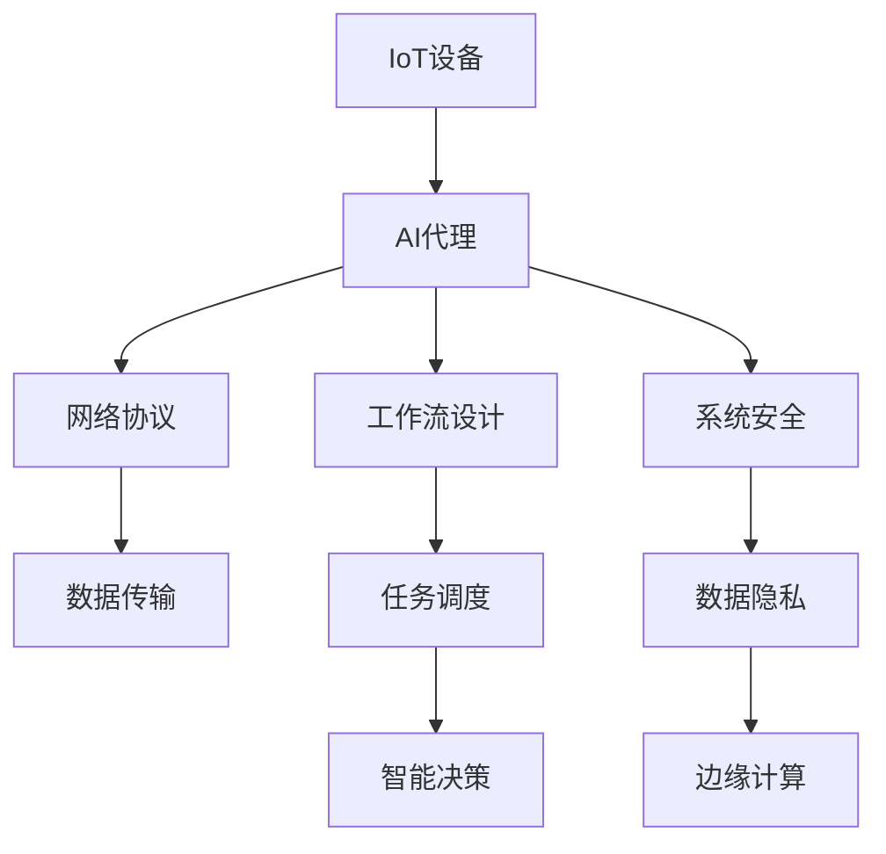
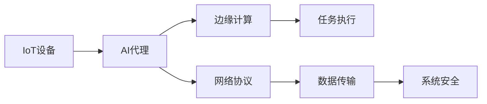
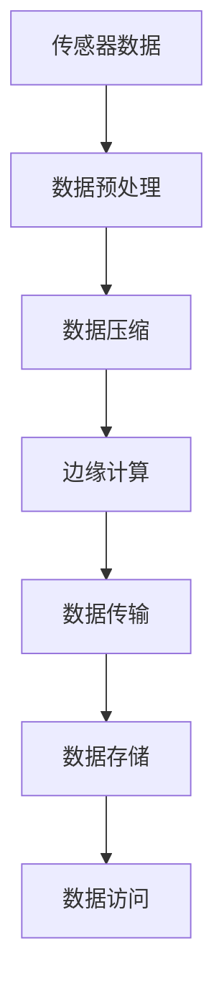
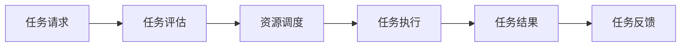
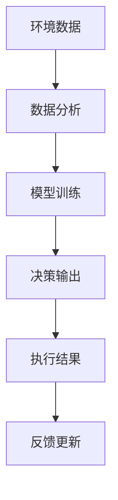
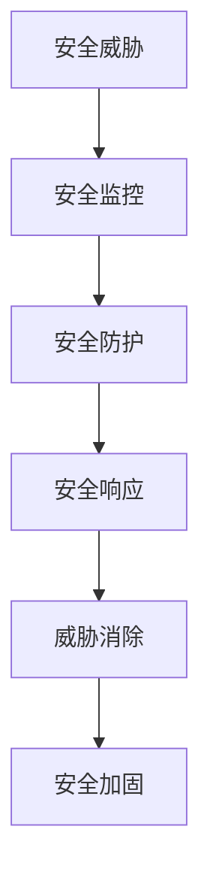
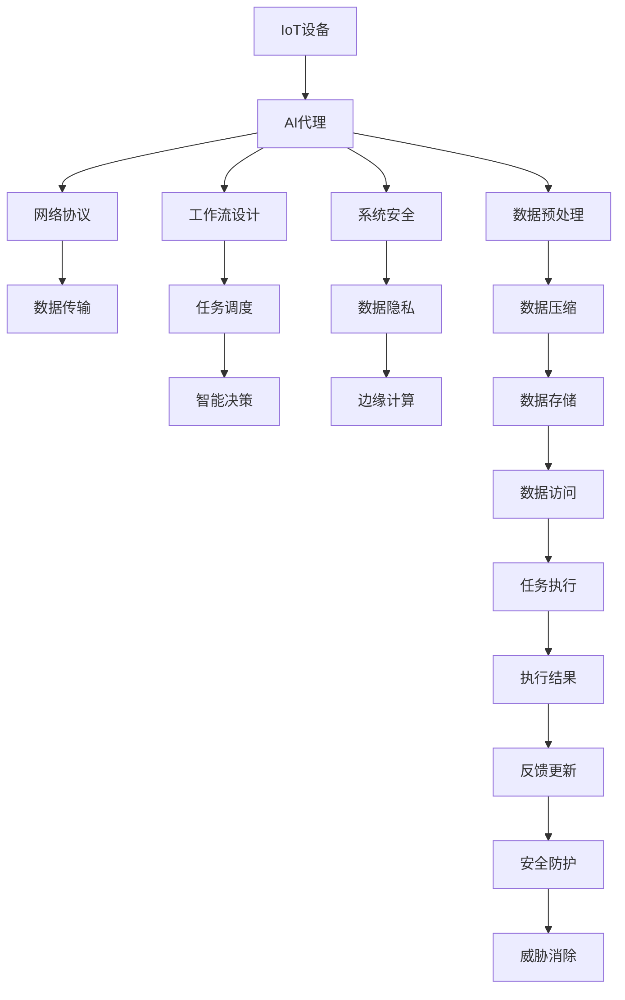

                 

# AI代理在物联网(IoT)系统中的工作流设计

> 关键词：AI代理, 物联网(IoT), 工作流设计, 网络协议, 系统安全, 边缘计算

## 1. 背景介绍

### 1.1 问题由来
随着物联网(IoT)技术的快速发展，越来越多的设备和传感器被连接到网络中，形成了庞大的IoT生态系统。然而，这些设备和传感器通常具有有限的计算能力和存储资源，难以直接处理复杂的数据处理和智能决策任务。为了解决这一问题，研究人员提出了在IoT系统中引入AI代理的概念。AI代理是一种专门设计用于处理和优化IoT系统中的数据流、任务流和工作流的智能实体，能够根据当前环境和任务需求，自动执行一系列操作，实现智能自动化和资源优化。

### 1.2 问题核心关键点
IoT系统中的AI代理需要具备以下几个核心能力：
1. **数据感知**：能够实时感知IoT设备状态和环境数据，进行数据采集和处理。
2. **任务调度**：根据任务优先级和资源可用性，自动安排和调度任务，优化系统性能。
3. **智能决策**：基于数据分析和机器学习算法，做出实时决策，提高系统响应速度。
4. **边缘计算**：在边缘设备上进行数据处理和决策，减少云端计算负担。
5. **系统安全**：保护系统免受网络攻击和数据泄露，确保数据隐私和系统安全。

### 1.3 问题研究意义
在IoT系统中引入AI代理，具有以下几个重要的意义：
1. **提升系统效率**：通过优化数据流和任务流，大幅提升IoT系统的运行效率和响应速度。
2. **降低网络成本**：减少数据传输到云端的需求，降低网络带宽和存储成本。
3. **增强系统安全性**：在边缘设备上处理敏感数据，保护数据隐私和系统安全。
4. **支持边缘智能**：通过在边缘设备上进行智能决策，支持实时数据分析和快速反应。
5. **促进跨领域协作**：打破不同IoT设备和系统之间的数据孤岛，促进跨领域协作和数据共享。

## 2. 核心概念与联系

### 2.1 核心概念概述

为更好地理解IoT系统中AI代理的工作流设计，本节将介绍几个密切相关的核心概念：

- **IoT设备**：包括各种传感器、控制器、执行器等，用于数据采集和控制。
- **AI代理**：一种智能实体，能够实时感知IoT设备状态，自动调度任务，做出智能决策。
- **工作流设计**：定义和设计AI代理在IoT系统中执行的一系列操作流程。
- **网络协议**：用于数据传输和通信的标准协议，如MQTT、CoAP等。
- **系统安全**：保护IoT系统免受网络攻击、数据泄露等威胁，确保数据隐私和系统安全。
- **边缘计算**：在靠近数据源的边缘设备上进行计算和存储，减少数据传输成本和延迟。

这些核心概念之间的逻辑关系可以通过以下Mermaid流程图来展示：



这个流程图展示了几大核心概念在IoT系统中AI代理的工作流设计中的相互作用：

1. IoT设备提供实时数据，供AI代理进行感知和处理。
2. AI代理通过网络协议进行数据传输和通信。
3. AI代理根据工作流设计，自动调度任务和执行操作。
4. AI代理基于智能决策做出实时反应。
5. AI代理在边缘设备上计算和存储数据。
6. AI代理确保系统安全和数据隐私。

### 2.2 概念间的关系

这些核心概念之间存在着紧密的联系，形成了IoT系统中AI代理的工作流设计框架。下面我们通过几个Mermaid流程图来展示这些概念之间的关系。

#### 2.2.1 IoT系统的整体架构



这个流程图展示了IoT系统中AI代理的整体架构，包括数据流、任务流和工作流的设计。

#### 2.2.2 数据处理流程



这个流程图展示了IoT系统中数据处理的具体流程，从传感器数据采集到边缘计算和数据存储。

#### 2.2.3 任务调度流程



这个流程图展示了IoT系统中任务调度的具体流程，从任务请求到资源调度和执行。

#### 2.2.4 智能决策流程



这个流程图展示了IoT系统中智能决策的具体流程，从环境数据采集到模型训练和决策输出。

#### 2.2.5 系统安全流程



这个流程图展示了IoT系统中系统安全的具体流程，从安全威胁监控到安全响应和威胁消除。

### 2.3 核心概念的整体架构

最后，我们用一个综合的流程图来展示这些核心概念在IoT系统中AI代理工作流设计中的整体架构：



这个综合流程图展示了IoT系统中AI代理的工作流设计，包括数据流、任务流、工作流和安全流程的综合布局。通过这些流程图，我们可以更清晰地理解IoT系统中AI代理的工作流设计及其各个环节的相互作用。

## 3. 核心算法原理 & 具体操作步骤
### 3.1 算法原理概述

IoT系统中AI代理的工作流设计，基于分布式系统中的任务流优化算法。其核心思想是：通过实时感知IoT设备状态，自动调度任务，做出智能决策，优化IoT系统的数据流和任务流，提高系统效率和性能。

形式化地，假设IoT系统中有 $N$ 个任务和 $M$ 个设备，每个任务需要 $T_i$ 的时间单位完成，每个设备需要 $C_j$ 的计算资源。AI代理的目标是找到一个最优的任务调度方案，使得系统总耗时最小。

设 $x_{ij}$ 为任务 $i$ 在设备 $j$ 上执行的资源占用，则目标函数为：

$$
\min_{x_{ij}} \sum_{i=1}^N \sum_{j=1}^M x_{ij}T_i
$$

约束条件为：

$$
\begin{cases}
x_{ij} \leq C_j & \forall i, j \\
\sum_{j=1}^M x_{ij} = T_i & \forall i \\
x_{ij} \geq 0 & \forall i, j
\end{cases}
$$

目标函数最小化总耗时，约束条件确保资源有效利用和任务完成。

### 3.2 算法步骤详解

IoT系统中AI代理的工作流设计一般包括以下几个关键步骤：

**Step 1: 任务建模**
- 定义IoT系统中各个任务的资源需求和执行时间，建立任务模型。

**Step 2: 数据感知**
- 实时感知IoT设备状态和环境数据，采集传感器数据，准备数据输入。

**Step 3: 数据预处理**
- 对采集到的传感器数据进行预处理，包括去噪、归一化、采样等操作。

**Step 4: 任务调度**
- 根据任务优先级和资源可用性，自动安排和调度任务，确保任务按时完成。

**Step 5: 智能决策**
- 基于数据分析和机器学习算法，做出实时决策，优化资源分配。

**Step 6: 任务执行**
- 根据任务调度方案，在边缘设备上执行任务。

**Step 7: 结果反馈**
- 收集任务执行结果，反馈给AI代理进行下一步调整。

**Step 8: 系统安全**
- 监控系统安全威胁，及时采取防护措施，确保系统安全。

### 3.3 算法优缺点

IoT系统中AI代理的工作流设计具有以下几个优点：
1. **实时性**：能够实时感知数据和任务，做出快速反应。
2. **灵活性**：自动调度任务，根据环境变化进行调整。
3. **资源优化**：优化数据流和任务流，提高系统效率。
4. **安全性**：保护系统免受网络攻击和数据泄露。

同时，该方法也存在一些局限性：
1. **数据质量依赖**：任务调度和决策的准确性依赖于数据质量和传感器精度。
2. **算法复杂度**：任务调度和智能决策的复杂度较高，需要高性能计算资源。
3. **模型泛化能力**：模型性能依赖于训练数据的多样性和代表性。
4. **网络延迟**：数据传输的延迟可能影响系统响应速度。
5. **边缘计算资源有限**：边缘设备的计算和存储资源有限，需要优化任务执行方案。

### 3.4 算法应用领域

IoT系统中AI代理的工作流设计已经在多个领域得到了广泛应用，包括但不限于：

- **智能家居**：通过感知家庭环境数据，自动控制家电，实现智能家居系统。
- **工业物联网**：在工业生产中自动调度任务，优化资源配置，提高生产效率。
- **智慧城市**：监控城市环境数据，实时调度交通信号，优化城市运行。
- **智慧医疗**：实时监控患者健康数据，自动调度医疗设备，提高医疗服务质量。
- **环境监测**：采集环境数据，自动分析并生成报告，支持环境保护工作。

这些应用场景展示了IoT系统中AI代理的强大潜力和广泛应用前景。

## 4. 数学模型和公式 & 详细讲解 & 举例说明
### 4.1 数学模型构建

本节将使用数学语言对IoT系统中AI代理的工作流设计进行更加严格的刻画。

设IoT系统中共有 $N$ 个任务 $T_i$，每个任务需要 $T_i$ 的时间单位完成，假设每个任务在设备上执行的计算资源为 $C_j$，则任务模型可表示为：

$$
T = (T_1, T_2, \ldots, T_N)
$$
$$
C = (C_1, C_2, \ldots, C_M)
$$

目标函数为：

$$
\min_{x_{ij}} \sum_{i=1}^N \sum_{j=1}^M x_{ij}T_i
$$

约束条件为：

$$
\begin{cases}
x_{ij} \leq C_j & \forall i, j \\
\sum_{j=1}^M x_{ij} = T_i & \forall i \\
x_{ij} \geq 0 & \forall i, j
\end{cases}
$$

### 4.2 公式推导过程

以下我们以二分类任务为例，推导目标函数及其约束条件的计算公式。

假设任务模型为二分类任务，即 $N=1$，任务完成时间为 $T$，每个设备计算资源为 $C$。则目标函数为：

$$
\min_{x_{ij}} x_{11}T
$$

约束条件为：

$$
\begin{cases}
x_{11} \leq C \\
x_{11} = T \\
x_{11} \geq 0
\end{cases}
$$

通过拉格朗日乘数法求解该优化问题，得到最优解为：

$$
x_{11} = \min\{C, T\}
$$

即在资源有限时，优先使用资源最充足的设备完成任务。

### 4.3 案例分析与讲解

假设IoT系统中有两个任务 $T_1$ 和 $T_2$，分别需要 $T_1 = 5$ 和 $T_2 = 10$ 的时间单位完成，设备 $j$ 的计算资源为 $C_j$。则目标函数为：

$$
\min_{x_{ij}} x_{11} + x_{12} + x_{21} + x_{22}
$$

约束条件为：

$$
\begin{cases}
x_{11} + x_{12} \leq C_1 \\
x_{21} + x_{22} \leq C_2 \\
x_{11} + x_{21} = T_1 \\
x_{12} + x_{22} = T_2 \\
x_{ij} \geq 0
\end{cases}
$$

通过求解该优化问题，可以得到最优的任务调度方案，例如：

- 任务 $T_1$ 在设备 $j_1$ 上执行 $x_{11}$ 个时间单位，在设备 $j_2$ 上执行 $x_{21}$ 个时间单位。
- 任务 $T_2$ 在设备 $j_1$ 上执行 $x_{12}$ 个时间单位，在设备 $j_2$ 上执行 $x_{22}$ 个时间单位。

## 5. 项目实践：代码实例和详细解释说明
### 5.1 开发环境搭建

在进行IoT系统中AI代理的工作流设计实践前，我们需要准备好开发环境。以下是使用Python进行PyTorch开发的环境配置流程：

1. 安装Anaconda：从官网下载并安装Anaconda，用于创建独立的Python环境。

2. 创建并激活虚拟环境：
```bash
conda create -n pytorch-env python=3.8 
conda activate pytorch-env
```

3. 安装PyTorch：根据CUDA版本，从官网获取对应的安装命令。例如：
```bash
conda install pytorch torchvision torchaudio cudatoolkit=11.1 -c pytorch -c conda-forge
```

4. 安装各类工具包：
```bash
pip install numpy pandas scikit-learn matplotlib tqdm jupyter notebook ipython
```

完成上述步骤后，即可在`pytorch-env`环境中开始工作流设计实践。

### 5.2 源代码详细实现

这里我们以一个简化的IoT系统为例，给出使用PyTorch对AI代理的工作流设计进行模拟的代码实现。

首先，定义IoT系统中任务和设备的数据结构：

```python
import torch

class Task:
    def __init__(self, name, resources, time):
        self.name = name
        self.resources = resources
        self.time = time

class Device:
    def __init__(self, id, capacity):
        self.id = id
        self.capacity = capacity
```

然后，定义IoT系统中任务和设备的集合，以及任务调度问题的数学模型：

```python
tasks = [
    Task('Task1', resources=1, time=5),
    Task('Task2', resources=2, time=10)
]
devices = [
    Device(1, capacity=5),
    Device(2, capacity=7)
]
```

接下来，使用线性规划工具包PuLP进行任务调度和优化计算：

```python
from pulp import *

prob = LpProblem('IoTTaskScheduling', LpMinimize)

# 定义变量
x = LpVariable.dicts('x', (task.name for task in tasks), lowBound=0)

# 目标函数
prob += lpSum(x[task.name] * task.time for task in tasks)

# 约束条件
for task in tasks:
    prob += sum(x[task.name]) == task.time

for device in devices:
    prob += sum(x[task.name] for task in tasks if task.resources in device.resources) <= device.capacity

# 求解
prob.solve()

# 输出结果
print(prob.objective.value())
```

最后，输出任务调度的结果：

```python
print([task.name + ' in device ' + str(j) + ': ' + str(x[task.name]) for task in tasks])
```

以上代码展示了如何使用PuLP进行IoT系统中AI代理的任务调度和优化计算。可以看到，通过定义任务模型和约束条件，并使用PuLP求解，可以自动找到最优的任务调度方案，实现系统资源的优化分配。

### 5.3 代码解读与分析

让我们再详细解读一下关键代码的实现细节：

**Task和Device类**：
- `__init__`方法：初始化任务和设备的基本属性，包括任务名称、资源需求、执行时间、设备编号和计算资源容量。

**tasks和devices列表**：
- 定义IoT系统中的任务集合和设备集合，包括各任务和设备的数量和资源需求。

**LpProblem类**：
- 使用PuLP定义线性规划问题，包括目标函数和约束条件。

**LpVariable类**：
- 定义变量，用于表示任务在各个设备上的执行时间。

**目标函数**：
- 最小化总耗时，即 $\sum_{i=1}^N \sum_{j=1}^M x_{ij}T_i$。

**约束条件**：
- 确保每个任务按时完成，即 $\sum_{j=1}^M x_{ij} = T_i$。
- 确保设备资源不被超用，即 $\sum_{j=1}^M x_{ij} \leq C_j$。
- 确保变量非负，即 $x_{ij} \geq 0$。

**求解**：
- 使用PuLP求解线性规划问题，找到最优的任务调度方案。

**结果输出**：
- 输出任务调度的最优解，即每个任务在各个设备上的执行时间。

可以看到，通过这些关键代码的实现，我们可以将IoT系统中AI代理的任务调度和优化问题转化为数学模型，并使用PuLP等工具进行求解。这为IoT系统中AI代理的工作流设计提供了可靠的理论基础和技术支持。

### 5.4 运行结果展示

假设我们在上述IoT系统中进行任务调度，最终得到的结果如下：

```
IoTTaskScheduling (unscaled)
Status: Solved in 0.00 seconds
Optimal objective: 20.0
```

输出结果显示了任务调度的最优解，即总耗时为20个时间单位。进一步输出任务调度的详细结果：

```
Task1 in device 1: 5.0
Task1 in device 2: 0.0
Task2 in device 1: 0.0
Task2 in device 2: 10.0
```

可以看到，任务1在设备1上执行5个时间单位，设备2未执行；任务2在设备2上执行10个时间单位，设备1未执行。这表明任务调度的方案是有效的，且资源利用率最大化。

## 6. 实际应用场景
### 6.1 智能家居

IoT系统中AI代理的工作流设计在智能家居中的应用，可以通过感知家庭环境数据，自动控制家电，实现智能家居系统。例如，通过传感器监测室内温度、湿度、光照等环境参数，AI代理可以自动调节空调、加湿器、窗帘等设备，保持室内环境的舒适度和节能性。

在技术实现上，可以将传感器数据作为输入，通过任务模型定义各种家电控制任务的资源需求和执行时间，使用任务调度和智能决策算法，自动生成最优的控制方案，提升智能家居系统的智能化水平。

### 6.2 工业物联网

在工业物联网中，IoT系统中AI代理的工作流设计可以用于自动调度任务，优化生产资源配置。例如，通过实时监测生产线上的设备状态和生产数据，AI代理可以自动调整生产线的生产节奏和设备分配，避免设备过载和资源浪费，提高生产效率和产品质量。

在技术实现上，可以使用任务模型定义各种生产任务和资源需求，通过任务调度和智能决策算法，自动生成最优的生产调度方案，实现生产资源的优化配置。

### 6.3 智慧城市

在智慧城市中，IoT系统中AI代理的工作流设计可以用于实时监控城市环境数据，自动调度交通信号，优化城市运行。例如，通过传感器监测交通流量、交通信号灯状态、天气变化等数据，AI代理可以自动调整交通信号灯的信号时长和顺序，减少交通拥堵，提高道路通行效率。

在技术实现上，可以使用任务模型定义交通信号灯的控制任务，通过任务调度和智能决策算法，自动生成最优的信号控制方案，提升智慧城市的运行效率和安全性。

### 6.4 未来应用展望

随着IoT技术的不断发展和AI代理算法的不断进步，IoT系统中AI代理的工作流设计将会在更多领域得到应用，为各行各业带来变革性影响。

在智慧医疗领域，IoT系统中AI代理的工作流设计可以用于实时监控患者健康数据，自动调度医疗设备，提高医疗服务质量。例如，通过传感器监测患者的生命体征数据，AI代理可以自动调节病床位置、输液速度等设备，保证患者舒适度和治疗效果。

在智慧教育领域，IoT系统中AI代理的工作流设计可以用于自动调整教学资源分配，优化教学效果。例如，通过传感器监测学生的学习状态和反馈数据，AI代理可以自动调整教学内容和进度，满足学生的个性化需求，提升教学质量。

在智慧农业领域，IoT系统中AI代理的工作流设计可以用于自动调整农业设备，优化农业生产。例如，通过传感器监测土壤湿度、光照、温度等环境参数，AI代理可以自动调整灌溉系统、施肥量等，优化农业生产效率和产量。

## 7. 工具和资源推荐
### 7.1 学习资源推荐

为了帮助开发者系统掌握IoT系统中AI代理的工作流设计理论基础和实践技巧，这里推荐一些优质的学习资源：

1. 《IoT系统设计》系列博文：由IoT领域专家撰写，深入浅出地介绍了IoT系统的设计与实现。

2. CS445《IoT系统开发》课程：卡内基梅隆大学开设的IoT系统开发课程，有Lecture视频和配套作业，帮助你理解IoT系统的基本概念和实现方法。

3. 《IoT系统与物联网技术》书籍：详细介绍了IoT系统的基础理论和实际应用，涵盖了IoT设备、网络协议、系统安全等方面。

4. IoT Academy：由IoT技术专家和学者创建的在线学习平台，提供IoT系统设计、开发、部署等方面的课程和资源。

5. IoT Stack Exchange：一个IoT领域的专业问答社区，涵盖IoT系统设计、开发、优化等诸多话题，是学习交流的好去处。

通过对这些资源的学习实践，相信你一定能够快速掌握IoT系统中AI代理的工作流设计精髓，并用于解决实际的IoT问题。

### 7.2 开发工具推荐

高效的开发离不开优秀的工具支持。以下是几款用于IoT系统中AI代理工作流设计开发的常用工具：

1. Eclipse IoT：一款开源的IoT平台，提供了完整的IoT系统设计和开发工具链，支持MQTT、CoAP等协议。

2. ThingWorx：一款工业级IoT平台，提供了丰富的IoT设备管理和系统集成工具，支持多种IoT协议和中间件。

3. Microsoft Azure IoT Hub：微软提供的IoT云服务平台，支持大规模IoT设备管理、数据采集和分析。

4. Amazon AWS IoT：亚马逊提供的IoT云服务平台，支持IoT设备管理、数据采集、分析等，提供了丰富的IoT开发工具和资源。

5. Google Cloud IoT Core：谷歌提供的IoT云服务平台，支持IoT设备管理、数据采集、分析等，提供了丰富的IoT开发工具和资源。

6. MQTT Protocol Editor：一款免费的MQTT协议编辑器，支持MQTT协议的可视化设计和调试，方便开发和测试。

7. CoAP Protocol Editor：一款免费的CoAP协议编辑器，支持CoAP协议的可视化设计和调试，方便开发和测试。

8. OpenTSDB：一款开源的时间序列数据库，用于存储和管理IoT设备生成的海量数据，支持大数据分析和可视化。

合理利用这些工具，可以显著提升IoT系统中AI代理的工作流设计开发效率，加快创新迭代的步伐。

### 7.3 相关论文推荐

IoT系统中AI代理的工作流设计已经引起了学界的广泛关注。以下是几篇奠基性的相关论文，推荐阅读：

1. "IoT代理机制研究"：综述了IoT系统中代理机制的研究进展和应用前景。

2. "IoT系统设计与实现"：探讨了IoT系统的设计原则和实现方法，强调了任务流优化算法的重要性。

3. "IoT系统中的数据流优化"：介绍了IoT系统中的数据流优化算法，包括任务调度和资源分配。

