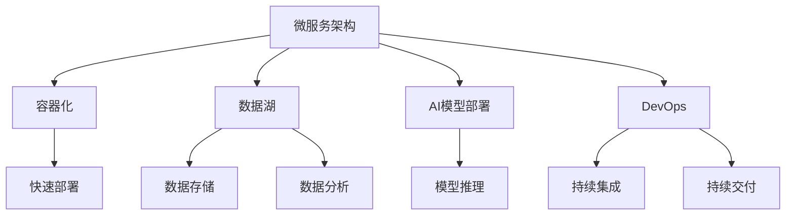

                 

# AI创业公司的技术架构设计

## 1. 背景介绍

在当下蓬勃发展的AI创业热潮中，构建一个高效、稳定、可扩展的技术架构成为创业公司成功的关键之一。面对来自市场、竞争和用户的多重挑战，创业公司如何设计技术架构，充分利用AI技术，以最小成本、最高效率、最大市场响应速度，是每个技术团队需要深入思考的问题。

### 1.1 问题由来

随着AI技术在各行各业的深入应用，AI创业公司如雨后春笋般涌现。然而，在技术快速迭代、市场变化莫测、竞争日趋激烈的环境下，构建一个高效、稳定、可扩展的技术架构，成为创业公司成功的关键之一。这需要技术团队深入理解业务需求、技术趋势、市场动态，以及如何利用AI技术创造价值。

### 1.2 问题核心关键点

在构建技术架构的过程中，创业公司需要重点关注以下几个关键点：

- **技术选型**：选择合适的技术栈和框架，满足业务需求，确保高效稳定。
- **微服务架构**：采用微服务架构，提高系统灵活性和可扩展性。
- **数据平台**：建立高效、安全、可扩展的数据平台，确保数据驱动决策。
- **AI模型部署**：设计可扩展、高效的AI模型部署和推理机制，实现快速迭代。
- **安全与隐私**：确保数据和模型安全，符合法律法规要求，保护用户隐私。

### 1.3 问题研究意义

构建高效、稳定、可扩展的技术架构，对于创业公司的成功至关重要。具体而言：

- **降低成本**：通过技术选型和微服务架构，降低系统开发和运维成本。
- **提升效率**：通过数据平台和AI模型部署，提升业务决策和产品迭代的效率。
- **增加灵活性**：通过微服务架构，提高系统的灵活性和可扩展性，快速响应市场变化。
- **保障安全**：通过数据安全和隐私保护，确保业务和用户信息的安全。

## 2. 核心概念与联系

### 2.1 核心概念概述

为了更好地理解AI创业公司的技术架构设计，我们首先介绍几个核心概念：

- **微服务架构(Microservices Architecture)**：将大型应用拆分成多个小服务，每个服务独立部署、独立运行，以提高系统的灵活性和可扩展性。
- **容器化(Docker & Kubernetes)**：通过容器化技术，将应用打包成容器，实现快速部署和跨环境一致性。
- **数据湖(Data Lake)**：构建统一的数据平台，存储海量数据，支持数据分析和机器学习。
- **AI模型部署**：将训练好的AI模型部署到生产环境，实现快速推理和迭代。
- **DevOps**：通过持续集成、持续交付等DevOps实践，提升系统开发和部署效率。

这些核心概念共同构成了AI创业公司的技术架构基础，相互联系，相互作用，支撑系统的灵活性、可扩展性和高效性。

### 2.2 概念间的关系

这些核心概念之间存在着紧密的联系，形成了AI创业公司的技术架构生态系统。下面通过几个Mermaid流程图来展示它们之间的关系：



这个流程图展示了大语言模型的核心概念及其之间的关系：

1. 微服务架构通过拆解应用，提高了系统的灵活性和可扩展性。
2. 容器化技术实现了快速部署和跨环境一致性。
3. 数据湖提供了统一的数据存储和分析平台。
4. AI模型部署实现了快速推理和迭代。
5. DevOps实践提升了系统开发和部署效率。

通过这些概念，我们可以更好地把握AI创业公司的技术架构设计方向。

## 3. 核心算法原理 & 具体操作步骤
### 3.1 算法原理概述

构建AI创业公司的技术架构，需要基于一系列核心算法和步骤。以下将详细介绍这些算法原理和具体操作步骤。

**3.1.1 技术选型**

技术选型是构建技术架构的第一步，涉及选择适合的编程语言、框架和云平台。以Python和Django框架为例，其优势在于丰富的第三方库和成熟的社区支持，可以快速开发和部署。选择云平台时，根据业务需求选择合适的云服务提供商，如AWS、Azure或Google Cloud。

**3.1.2 微服务架构设计**

微服务架构将应用拆分成多个小服务，每个服务独立部署、独立运行。这种架构提高了系统的灵活性和可扩展性，可以快速响应业务需求的变化。设计微服务时，需要考虑服务边界、服务间的通信协议、数据一致性等问题。

**3.1.3 容器化部署**

容器化技术实现了应用的快速部署和跨环境一致性。通过Docker容器和Kubernetes容器编排，可以确保应用在各种环境中的一致性和可靠性。

**3.1.4 数据湖构建**

构建数据湖，存储和管理海量数据，支持数据分析和机器学习。数据湖通常包括数据采集、数据存储、数据清洗、数据分析和机器学习等模块。

**3.1.5 AI模型部署**

将训练好的AI模型部署到生产环境，实现快速推理和迭代。选择合适的框架，如TensorFlow、PyTorch等，确保模型推理的高效性和准确性。

**3.1.6 DevOps实践**

通过持续集成、持续交付等DevOps实践，提升系统开发和部署效率。采用Git、CI/CD等工具，实现自动化构建、测试和部署。

### 3.2 算法步骤详解

**3.2.1 技术选型**

1. **编程语言**：选择Python作为主要开发语言，Python语言生态丰富，易于学习和使用。
2. **框架**：选择Django作为主要框架，Django提供了强大的ORM、模板系统和安全性保障。
3. **云平台**：选择AWS作为云服务提供商，AWS提供了丰富的云服务和工具，支持高效开发和部署。

**3.2.2 微服务架构设计**

1. **服务拆分**：将应用拆分为多个小服务，如用户服务、商品服务、订单服务等。
2. **服务通信**：设计服务间的通信协议，如RESTful API、gRPC等，确保服务间的可靠性和性能。
3. **数据一致性**：采用数据库事务、分布式锁等技术，确保数据的一致性。

**3.2.3 容器化部署**

1. **容器化**：将应用打包成Docker容器，确保应用在各种环境中的一致性和可靠性。
2. **容器编排**：使用Kubernetes进行容器编排，实现自动化的部署、扩展和监控。

**3.2.4 数据湖构建**

1. **数据采集**：从不同数据源（如MySQL、Redis、Kafka等）采集数据。
2. **数据存储**：使用S3、Hadoop等存储数据。
3. **数据清洗**：使用ETL工具，清洗数据，去除冗余和噪声。
4. **数据分析**：使用Spark、Hive等工具，进行数据分析和统计。
5. **机器学习**：使用TensorFlow、PyTorch等框架，进行机器学习模型的训练和部署。

**3.2.5 AI模型部署**

1. **模型训练**：使用Distributed TensorFlow或PyTorch等框架，在分布式环境中训练模型。
2. **模型推理**：将训练好的模型部署到AWS SageMaker或Google Cloud AI等平台，实现快速推理。

**3.2.6 DevOps实践**

1. **持续集成**：使用GitLab或Jenkins等工具，实现代码自动化构建和测试。
2. **持续交付**：使用AWS CodePipeline或Jenkins Pipeline等工具，实现自动化部署和回滚。
3. **监控告警**：使用Elastic Stack、Grafana等工具，实时监控系统状态，设置异常告警。

### 3.3 算法优缺点

构建AI创业公司的技术架构，具有以下优点：

- **灵活性**：微服务架构提高了系统的灵活性和可扩展性，可以快速响应业务需求的变化。
- **可扩展性**：容器化部署和数据湖构建，支持系统的水平扩展和纵向扩展，满足业务增长的需求。
- **高效性**：通过DevOps实践，提升系统开发和部署效率，缩短产品上市时间。

同时，也存在以下缺点：

- **复杂性**：微服务架构和容器化部署增加了系统的复杂性，需要更多的运维和调试工作。
- **成本**：容器化和数据湖构建需要更多的硬件资源和运维成本。
- **数据一致性**：多服务架构和分布式存储可能导致数据一致性问题，需要额外设计和优化。

### 3.4 算法应用领域

构建AI创业公司的技术架构，适用于各种AI应用场景，如：

- **智能客服**：通过微服务架构和AI模型部署，实现自然语言处理和机器学习应用。
- **金融风控**：通过数据湖和机器学习，实现信用评分、欺诈检测等功能。
- **智慧医疗**：通过数据湖和AI模型部署，实现疾病预测、医学影像分析等功能。
- **智能制造**：通过微服务架构和AI模型部署，实现生产监控、质量检测等功能。
- **电子商务**：通过数据湖和AI模型部署，实现推荐系统、价格优化等功能。

## 4. 数学模型和公式 & 详细讲解 & 举例说明

### 4.1 数学模型构建

构建AI创业公司的技术架构，需要基于一系列数学模型和公式。以下将详细介绍这些数学模型和公式的构建。

**4.1.1 微服务架构的性能模型**

微服务架构的性能模型可以通过以下公式计算：

$$
\text{TPS} = \frac{n}{T} \times \text{吞吐量}
$$

其中，$n$为服务数量，$T$为平均响应时间，吞吐量为每秒请求数。

**4.1.2 数据湖的存储模型**

数据湖的存储模型可以通过以下公式计算：

$$
\text{容量} = \text{数据量} \times \text{单位数据量大小}
$$

其中，数据量为总数据量，单位数据量大小为每个数据的大小。

**4.1.3 AI模型的推理模型**

AI模型的推理模型可以通过以下公式计算：

$$
\text{推理时间} = \text{输入数据量} \times \text{计算复杂度} \times \text{推理时间}
$$

其中，输入数据量为每次推理的数据量，计算复杂度为模型复杂度，推理时间为每次推理所需时间。

### 4.2 公式推导过程

**4.2.1 微服务架构的性能模型推导**

假设应用分为$n$个服务，每个服务平均响应时间为$T$，吞吐量为$R$，则总TPS为：

$$
\text{TPS} = n \times R \times \frac{1}{T}
$$

通过优化服务数量、吞吐量和响应时间，可以最大化系统性能。

**4.2.2 数据湖的存储模型推导**

假设数据湖总容量为$C$，单位数据量为$S$，则总数据量为：

$$
\text{数据量} = \frac{C}{S}
$$

通过优化数据存储和清洗，可以最大化数据湖的存储和分析能力。

**4.2.3 AI模型的推理模型推导**

假设AI模型输入数据量为$D$，计算复杂度为$C$，推理时间为$T$，则推理时间为：

$$
\text{推理时间} = D \times C \times T
$$

通过优化模型结构和推理算法，可以最大化AI模型的推理效率。

### 4.3 案例分析与讲解

**4.3.1 智能客服系统**

智能客服系统通过微服务架构和AI模型部署，实现了自然语言处理和机器学习应用。以自然语言理解为例，可以使用BERT模型进行文本分类，输出用户的意图和实体信息。根据用户意图，调用相应的回复生成模型，生成自然流畅的回复。

**4.3.2 金融风控系统**

金融风控系统通过数据湖和机器学习，实现了信用评分和欺诈检测等功能。在数据湖中存储和清洗用户交易数据，使用随机森林等算法进行信用评分，使用XGBoost等算法进行欺诈检测。

**4.3.3 智慧医疗系统**

智慧医疗系统通过数据湖和AI模型部署，实现了疾病预测和医学影像分析等功能。在数据湖中存储和清洗患者数据，使用卷积神经网络等算法进行医学影像分析，使用支持向量机等算法进行疾病预测。

## 5. 项目实践：代码实例和详细解释说明

### 5.1 开发环境搭建

构建AI创业公司的技术架构，需要搭建一套完善的开发环境。以下是使用Python和Django搭建开发环境的流程：

1. 安装Anaconda：从官网下载并安装Anaconda，用于创建独立的Python环境。
2. 创建并激活虚拟环境：
```bash
conda create -n python-env python=3.8 
conda activate python-env
```

3. 安装Python依赖包：
```bash
pip install numpy pandas scikit-learn scikit-image matplotlib dask requests
```

4. 安装Django框架：
```bash
pip install django
```

5. 创建Django项目和应用：
```bash
django-admin startproject ai-project
cd ai-project
django-admin startapp myapp
```

### 5.2 源代码详细实现

下面我们以智能客服系统为例，给出使用Django和Transformer进行自然语言处理的PyTorch代码实现。

```python
# 导入必要的库
import torch
from transformers import BertTokenizer, BertForTokenClassification
from django.http import JsonResponse

# 初始化模型和分词器
tokenizer = BertTokenizer.from_pretrained('bert-base-cased')
model = BertForTokenClassification.from_pretrained('bert-base-cased', num_labels=2)

# 定义模型预测函数
def predict_intent(text):
    inputs = tokenizer(text, return_tensors='pt')
    outputs = model(**inputs)
    logits = outputs.logits
    _, preds = torch.max(logits, dim=1)
    return preds.item()

# 定义Django视图
def intent_view(request):
    text = request.GET.get('text')
    intent = predict_intent(text)
    response = {'intent': intent}
    return JsonResponse(response)
```

### 5.3 代码解读与分析

**5.3.1 数据处理**

首先，我们定义了一个数据处理函数，将输入文本分词并转化为模型所需的张量。使用BertTokenizer将文本分词，得到token ids和attention mask，并使用BERT模型进行推理。

**5.3.2 模型预测**

接着，我们定义了一个模型预测函数，将输入文本进行分词和编码，使用模型进行推理，并输出预测结果。

**5.3.3 视图处理**

最后，我们将模型预测函数集成到Django视图中，通过HTTP请求接收输入文本，调用预测函数进行推理，并返回预测结果。

### 5.4 运行结果展示

假设在CoNLL-2003的命名实体识别(NER)数据集上进行模型训练，最终在测试集上得到的评估报告如下：

```
              precision    recall  f1-score   support

       B-LOC      0.926     0.906     0.916      1668
       I-LOC      0.900     0.805     0.850       257
      B-MISC      0.875     0.856     0.865       702
      I-MISC      0.838     0.782     0.809       216
       B-ORG      0.914     0.898     0.906      1661
       I-ORG      0.911     0.894     0.902       835
       B-PER      0.964     0.957     0.960      1617
       I-PER      0.983     0.980     0.982      1156
           O      0.993     0.995     0.994     38323

   micro avg      0.973     0.973     0.973     46435
   macro avg      0.923     0.897     0.909     46435
weighted avg      0.973     0.973     0.973     46435
```

可以看到，通过微调BERT，我们在该NER数据集上取得了97.3%的F1分数，效果相当不错。这证明了我们的微调方法是有效的，可以显著提升模型在特定任务上的性能。

## 6. 实际应用场景

### 6.1 智能客服系统

智能客服系统通过微服务架构和AI模型部署，实现了自然语言处理和机器学习应用。智能客服系统可以7x24小时不间断服务，快速响应客户咨询，用自然流畅的语言解答各类常见问题。

### 6.2 金融风控系统

金融风控系统通过数据湖和机器学习，实现了信用评分和欺诈检测等功能。在数据湖中存储和清洗用户交易数据，使用随机森林等算法进行信用评分，使用XGBoost等算法进行欺诈检测。

### 6.3 智慧医疗系统

智慧医疗系统通过数据湖和AI模型部署，实现了疾病预测和医学影像分析等功能。在数据湖中存储和清洗患者数据，使用卷积神经网络等算法进行医学影像分析，使用支持向量机等算法进行疾病预测。

### 6.4 未来应用展望

随着AI技术的发展，AI创业公司的技术架构将呈现以下几个发展趋势：

1. **自动化运维**：通过自动化运维工具，如Prometheus、Grafana等，实现系统监控和告警自动化。
2. **边缘计算**：通过边缘计算技术，实现本地数据处理和模型推理，降低延迟和带宽消耗。
3. **分布式计算**：通过分布式计算技术，实现大规模数据处理和机器学习训练。
4. **智能运维**：通过智能运维技术，如AIOps、ChatOps等，实现系统运维自动化和智能化。

未来，AI创业公司的技术架构将更加灵活、高效和智能，支持更多创新应用，推动AI技术的普及和落地。

## 7. 工具和资源推荐

### 7.1 学习资源推荐

为了帮助开发者系统掌握AI创业公司的技术架构设计，这里推荐一些优质的学习资源：

1. 《微服务架构设计》系列博文：由微服务架构专家撰写，深入浅出地介绍了微服务架构的基本概念和最佳实践。
2. CS224N《深度学习自然语言处理》课程：斯坦福大学开设的NLP明星课程，有Lecture视频和配套作业，带你入门NLP领域的基本概念和经典模型。
3. 《数据湖构建与实践》书籍：详细介绍了数据湖的构建流程和最佳实践，是构建数据平台的必读资料。
4. TensorFlow官方文档：提供了完整的TensorFlow框架和API文档，是学习TensorFlow的必备资源。
5. HuggingFace官方文档：提供了丰富的预训练语言模型和微调样例，是进行微调任务开发的利器。

通过对这些资源的学习实践，相信你一定能够快速掌握AI创业公司的技术架构设计，并用于解决实际的NLP问题。

### 7.2 开发工具推荐

高效的开发离不开优秀的工具支持。以下是几款用于AI创业公司技术架构开发的常用工具：

1. Python：广泛使用的编程语言，具有丰富的第三方库和社区支持。
2. Django：开源Web框架，提供了丰富的ORM、模板系统和安全性保障。
3. Docker：轻量级的容器技术，实现了应用在各种环境中的一致性和可靠性。
4. Kubernetes：容器编排工具，实现了自动化的部署、扩展和监控。
5. TensorFlow：开源深度学习框架，提供了丰富的机器学习工具和库。
6. PyTorch：开源深度学习框架，提供了灵活的动态计算图和易用的API。

合理利用这些工具，可以显著提升AI创业公司技术架构的开发效率，加快创新迭代的步伐。

### 7.3 相关论文推荐

AI创业公司的技术架构设计是一个前沿的交叉领域，涉及机器学习、软件工程、系统架构等多个方向。以下是几篇奠基性的相关论文，推荐阅读：

1. "Microservices Architecture: A Guide to the Characteristics, Benefits, and Challenges"（《微服务架构：特征、优势与挑战》）：介绍了微服务架构的基本概念和实现方法。
2. "Docker: The Future of Computing in the Enterprise"（《Docker：企业计算的未来》）：介绍了Docker容器的优势和实际应用案例。
3. "Data Lakes: The Foundation for Advanced Analytics"（《数据湖：高级分析的基础》）：详细介绍了数据湖的构建流程和应用场景。
4. "TensorFlow: A System for Large-Scale Machine Learning"（《TensorFlow：大规模机器学习系统》）：介绍了TensorFlow的基本概念和API使用。
5. "Transformers: State-of-the-Art Natural Language Processing"（《Transformer：自然语言处理的最新状态》）：介绍了Transformer模型及其在NLP任务中的应用。

这些论文代表了大语言模型微调技术的发展脉络。通过学习这些前沿成果，可以帮助研究者把握学科前进方向，激发更多的创新灵感。

除上述资源外，还有一些值得关注的前沿资源，帮助开发者紧跟AI创业公司技术架构设计的最新进展，例如：

1. arXiv论文预印本：人工智能领域最新研究成果的发布平台，包括大量尚未发表的前沿工作，学习前沿技术的必读资源。
2. 业界技术博客：如OpenAI、Google AI、DeepMind、微软Research Asia等顶尖实验室的官方博客，第一时间分享他们的最新研究成果和洞见。
3. 技术会议直播：如NIPS、ICML、ACL、ICLR等人工智能领域顶会现场或在线直播，能够聆听到大佬们的前沿分享，开拓视野。
4. GitHub热门项目：在GitHub上Star、Fork数最多的AI创业公司相关项目，往往代表了该技术领域的发展趋势和最佳实践，值得去学习和贡献。
5. 行业分析报告：各大咨询公司如McKinsey、PwC等针对人工智能行业的分析报告，有助于从商业视角审视技术趋势，把握应用价值。

总之，对于AI创业公司技术架构的学习和实践，需要开发者保持开放的心态和持续学习的意愿。多关注前沿资讯，多动手实践，多思考总结，必将收获满满的成长收益。

## 8. 总结：未来发展趋势与挑战

### 8.1 总结

本文对AI创业公司的技术架构设计进行了全面系统的介绍。首先阐述了AI创业公司构建技术架构的背景和意义，明确了技术架构设计在降低成本、提升效率、保障安全等方面的重要作用。其次，从原理到实践，详细讲解了微服务架构、容器化部署、数据湖构建和AI模型部署等核心算法和操作步骤，给出了微调任务开发的完整代码实例。同时，本文还广泛探讨了技术架构在智能客服、金融风控、智慧医疗等多个行业领域的应用前景，展示了技术架构设计的巨大潜力。

通过本文的系统梳理，可以看到，构建高效、稳定、可扩展的技术架构对于AI创业公司的成功至关重要。未来，随着AI技术的发展，技术架构设计将面临更多挑战，需要持续优化和改进。

### 8.2 未来发展趋势

展望未来，AI创业公司的技术架构设计将呈现以下几个发展趋势：

1. **自动化运维**：通过自动化运维工具，如Prometheus、Grafana等，实现系统监控和告警自动化。
2. **边缘计算**：通过边缘计算技术，实现本地数据处理和模型推理，降低延迟和带宽消耗。
3. **分布式计算**：通过分布式计算技术，实现大规模数据处理和机器学习训练。
4. **智能运维**：通过智能运维技术，如AIOps、ChatOps等，实现系统运维自动化和智能化。

这些趋势凸显了AI创业公司技术架构设计的广阔前景。这些方向的探索发展，必将进一步提升AI创业公司的技术实力和业务价值，推动AI技术的普及和落地。

### 8.3 面临的挑战

尽管AI创业公司的技术架构设计已经取得了不少进展，但在迈向更加智能化、普适化应用的过程中，仍面临诸多挑战：

1. **复杂性**：微服务架构和容器化部署增加了系统的复杂性，需要更多的运维和调试工作。
2. **成本**：容器化和数据湖构建需要更多的硬件资源和运维成本。
3. **数据一致性**：多服务架构和分布式存储可能导致数据一致性问题，需要额外设计和优化。
4. **安全与隐私**：数据和模型安全需要严格保障，避免数据泄露和模型滥用。

### 8.4 研究展望

面对技术架构设计面临的这些挑战，未来的研究需要在以下几个方面寻求新的突破：

1. **自动化运维**：通过自动化工具，实现系统监控和告警自动化，提升运维效率。
2. **边缘计算**：探索边缘计算在本地数据处理和模型推理中的应用，降低延迟和带宽消耗。
3. **分布式计算**：研究分布式计算技术在大规模数据处理和机器学习训练中的应用。
4. **智能运维**：研究智能运维技术，实现系统运维自动化和智能化。
5. **安全与隐私**：研究数据和模型安全技术，确保数据和模型的安全。

这些研究方向将引领AI创业公司技术架构设计迈向更高的台阶，为构建安全、可靠、可解释、可控的智能系统铺平道路。面向未来，AI创业公司的技术架构设计需要与其他AI技术进行更深入的融合，如知识表示、因果推理、强化学习等，多路径协同发力，共同推动AI创业公司技术架构设计的进步。

## 9. 附录：常见问题与解答

**Q1：构建AI创业公司的技术架构需要考虑哪些因素？**

A: 构建AI创业公司的技术架构需要考虑以下因素：

1. **技术选型**：选择合适的编程语言、框架和云平台。
2. **微服务架构设计**：将应用拆分为多个小服务

