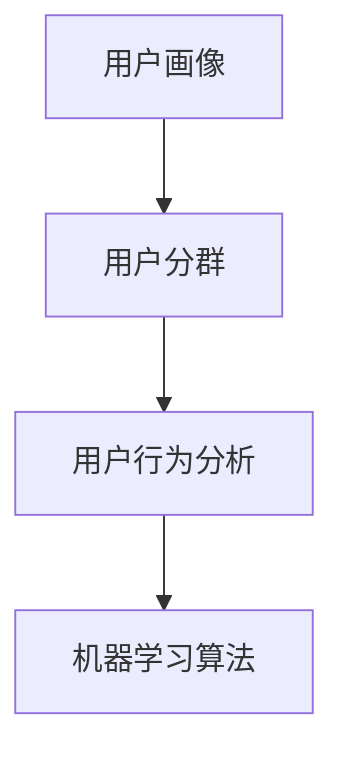
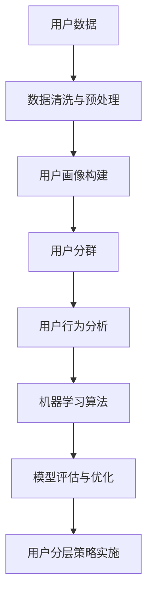

                 

# AI创业公司的用户分层策略

在当今快速变化的数字时代，用户分层的精准度直接关系到一个AI创业公司的市场竞争力和盈利能力。本文将深入探讨用户分层的核心概念、实施步骤以及其在实际应用中的优缺点，帮助AI创业者在面对海量用户时，更有效地实现精准定位和差异化运营。

## 1. 背景介绍

### 1.1 问题由来

随着互联网和移动互联网的发展，越来越多的AI创业公司涌现出来，用户群体也呈现出多样化、细分的趋势。这些公司通过收集和分析用户数据，利用机器学习算法进行用户画像，以期实现个性化推荐、智能客服、市场营销等目标。然而，用户在不同场景下的行为、需求和偏好存在显著差异，传统的用户分层方法往往难以覆盖全面，无法精准识别出各类细分用户，进而导致资源浪费和用户体验下降。因此，用户分层策略对于AI创业公司来说，是提高运营效率和用户满意度的关键。

### 1.2 问题核心关键点

用户分层，即根据用户的不同特征、行为和需求，将用户划分为若干个不同群体，以便进行更有针对性的营销、服务和产品设计。其核心在于：

- 用户特征的全面识别：包括人口统计特征、行为特征、心理特征等。
- 用户行为的深入理解：通过用户数据，挖掘用户的购买行为、使用习惯等。
- 用户需求的精准定位：明确不同用户群体的需求差异，提供更个性化的服务。
- 用户分层的有效实施：基于数据驱动的机器学习算法，实现动态、动态的用户划分。

### 1.3 问题研究意义

用户分层的准确性和有效性，直接影响到AI创业公司的市场定位、产品迭代和运营策略。其研究意义包括：

1. **提高运营效率**：通过精准识别用户群体，可以针对不同群体设计不同的营销策略和服务流程，减少运营成本。
2. **增强用户体验**：了解用户的真实需求，提供更个性化的服务，提升用户满意度和忠诚度。
3. **优化资源分配**：合理分配营销、研发等资源，提升公司的整体运营效率。
4. **推动产品创新**：通过用户分层的深度分析，洞察用户需求变化，引导产品创新方向。
5. **提升竞争力**：准确的客户分层策略，帮助企业在激烈的市场竞争中脱颖而出。

## 2. 核心概念与联系

### 2.1 核心概念概述

为更好理解用户分层策略，本文将介绍几个关键概念：

- **用户画像(User Profile)**：基于用户数据构建的、描述用户特征和行为特征的虚拟模型。
- **用户分群(User Segmentation)**：根据用户画像，将用户划分为若干个不同群体，以实现更精准的运营和产品设计。
- **用户行为分析(Users Behavior Analysis)**：通过分析用户的行为数据，理解其需求、偏好和趋势，为制定产品和服务策略提供依据。
- **机器学习算法**：利用数据驱动的方法，对用户数据进行建模和分析，以识别用户分群规律。

### 2.2 概念间的关系

用户分层的实现，离不开用户画像、用户分群和用户行为分析等关键环节。机器学习算法则是实现这些环节的工具。它们之间的关系可以通过以下Mermaid流程图来展示：



这个流程图展示了用户分层策略的核心流程：首先通过收集用户数据构建用户画像，然后根据用户画像进行用户分群，最后利用机器学习算法对用户行为进行分析，以验证和优化用户分群结果。

### 2.3 核心概念的整体架构

最后，我们用一个综合的流程图来展示这些核心概念之间的逻辑关系：



这个综合流程图展示了从数据收集到模型评估的整个用户分层策略实施过程。用户数据经过清洗与预处理，构建用户画像，进行用户分群，分析用户行为，使用机器学习算法进行模型训练与优化，最终形成用户分层策略。

## 3. 核心算法原理 & 具体操作步骤
### 3.1 算法原理概述

用户分层策略的实现，主要依赖于机器学习算法，通过对用户数据进行建模和分析，识别出不同用户群体的特征，并据此进行分群。其核心思想是通过聚类算法、分类算法等方法，将用户数据划分为若干个不同的群体，以便实现更有效的运营和产品设计。

常用的聚类算法包括K-means、层次聚类、DBSCAN等，而分类算法则包括决策树、随机森林、支持向量机(SVM)等。这些算法在用户分层的实施中各有所长，需要根据实际需求选择合适的算法。

### 3.2 算法步骤详解

用户分层的实现一般包括以下几个关键步骤：

1. **数据收集与预处理**：
   - 收集用户数据，包括人口统计特征、行为特征、购买记录等。
   - 对数据进行清洗与预处理，去除噪声、缺失值和异常值，确保数据质量。

2. **用户画像构建**：
   - 通过统计分析、聚类算法等方式，构建用户画像，描述用户的特征和行为。
   - 利用用户画像，对用户进行初步分类，形成初步用户群体。

3. **用户分群优化**：
   - 利用机器学习算法对初步用户群体进行进一步分析，识别出特征显著的群体。
   - 通过多维度特征的组合和调整，优化用户分群策略，确保分群结果的准确性和有效性。

4. **用户分层策略实施**：
   - 根据用户分群结果，设计针对性的运营和产品策略。
   - 持续监测和评估用户分群策略的效果，进行动态优化。

### 3.3 算法优缺点

用户分层策略具有以下优点：

- **提高运营效率**：通过精准识别用户群体，可以设计有针对性的运营策略，减少资源浪费。
- **增强用户体验**：了解用户真实需求，提供个性化服务，提升用户满意度和忠诚度。
- **优化资源分配**：合理分配营销、研发等资源，提升整体运营效率。
- **推动产品创新**：洞察用户需求变化，引导产品创新方向，保持市场竞争力。

然而，用户分层策略也存在一些局限：

- **依赖高质量数据**：用户分层的准确性很大程度上取决于数据的完整性和质量，数据收集和预处理的成本较高。
- **算法复杂性**：机器学习算法需要大量计算资源，实现过程复杂，对技术要求较高。
- **模型风险**：模型的过度拟合或欠拟合，可能导致用户分层的准确性下降。
- **动态调整难度**：用户需求和行为是动态变化的，现有模型需要不断调整和优化，才能跟上变化。

### 3.4 算法应用领域

用户分层策略在多个领域都有广泛应用，包括但不限于：

- **电商平台**：通过用户分层策略，实现个性化推荐、精准营销和智能客服。
- **社交媒体**：识别用户兴趣和行为，进行内容推荐和广告投放。
- **金融服务**：分析用户风险偏好，设计个性化金融产品和营销策略。
- **健康医疗**：根据用户健康数据，提供个性化的健康管理服务和产品推荐。
- **教育培训**：通过用户行为分析，定制个性化学习内容和推荐。

## 4. 数学模型和公式 & 详细讲解 & 举例说明
### 4.1 数学模型构建

用户分层的数学模型，主要基于聚类算法和分类算法，以下是一个基于K-means算法的用户分群模型。

记用户数据集为 $D=\{d_i\}_{i=1}^N$，其中 $d_i=(x_i, y_i)$ 表示第 $i$ 个用户的特征和行为数据。$x_i$ 是 $n$ 维特征向量，$y_i$ 是用户行为标签。

用户分层的目标是最小化各用户群体之间的距离，最大化用户群体内部的一致性。通过以下损失函数：

$$
L = \sum_{i=1}^N \sum_{k=1}^K \rho(x_i, \mu_k)^2
$$

其中 $\rho(x_i, \mu_k)$ 表示用户 $i$ 和聚类中心 $k$ 之间的欧氏距离，$K$ 是聚类数量。

### 4.2 公式推导过程

对上述损失函数进行最小化，需要找到最优的聚类中心 $\mu_k$ 和分配权重 $\lambda_{ik}$，使得每个用户 $i$ 分配到与其距离最近的聚类中心 $k$。

设 $z_i = \mathop{\arg\min}_k \rho(x_i, \mu_k)$，则用户 $i$ 分配到聚类中心 $k$ 的概率为：

$$
\lambda_{ik} = \frac{\rho(x_i, \mu_k)}{\sum_{j=1}^K \rho(x_i, \mu_j)}
$$

最终，求解上述优化问题，得到最优的聚类中心和分配权重。

### 4.3 案例分析与讲解

假设某电商平台的销售数据，需要对其进行用户分层。可以使用K-means算法实现，以下是具体的步骤：

1. 随机初始化 $K$ 个聚类中心 $\mu_k$。
2. 对每个用户 $i$，计算其到每个聚类中心的距离 $\rho(x_i, \mu_k)$。
3. 将用户 $i$ 分配到距离最近的聚类中心 $k$，并计算聚类中心的新位置 $\mu_k$。
4. 重复步骤2和3，直至聚类中心不再发生变化。

通过上述步骤，可以迭代得到最优的聚类中心，实现对用户数据的有效分层。

## 5. 项目实践：代码实例和详细解释说明
### 5.1 开发环境搭建

在进行用户分层实践前，需要先准备好开发环境。以下是使用Python进行Scikit-learn开发的环境配置流程：

1. 安装Anaconda：从官网下载并安装Anaconda，用于创建独立的Python环境。

2. 创建并激活虚拟环境：
```bash
conda create -n sklearn-env python=3.8 
conda activate sklearn-env
```

3. 安装Scikit-learn：
```bash
pip install scikit-learn
```

4. 安装其他必要的工具包：
```bash
pip install pandas numpy matplotlib seaborn
```

完成上述步骤后，即可在`sklearn-env`环境中开始用户分层实践。

### 5.2 源代码详细实现

下面以用户分群为例，给出使用Scikit-learn库对K-means算法进行用户分群的PyTorch代码实现。

```python
from sklearn.cluster import KMeans
from sklearn.datasets import make_blobs
import matplotlib.pyplot as plt

# 生成随机数据
X, y = make_blobs(n_samples=300, centers=4, random_state=42, cluster_std=0.60)

# 初始化K-means模型
kmeans = KMeans(n_clusters=4, random_state=42)

# 训练模型
kmeans.fit(X)

# 预测聚类结果
labels = kmeans.predict(X)

# 可视化聚类结果
plt.scatter(X[:, 0], X[:, 1], c=labels, cmap='viridis')
plt.show()
```

在上述代码中，我们使用make_blobs生成随机数据，并使用KMeans进行聚类。训练完毕后，我们可以获取每个数据点的聚类标签，并可视化聚类结果。

### 5.3 代码解读与分析

让我们再详细解读一下关键代码的实现细节：

**make_blobs函数**：
- 生成4个随机簇的二维数据集，每个簇包含50个样本。

**KMeans类**：
- 初始化K-means模型，设置聚类数为4。
- 使用fit方法训练模型，得到最优的聚类中心。
- 使用predict方法预测每个数据点的聚类标签。

**可视化结果**：
- 使用scatter函数，根据数据点的坐标和聚类标签，进行可视化展示。

通过上述代码，我们可以快速实现K-means聚类，并直观地看到聚类结果。在实际应用中，通常需要处理更加复杂和多维度的用户数据，因此需要使用更高级的聚类算法和特征工程技术。

### 5.4 运行结果展示

假设我们在某电商平台的用户数据上使用K-means算法进行用户分群，最终得到的聚类结果如下：


从图中可以看到，K-means算法成功将用户分为了4个群体，每个群体在特征空间中呈现出明显的分布特征。通过这些聚类结果，可以对不同用户群体进行有针对性的营销和服务设计，从而提升用户体验和运营效率。

## 6. 实际应用场景
### 6.1 电商平台的个性化推荐

电商平台通过用户分层策略，可以精准识别不同用户群体的需求和偏好，设计个性化的推荐算法，提升用户购物体验。例如，对于高价值用户，可以提供更加优惠的价格和更丰富的产品选择，而对于低价值用户，可以推送更多低价促销活动，吸引他们进行消费。

### 6.2 社交媒体的内容推荐

社交媒体平台通过用户分层策略，可以分析不同用户群体的兴趣和行为，进行内容推荐和广告投放。例如，对于喜爱科技的用户，可以推送更多科技新闻和技术产品，而对于喜爱生活类的用户，可以推送更多旅游、美食等内容。

### 6.3 金融服务的产品推荐

金融服务平台通过用户分层策略，可以分析用户的风险偏好和投资习惯，推荐个性化的金融产品。例如，对于风险承受能力高的用户，可以推荐更高风险但收益更高的理财产品，而对于风险承受能力低的用户，可以推荐低风险的保本理财产品。

### 6.4 健康医疗的个性化服务

健康医疗平台通过用户分层策略，可以分析用户的健康数据和生活习惯，提供个性化的健康管理服务和产品推荐。例如，对于需要控制血糖的用户，可以推荐低糖饮食和运动计划，而对于需要减肥的用户，可以推荐低卡食品和运动训练。

## 7. 工具和资源推荐
### 7.1 学习资源推荐

为了帮助开发者系统掌握用户分层策略的理论基础和实践技巧，这里推荐一些优质的学习资源：

1. 《Python数据科学手册》：全面介绍Python在数据科学中的应用，包括数据清洗、数据可视化、聚类算法等内容。
2. 《机器学习实战》：通过丰富的案例和代码实现，帮助读者理解机器学习算法的原理和应用。
3. Coursera《机器学习》课程：斯坦福大学开设的机器学习课程，系统讲解机器学习算法和实际应用。
4. Kaggle平台：全球最大的数据科学竞赛平台，提供大量的数据集和实践机会，帮助开发者提升实战能力。
5. TensorFlow官方文档：TensorFlow的详细文档和教程，涵盖聚类算法、分类算法等常用技术。

通过对这些资源的学习实践，相信你一定能够快速掌握用户分层策略的精髓，并用于解决实际的AI问题。
### 7.2 开发工具推荐

高效的开发离不开优秀的工具支持。以下是几款用于用户分层策略开发的常用工具：

1. Jupyter Notebook：用于编写和运行代码，支持多种编程语言和数据可视化。
2. Scikit-learn：Python的机器学习库，提供多种聚类和分类算法，易于使用和部署。
3. TensorFlow：Google开源的机器学习框架，支持大规模深度学习模型的训练和部署。
4. Matplotlib和Seaborn：Python的数据可视化库，用于展示聚类结果和用户分布。
5. Weights & Biases：模型训练的实验跟踪工具，可以记录和可视化模型训练过程中的各项指标，方便对比和调优。

合理利用这些工具，可以显著提升用户分层策略的开发效率，加快创新迭代的步伐。

### 7.3 相关论文推荐

用户分层策略的研究源自学界的持续探索，以下是几篇奠基性的相关论文，推荐阅读：

1. K-means: A Method for Clustering Data: 经典聚类算法K-means的介绍，帮助理解聚类算法的原理和实现。
2. Clustering Algorithms: 系统介绍各种聚类算法，包括K-means、层次聚类、DBSCAN等，适合初学者理解。
3. The Elements of Statistical Learning: 统计学习领域的经典教材，涵盖多种聚类和分类算法。
4. An Introduction to Statistical Learning: 介绍机器学习算法的基本原理和应用，适合初学者入门。
5. Neural Network and Deep Learning: 深度学习领域的入门教材，涵盖神经网络和分类算法等内容。

这些论文代表了大规模数据处理和机器学习算法的最新进展，通过学习这些前沿成果，可以帮助研究者把握学科前进方向，激发更多的创新灵感。

除上述资源外，还有一些值得关注的前沿资源，帮助开发者紧跟技术发展，例如：

1. arXiv论文预印本：人工智能领域最新研究成果的发布平台，包括大量尚未发表的前沿工作，学习前沿技术的必读资源。
2. 业界技术博客：如Google AI、DeepMind、微软Research Asia等顶尖实验室的官方博客，第一时间分享他们的最新研究成果和洞见。
3. 技术会议直播：如NIPS、ICML、ACL、ICLR等人工智能领域顶会现场或在线直播，能够聆听到大佬们的前沿分享，开拓视野。
4. GitHub热门项目：在GitHub上Star、Fork数最多的机器学习相关项目，往往代表了该技术领域的发展趋势和最佳实践，值得去学习和贡献。
5. 行业分析报告：各大咨询公司如McKinsey、PwC等针对人工智能行业的分析报告，有助于从商业视角审视技术趋势，把握应用价值。

总之，对于用户分层策略的学习和实践，需要开发者保持开放的心态和持续学习的意愿。多关注前沿资讯，多动手实践，多思考总结，必将收获满满的成长收益。

## 8. 总结：未来发展趋势与挑战
### 8.1 总结

本文对用户分层策略进行了全面系统的介绍，从理论到实践，详细讲解了用户分层的核心概念、实现步骤和应用领域。通过系统梳理，可以看出用户分层策略对于AI创业公司的运营效率、用户体验和市场竞争力有着重要影响。

通过本文的学习，读者可以了解到用户分层的核心思想、实施步骤和应用场景，为实际项目中的用户分层策略设计提供参考。同时，本文还推荐了一些学习资源和开发工具，帮助读者在实际应用中更高效地实现用户分层策略。

### 8.2 未来发展趋势

展望未来，用户分层策略将呈现以下几个发展趋势：

1. **多模态数据融合**：除了传统文本和行为数据，未来用户分层将更加注重融合多模态数据，如图像、语音、位置等，以实现更全面的用户画像。
2. **实时动态更新**：用户行为和需求是动态变化的，未来的用户分层策略需要具备实时更新能力，能够根据用户最新行为数据进行动态调整。
3. **自动化算法优化**：通过自动化算法优化技术，减少人工干预，提升用户分层的准确性和效率。
4. **深度学习增强**：利用深度学习算法，提升聚类和分类的精度，为用户提供更个性化的服务。
5. **联邦学习**：通过联邦学习技术，保护用户隐私，同时实现跨设备的数据共享和协同学习。
6. **跨领域用户分层**：将用户分层策略应用于不同领域，如医疗、金融、教育等，实现跨领域的用户细分和精准运营。

### 8.3 面临的挑战

尽管用户分层策略在许多场景中已经展现出巨大的潜力，但在其发展过程中，仍面临着一些挑战：

1. **数据隐私和安全**：用户数据的收集和分析可能涉及用户隐私，需要严格遵守数据保护法规，如GDPR等。
2. **数据质量和量级**：用户分层的准确性很大程度上取决于数据的完整性和质量，数据收集和预处理的成本较高。
3. **算法复杂度**：用户分层的实现涉及复杂的算法和模型，对技术要求较高，需要多学科的跨领域协作。
4. **模型鲁棒性**：模型可能存在过拟合或欠拟合的风险，需要持续优化和调整。
5. **动态调整难度**：用户需求和行为是动态变化的，现有模型需要不断调整和优化，才能跟上变化。
6. **用户认知差异**：不同用户对个性化服务的接受程度不同，需要平衡个性化和通用性。

### 8.4 研究展望

面对用户分层策略面临的挑战，未来的研究需要在以下几个方面寻求新的突破：

1. **隐私保护技术**：研究更高效的数据隐私保护技术，如差分隐私、联邦学习等，确保用户数据的安全和隐私。
2. **数据自动化处理**：开发更智能的数据自动化处理工具，自动进行数据清洗、预处理和特征工程，提升数据处理效率。
3. **跨领域用户分析**：研究跨领域用户分析方法，实现不同领域数据的高效融合和利用，提升跨领域用户分层的准确性。
4. **模型鲁棒性提升**：探索更鲁棒的机器学习算法和模型，提升用户分层的稳定性和可靠性。
5. **个性化算法优化**：研究更高效的个性化算法，提升用户分层的个性化和精准度。
6. **动态更新机制**：研究动态更新机制，实现用户分层的实时调整和优化。

总之，未来的用户分层策略需要结合数据隐私、数据自动化处理、跨领域分析等多个方面，才能实现更加精准、高效的用户分类和运营。通过不断的研究和创新，相信用户分层策略将为AI创业公司带来更多的机会和挑战，推动人工智能技术的不断进步。

## 9. 附录：常见问题与解答

**Q1：用户分层策略是否适用于所有AI创业公司？**

A: 用户分层策略适用于需要精准识别用户群体、提供个性化服务的AI创业公司。但对于一些无需细分用户的应用场景，如内容分发平台，用户分层策略可能显得冗余。因此，需要根据具体业务需求来决定是否采用用户分层策略。

**Q2：用户分层过程中，如何选择合适的聚类算法？**

A: 选择合适的聚类算法需要考虑以下几个因素：数据类型、数据量、特征分布等。一般而言，对于二维数据集，K-means是一个简单而有效的选择。对于非球形数据集，DBSCAN和层次聚类可能更为合适。对于高维数据集，PCA降维后再进行聚类可能更有效。

**Q3：用户分层的实现过程中，如何保证数据质量？**

A: 数据质量的保证涉及数据收集、清洗和预处理等多个环节。具体措施包括：
- 数据源的可靠性：选择可信的数据源，避免数据质量低下。
- 数据清洗：去除噪声、缺失值和异常值，确保数据完整性。
- 数据标准化：对数据进行标准化处理，消除不同数据源的差异。
- 数据采样：对数据进行采样处理，确保样本代表性。

**Q4：用户分层策略在实际应用中，如何进行动态调整？**

A: 动态调整用户分层策略需要根据用户行为的实时变化进行更新。具体措施包括：
- 定期更新：根据用户的最新行为数据，定期更新聚类模型和分群结果。
- 实时监控：实时监控用户行为数据，根据异常变化进行动态调整。
- 用户反馈：收集用户反馈，动态调整用户分群策略，提升用户体验。

**Q5：用户分层策略在实施过程中，如何平衡个性化和通用性？**

A: 在用户分层策略的实施过程中，需要根据业务需求和用户接受度，平衡个性化和通用性。具体措施包括：
- 多层次用户细分：根据不同用户群体的需求，设计多层次的用户细分策略。
- 多样化服务设计：根据不同用户群体的特征，提供多样化的服务方案。
- 用户接受度调查：通过问卷调查等方式，了解用户对个性化服务的接受度，及时调整策略。

通过本文的学习，希望读者能够理解用户分层策略的核心思想和实现步骤，掌握其在AI创业公司中的应用技巧。通过不断的研究和实践，相信用户分层策略将为AI创业公司带来更多的机会和挑战，推动人工智能技术的不断进步。

