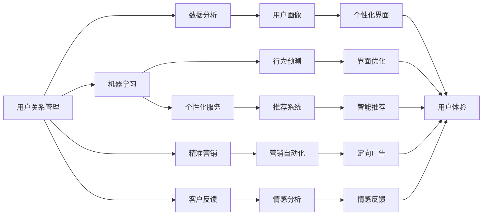

                 

# AI创业公司的用户忠诚度培养：用户关系管理、用户体验提升与用户激励

> 关键词：
用户关系管理,用户体验提升,用户激励,人工智能,数据科学,自然语言处理,NLP

## 1. 背景介绍

### 1.1 问题由来
随着互联网和移动互联网的迅猛发展，全球用户数量持续攀升。据Statista统计，截至2022年，全球互联网用户总数已超过50亿人，占全球人口的63%。用户数量的不断增长，为数字经济带来了巨大的机遇，同时也给AI创业公司带来了前所未有的挑战。

用户忠诚度是衡量一家AI创业公司成功与否的重要指标。与传统消费品相比，科技产品的用户转化率和留存率相对较低。如何在激烈的市场竞争中吸引并留住用户，成为所有AI创业公司亟需解决的问题。本文将探讨如何通过用户关系管理、用户体验提升和用户激励策略，来有效提升AI创业公司的用户忠诚度。

### 1.2 问题核心关键点
用户忠诚度培养是AI创业公司的重要目标，其核心在于建立与用户的深层次互动关系。以下因素对用户忠诚度的影响尤为显著：

1. **用户关系管理**：通过个性化服务、精准营销和客户反馈，不断优化与用户的关系，建立用户信任。
2. **用户体验提升**：提升产品的易用性、功能性和可靠性，让用户在使用过程中获得良好的体验，从而增加用户粘性。
3. **用户激励**：通过奖励、积分、会员等机制，激励用户持续使用产品，促进口碑传播和长期留存。

## 2. 核心概念与联系

### 2.1 核心概念概述

为更好地理解如何通过AI技术培养用户忠诚度，本节将介绍几个关键概念及其联系：

- **用户关系管理（CRM）**：通过数据分析和机器学习技术，对用户行为和偏好进行精准把握，实现个性化的服务与营销策略。
- **用户体验（UX）**：通过用户反馈和测试数据，不断优化产品功能和界面设计，提升用户的使用满意度和愉悦感。
- **用户激励**：设计有效的激励机制，如积分系统、任务奖励等，促进用户活跃度和忠诚度。
- **人工智能（AI）**：通过AI技术，如自然语言处理（NLP）、推荐系统、情感分析等，提升用户体验和个性化服务。
- **数据科学**：通过数据分析和机器学习模型，实现用户行为预测和推荐，优化用户体验。

这些概念之间存在密切的联系，形成了完整的用户忠诚度培养生态系统。用户关系管理是基础，用户体验提升是手段，用户激励是手段。AI和数据科学则是技术和工具，支撑着整个生态系统的运行。

### 2.2 概念间的关系

这些核心概念之间的关系可以通过以下Mermaid流程图来展示：

这个流程图展示了用户关系管理、用户体验提升和用户激励之间的联系，以及AI和数据科学在这一过程中的作用。

## 3. 核心算法原理 & 具体操作步骤
### 3.1 算法原理概述

用户忠诚度培养的算法原理，主要涉及用户行为数据分析、用户画像构建、个性化服务推荐和用户激励机制的设计。这些算法原理和技术手段，共同构成了提升用户忠诚度的核心框架。

**核心算法原理**：

1. **用户行为数据分析**：通过收集用户的使用数据，如点击率、浏览时间、购买行为等，进行数据分析和建模，以识别用户的兴趣和行为模式。
2. **用户画像构建**：基于用户行为数据，构建详尽的、多维度的用户画像，从而实现对用户个性和偏好的精准把握。
3. **个性化服务推荐**：利用推荐系统，根据用户画像和历史行为，推荐个性化的产品和服务，提升用户满意度和粘性。
4. **用户激励机制设计**：设计合理的激励机制，通过积分、优惠券、会员等手段，激发用户活跃度和忠诚度。

**具体操作步骤**：

1. **数据收集**：通过各种渠道收集用户行为数据，如网站点击、应用操作、支付记录等。
2. **数据清洗和处理**：对收集到的数据进行去重、归一化、缺失值处理等操作，保证数据的质量。
3. **用户画像构建**：利用数据分析和机器学习技术，构建详尽的用户画像。
4. **个性化服务推荐**：基于用户画像和行为数据，设计推荐算法，为用户提供个性化的产品和服务。
5. **用户激励机制设计**：设计合理的激励机制，如积分系统、任务奖励等，促进用户活跃度和忠诚度。
6. **模型优化和迭代**：不断优化和迭代算法模型，提升用户忠诚度培养效果。

### 3.2 算法步骤详解

#### 3.2.1 数据收集

数据收集是用户忠诚度培养的基础。通过各种渠道，收集用户的行为数据，如网站点击、应用操作、支付记录等。这些数据可以从用户的设备、网站、应用等多个维度进行收集。

#### 3.2.2 数据清洗和处理

数据收集后，需要对数据进行清洗和处理，以保证数据的质量。具体步骤包括：

- **去重**：去除重复的数据，保证数据的唯一性。
- **归一化**：对不同来源的数据进行标准化处理，如统一时间格式、去除异常值等。
- **缺失值处理**：对缺失的数据进行填补或删除处理，以保证数据完整性。

#### 3.2.3 用户画像构建

用户画像的构建是用户忠诚度培养的核心。通过数据分析和机器学习技术，对用户行为数据进行建模，构建详尽的用户画像。

##### 3.2.3.1 数据聚合与特征工程

首先，将收集到的数据进行聚合和特征提取，以生成有意义的特征。常用的特征包括用户年龄、性别、地域、使用时长、点击次数等。

##### 3.2.3.2 数据分析与建模

基于聚合后的特征，利用机器学习技术进行建模，如K-means聚类、逻辑回归、决策树等。通过模型训练，可以识别出用户的兴趣和行为模式，构建用户画像。

#### 3.2.4 个性化服务推荐

个性化服务推荐是提升用户体验的重要手段。通过推荐系统，根据用户画像和历史行为，推荐个性化的产品和服务。

##### 3.2.4.1 推荐算法选择

推荐算法的选择是推荐系统的核心。常用的推荐算法包括协同过滤、基于内容的推荐、深度学习推荐等。

##### 3.2.4.2 模型训练与优化

基于选择的推荐算法，进行模型训练和优化。常用的优化技术包括正则化、梯度下降、随机梯度下降等。

#### 3.2.5 用户激励机制设计

用户激励机制的设计，可以显著提升用户活跃度和忠诚度。通过积分、优惠券、会员等手段，激励用户持续使用产品。

##### 3.2.5.1 积分系统设计

积分系统是常见的用户激励手段之一。通过积分奖励用户的消费行为，如购买、评论等。

##### 3.2.5.2 任务奖励机制

任务奖励机制，通过设置任务和奖励，激励用户完成特定行为。例如，完成任务后，用户可以获得优惠券或积分。

##### 3.2.5.3 会员体系设计

会员体系，通过会员等级和特权，激励用户持续使用产品。例如，高等级会员可以获得更多折扣、专属服务等。

### 3.3 算法优缺点

#### 3.3.1 算法优点

1. **个性化服务提升用户体验**：通过个性化推荐，用户可以更快地找到感兴趣的产品，提升使用体验。
2. **精准营销提升转化率**：基于用户画像的精准营销，可以提高用户转化率和留存率。
3. **用户激励促进忠诚度**：通过积分、任务奖励等机制，激励用户持续使用产品，提升忠诚度。
4. **数据驱动决策优化**：通过数据分析和建模，优化决策过程，提升运营效率。

#### 3.3.2 算法缺点

1. **数据隐私问题**：用户行为数据的收集和使用，可能会侵犯用户隐私。需要采取数据保护措施。
2. **算法复杂度**：推荐系统和用户画像构建，算法复杂度较高，需要专业知识和技术支持。
3. **成本投入高**：算法模型和数据处理需要投入大量资源，增加企业运营成本。

### 3.4 算法应用领域

用户忠诚度培养的算法，广泛应用于各种AI创业公司，涵盖电商、社交、教育等多个领域。以下列举几个典型的应用场景：

1. **电商领域**：电商平台通过个性化推荐和精准营销，提升用户购买率和留存率。
2. **社交领域**：社交平台通过用户画像和激励机制，提升用户活跃度和粘性。
3. **教育领域**：在线教育平台通过个性化学习推荐和积分奖励，提升用户学习效果和忠诚度。
4. **金融领域**：金融科技公司通过数据分析和用户画像，提升用户理财体验和忠诚度。
5. **医疗领域**：医疗健康平台通过个性化服务推荐和激励机制，提升用户健康管理和满意度。

## 4. 数学模型和公式 & 详细讲解  
### 4.1 数学模型构建

用户忠诚度培养的数学模型，主要涉及用户行为数据分析、用户画像构建、个性化服务推荐和用户激励机制的设计。

#### 4.1.1 用户行为数据分析模型

用户行为数据分析模型，主要通过收集用户的使用数据，进行数据分析和建模，以识别用户的兴趣和行为模式。

##### 4.1.1.1 点击率模型

点击率模型是常用的用户行为数据分析模型之一。点击率模型通过分析用户对不同产品的点击行为，预测用户对某一产品的兴趣。

点击率模型公式如下：

$$
\hat{y} = \mathrm{sigmoid}(\mathbf{w} \cdot \mathbf{x} + b)
$$

其中，$y$ 表示用户是否点击产品，$x$ 表示用户行为特征，$w$ 和 $b$ 为模型参数。

##### 4.1.1.2 用户留存率模型

用户留存率模型，通过分析用户的使用频率，预测用户是否会继续使用产品。

用户留存率模型公式如下：

$$
\hat{y} = \sigma(\mathbf{w} \cdot \mathbf{x} + b)
$$

其中，$y$ 表示用户是否留存，$x$ 表示用户行为特征，$w$ 和 $b$ 为模型参数。

#### 4.1.2 用户画像构建模型

用户画像构建模型，主要通过数据分析和机器学习技术，构建详尽的用户画像。

##### 4.1.2.1 K-means聚类模型

K-means聚类模型是常用的用户画像构建模型之一。K-means聚类模型将用户分为若干类，从而实现对用户个性和偏好的精准把握。

K-means聚类模型公式如下：

$$
\min_{\mathbf{w},\mathbf{b},\mathbf{C}} \sum_{i=1}^{N} ||\mathbf{x}_i - \mathbf{C}_k||^2
$$

其中，$\mathbf{x}_i$ 表示用户行为特征，$\mathbf{C}_k$ 表示聚类中心，$k$ 表示聚类数量。

##### 4.1.2.2 逻辑回归模型

逻辑回归模型是常用的用户画像构建模型之一。逻辑回归模型通过分析用户行为特征，预测用户是否会对某一产品感兴趣。

逻辑回归模型公式如下：

$$
\hat{y} = \sigma(\mathbf{w} \cdot \mathbf{x} + b)
$$

其中，$y$ 表示用户是否感兴趣，$x$ 表示用户行为特征，$w$ 和 $b$ 为模型参数。

#### 4.1.3 个性化服务推荐模型

个性化服务推荐模型，主要通过推荐系统，根据用户画像和历史行为，推荐个性化的产品和服务。

##### 4.1.3.1 协同过滤模型

协同过滤模型是常用的个性化服务推荐模型之一。协同过滤模型通过分析用户行为相似性，推荐类似产品的用户。

协同过滤模型公式如下：

$$
\hat{y} = \mathrm{cosine}(\mathbf{u}, \mathbf{v})
$$

其中，$\mathbf{u}$ 和 $\mathbf{v}$ 分别表示用户和商品的特征向量。

##### 4.1.3.2 基于内容的推荐模型

基于内容的推荐模型，通过分析用户兴趣和产品特征，推荐符合用户兴趣的产品。

基于内容的推荐模型公式如下：

$$
\hat{y} = \mathrm{dot}(\mathbf{u}, \mathbf{v})
$$

其中，$\mathbf{u}$ 和 $\mathbf{v}$ 分别表示用户和产品的特征向量。

#### 4.1.4 用户激励机制设计模型

用户激励机制设计模型，主要通过设计合理的激励机制，如积分、优惠券、会员等，促进用户活跃度和忠诚度。

##### 4.1.4.1 积分系统模型

积分系统模型，通过积分奖励用户的消费行为，如购买、评论等。

积分系统模型公式如下：

$$
\hat{y} = \mathbf{w} \cdot \mathbf{x} + b
$$

其中，$y$ 表示用户积分，$x$ 表示用户行为特征，$w$ 和 $b$ 为模型参数。

##### 4.1.4.2 任务奖励机制模型

任务奖励机制模型，通过设置任务和奖励，激励用户完成特定行为。例如，完成任务后，用户可以获得优惠券或积分。

任务奖励机制模型公式如下：

$$
\hat{y} = \mathbf{w} \cdot \mathbf{x} + b
$$

其中，$y$ 表示任务奖励，$x$ 表示任务特征，$w$ 和 $b$ 为模型参数。

##### 4.1.4.3 会员体系模型

会员体系模型，通过会员等级和特权，激励用户持续使用产品。例如，高等级会员可以获得更多折扣、专属服务等。

会员体系模型公式如下：

$$
\hat{y} = \mathbf{w} \cdot \mathbf{x} + b
$$

其中，$y$ 表示会员等级，$x$ 表示会员行为特征，$w$ 和 $b$ 为模型参数。

### 4.2 公式推导过程

#### 4.2.1 点击率模型推导

点击率模型公式的推导如下：

$$
\hat{y} = \mathrm{sigmoid}(\mathbf{w} \cdot \mathbf{x} + b)
$$

其中，$y$ 表示用户是否点击产品，$x$ 表示用户行为特征，$w$ 和 $b$ 为模型参数。

推导过程如下：

1. 通过收集用户行为数据，构建特征向量 $\mathbf{x}$。
2. 定义点击率模型 $y = \sigma(\mathbf{w} \cdot \mathbf{x} + b)$。
3. 通过最小二乘法求解模型参数 $\mathbf{w}$ 和 $b$，使得模型预测结果与实际数据匹配。

#### 4.2.2 用户留存率模型推导

用户留存率模型公式的推导如下：

$$
\hat{y} = \sigma(\mathbf{w} \cdot \mathbf{x} + b)
$$

其中，$y$ 表示用户是否留存，$x$ 表示用户行为特征，$w$ 和 $b$ 为模型参数。

推导过程如下：

1. 通过收集用户行为数据，构建特征向量 $\mathbf{x}$。
2. 定义用户留存率模型 $y = \sigma(\mathbf{w} \cdot \mathbf{x} + b)$。
3. 通过最小二乘法求解模型参数 $\mathbf{w}$ 和 $b$，使得模型预测结果与实际数据匹配。

#### 4.2.3 K-means聚类模型推导

K-means聚类模型公式的推导如下：

$$
\min_{\mathbf{w},\mathbf{b},\mathbf{C}} \sum_{i=1}^{N} ||\mathbf{x}_i - \mathbf{C}_k||^2
$$

其中，$\mathbf{x}_i$ 表示用户行为特征，$\mathbf{C}_k$ 表示聚类中心，$k$ 表示聚类数量。

推导过程如下：

1. 通过收集用户行为数据，构建特征向量 $\mathbf{x}$。
2. 定义K-means聚类模型 $\min_{\mathbf{w},\mathbf{b},\mathbf{C}} \sum_{i=1}^{N} ||\mathbf{x}_i - \mathbf{C}_k||^2$。
3. 通过最小二乘法求解模型参数 $\mathbf{w}$、$\mathbf{b}$ 和 $\mathbf{C}$，使得模型预测结果与实际数据匹配。

#### 4.2.4 逻辑回归模型推导

逻辑回归模型公式的推导如下：

$$
\hat{y} = \sigma(\mathbf{w} \cdot \mathbf{x} + b)
$$

其中，$y$ 表示用户是否感兴趣，$x$ 表示用户行为特征，$w$ 和 $b$ 为模型参数。

推导过程如下：

1. 通过收集用户行为数据，构建特征向量 $\mathbf{x}$。
2. 定义逻辑回归模型 $y = \sigma(\mathbf{w} \cdot \mathbf{x} + b)$。
3. 通过最小二乘法求解模型参数 $\mathbf{w}$ 和 $b$，使得模型预测结果与实际数据匹配。

#### 4.2.5 协同过滤模型推导

协同过滤模型公式的推导如下：

$$
\hat{y} = \mathrm{cosine}(\mathbf{u}, \mathbf{v})
$$

其中，$\mathbf{u}$ 和 $\mathbf{v}$ 分别表示用户和商品的特征向量。

推导过程如下：

1. 通过收集用户行为数据，构建用户和商品特征向量 $\mathbf{u}$ 和 $\mathbf{v}$。
2. 定义协同过滤模型 $y = \mathrm{cosine}(\mathbf{u}, \mathbf{v})$。
3. 通过最小二乘法求解模型参数 $\mathbf{u}$ 和 $\mathbf{v}$，使得模型预测结果与实际数据匹配。

#### 4.2.6 基于内容的推荐模型推导

基于内容的推荐模型公式的推导如下：

$$
\hat{y} = \mathrm{dot}(\mathbf{u}, \mathbf{v})
$$

其中，$\mathbf{u}$ 和 $\mathbf{v}$ 分别表示用户和产品的特征向量。

推导过程如下：

1. 通过收集用户行为数据，构建用户和产品特征向量 $\mathbf{u}$ 和 $\mathbf{v}$。
2. 定义基于内容的推荐模型 $y = \mathrm{dot}(\mathbf{u}, \mathbf{v})$。
3. 通过最小二乘法求解模型参数 $\mathbf{u}$ 和 $\mathbf{v}$，使得模型预测结果与实际数据匹配。

#### 4.2.7 积分系统模型推导

积分系统模型公式的推导如下：

$$
\hat{y} = \mathbf{w} \cdot \mathbf{x} + b
$$

其中，$y$ 表示用户积分，$x$ 表示用户行为特征，$w$ 和 $b$ 为模型参数。

推导过程如下：

1. 通过收集用户行为数据，构建特征向量 $\mathbf{x}$。
2. 定义积分系统模型 $y = \mathbf{w} \cdot \mathbf{x} + b$。
3. 通过最小二乘法求解模型参数 $\mathbf{w}$ 和 $b$，使得模型预测结果与实际数据匹配。

#### 4.2.8 任务奖励机制模型推导

任务奖励机制模型公式的推导如下：

$$
\hat{y} = \mathbf{w} \cdot \mathbf{x} + b
$$

其中，$y$ 表示任务奖励，$x$ 表示任务特征，$w$ 和 $b$ 为模型参数。

推导过程如下：

1. 通过收集任务数据，构建特征向量 $\mathbf{x}$。
2. 定义任务奖励机制模型 $y = \mathbf{w} \cdot \mathbf{x} + b$。
3. 通过最小二乘法求解模型参数 $\mathbf{w}$ 和 $b$，使得模型预测结果与实际数据匹配。

#### 4.2.9 会员体系模型推导

会员体系模型公式的推导如下：

$$
\hat{y} = \mathbf{w} \cdot \mathbf{x} + b
$$

其中，$y$ 表示会员等级，$x$ 表示会员行为特征，$w$ 和 $b$ 为模型参数。

推导过程如下：

1. 通过收集会员数据，构建特征向量 $\mathbf{x}$。
2. 定义会员体系模型 $y = \mathbf{w} \cdot \mathbf{x} + b$。
3. 通过最小二乘法求解模型参数 $\mathbf{w}$ 和 $b$，使得模型预测结果与实际数据匹配。

### 4.3 案例分析与讲解

#### 4.3.1 电商领域案例

电商领域是用户忠诚度培养的重要应用场景。以下是一个基于电商领域的用户忠诚度培养案例：

**案例背景**：某电商平台通过用户行为数据分析，构建详细的用户画像，并设计个性化的推荐系统和激励机制，显著提升了用户购买率和留存率。

**数据分析与建模**：电商平台收集用户浏览、点击、购买等行为数据，通过K-means聚类模型和逻辑回归模型，构建详尽的用户画像。

**推荐系统设计**：基于用户画像和行为数据，设计协同过滤推荐算法，推荐个性化商品。同时，利用基于内容的推荐算法，推荐符合用户兴趣的商品。

**激励机制设计**：设计积分系统，通过购买、评论等行为获得积分，积分可兑换优惠券或积分。同时，设计会员体系，会员等级越高，享受更多特权和折扣。

**效果评估**：通过A/B测试，比较不同推荐系统和激励机制的效果。结果显示，个性化推荐和会员体系显著提升了用户购买率和留存率。

#### 4.3.2 社交领域案例

社交领域是用户忠诚度培养的另一个重要应用场景。以下是一个基于社交领域的用户忠诚度培养案例：

**案例背景**：某社交平台通过用户行为数据分析，构建详尽的用户画像，并设计个性化的推荐系统和激励机制，显著提升了用户活跃度和留存率。

**数据分析与建模**：社交平台收集用户登录、发帖、评论等行为数据，通过K-means聚类模型和逻辑回归模型，构建详尽的用户画像。

**推荐系统设计**：基于用户画像和行为数据，设计协同过滤推荐算法，推荐用户可能感兴趣的内容。同时，利用基于内容的推荐算法，推荐符合用户兴趣的内容。

**激励机制设计**：设计任务奖励机制，通过完成任务（如发布内容、互动评论等）获得积分或优惠券。同时，设计会员体系，会员等级越高，享受更多特权和优惠。

**效果评估**：通过A/B测试，比较不同推荐系统和激励机制的效果。结果显示，个性化推荐和任务奖励显著提升了用户活跃度和留存率。

#### 4.3.3 教育领域案例

教育领域是用户忠诚度培养的重要应用场景。以下是一个基于教育领域的用户忠诚度培养案例：

**案例背景**：某在线教育平台通过用户行为数据分析，构建详尽的用户画像，并设计个性化的学习推荐系统和激励机制，显著提升了用户学习效果和留存率。

**数据分析与建模**：在线教育平台收集用户学习、答题等行为数据，通过K-means聚类模型和逻辑回归模型，构建详尽的用户画像。

**推荐系统设计**：基于用户画像和行为数据，设计协同过滤推荐算法，推荐个性化课程和习题。同时，利用基于内容的推荐算法，推荐符合用户兴趣的课程。

**激励机制设计**：设计积分系统，通过学习、答题等行为获得积分，积分可兑换优惠券或积分。同时，设计会员体系，会员等级越高，享受更多特权和优惠。

**效果评估**：通过A/B测试，比较不同推荐系统和激励机制的效果。结果显示，个性化推荐和积分奖励显著提升了用户学习效果和留存率。

## 5. 项目实践：代码实例和详细解释说明
### 5.1 开发环境搭建

在进行用户忠诚度培养的开发实践前，我们需要准备好开发环境。以下是使用Python进行TensorFlow开发的环境配置流程：

1. 安装Anaconda：从官网下载

