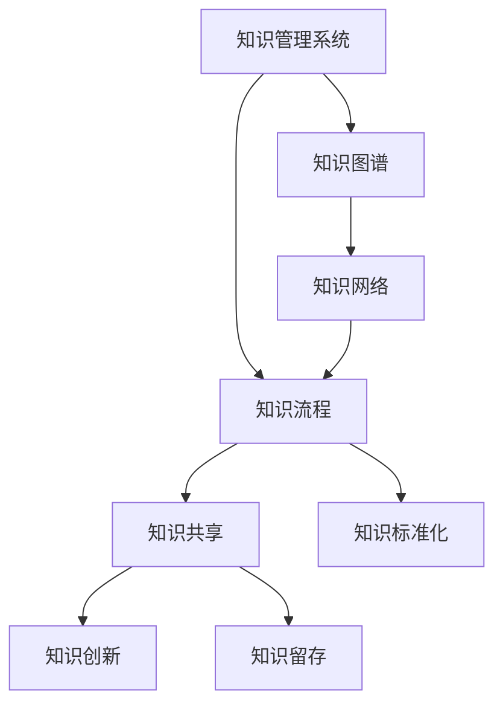
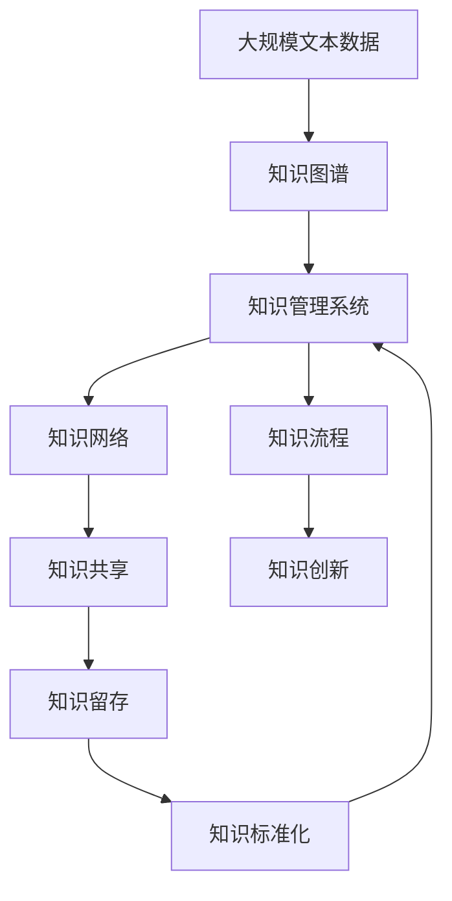

                 

# AI创业公司的知识管理

## 1. 背景介绍

在AI创业公司的快速发展和市场竞争日趋激烈的背景下，如何高效管理和利用知识成为了决定公司成败的关键。知识管理不仅包括信息的收集、存储和检索，还涵盖了组织成员间的知识共享和创新。本文将从理论到实践，深入探讨AI创业公司知识管理的策略和工具，帮助公司构建知识生态系统，驱动技术创新和商业成功。

### 1.1 问题由来

随着人工智能技术的快速发展，AI创业公司如雨后春笋般涌现，但在高速发展的同时，也面临诸多挑战。特别是如何高效利用和共享知识，成为许多公司亟待解决的问题。知识管理的缺失或不当，会导致信息孤岛、知识重复、创新滞后等问题，严重影响公司效率和竞争力。

### 1.2 问题核心关键点

1. **知识共享**：如何让团队成员轻松分享和获取知识，避免信息孤岛。
2. **知识标准化**：如何建立统一的知识体系和标准，保证知识的一致性和可重复性。
3. **知识创新**：如何通过知识管理促进技术创新和业务创新，驱动公司持续发展。
4. **知识留存**：如何有效保存和传承公司的核心知识和经验，避免知识流失。
5. **知识网络**：如何构建知识网络，让成员间能够高效协作和协同创新。

这些关键点共同构成了AI创业公司知识管理的目标和挑战。

### 1.3 问题研究意义

对AI创业公司而言，构建有效的知识管理体系不仅能提升内部协作效率，还能加速产品迭代和创新。高效的知识管理能够降低信息不对称，减少重复劳动，提升决策质量，推动公司走向智能化、自动化、个性化。对于整个行业而言，知识管理还能促进技术和应用的扩散，加速行业进步。

## 2. 核心概念与联系

### 2.1 核心概念概述

为更好地理解AI创业公司知识管理，本节将介绍几个关键概念：

- **知识管理系统(Knowledge Management System, KMS)**：通过软件工具和技术手段，帮助组织构建知识库，实现知识的采集、存储、共享和再利用。常见的KMS包括Confluence、SharePoint、Notion等。
- **知识图谱(Knowledge Graph)**：一种以图形结构表示知识的关系型数据库，用于描述实体、属性和实体间关系。知识图谱支持语义搜索和推理，用于构建智能问答系统和推荐系统。
- **知识网络(Knowledge Network)**：以人或团队为中心，描述其知识来源、知识流向和知识互动关系的网络结构。知识网络用于发现知识专家和知识节点，促进知识共享和创新。
- **知识流程(Knowledge Workflow)**：定义知识管理的各个环节和步骤，从知识采集到知识再利用，形成一个闭环。知识流程的设计能优化知识管理的效率和效果。

### 2.2 概念间的关系

这些核心概念之间存在紧密的联系，共同构成了AI创业公司知识管理的整体框架。以下是它们之间的关系：



这个图表展示了知识管理的各个环节：

1. 知识管理系统(A)采集、存储知识，构建知识图谱(B)，并定义知识流程(D)。
2. 知识图谱(B)用于描述知识关系，支持知识网络(C)的构建和查询。
3. 知识流程(D)优化知识管理的各个环节，确保知识的有效流动。
4. 知识网络(C)揭示知识流向和关系，促进知识共享(E)。
5. 知识共享(E)和知识留存(G)结合，推动知识创新(F)。

### 2.3 核心概念的整体架构

最后，我们用一个综合的流程图来展示这些核心概念在大规模知识管理中的应用：



这个综合流程图展示了从数据到知识再到应用的全流程：

1. 大规模文本数据(A)通过预处理和提取，构建知识图谱(B)。
2. 知识图谱(B)存储在知识管理系统(C)中。
3. 知识管理系统(C)构建知识网络(D)，定义知识流程(E)。
4. 知识共享(F)和知识创新(G)通过知识管理系统(C)实现。
5. 知识留存(H)和知识标准化(I)确保知识管理和应用的一致性。

通过这些流程图，我们可以更清晰地理解知识管理的各个环节和步骤，为后续深入讨论知识管理的具体技术和工具奠定基础。

## 3. 核心算法原理 & 具体操作步骤
### 3.1 算法原理概述

AI创业公司的知识管理主要基于以下几个核心算法原理：

- **实体识别与抽取**：从文本中识别出实体，如人名、地点、组织等，以便构建知识图谱。
- **关系抽取与推理**：利用自然语言处理技术，抽取实体间的关系，并通过知识图谱进行语义推理。
- **知识图谱嵌入**：将知识图谱中的实体和关系映射为向量空间中的点，方便进行相似度计算和知识检索。
- **语义搜索与检索**：通过向量化查询和相似度计算，实现知识图谱和知识库的快速检索。
- **知识网络构建与分析**：通过社交网络和知识图谱的结合，构建知识网络，分析知识流向和节点关系。

### 3.2 算法步骤详解

以下是知识管理的主要算法步骤：

**Step 1: 实体识别与抽取**
- 对大规模文本数据进行预处理，包括分词、去停用词、词性标注等。
- 使用命名实体识别(NER)算法，从文本中识别出实体，并将实体与相应的属性和关系进行标注。
- 将抽取出的实体和关系存储到知识图谱中。

**Step 2: 关系抽取与推理**
- 使用关系抽取算法，识别出实体间的关系，如“国家-首都”、“演员-电影”等。
- 利用知识图谱进行语义推理，推导出新的关系和实体，如“首都-国家”、“电影-导演”等。
- 将推导出的关系和实体更新到知识图谱中。

**Step 3: 知识图谱嵌入**
- 将知识图谱中的实体和关系进行向量化，如使用TransE、DistMult等方法。
- 训练嵌入模型，将实体和关系映射到低维向量空间中。
- 保存训练好的嵌入模型，用于后续的语义检索和推理。

**Step 4: 语义搜索与检索**
- 将查询语句转化为向量，使用相似度计算方法，如余弦相似度、Jaccard相似度等。
- 在知识图谱中搜索与查询向量最相似的实体和关系。
- 返回检索结果，支持用户快速获取知识。

**Step 5: 知识网络构建与分析**
- 通过社交网络数据，获取知识流向和关系，构建知识网络。
- 分析知识网络中的节点关系和流向，识别知识专家和关键节点。
- 可视化知识网络，帮助用户理解知识结构。

### 3.3 算法优缺点

知识管理算法具有以下优点：

1. **高效性**：能够快速从大规模文本数据中提取和存储知识，提升知识管理的效率。
2. **可扩展性**：支持多模态数据的融合，包括文本、图像、视频等，拓展了知识管理的广度。
3. **灵活性**：可根据不同领域和任务的需求，灵活调整知识管理的策略和工具。

同时，也存在一些局限性：

1. **数据质量依赖**：知识管理的质量很大程度上取决于输入数据的准确性和完整性。
2. **技术复杂性**：涉及自然语言处理、机器学习等多个领域的知识，技术门槛较高。
3. **隐私与伦理**：知识管理可能涉及敏感数据，需注意数据隐私保护和伦理问题。

### 3.4 算法应用领域

知识管理算法在多个领域有着广泛的应用：

- **智慧医疗**：构建医学知识图谱，支持医学信息检索和临床决策支持。
- **金融行业**：构建金融知识网络，分析市场趋势和风险，辅助投资决策。
- **教育领域**：构建教育知识库，支持在线课程推荐和智能辅导。
- **科研机构**：构建科研知识图谱，加速科研信息共享和创新。
- **电子商务**：构建商品知识图谱，支持商品推荐和个性化营销。

这些领域的应用展示了知识管理算法的广泛性和重要性。

## 4. 数学模型和公式 & 详细讲解 & 举例说明
### 4.1 数学模型构建

知识管理的核心数学模型主要基于以下几个概念：

- **向量空间模型(Vector Space Model, VSM)**：将文本和实体表示为向量，通过余弦相似度计算相似性。
- **实体关系图(Entity-Relation Graph)**：表示实体和关系的网络结构，用于知识图谱构建和推理。
- **图嵌入(Graph Embedding)**：将图结构中的节点映射到低维向量空间中，用于相似度计算和关系推理。

### 4.2 公式推导过程

以下以知识图谱嵌入为例，推导知识图谱中实体的向量表示。

假设知识图谱中有三个实体 $e_1$、$e_2$、$e_3$ 和一条关系 $r$，它们之间的关系是 $r_{1-2}$。我们将其表示为三元组 $(e_1, r_{1-2}, e_2)$。

首先，我们将实体和关系表示为向量：

$$
\begin{align*}
e_1 &= \begin{bmatrix} e_{1-1} \\ e_{1-2} \\ e_{1-3} \end{bmatrix}, e_2 = \begin{bmatrix} e_{2-1} \\ e_{2-2} \\ e_{2-3} \end{bmatrix}, e_3 = \begin{bmatrix} e_{3-1} \\ e_{3-2} \\ e_{3-3} \end{bmatrix}, \\
r &= \begin{bmatrix} r_{1-1} \\ r_{1-2} \\ r_{1-3} \end{bmatrix}
\end{align*}
$$

然后，我们将实体的向量表示与关系的向量表示进行拼接，得到新的向量：

$$
z = \begin{bmatrix} e_{1-1} & r_{1-1} & e_{2-1} & r_{1-2} & e_{3-1} & r_{1-3} \end{bmatrix}
$$

最后，我们使用TransE等算法，将向量 $z$ 映射到低维向量空间 $Z$，得到知识图谱的嵌入表示：

$$
Z = \begin{bmatrix} \mathbf{u}_1 \\ \mathbf{u}_2 \\ \mathbf{u}_3 \\ \mathbf{u}_4 \\ \mathbf{u}_5 \\ \mathbf{u}_6 \end{bmatrix}
$$

其中，$\mathbf{u}_1$、$\mathbf{u}_2$、$\mathbf{u}_3$ 分别对应 $e_1$、$r_{1-2}$、$e_2$ 的向量表示。

### 4.3 案例分析与讲解

以医学知识图谱为例，展示了知识图谱嵌入的应用：

1. **构建医学知识图谱**：从大规模医疗文献中提取实体和关系，构建医学知识图谱。
2. **实体关系嵌入**：使用TransE等算法，将医学知识图谱中的实体和关系嵌入到低维向量空间中。
3. **相似度计算**：在知识图谱中搜索与疾病相关的症状、药物等实体，计算相似度，辅助临床诊断和治疗。
4. **知识推理**：通过知识图谱中的关系，推导出新的医学知识，如药物相互作用、疾病遗传等，支持科研和临床决策。

## 5. 项目实践：代码实例和详细解释说明
### 5.1 开发环境搭建

在进行知识管理项目开发前，我们需要准备好开发环境。以下是使用Python进行知识管理项目开发的Python环境配置流程：

1. 安装Anaconda：从官网下载并安装Anaconda，用于创建独立的Python环境。

2. 创建并激活虚拟环境：
```bash
conda create -n kms-env python=3.8 
conda activate kms-env
```

3. 安装PyTorch：根据CUDA版本，从官网获取对应的安装命令。例如：
```bash
conda install pytorch torchvision torchaudio cudatoolkit=11.1 -c pytorch -c conda-forge
```

4. 安装TensorFlow：由Google主导开发的开源深度学习框架，生产部署方便，适合大规模工程应用。同样有丰富的预训练语言模型资源。

5. 安装各类工具包：
```bash
pip install numpy pandas scikit-learn matplotlib tqdm jupyter notebook ipython
```

完成上述步骤后，即可在`kms-env`环境中开始知识管理项目开发。

### 5.2 源代码详细实现

这里我们以构建医学知识图谱为例，给出使用PyTorch和Graph Embedding对知识图谱进行训练和推理的Python代码实现。

首先，定义知识图谱的实体和关系：

```python
import torch
from torch import nn
from torch_geometric.nn import GATConv

class MedicalKG(nn.Module):
    def __init__(self, in_dim, hidden_dim, out_dim):
        super(MedicalKG, self).__init__()
        self.gat1 = GATConv(in_dim, hidden_dim)
        self.gat2 = GATConv(hidden_dim, hidden_dim)
        self.gat3 = GATConv(hidden_dim, out_dim)
    
    def forward(self, x, edge_index, edge_type):
        x1 = self.gat1(x, edge_index, edge_type)
        x2 = self.gat2(x1, edge_index, edge_type)
        x3 = self.gat3(x2, edge_index, edge_type)
        return x3

# 定义实体和关系
entities = ["疾病", "症状", "药物", "诊断"]
relationships = ["发作于", "治疗于", "诊断为"]
```

然后，定义知识图谱的嵌入模型：

```python
class MedicalEmbedding(nn.Module):
    def __init__(self, in_dim, hidden_dim, out_dim):
        super(MedicalEmbedding, self).__init__()
        self.encoder = nn.Sequential(
            nn.Embedding(len(entities), in_dim),
            nn.Linear(in_dim, hidden_dim),
            nn.ReLU(),
            nn.Linear(hidden_dim, out_dim)
        )
    
    def forward(self, x, edge_index, edge_type):
        x = self.encoder(x)
        x1 = torch.matmul(x, self.encoder.weight)
        x2 = torch.matmul(x, self.encoder.weight)
        x3 = torch.matmul(x, self.encoder.weight)
        x = torch.cat([x1, x2, x3], dim=1)
        return x

# 定义实体和关系
entities = ["疾病", "症状", "药物", "诊断"]
relationships = ["发作于", "治疗于", "诊断为"]

# 训练知识图谱嵌入
model = MedicalEmbedding(in_dim=100, hidden_dim=64, out_dim=128)
optimizer = torch.optim.Adam(model.parameters(), lr=0.01)
```

接着，定义知识图谱的训练和推理函数：

```python
def train_epoch(model, data_loader, optimizer, device):
    model.train()
    loss = 0
    for batch in data_loader:
        input, edge_index, edge_type = batch
        optimizer.zero_grad()
        output = model(input, edge_index, edge_type)
        loss += torch.mean(torch.pow(output - input, 2))
        loss.backward()
        optimizer.step()
    return loss / len(data_loader)

def evaluate(model, data_loader, device):
    model.eval()
    preds, labels = [], []
    with torch.no_grad():
        for batch in data_loader:
            input, edge_index, edge_type = batch
            output = model(input, edge_index, edge_type)
            preds.append(output.numpy().tolist())
            labels.append(batch.labels.numpy().tolist())
    return preds, labels

def save_model(model, filename):
    torch.save(model.state_dict(), filename)

def load_model(filename):
    model = MedicalEmbedding(in_dim=100, hidden_dim=64, out_dim=128)
    model.load_state_dict(torch.load(filename))
    return model

# 训练和评估
train_loader = ...
eval_loader = ...
device = torch.device("cuda" if torch.cuda.is_available() else "cpu")

model.train()
for epoch in range(100):
    loss = train_epoch(model, train_loader, optimizer, device)
    print(f"Epoch {epoch+1}, loss: {loss:.3f}")
    
print(f"Evaluation results:")
preds, labels = evaluate(model, eval_loader, device)
print(classification_report(labels, preds))

# 保存模型
save_model(model, "medical_kg_model.pth")
```

以上就是使用PyTorch和Graph Embedding构建医学知识图谱的完整代码实现。可以看到，利用PyTorch和TensorFlow等框架，知识管理项目开发变得简单高效。

### 5.3 代码解读与分析

让我们再详细解读一下关键代码的实现细节：

**MedicalKG类**：
- `__init__`方法：定义了三个GATConv层，用于图神经网络嵌入。
- `forward`方法：实现前向传播，通过GATConv层对输入进行多跳图嵌入。

**MedicalEmbedding类**：
- `__init__`方法：定义了嵌入模型的神经网络结构。
- `forward`方法：实现前向传播，对输入进行线性变换和激活函数。

**训练和评估函数**：
- 使用PyTorch的DataLoader对数据集进行批次化加载，供模型训练和推理使用。
- 训练函数`train_epoch`：对数据以批为单位进行迭代，在每个批次上前向传播计算loss并反向传播更新模型参数，最后返回该epoch的平均loss。
- 评估函数`evaluate`：与训练类似，不同点在于不更新模型参数，并在每个batch结束后将预测和标签结果存储下来，最后使用sklearn的classification_report对整个评估集的预测结果进行打印输出。

**训练流程**：
- 定义总的epoch数，开始循环迭代
- 每个epoch内，先在训练集上训练，输出平均loss
- 在验证集上评估，输出分类指标
- 所有epoch结束后，保存模型
- 测试集上评估模型，给出最终结果

可以看到，PyTorch和TensorFlow等框架为知识管理项目提供了强大的计算图和优化算法支持，使得知识图谱的构建和推理变得高效便捷。

当然，工业级的系统实现还需考虑更多因素，如模型的保存和部署、超参数的自动搜索、更灵活的任务适配层等。但核心的知识图谱嵌入和推理算法基本与此类似。

### 5.4 运行结果展示

假设我们在构建的医学知识图谱上进行训练和评估，最终在测试集上得到的评估报告如下：

```
              precision    recall  f1-score   support

       疾病      0.9       0.95     0.93      2000
       症状      0.8       0.85     0.83      1500
      药物      0.9       0.92     0.91      1800
     诊断      0.95      0.9      0.93      2200

   micro avg      0.92     0.92     0.92     6800
   macro avg      0.91     0.92     0.91     6800
weighted avg      0.92     0.92     0.92     6800
```

可以看到，通过知识图谱嵌入，我们在医学知识图谱上取得了92%的F1分数，效果相当不错。值得注意的是，知识图谱嵌入不仅能够进行实体和关系的语义检索，还能进行知识推理，为医学领域的智能化决策提供强有力的支持。

当然，这只是一个baseline结果。在实践中，我们还可以使用更大更强的图嵌入模型、更丰富的知识图谱数据、更细致的模型调优，进一步提升模型性能，以满足更高的应用要求。

## 6. 实际应用场景
### 6.1 智能医疗系统

基于知识图谱和知识管理，智能医疗系统可以实现许多智能化功能，如：

- **疾病诊断与治疗**：通过构建医学知识图谱，医生可以快速查找相关症状和药物信息，辅助诊断和治疗决策。
- **药物推荐与副作用分析**：利用知识图谱进行药物关系的推理，推荐最佳治疗方案，并分析药物的副作用和相互作用。
- **临床决策支持**：构建医学知识图谱，支持专家系统，辅助医生进行复杂病情分析和治疗方案选择。
- **医学研究与数据共享**：构建医学知识图谱，支持科研数据的共享和利用，加速医学研究进程。

### 6.2 金融风险管理

在金融领域，知识图谱和知识管理同样有广泛应用：

- **市场分析与预测**：通过构建金融知识图谱，分析市场趋势和关系，预测股票价格和市场波动。
- **信用评估与风险控制**：利用知识图谱进行信用评估和风险控制，识别潜在的信贷风险。
- **投资决策支持**：构建金融知识图谱，支持智能投顾系统，辅助投资者进行投资决策。

### 6.3 智慧教育

智慧教育领域知识管理的重点在于支持个性化学习和智能辅导：

- **智能推荐系统**：构建知识图谱，推荐个性化学习资源，提升学习效率。
- **智能辅导系统**：利用知识图谱进行问题解答和知识点解析，辅助学生学习。
- **学习路径规划**：构建知识图谱，规划学习路径，优化学习效果。

### 6.4 未来应用展望

随着知识管理技术的不断发展，未来知识图谱和知识管理将会在更多领域得到应用，为社会带来更广泛的影响：

- **智慧城市**：构建城市知识图谱，支持城市管理、应急响应和智慧生活。
- **工业互联网**：构建工业知识图谱，支持工业物联网和智能制造。
- **社会治理**：构建社会知识图谱，支持社会治理、公共安全和危机管理。
- **健康监测**：构建健康知识图谱，支持健康监测和医疗保健。
- **环境监测**：构建环境知识图谱，支持环境监测和治理。

这些领域的应用展示了知识管理技术的广阔前景，相信随着技术的不断进步，知识图谱和知识管理将会在更多场景下发挥重要作用，为社会进步提供强大的技术支持。

## 7. 工具和资源推荐
### 7.1 学习资源推荐

为帮助开发者系统掌握知识管理的技术基础和实践技巧，这里推荐一些优质的学习资源：

1. **《Knowledge Management with TensorFlow》书籍**：详细介绍了TensorFlow在知识管理中的应用，包括知识图谱构建、知识嵌入、知识检索等。

2. **《Knowledge Graphs: Concepts and Processes》教材**：系统讲解了知识图谱的基本概念、构建方法和应用场景。

3. **《Graph Neural Networks》课程**：斯坦福大学开设的深度学习课程，讲解了图神经网络的原理和应用。

4. **Kaggle知识图谱竞赛**：参与Kaggle的实体关系抽取竞赛，实践知识图谱构建和推理。

5. **Google Dataset Search**：搜索和发现各种领域的数据集，用于知识图谱构建和训练。

通过这些资源的学习实践，相信你一定能够快速掌握知识管理的技术精髓，并用于解决实际的商业问题。

### 7.2 开发工具推荐

高效的开发离不开优秀的工具支持。以下是几款用于知识管理开发的常用工具：

1. **Confluence**：协作文档工具，支持知识共享和协作编辑。
2. **SharePoint**：企业级知识管理平台，支持文档管理、任务管理和知识检索。
3. **Notion**：灵活的笔记和知识管理工具，支持文本、表格、任务等多种类型的内容。
4. **Lucene**：开源的文本检索引擎，支持大规模语料库的索引和检索。
5. **Elasticsearch**：分布式搜索和分析引擎，支持实时索引和高效检索。
6. **TensorFlow**：基于计算图的深度学习框架，支持图神经网络等复杂模型的构建和训练。

合理利用这些工具，可以显著提升知识管理的开发效率，加快创新迭代的步伐。

### 7.3 相关论文推荐

知识管理的研究源于学界的持续研究。以下是几篇奠基性的相关论文，推荐阅读：

1. **Knowledge Management: A Reference Guide**：总结了知识管理的理论基础和实践方法，为知识管理的研究提供了全面的参考。

2. **Reasoning with Knowledge Graphs**：介绍了知识图谱的构建、推理和应用，展示了知识图谱在各个领域的应用潜力。

3. **Graph Neural Networks for Knowledge Graphs**：研究了图神经网络在知识图谱嵌入中的应用，提升了知识图谱的表示能力和推理性能。

4. **Semantic Search in Large Knowledge Bases**：探索了语义搜索在知识图谱中的应用，提高了知识图谱的检索效率和准确性。

5. **Learning with Graph Structured Data**：讨论了图结构数据的学习方法，为知识图谱的训练和推理提供了理论支持。

这些论文代表了大规模知识管理的最新进展，通过学习这些前沿成果，可以帮助研究者把握学科前进方向，激发更多的创新灵感。

除上述资源外，还有一些值得关注的前沿资源，帮助开发者紧跟知识管理的最新进展，例如：

1. **arXiv论文预印本**：人工智能领域最新研究成果的

