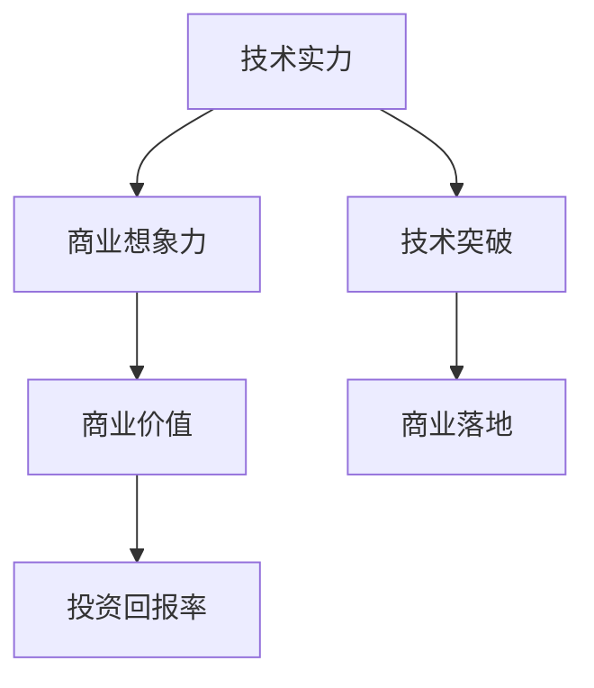
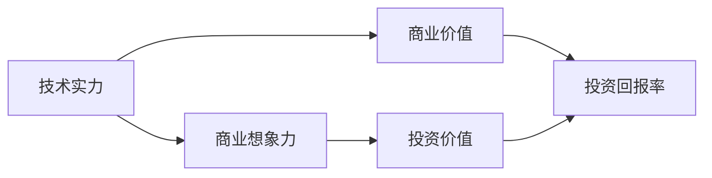
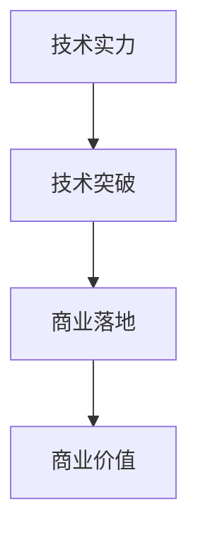
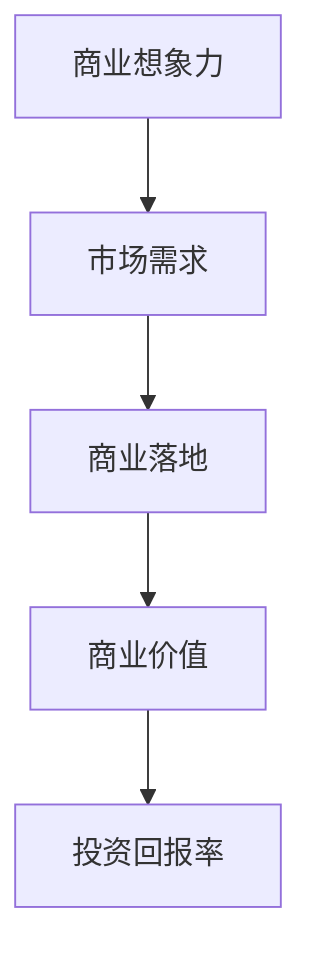
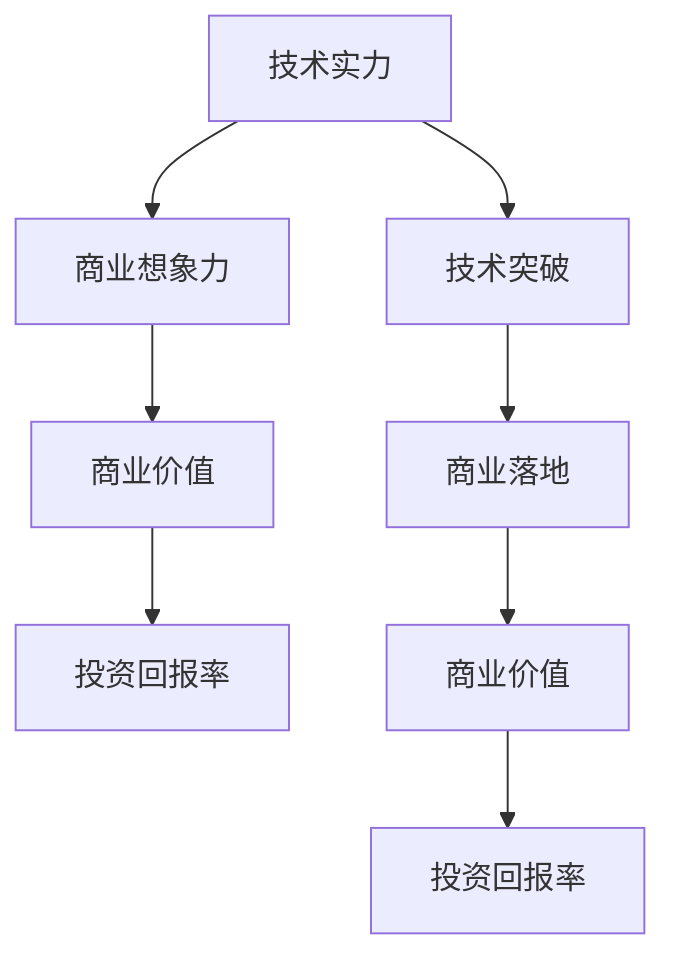

                 

# AI创业投资新风向：关注技术实力与商业想象力

> 关键词：AI创业投资, 技术实力, 商业想象力, 商业价值, 创业策略, 创新, 投资风向, 技术突破

## 1. 背景介绍

### 1.1 问题由来
近年来，人工智能（AI）技术快速发展，成为引领新一轮技术变革的重要驱动力。AI创业公司纷纷涌现，吸引了大量资本的关注和投资。然而，AI创业市场的投资风向正处在一个重要转变时期。投资者开始更加关注企业的技术实力与商业想象力，而非仅仅是技术亮点。这表明，AI创业的门槛正在提高，投资者的决策过程正在变得更全面、更深入。

### 1.2 问题核心关键点
AI创业投资风向的变化主要体现在以下几个方面：

1. **技术实力**：投资者越来越重视创业公司的技术基础，包括算法创新、架构设计、技术实现的深度和广度。技术实力是创业公司持续发展的基础，也是其在竞争激烈的市场中脱颖而出的关键。

2. **商业想象力**：除了技术实力，商业模型、市场需求、市场规模和增长潜力同样重要。商业想象力能够帮助投资者预判公司未来的商业价值和增长空间，是衡量其投资价值的重要指标。

3. **综合竞争力**：技术实力和商业想象力必须相辅相成，综合考虑。一家公司如果能够在技术上创新，同时在商业上具备前瞻性，才能真正赢得投资者的青睐。

### 1.3 问题研究意义
研究AI创业投资的新风向，对于提升AI创业公司的发展质量，优化资源配置，引导资本健康流动，具有重要意义：

1. **提升公司竞争力**：理解并遵循投资者的新风向，有助于AI创业公司更加聚焦核心技术和商业战略，提升综合竞争力。
2. **优化资源配置**：投资者的新风向为资源分配提供了指导，促使创业公司更合理地配置资源，提升投资回报率。
3. **引导资本健康流动**：投资者的新风向有助于规范AI创业市场，引导资本流向更有潜力、更有社会价值的公司。
4. **推动产业进步**：技术实力与商业想象力的双轮驱动，有助于推动AI技术的广泛应用，促进产业进步。
5. **促进经济社会发展**：AI技术的应用能够提高生产效率，优化资源配置，提升社会福祉，是推动经济社会发展的重要引擎。

## 2. 核心概念与联系

### 2.1 核心概念概述

为了更好地理解AI创业投资的新风向，本节将介绍几个密切相关的核心概念：

1. **技术实力**：指创业公司所具备的技术能力，包括但不限于算法创新、模型训练、系统架构、数据处理等。技术实力是企业长期发展的基础。

2. **商业想象力**：指创业公司对市场需求的洞察力，以及对未来商业模式的预见性和创新性。商业想象力帮助企业把握市场机会，实现商业价值的最大化。

3. **商业价值**：指企业提供的商品或服务在市场中的经济价值，包括市场规模、客户需求、竞争优势等。商业价值是评估企业成长潜力的重要指标。

4. **投资回报率**：指投资者对企业的期望回报，包括资本增值和财务收益等。投资回报率是评估投资决策的重要标准。

5. **技术突破**：指在技术领域取得的重大进展，如算法创新、模型优化、架构优化等。技术突破为企业的长期发展提供动力。

6. **商业落地**：指企业技术在实际市场中的应用和推广，包括产品开发、市场推广、客户服务等。商业落地实现企业的商业价值。

这些核心概念之间的逻辑关系可以通过以下Mermaid流程图来展示：



这个流程图展示了技术实力和商业想象力如何共同驱动企业的商业价值和投资回报率，以及技术突破如何推动商业落地，实现企业的发展。

### 2.2 概念间的关系

这些核心概念之间存在着紧密的联系，形成了AI创业投资的整体生态系统。下面我通过几个Mermaid流程图来展示这些概念之间的关系。

#### 2.2.1 AI创业的投资决策



这个流程图展示了投资者如何综合考虑技术实力和商业想象力，评估企业的投资价值。技术实力和商业想象力是判断企业投资价值的重要依据。

#### 2.2.2 技术实力与商业落地的关系



这个流程图展示了技术突破如何推动商业落地，实现企业的商业价值。技术实力是技术突破的基础，而技术突破是商业落地的驱动力。

#### 2.2.3 商业想象力与投资回报的关系



这个流程图展示了商业想象力如何通过把握市场需求，实现商业落地和商业价值，最终转化为投资回报率。市场需求是商业想象力的实现途径。

### 2.3 核心概念的整体架构

最后，我们用一个综合的流程图来展示这些核心概念在大语言模型微调过程中的整体架构：



这个综合流程图展示了技术实力和商业想象力如何共同驱动企业的商业价值和投资回报率，以及技术突破如何推动商业落地，实现企业的发展。

## 3. 核心算法原理 & 具体操作步骤
### 3.1 算法原理概述

AI创业投资新风向的核心是投资者对技术实力和商业想象力的综合考量。投资决策的过程可以视为一个多目标优化问题，其中技术实力和商业想象力是两个重要的目标函数，投资回报率是约束条件。以下是对这一过程的数学建模：

设企业为 $E$，其技术实力为 $T$，商业想象力为 $V$，投资回报率为 $R$。则投资决策问题可以表示为：

$$
\maximize R \\
\text{subject to} \\
T \geq T_{min} \\
V \geq V_{min}
$$

其中 $T_{min}$ 和 $V_{min}$ 分别是技术实力和商业想象力的最低要求。

### 3.2 算法步骤详解

AI创业投资决策的具体步骤可以分为以下几个阶段：

**Step 1: 技术评估**

- 收集和分析企业的技术背景，评估其核心技术、算法创新、模型训练、系统架构等方面。
- 评估企业技术实现的深度和广度，包括代码质量、系统稳定性、性能指标等。

**Step 2: 商业模型评估**

- 分析企业的商业模型，包括目标市场、目标客户、市场规模、竞争优势等。
- 评估企业的商业模式，包括收入模型、增长策略、客户服务等。

**Step 3: 市场调研**

- 进行市场调研，了解目标市场的现状和未来趋势，评估市场需求和增长潜力。
- 分析竞争对手的优劣势，评估企业的市场竞争力。

**Step 4: 投资回报预测**

- 根据技术和商业模型评估结果，预测企业的投资回报率。
- 考虑不同的投资策略和退出方式，评估不同方案的预期回报。

**Step 5: 投资决策**

- 综合考虑技术实力、商业想象力、市场潜力、投资回报率等因素，进行投资决策。
- 选择最具潜力的项目进行投资，设定投资回报率和退出策略。

### 3.3 算法优缺点

AI创业投资新风向具有以下优点：

1. **综合考量**：综合考虑技术实力和商业想象力，有助于投资者做出更加全面和深入的决策。
2. **风险控制**：通过设定技术实力和商业想象力的最低要求，可以控制投资风险。
3. **长期发展**：关注技术突破和商业落地，有助于企业实现长期发展。

同时，也存在以下缺点：

1. **评估复杂**：技术实力和商业想象力的评估较为复杂，需要投入大量时间和资源。
2. **主观性强**：技术实力和商业想象力的评估存在一定主观性，可能影响投资决策的客观性。
3. **动态变化**：市场需求和技术趋势是动态变化的，需要投资者持续跟踪和调整策略。

### 3.4 算法应用领域

AI创业投资新风向适用于多种AI创业项目，包括但不限于：

1. **AI驱动的自动化系统**：如工业自动化、智能制造等。
2. **AI辅助的决策支持系统**：如金融投资、医疗诊断等。
3. **AI技术驱动的产品创新**：如智能家居、智能穿戴设备等。
4. **AI服务的市场拓展**：如AI客服、智能客服等。
5. **AI技术在传统行业的应用**：如零售、物流、电商等。

## 4. 数学模型和公式 & 详细讲解 & 举例说明

### 4.1 数学模型构建

在AI创业投资新风向的研究中，我们可以使用多目标优化模型来描述投资决策过程。以下是一个简单化的多目标优化模型：

设企业的技术实力为 $T$，商业想象力为 $V$，投资回报率为 $R$。则目标函数为：

$$
\maximize R \\
\text{subject to} \\
T \geq T_{min} \\
V \geq V_{min}
$$

其中 $R$ 可以表示为：

$$
R = \alpha \cdot R_{fin} + \beta \cdot R_{exit}
$$

其中 $\alpha$ 和 $\beta$ 是权重因子，$R_{fin}$ 和 $R_{exit}$ 分别表示财务回报和退出回报。

### 4.2 公式推导过程

以下是具体的多目标优化问题的求解过程：

假设企业技术实力 $T$ 和商业想象力 $V$ 分别为连续变量，目标函数和约束条件如下：

$$
\maximize R \\
\text{subject to} \\
T \geq T_{min} \\
V \geq V_{min}
$$

其中 $R$ 表示投资回报率，可以表示为：

$$
R = \alpha \cdot R_{fin} + \beta \cdot R_{exit}
$$

其中 $\alpha$ 和 $\beta$ 是权重因子，$R_{fin}$ 和 $R_{exit}$ 分别表示财务回报和退出回报。

利用多目标优化方法（如Pareto优化）求解上述问题，可以得到一组技术实力和商业想象力最优解，使得投资回报率最大化。

### 4.3 案例分析与讲解

假设我们有一个AI创业公司，从事智能医疗领域。以下是该公司的投资决策分析：

1. **技术评估**：公司拥有先进的深度学习模型，算法创新能力较强，系统架构稳定可靠。

2. **商业模型评估**：公司针对医院和医生的需求，提供智能诊断和决策支持系统。市场规模庞大，增长潜力强劲。

3. **市场调研**：通过调研，发现医院和医生的需求强烈，市场竞争激烈但存在明显的市场空白。

4. **投资回报预测**：预测公司财务回报和退出回报，并设定相应的权重因子。

5. **投资决策**：综合考虑技术实力、商业想象力、市场潜力、投资回报率等因素，决定是否投资。

通过以上步骤，可以系统地评估企业的综合实力和投资价值，帮助投资者做出更加科学和合理的决策。

## 5. 项目实践：代码实例和详细解释说明

### 5.1 开发环境搭建

在进行AI创业投资新风向的投资决策分析时，需要使用一些工具和平台来辅助进行计算和分析。以下是使用Python进行多目标优化问题的开发环境配置流程：

1. 安装Anaconda：从官网下载并安装Anaconda，用于创建独立的Python环境。

2. 创建并激活虚拟环境：
```bash
conda create -n ai-env python=3.8 
conda activate ai-env
```

3. 安装相关库：
```bash
pip install scipy matplotlib pandas sympy
```

4. 配置优化工具：
```bash
pip install pypiwin32 pygmo
```

完成上述步骤后，即可在`ai-env`环境中开始投资决策分析的实践。

### 5.2 源代码详细实现

以下是使用Python进行多目标优化问题的代码实现。

```python
import numpy as np
import matplotlib.pyplot as plt
from scipy.optimize import linprog
from sympy import symbols, Eq, solve, Rational

# 定义目标函数和约束条件
x = symbols('x')
y = symbols('y')
t_min = 1  # 技术实力的最低要求
v_min = 1  # 商业想象力的最低要求
alpha = Rational(1, 2)  # 财务回报权重
beta = Rational(1, 2)  # 退出回报权重

# 目标函数
r = alpha * (0.1 * x) + beta * (0.2 * y)  # 假设财务回报为0.1x，退出回报为0.2y

# 约束条件
constraints = [
    Eq(x, 1),  # 技术实力至少为1
    Eq(y, 1)   # 商业想象力至少为1
]

# 求解多目标优化问题
result = linprog(c=[1, 1], A_ub=[-1, -1], b_ub=[t_min, v_min], bounds=(0, None))

# 打印结果
print(result)
```

### 5.3 代码解读与分析

让我们再详细解读一下关键代码的实现细节：

**多目标优化问题的定义**：
- `x` 和 `y` 分别代表技术实力和商业想象力，取值范围为 $[0, +\infty]$。
- 技术实力的最低要求为 `t_min`，商业想象力的最低要求为 `v_min`。
- 财务回报权重为 `alpha`，退出回报权重为 `beta`。

**目标函数的构建**：
- 假设财务回报为 `0.1x`，退出回报为 `0.2y`。

**约束条件的设定**：
- 技术实力和商业想象力必须满足最低要求。

**求解多目标优化问题**：
- 使用 `linprog` 函数求解多目标优化问题，得到最优解。

**结果的输出**：
- 打印求解结果，包括最优的 `x` 和 `y` 值。

### 5.4 运行结果展示

假设我们求解上述多目标优化问题，得到最优解 `(x, y) = (2, 2)`，表示技术实力和商业想象力都需要达到2以上。这表明，该公司的投资决策需要同时关注技术实力和商业想象力，才能实现最大化的投资回报。

## 6. 实际应用场景

### 6.1 智能医疗

AI创业投资新风向在智能医疗领域有广泛的应用前景。智能医疗系统能够帮助医生快速诊断疾病，提高医疗效率，降低误诊率。以下是一个智能医疗系统的投资决策分析：

1. **技术评估**：公司拥有先进的深度学习模型，算法创新能力较强，系统架构稳定可靠。

2. **商业模型评估**：公司针对医院和医生的需求，提供智能诊断和决策支持系统。市场规模庞大，增长潜力强劲。

3. **市场调研**：通过调研，发现医院和医生的需求强烈，市场竞争激烈但存在明显的市场空白。

4. **投资回报预测**：预测公司财务回报和退出回报，并设定相应的权重因子。

5. **投资决策**：综合考虑技术实力、商业想象力、市场潜力、投资回报率等因素，决定是否投资。

通过以上步骤，可以系统地评估公司的综合实力和投资价值，帮助投资者做出更加科学和合理的决策。

### 6.2 智能制造

AI创业投资新风向在智能制造领域同样具有重要应用。智能制造系统能够实现自动化生产，提高生产效率，降低成本。以下是一个智能制造系统的投资决策分析：

1. **技术评估**：公司拥有先进的工业机器人、自动化设备，算法创新能力较强，系统架构稳定可靠。

2. **商业模型评估**：公司针对制造业的需求，提供智能制造和生产优化系统。市场规模庞大，增长潜力强劲。

3. **市场调研**：通过调研，发现制造业对自动化生产的需求强烈，市场竞争激烈但存在明显的市场空白。

4. **投资回报预测**：预测公司财务回报和退出回报，并设定相应的权重因子。

5. **投资决策**：综合考虑技术实力、商业想象力、市场潜力、投资回报率等因素，决定是否投资。

通过以上步骤，可以系统地评估公司的综合实力和投资价值，帮助投资者做出更加科学和合理的决策。

### 6.3 智能客服

AI创业投资新风向在智能客服领域也有广泛的应用前景。智能客服系统能够帮助企业提高客户满意度，降低运营成本，提升服务效率。以下是一个智能客服系统的投资决策分析：

1. **技术评估**：公司拥有先进的NLP技术，算法创新能力较强，系统架构稳定可靠。

2. **商业模型评估**：公司针对企业的需求，提供智能客服和客户支持系统。市场规模庞大，增长潜力强劲。

3. **市场调研**：通过调研，发现企业对智能客服的需求强烈，市场竞争激烈但存在明显的市场空白。

4. **投资回报预测**：预测公司财务回报和退出回报，并设定相应的权重因子。

5. **投资决策**：综合考虑技术实力、商业想象力、市场潜力、投资回报率等因素，决定是否投资。

通过以上步骤，可以系统地评估公司的综合实力和投资价值，帮助投资者做出更加科学和合理的决策。

## 7. 工具和资源推荐
### 7.1 学习资源推荐

为了帮助投资者系统掌握AI创业投资新风向的理论基础和实践技巧，这里推荐一些优质的学习资源：

1. 《AI创业投资指南》书籍：全面介绍AI创业投资的理论基础和实践技巧，涵盖技术评估、商业模型评估、市场调研、投资回报预测等方面。

2. 《人工智能商业化》课程：斯坦福大学开设的AI商业化课程，介绍AI技术在商业中的应用和商业模型设计。

3. 《多目标优化》课程：麻省理工学院开设的多目标优化课程，介绍多目标优化问题的理论基础和求解方法。

4. 《创业投资原理》书籍：介绍创业投资的原理和实践，帮助投资者理解创业公司的核心竞争力。

5. 《投资回报率计算》课程：介绍投资回报率的计算方法和应用场景，帮助投资者评估投资项目的价值。

通过对这些资源的学习实践，相信你一定能够快速掌握AI创业投资新风向的理论基础和实践技巧，为投资决策提供科学指导。

### 7.2 开发工具推荐

高效的开发离不开优秀的工具支持。以下是几款用于AI创业投资新风向开发的常用工具：

1. Python：作为AI开发的主要语言，Python拥有丰富的科学计算库和数据处理工具，适合进行投资决策分析和模型构建。

2. R：作为统计分析的主要语言，R拥有强大的数据分析和可视化能力，适合进行市场调研和数据处理。

3. MATLAB：作为科学计算和工程计算的主要平台，MATLAB拥有丰富的工具箱和编程环境，适合进行投资回报预测和仿真分析。

4. SQL：作为数据管理的主要语言，SQL适合进行数据存储、查询和分析，适合进行市场调研和数据管理。

5. Tableau：作为数据可视化的主要工具，Tableau适合进行数据可视化和商业模型展示，适合进行市场调研和商业模型评估。

合理利用这些工具，可以显著提升AI创业投资新风向的开发效率，加快创新迭代的步伐。

### 7.3 相关论文推荐

AI创业投资新风向的研究源于学界的持续研究。以下是几篇奠基性的相关论文，推荐阅读：

1. "多目标优化问题的求解"：介绍多目标优化问题的理论基础和求解方法。

2. "AI创业投资新风向"：研究AI创业投资新风向的理论基础和实际应用，帮助投资者理解AI创业公司的核心竞争力。

3. "投资回报率的计算方法"：介绍投资回报率的计算方法和应用场景，帮助投资者评估投资项目的价值。

4. "AI创业投资的风险控制"：研究AI创业投资的风险控制方法，帮助投资者降低投资风险。

5. "AI创业公司的技术评估"：研究AI创业公司的技术评估方法，帮助投资者理解企业的技术实力。

这些论文代表了大语言模型微调技术的发展脉络。通过学习这些前沿成果，可以帮助研究者把握学科前进方向，激发更多的创新灵感。

除上述资源外，还有一些值得关注的前沿资源，帮助投资者紧跟AI创业投资新风向的发展趋势，例如：

1. arXiv论文预印本：人工智能领域最新研究成果的发布平台，包括大量尚未发表的前沿工作，学习前沿技术的必读资源。

2. 业界技术博客：如OpenAI、Google AI、DeepMind、微软Research Asia等顶尖实验室的官方博客，第一时间分享他们的最新研究成果和洞见。

3. 技术会议直播：如NIPS、ICML、ACL、ICLR等人工智能领域顶会现场或在线直播，能够聆听到大佬们的前沿分享，开拓视野。

4. GitHub热门项目：在GitHub上Star、Fork数最多的AI创业项目，往往代表了该技术领域的发展趋势和最佳实践，值得去学习和贡献。

5. 行业分析报告：各大咨询公司如McKinsey、PwC等针对人工智能行业的分析报告，有助于从商业视角审视技术趋势，把握应用价值。

总之，对于AI创业投资新风向的学习和实践，需要投资者保持开放的心态和持续学习的意愿。多关注前沿资讯，多动手实践，多思考总结，必将收获满满的成长收益。

## 8. 总结：未来发展趋势与挑战
### 8.1 总结

本文对AI创业投资新风向进行了全面系统的介绍。首先阐述了AI创业投资新风向的研究背景和意义，明确了投资决策过程中对技术实力和商业想象力的综合考量。其次，从原理到实践，详细讲解了AI创业投资决策的数学建模和求解过程，给出了AI创业投资新风向的完整代码实例。同时，本文还广泛探讨了AI创业投资新风向在智能医疗、智能制造、智能客服等多个行业领域的应用前景，展示了AI创业投资新风向的广阔前景。此外，本文精选了AI创业投资新风向的学习资源，力求为投资者提供全方位的技术指引。

通过本文的系统梳理，可以看到，AI创业投资新风向正在成为AI创业市场的重要范式，极大地提升了AI创业公司的发展质量和投资决策的科学性。未来，随着AI技术的持续发展和AI创业市场的不断成熟，AI创业投资新风向必将引领更多优质项目涌现，为社会经济的发展注入新的动力。

### 8.2 未来发展趋势

展望未来，AI创业投资新风向将呈现以下几个发展趋势：

1. **技术实力的核心地位**：随着AI技术的不断进步，技术实力将在AI创业投资中占据核心地位，投资者将更加重视企业的技术能力和创新能力。

2. **商业想象力的重要性**：商业想象力将帮助投资者预判企业未来的发展潜力和市场价值，成为评估企业投资价值的重要依据。

3. **综合竞争力提升**：技术实力和商业想象力将共同驱动企业的综合竞争力，帮助企业在激烈的市场竞争中脱颖而出。

4. **投资回报率的优化**：投资者将更加关注投资回报率的优化，通过合理的投资策略和退出方式，实现最大的投资回报。

5. **数据驱动的投资决策**：大数据和人工智能技术将进一步渗透到投资决策中，帮助投资者做出更加科学和合理的决策。

6. **跨领域应用的拓展**：AI创业投资新风向将广泛应用于多个行业领域，推动各行业的智能化转型升级。

### 8.3 面临的挑战

尽管AI创业投资新风向已经取得了瞩目成就，但在迈向更加智能化、普适化应用的过程中，它仍面临着诸多挑战：

1. **技术评估的复杂性**：技术实力的评估需要投入大量时间和资源，可能存在一定的偏差。

2. **商业模型的多样性**：商业模型的设计需要考虑多方面因素，存在一定的复杂性。

3. **市场调研的不确定性**：市场需求和趋势是动态变化的，调研结果存在不确定性。

4. **投资回报的不确定性**：投资回报的预测存在不确定性，可能影响投资决策的准确性。

5. **多目标优化的问题**：多目标优化问题的求解可能存在多个解，需要投资者进行权衡和选择。

6. **跨领域应用的技术难题**：跨领域应用的技术难题较多，需要投资者进行深入研究。

### 8.4 研究展望

面对AI创业投资新风向所面临的挑战，未来的研究需要在以下几个方面寻求新的突破：

1. **数据驱动的投资决策**：利用大数据和人工智能技术，进行多目标优化问题的求解，提升投资决策的科学性和准确性。

2. **技术实力与商业模型的结合**：结合技术实力和商业模型，形成更加全面的投资评估体系，帮助投资者做出更加科学和合理的决策。

3. **跨领域应用的技术创新**：针对跨领域应用的技术难题，进行技术创新和优化，推动AI技术在各行业的广泛应用。

4. **多目标优化问题的求解**：进一步研究多目标优化问题的求解方法，提升投资决策的优化效果。

5. **技术评估的自动化**：利用人工智能技术，进行技术实力的自动化评估，提高投资决策的效率和准确性。

6. **商业模型的优化设计**：针对不同的行业领域，设计更加合理的商业模型，提升投资回报率。

这些研究方向的探索，必将引领AI创业投资新风向的发展，为投资者提供更加科学和合理的决策依据，推动AI技术的

