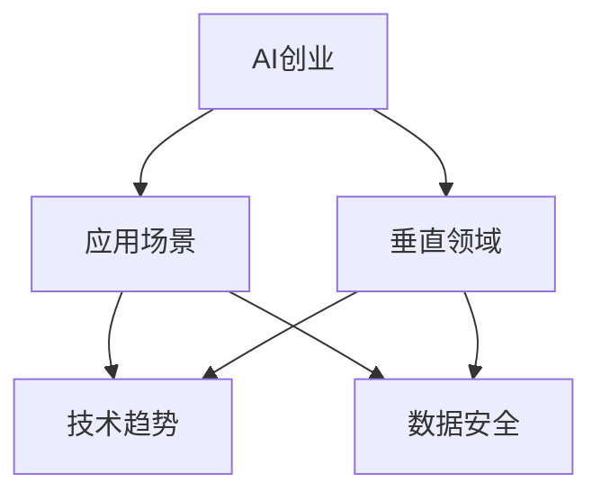
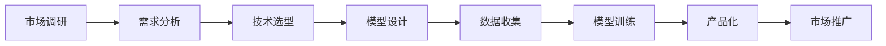
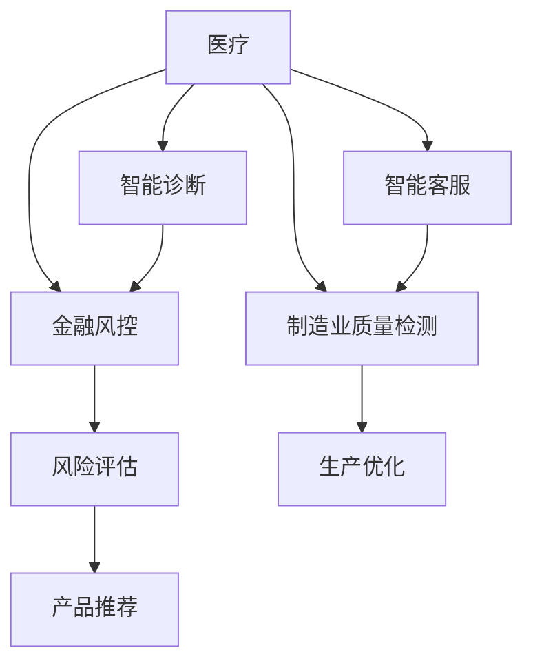
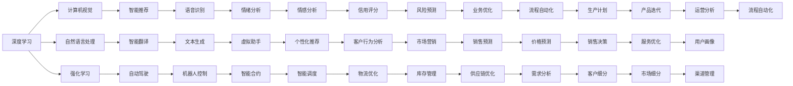
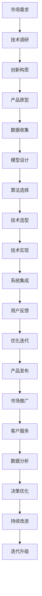

                 

# AI创业机遇：垂直领域无限可能

> 关键词：AI创业、垂直领域、应用场景、技术趋势、数据安全、未来展望

## 1. 背景介绍

### 1.1 问题由来

近年来，随着人工智能技术的迅猛发展，人工智能（AI）创业已经成为炙手可热的领域。据统计，全球AI初创企业数量持续增长，市值飙升，吸引了大量资本的关注。从2015年的数百个AI初创企业增长至2021年的2000多个，市值也从数亿美元增长至近万亿美元。这些成功的案例包括OpenAI、DeepMind、商汤科技、旷视科技等。AI创业正在迅速改变各行各业，推动技术进步和产业升级。

AI创业的火热背后，是人工智能技术的快速发展。深度学习、自然语言处理、计算机视觉、自动驾驶、推荐系统等技术进步，为AI创业提供了坚实的基础。特别是在垂直领域，AI技术的应用前景广阔，具有极大的商业价值和创新空间。

### 1.2 问题核心关键点

AI创业的核心在于解决特定领域的业务问题，通过技术创新提升产业效率和用户体验。核心关键点包括：

- 选择合适的垂直领域：医疗、教育、金融、制造、零售、能源、环保等，每个领域都有独特的痛点和需求。
- 应用最新AI技术：深度学习、迁移学习、强化学习、自然语言处理、计算机视觉等，提供定制化解决方案。
- 数据驱动创新：高质量、大样本量的数据集是AI创业成功的关键，可以通过众包、合作、购买等方式获取数据。
- 产品化落地：将技术转化为具体的产品或服务，解决实际问题，创造商业价值。
- 持续优化提升：通过机器学习算法迭代、数据积累、反馈优化，不断提升AI模型的性能。

这些关键点构成了AI创业的完整生态，从技术研发到产品落地，再到用户体验，每个环节都需要精心设计。

### 1.3 问题研究意义

AI创业不仅能够推动技术进步和产业升级，还能为创业者和投资者带来丰厚的回报。随着技术的不断进步，AI创业的应用场景将更加丰富，商业模式也将更加多元化。因此，深入研究AI创业的垂直领域应用，对于推动技术创新、产业升级、人才培养和经济增长具有重要意义。

## 2. 核心概念与联系

### 2.1 核心概念概述

为了更好地理解AI创业在垂直领域的应用，本节将介绍几个关键概念：

- AI创业（AI Startup）：指以人工智能技术为基础，旨在解决特定领域问题的创业行为。通常由技术背景的创业者主导，拥有强大的技术团队和数据分析能力。
- 垂直领域（Vertical Market）：指特定行业或细分市场，如医疗、教育、金融、制造等，每个领域有独特的业务需求和应用场景。
- 应用场景（Use Case）：指AI技术在具体领域中的具体应用，如智能客服、医疗影像分析、金融风控等。
- 技术趋势（Technology Trend）：指人工智能领域最新的技术进展和前沿方向，如深度学习、自然语言处理、计算机视觉等。
- 数据安全（Data Security）：指在AI创业过程中，如何保护用户隐私、数据安全和知识产权等重要问题。

这些概念之间的逻辑关系可以通过以下Mermaid流程图来展示：



这个流程图展示了AI创业的完整生态系统：AI创业技术应用于各个垂直领域，并结合最新的技术趋势和数据安全问题，为特定应用场景提供解决方案。

### 2.2 概念间的关系

这些核心概念之间存在着紧密的联系，形成了AI创业的完整生态系统。下面我们通过几个Mermaid流程图来展示这些概念之间的关系。

#### 2.2.1 AI创业的基本流程



这个流程图展示了AI创业的基本流程：从市场调研、需求分析、技术选型、模型设计、数据收集、模型训练到产品化、市场推广，每个环节都需要精心设计和优化。

#### 2.2.2 垂直领域的应用场景



这个流程图展示了AI在垂直领域中的多个应用场景：智能诊断、智能客服、金融风控、制造业质量检测等。每个应用场景都需要根据具体业务需求，选择合适的技术手段和算法模型。

#### 2.2.3 技术趋势与AI创业的结合



这个流程图展示了AI创业中涉及的各类技术趋势，如深度学习、计算机视觉、自然语言处理、强化学习等，以及它们在具体应用场景中的应用，如智能推荐、智能翻译、自动驾驶、情绪分析等。

### 2.3 核心概念的整体架构

最后，我们用一个综合的流程图来展示这些核心概念在大规模AI创业中的整体架构：



这个综合流程图展示了从市场需求、技术调研、创新构思到产品原型、数据收集、模型设计、技术实现、系统集成、用户反馈、优化迭代、产品发布、市场推广、客户服务、数据分析、决策优化、持续改进和迭代升级的完整过程。通过这些流程图，我们可以更清晰地理解AI创业在垂直领域应用过程中的各个环节和步骤。

## 3. 核心算法原理 & 具体操作步骤

### 3.1 算法原理概述

AI创业的核心在于通过数据驱动的机器学习算法，解决特定领域的业务问题。其核心思想是：将大规模数据集输入到预先训练好的AI模型中，通过监督学习或非监督学习等方法，优化模型参数，使其在特定应用场景中达到最佳表现。

形式化地，假设输入数据集为 $D=\{(x_i,y_i)\}_{i=1}^N$，其中 $x_i$ 为输入特征，$y_i$ 为标签。模型为 $f$，通过最小化损失函数 $\mathcal{L}$，优化模型参数 $\theta$，使其在测试集 $D_{test}$ 上表现最优：

$$
\theta^* = \mathop{\arg\min}_{\theta} \mathcal{L}(f_\theta(x),y) 
$$

在实际应用中，通常使用监督学习方法，如回归、分类、序列预测等，来优化模型参数。对于分类任务，常用的损失函数包括交叉熵损失、对数损失等；对于回归任务，常用的损失函数包括均方误差损失、平均绝对误差损失等。

### 3.2 算法步骤详解

基于AI创业的监督学习流程一般包括以下几个关键步骤：

**Step 1: 数据收集与预处理**
- 收集特定领域的标注数据集，包含大量输入和对应标签。
- 对数据进行清洗和预处理，如去除噪声、处理缺失值、数据标准化等。
- 划分训练集、验证集和测试集，确保数据分布一致。

**Step 2: 模型选型与设计**
- 根据应用场景选择合适的机器学习模型，如线性回归、逻辑回归、支持向量机、决策树、随机森林等。
- 对模型进行初步设计，如选择超参数、网络结构等。

**Step 3: 模型训练与优化**
- 使用训练集进行模型训练，最小化损失函数。
- 使用验证集评估模型性能，调整超参数和模型结构。
- 使用测试集进行最终性能评估，确认模型效果。

**Step 4: 模型部署与迭代**
- 将训练好的模型部署到实际应用中，集成到业务系统中。
- 持续收集用户反馈和实际数据，进行模型迭代和优化。
- 定期更新模型，确保其性能和数据一致性。

### 3.3 算法优缺点

基于AI创业的监督学习方法具有以下优点：
- 数据驱动：通过大规模数据训练模型，具有较强的泛化能力。
- 简单易用：只需选择合适的模型和算法，不需要复杂的数学推导和编程技能。
- 高效迭代：可以通过数据迭代不断优化模型，逐步提升性能。

同时，该方法也存在以下局限性：
- 数据依赖：需要大量高质量标注数据，数据获取成本高。
- 模型黑盒：难以解释模型内部工作机制，缺乏可解释性。
- 过拟合风险：对于数据量小或噪声较大的数据集，容易发生过拟合。

尽管存在这些局限性，但就目前而言，基于监督学习的AI创业方法仍然是主流范式，具有较强的实用性和广泛应用场景。

### 3.4 算法应用领域

基于AI创业的监督学习方法在以下领域得到了广泛应用：

- 医疗健康：AI驱动的智能诊断、影像分析、基因组学、药物发现等，显著提高了医疗服务的效率和准确性。
- 金融科技：AI驱动的信用评分、风险评估、欺诈检测、智能投顾等，提升了金融风险控制和客户服务水平。
- 智能制造：AI驱动的智能质检、生产优化、供应链管理等，提升了制造业的自动化水平和生产效率。
- 零售电商：AI驱动的推荐系统、价格预测、库存管理、客户行为分析等，提高了电商平台的销售转化率和客户满意度。
- 智慧城市：AI驱动的交通管理、环境监测、公共安全、城市运营等，提升了城市的智能化水平和运行效率。

除了上述这些主要领域，AI创业还在教育、旅游、物流、农业等诸多行业得到了应用，推动了这些领域的技术进步和产业升级。

## 4. 数学模型和公式 & 详细讲解

### 4.1 数学模型构建

本节将使用数学语言对AI创业的监督学习模型进行更加严格的刻画。

假设输入数据集为 $D=\{(x_i,y_i)\}_{i=1}^N$，其中 $x_i$ 为输入特征，$y_i$ 为标签。模型为 $f$，通过最小化损失函数 $\mathcal{L}$，优化模型参数 $\theta$，使其在测试集 $D_{test}$ 上表现最优：

$$
\theta^* = \mathop{\arg\min}_{\theta} \mathcal{L}(f_\theta(x),y) 
$$

在实践中，我们通常使用基于梯度的优化算法（如SGD、Adam、Adagrad等）来近似求解上述最优化问题。设 $\eta$ 为学习率，则参数的更新公式为：

$$
\theta \leftarrow \theta - \eta \nabla_{\theta}\mathcal{L}(\theta) 
$$

其中 $\nabla_{\theta}\mathcal{L}(\theta)$ 为损失函数对参数 $\theta$ 的梯度，可通过反向传播算法高效计算。

### 4.2 公式推导过程

以下我们以线性回归模型为例，推导回归任务中的损失函数及其梯度的计算公式。

假设模型为线性回归模型：

$$
y = f(x;\theta) = \theta_0 + \theta_1 x_1 + \theta_2 x_2 + \ldots + \theta_n x_n
$$

其中 $\theta_0,\theta_1,\ldots,\theta_n$ 为模型的参数。损失函数通常采用均方误差（Mean Squared Error, MSE）：

$$
\mathcal{L} = \frac{1}{N} \sum_{i=1}^N (y_i - f(x_i;\theta))^2
$$

求导得：

$$
\nabla_{\theta}\mathcal{L} = \frac{2}{N} \sum_{i=1}^N (y_i - f(x_i;\theta)) x_i
$$

根据梯度下降算法，模型参数的更新公式为：

$$
\theta \leftarrow \theta - \eta \nabla_{\theta}\mathcal{L} 
$$

在实际应用中，我们还可以引入正则化项，如L2正则化，进一步避免过拟合：

$$
\mathcal{L} = \frac{1}{N} \sum_{i=1}^N (y_i - f(x_i;\theta))^2 + \lambda \sum_{j=0}^n \theta_j^2
$$

其中 $\lambda$ 为正则化系数。

### 4.3 案例分析与讲解

假设我们在金融风控领域应用线性回归模型进行信用评分预测，具体步骤如下：

1. **数据收集**：从金融公司收集客户的历史信用数据，包括年龄、收入、历史欠款、还款记录等，进行数据清洗和标准化。

2. **模型设计**：选择合适的线性回归模型，并设计模型参数 $\theta_0,\theta_1,\ldots,\theta_n$。

3. **模型训练**：使用历史信用数据训练模型，最小化均方误差损失。

4. **模型评估**：在验证集上评估模型性能，调整模型参数。

5. **模型部署**：将训练好的模型部署到风控系统中，进行客户信用评分预测。

6. **模型迭代**：持续收集新数据，定期更新模型，保持其性能和数据一致性。

通过上述步骤，我们可以使用线性回归模型解决金融风控领域的信用评分预测问题，显著提升金融公司对客户信用风险的评估能力。

## 5. 项目实践：代码实例和详细解释说明

### 5.1 开发环境搭建

在进行AI创业实践前，我们需要准备好开发环境。以下是使用Python进行Scikit-learn开发的环境配置流程：

1. 安装Anaconda：从官网下载并安装Anaconda，用于创建独立的Python环境。

2. 创建并激活虚拟环境：
```bash
conda create -n sklearn-env python=3.8 
conda activate sklearn-env
```

3. 安装Scikit-learn：
```bash
conda install scikit-learn
```

4. 安装各类工具包：
```bash
pip install numpy pandas scikit-learn matplotlib tqdm jupyter notebook ipython
```

完成上述步骤后，即可在`sklearn-env`环境中开始AI创业实践。

### 5.2 源代码详细实现

下面我们以信用评分预测为例，给出使用Scikit-learn对线性回归模型进行金融风控预测的Python代码实现。

```python
from sklearn.linear_model import LinearRegression
from sklearn.metrics import mean_squared_error
from sklearn.model_selection import train_test_split

# 加载数据集
data = pd.read_csv('credit_data.csv')
X = data.drop('credit_score', axis=1)
y = data['credit_score']

# 数据预处理
X = X.dropna()

# 划分训练集和测试集
X_train, X_test, y_train, y_test = train_test_split(X, y, test_size=0.2, random_state=42)

# 创建模型
model = LinearRegression()

# 训练模型
model.fit(X_train, y_train)

# 评估模型
y_pred = model.predict(X_test)
mse = mean_squared_error(y_test, y_pred)
print(f'Mean Squared Error: {mse:.2f}')

# 预测新数据
new_data = [[30, 5000, 500, 1.0]]
pred_score = model.predict(new_data)
print(f'Predicted Credit Score: {pred_score[0]}')
```

以上代码展示了使用Scikit-learn对线性回归模型进行金融风控预测的完整流程。可以看到，Scikit-learn提供了简单易用的API，可以快速搭建和训练线性回归模型，并进行预测和评估。

### 5.3 代码解读与分析

让我们再详细解读一下关键代码的实现细节：

1. **数据加载与预处理**：
   - 使用pandas库加载数据集，并进行数据预处理，如去除缺失值、标准化数据等。

2. **模型训练与评估**：
   - 使用Scikit-learn的train_test_split方法将数据集划分为训练集和测试集。
   - 使用LinearRegression类创建线性回归模型，并使用fit方法进行训练。
   - 使用mean_squared_error方法评估模型性能，计算均方误差（MSE）。

3. **模型预测与分析**：
   - 使用predict方法进行模型预测，输入新数据进行信用评分预测。

4. **代码优化与扩展**：
   - 可以使用Scikit-learn的GridSearchCV、RandomizedSearchCV等方法进行超参数搜索，进一步优化模型性能。
   - 可以使用交叉验证、学习率衰减等技术，避免过拟合和欠拟合问题。
   - 可以使用Scikit-learn的Pipeline类，将数据预处理、模型训练、预测等步骤进行管道化，提高代码可读性和可维护性。

通过上述代码实现，我们可以使用Scikit-learn等开源库进行AI创业实践，快速搭建和训练模型，并进行评估和预测。

## 6. 实际应用场景

### 6.1 智能客服系统

基于AI创业的机器学习技术，智能客服系统已经成为许多企业的标准配置。传统客服方式往往需要大量人力，响应速度慢，且服务质量难以保证。智能客服系统通过自然语言处理技术，能够自动理解客户问题，匹配最佳答案，显著提升了客户咨询体验。

在技术实现上，可以收集企业内部的历史客服对话记录，将问题和最佳答复构建成监督数据，在此基础上对线性回归等模型进行训练。训练好的模型能够自动理解客户意图，匹配最合适的答案模板进行回复。对于客户提出的新问题，还可以接入检索系统实时搜索相关内容，动态组织生成回答。如此构建的智能客服系统，能大幅提升客户咨询体验和问题解决效率。

### 6.2 金融舆情监测

金融机构需要实时监测市场舆论动向，以便及时应对负面信息传播，规避金融风险。传统的人工监测方式成本高、效率低，难以应对网络时代海量信息爆发的挑战。基于AI创业的文本分类和情感分析技术，为金融舆情监测提供了新的解决方案。

具体而言，可以收集金融领域相关的新闻、报道、评论等文本数据，并对其进行主题标注和情感标注。在此基础上对线性回归等模型进行微调，使其能够自动判断文本属于何种主题，情感倾向是正面、中性还是负面。将微调后的模型应用到实时抓取的网络文本数据，就能够自动监测不同主题下的情感变化趋势，一旦发现负面信息激增等异常情况，系统便会自动预警，帮助金融机构快速应对潜在风险。

### 6.3 个性化推荐系统

当前的推荐系统往往只依赖用户的历史行为数据进行物品推荐，无法深入理解用户的真实兴趣偏好。基于AI创业的推荐系统，可以通过深度学习等技术，挖掘用户行为背后的语义信息，从而提供更精准、多样的推荐内容。

在实践中，可以收集用户浏览、点击、评论、分享等行为数据，提取和用户交互的物品标题、描述、标签等文本内容。将文本内容作为模型输入，用户的后续行为（如是否点击、购买等）作为监督信号，在此基础上对深度学习等模型进行训练。训练好的模型能够从文本内容中准确把握用户的兴趣点。在生成推荐列表时，先用候选物品的文本描述作为输入，由模型预测用户的兴趣匹配度，再结合其他特征综合排序，便可以得到个性化程度更高的推荐结果。

### 6.4 未来应用展望

随着AI创业的不断发展，基于机器学习的AI应用将在更多领域得到应用，为传统行业带来变革性影响。

在智慧医疗领域，基于AI创业的医疗问答、病历分析、药物研发等应用将提升医疗服务的智能化水平，辅助医生诊疗，加速新药开发进程。

在智能教育领域，AI创业技术可应用于作业批改、学情分析、知识推荐等方面，因材施教，促进教育公平，提高教学质量。

在智慧城市治理中，AI创业技术可应用于城市事件监测、舆情分析、应急指挥等环节，提高城市管理的自动化和智能化水平，构建更安全、高效的未来城市。

此外，在企业生产、社会治理、文娱传媒等众多领域，基于AI创业的人工智能应用也将不断涌现，为经济社会发展注入新的动力。相信随着技术的日益成熟，AI创业方法将成为人工智能落地应用的重要范式，推动人工智能技术在垂直行业的规模化落地。

## 7. 工具和资源推荐

### 7.1 学习资源推荐

为了帮助开发者系统掌握AI创业的理论基础和实践技巧，这里推荐一些优质的学习资源：

1. 《机器学习实战》系列博文：由AI技术专家撰写，深入浅出地介绍了机器学习的基本概念和实用技巧，涵盖线性回归、分类、聚类等经典模型。

2. 《深度学习》课程：由Coursera、edX等平台开设的深度学习课程，涵盖了深度学习的基本原理和应用场景，适合初学者和进阶者。

3. 《Python数据科学手册》书籍：Python数据科学领域的经典教材，涵盖了pandas、numpy、scikit-learn等库的使用，适合数据科学爱好者。

4. Kaggle竞赛：Kaggle平台举办的各类数据科学竞赛，可以帮助开发者实践AI创业的算法和模型，提升实战能力。

5. GitHub开源项目：在GitHub上Star、Fork数最多的AI创业项目，往往代表了该技术领域的发展趋势和最佳实践，值得去学习和贡献。

通过对这些资源的学习实践，相信你一定能够快速掌握AI创业的精髓，并用于解决实际的NLP问题。

### 7.2 开发工具推荐

高效的开发离不开优秀的工具支持。以下是几款用于AI创业开发的常用工具：

1. Scikit-learn：基于Python的开源机器学习库，提供了简单易用的API，支持回归、分类、聚类等多种模型。

2. TensorFlow：由Google主导开发的开源深度学习框架，生产部署方便，适合大规模工程应用。

3. PyTorch：基于Python的开源深度学习框架，灵活动态的计算图，适合快速迭代研究。

4. Weights & Biases：模型训练的实验跟踪工具，可以记录和可视化模型训练过程中的各项指标，方便对比和调优。

5. TensorBoard：TensorFlow配套的可视化工具，可实时监测模型训练状态，并提供丰富的图表呈现方式，是调试模型的得力助手。

6. Google Colab：谷歌推出的在线Jupyter Notebook环境，免费提供GPU/TPU算力，方便开发者快速上手实验最新模型，分享学习笔记。

合理利用这些工具，可以显著提升AI创业任务的开发效率，加快创新迭代的步伐。

### 7.3 相关论文推荐

AI创业的不断发展源于学界的持续研究。以下是几篇奠基性的相关论文，推荐阅读：

1. 《深度学习》论文：由Goodfellow等作者发表，全面介绍了深度学习的基本概念和前沿方向，是深度学习领域的经典之作。

2. 《机器学习实战》系列论文：由Scikit-learn团队撰写，详细介绍了Scikit-learn库的算法实现和应用场景，适合实践开发者参考。

3. 《AI创业初探》论文：探讨了AI创业在金融、医疗、教育等领域的应用，介绍了AI创业的商业模式和挑战。

4. 《AI创业与未来》论文：分析了AI创业的未来趋势和挑战，探讨了AI创业与产业生态的协同发展。

5. 《AI创业技术框架》论文：介绍了AI创业的技术框架和最佳实践，涵盖了数据收集、模型训练、模型部署等各个环节。

这些论文代表了大规模AI创业的发展脉络。通过学习这些前沿成果，可以帮助研究者把握学科前进方向，激发更多的创新灵感。

除上述资源外，还有一些值得关注的前沿资源，帮助开发者紧跟AI创业技术的最新进展，例如：

1. arXiv论文预印本：人工智能领域最新研究成果的发布平台，包括大量尚未发表的前沿工作，学习前沿技术的必读资源。

2. 业界技术博客：如Google AI、DeepMind、微软Research Asia等顶尖实验室

