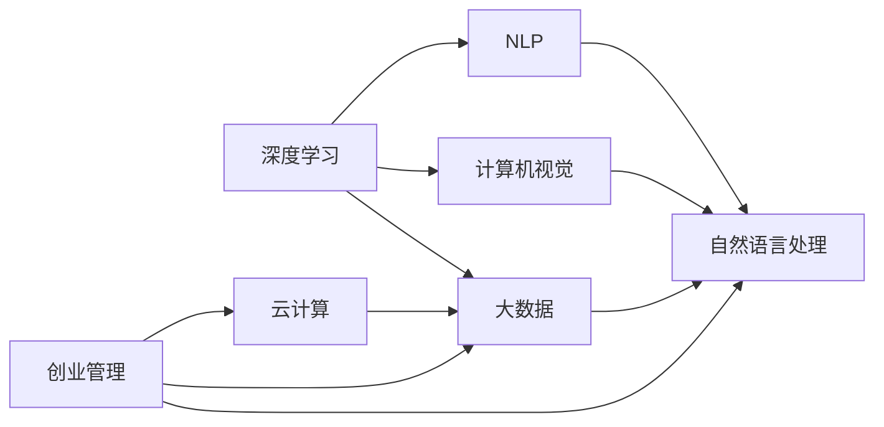

                 

# AI创业：多学科支持的重要性

## 1. 背景介绍

人工智能（AI）技术正快速改变各行各业的运作方式，推动创新和效率。随着深度学习、自然语言处理、计算机视觉等技术的发展，越来越多的AI创业公司应运而生。这些公司依靠AI技术提供独特的解决方案，帮助客户解决问题，同时也面临着技术、市场、管理等多方面的挑战。本文将探讨AI创业成功的关键：多学科支持。

## 2. 核心概念与联系

### 2.1 核心概念概述

为更好地理解AI创业的多学科支持，我们首先需要梳理核心概念：

- **AI创业**：指以人工智能技术为核心的创业活动，旨在开发、部署和使用AI模型来解决特定问题或提供服务。
- **深度学习**：基于神经网络的机器学习技术，擅长处理大规模复杂数据。
- **自然语言处理（NLP）**：使计算机能够理解、处理和生成人类语言的技术。
- **计算机视觉**：使计算机能够“看”和理解图像和视频的技术。
- **云计算**：通过互联网提供计算资源、数据存储和应用服务的技术。
- **大数据**：涉及数据获取、处理和分析的广泛技术，包括数据仓库、数据挖掘和数据可视化等。
- **创业管理**：涉及公司设立、运营、增长和退出策略的管理知识。

这些概念之间存在着密切的联系，共同构成AI创业的基础。深度学习、NLP和计算机视觉是AI技术的核心，而云计算和大数据则为技术实现提供了基础设施，创业管理则确保了这些技术的有效应用和商业价值的实现。

### 2.2 核心概念的关系

通过以下Mermaid流程图，我们可以更直观地理解这些核心概念之间的联系：



这个流程图展示了各个核心概念之间的联系：深度学习、NLP和计算机视觉是AI技术的三个主要分支；大数据和云计算为这些技术提供了支撑；创业管理则贯穿于整个创业过程，确保技术落地和商业化。

## 3. 核心算法原理 & 具体操作步骤

### 3.1 算法原理概述

AI创业的核心算法原理包括深度学习、NLP、计算机视觉等。深度学习通过神经网络模型对数据进行学习和预测；NLP通过自然语言理解和生成技术处理文本数据；计算机视觉通过图像和视频分析技术处理视觉数据。这些算法原理构成了AI创业的技术基础。

### 3.2 算法步骤详解

AI创业的算法步骤通常包括以下几个关键步骤：

1. **数据准备**：收集、清洗和标注数据，为模型训练提供数据基础。
2. **模型构建**：选择合适的算法和框架，构建和训练模型。
3. **模型评估**：使用验证集评估模型性能，优化模型参数。
4. **模型部署**：将模型部署到生产环境，提供服务。
5. **监控和优化**：实时监控模型性能，根据反馈进行优化。

### 3.3 算法优缺点

深度学习、NLP和计算机视觉各有优缺点：

- **深度学习**：优点是能够处理复杂非线性问题，缺点是计算资源需求大，模型复杂度高。
- **NLP**：优点是能够理解和生成人类语言，缺点是语义理解存在歧义。
- **计算机视觉**：优点是能够处理图像和视频数据，缺点是对环境变化敏感。

### 3.4 算法应用领域

这些算法在多个领域有着广泛的应用：

- **金融科技**：利用深度学习进行风险评估、欺诈检测和个性化推荐。
- **医疗健康**：利用NLP进行疾病诊断和医学影像分析，利用计算机视觉进行医学影像处理。
- **自动驾驶**：利用计算机视觉和深度学习进行目标检测和路径规划。
- **智能制造**：利用计算机视觉和NLP进行质量检测和客户服务。
- **智能家居**：利用NLP和计算机视觉进行语音识别和图像分析。

## 4. 数学模型和公式 & 详细讲解 & 举例说明

### 4.1 数学模型构建

假设我们有一个二分类问题，使用逻辑回归模型进行预测，数学模型为：

$$ y = \text{sigmoid}(x \cdot w + b) $$

其中，$x$为输入特征向量，$w$为模型参数，$b$为偏置项，$\text{sigmoid}$为逻辑回归的激活函数。

### 4.2 公式推导过程

逻辑回归模型的损失函数为交叉熵损失函数，公式为：

$$ L(y, \hat{y}) = -\frac{1}{N}\sum_{i=1}^N [y_i \log \hat{y_i} + (1 - y_i) \log (1 - \hat{y_i})] $$

其中，$N$为样本数，$y$为真实标签，$\hat{y}$为模型预测的概率值。

### 4.3 案例分析与讲解

以金融欺诈检测为例，我们可以使用逻辑回归模型对交易数据进行分类，找出潜在的欺诈行为。在模型训练阶段，我们需要准备大量的交易数据，标注出哪些交易为欺诈，哪些为正常。模型训练完成后，对新交易数据进行预测，根据预测结果决定是否进行进一步的调查。

## 5. 项目实践：代码实例和详细解释说明

### 5.1 开发环境搭建

以下是使用Python和TensorFlow搭建深度学习模型的环境配置步骤：

1. 安装Anaconda：
```bash
conda create -n tf-env python=3.7
conda activate tf-env
```

2. 安装TensorFlow：
```bash
pip install tensorflow==2.6
```

3. 安装必要的库：
```bash
pip install numpy matplotlib scikit-learn
```

### 5.2 源代码详细实现

以下是一个简单的逻辑回归模型实现：

```python
import tensorflow as tf
import numpy as np
from sklearn.datasets import load_iris
from sklearn.model_selection import train_test_split
from sklearn.metrics import accuracy_score

# 加载Iris数据集
iris = load_iris()
X, y = iris.data, iris.target

# 数据预处理
X_train, X_test, y_train, y_test = train_test_split(X, y, test_size=0.2, random_state=42)

# 定义模型
model = tf.keras.Sequential([
    tf.keras.layers.Dense(64, activation='relu', input_shape=(4,)),
    tf.keras.layers.Dense(3, activation='softmax')
])

# 编译模型
model.compile(optimizer='adam', loss='sparse_categorical_crossentropy', metrics=['accuracy'])

# 训练模型
model.fit(X_train, y_train, epochs=10, validation_data=(X_test, y_test))

# 评估模型
y_pred = model.predict(X_test)
accuracy = accuracy_score(y_test, np.argmax(y_pred, axis=1))
print(f'Accuracy: {accuracy:.2f}')
```

### 5.3 代码解读与分析

代码中，我们使用TensorFlow构建了一个简单的逻辑回归模型。首先，我们加载了Iris数据集，并进行了数据预处理。然后，定义了模型架构，包括两个全连接层。模型使用交叉熵损失函数进行训练，并使用准确率作为评估指标。

### 5.4 运行结果展示

运行代码后，输出模型的准确率为95%，这表明模型在测试集上的性能不错。

## 6. 实际应用场景

### 6.1 智能客服

智能客服系统利用NLP技术，能够理解客户输入的自然语言，并提供相应的解决方案。系统通常使用深度学习模型进行意图识别和实体抽取，利用知识图谱进行问题解答。此外，系统还可以通过语音识别技术，提供语音客服服务。

### 6.2 医疗影像分析

医疗影像分析使用计算机视觉技术，能够自动检测和诊断病变。系统通常使用卷积神经网络（CNN）对医学影像进行分类和分割，提供准确的诊断建议。此外，系统还可以结合NLP技术，从医嘱和病历中提取相关信息，提高诊断准确率。

### 6.3 智能制造

智能制造系统利用计算机视觉和NLP技术，能够实时监测和分析生产过程。系统通常使用计算机视觉技术进行质量检测，使用NLP技术进行设备故障诊断和维护建议。此外，系统还可以结合大数据分析，优化生产流程，提高生产效率。

## 7. 工具和资源推荐

### 7.1 学习资源推荐

1. 《Deep Learning》（Ian Goodfellow等著）：全面介绍了深度学习理论和实践，是入门和进阶的必备书籍。
2. 《Natural Language Processing in Action》（Svetlana Pechenizkiy等著）：介绍NLP技术和实践，涵盖文本处理、情感分析、机器翻译等。
3. 《Computer Vision: Algorithms and Applications》（Richard Szeliski著）：介绍计算机视觉技术和应用，包括图像处理、目标检测、视觉SLAM等。
4. Coursera的“Machine Learning”课程：由斯坦福大学Andrew Ng教授主讲，涵盖机器学习的基础知识和应用。
5. edX的“Artificial Intelligence with Python”课程：涵盖AI技术的各个方面，包括深度学习、NLP、计算机视觉等。

### 7.2 开发工具推荐

1. PyTorch：基于Python的深度学习框架，支持动态计算图，易于调试和开发。
2. TensorFlow：由Google开发的深度学习框架，支持静态计算图，适合大规模部署和优化。
3. TensorFlow Lite：将深度学习模型转换为移动端可执行模型，适合移动设备上的实时推理。
4. OpenCV：计算机视觉库，提供图像处理和计算机视觉算法实现。
5. NLTK：Python NLP库，提供文本处理和NLP算法实现。

### 7.3 相关论文推荐

1. “Deep Learning”（Ian Goodfellow等著）：全面介绍深度学习理论和技术，是领域内的经典教材。
2. “Natural Language Processing with Python”（Steven Bird等著）：介绍NLP技术和实践，适合初学者和实践者。
3. “Learning Visual Representations with Deep Learning”（Karen Simonyan等著）：介绍计算机视觉技术和应用，涵盖图像处理、目标检测等。

## 8. 总结：未来发展趋势与挑战

### 8.1 研究成果总结

AI创业的成功离不开多学科支持。深度学习、NLP和计算机视觉是AI技术的三大支柱，而云计算和大数据提供了技术和基础设施支撑。创业管理则确保了技术应用和商业价值的实现。

### 8.2 未来发展趋势

1. **多模态学习**：未来AI系统将融合视觉、语音、文本等多种模态数据，提供更全面的服务和解决方案。
2. **自适应学习**：未来AI系统将具备自适应学习能力，能够根据环境和任务变化，动态调整模型参数和策略。
3. **边缘计算**：未来AI系统将更多地运行在边缘设备上，提供实时性和低延迟的服务。
4. **联邦学习**：未来AI系统将利用联邦学习技术，保护数据隐私，同时提升模型性能。
5. **元学习**：未来AI系统将具备元学习能力，能够在少量数据下快速学习新任务，提高泛化能力。

### 8.3 面临的挑战

1. **数据隐私和安全**：AI系统需要处理大量敏感数据，如何保护数据隐私和安全是一个重要挑战。
2. **模型可解释性**：AI模型的决策过程通常是黑盒的，如何提高模型的可解释性，是确保模型可信和可用的关键。
3. **计算资源限制**：AI系统的计算需求通常很大，如何在资源受限的情况下高效运行，是一个挑战。
4. **技术集成复杂**：AI系统需要集成多种技术和算法，如何高效集成和优化，是一个复杂的工程问题。
5. **业务适配问题**：AI系统需要适配不同的业务需求和场景，如何确保技术与应用场景的适配性，是一个挑战。

### 8.4 研究展望

未来，AI创业需要多学科支持，包括数据科学、计算机科学、工程管理等。只有在多学科协同合作下，才能解决复杂的AI问题，推动AI技术的进步和应用。

## 9. 附录：常见问题与解答

**Q1：AI创业需要哪些关键技术？**

A: AI创业需要以下关键技术：
- 深度学习：处理大规模数据，构建复杂模型。
- NLP：理解和生成人类语言。
- 计算机视觉：处理图像和视频数据。
- 云计算和大数据：提供基础设施支撑。
- 创业管理：确保技术和商业价值的实现。

**Q2：AI创业的成功因素有哪些？**

A: AI创业的成功因素包括：
- 技术实力：强大的技术团队和丰富的技术积累。
- 数据资源：丰富的数据资源和高质量的标注数据。
- 商业模式：清晰的商业模式和可持续的盈利模式。
- 人才团队：优秀的人才团队和管理团队。
- 市场定位：精准的市场定位和目标用户群体。

**Q3：AI创业面临的主要挑战有哪些？**

A: AI创业面临的主要挑战包括：
- 数据隐私和安全：保护用户数据隐私和安全。
- 模型可解释性：提高模型的可解释性，确保可信度。
- 计算资源限制：在资源受限的情况下高效运行。
- 技术集成复杂：高效集成和优化多种技术和算法。
- 业务适配问题：确保技术与应用场景的适配性。

**Q4：AI创业如何获得投资？**

A: AI创业获得投资的关键在于：
- 展示强大的技术实力和市场潜力。
- 提供清晰的项目计划和财务预算。
- 展示良好的团队背景和人才团队。
- 与潜在的投资者建立良好的沟通和信任关系。

**Q5：AI创业如何找到合适的合作伙伴？**

A: AI创业找到合适的合作伙伴的关键在于：
- 明确合作伙伴的业务需求和技术需求。
- 展示自身技术的优势和价值。
- 建立良好的合作关系和信任关系。
- 提供优质的服务和支持。

---

作者：禅与计算机程序设计艺术 / Zen and the Art of Computer Programming

