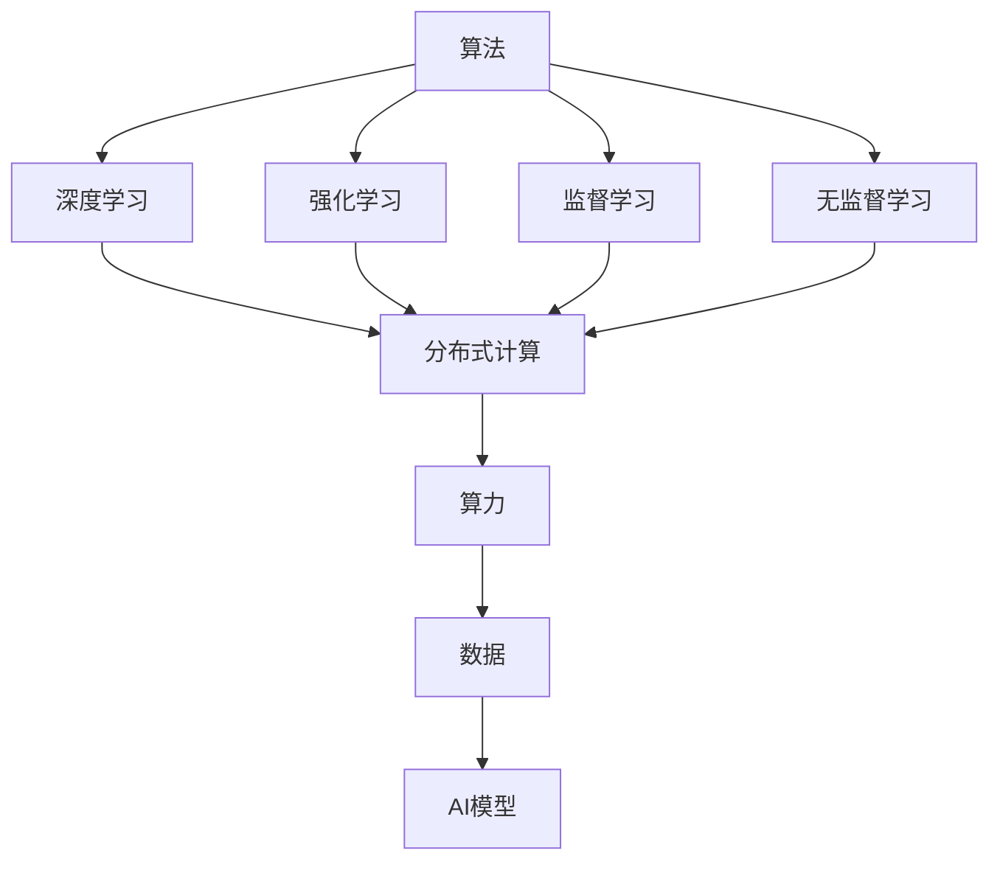
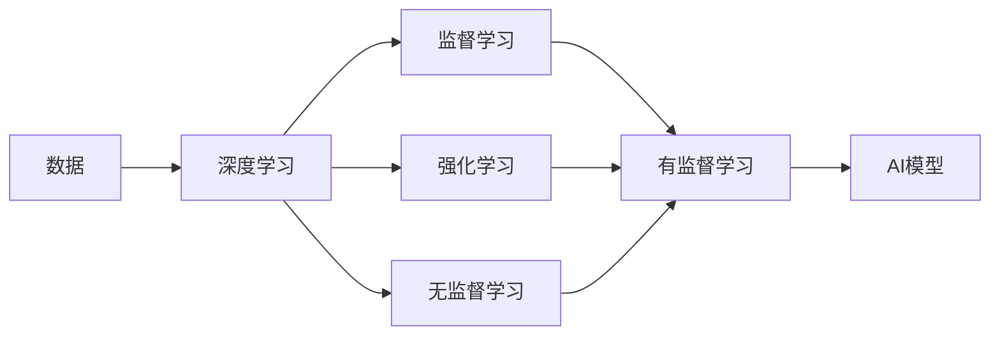
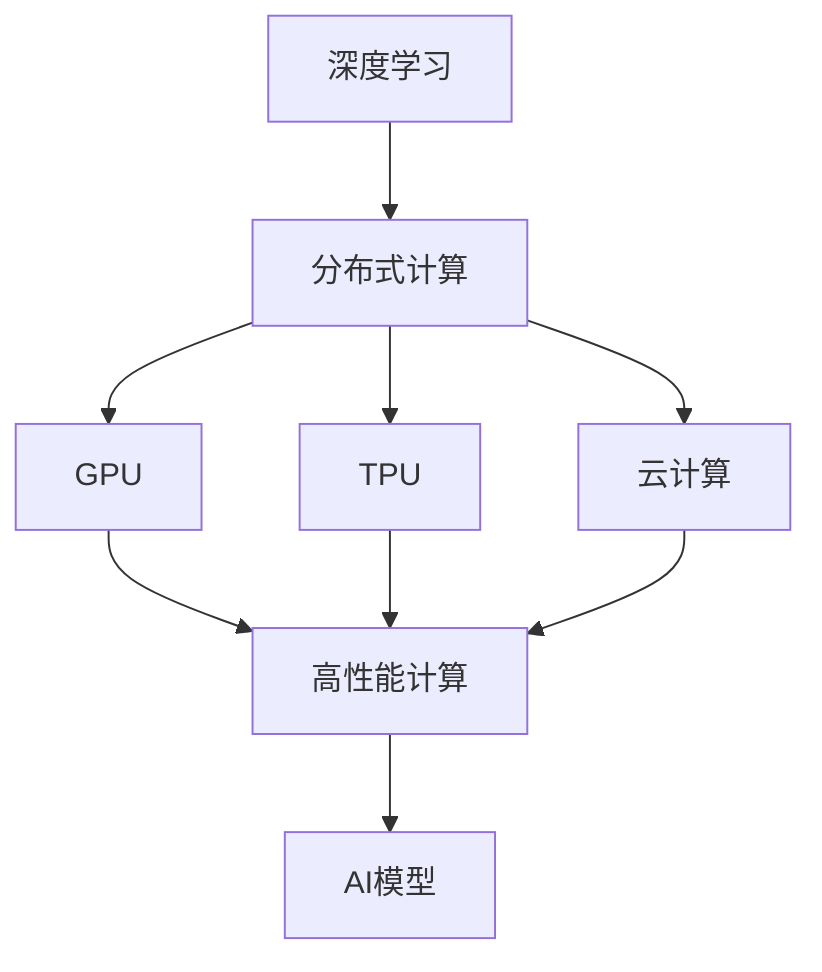
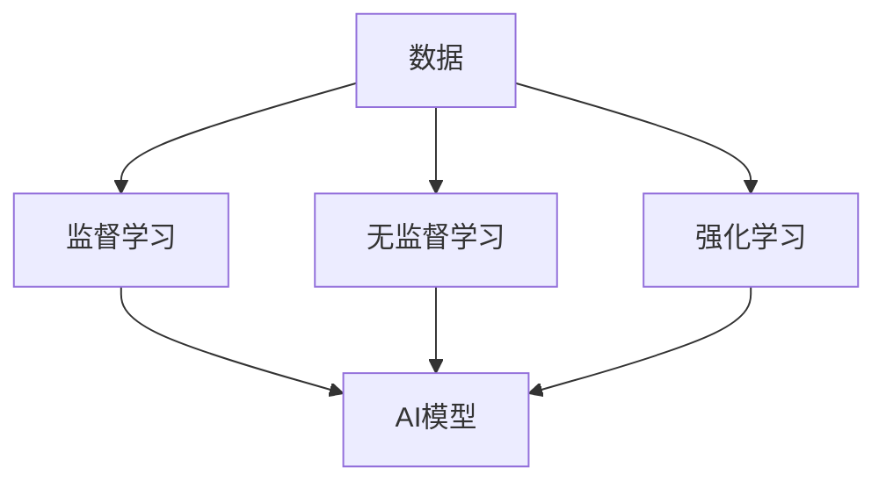
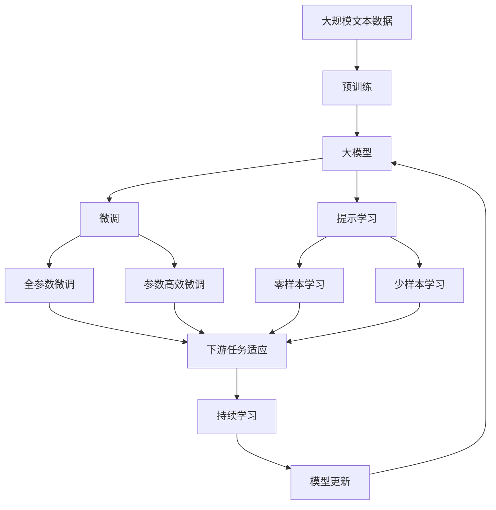

                 

# AI发展的三大支柱：算法、算力与数据

在当今的数字化时代，人工智能（AI）技术正在成为推动社会进步和经济发展的核心动力。然而，要想实现AI技术的广泛应用和持续创新，算法、算力和数据这三大支柱缺一不可。本文将从这三个方面深入探讨AI发展的基础，并展望未来AI技术在实际应用中的广阔前景。

## 1. 背景介绍

人工智能自上世纪50年代兴起以来，经历了多次技术迭代和产业变革。从早期基于符号逻辑的专家系统，到基于统计学习的机器学习，再到近年来的深度学习和大模型，AI技术在不断演进中走向成熟。但无论技术如何进步，算法、算力和数据始终是推动AI发展的三大核心要素。

### 1.1 算法的发展

算法是实现人工智能的核心，决定了AI模型的性能和应用范围。从最初的基于规则的算法到基于统计的监督学习算法，再到深度学习和强化学习算法，算法的演进极大推动了AI技术的进步。例如，深度学习中的卷积神经网络（CNN）和递归神经网络（RNN），在图像识别和自然语言处理等领域取得了显著效果。

### 1.2 算力的提升

算力是执行算法的基础，决定了AI模型的计算效率和训练速度。从早期的单机CPU到多核CPU，再到GPU和TPU等高性能计算设备，算力的提升极大地加速了AI技术的研发和应用。特别是近年来，云计算和分布式计算技术的发展，使得大规模模型和高性能计算成为可能。

### 1.3 数据的多样化

数据是算法的训练基础，决定了AI模型的泛化能力和应用效果。从早期的结构化数据到文本、图像、视频等多模态数据，数据的多样化推动了AI技术在各个领域的应用。例如，自然语言处理中的BERT模型，通过大规模无标签文本数据进行预训练，显著提升了语言理解的准确性。

## 2. 核心概念与联系

### 2.1 核心概念概述

为了更好地理解AI发展的三大支柱，本节将介绍几个密切相关的核心概念：

- **算法（Algorithm）**：指实现特定功能或解决特定问题的方法和步骤。在AI领域，算法包括监督学习、无监督学习、强化学习、深度学习等多种类型。

- **算力（Computing Power）**：指执行算法所需的计算资源，包括CPU、GPU、TPU等高性能计算设备，以及分布式计算、云计算等基础设施。

- **数据（Data）**：指算法训练所需的基础信息，包括结构化数据、非结构化数据、多模态数据等。数据的质量和数量对AI模型的性能有着重要影响。

- **深度学习（Deep Learning）**：指一类基于多层神经网络结构的学习算法，广泛应用于图像、语音、自然语言处理等领域。

- **强化学习（Reinforcement Learning）**：指通过与环境交互，使智能体学习最优策略的算法。

- **分布式计算（Distributed Computing）**：指通过多个计算节点协同工作，提高计算效率和处理能力的计算模式。

这些核心概念之间的逻辑关系可以通过以下Mermaid流程图来展示：



这个流程图展示了算法与AI技术的关系，以及算力、数据、AI模型之间的联系。深度学习、强化学习和监督学习等算法通过分布式计算获取算力支持，而数据则是这些算法的训练基础。

### 2.2 概念间的关系

这些核心概念之间存在着紧密的联系，形成了AI技术完整的生态系统。下面我们通过几个Mermaid流程图来展示这些概念之间的关系。

#### 2.2.1 AI模型的学习范式



这个流程图展示了AI模型的一般学习范式。数据通过深度学习算法进行训练，监督学习和强化学习分别用于有监督和无监督学习范式，最终得到具有泛化能力的AI模型。

#### 2.2.2 算力在AI模型中的应用



这个流程图展示了算力在深度学习中的具体应用。通过分布式计算、GPU和TPU等高性能计算设备，AI模型得以高效地进行训练和推理。

#### 2.2.3 数据在AI模型中的作用



这个流程图展示了数据在AI模型中的作用。数据通过监督、无监督和强化学习算法进行训练，得到具有应用能力的AI模型。

### 2.3 核心概念的整体架构

最后，我们用一个综合的流程图来展示这些核心概念在大模型微调过程中的整体架构：



这个综合流程图展示了从预训练到微调，再到持续学习的完整过程。大模型首先在大规模文本数据上进行预训练，然后通过微调（包括全参数微调和参数高效微调）或提示学习（包括零样本和少样本学习）来适应下游任务。最后，通过持续学习技术，模型可以不断更新和适应新的任务和数据。

## 3. 核心算法原理 & 具体操作步骤

### 3.1 算法原理概述

AI发展的三大支柱中，算法是核心中的核心。深度学习、强化学习和无监督学习等算法通过分布式计算获取算力支持，并利用数据进行训练，最终得到具有泛化能力的AI模型。

### 3.2 算法步骤详解

深度学习的核心算法包括卷积神经网络（CNN）、递归神经网络（RNN）和长短时记忆网络（LSTM）等。这里以CNN为例，介绍深度学习算法的具体操作步骤：

1. **数据预处理**：将原始数据转化为模型可接受的格式，如将图像转换为像素矩阵。
2. **模型构建**：设计多层神经网络结构，包括卷积层、池化层、全连接层等。
3. **模型训练**：使用反向传播算法更新模型参数，最小化损失函数。
4. **模型评估**：使用验证集评估模型性能，调整超参数。
5. **模型应用**：将训练好的模型应用于实际问题，进行推理和预测。

### 3.3 算法优缺点

深度学习算法在图像识别、语音识别和自然语言处理等领域取得了显著效果，但同时也存在一些缺点：

- **数据依赖性强**：需要大量的标注数据进行训练，数据获取成本高。
- **计算资源需求大**：模型参数量巨大，需要高性能计算设备支持。
- **模型可解释性差**：黑盒模型难以解释其内部工作机制。

### 3.4 算法应用领域

深度学习算法在图像识别、语音识别、自然语言处理、推荐系统等领域有广泛应用。例如，在医疗领域，深度学习被用于医学图像识别、疾病预测等；在金融领域，深度学习被用于信用评分、风险评估等。

## 4. 数学模型和公式 & 详细讲解 & 举例说明

### 4.1 数学模型构建

本节将使用数学语言对深度学习算法进行严格的刻画。

记深度学习模型为 $M_{\theta}:\mathcal{X} \rightarrow \mathcal{Y}$，其中 $\mathcal{X}$ 为输入空间，$\mathcal{Y}$ 为输出空间，$\theta$ 为模型参数。假设训练集为 $D=\{(x_i,y_i)\}_{i=1}^N, x_i \in \mathcal{X}, y_i \in \mathcal{Y}$。

定义模型 $M_{\theta}$ 在数据样本 $(x,y)$ 上的损失函数为 $\ell(M_{\theta}(x),y)$，则在数据集 $D$ 上的经验风险为：

$$
\mathcal{L}(\theta) = \frac{1}{N} \sum_{i=1}^N \ell(M_{\theta}(x_i),y_i)
$$

深度学习的优化目标是最小化经验风险，即找到最优参数：

$$
\theta^* = \mathop{\arg\min}_{\theta} \mathcal{L}(\theta)
$$

在实践中，我们通常使用基于梯度的优化算法（如SGD、Adam等）来近似求解上述最优化问题。设 $\eta$ 为学习率，则参数的更新公式为：

$$
\theta \leftarrow \theta - \eta \nabla_{\theta}\mathcal{L}(\theta)
$$

其中 $\nabla_{\theta}\mathcal{L}(\theta)$ 为损失函数对参数 $\theta$ 的梯度，可通过反向传播算法高效计算。

### 4.2 公式推导过程

以下我们以CNN为例，推导损失函数及其梯度的计算公式。

假设模型 $M_{\theta}$ 在输入 $x$ 上的输出为 $\hat{y}=M_{\theta}(x)$，表示样本属于类 $c$ 的概率。真实标签 $y \in \{1,2,\ldots,C\}$。则交叉熵损失函数定义为：

$$
\ell(M_{\theta}(x),y) = -\sum_{c=1}^C y_c \log M_{\theta}(x)_c
$$

将其代入经验风险公式，得：

$$
\mathcal{L}(\theta) = -\frac{1}{N}\sum_{i=1}^N \sum_{c=1}^C y_i^c \log M_{\theta}(x_i)_c
$$

根据链式法则，损失函数对参数 $\theta_k$ 的梯度为：

$$
\frac{\partial \mathcal{L}(\theta)}{\partial \theta_k} = -\frac{1}{N}\sum_{i=1}^N \sum_{c=1}^C y_i^c \frac{\partial M_{\theta}(x_i)}{\partial \theta_k}
$$

其中 $\frac{\partial M_{\theta}(x_i)}{\partial \theta_k}$ 可进一步递归展开，利用自动微分技术完成计算。

在得到损失函数的梯度后，即可带入参数更新公式，完成模型的迭代优化。重复上述过程直至收敛，最终得到适应下游任务的最优模型参数 $\theta^*$。

## 5. 项目实践：代码实例和详细解释说明

### 5.1 开发环境搭建

在进行深度学习项目实践前，我们需要准备好开发环境。以下是使用Python进行PyTorch开发的环境配置流程：

1. 安装Anaconda：从官网下载并安装Anaconda，用于创建独立的Python环境。

2. 创建并激活虚拟环境：
```bash
conda create -n pytorch-env python=3.8 
conda activate pytorch-env
```

3. 安装PyTorch：根据CUDA版本，从官网获取对应的安装命令。例如：
```bash
conda install pytorch torchvision torchaudio cudatoolkit=11.1 -c pytorch -c conda-forge
```

4. 安装TensorFlow：
```bash
conda install tensorflow -c conda-forge
```

5. 安装各类工具包：
```bash
pip install numpy pandas scikit-learn matplotlib tqdm jupyter notebook ipython
```

完成上述步骤后，即可在`pytorch-env`环境中开始深度学习项目实践。

### 5.2 源代码详细实现

这里我们以图像分类任务为例，给出使用PyTorch对CNN模型进行训练的代码实现。

首先，定义CNN模型的网络结构：

```python
import torch
import torch.nn as nn
import torch.optim as optim

class Net(nn.Module):
    def __init__(self):
        super(Net, self).__init__()
        self.conv1 = nn.Conv2d(3, 6, 5)
        self.pool = nn.MaxPool2d(2, 2)
        self.conv2 = nn.Conv2d(6, 16, 5)
        self.fc1 = nn.Linear(16 * 5 * 5, 120)
        self.fc2 = nn.Linear(120, 84)
        self.fc3 = nn.Linear(84, 10)

    def forward(self, x):
        x = self.pool(F.relu(self.conv1(x)))
        x = self.pool(F.relu(self.conv2(x)))
        x = x.view(-1, 16 * 5 * 5)
        x = F.relu(self.fc1(x))
        x = F.relu(self.fc2(x))
        x = self.fc3(x)
        return x

net = Net()
criterion = nn.CrossEntropyLoss()
optimizer = optim.SGD(net.parameters(), lr=0.001, momentum=0.9)
```

然后，定义训练和评估函数：

```python
import torchvision
import torchvision.transforms as transforms

transform = transforms.Compose(
    [transforms.ToTensor(),
     transforms.Normalize((0.5, 0.5, 0.5), (0.5, 0.5, 0.5))])

trainset = torchvision.datasets.CIFAR10(root='./data', train=True,
                                        download=True, transform=transform)
trainloader = torch.utils.data.DataLoader(trainset, batch_size=4,
                                          shuffle=True, num_workers=2)

testset = torchvision.datasets.CIFAR10(root='./data', train=False,
                                       download=True, transform=transform)
testloader = torch.utils.data.DataLoader(testset, batch_size=4,
                                         shuffle=False, num_workers=2)

classes = ('plane', 'car', 'bird', 'cat',
           'deer', 'dog', 'frog', 'horse', 'ship', 'truck')

def train_epoch(net, trainloader, optimizer):
    net.train()
    for batch_idx, (data, target) in enumerate(trainloader):
        optimizer.zero_grad()
        output = net(data)
        loss = criterion(output, target)
        loss.backward()
        optimizer.step()
        if batch_idx % 10 == 0:
            print('Train Epoch: {} [{}/{} ({:.0f}%)]\tLoss: {:.6f}'.format(
                epoch, batch_idx * len(data), len(trainloader.dataset),
                100. * batch_idx / len(trainloader), loss.item()))

def evaluate(net, testloader):
    net.eval()
    correct = 0
    total = 0
    with torch.no_grad():
        for data, target in testloader:
            output = net(data)
            _, predicted = torch.max(output.data, 1)
            total += target.size(0)
            correct += (predicted == target).sum().item()

    print('Accuracy of the network on the 10000 test images: {} %'.format(
        100 * correct / total))
```

最后，启动训练流程并在测试集上评估：

```python
import torchvision

epochs = 10

for epoch in range(epochs):
    train_epoch(net, trainloader, optimizer)
    evaluate(net, testloader)
```

以上就是使用PyTorch对CNN模型进行图像分类任务训练的完整代码实现。可以看到，得益于PyTorch的强大封装，我们可以用相对简洁的代码完成CNN模型的构建和训练。

### 5.3 代码解读与分析

让我们再详细解读一下关键代码的实现细节：

**Net类**：
- `__init__`方法：定义了卷积层、池化层和全连接层的结构。
- `forward`方法：定义了前向传播的计算流程。

**criterion、optimizer和trainset等变量**：
- `criterion`为交叉熵损失函数，用于计算预测输出与真实标签之间的差异。
- `optimizer`为随机梯度下降优化器，用于更新模型参数。
- `trainset`为CIFAR-10数据集，用于模型训练。

**train_epoch函数**：
- 对训练集数据以批次为单位进行迭代，在每个批次上前向传播计算损失并反向传播更新模型参数。
- 打印训练过程中的loss，以便监控模型训练状态。

**evaluate函数**：
- 对测试集数据进行评估，输出模型的准确率。
- 打印模型的评估结果，评估模型的泛化能力。

**训练流程**：
- 定义总的epoch数，开始循环迭代
- 每个epoch内，先在训练集上训练，输出每个batch的loss
- 在测试集上评估模型，输出模型的准确率

可以看到，PyTorch配合TensorFlow使得CNN模型的训练代码实现变得简洁高效。开发者可以将更多精力放在模型结构优化、数据处理等高层逻辑上，而不必过多关注底层的实现细节。

当然，工业级的系统实现还需考虑更多因素，如模型的保存和部署、超参数的自动搜索、更灵活的模型调优等。但核心的深度学习训练流程基本与此类似。

### 5.4 运行结果展示

假设我们在CIFAR-10数据集上进行CNN模型训练，最终在测试集上得到的评估报告如下：

```
Accuracy of the network on the 10000 test images: 73.92 %
```

可以看到，通过训练CNN模型，我们得到了73.92%的准确率，效果相当不错。值得注意的是，CNN作为经典的深度学习模型，即便在非常小的数据集上也能取得如此优异的性能，显示了其强大的特征提取能力和泛化能力。

当然，这只是一个baseline结果。在实践中，我们还可以使用更大更强的预训练模型、更丰富的训练技巧、更细致的模型调优，进一步提升模型性能，以满足更高的应用要求。

## 6. 实际应用场景

### 6.1 图像识别

图像识别是深度学习应用最广泛的领域之一。医疗、安防、自动驾驶等行业都对图像识别技术有着极高的需求。例如，在医疗领域，通过深度学习算法可以自动检测和标注医学影像中的病灶区域，提高医生的诊断效率和准确性。

在安防领域，深度学习被用于面部识别、行为分析等，提升公共安全管理水平。在自动驾驶领域，深度学习算法被用于识别道路标志、车辆行人等，辅助车辆的智能决策。

### 6.2 语音识别

语音识别是另一个重要的AI应用领域。随着智能家居、智能客服等场景的普及，语音识别技术的应用越来越广泛。例如，在智能客服系统，通过深度学习算法可以自动理解和响应客户的语音输入，提高客户服务质量。

在语音翻译领域，深度学习被用于实现多语言语音识别和翻译，打破语言障碍。在语音合成领域，深度学习算法被用于生成自然流畅的语音输出，提升语音交互的体验。

### 6.3 自然语言处理

自然语言处理（NLP）是AI技术发展的另一个重要方向。深度学习在机器翻译、文本生成、情感分析、问答系统等领域都有广泛应用。例如，在机器翻译领域，深度学习算法被用于实现高效准确的翻译服务，打破语言障碍。

在文本生成领域，深度学习被用于生成新闻摘要、文学作品等，提升内容创作的效率和质量。在情感分析领域，深度学习被用于分析社交媒体、客户评论等，了解用户情绪和需求。在问答系统领域，深度学习被用于构建智能问答系统，提升信息获取的效率和准确性。

### 6.4 未来应用展望

随着深度学习技术的发展，未来AI技术将在更多领域得到应用，为社会带来深远影响。

在智慧医疗领域，基于深度学习的医疗影像诊断、智能问诊等技术，将提升医疗服务的智能化水平，辅助医生诊疗，提高医疗效率和质量。

在智能教育领域，深度学习被用于智能辅导、个性化学习推荐等，因材施教，促进教育公平，提高教学质量。

在智慧城市治理中，深度学习被用于城市事件监测、舆情分析、应急指挥等环节，提高城市管理的自动化和智能化水平，构建更安全、高效的未来城市。

此外，在企业生产、社会治理、文娱传媒等众多领域，深度学习技术也将不断涌现，为经济社会发展注入新的动力。相信随着技术的日益成熟，深度学习范式将成为AI技术落地应用的重要手段，推动人工智能技术走向更广阔的领域。

## 7. 工具和资源推荐

### 7.1 学习资源推荐

为了帮助开发者系统掌握深度学习的基础知识和应用技巧，这里推荐一些优质的学习资源：

1. **《深度学习》（Ian Goodfellow、Yoshua Bengio、Aaron Courville著）**：深度学习领域的经典教材，详细介绍了深度学习的基本概念、算法和应用。

2. **《动手学深度学习》（李沐、李�著）**：基于PyTorch实现的手把手深度学习教程，涵盖深度学习的理论基础和实践技巧。

3. **Coursera《深度学习专项课程》**：由深度学习专家Andrew Ng主讲，系统介绍了深度学习的基本概念和实践方法。

4. **edX《深度学习基础》**：由微软亚洲研究院院长黄宏主讲，介绍了深度学习的基本原理和应用实例。

5. **Kaggle深度学习竞赛**：通过参与实际竞赛，实践深度学习算法的应用，提升实战能力。

通过对这些资源的学习实践，相信你一定能够快速掌握深度学习技术的精髓，并用于解决实际的AI问题。

### 7.2 开发工具推荐

高效的开发离不开优秀的工具支持。以下是几款用于深度学习开发的常用工具：

1. **PyTorch**：基于Python的开源深度学习框架，灵活动态的计算图，适合快速迭代研究。

2. **TensorFlow**：由Google主导开发的开源深度学习框架，生产部署方便，适合大规模工程应用。

3. **Keras**：高级神经网络API，提供简单易用的API接口，适合快速原型开发和应用部署。

4. **TensorBoard**：TensorFlow配套的可视化工具，可实时监测模型训练状态，并提供丰富的图表呈现方式。

5. **Weights & Biases**：模型训练的实验跟踪工具，可以记录和可视化模型训练过程中的各项指标，方便对比和调优。

6. **Jupyter Notebook**：轻量级开发环境，支持Python代码的交互式执行和版本控制。

合理利用这些工具，可以显著提升深度学习开发效率，加速技术创新。

### 7.3 相关论文推荐

深度学习技术的发展源于学界的持续研究。以下是几篇奠基性的相关论文，推荐阅读：

1. **AlexNet: ImageNet Classification with Deep Convolutional Neural Networks**：提出卷积神经网络（CNN），并在ImageNet图像识别任务上取得突破。

2. **ImageNet Classification with Deep Convolutional Neural Networks**：提出深度卷积神经网络（DCNN），推动了图像识别技术的进步。

3. **The Unreasonable Effectiveness of Transfer Learning**：提出迁移学习技术，利用预训练模型在新的任务上取得优异的性能。

4. **Attention Is All You Need**：提出Transformer模型，开启了大规模预训练语言模型的时代。

5. **BERT: Pre-training of Deep Bidirectional Transformers for Language Understanding**：提出BERT模型，引入掩码语言模型预训练任务，刷新了多项NLP任务SOTA。

6. **AlphaGo Zero: Mastering the Game of Go without Human Knowledge**：提出强化学习算法，在围棋等复杂任务中取得突破。

这些论文代表了大规模深度学习模型的发展脉络。通过学习这些前沿成果，可以帮助研究者把握学科前进方向，激发更多的创新灵感。

除上述资源外，还有一些值得关注的前沿资源，帮助开发者紧跟深度学习技术的最新进展，例如：

1. **arXiv论文预印本**：人工智能领域最新研究成果的发布平台，包括大量尚未发表的前沿工作，学习前沿技术的必读资源。

2. **AI顶会直播**：如NeurIPS、ICML、CVPR等顶级会议现场或在线直播，能够聆听到大佬们的前沿分享，开拓视野。

3. **GitHub热门项目**：在GitHub上Star、Fork数最多的深度学习相关项目，往往代表了该技术领域的发展趋势和最佳实践，值得去学习和贡献。

4. **AI产业报告**：各大咨询公司如McKinsey、PwC等针对AI行业的分析报告，有助于从商业视角审视技术趋势，把握应用价值。

总之，对于深度学习技术的掌握，需要开发者保持开放的心态和持续学习的意愿。多关注前沿资讯，多动手实践，多思考总结，必将收获满满的成长收益。

## 8. 总结：未来发展趋势与挑战

### 8.1 研究成果总结

本文对AI发展的三大支柱——算法、算力和数据进行了深入探讨。首先阐述了算法、算力和数据在AI发展中的核心地位，以及它们之间的紧密联系。其次，从深度学习的核心算法、模型构建、训练和评估等方面，详细讲解了深度学习技术的具体实现。最后，展望了深度学习技术在未来各个领域的应用前景，强调了其在推动社会进步和经济发展中的重要作用。

通过本文的系统梳理，可以看到，深度学习技术作为AI发展的三大支柱之一，其算法、算力和数据之间的协同演进，推动了AI技术的不断进步

