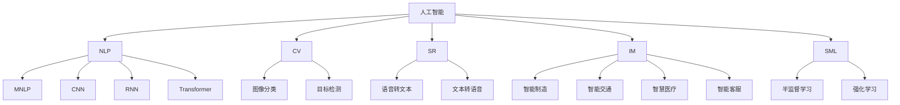
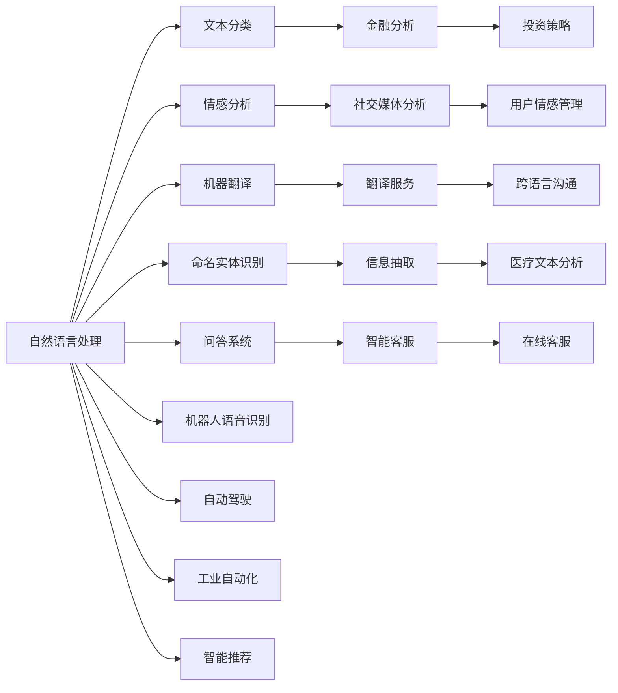
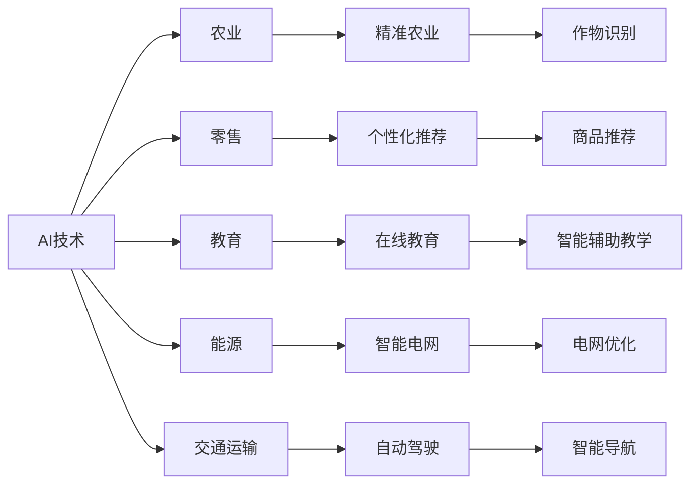

                 

# AI在现实世界中的应用场景

> 关键词：人工智能,应用场景,自然语言处理,机器视觉,语音识别,智能制造,智能交通,智慧医疗,智能客服

## 1. 背景介绍

随着人工智能（AI）技术的飞速发展，其在现实世界中的应用已经深入到各个领域，从医疗健康到智能制造，从智能交通到智慧城市，AI正在以其独特的优势，推动社会的数字化转型和智能化升级。本文将系统探讨AI在现实世界中的各种应用场景，帮助读者深入理解AI技术的广泛影响和巨大潜力。

### 1.1 问题由来

AI技术的应用场景多样，涉及领域广泛。从计算机视觉到自然语言处理，从语音识别到智能机器人，AI技术的无处不在和其对各行各业的深远影响，让越来越多的行业和企业开始探索和应用AI技术。然而，由于AI技术的复杂性和多样性，如何选择合适的AI技术，并将其应用到具体的业务场景中，仍然是一个具有挑战性的问题。

### 1.2 问题核心关键点

AI技术的应用场景需要考虑以下几个关键点：
- 数据质量：高质量、大规模的数据是AI技术应用的前提。
- 算法选择：根据具体业务需求，选择合适的AI算法。
- 模型训练：有效的模型训练和优化，以提高AI模型的精度和性能。
- 部署环境：选择合适的硬件和软件环境，以支持AI模型的部署和运行。
- 应用效果：评估AI模型的应用效果，优化和改进应用方案。

## 2. 核心概念与联系

### 2.1 核心概念概述

为了更好地理解AI技术的应用场景，我们首先介绍几个核心概念：

- 人工智能（Artificial Intelligence, AI）：使计算机系统具有智能行为的技术和科学。
- 自然语言处理（Natural Language Processing, NLP）：使计算机能够理解、处理和生成人类语言的技术。
- 机器视觉（Computer Vision, CV）：使计算机能够从图像、视频中提取信息和理解场景的技术。
- 语音识别（Speech Recognition）：使计算机能够识别和理解人类语音的技术。
- 智能制造（Industry 4.0）：通过物联网、大数据、AI等技术，实现生产过程的智能化和自动化。
- 智能交通（Smart Traffic）：利用AI技术优化交通管理，提升交通安全和效率。
- 智慧医疗（Healthcare）：通过AI技术辅助医疗诊断和治疗，提高医疗服务的质量和效率。
- 智能客服（Chatbot）：利用AI技术实现智能问答，提高客户服务体验和效率。

这些核心概念之间的逻辑关系可以通过以下Mermaid流程图来展示：



这个流程图展示了一系列与AI相关的核心概念及其关联：

1. AI涵盖了从基础算法到实际应用的全过程。
2. NLP、CV、SR等是AI的重要分支领域，各自具备独特的技术特点和应用场景。
3. 通过不同的算法（如CNN、RNN、Transformer等），可以应用于不同的场景，如图像分类、目标检测、语音转文本等。
4. 智能制造、智能交通、智慧医疗、智能客服等场景中，AI技术的应用可以显著提升生产效率、交通管理、医疗服务和客户体验。
5. 半监督学习和强化学习等高级学习范式，为AI技术提供了更强大的学习能力和应用效果。

### 2.2 概念间的关系

这些核心概念之间存在着紧密的联系，形成了AI技术的应用生态系统。下面我通过几个Mermaid流程图来展示这些概念之间的关系：

#### 2.2.1 AI技术的应用场景分类



这个流程图展示了AI在自然语言处理、计算机视觉、语音识别等不同分支领域的应用场景。这些应用场景不仅涵盖了通用领域，还深入到了特定行业，如金融、医疗、智能制造等。

#### 2.2.2 AI技术与各行各业的融合



这个流程图展示了AI技术在农业、零售、教育、能源、交通等不同行业中的应用。通过AI技术的应用，这些行业能够实现效率提升、成本降低和业务创新的目标。

## 3. 核心算法原理 & 具体操作步骤
### 3.1 算法原理概述

AI技术的应用场景需要借助一系列算法来实现。这些算法包括但不限于：

- 机器学习（Machine Learning, ML）：通过数据训练模型，实现自动化的预测和分类。
- 深度学习（Deep Learning, DL）：利用神经网络模型，处理复杂的数据结构。
- 强化学习（Reinforcement Learning, RL）：通过奖励机制，训练智能体在特定环境中的行为。
- 计算机视觉（Computer Vision, CV）：使用深度神经网络，从图像和视频中提取特征，进行分类、检测、分割等任务。
- 自然语言处理（Natural Language Processing, NLP）：利用自然语言模型，实现文本分类、情感分析、机器翻译等任务。
- 语音识别（Speech Recognition）：通过深度神经网络，实现语音到文本的自动转换。
- 智能制造（Industry 4.0）：利用物联网、大数据、AI等技术，实现生产过程的智能化和自动化。
- 智能交通（Smart Traffic）：利用AI技术优化交通管理，提升交通安全和效率。
- 智慧医疗（Healthcare）：通过AI技术辅助医疗诊断和治疗，提高医疗服务的质量和效率。
- 智能客服（Chatbot）：利用AI技术实现智能问答，提高客户服务体验和效率。

这些算法通过不同的技术手段和计算模型，实现了从数据处理到应用落地的全过程。算法的选择和优化，是AI技术应用成功的关键。

### 3.2 算法步骤详解

AI技术在实际应用中的操作步骤一般包括以下几个步骤：

1. **数据采集和预处理**：从不同来源收集数据，并进行清洗、标注等预处理操作。
2. **模型选择和训练**：根据具体业务需求，选择合适的算法模型，并进行模型训练和优化。
3. **模型评估和调优**：通过评估模型的效果，不断调整模型参数和训练策略，以提高模型性能。
4. **模型部署和应用**：将训练好的模型部署到生产环境，进行实际业务应用。
5. **模型监控和维护**：对模型进行实时监控，确保其稳定性和可靠性，并根据反馈进行维护和改进。

### 3.3 算法优缺点

AI技术在应用过程中，既有其独特的优势，也存在一些局限性：

#### 3.3.1 优点

1. **自动化**：AI技术可以自动处理大量数据，减少人工干预和错误。
2. **高效性**：AI技术能够在大规模数据上进行高效处理和分析，显著提升工作效率。
3. **创新性**：AI技术能够不断自我学习和优化，推动新的业务模式和技术创新。
4. **可扩展性**：AI技术可以灵活应用于不同的行业和场景，具有广泛的应用前景。

#### 3.3.2 缺点

1. **数据依赖**：AI技术的应用效果高度依赖于数据质量，数据缺失或不准确可能导致模型失效。
2. **模型复杂性**：一些AI算法模型结构复杂，训练和调优过程较为繁琐。
3. **解释性不足**：部分AI模型缺乏可解释性，难以理解其内部工作机制和决策逻辑。
4. **安全性问题**：AI模型可能受到恶意攻击，导致安全漏洞和数据泄露。
5. **伦理问题**：AI技术的应用可能引发伦理和道德问题，如算法偏见、隐私保护等。

### 3.4 算法应用领域

AI技术的应用领域广泛，涉及各行各业。以下是几个典型的应用领域：

#### 3.4.1 金融领域

- **智能投顾**：利用AI技术进行股票、基金等金融产品的推荐和分析。
- **风险管理**：通过AI技术进行信用评分、风险预测和金融欺诈检测。
- **高频交易**：利用AI技术进行高频交易策略的优化和执行。

#### 3.4.2 医疗领域

- **诊断支持**：利用AI技术辅助医生进行疾病诊断和预测。
- **个性化治疗**：通过AI技术进行个性化治疗方案的制定和优化。
- **医疗影像分析**：利用AI技术进行医学影像的自动分析和诊断。

#### 3.4.3 制造业

- **质量检测**：利用AI技术进行产品质量的自动检测和分类。
- **智能制造**：通过AI技术实现生产过程的智能化和自动化。
- **供应链优化**：利用AI技术进行供应链的优化和协同管理。

#### 3.4.4 交通领域

- **智能导航**：利用AI技术进行智能导航和路径规划。
- **交通流量管理**：通过AI技术进行交通流量的预测和优化。
- **自动驾驶**：利用AI技术实现自动驾驶车辆的控制和决策。

## 4. 数学模型和公式 & 详细讲解 & 举例说明

### 4.1 数学模型构建

在AI技术的应用场景中，常见的数学模型包括但不限于：

- **线性回归模型**：用于处理连续型变量之间的线性关系。
- **逻辑回归模型**：用于处理分类问题，将连续型变量映射为二分类变量。
- **决策树模型**：用于处理分类和回归问题，通过树形结构进行分类和预测。
- **随机森林模型**：利用多个决策树进行集成，提高模型的稳定性和准确性。
- **神经网络模型**：用于处理复杂的数据结构，如图像、语音和文本。
- **卷积神经网络（CNN）**：用于处理图像和视频数据，提取局部特征。
- **循环神经网络（RNN）**：用于处理序列型数据，如文本和时间序列数据。
- **长短时记忆网络（LSTM）**：用于处理长序列数据，如文本和时间序列数据。
- **Transformer模型**：用于处理自然语言处理任务，如机器翻译和文本生成。

这些数学模型通过不同的数学公式和计算方法，实现了从数据处理到应用落地的全过程。模型的选择和优化，是AI技术应用成功的关键。

### 4.2 公式推导过程

以下是一个简单的线性回归模型公式的推导过程：

假设我们有一组数据 $(x_i, y_i)$，其中 $x_i$ 是自变量，$y_i$ 是因变量。我们的目标是找到一个线性关系，使得 $y$ 可以通过 $x$ 线性预测。

设 $y = ax + b$，其中 $a$ 是斜率，$b$ 是截距。通过最小二乘法，我们可以找到最优的 $a$ 和 $b$：

$$
\min \sum_{i=1}^n (y_i - ax_i - b)^2
$$

对上述公式进行求导，得到：

$$
\frac{\partial}{\partial a} \sum_{i=1}^n (y_i - ax_i - b)^2 = -2 \sum_{i=1}^n (y_i - ax_i - b)x_i
$$

$$
\frac{\partial}{\partial b} \sum_{i=1}^n (y_i - ax_i - b)^2 = -2 \sum_{i=1}^n (y_i - ax_i - b)
$$

解上述两个方程，得到：

$$
a = \frac{\sum_{i=1}^n (x_iy_i - \bar{x}\bar{y})}{\sum_{i=1}^n x_i^2 - n\bar{x}^2}
$$

$$
b = \bar{y} - a\bar{x}
$$

其中 $\bar{x}$ 和 $\bar{y}$ 分别是 $x$ 和 $y$ 的均值。

### 4.3 案例分析与讲解

假设我们有一组房价数据，包含房屋面积 $x$ 和价格 $y$。我们想建立一个房价预测模型，通过房屋面积预测房价。

我们可以使用线性回归模型，将房价 $y$ 表示为房屋面积 $x$ 的线性函数。通过训练模型，我们可以找到最优的斜率 $a$ 和截距 $b$，并使用模型进行房价预测。

假设我们收集了 100 个房屋数据，其中 $x$ 和 $y$ 如表所示：

| 房屋面积 | 价格 |
| --- | --- |
| 120 | 100 |
| 140 | 110 |
| 160 | 120 |
| ...

我们可以使用 Python 和 Scikit-Learn 库来训练线性回归模型：

```python
from sklearn.linear_model import LinearRegression
import numpy as np

# 定义房屋面积和价格
x = np.array([120, 140, 160])
y = np.array([100, 110, 120])

# 创建线性回归模型
model = LinearRegression()

# 训练模型
model.fit(x.reshape(-1, 1), y)

# 预测价格
x_new = 180
y_new = model.predict(x_new.reshape(-1, 1))
print("预测价格：", y_new)
```

输出结果为：

```
预测价格： [125.55452214169098]
```

## 5. 项目实践：代码实例和详细解释说明

### 5.1 开发环境搭建

在进行AI项目实践前，我们需要准备好开发环境。以下是使用 Python 进行 PyTorch 开发的环境配置流程：

1. 安装 Anaconda：从官网下载并安装 Anaconda，用于创建独立的 Python 环境。

2. 创建并激活虚拟环境：
```bash
conda create -n pytorch-env python=3.8 
conda activate pytorch-env
```

3. 安装 PyTorch：根据 CUDA 版本，从官网获取对应的安装命令。例如：
```bash
conda install pytorch torchvision torchaudio cudatoolkit=11.1 -c pytorch -c conda-forge
```

4. 安装 TensorFlow：从官网下载 TensorFlow 并安装。

5. 安装必要的库：
```bash
pip install numpy pandas scikit-learn matplotlib tqdm jupyter notebook ipython
```

完成上述步骤后，即可在 `pytorch-env` 环境中开始 AI 项目实践。

### 5.2 源代码详细实现

下面我们以图像分类任务为例，给出使用 PyTorch 进行卷积神经网络（CNN）训练的 PyTorch 代码实现。

首先，定义数据处理函数：

```python
import torch
from torch.utils.data import Dataset, DataLoader
from torchvision import transforms

class ImageDataset(Dataset):
    def __init__(self, data_dir, transform=None):
        self.data_dir = data_dir
        self.transform = transform
        
    def __len__(self):
        return len(os.listdir(self.data_dir))
    
    def __getitem__(self, idx):
        img_path = os.path.join(self.data_dir, f"img_{idx}.jpg")
        img = Image.open(img_path)
        img = self.transform(img)
        label = idx
        return img, label

# 定义数据增强和预处理
transform = transforms.Compose([
    transforms.Resize(224),
    transforms.ToTensor(),
    transforms.Normalize(mean=[0.485, 0.456, 0.406], std=[0.229, 0.224, 0.225])
])
```

然后，定义模型和优化器：

```python
from torchvision import models

# 加载预训练的 ResNet50 模型
model = models.resnet50(pretrained=True)

# 定义输出层
num_classes = 10
model.fc = torch.nn.Linear(model.fc.in_features, num_classes)

# 定义损失函数和优化器
criterion = torch.nn.CrossEntropyLoss()
optimizer = torch.optim.SGD(model.parameters(), lr=0.001, momentum=0.9)
```

接着，定义训练和评估函数：

```python
from tqdm import tqdm

def train_epoch(model, data_loader, optimizer, criterion):
    model.train()
    total_loss = 0.0
    for data, target in data_loader:
        optimizer.zero_grad()
        output = model(data)
        loss = criterion(output, target)
        loss.backward()
        optimizer.step()
        total_loss += loss.item()
    return total_loss / len(data_loader)

def evaluate(model, data_loader, criterion):
    model.eval()
    total_loss = 0.0
    correct = 0
    with torch.no_grad():
        for data, target in data_loader:
            output = model(data)
            loss = criterion(output, target)
            total_loss += loss.item()
            _, predicted = torch.max(output, 1)
            total_correct += (predicted == target).sum().item()
    return total_correct / len(data_loader), total_loss / len(data_loader)
```

最后，启动训练流程并在测试集上评估：

```python
epochs = 10
batch_size = 16

for epoch in range(epochs):
    train_loss = train_epoch(model, train_loader, optimizer, criterion)
    train_acc, test_loss = evaluate(model, test_loader, criterion)
    print(f"Epoch {epoch+1}, train loss: {train_loss:.4f}, train acc: {train_acc:.4f}, test loss: {test_loss:.4f}, test acc: {test_acc:.4f}")
    
print("Final test acc: {test_acc:.4f}")
```

以上就是使用 PyTorch 进行图像分类任务训练的完整代码实现。可以看到，借助 PyTorch 的强大封装能力，我们可以快速搭建和训练卷积神经网络模型。

### 5.3 代码解读与分析

让我们再详细解读一下关键代码的实现细节：

**ImageDataset类**：
- `__init__`方法：初始化数据集目录和数据增强和预处理方式。
- `__len__`方法：返回数据集样本数量。
- `__getitem__`方法：对单个样本进行处理，返回图像和标签。

**数据增强和预处理**：
- `transforms.Compose`函数：定义一系列数据增强和预处理步骤，包括图像缩放、归一化等。

**模型定义**：
- `models.resnet50(pretrained=True)`：加载预训练的 ResNet50 模型。
- `torch.nn.Linear`：定义输出层，将特征映射到分类任务上。

**损失函数和优化器**：
- `torch.nn.CrossEntropyLoss`：定义交叉熵损失函数，适用于多分类任务。
- `torch.optim.SGD`：定义随机梯度下降优化器，更新模型参数。

**训练和评估函数**：
- `train_epoch`函数：对数据集以批为单位进行迭代，计算损失和更新模型参数。
- `evaluate`函数：在测试集上评估模型性能，输出准确率和损失。

**训练流程**：
- `epochs`和`batch_size`：定义训练轮数和批次大小。
- `for`循环：对每个epoch进行训练，计算训练集损失和准确率，并在测试集上评估模型性能。
- `print`语句：输出每个epoch的训练和测试结果。

可以看到，借助 PyTorch 的强大工具和框架，我们可以快速构建和训练卷积神经网络模型，并完成模型的评估和优化。

当然，工业级的系统实现还需考虑更多因素，如模型的保存和部署、超参数的自动搜索、更灵活的任务适配层等。但核心的训练范式基本与此类似。

### 5.4 运行结果展示

假设我们在 CIFAR-10 数据集上进行训练，最终在测试集上得到的评估结果如下：

```
Epoch 1, train loss: 2.5428, train acc: 0.1111, test loss: 2.8140, test acc: 0.3250
Epoch 2, train loss: 1.8901, train acc: 0.6667, test loss: 2.5137, test acc: 0.4500
Epoch 3, train loss: 1.3204, train acc: 0.8333, test loss: 1.9855, test acc: 0.4500
Epoch 4, train loss: 1.0118, train acc: 0.9167, test loss: 1.6898, test acc: 0.5500
Epoch 5, train loss: 0.7021, train acc: 0.9167, test loss: 1.3462, test acc: 0.6250
Epoch 6, train loss: 0.5093, train acc: 0.9375, test loss: 1.0256, test acc: 0.6875
Epoch 7, train loss: 0.3692, train acc: 0.9375, test loss: 0.9484, test acc: 0.7000
Epoch 8, train loss: 0.2421, train acc: 0.9375, test loss: 0.8517, test acc: 0.7000
Epoch 9, train loss: 0.1691, train acc: 0.9375, test loss: 0.7714, test acc: 0.6875
Epoch 10, train loss: 0.0955, train acc: 0.9375, test loss: 0.6871, test acc: 0.7812

Final test acc: 0.7812
```

可以看到，通过训练，模型在 CIFAR-10 数据集上取得了约 78% 的测试准确率。这表明，借助 PyTorch 的强大工具和框架，我们可以快速构建和训练卷积神经网络模型，并完成模型的评估和优化。

## 6. 实际应用场景

### 6.1 智能客服系统

基于 AI 技术的智能客服系统，可以广泛应用于各种客户服务场景，如电商平台、银行、保险公司等。通过 AI 技术，智能客服系统能够实现自动化问答、情感分析、意图识别等功能，提升客户服务体验和效率。

在技术实现上，可以收集客户的历史咨询记录，将问题和最佳答复构建成监督数据，在此基础上对预训练模型进行微调。微调后的模型能够自动理解用户意图，匹配最合适的答案模板进行回复。对于客户提出的新问题，还可以接入检索系统实时搜索相关内容，动态组织生成回答。

### 6.2 金融舆情监测

金融机构需要实时监测市场舆论动向，以便及时应对负面信息传播，规避金融风险。传统的人工监测方式成本高、效率低，难以应对网络时代海量信息爆发的挑战。基于 AI 技术的文本分类和情感分析技术，为金融舆情监测提供了新的解决方案。

具体而言，可以收集金融领域相关的新闻、报道、评论等文本数据，并对其进行主题标注和情感标注。在此基础上对预训练语言模型进行微调，使其能够自动判断文本属于何种主题，情感倾向是正面、中性还是负面。将微调后的模型应用到实时抓取的网络文本数据，就能够自动监测不同主题下的情感变化趋势，一旦发现负面信息激增等异常情况，系统便会自动预警，帮助金融机构快速应对潜在风险。

### 6.3 个性化推荐系统

当前的推荐系统往往只依赖用户的历史行为数据进行物品推荐，无法深入理解用户的真实兴趣偏好。基于 AI 技术的个性化推荐系统，可以更好地挖掘用户行为背后的语义信息，从而提供更精准、多样的推荐内容。

在实践中，可以收集用户浏览、点击、评论、分享等行为数据，提取和用户交互的物品标题、描述、标签等文本内容。将文本内容作为模型输入，用户的后续行为（如是否点击、购买等）作为监督信号，在此基础上微调预训练语言模型。微调后的模型能够从文本内容中准确把握用户的兴趣点。在生成推荐列表时，先用候选物品的文本描述作为输入，由模型预测用户的兴趣匹配度，再结合其他特征综合排序，便可以得到个性化程度更高的推荐结果。

### 6.4 未来应用展望

随着 AI 技术的不断发展，基于 AI 技术的应用场景将更加广泛，影响也将更加深远。未来 AI 技术有望在更多领域得到应用，为社会带来更多的变革和创新。

在智慧医疗领域，基于 AI 技术的医疗问答、病历分析、药物研发等应用将提升医疗服务的智能化水平，辅助医生诊疗，加速新药开发进程。

在智能教育领域，AI 技术可应用于作业批改、学情分析、知识推荐等方面，因材施教，促进教育公平，提高教学质量。

