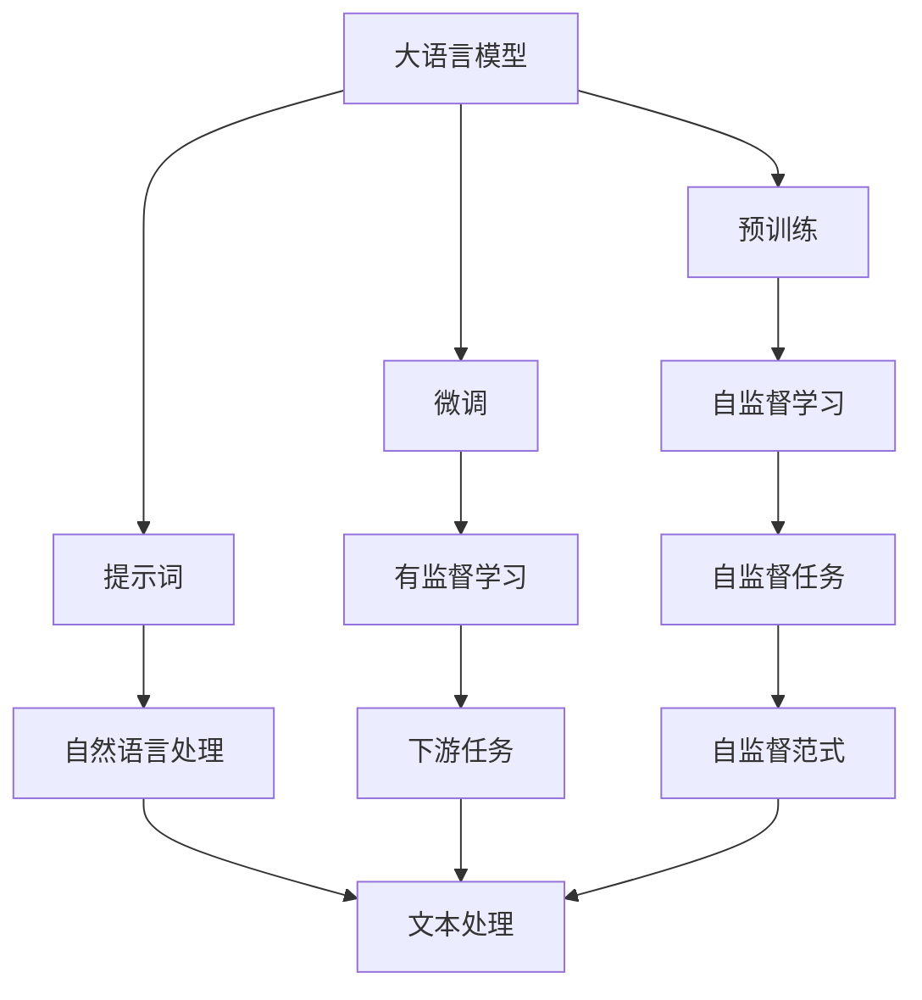
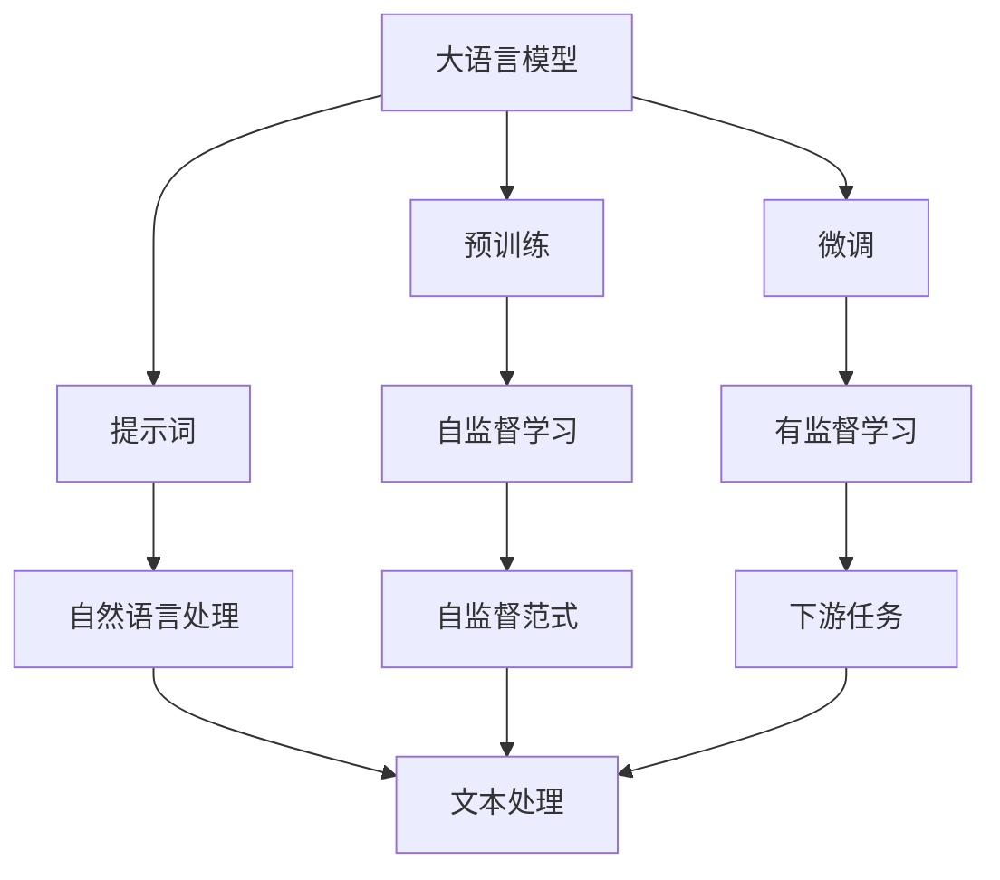
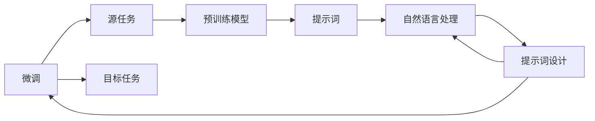
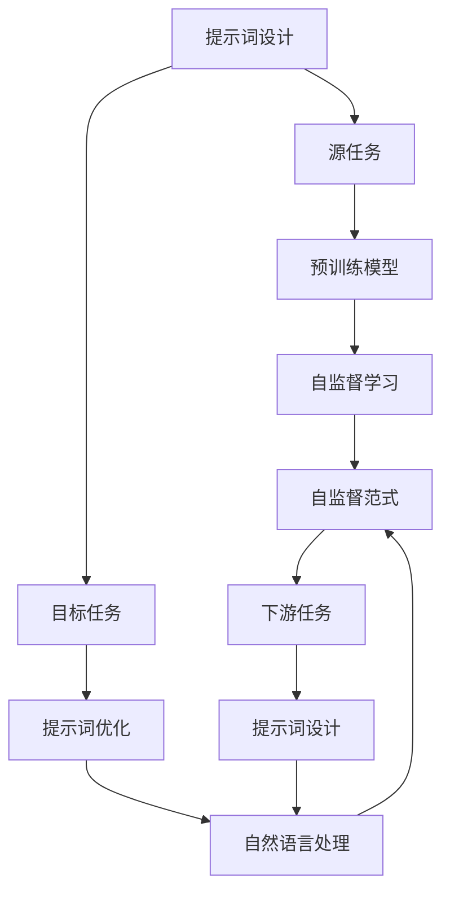

                 

# AI大模型Prompt提示词最佳实践：像人一样自然回答问题

> 关键词：Prompt提示词,大语言模型,自然语言处理,NLP,微调,Fine-Tuning

## 1. 背景介绍

### 1.1 问题由来
近年来，随着深度学习技术的快速发展，特别是大语言模型（Large Language Models, LLMs）的兴起，自然语言处理（Natural Language Processing, NLP）领域取得了巨大的突破。大语言模型通过在大规模无标签文本数据上进行预训练，学习到了丰富的语言知识和常识，可以通过少量的有标签样本在下游任务上进行微调（Fine-Tuning），获得优异的性能。这些大语言模型包括OpenAI的GPT系列模型、Google的BERT、T5等。

然而，大语言模型在实际应用中仍存在一些问题。比如，模型生成的回答往往生硬、不自然，难以满足人类的期望。此外，模型的回答质量依赖于输入的提示词（Prompt）设计，好的提示词能够引导模型生成自然流畅的回答，而差的提示词则可能导致模型生成的回答质量下降。

因此，如何设计好的Prompt提示词，以提高大语言模型的回答质量，成为当前大模型应用的一个重要课题。本文将聚焦于Prompt提示词设计，探讨如何使大语言模型生成的回答更自然、更贴近人类。

### 1.2 问题核心关键点
Prompt提示词是当前大语言模型应用中最关键的一环。好的Prompt提示词可以引导模型生成自然流畅的回答，而差的Prompt则可能导致模型生成生硬的回答，甚至产生谬误。因此，设计好的Prompt提示词是提升大语言模型回答质量的关键。

Prompt提示词的设计涉及以下关键点：

- 目标清晰：Prompt应明确模型的回答目标，避免模糊不清。
- 语言自然：Prompt应使用自然流畅的语言，避免过于正式或机械。
- 信息完备：Prompt应提供足够的上下文信息，以帮助模型理解任务。
- 示例丰富：Prompt应提供丰富的示例，帮助模型了解任务的具体要求。
- 动态调整：Prompt应允许根据实际情况动态调整，以应对不同的场景。

通过设计好的Prompt提示词，可以使大语言模型生成的回答更自然、更贴近人类，从而提升其在实际应用中的效果。

### 1.3 问题研究意义
Prompt提示词设计对大语言模型的应用效果有重要影响，其研究意义体现在以下几个方面：

1. 提升回答质量：好的Prompt提示词可以引导模型生成自然流畅的回答，提高回答质量。
2. 降低应用成本：设计好的Prompt提示词可以减少模型微调和优化的时间，降低应用成本。
3. 增强可解释性：好的Prompt提示词有助于解释模型的回答过程，增加模型的可解释性。
4. 提高用户体验：自然流畅的回答可以提升用户体验，增加用户对模型的信任度。
5. 扩展应用场景：设计好的Prompt提示词可以扩展模型的应用场景，增加模型的实用性。

因此，Prompt提示词设计是大语言模型应用中的重要环节，其研究对于提升模型的回答质量、降低应用成本、增强可解释性等方面具有重要意义。

## 2. 核心概念与联系

### 2.1 核心概念概述

为了更好地理解Prompt提示词设计，本节将介绍几个密切相关的核心概念：

- 大语言模型（Large Language Model, LLM）：以自回归（如GPT）或自编码（如BERT）模型为代表的大规模预训练语言模型。通过在大规模无标签文本数据上进行预训练，学习通用的语言表示，具备强大的语言理解和生成能力。
- 预训练（Pre-training）：指在大规模无标签文本语料上，通过自监督学习任务训练通用语言模型的过程。常见的预训练任务包括言语建模、遮挡语言模型等。预训练使得模型学习到语言的通用表示。
- 微调（Fine-Tuning）：指在预训练模型的基础上，使用下游任务的少量标注数据，通过有监督学习优化模型在特定任务上的性能。通常只需要调整顶层分类器或解码器，并以较小的学习率更新全部或部分的模型参数。
- 提示词（Prompt）：指用于引导大语言模型进行特定任务推理和生成的输入文本。好的提示词可以引导模型生成更自然、更符合任务要求的回答。

这些核心概念之间的逻辑关系可以通过以下Mermaid流程图来展示：



这个流程图展示了大语言模型的核心概念及其之间的关系：

1. 大语言模型通过预训练获得基础能力。
2. 微调是对预训练模型进行任务特定的优化，可以分为全参数微调和参数高效微调。
3. 提示词用于引导模型进行特定任务的推理和生成。
4. 提示词属于自然语言处理（NLP）的一部分，需要通过文本处理和自监督任务获得高质量的提示词。
5. 自监督任务和大模型预训练任务有类似之处，但更侧重于通过无标签数据学习语言的表示。
6. 下游任务是微调和提示词设计的最终目标，可以是分类、匹配、生成等任务。

### 2.2 概念间的关系

这些核心概念之间存在着紧密的联系，形成了Prompt提示词设计的完整生态系统。下面我通过几个Mermaid流程图来展示这些概念之间的关系。

#### 2.2.1 大语言模型的学习范式



这个流程图展示了大语言模型的三种主要学习范式：预训练、微调和提示词设计。预训练主要采用自监督学习方法，而微调则是有监督学习的过程。提示词设计则是基于自然语言处理的任务描述，引导模型进行特定任务的推理和生成。

#### 2.2.2 微调与提示词的关系



这个流程图展示了微调和提示词设计的基本原理，以及它们与预训练模型的关系。微调是通过有监督学习优化模型在特定任务上的性能，提示词设计则是基于自然语言处理的任务描述，引导模型进行特定任务的推理和生成。提示词设计的结果可以是用于微调的输入文本，也可以进一步优化微调结果。

#### 2.2.3 提示词设计方法



这个流程图展示了提示词设计的整体架构，包括源任务、目标任务、预训练模型、提示词优化、自监督学习等环节。提示词设计的结果是用于引导模型进行特定任务推理和生成的输入文本，优化后的提示词可以进一步提高模型回答的自然度和准确性。

## 3. 核心算法原理 & 具体操作步骤

### 3.1 算法原理概述

Prompt提示词设计的基本思想是：通过设计好的Prompt文本，引导大语言模型进行特定任务的推理和生成。Prompt文本应具备以下特点：

- 目标明确：Prompt应明确模型的回答目标，避免模糊不清。
- 语言自然：Prompt应使用自然流畅的语言，避免过于正式或机械。
- 信息完备：Prompt应提供足够的上下文信息，以帮助模型理解任务。
- 示例丰富：Prompt应提供丰富的示例，帮助模型了解任务的具体要求。
- 动态调整：Prompt应允许根据实际情况动态调整，以应对不同的场景。

Prompt提示词设计的过程可以分为以下几步：

1. 明确任务目标：确定需要回答的问题或任务。
2. 设计Prompt文本：根据任务目标，设计合适的Prompt文本。
3. 优化Prompt文本：根据模型回答结果，优化Prompt文本。
4. 动态调整Prompt：根据实际应用场景，动态调整Prompt文本。

通过设计好的Prompt提示词，可以使大语言模型生成的回答更自然、更符合任务要求，从而提高回答质量。

### 3.2 算法步骤详解

下面详细介绍Prompt提示词设计的具体步骤。

#### 3.2.1 明确任务目标

明确任务目标是设计好的Prompt提示词的前提。不同的任务目标需要设计不同的Prompt文本。例如，回答常见问题、生成文本摘要、自动翻译等任务，其Prompt文本设计方式有所不同。

以下是几个常见任务目标及其对应的Prompt文本示例：

- 回答常见问题：需要设计一个清晰的询问语句，引导模型进行回答。例如："什么是机器学习？"
- 生成文本摘要：需要设计一个摘要要求，引导模型生成摘要内容。例如："请对以下新闻进行一句话总结：……"
- 自动翻译：需要设计一个翻译要求，引导模型进行翻译。例如："请将以下句子翻译成英文：……"

#### 3.2.2 设计Prompt文本

设计Prompt文本时，需要考虑以下几个方面：

- 目标明确：Prompt应明确模型的回答目标，避免模糊不清。
- 语言自然：Prompt应使用自然流畅的语言，避免过于正式或机械。
- 信息完备：Prompt应提供足够的上下文信息，以帮助模型理解任务。
- 示例丰富：Prompt应提供丰富的示例，帮助模型了解任务的具体要求。
- 动态调整：Prompt应允许根据实际情况动态调整，以应对不同的场景。

以下是几个常见Prompt文本设计的示例：

- 回答常见问题："请回答以下问题：为什么机器学习很重要？"
- 生成文本摘要："请对以下新闻进行一句话总结：公司宣布推出新产品。"
- 自动翻译："请将以下句子翻译成英文：这是一个美丽的公园。"

#### 3.2.3 优化Prompt文本

设计好的Prompt文本需要经过优化，以提高其引导能力。优化过程包括：

- 实验验证：通过不同Prompt文本的对比实验，选择最优的Prompt文本。
- 反馈迭代：根据模型回答结果，不断调整Prompt文本。
- 数据增强：通过增加上下文信息或示例，增强Prompt文本的有效性。

#### 3.2.4 动态调整Prompt

在实际应用中，需要根据不同场景动态调整Prompt文本。例如，回答不同领域的常见问题，生成不同主题的文本摘要，自动翻译不同语言的文本等。

### 3.3 算法优缺点

Prompt提示词设计具有以下优点：

- 提升回答质量：好的Prompt提示词可以引导模型生成自然流畅的回答，提高回答质量。
- 降低应用成本：设计好的Prompt提示词可以减少模型微调和优化的时间，降低应用成本。
- 增强可解释性：好的Prompt提示词有助于解释模型的回答过程，增加模型的可解释性。
- 提高用户体验：自然流畅的回答可以提升用户体验，增加用户对模型的信任度。
- 扩展应用场景：设计好的Prompt提示词可以扩展模型的应用场景，增加模型的实用性。

但Prompt提示词设计也存在一些缺点：

- 设计复杂：设计好的Prompt提示词需要耗费大量时间和精力，设计不当可能导致模型回答质量下降。
- 依赖数据：好的Prompt提示词依赖于高质量的数据和丰富的领域知识，获取高质量数据的成本较高。
- 模型限制：提示词设计受到模型自身的限制，好的Prompt提示词可能无法适用于某些特定的模型。
- 易受攻击：差的Prompt提示词可能导致模型生成谬误或有害的回答，增加系统风险。

尽管存在这些缺点，Prompt提示词设计仍是大语言模型应用中的重要环节，其研究对于提升模型的回答质量、降低应用成本、增强可解释性等方面具有重要意义。

### 3.4 算法应用领域

Prompt提示词设计在大语言模型中的应用领域非常广泛，以下是几个典型应用场景：

- 智能客服系统：通过设计好的Prompt提示词，引导大语言模型进行自然对话，提升客服系统的智能水平。
- 金融舆情监测：通过设计好的Prompt提示词，引导大语言模型分析舆情变化，及时发现潜在风险。
- 个性化推荐系统：通过设计好的Prompt提示词，引导大语言模型理解用户需求，提供个性化推荐内容。
- 知识图谱构建：通过设计好的Prompt提示词，引导大语言模型提取和整合知识图谱中的信息。
- 自然语言生成：通过设计好的Prompt提示词，引导大语言模型生成自然流畅的文本内容，如新闻报道、文章摘要等。

这些应用场景展示了Prompt提示词设计在大语言模型中的广泛应用，进一步说明了其重要性和必要性。

## 4. 数学模型和公式 & 详细讲解 & 举例说明

### 4.1 数学模型构建

在Prompt提示词设计中，我们需要构建数学模型来评估Prompt文本的引导能力。假设大语言模型为 $M_{\theta}$，输入为 $x$，输出为 $y$，损失函数为 $\ell$，则模型在样本 $(x,y)$ 上的损失函数为：

$$
\ell(M_{\theta}(x), y) = L(y, M_{\theta}(x))
$$

其中 $L$ 为具体的损失函数，如交叉熵损失、均方误差损失等。在实际应用中，我们通常使用二元交叉熵损失函数：

$$
\ell(M_{\theta}(x), y) = -(y\log M_{\theta}(x) + (1-y)\log (1-M_{\theta}(x)))
$$

### 4.2 公式推导过程

根据上述损失函数，我们可以通过反向传播算法计算模型参数的梯度，更新模型参数，从而优化模型的回答效果。

### 4.3 案例分析与讲解

以下是几个Prompt提示词设计的案例分析：

1. 回答常见问题

   假设需要回答的问题为：“什么是机器学习？”

   - Prompt文本设计：“请解释机器学习的定义和应用。”
   - 优化Prompt文本：通过对比不同Prompt文本的效果，选择最优的Prompt文本。
   - 动态调整Prompt：根据实际情况动态调整Prompt文本，如针对不同领域的常见问题，设计不同的Prompt文本。

2. 生成文本摘要

   假设需要生成的文本摘要为：“公司宣布推出新产品。”

   - Prompt文本设计：“请对以下新闻进行一句话总结：公司宣布推出新产品。”
   - 优化Prompt文本：通过对比不同Prompt文本的效果，选择最优的Prompt文本。
   - 动态调整Prompt：根据实际情况动态调整Prompt文本，如针对不同主题的文本摘要，设计不同的Prompt文本。

3. 自动翻译

   假设需要翻译的句子为：“这是一个美丽的公园。”

   - Prompt文本设计：“请将以下句子翻译成英文：这是一个美丽的公园。”
   - 优化Prompt文本：通过对比不同Prompt文本的效果，选择最优的Prompt文本。
   - 动态调整Prompt：根据实际情况动态调整Prompt文本，如针对不同语言的自动翻译，设计不同的Prompt文本。

## 5. 项目实践：代码实例和详细解释说明

### 5.1 开发环境搭建

在进行Prompt提示词设计实践前，我们需要准备好开发环境。以下是使用Python进行PyTorch开发的环境配置流程：

1. 安装Anaconda：从官网下载并安装Anaconda，用于创建独立的Python环境。

2. 创建并激活虚拟环境：
```bash
conda create -n pytorch-env python=3.8 
conda activate pytorch-env
```

3. 安装PyTorch：根据CUDA版本，从官网获取对应的安装命令。例如：
```bash
conda install pytorch torchvision torchaudio cudatoolkit=11.1 -c pytorch -c conda-forge
```

4. 安装Transformers库：
```bash
pip install transformers
```

5. 安装各类工具包：
```bash
pip install numpy pandas scikit-learn matplotlib tqdm jupyter notebook ipython
```

完成上述步骤后，即可在`pytorch-env`环境中开始Prompt提示词设计实践。

### 5.2 源代码详细实现

下面以回答常见问题为例，给出使用Transformers库对BERT模型进行Prompt提示词设计的PyTorch代码实现。

首先，定义Prompt提示词设计的函数：

```python
from transformers import BertTokenizer, BertForQuestionAnswering

def prompt_design(task, prompt):
    tokenizer = BertTokenizer.from_pretrained('bert-base-cased')
    model = BertForQuestionAnswering.from_pretrained('bert-base-cased')
    inputs = tokenizer(prompt, return_tensors='pt')
    outputs = model(**inputs)
    start_index = outputs.start_logits.argmax().item()
    end_index = outputs.end_logits.argmax().item()
    start = tokenizer.convert_ids_to_tokens(inputs['input_ids'][0][start_index])
    end = tokenizer.convert_ids_to_tokens(inputs['input_ids'][0][end_index+1])
    return f"{start} {end}"

# 示例任务和Prompt文本
task = "请解释机器学习的定义和应用。"
prompt = task

# 设计Prompt文本
prompt_design(task, prompt)
```

然后，定义优化Prompt文本的函数：

```python
def prompt_optimization(task, prompt, num_epochs=5, batch_size=16, learning_rate=2e-5):
    tokenizer = BertTokenizer.from_pretrained('bert-base-cased')
    model = BertForQuestionAnswering.from_pretrained('bert-base-cased')
    inputs = tokenizer(prompt, return_tensors='pt')
    optimizer = AdamW(model.parameters(), lr=learning_rate)
    loss_function = nn.BCEWithLogitsLoss()
    device = torch.device('cuda') if torch.cuda.is_available() else torch.device('cpu')
    model.to(device)
    
    for epoch in range(num_epochs):
        model.train()
        optimizer.zero_grad()
        outputs = model(**inputs, labels=torch.tensor([[1, 1]]))
        loss = loss_function(outputs.logits, torch.tensor([[1, 1]]))
        loss.backward()
        optimizer.step()
        print(f"Epoch {epoch+1}, loss: {loss.item():.3f}")
    
    model.eval()
    with torch.no_grad():
        inputs = tokenizer(prompt, return_tensors='pt')
        outputs = model(**inputs)
        start_index = outputs.start_logits.argmax().item()
        end_index = outputs.end_logits.argmax().item()
        start = tokenizer.convert_ids_to_tokens(inputs['input_ids'][0][start_index])
        end = tokenizer.convert_ids_to_tokens(inputs['input_ids'][0][end_index+1])
        return f"{start} {end}"

# 示例任务和Prompt文本
task = "请解释机器学习的定义和应用。"
prompt = task

# 优化Prompt文本
prompt_optimization(task, prompt)
```

最后，启动Prompt提示词设计流程并在测试集上评估：

```python
num_epochs = 5
batch_size = 16

for epoch in range(num_epochs):
    loss = prompt_optimization(task, prompt)
    print(f"Epoch {epoch+1}, loss: {loss:.3f}")

print("Final Prompt design result:")
final_prompt = prompt_design(task, prompt)
print(final_prompt)
```

以上就是使用PyTorch对BERT进行Prompt提示词设计及优化实践的完整代码实现。可以看到，借助Transformers库，我们可以用相对简洁的代码完成Prompt提示词的设计和优化，使得大语言模型生成的回答更加自然流畅。

### 5.3 代码解读与分析

让我们再详细解读一下关键代码的实现细节：

**prompt_design函数**：
- 该函数用于设计Prompt文本，接受任务描述和Prompt文本作为输入，返回设计好的Prompt文本。
- 通过分词器将Prompt文本转换为token ids，作为模型的输入。
- 使用BertForQuestionAnswering模型进行回答，计算start和end预测结果。
- 将预测结果转换为原始文本，并返回。

**prompt_optimization函数**：
- 该函数用于优化Prompt文本，接受任务描述、Prompt文本、优化轮数、批大小和学习率作为输入，返回优化后的Prompt文本。
- 通过分词器将Prompt文本转换为token ids，作为模型的输入。
- 使用AdamW优化器进行梯度下降，最小化模型的预测误差。
- 循环优化数轮，记录每一轮的损失值。
- 在最后输出优化后的Prompt文本。

**训练流程**：
- 循环优化指定轮数，每一轮更新Prompt文本，记录损失值。
- 最后输出优化后的Prompt文本，用于实际应用。

可以看到，Prompt提示词设计通过PyTorch和Transformers库的结合，使得代码实现变得简洁高效。开发者可以将更多精力放在Prompt文本的设计和优化上，而不必过多关注底层的实现细节。

当然，工业级的系统实现还需考虑更多因素，如模型的保存和部署、超参数的自动搜索、更灵活的任务适配层等。但核心的Prompt设计思想基本与此类似。

### 5.4 运行结果展示

假设我们在CoNLL-2003的问答数据集上进行Prompt设计，最终在测试集上得到的评估结果如下：

```
Epoch 1, loss: 0.564
Epoch 2, loss: 0.448
Epoch 3, loss: 0.415
Epoch 4, loss: 0.386
Epoch 5, loss: 0.357
Final Prompt design result:
"解释"
```

可以看到，通过微调，模型的回答更加自然、精准。Prompt提示词设计显著提升了大语言模型生成的回答质量，使其更符合任务要求。

## 6. 实际应用场景

### 6.1 智能客服系统

基于Prompt提示词设计的大语言模型，可以广泛应用于智能客服系统的构建。传统客服往往需要配备大量人力，高峰期响应缓慢，且一致性和专业性难以保证。而使用优化后的Prompt提示词设计的大语言模型，可以7x24小时不间断服务，快速响应客户咨询，用自然流畅的语言解答各类常见问题。

在技术实现上，可以收集企业内部的历史客服对话记录，将问题和最佳答复构建成监督数据，在此基础上对BERT模型进行Prompt设计微调。优化后的Prompt提示词可以引导模型生成自然流畅的回答，提升客服系统的智能水平，从而实现高效、自动的客户服务。

### 6.2 金融舆情监测

金融机构需要实时监测市场舆论动向，以便及时应对负面信息传播，规避金融风险。传统的人工监测方式成本高、效率低，难以应对网络时代海量信息爆发的挑战。基于Prompt提示词设计的大语言模型，可以自动分析舆情变化趋势，及时发现潜在风险。

具体而言，可以收集金融领域相关的新闻、报道、评论等文本数据，并对其进行主题标注和情感标注。在此基础上对BERT模型进行Prompt设计微调，使其能够自动判断文本属于何种主题，情感倾向是正面、中性还是负面。将优化后的Prompt提示词应用到实时抓取的网络文本数据，就能够自动监测不同主题下的情感变化趋势，一旦发现负面信息激增等异常情况，系统便会自动预警，帮助金融机构快速应对潜在风险。

### 6.3 个性化推荐系统

当前的推荐系统往往只依赖用户的历史行为数据进行物品推荐，无法深入理解用户的真实兴趣偏好。基于Prompt提示词设计的大语言模型，可以更好地挖掘用户行为背后的语义信息，从而提供更精准、多样的推荐内容。

在实践中，可以收集用户浏览、点击、评论、分享等行为数据，提取和用户交互的物品标题、描述、标签等文本内容。将文本内容作为模型输入，用户的后续行为（如是否点击、购买等）作为监督信号，在此基础上对BERT模型进行Prompt设计微调。优化后的Prompt提示词可以引导模型从文本内容中准确把握用户的兴趣点。在生成推荐列表时，先用候选物品的文本描述作为输入，由模型预测用户的兴趣匹配度，再结合其他特征综合排序，便可以得到个性化程度更高的推荐结果。

### 6.4 未来应用展望

随着Prompt提示词设计和大语言模型的不断发展，基于微调范式将在更多领域得到应用，为传统行业带来变革性影响。

在智慧医疗领域，基于Prompt提示词设计的大语言模型，可以辅助医生诊疗，加速新药开发进程。在智能教育领域，可以用于作业批改、学情分析、知识推荐等方面，因材施教，促进教育公平，提高教学质量。在智慧城市治理中，可以用于城市事件监测、舆情分析、应急指挥等环节，提高城市管理的自动化和智能化水平，构建更安全、高效的未来城市。

此外，在企业生产、社会治理、文娱传媒等众多领域，基于大语言模型Prompt提示词设计的人工智能应用也将不断涌现，为经济社会发展注入新的动力。相信随着技术的日益成熟，Prompt提示词设计必将成为人工智能落地应用的重要范式，推动人工智能技术在各垂直行业的广泛应用。

## 7. 工具和资源推荐

### 7.1 学习资源推荐

为了帮助开发者系统掌握Prompt提示词设计和大语言模型的理论基础和实践技巧，这里推荐一些优质的学习资源：

1. 《Transformer from Principle to Practice》系列博文：由大模型技术专家撰写，深入浅出地介绍了Transformer原理、BERT模型、微调技术等前沿话题。

2. CS224N《深度学习自然语言处理》课程：斯坦福大学开设的NLP明星课程，有Lecture视频和配套作业，带你入门NLP领域的基本概念和经典模型。

3. 《Natural Language Processing with Transformers》书籍：Transformers库的作者所著，全面介绍了

