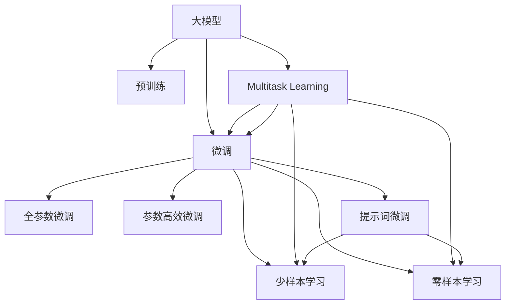
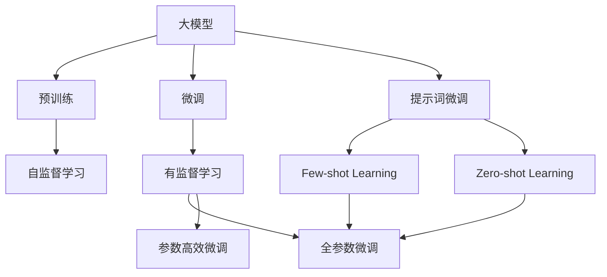
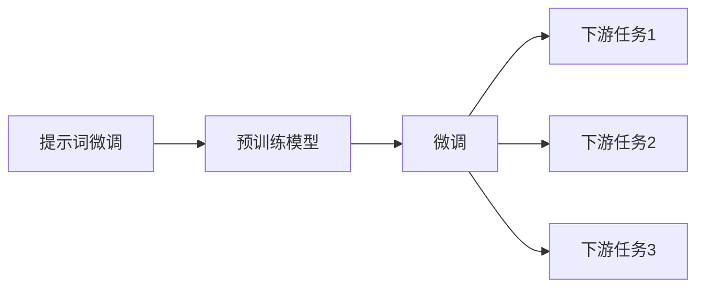
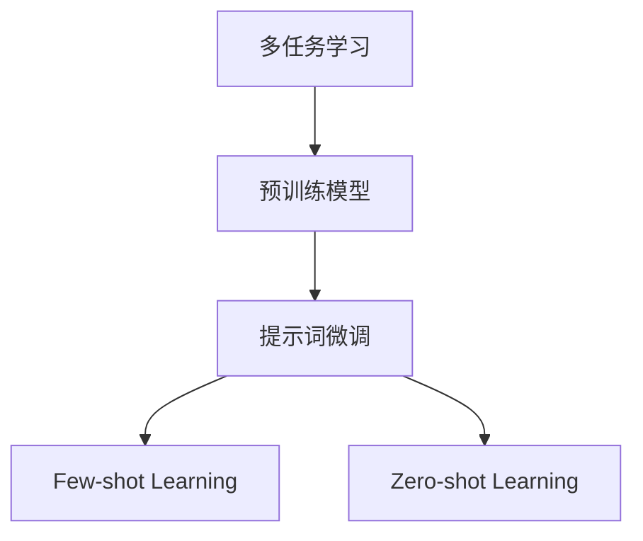
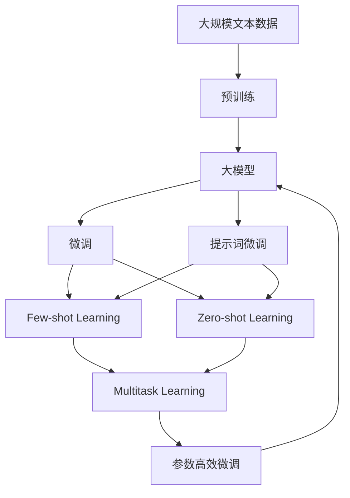

                 

# AI大模型Prompt提示词最佳实践：说明目标受众

> 关键词：Prompt提示词,大模型,目标受众,效果优化,模型适配,高效生成

## 1. 背景介绍

### 1.1 问题由来

在深度学习技术日新月异的今天，预训练语言模型（如GPT-3、BERT等）已经成为了自然语言处理（NLP）领域的强大工具。这些模型通过在大规模无标签文本数据上进行预训练，能够学习到丰富的语言知识和常识，具备强大的语言理解和生成能力。然而，预训练模型通常需要大量的训练数据，且不能直接应用于特定任务，需要通过微调（Fine-tuning）来进行任务适配。

大模型微调的一个主要难点是如何通过少量有标签数据，迅速提升模型在特定任务上的表现。传统微调方法往往需要调整模型全部参数，使得模型在大规模数据上长时间训练，才能达到理想效果。这不仅耗时耗力，还可能导致模型过拟合。

Prompt提示词技术（Prompt-based Learning）作为一种高效快捷的微调方法，近年来受到了广泛关注。通过精心设计的提示词，引导大模型进行特定任务的推理和生成，可以在不增加额外训练数据的情况下，显著提升模型效果。特别是在目标受众多样化的场景中，通过说明具体目标受众，可以进一步优化提示词设计，提高模型的任务适配能力。

### 1.2 问题核心关键点

Prompt提示词技术的应用场景广泛，可以从文本分类、问答系统、自然语言生成等多个角度切入。其核心思想是：通过设计具有特定含义的提示词，指导大模型执行特定的推理和生成任务，减少模型对大量标注数据的依赖，提升模型的少样本学习和跨领域迁移能力。

提示词设计需要考虑以下关键点：

1. **目标任务类型**：提示词应明确指出模型需要完成的任务类型，如分类、生成、问答等。
2. **目标受众特征**：提示词需要考虑目标受众的特点，如年龄、知识背景、文化差异等，以更好地引导模型输出符合受众预期的结果。
3. **数据格式和结构**：提示词应适配目标数据的格式和结构，以使模型能够正确解析输入数据。
4. **提示词多样性**：提示词应具有多样性，以覆盖多种场景和用法，提高模型的泛化能力。

这些关键点共同决定了提示词设计的合理性和效果。通过精心设计的提示词，可以在不增加模型参数的情况下，显著提升模型的任务适配能力。

### 1.3 问题研究意义

提示词技术的应用，对于拓展大模型的应用范围，提升下游任务的性能，加速NLP技术的产业化进程，具有重要意义：

1. **降低应用开发成本**：基于成熟的大模型进行提示词微调，可以显著减少从头开发所需的数据、计算和人力等成本投入。
2. **提升模型效果**：提示词技术使得通用大模型更好地适应特定任务，在应用场景中取得更优表现。
3. **加速开发进度**：standing on the shoulders of giants，提示词技术可以促进对预训练-微调的深入研究，催生了少样本学习和跨领域迁移等新的研究方向。
4. **带来技术创新**：提示词技术的创新应用，如少样本学习、零样本学习、对抗学习等，为NLP技术带来了新的突破。
5. **赋能产业升级**：提示词技术使得NLP技术更容易被各行各业所采用，为传统行业数字化转型升级提供新的技术路径。

## 2. 核心概念与联系

### 2.1 核心概念概述

为更好地理解Prompt提示词在大模型微调中的应用，本节将介绍几个密切相关的核心概念：

- **大模型（Large Model）**：指预训练语言模型，如GPT-3、BERT等，通过在大规模无标签文本语料上进行预训练，学习通用的语言表示，具备强大的语言理解和生成能力。
- **预训练（Pre-training）**：指在大规模无标签文本语料上，通过自监督学习任务训练通用语言模型的过程。常见的预训练任务包括掩码语言模型（Masked Language Model）、自回归语言模型（Auto-Regressive Language Model）等。
- **微调（Fine-tuning）**：指在预训练模型的基础上，使用下游任务的少量标注数据，通过有监督地训练来优化模型在特定任务上的性能。通常只需要调整顶层分类器或解码器，并以较小的学习率更新全部或部分的模型参数。
- **Prompt提示词（Prompt）**：指在输入文本中添加的引导词，用于指示模型执行特定的推理或生成任务。通过精心设计提示词，可以显著提升模型的任务适配能力。
- **少样本学习（Few-shot Learning）**：指在只有少量标注样本的情况下，模型能够快速适应新任务的学习方法。
- **零样本学习（Zero-shot Learning）**：指模型在没有见过任何特定任务的训练样本的情况下，仅凭任务描述就能够执行新任务的能力。
- **多任务学习（Multi-task Learning）**：指在多个任务上共同训练模型，以提高模型在不同任务上的泛化能力。
- **参数高效微调（Parameter-Efficient Fine-tuning）**：指在微调过程中，只更新少量的模型参数，而固定大部分预训练权重不变，以提高微调效率，避免过拟合的方法。
- **迁移学习（Transfer Learning）**：指将一个领域学习到的知识，迁移应用到另一个不同但相关的领域的学习范式。大模型的预训练-微调过程即是一种典型的迁移学习方式。

这些核心概念之间的逻辑关系可以通过以下Mermaid流程图来展示：



这个流程图展示了大模型微调过程中各个核心概念的关系：

1. 大模型通过预训练获得基础能力。
2. 微调是对预训练模型进行任务特定的优化，可以分为全参数微调和参数高效微调两种方式。
3. 提示词技术可以与微调结合，实现少样本学习和零样本学习。
4. 多任务学习使得模型能够同时处理多个任务，提高泛化能力。
5. 迁移学习连接预训练模型与下游任务的桥梁，可以通过微调或提示词技术来实现。

### 2.2 概念间的关系

这些核心概念之间存在着紧密的联系，形成了大模型微调和提示词技术的完整生态系统。下面通过几个Mermaid流程图来展示这些概念之间的关系。

#### 2.2.1 大模型的学习范式



这个流程图展示了大模型的三种主要学习范式：预训练、微调和提示词微调。预训练主要采用自监督学习方法，而微调则是有监督学习的过程。提示词技术可以实现少样本学习和零样本学习，可以在不增加模型参数的情况下，实现快速的模型适配。

#### 2.2.2 提示词技术与微调的关系



这个流程图展示了提示词技术与微调的关系。提示词微调是在预训练模型上，通过设计特定的提示词，引导模型执行下游任务的推理或生成。提示词微调可以进一步提升模型的少样本学习和零样本学习能力。

#### 2.2.3 多任务学习与提示词技术的关系



这个流程图展示了多任务学习与提示词技术的关系。多任务学习可以在多个任务上共同训练模型，提示词技术可以实现少样本学习和零样本学习，进一步提升模型的泛化能力。

### 2.3 核心概念的整体架构

最后，我们用一个综合的流程图来展示这些核心概念在大模型微调过程中的整体架构：



这个综合流程图展示了从预训练到微调，再到提示词微调和少样本/零样本学习的完整过程。大模型首先在大规模文本数据上进行预训练，然后通过微调（包括全参数微调和参数高效微调）或提示词微调（包括少样本学习和零样本学习）来适应下游任务。最后，通过多任务学习技术，模型可以同时处理多个任务，进一步提高泛化能力。

## 3. 核心算法原理 & 具体操作步骤

### 3.1 算法原理概述

Prompt提示词在大模型微调中的应用，本质上是一种基于有监督学习的方法。其核心思想是：通过精心设计的提示词，引导大模型执行特定的推理或生成任务，减少模型对大量标注数据的依赖，提升模型的少样本学习和跨领域迁移能力。

形式化地，假设大模型为 $M_{\theta}$，其中 $\theta$ 为预训练得到的模型参数。给定下游任务 $T$ 的少量标注数据集 $D=\{(x_i, y_i)\}_{i=1}^N, x_i \in \mathcal{X}, y_i \in \mathcal{Y}$。提示词 $P$ 作为输入的一部分，与 $x_i$ 一起输入模型。提示词 $P$ 的设计应具有明确的含义，能够引导模型执行特定的推理或生成任务。

提示词微调的目标是找到最优提示词 $P^*$，使得模型在特定任务 $T$ 上表现最佳：

$$
\hat{P}^*=\mathop{\arg\min}_{P} \mathcal{L}(M_{\theta},P,D)
$$

其中 $\mathcal{L}$ 为针对任务 $T$ 设计的损失函数，用于衡量模型输出与真实标签之间的差异。常见的损失函数包括交叉熵损失、均方误差损失等。

通过梯度下降等优化算法，提示词微调过程不断更新提示词 $P$，最小化损失函数 $\mathcal{L}$，使得模型输出逼近真实标签。由于提示词设计得当，模型能够较快地从预训练权重中提取有用的信息，并应用于特定任务，因此能够在少样本条件下取得不错的效果。

### 3.2 算法步骤详解

基于Prompt提示词的大模型微调一般包括以下几个关键步骤：

**Step 1: 准备预训练模型和数据集**
- 选择合适的预训练语言模型 $M_{\theta}$ 作为初始化参数，如 GPT-3、BERT 等。
- 准备下游任务 $T$ 的少量标注数据集 $D$，划分为训练集、验证集和测试集。一般要求标注数据与预训练数据的分布不要差异过大。

**Step 2: 设计提示词**
- 根据任务类型，设计具有明确含义的提示词 $P$。提示词应能够引导模型执行特定的推理或生成任务，且应具有多样性，覆盖多种场景和用法。
- 在设计提示词时，应考虑目标受众的特点，如年龄、知识背景、文化差异等，以更好地引导模型输出符合受众预期的结果。

**Step 3: 设置微调超参数**
- 选择合适的优化算法及其参数，如 AdamW、SGD 等，设置学习率、批大小、迭代轮数等。
- 设置正则化技术及强度，包括权重衰减、Dropout、Early Stopping 等。
- 确定冻结预训练参数的策略，如仅微调顶层，或全部参数都参与微调。

**Step 4: 执行提示词微调**
- 将训练集数据分批次输入模型，前向传播计算损失函数。
- 将提示词 $P$ 添加到输入中，与 $x_i$ 一起输入模型。
- 反向传播计算提示词 $P$ 的梯度，根据设定的优化算法和学习率更新提示词 $P$。
- 周期性在验证集上评估模型性能，根据性能指标决定是否触发 Early Stopping。
- 重复上述步骤直到满足预设的迭代轮数或 Early Stopping 条件。

**Step 5: 测试和部署**
- 在测试集上评估提示词微调后模型 $M_{\hat{P}}$ 的性能，对比微调前后的精度提升。
- 使用提示词微调后的模型对新样本进行推理预测，集成到实际的应用系统中。
- 持续收集新的数据，定期重新微调模型，以适应数据分布的变化。

以上是基于Prompt提示词的大模型微调的一般流程。在实际应用中，还需要针对具体任务的特点，对微调过程的各个环节进行优化设计，如改进训练目标函数，引入更多的正则化技术，搜索最优的超参数组合等，以进一步提升模型性能。

### 3.3 算法优缺点

基于Prompt提示词的大模型微调方法具有以下优点：

1. **简单高效**：提示词微调通过少量标注数据即可快速适配预训练模型，减少了从头训练所需的时间和计算资源。
2. **通用适用**：提示词技术适用于各种NLP下游任务，设计简单的提示词即可实现微调。
3. **参数高效**：利用参数高效微调技术，在固定大部分预训练参数的情况下，仍可取得不错的提升。
4. **效果显著**：提示词技术已经在问答、对话、摘要、翻译等诸多NLP任务上取得了优异的效果，成为NLP技术落地应用的重要手段。

同时，该方法也存在一定的局限性：

1. **依赖提示词设计**：提示词设计的好坏直接影响微调效果，设计不当可能导致模型性能下降。
2. **泛化能力有限**：当目标任务与预训练数据的分布差异较大时，提示词微调的性能提升有限。
3. **过拟合风险**：提示词微调可能导致模型过拟合，特别是在标注数据不足的情况下。
4. **可解释性不足**：提示词微调模型通常缺乏可解释性，难以对其推理逻辑进行分析和调试。

尽管存在这些局限性，但就目前而言，基于Prompt提示词的微调方法仍是大模型应用的最主流范式。未来相关研究的重点在于如何进一步降低提示词对标注数据的依赖，提高模型的少样本学习和跨领域迁移能力，同时兼顾可解释性和伦理安全性等因素。

### 3.4 算法应用领域

提示词技术的应用场景广泛，涵盖了从文本分类、问答系统、自然语言生成等多个角度。例如：

- **文本分类**：通过设计提示词，引导大模型对文本进行分类，如情感分类、主题分类等。
- **问答系统**：通过设计提示词，引导大模型对自然语言问题给出答案，如机器翻译、代码生成等。
- **摘要生成**：通过设计提示词，引导大模型生成文本摘要，如新闻摘要、文章摘要等。
- **对话系统**：通过设计提示词，引导大模型进行自然对话，如智能客服、聊天机器人等。
- **情感分析**：通过设计提示词，引导大模型对文本进行情感分析，如客户满意度分析、舆情分析等。

除了上述这些经典任务外，提示词技术还被创新性地应用到更多场景中，如可控文本生成、常识推理、代码生成、数据增强等，为NLP技术带来了全新的突破。随着预训练模型和提示词技术的不断进步，相信NLP技术将在更广阔的应用领域大放异彩。

## 4. 数学模型和公式 & 详细讲解  
### 4.1 数学模型构建

本节将使用数学语言对基于Prompt提示词的大模型微调过程进行更加严格的刻画。

记大模型为 $M_{\theta}$，其中 $\theta$ 为预训练得到的模型参数。假设提示词 $P$ 的长度为 $l$，下游任务 $T$ 的训练集为 $D=\{(x_i, y_i)\}_{i=1}^N, x_i \in \mathcal{X}, y_i \in \mathcal{Y}$。

定义模型 $M_{\theta}$ 在输入 $(x,P)$ 上的损失函数为 $\ell(M_{\theta}(x),P,y)$，则在数据集 $D$ 上的经验风险为：

$$
\mathcal{L}(\theta, P) = \frac{1}{N}\sum_{i=1}^N \ell(M_{\theta}(x_i),P,y_i)
$$

提示词微调的目标是最小化经验风险，即找到最优提示词 $P^*$：

$$
\hat{P}^*=\mathop{\arg\min}_{P} \mathcal{L}(M_{\theta},P,D)
$$

在实践中，我们通常使用基于梯度的优化算法（如SGD、Adam等）来近似求解上述最优化问题。设 $\eta$ 为学习率，$\lambda$ 为正则化系数，则提示词 $P$ 的更新公式为：

$$
P \leftarrow P - \eta \nabla_{P}\mathcal{L}(M_{\theta},P,D) - \eta\lambda P
$$

其中 $\nabla_{P}\mathcal{L}(M_{\theta},P,D)$ 为损失函数对提示词 $P$ 的梯度，可通过反向传播算法高效计算。

### 4.2 公式推导过程

以下我们以二分类任务为例，推导交叉熵损失函数及其梯度的计算公式。

假设模型 $M_{\theta}$ 在输入 $(x,P)$ 上的输出为 $\hat{y}=M_{\theta}(x,P)$，表示样本属于正类的概率。真实标签 $y \in \{0,1\}$。则二分类交叉熵损失函数定义为：

$$
\ell(M_{\theta}(x,P),y) = -[y\log \hat{y} + (1-y)\log (1-\hat{y})]
$$

将其代入经验风险公式，得：

$$
\mathcal{L}(\theta, P) = -\frac{1}{N}\sum_{i=1}^N [y_i\log M_{\theta}(x_i,P)+(1-y_i)\log(1-M_{\theta}(x_i,P))]
$$

根据链式法则，损失函数对提示词 $P$ 的梯度为：

$$
\frac{\partial \mathcal{L}(\theta, P)}{\partial P} = -\frac{1}{N}\sum_{i=1}^N (\frac{y_i}{M_{\theta}(x_i,P)}-\frac{1-y_i}{1-M_{\theta}(x_i,P)}) \frac{\partial M_{\theta}(x_i,P)}{\partial P}
$$

其中 $\frac{\partial M_{\theta}(x_i,P)}{\partial P}$ 可进一步递归展开，利用自动微分技术完成计算。

在得到损失函数的梯度后，即可带入提示词更新公式，完成提示词的迭代优化。重复上述过程直至收敛，最终得到适应下游任务的最优提示词 $P^*$。

## 5. 项目实践：代码实例和详细解释说明
### 5.1 开发环境搭建

在进行提示词微调实践前，我们需要准备好开发环境。以下是使用Python进行PyTorch开发的环境配置流程：

1. 安装Anaconda：从官网下载并安装Anaconda，用于创建独立的Python环境。

2. 创建并激活虚拟环境：
```bash
conda create -n pytorch-env python=3.8 
conda activate pytorch-env
```

3. 安装PyTorch：根据CUDA版本，从官网获取对应的安装命令。例如：
```bash
conda install pytorch torchvision torchaudio cudatoolkit=11.1 -c pytorch -c conda-forge
```

4. 安装Transformers库：
```bash
pip install transformers
```

5. 安装各类工具包：
```bash
pip install numpy pandas scikit-learn matplotlib tqdm jupyter notebook ipython
```

完成上述步骤后，即可在`pytorch-env`环境中开始提示词微调实践。

### 5.2 源代码详细实现

这里我们以情感分析（Sentiment Analysis）任务为例，给出使用Transformers库对BERT模型进行提示词微调的PyTorch代码实现。

首先，定义情感分析任务的数据处理函数：

```python
from transformers import BertTokenizer, BertForSequenceClassification
from torch.utils.data import Dataset
import torch

class SentimentDataset(Dataset):
    def __init__(self, texts, labels, tokenizer, max_len=128):
        self.texts = texts
        self.labels = labels
        self.tokenizer = tokenizer
        self.max_len = max_len
        
    def __len__(self):
        return len(self.texts)
    
    def __getitem__(self, item):
        text = self.texts[item]
        label = self.labels[item]
        
        encoding = self.tokenizer(text, return_tensors='pt', max_length=self.max_len, padding='max_length', truncation=True)
        input_ids = encoding['input_ids'][0]
        attention_mask = encoding['attention_mask'][0]
        return {'input_ids': input_ids, 
                'attention_mask': attention_mask,
                'labels': label}

# 创建dataset
tokenizer = BertTokenizer.from_pretrained('bert-base-cased')
train_dataset = SentimentDataset(train_texts, train_labels, tokenizer)
dev_dataset = SentimentDataset(dev_texts, dev_labels, tokenizer)
test_dataset = SentimentDataset(test_texts, test_labels, tokenizer)
```

然后，定义模型和提示词：

```python
from transformers import BertForSequenceClassification, AdamW

model = BertForSequenceClassification.from_pretrained('bert-base-cased', num_labels=2)

prompt = "I think the sentiment of this sentence is: "
```

接着，定义训练和评估函数：

```python
from torch.utils.data import DataLoader
from tqdm import tqdm
from sklearn.metrics import classification_report

device = torch.device('cuda') if torch.cuda.is_available() else torch.device('cpu')
model.to(device)

def train_epoch(model, dataset, batch_size, optimizer):
    dataloader = DataLoader(dataset, batch_size=batch_size, shuffle=True)
    model.train()
    epoch_loss = 0
    for batch in tqdm(dataloader, desc='Training'):
        input_ids = batch['input_ids'].to(device)
        attention_mask = batch['attention_mask'].to(device)
        labels = batch['labels'].to(device)
        model.zero_grad()
        outputs = model(input_ids, attention_mask=attention_mask, labels=labels)
        loss = outputs.loss
        epoch_loss += loss.item()
        loss.backward()
        optimizer.step()
    return epoch_loss / len(dataloader)

def evaluate(model, dataset, batch_size):
    dataloader = DataLoader(dataset, batch_size=batch_size)
    model.eval()
    preds, labels = [], []
    with torch.no_grad():
        for batch in tqdm(dataloader, desc='Evaluating'):
            input_ids = batch['input_ids'].to(device)
            attention_mask = batch['attention_mask'].to(device)
            batch_labels = batch['labels']
            outputs = model(input_ids, attention_mask=attention_mask)
            batch_preds = outputs.logits.argmax(dim=2).to('cpu').tolist()
            batch_labels = batch_labels.to('cpu').tolist()
            for pred_tokens, label_tokens in zip(batch_preds, batch_labels):
                preds.append(pred_tokens[:len(label_tokens)])
                labels.append(label_tokens)
                
    print(classification_report(labels, preds))
```

最后，启动训练流程并在测试集上评估：

```python
epochs = 5
batch_size = 16

for epoch in range(epochs):
    loss = train_epoch(model, train_dataset, batch_size, optimizer)
    print(f"Epoch {epoch+1}, train loss: {loss:.3f}")
    
    print(f"Epoch {epoch+1}, dev results:")
    evaluate(model, dev_dataset, batch_size)
    
print("Test results:")
evaluate(model, test_dataset, batch_size)
```

以上就是使用PyTorch对BERT进行情感分析任务提示词微调的完整代码实现。可以看到，得益于Transformers库的强大封装，我们可以用相对简洁的代码完成BERT模型的加载和提示词微调。

### 5.3 代码解读与分析

让我们再详细解读一下关键代码的实现细节：

**SentimentDataset类**：
- `__init__`方法：初始化文本、标签、分词器等关键组件。
- `__len__`方法：返回数据集的样本数量。
- `__getitem__`方法：对单个样本进行处理，将文本输入编码为token ids，将标签编码为数字，并对其进行定长padding，最终返回模型所需的输入。

**训练和评估函数**：
- 使用PyTorch的DataLoader对数据集进行批次化加载，供模型训练和推理使用。
- 训练函数`train_epoch`：对数据以批为单位进行迭代，在每个批次上前向传播计算loss并反向传播更新模型参数，最后返回

