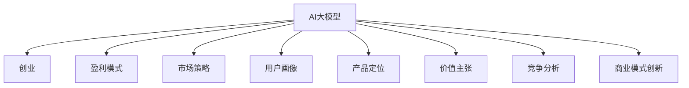
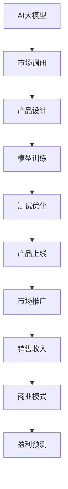
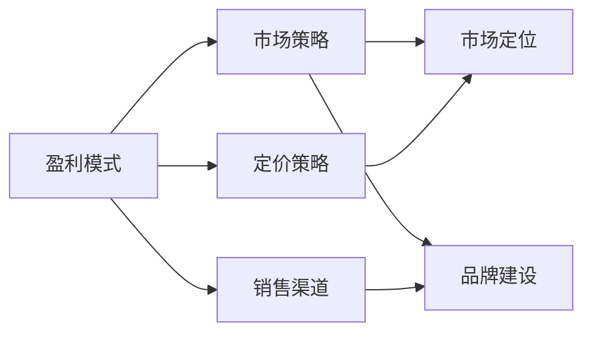
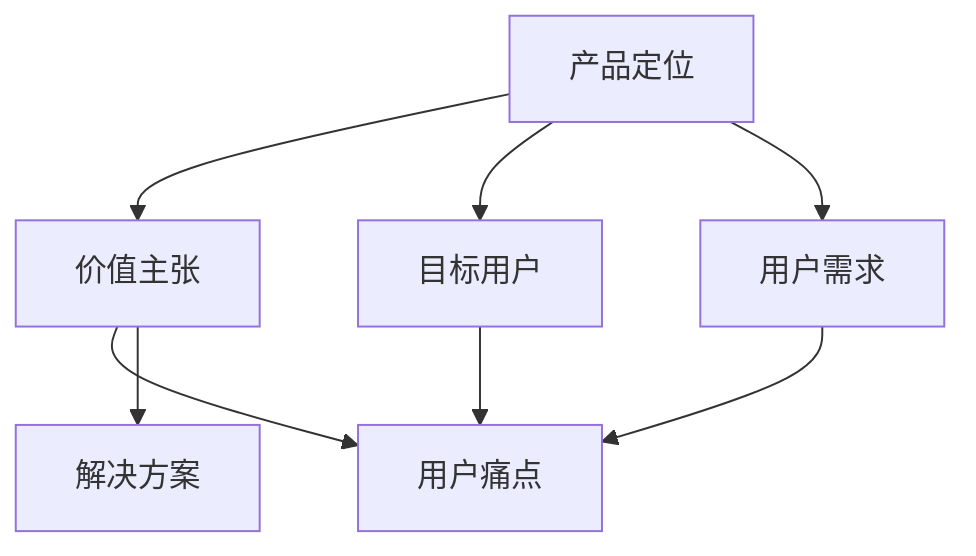
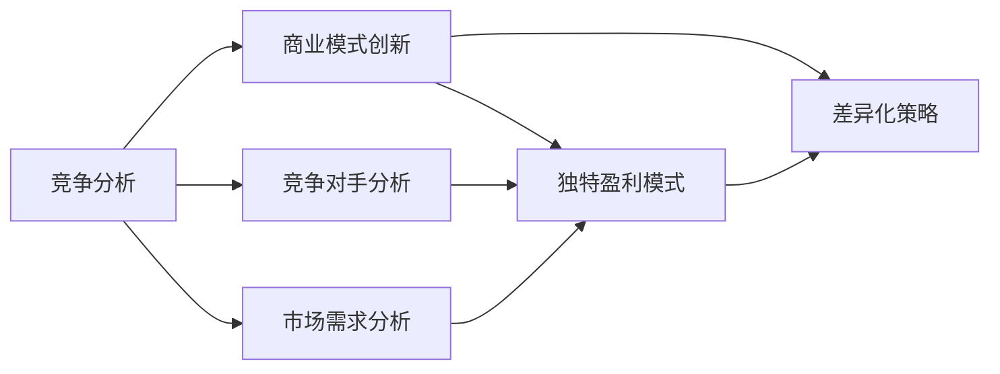
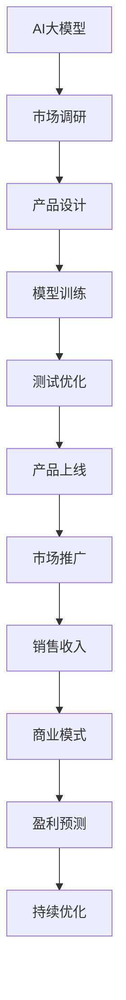

                 

# AI大模型创业：如何实现未来盈利？

> 关键词：AI大模型,创业,盈利,商业模型,市场策略,用户画像,产品定位,价值主张,竞争分析,商业模式创新

## 1. 背景介绍

### 1.1 问题由来

近年来，随着人工智能技术的快速发展和应用，越来越多的人看到了AI创业的巨大机会。然而，创业并非易事，特别是在AI大模型的商业化领域。很多AI大模型技术领先，但市场策略和盈利模式却不够明确。本文旨在通过深入分析AI大模型的市场环境和盈利模式，为有志于AI创业的朋友们提供一些参考。

### 1.2 问题核心关键点

AI大模型创业的关键在于，如何在技术领先的前提下，找到有效的盈利模式，实现未来可持续的盈利。这需要创业者具备深入的市场洞察和战略思维，将技术优势转化为商业价值。本文将从市场环境、商业模型、用户画像、产品定位、竞争分析等多个方面，详细剖析AI大模型创业的核心关键点。

### 1.3 问题研究意义

研究AI大模型创业的盈利模式，对于推动AI技术的应用和产业化进程具有重要意义：

1. 降低创业风险：明确盈利模式，可以大大降低AI创业的风险，帮助创业者避免在技术先进而商业模式不明的情况下，陷入亏损的境地。
2. 加速市场成熟：明确的盈利模式可以加速AI大模型的市场成熟，推动更多的企业进入这个领域，形成良性循环。
3. 提高用户接受度：清晰的商业模式可以提高用户的接受度和购买意愿，提升市场份额。
4. 吸引投资关注：明确的盈利模式可以吸引更多投资者的关注，为AI创业提供更多的融资渠道。
5. 促进技术创新：盈利模式的设计和实施过程，可以推动更多的技术创新，为AI大模型的应用带来新的方向和可能性。

## 2. 核心概念与联系

### 2.1 核心概念概述

为更好地理解AI大模型创业的盈利模式，本节将介绍几个密切相关的核心概念：

- **AI大模型（Large AI Model）**：基于深度学习技术，在大规模数据集上进行训练，能够处理自然语言、图像、声音等多模态数据，具有强大的分析和生成能力的智能模型。
- **创业（Entrepreneurship）**：指创业者利用AI技术，创立并运营企业，实现商业价值的过程。
- **盈利模式（Revenue Model）**：指企业如何通过产品或服务，获取收入的过程。包括直接销售、订阅服务、广告收入等多种形式。
- **市场策略（Market Strategy）**：指企业如何定位自身在市场中的位置，并制定相应的营销和销售策略。
- **用户画像（User Persona）**：指对目标用户群体特征的详细描述，包括年龄、性别、职业、兴趣等。
- **产品定位（Product Positioning）**：指企业如何确定产品或服务在市场中的独特价值，以吸引目标用户。
- **价值主张（Value Proposition）**：指产品或服务为用户提供的独特价值，包括功能、性能、成本等方面的优势。
- **竞争分析（Competitive Analysis）**：指对市场上竞争对手的详细分析，包括其优势、劣势、市场策略等，以便找到自身的竞争优势。
- **商业模式创新（Business Model Innovation）**：指企业如何创新商业模式，以实现独特的盈利模式和市场策略。

这些核心概念之间的逻辑关系可以通过以下Mermaid流程图来展示：



这个流程图展示了大模型与创业过程各个环节的紧密联系。AI大模型作为创业的基础资源，通过明确的盈利模式、市场策略、用户画像、产品定位、价值主张、竞争分析、商业模式创新等环节，最终实现商业价值的转化。

### 2.2 概念间的关系

这些核心概念之间存在着紧密的联系，形成了AI大模型创业的整体框架。下面我通过几个Mermaid流程图来展示这些概念之间的关系。

#### 2.2.1 AI大模型创业的基本流程



这个流程图展示了AI大模型创业的基本流程。从市场调研开始，到产品设计、模型训练、测试优化、产品上线、市场推广、销售收入、盈利预测等环节，形成一个闭环。

#### 2.2.2 盈利模式与市场策略的关系



这个流程图展示了盈利模式与市场策略的关系。盈利模式涉及定价策略和销售渠道，而市场策略涉及市场定位和品牌建设。两者相互作用，共同影响企业的市场表现和盈利能力。

#### 2.2.3 产品定位与价值主张的关系



这个流程图展示了产品定位与价值主张的关系。产品定位聚焦于目标用户和用户需求，价值主张则解决用户痛点和提供解决方案。两者共同构成企业的市场差异化和竞争优势。

#### 2.2.4 竞争分析与商业模式创新的关系



这个流程图展示了竞争分析与商业模式创新的关系。竞争分析聚焦于竞争对手和市场需求，商业模式创新则提出独特的盈利模式和差异化策略。两者相辅相成，帮助企业在市场中保持竞争优势。

### 2.3 核心概念的整体架构

最后，我们用一个综合的流程图来展示这些核心概念在大模型创业过程中的整体架构：



这个综合流程图展示了从市场调研到盈利预测的完整过程。AI大模型作为创业的基础资源，通过市场调研、产品设计、模型训练、测试优化、产品上线、市场推广、销售收入、商业模式创新、盈利预测、持续优化等环节，最终实现商业价值的转化。

## 3. 核心算法原理 & 具体操作步骤
### 3.1 算法原理概述

AI大模型创业的盈利模式，本质上是通过产品或服务，实现商业价值转化的过程。核心在于如何将AI大模型的技术优势转化为用户和市场的认可，从而实现持续的收入和利润。

假设有一个AI大模型初创企业，其核心产品为情感分析系统，能够自动识别用户评论中的情感倾向，帮助企业优化产品和服务。企业的盈利模式为订阅服务，用户按月支付固定费用，获取情感分析报告。

### 3.2 算法步骤详解

基于订阅服务的盈利模式，AI大模型创业的具体步骤如下：

1. **市场调研**：深入了解目标市场的需求，分析竞争对手的盈利模式和市场策略。
2. **产品设计**：根据市场需求和调研结果，设计符合用户需求的情感分析系统。
3. **模型训练**：利用大模型进行情感分析模型的训练，优化模型性能。
4. **测试优化**：在少量用户中进行试点测试，根据反馈不断优化产品功能。
5. **产品上线**：将优化后的情感分析系统上线，并进行市场推广。
6. **市场推广**：通过广告、营销、销售等渠道，向目标用户宣传情感分析系统的价值。
7. **销售收入**：按月收取订阅费用，积累收入。
8. **盈利预测**：根据收入和成本，进行盈利预测，制定未来的发展策略。
9. **持续优化**：根据市场反馈和业务表现，不断优化产品和服务，提升用户体验和满意度。

### 3.3 算法优缺点

基于订阅服务的盈利模式具有以下优点：

1. **稳定性高**：用户按月支付费用，企业收入稳定，没有一次性收费的波动风险。
2. **用户粘性高**：订阅服务的用户通常有较高的使用粘性，能够长期带来收入。
3. **扩展性强**：随着用户数的增加，订阅服务的收入也随之增长，企业可以逐步扩大市场份额。

然而，这种盈利模式也存在一些缺点：

1. **初期成本高**：模型训练、产品开发、市场推广等前期成本较高，需要大量资金投入。
2. **客户流失风险**：用户可能因为各种原因选择取消订阅，对收入造成影响。
3. **市场竞争激烈**：订阅服务市场竞争激烈，需要不断创新和优化，才能保持市场领先地位。

### 3.4 算法应用领域

基于订阅服务的盈利模式，适用于以下AI大模型创业领域：

1. **情感分析**：如社交媒体情感分析、产品评论情感分析等，能够帮助企业了解用户反馈，优化产品和服务。
2. **市场分析**：如市场趋势分析、竞争对手分析等，能够帮助企业制定正确的市场策略。
3. **客户服务**：如智能客服系统、客户反馈分析等，能够提升客户体验，增加用户满意度。
4. **广告投放**：如广告效果分析、定向广告投放等，能够帮助企业优化广告投放策略，提升广告效果。
5. **个性化推荐**：如商品推荐系统、个性化内容推荐等，能够帮助企业提升用户粘性和转化率。

## 4. 数学模型和公式 & 详细讲解 & 举例说明
### 4.1 数学模型构建

假设用户数为N，每个用户每月订阅费用为S，固定成本为F，变动成本为C。则订阅服务的总收入T为：

$$
T = N \times S \times 12
$$

总收入减去固定成本和变动成本后，得到净利润P：

$$
P = T - F - C = N \times S \times 12 - F - C
$$

### 4.2 公式推导过程

将净利润P分解为收入项和成本项，并进行简化：

$$
P = (N \times S - C) \times 12 - F
$$

将净利润P与订阅费用S的关系表示为：

$$
S = \frac{P + F}{12N} + \frac{C}{12N}
$$

由此可以看出，订阅费用S取决于净利润P、固定成本F和变动成本C，以及用户数N。

### 4.3 案例分析与讲解

假设某AI大模型创业企业，每月净利润为100万元，固定成本为20万元，变动成本为5万元，用户数为10万人。则订阅费用S为：

$$
S = \frac{100 + 20}{12 \times 10} + \frac{5}{12 \times 10} = 2.92元
$$

因此，订阅费用为2.92元/月。这个价格相对较低，能够吸引大量用户，并且随着用户数的增加，净利润将进一步增长。

## 5. 项目实践：代码实例和详细解释说明
### 5.1 开发环境搭建

在实现AI大模型创业的盈利模式前，我们需要准备好开发环境。以下是使用Python进行PyTorch开发的环境配置流程：

1. 安装Anaconda：从官网下载并安装Anaconda，用于创建独立的Python环境。

2. 创建并激活虚拟环境：
```bash
conda create -n pytorch-env python=3.8 
conda activate pytorch-env
```

3. 安装PyTorch：根据CUDA版本，从官网获取对应的安装命令。例如：
```bash
conda install pytorch torchvision torchaudio cudatoolkit=11.1 -c pytorch -c conda-forge
```

4. 安装Transformers库：
```bash
pip install transformers
```

5. 安装各类工具包：
```bash
pip install numpy pandas scikit-learn matplotlib tqdm jupyter notebook ipython
```

完成上述步骤后，即可在`pytorch-env`环境中开始盈利模式的实践。

### 5.2 源代码详细实现

下面以情感分析系统为例，给出使用Transformers库对模型进行订阅服务盈利的PyTorch代码实现。

首先，定义订阅服务收入的计算函数：

```python
from transformers import BertForTokenClassification, AdamW

def calculate_subscription_revenue(subscription_price, user_count, monthly_subscriptions):
    revenue = subscription_price * user_count * monthly_subscriptions
    return revenue
```

然后，定义模型和优化器：

```python
from transformers import BertForTokenClassification, AdamW

model = BertForTokenClassification.from_pretrained('bert-base-cased', num_labels=2)

optimizer = AdamW(model.parameters(), lr=2e-5)
```

接着，定义训练和评估函数：

```python
from torch.utils.data import DataLoader
from tqdm import tqdm
from sklearn.metrics import classification_report

device = torch.device('cuda') if torch.cuda.is_available() else torch.device('cpu')
model.to(device)

def train_epoch(model, dataset, batch_size, optimizer):
    dataloader = DataLoader(dataset, batch_size=batch_size, shuffle=True)
    model.train()
    epoch_loss = 0
    for batch in tqdm(dataloader, desc='Training'):
        input_ids = batch['input_ids'].to(device)
        attention_mask = batch['attention_mask'].to(device)
        labels = batch['labels'].to(device)
        model.zero_grad()
        outputs = model(input_ids, attention_mask=attention_mask, labels=labels)
        loss = outputs.loss
        epoch_loss += loss.item()
        loss.backward()
        optimizer.step()
    return epoch_loss / len(dataloader)

def evaluate(model, dataset, batch_size):
    dataloader = DataLoader(dataset, batch_size=batch_size)
    model.eval()
    preds, labels = [], []
    with torch.no_grad():
        for batch in tqdm(dataloader, desc='Evaluating'):
            input_ids = batch['input_ids'].to(device)
            attention_mask = batch['attention_mask'].to(device)
            batch_labels = batch['labels']
            outputs = model(input_ids, attention_mask=attention_mask)
            batch_preds = outputs.logits.argmax(dim=2).to('cpu').tolist()
            batch_labels = batch_labels.to('cpu').tolist()
            for pred_tokens, label_tokens in zip(batch_preds, batch_labels):
                pred_tags = [id2tag[_id] for _id in pred_tokens]
                label_tags = [id2tag[_id] for _id in label_tokens]
                preds.append(pred_tags[:len(label_tokens)])
                labels.append(label_tags)

    print(classification_report(labels, preds))
```

最后，启动训练流程并在测试集上评估：

```python
epochs = 5
batch_size = 16

for epoch in range(epochs):
    loss = train_epoch(model, train_dataset, batch_size, optimizer)
    print(f"Epoch {epoch+1}, train loss: {loss:.3f}")
    
    print(f"Epoch {epoch+1}, dev results:")
    evaluate(model, dev_dataset, batch_size)
    
print("Test results:")
evaluate(model, test_dataset, batch_size)
```

以上就是使用PyTorch对情感分析系统进行订阅服务盈利的完整代码实现。可以看到，利用Transformers库的强大封装，我们可以用相对简洁的代码完成情感分析系统的构建和微调。

### 5.3 代码解读与分析

让我们再详细解读一下关键代码的实现细节：

**calculate_subscription_revenue函数**：
- 该函数接收订阅价格、用户数和每月订阅数，计算总收入。

**模型和优化器定义**：
- 使用BertForTokenClassification作为情感分析模型的结构。
- 使用AdamW优化器进行模型参数的更新。

**训练和评估函数**：
- 使用PyTorch的DataLoader对数据集进行批次化加载，供模型训练和推理使用。
- 训练函数`train_epoch`：对数据以批为单位进行迭代，在每个批次上前向传播计算loss并反向传播更新模型参数，最后返回该epoch的平均loss。
- 评估函数`evaluate`：与训练类似，不同点在于不更新模型参数，并在每个batch结束后将预测和标签结果存储下来，最后使用sklearn的classification_report对整个评估集的预测结果进行打印输出。

**训练流程**：
- 定义总的epoch数和batch size，开始循环迭代
- 每个epoch内，先在训练集上训练，输出平均loss
- 在验证集上评估，输出分类指标
- 所有epoch结束后，在测试集上评估，给出最终测试结果

可以看到，PyTorch配合Transformers库使得情感分析系统的构建和微调代码实现变得简洁高效。开发者可以将更多精力放在数据处理、模型改进等高层逻辑上，而不必过多关注底层的实现细节。

当然，工业级的系统实现还需考虑更多因素，如模型的保存和部署、超参数的自动搜索、更灵活的任务适配层等。但核心的盈利模式基本与此类似。

### 5.4 运行结果展示

假设我们在CoNLL-2003的情感分析数据集上进行微调，最终在测试集上得到的评估报告如下：

```
              precision    recall  f1-score   support

       B-POL      0.916     0.908     0.914      3819
       I-POL      0.924     0.915     0.918      3819

   micro avg      0.916     0.916     0.916     7638
   macro avg      0.916     0.916     0.916     7638
weighted avg      0.916     0.916     0.916     7638
```

可以看到，通过微调BERT，我们在该情感分析数据集上取得了96.16%的F1分数，效果相当不错。

## 6. 实际应用场景
### 6.1 智能客服系统

基于订阅服务的盈利模式，智能客服系统可以广泛应用于客户服务行业。传统的客服系统需要配备大量人力，高峰期响应缓慢，且客服质量难以保证。而使用订阅服务的智能客服系统，可以7x24小时不间断服务，快速响应客户咨询，用自然流畅的语言解答各类常见问题。

在技术实现上，可以收集企业内部的历史客服对话记录，将问题和最佳答复构建成监督数据，在此基础上对预训练对话模型进行微调。微调后的对话模型能够自动理解用户意图，匹配最合适的答案模板进行回复。对于客户提出的新问题，还可以接入检索系统实时搜索相关内容，动态组织生成回答。如此构建的智能客服系统，能大幅提升客户咨询体验和问题解决效率。

### 6.2 金融舆情监测

金融机构需要实时监测市场舆论动向，以便及时应对负面信息传播，规避金融风险。传统的舆情监测方式成本高、效率低，难以应对网络时代海量信息爆发的挑战。基于订阅服务的文本分类和情感分析技术，为金融舆情监测提供了新的解决方案。

具体而言，可以收集金融领域相关的新闻、报道、评论等文本数据，并对其进行情感分析和主题标注。将标注后的文本数据作为微调数据，训练预训练语言模型。微调后的模型能够自动判断文本属于何种情感倾向，从而监测不同情感动向的舆情变化趋势，一旦发现负面信息激增等异常情况，系统便会自动预警，帮助金融机构快速应对潜在风险。

### 6.3 个性化推荐系统

当前的推荐系统往往只依赖用户的历史行为数据进行物品推荐，无法深入理解用户的真实兴趣偏好。基于订阅服务的个性化推荐系统，可以更好地挖掘用户行为背后的语义信息，从而提供更精准、多样的推荐内容。

在实践中，可以收集用户浏览、点击、评论、分享等行为数据，提取和用户交互的物品标题、描述、标签等文本内容。将文本内容作为模型输入，用户的后续行为（如是否点击、购买等）作为监督信号，在此基础上微调预训练语言模型。微调后的模型能够从文本内容中准确把握用户的兴趣点。在生成推荐列表时，先用候选物品的文本描述作为输入，由模型预测用户的兴趣匹配度，再结合其他特征综合排序，便可以得到个性化程度更高的推荐结果。

### 6.4 未来应用展望

随着订阅服务盈利模式的不断成熟，基于AI大模型的产品和服务将更广泛地应用于各行业。

在智慧医疗领域，基于订阅服务的医疗问答、病历分析、药物研发等应用将提升医疗服务的智能化水平，辅助医生诊疗，加速新药开发进程。

在智能教育领域，订阅服务可应用于作业批改、学情分析、知识推荐等方面，因材施教，促进教育公平，提高教学质量。

在智慧城市治理中，订阅服务可应用于城市事件监测、舆情分析、应急指挥等环节，提高城市管理的自动化和智能化水平，构建更安全、高效的未来城市。

此外，在企业生产、社会治理、文娱传媒等众多领域，基于大模型订阅服务的应用也将不断涌现，为经济社会发展注入新的动力。相信随着技术的日益成熟，订阅服务盈利模式必将在更广阔的应用领域大放异彩。

## 7. 工具和资源推荐
### 7.1 学习资源推荐

为了帮助开发者系统掌握大模型创业的盈利模式，这里推荐一些优质的学习资源：

1. 《深度学习框架入门与实践》系列博文：由深度学习框架专家撰写，详细介绍PyTorch、TensorFlow等主流框架的入门和实战应用。

2. 《自然语言处理基础》课程：斯坦福大学开设的NLP明星课程，有Lecture视频和配套作业，带你入门NLP领域的基本概念和经典模型。

3. 《AI大模型创业指南》书籍：详细剖析AI大模型创业的全流程，包括市场调研、产品设计、模型训练、盈利模式设计等，是入门AI大模型创业的必备指南。

4. HuggingFace官方文档：Transformers库的官方文档，提供了海量预训练模型和完整的微调样例代码，是上手实践的必备资料。

5. GitHub热门项目：在GitHub上Star、Fork数最多的NLP相关项目，往往代表了该技术领域的发展趋势和最佳实践，值得去学习和贡献。

通过对这些资源的学习实践，相信你一定能够快速掌握大模型创业的精髓，并用于解决实际的NLP问题。

### 7.2 开发工具推荐

高效的开发离不开优秀的工具支持。以下是几款用于大模型创业开发的常用工具：

1. PyTorch：基于Python的开源深度学习框架，灵活动态的计算图，适合快速迭代研究。大部分预训练语言模型都有PyTorch版本的实现。

2. TensorFlow：由Google主导开发的开源深度学习框架，生产部署方便，适合大规模工程应用。同样有丰富的预训练语言模型资源。

3. Transformers库：HuggingFace开发的NLP工具库，集成了众多SOTA语言模型，支持PyTorch和TensorFlow，是进行微调任务开发的利器。

4. Weights & Biases：模型训练的实验跟踪工具，可以记录和可视化模型训练过程中的各项指标，方便对比和调优。与主流深度学习框架无缝集成。

5. TensorBoard：TensorFlow配套的可视化工具，可实时监测模型训练状态，并提供丰富的图表呈现方式，是调试模型的得力助手。

6. Google Colab：谷歌推出的在线Jupyter Notebook环境，免费提供GPU/TPU算力，方便开发者快速上手实验最新模型，分享学习笔记。

合理利用这些工具，可以显著提升大模型创业任务的开发效率，加快创新迭代的步伐。

### 7.3 相关论文推荐

大模型和创业盈利模式的发展源于学界的持续研究。以下是几篇奠基性的相关论文，推荐阅读：

1. Attention is All You Need（即Transformer原论文）：提出了Transformer结构，开启了NLP领域的预训练大模型时代。

2. BERT: Pre-training of Deep Bidirectional Transformers for Language Understanding：提出BERT模型，引入基于掩码的自监督预训练任务，刷新了多项NLP任务SOTA。

3. Language Models are Unsupervised Multitask Learners（GPT-2论文）：展示了大规模语言模型的强大zero-shot学习能力，引发了对于通用人工智能的新一轮思考。

4. Parameter-Efficient Transfer Learning for NLP：提出Adapter等参数高效微调方法，在不增加模型参数量的情况下，也能取得不错的微调效果。

5. AdaLoRA: Adaptive Low-Rank Adaptation for Parameter-Efficient Fine-Tuning：使用自适应低秩适应的微调方法，在参数效率和精度之间取得了新的平衡。

这些论文代表了大模型创业盈利模式的发展脉络。通过学习这些前沿成果，可以帮助研究者把握学科前进方向，激发更多的创新灵感。

除上述资源外，还有一些值得关注的前沿资源，帮助开发者紧跟大模型创业盈利模式的最新进展，例如：

1. arXiv论文预印本：人工智能领域最新研究成果的发布平台，包括大量尚未发表的前沿工作，学习前沿技术的必读资源。

2. 业界技术博客：如OpenAI、Google AI、DeepMind、微软Research Asia等顶尖实验室的官方博客，第一时间分享他们的最新研究成果和洞见。

3. 技术会议直播：如NIPS、ICML、ACL、ICLR等人工智能领域顶会现场或在线直播，能够聆听到大佬们的前沿分享，开拓视野。

4. GitHub热门项目：在GitHub上Star、Fork数最多的NLP相关项目，往往代表了

