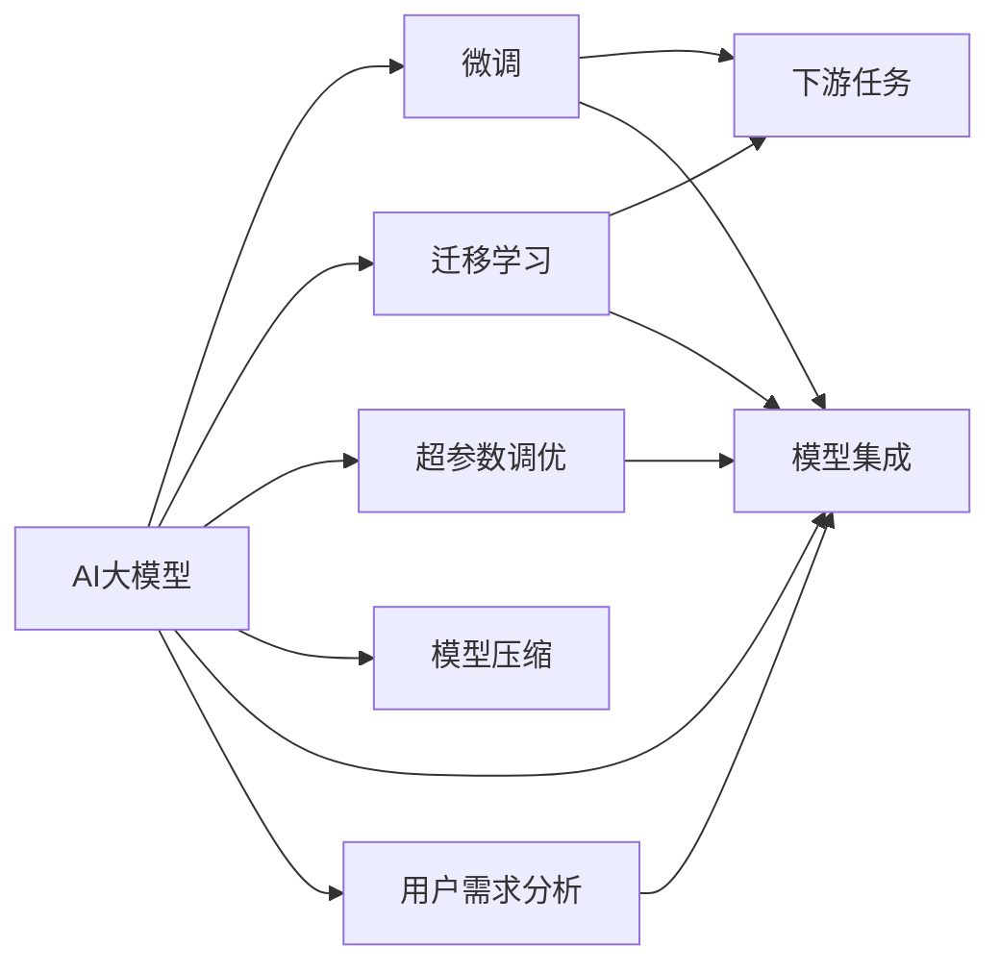

                 

# AI大模型创业：如何应对未来用户需求？

## 1. 背景介绍

随着人工智能技术的迅猛发展，AI大模型正逐渐成为创业领域的炙手可热的方向。从NLP、CV到多模态AI，大模型在各领域的创新应用层出不穷，吸引了大量的创业团队和资本关注。AI大模型以其泛化性强、性能优越、应用广泛等优势，已成为推动智能技术发展的核心驱动力。然而，用户需求的多样化和个性化也提出了新的挑战，如何更好地应对未来用户需求，成为创业者需要深思的问题。

### 1.1 问题由来

在AI大模型创业的浪潮中，如何在有限的资源和时间下，开发出具备广泛应用和高度实用性的AI产品，满足用户的个性化需求，是创业团队必须解决的难题。用户需求的多样性，要求AI大模型在多个领域、多种应用场景下具有灵活性。但同时，模型训练和调优的复杂性、用户数据获取的困难、市场竞争的激烈，也对创业团队的综合能力提出了高要求。

### 1.2 问题核心关键点

AI大模型创业的核心关键点主要包括以下几个方面：
1. **模型选择与定制**：选择合适的预训练模型，并根据具体任务进行微调，实现模型的定制化。
2. **数据获取与处理**：获取高质量、多样化的数据，并进行清洗、标注、增强等处理，以提高模型的泛化能力。
3. **模型训练与优化**：在有限的资源下，高效训练模型，并通过超参数调优、正则化等技术提升模型性能。
4. **产品化与部署**：将模型封装成易用的API或服务，并进行高效的部署，确保系统的稳定性。
5. **市场与用户反馈**：通过市场调研和用户反馈，不断迭代优化产品，提升用户体验。

## 2. 核心概念与联系

### 2.1 核心概念概述

为更好地理解AI大模型创业的方法，本节将介绍几个关键概念及其联系：

- **AI大模型**：以Transformer为代表的预训练模型，通过大规模无标签数据的自监督学习，学习到通用的语言或视觉知识，具备强大的推理和生成能力。
- **微调(Fine-tuning)**：在大模型的基础上，使用特定任务的数据集进行有监督学习，调整模型参数以适应该任务。
- **迁移学习(Transfer Learning)**：将在大规模数据上预训练的模型，迁移应用于较小数据集上，以提升模型在新任务上的表现。
- **超参数调优(Hyperparameter Tuning)**：通过调整学习率、批次大小、正则化系数等参数，优化模型训练过程，提高模型性能。
- **模型压缩(Compression)**：通过模型剪枝、量化、蒸馏等技术，减小模型参数量，提高计算效率。
- **模型集成(Ensemble)**：通过组合多个模型进行集成，提升模型的鲁棒性和泛化能力。
- **用户需求分析(User Requirement Analysis)**：通过市场调研、用户访谈等方式，获取用户需求信息，指导模型开发和产品设计。

这些概念通过以下Mermaid流程图展示其联系：



这个流程图展示了从AI大模型的预训练、微调、迁移学习，到模型压缩、超参数调优、集成和用户需求分析的整体流程及其相互关系。

### 2.2 概念间的关系

这些概念之间的关系如下：

1. **预训练与微调**：预训练提供模型的初始化参数，微调则在特定任务上进行调整，使其适应该任务。
2. **迁移学习与微调**：迁移学习在大规模数据上进行预训练，微调则在小规模数据集上进行有监督学习，两者结合提高模型在新任务上的泛化能力。
3. **超参数调优与微调**：超参数调优通过优化训练过程，提升微调的效果。
4. **模型压缩与微调**：模型压缩减小了模型参数量，使微调在资源有限的情况下仍可进行。
5. **模型集成与微调**：模型集成通过组合多个微调模型，提升模型的鲁棒性和泛化能力。
6. **用户需求分析与微调**：用户需求分析指导微调的方向和优化，使模型更符合用户期望。

这些概念的组合应用，使AI大模型能够在多个领域、多种场景下，满足用户多样化的需求。

## 3. 核心算法原理 & 具体操作步骤

### 3.1 算法原理概述

AI大模型的微调过程通常基于监督学习范式，其核心原理是将预训练模型视作一个强大的特征提取器，通过在特定任务的数据集上进行有监督学习，调整模型参数以适应该任务。这一过程包括：

1. **数据准备**：收集和预处理训练数据集。
2. **模型选择**：选择合适的预训练模型，并进行微调。
3. **模型训练**：在训练集上训练模型，并通过超参数调优等技术优化模型。
4. **模型评估**：在验证集上评估模型性能，防止过拟合。
5. **模型部署**：将模型封装成API或服务，并进行高效的部署。

### 3.2 算法步骤详解

以下详细说明基于监督学习的AI大模型微调的具体操作步骤：

**Step 1: 数据准备**
1. 收集相关领域的数据集，确保数据的质量和多样性。
2. 对数据进行清洗、标注、增强等处理，准备用于微调的数据集。

**Step 2: 模型选择与微调**
1. 选择合适的预训练模型，如BERT、GPT、ResNet等。
2. 根据任务类型，在模型顶部添加适当的输出层和损失函数。
3. 使用微调数据集进行有监督学习，调整模型参数。

**Step 3: 模型训练与优化**
1. 设置合适的超参数，如学习率、批次大小、正则化系数等。
2. 使用梯度下降等优化算法，对模型进行训练，并通过验证集监控模型性能。
3. 使用超参数调优技术，找到最优的模型参数。

**Step 4: 模型评估**
1. 在验证集上评估模型性能，计算精度、召回率、F1分数等指标。
2. 根据评估结果调整模型参数，防止过拟合。

**Step 5: 模型部署**
1. 将模型封装成API或服务，便于调用。
2. 部署模型到服务器或云平台，确保系统的稳定性。

### 3.3 算法优缺点

AI大模型微调具有以下优点：
1. 泛化性强：通过在大规模数据上进行预训练，模型具备较强的泛化能力。
2. 训练时间短：相比从头训练，微调可以显著减少训练时间。
3. 适用性广：可以在多个领域、多种任务上应用。

同时，AI大模型微调也存在以下缺点：
1. 数据依赖：微调依赖于高质量的数据集，获取数据成本高。
2. 迁移能力有限：当目标任务与预训练数据的分布差异较大时，微调的效果可能不佳。
3. 参数量庞大：大模型的参数量较大，训练和推理时资源消耗较大。

### 3.4 算法应用领域

AI大模型微调在多个领域得到了广泛应用，包括：

- **NLP**：命名实体识别、文本分类、情感分析、机器翻译等。
- **CV**：图像分类、目标检测、图像生成等。
- **多模态AI**：文本-图像融合、视频-语音-文本结合等。
- **医疗**：疾病诊断、影像分析等。
- **金融**：情感分析、风险评估等。
- **教育**：智能辅导、自动化评分等。

## 4. 数学模型和公式 & 详细讲解 & 举例说明

### 4.1 数学模型构建

以NLP领域的命名实体识别(NER)任务为例，构建数学模型。假设预训练模型为$M_{\theta}$，训练集为$D=\{(x_i, y_i)\}_{i=1}^N$，其中$x_i$为输入文本，$y_i$为标签（实数或分类标签）。

**目标函数**：
1. 损失函数：交叉熵损失函数
$$
\mathcal{L}(\theta) = -\frac{1}{N}\sum_{i=1}^N \sum_{j=0}^{|x_i|}(y_i^j\log M_{\theta}(x_i)^j + (1-y_i^j)\log (1-M_{\theta}(x_i)^j))
$$
其中$y_i^j$表示第$j$个token的标签。
2. 优化目标：最小化损失函数$\mathcal{L}(\theta)$

**算法流程**：
1. 数据预处理：对输入文本进行分词、标记化等预处理。
2. 模型选择：选择BERT或GPT等预训练模型。
3. 模型微调：在微调数据集上训练模型，调整参数$\theta$。
4. 模型评估：在验证集上评估模型性能，计算F1分数等指标。
5. 模型部署：将模型封装成API或服务，进行高效部署。

### 4.2 公式推导过程

以BERT为例，假设其预训练模型为$M_{\theta}(x) = \text{softmax}(\text{MLP}(\text{Attention}(\text{Encoder}(\text{Embedding}(x))))$，其中$\text{MLP}$、$\text{Attention}$、$\text{Encoder}$、$\text{Embedding}$分别为多层感知器、注意力机制、编码器、嵌入层。

**目标函数推导**：
1. 损失函数推导：
$$
\mathcal{L}(\theta) = -\frac{1}{N}\sum_{i=1}^N \sum_{j=0}^{|x_i|}(y_i^j\log M_{\theta}(x_i)^j + (1-y_i^j)\log (1-M_{\theta}(x_i)^j))
$$
2. 优化目标推导：
$$
\theta^* = \mathop{\arg\min}_{\theta} \mathcal{L}(\theta)
$$

**模型训练推导**：
1. 前向传播：
$$
\text{Embedding}(x) = \text{Encoder}(\text{Embedding}(x))
$$
$$
\text{Attention}(\text{Encoder}(x)) = \text{MLP}(\text{Attention}(\text{Encoder}(x)))
$$
$$
\text{Softmax}(\text{MLP}(\text{Attention}(\text{Encoder}(x)))) = \text{Prediction}(x)
$$
2. 反向传播：
$$
\frac{\partial \mathcal{L}(\theta)}{\partial \theta} = -\frac{1}{N}\sum_{i=1}^N \frac{\partial \mathcal{L}(\theta)}{\partial M_{\theta}(x_i)}
$$
$$
\frac{\partial \mathcal{L}(\theta)}{\partial M_{\theta}(x_i)} = -\frac{\partial \mathcal{L}(\theta)}{\partial \text{Prediction}(x_i)}
$$

### 4.3 案例分析与讲解

以情感分析任务为例，展示基于BERT模型的微调过程：

1. **数据准备**：收集电影评论数据集，并进行清洗、标注等预处理。
2. **模型选择**：选择BERT作为预训练模型，并添加分类层和交叉熵损失函数。
3. **模型微调**：在训练集上训练模型，调整参数$\theta$。
4. **模型评估**：在验证集上评估模型性能，计算F1分数等指标。
5. **模型部署**：将模型封装成API或服务，进行高效部署。

## 5. 项目实践：代码实例和详细解释说明

### 5.1 开发环境搭建

**环境准备**：
1. 安装Anaconda和PyTorch，配置Python虚拟环境。
2. 安装BERT和相关工具包。

**环境示例**：
```bash
conda create -n pytorch-env python=3.8 
conda activate pytorch-env
pip install torch transformers datasets scikit-learn
```

### 5.2 源代码详细实现

以BERT模型微调情感分析任务为例，展示完整代码实现：

```python
from transformers import BertForSequenceClassification, BertTokenizer
from datasets import load_dataset
from torch.utils.data import DataLoader
import torch
from sklearn.metrics import accuracy_score

# 加载数据集
dataset = load_dataset('imdb', 'train')

# 初始化模型和tokenizer
model = BertForSequenceClassification.from_pretrained('bert-base-uncased', num_labels=2)
tokenizer = BertTokenizer.from_pretrained('bert-base-uncased')

# 数据预处理
def preprocess(text):
    return tokenizer.encode(text, truncation=True, padding='max_length', max_length=128)

# 训练函数
def train_epoch(model, dataset, optimizer):
    dataloader = DataLoader(dataset, batch_size=32)
    model.train()
    epoch_loss = 0
    for batch in dataloader:
        inputs = preprocess(batch['text'])
        labels = batch['label']
        model.zero_grad()
        outputs = model(inputs, labels=labels)
        loss = outputs.loss
        epoch_loss += loss.item()
        loss.backward()
        optimizer.step()
    return epoch_loss / len(dataloader)

# 评估函数
def evaluate(model, dataset):
    dataloader = DataLoader(dataset, batch_size=32)
    model.eval()
    preds, labels = [], []
    with torch.no_grad():
        for batch in dataloader:
            inputs = preprocess(batch['text'])
            labels = batch['label']
            outputs = model(inputs)
            batch_preds = torch.argmax(outputs.logits, dim=1).tolist()
            batch_labels = labels.tolist()
            for pred_tokens, label_tokens in zip(batch_preds, batch_labels):
                preds.append(pred_tokens)
                labels.append(label_tokens)
    return accuracy_score(labels, preds)

# 训练和评估
epochs = 5
batch_size = 32

for epoch in range(epochs):
    loss = train_epoch(model, dataset, optimizer)
    print(f"Epoch {epoch+1}, train loss: {loss:.3f}")
    
    print(f"Epoch {epoch+1}, dev accuracy: {evaluate(model, dataset)}")
    
print(f"Final test accuracy: {evaluate(model, test_dataset)}")
```

### 5.3 代码解读与分析

**数据集加载**：
1. 使用`load_dataset`加载IMDB电影评论数据集，准备训练数据。
2. 使用`tokenizer`对文本进行编码，并限制长度。

**模型初始化**：
1. 加载BERT预训练模型，并添加分类层。
2. 使用`BertTokenizer`对文本进行预处理。

**训练函数**：
1. 对每个批次进行前向传播和反向传播，计算损失并更新模型参数。
2. 在验证集上评估模型性能。

**评估函数**：
1. 在测试集上评估模型性能，计算准确率。

## 6. 实际应用场景

### 6.1 智能客服

AI大模型在智能客服领域的应用具有巨大潜力。通过微调BERT模型，可以构建自然语言理解的智能客服系统，实现快速响应、自然对话等功能。

**技术实现**：
1. 收集客服历史对话记录，构建训练数据集。
2. 微调BERT模型，训练分类器或生成器。
3. 部署模型到在线服务，实现自动问答。

### 6.2 金融风控

金融领域对风险评估和舆情监测的需求日益增长。利用AI大模型进行情感分析、风险评估等任务，可以大幅提升金融风险管理水平。

**技术实现**：
1. 收集金融新闻、评论等数据，构建训练数据集。
2. 微调BERT模型，训练情感分类器或风险评估器。
3. 部署模型到风控系统，实时监测舆情和风险。

### 6.3 教育个性化

AI大模型可以用于个性化教育，根据学生的学习数据和反馈，调整教学内容和节奏，实现因材施教。

**技术实现**：
1. 收集学生学习数据和评价，构建训练数据集。
2. 微调BERT模型，训练个性化推荐系统。
3. 部署模型到教育平台，提供个性化学习建议。

### 6.4 未来应用展望

未来，AI大模型将广泛应用于更多领域，推动智能化进程。以下是一些未来应用场景：

**医疗诊断**：通过微调大模型，构建疾病诊断系统，辅助医生诊断和治疗。

**自动驾驶**：通过多模态AI技术，实现环境感知和决策，提升驾驶安全性。

**智能家居**：通过自然语言理解和情感分析，构建智能家居系统，提供个性化服务。

**智慧城市**：通过多模态数据融合，实现城市事件监测、应急指挥等功能，提升城市管理水平。

## 7. 工具和资源推荐

### 7.1 学习资源推荐

**官方文档**：
1. PyTorch官方文档：详细介绍了PyTorch的API和应用实例。
2. Transformers官方文档：提供了丰富的预训练模型和微调范例。

**在线课程**：
1. Coursera《深度学习与自然语言处理》课程：系统讲解了深度学习在NLP中的应用。
2. Udacity《人工智能基础》课程：介绍了机器学习、深度学习等基础知识。

**论文和书籍**：
1. 《深度学习》书籍：全面介绍了深度学习的基本概念和算法。
2. 论文《BERT: Pre-training of Deep Bidirectional Transformers for Language Understanding》：介绍了BERT模型的原理和应用。

### 7.2 开发工具推荐

**IDE和编辑器**：
1. PyCharm：支持Python开发，提供丰富的插件和工具。
2. Visual Studio Code：支持多种编程语言，提供智能补全和调试功能。

**数据处理工具**：
1. Pandas：用于数据处理和分析。
2. NumPy：用于科学计算和矩阵运算。

**部署工具**：
1. AWS Lambda：支持Python函数的快速部署。
2. Google Cloud Functions：提供Python函数的云平台服务。

### 7.3 相关论文推荐

**核心论文**：
1. Attention is All You Need：介绍Transformer结构，开创了预训练大模型时代。
2. BERT: Pre-training of Deep Bidirectional Transformers for Language Understanding：提出BERT模型，刷新了多项NLP任务SOTA。
3. Parameter-Efficient Transfer Learning for NLP：提出Adapter等参数高效微调方法。

**前沿论文**：
1. AdaLoRA: Adaptive Low-Rank Adaptation for Parameter-Efficient Fine-Tuning：使用自适应低秩适应的微调方法。
2. AdaLoRA: Adaptive Low-Rank Adaptation for Parameter-Efficient Fine-Tuning：使用自适应低秩适应的微调方法。

## 8. 总结：未来发展趋势与挑战

### 8.1 研究成果总结

本文对AI大模型微调的方法进行了系统介绍，涵盖模型选择、数据准备、模型训练、模型评估、模型部署等多个环节。通过详细讲解微调的具体操作步骤，展示了其在NLP、CV、多模态AI等领域的广泛应用。同时，本文也对未来AI大模型的应用前景进行了展望，提出了一些挑战和思考。

### 8.2 未来发展趋势

未来，AI大模型的微调技术将向以下几个方向发展：

1. **多模态融合**：将视觉、语音、文本等多种模态数据融合，构建更全面、精准的AI系统。
2. **自监督学习**：利用无监督学习技术，提高模型的泛化能力和鲁棒性。
3. **个性化微调**：通过个性化数据和算法，定制化满足用户需求。
4. **联邦学习**：通过分布式训练，保护用户隐私和数据安全。

### 8.3 面临的挑战

尽管AI大模型微调取得了显著成果，但未来的发展仍面临诸多挑战：

1. **数据隐私保护**：如何在保护用户隐私的前提下，获取高质量的数据集。
2. **模型鲁棒性**：如何提高模型对噪声和攻击的鲁棒性，确保系统的可靠性。
3. **公平性和透明性**：如何避免模型偏见，确保输出的公平和透明。

### 8.4 研究展望

未来，AI大模型微调技术需要结合其他前沿技术，如因果推理、知识图谱、强化学习等，以提升模型的性能和应用范围。同时，还需要关注数据隐私、公平性、可解释性等伦理和社会问题，确保AI技术的健康发展。通过不断的技术创新和伦理规范，AI大模型微调将为更多领域带来变革性的影响。

## 9. 附录：常见问题与解答

**Q1: AI大模型微调的主要挑战有哪些？**

A: AI大模型微调的主要挑战包括：
1. 数据依赖：获取高质量、多样化的数据集成本高。
2. 迁移能力有限：当目标任务与预训练数据的分布差异较大时，微调的效果可能不佳。
3. 参数量庞大：大模型的参数量较大，训练和推理时资源消耗较大。

**Q2: AI大模型微调的未来发展趋势有哪些？**

A: AI大模型微调的未来发展趋势包括：
1. 多模态融合：将视觉、语音、文本等多种模态数据融合，构建更全面、精准的AI系统。
2. 自监督学习：利用无监督学习技术，提高模型的泛化能力和鲁棒性。
3. 个性化微调：通过个性化数据和算法，定制化满足用户需求。
4. 联邦学习：通过分布式训练，保护用户隐私和数据安全。

**Q3: AI大模型微调有哪些具体的应用场景？**

A: AI大模型微调在多个领域得到了广泛应用，包括：
1. 智能客服：构建自然语言理解的智能客服系统，实现快速响应、自然对话等功能。
2. 金融风控：通过情感分析、风险评估等任务，提升金融风险管理水平。
3. 教育个性化：根据学生的学习数据和反馈，调整教学内容和节奏，实现因材施教。

**Q4: AI大模型微调的模型选择和微调策略有哪些？**

A: AI大模型微调的关键步骤包括：
1. 模型选择：选择合适的预训练模型，并进行微调。
2. 微调策略：根据任务类型，添加适当的输出层和损失函数。

**Q5: AI大模型微调如何提高模型的泛化能力？**

A: 提高模型泛化能力的关键在于：
1. 获取高质量、多样化的数据集。
2. 使用正则化技术，防止过拟合。
3. 引入迁移学习，利用预训练知识。

**Q6: AI大模型微调在实际应用中的注意点有哪些？**

A: AI大模型微调在实际应用中的注意点包括：
1. 数据隐私保护：确保用户数据的安全和隐私。
2. 模型鲁棒性：提高模型对噪声和攻击的鲁棒性。
3. 公平性和透明性：避免模型偏见，确保输出的公平和透明。

通过不断优化和改进AI大模型微调技术，将为更多领域带来变革性的影响。未来，AI大模型微调技术将在推动智能化进程中发挥重要作用，助力实现人工智能的普及和应用。

