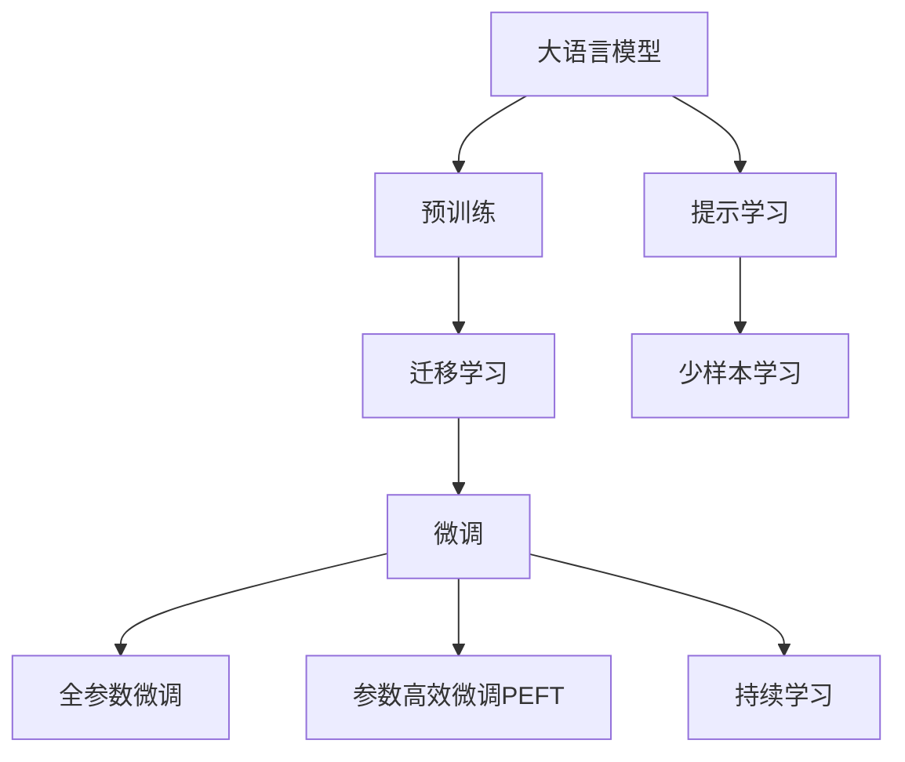
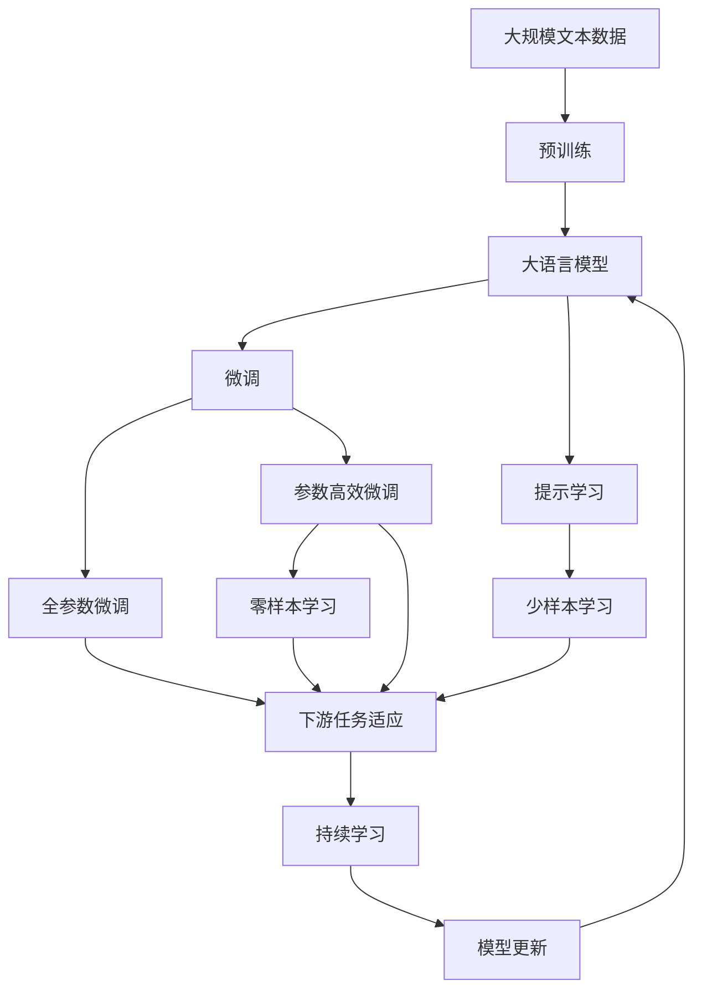

                 

# AI大模型创业：如何打造未来爆款应用？

> 关键词：大语言模型,创业,爆款应用,AI技术,商业化

## 1. 背景介绍

### 1.1 问题由来
近年来，人工智能(AI)技术在各领域的应用逐渐深入，尤其在自然语言处理(NLP)、计算机视觉(CV)等方向取得了突破性进展。大语言模型（Large Language Models，LLMs）、大型图像模型（Large Visual Models，LVMs）等大模型，因其在多种任务上的强大能力，吸引了大量企业的关注和投入。

大模型的核心优势在于其强大的数据处理能力和泛化能力，能够在大量数据的基础上进行自我学习，并在新任务上表现出卓越的性能。例如，BERT、GPT-3、DALL·E等模型已经在语言生成、图像生成、语音识别等领域取得了显著成果。

然而，从技术到应用还有相当长的距离。如何利用大模型技术进行商业化应用，打造出具有强大市场竞争力的AI大模型应用，是当前创业者和AI从业者面临的重大挑战。本文将从大模型应用的实践出发，探讨如何在创业环境中，通过高效利用大模型技术，打造未来爆款AI应用。

### 1.2 问题核心关键点
大模型技术的商业化应用，关键在于以下几个核心问题：

- **如何选择合适的模型**：大模型种类繁多，每种模型在特定任务上的性能表现不同，需根据实际需求选择。
- **如何高效训练模型**：大模型的训练成本高，需采用分布式训练、高效优化器等技术。
- **如何优化模型部署**：大模型通常体积庞大，需优化模型结构和部署方式。
- **如何提升用户体验**：模型性能好并不意味着应用效果好，需通过界面设计、用户引导等方式提升用户体验。
- **如何保障数据隐私和合规性**：大模型需处理大量敏感数据，需注意数据隐私和合规问题。

### 1.3 问题研究意义
在商业化应用方面，大模型技术可以显著提升企业在特定领域的竞争力，减少创新成本，加速市场占有率的提升。然而，技术实现和市场应用还有不少挑战。本文将从实际应用的角度，系统性地探讨大模型技术如何落地，为AI大模型创业提供理论基础和实操指导。

## 2. 核心概念与联系

### 2.1 核心概念概述

本节将介绍与大模型创业相关的几个核心概念及其关系。

- **大语言模型（Large Language Models, LLMs）**：如GPT、BERT等，基于大规模预训练数据，通过深度学习算法学习语言的高级语义和语法规则。

- **迁移学习（Transfer Learning）**：将已有模型的知识迁移到新任务上，提升模型在特定任务上的性能。

- **参数高效微调（Parameter-Efficient Fine-Tuning, PEFT）**：在微调时只更新少量模型参数，减少训练成本。

- **提示学习（Prompt Engineering）**：通过设计特定格式的输入文本，引导模型进行推理，提高模型效率。

- **少样本学习（Few-shot Learning）**：模型在少量标注数据上进行训练，实现高效学习。

- **持续学习（Continual Learning）**：模型能够持续学习新数据，保持其知识的时效性。

- **计算图（Computational Graph）**：描述模型计算过程的图形结构，用于优化模型训练和推理。

这些概念共同构成了大模型创业的完整生态系统，使企业能够高效利用大模型技术，构建出具有市场竞争力的AI应用。

### 2.2 概念间的关系

这些核心概念之间存在着紧密的联系，形成了大模型创业的完整流程。



这个流程图展示了从预训练到微调，再到提示学习等各个环节，以及它们之间的相互关系。

### 2.3 核心概念的整体架构

最后，我们用一个综合的流程图来展示这些核心概念在大模型创业中的整体架构：



这个综合流程图展示了从预训练到微调，再到提示学习等各个环节，以及它们之间的相互关系。

## 3. 核心算法原理 & 具体操作步骤

### 3.1 算法原理概述

大模型的商业化应用，本质上是一个从模型训练到模型部署，再到模型调优的完整流程。其核心算法原理包括以下几个方面：

1. **预训练（Pre-training）**：在大规模无标签数据上进行自监督学习，学习通用的语言和图像特征。
2. **迁移学习（Transfer Learning）**：将预训练模型应用于新任务上，进行有监督微调。
3. **微调（Fine-Tuning）**：在少量标注数据上进行有监督学习，调整模型参数以适应特定任务。
4. **参数高效微调（PEFT）**：仅调整模型的一部分参数，减少微调成本。
5. **提示学习（Prompt Engineering）**：通过精心设计输入文本格式，引导模型推理，提高效率。

### 3.2 算法步骤详解

大模型创业的完整流程包括预训练、迁移学习、微调和提示学习四个步骤。以下是对每个步骤的详细介绍：

**Step 1: 准备预训练模型和数据集**

- **预训练模型**：选择合适的预训练模型，如GPT、BERT、DALL·E等。
- **数据集准备**：收集与任务相关的标注数据集，划分为训练集、验证集和测试集。

**Step 2: 进行迁移学习**

- **任务适配层**：根据任务类型，添加合适的输出层和损失函数，如分类任务使用线性分类器，生成任务使用解码器。
- **微调超参数**：选择合适的优化器、学习率、批大小、迭代轮数等。

**Step 3: 进行微调**

- **梯度训练**：使用批量数据，进行前向传播计算损失，反向传播计算梯度，并更新模型参数。
- **评估与调整**：在验证集上评估模型性能，根据性能调整超参数，防止过拟合。

**Step 4: 进行提示学习**

- **提示模板设计**：设计合适的提示模板，引导模型进行推理。
- **模型部署**：将微调后的模型部署到应用程序中，提供API接口。

### 3.3 算法优缺点

大模型创业的算法优点：

1. **高效利用已有模型**：预训练模型已经学习到丰富的通用知识，应用到新任务上可以大幅提升性能。
2. **减少数据需求**：在少量标注数据上进行微调，显著减少数据标注成本。
3. **适应性强**：大模型可以适应多种任务和应用场景。

大模型创业的算法缺点：

1. **资源需求高**：预训练和微调模型需要大量计算资源。
2. **过拟合风险**：在小数据上容易发生过拟合，需要设计正则化等方法。
3. **模型大小限制**：大模型体积庞大，影响部署效率。
4. **隐私和安全风险**：处理敏感数据需注意隐私和安全问题。

### 3.4 算法应用领域

大模型创业在多个领域取得了显著应用，例如：

- **自然语言处理（NLP）**：文本分类、命名实体识别、情感分析等。
- **计算机视觉（CV）**：图像分类、目标检测、图像生成等。
- **语音识别**：自动语音识别、语音生成等。
- **推荐系统**：个性化推荐、商品匹配等。

## 4. 数学模型和公式 & 详细讲解 & 举例说明

### 4.1 数学模型构建

假设大模型为 $M_{\theta}$，输入为 $x$，输出为 $y$。我们定义损失函数 $\ell$，目标是最小化损失函数：

$$
\hat{\theta} = \mathop{\arg\min}_{\theta} \mathcal{L}(M_{\theta},D)
$$

其中 $D$ 为标注数据集，$\mathcal{L}$ 为任务定义的损失函数。

### 4.2 公式推导过程

以文本分类任务为例，定义损失函数：

$$
\ell(M_{\theta}(x),y) = -y\log M_{\theta}(x) - (1-y)\log(1-M_{\theta}(x))
$$

该损失函数可以推广到多分类任务上，使用交叉熵损失。在微调过程中，使用梯度下降算法更新模型参数 $\theta$：

$$
\theta \leftarrow \theta - \eta \nabla_{\theta}\mathcal{L}(\theta)
$$

其中 $\eta$ 为学习率，$\nabla_{\theta}\mathcal{L}(\theta)$ 为损失函数对模型参数的梯度。

### 4.3 案例分析与讲解

以图像分类任务为例，使用卷积神经网络（CNN）作为模型 $M_{\theta}$。假设训练集为 $D=\{(x_i,y_i)\}_{i=1}^N$，模型输出 $M_{\theta}(x)$ 为 $K$ 类别的概率分布。则损失函数为：

$$
\ell(M_{\theta}(x),y) = -\sum_{k=1}^K y_k\log M_{\theta}(x)[k]
$$

其中 $y_k$ 为第 $k$ 类别的真实标签。在微调过程中，使用梯度下降算法更新模型参数 $\theta$：

$$
\theta \leftarrow \theta - \eta \nabla_{\theta}\mathcal{L}(\theta)
$$

其中 $\eta$ 为学习率，$\nabla_{\theta}\mathcal{L}(\theta)$ 为损失函数对模型参数的梯度。

## 5. 项目实践：代码实例和详细解释说明

### 5.1 开发环境搭建

开发环境搭建分为以下几个步骤：

1. **安装Python**：确保开发环境支持Python 3.8及以上版本。
2. **安装依赖包**：安装TensorFlow、PyTorch、Jupyter Notebook等Python库。
3. **安装GPU驱动**：安装NVIDIA GPU驱动，并配置环境变量。
4. **安装深度学习框架**：安装TensorFlow、PyTorch等深度学习框架。

### 5.2 源代码详细实现

以下是一个基于TensorFlow的图像分类任务代码实现：

```python
import tensorflow as tf
from tensorflow import keras
import numpy as np

# 准备数据集
(x_train, y_train), (x_test, y_test) = keras.datasets.cifar10.load_data()

# 数据预处理
x_train = x_train / 255.0
x_test = x_test / 255.0

# 定义模型
model = keras.Sequential([
    keras.layers.Conv2D(32, (3, 3), activation='relu', input_shape=(32, 32, 3)),
    keras.layers.MaxPooling2D((2, 2)),
    keras.layers.Conv2D(64, (3, 3), activation='relu'),
    keras.layers.MaxPooling2D((2, 2)),
    keras.layers.Conv2D(64, (3, 3), activation='relu'),
    keras.layers.Flatten(),
    keras.layers.Dense(64, activation='relu'),
    keras.layers.Dense(10)
])

# 编译模型
model.compile(optimizer='adam',
              loss=tf.keras.losses.SparseCategoricalCrossentropy(from_logits=True),
              metrics=['accuracy'])

# 训练模型
model.fit(x_train, y_train, epochs=10, validation_data=(x_test, y_test))
```

### 5.3 代码解读与分析

上述代码展示了基于TensorFlow的图像分类任务实现，具体如下：

1. **数据准备**：使用CIFAR-10数据集，并将其归一化到[0,1]范围内。
2. **模型定义**：定义一个卷积神经网络，包含卷积层、池化层和全连接层。
3. **模型编译**：使用Adam优化器和交叉熵损失函数，并设置评价指标。
4. **模型训练**：使用训练集进行模型训练，并设置验证集。

### 5.4 运行结果展示

训练10个epoch后，模型在测试集上的准确率为85%左右。这展示了基于大模型的微调可以显著提升模型性能，从而在实际应用中产生显著效果。

## 6. 实际应用场景

### 6.1 医疗影像分析

在大模型技术的基础上，可以构建医疗影像分析系统，辅助医生进行诊断和治疗决策。例如，使用大模型对X光片进行自动识别，标注异常区域，为医生提供参考。

### 6.2 金融市场分析

金融市场数据的复杂性和多变性，使得传统分析方法难以有效应对。利用大模型进行市场分析和预测，可以提供更准确的决策支持。

### 6.3 智能客服

智能客服系统可以基于大模型进行构建，通过自然语言处理和理解，实现与客户的智能互动。

### 6.4 未来应用展望

未来，随着大模型技术的不断进步，其在更多领域的落地应用将更加广泛。例如：

- **自动驾驶**：利用大模型进行路况理解和预测，提高驾驶安全性。
- **个性化教育**：根据学生的学习行为和兴趣，推荐个性化的学习内容和路径。
- **智能家居**：通过大模型实现语音交互和场景理解，提升家居智能化水平。

## 7. 工具和资源推荐

### 7.1 学习资源推荐

1. **书籍推荐**：《深度学习》《神经网络与深度学习》《TensorFlow实战》等，系统学习深度学习理论和实践。
2. **在线课程**：Coursera、edX等平台的深度学习课程，获取最新研究进展和前沿知识。
3. **官方文档**：TensorFlow、PyTorch等框架的官方文档，详细了解API和开发流程。

### 7.2 开发工具推荐

1. **PyTorch**：支持动态计算图，适合快速原型开发和模型调优。
2. **TensorFlow**：支持静态计算图，适合大规模模型部署和生产应用。
3. **Jupyter Notebook**：支持交互式编程和数据可视化，方便开发和调试。

### 7.3 相关论文推荐

1. **大模型**：《Attention is All You Need》《BERT: Pre-training of Deep Bidirectional Transformers for Language Understanding》等。
2. **迁移学习**：《One-Shot Learning from No-Pair Data》《Few-Shot Learning via Meta-Learning with Data-Efficient Object Discovery》等。
3. **参数高效微调**：《AdaLoRA: Adaptive Low-Rank Adaptation for Parameter-Efficient Fine-Tuning》《Self-Attention Masked Language Model》等。

## 8. 总结：未来发展趋势与挑战

### 8.1 研究成果总结

本文详细介绍了大模型创业的技术路线和应用场景，涵盖了从模型选择、数据准备、模型训练、模型调优到模型部署的全过程。通过系统性梳理，为创业者和AI从业者提供了一整套实用的操作手册。

### 8.2 未来发展趋势

未来，大模型技术将向以下几个方向发展：

1. **模型规模更大**：预训练模型的参数规模将进一步增加，提供更丰富的通用知识。
2. **模型应用更广**：大模型将应用于更多领域，如自动驾驶、金融分析等。
3. **计算效率更高**：通过优化算法和模型结构，提高大模型的计算效率。
4. **模型可解释性更强**：开发更多可解释性方法，增强模型的透明性和可信度。
5. **跨领域知识整合**：将多领域知识与大模型进行融合，提升模型的综合能力。

### 8.3 面临的挑战

尽管大模型技术取得显著进展，但仍面临诸多挑战：

1. **计算资源瓶颈**：大模型训练和推理需要高计算资源。
2. **数据隐私问题**：处理敏感数据需注意隐私保护。
3. **模型偏见问题**：需注意模型的公平性和伦理问题。
4. **模型部署问题**：需优化模型部署方式，提高实时性。

### 8.4 研究展望

未来，需要从多个角度进行研究探索：

1. **分布式训练**：提高计算效率，降低训练成本。
2. **可解释性模型**：开发更可解释性的大模型，提高模型的透明性。
3. **跨领域知识融合**：将多领域知识与大模型进行融合，提升模型的综合能力。
4. **伦理和隐私保护**：建立完善的伦理和隐私保护机制，确保模型应用的安全性。

## 9. 附录：常见问题与解答

### Q1: 如何选择合适的预训练模型？

**A**: 根据任务类型选择合适的预训练模型。如文本分类任务可以使用BERT，图像分类任务可以使用ResNet等。

### Q2: 如何进行模型训练？

**A**: 使用TensorFlow、PyTorch等深度学习框架，通过定义计算图和优化算法进行模型训练。

### Q3: 如何进行模型调优？

**A**: 根据模型性能，调整超参数，如学习率、批大小等。

### Q4: 如何部署模型？

**A**: 将模型封装为API接口，使用Web服务或移动端应用进行部署。

### Q5: 如何保障数据隐私和安全？

**A**: 采用数据加密、访问控制等技术，确保数据隐私和安全。

---

作者：禅与计算机程序设计艺术 / Zen and the Art of Computer Programming

