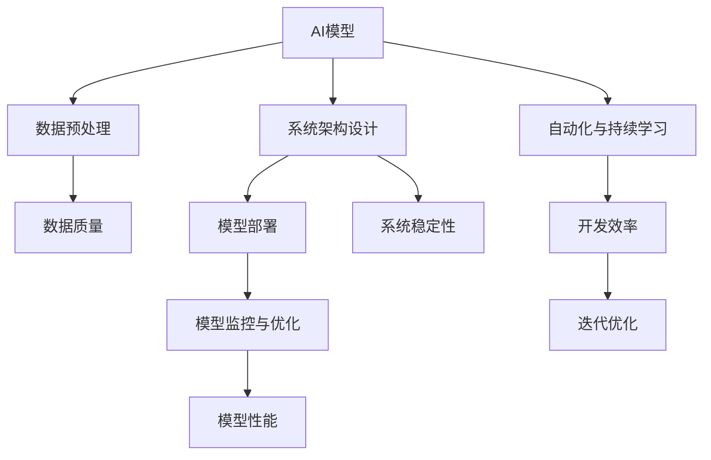
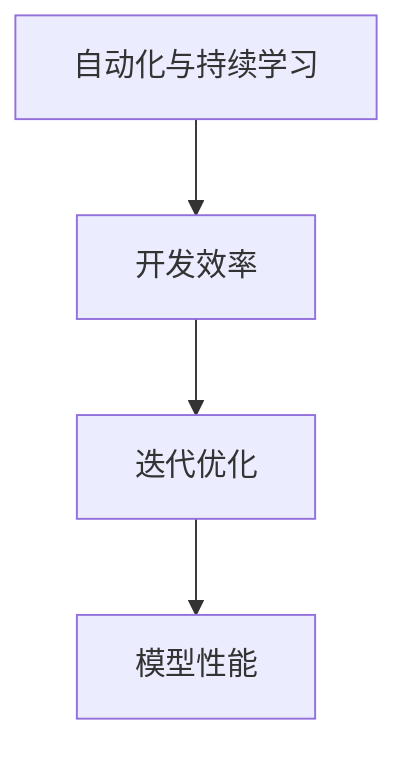
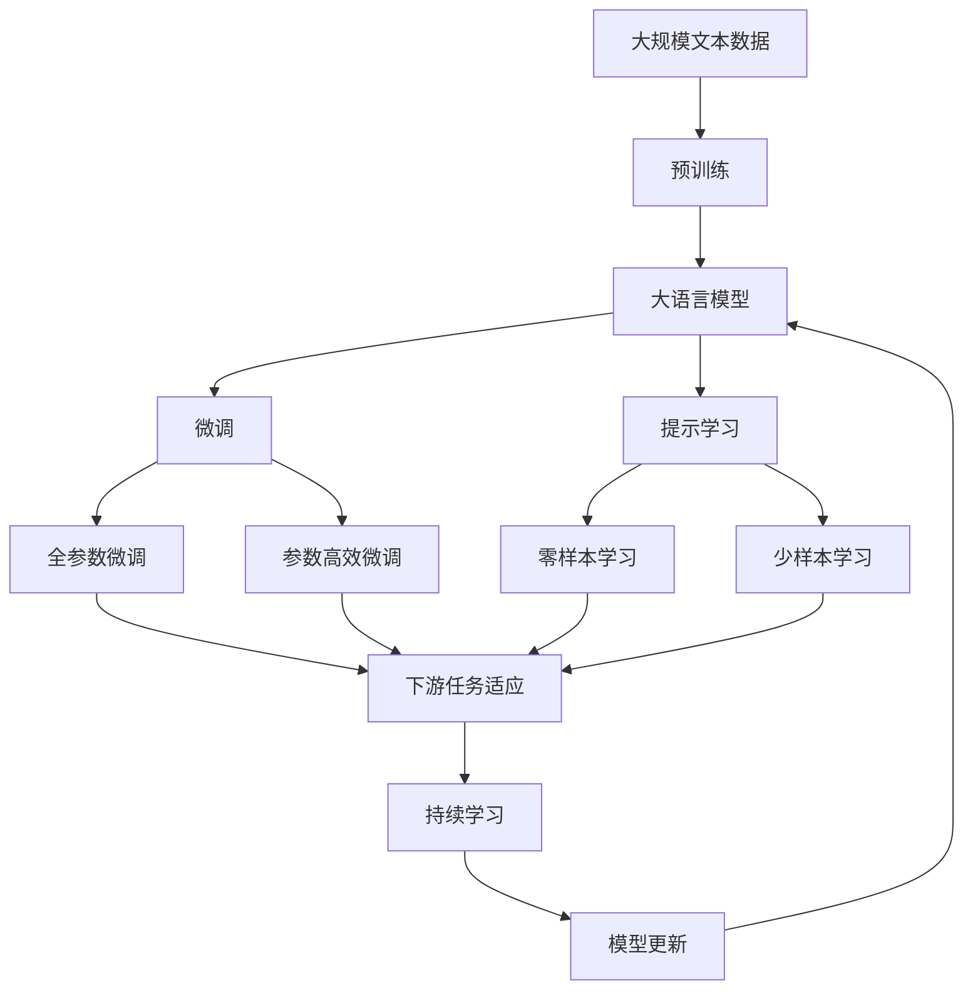

                 

# AI工程学：应用开发实战手册

> 关键词：AI工程、应用开发、模型部署、数据处理、算法优化、自动化

## 1. 背景介绍

### 1.1 问题由来
人工智能（AI）正以前所未有的速度渗透到各行各业，成为推动经济和社会发展的重要力量。然而，将AI技术从实验室转化为实际应用，需要大量的工程实践和系统开发工作，这便孕育了“AI工程学”这一新的研究领域。AI工程学不仅包括算法研究，还涵盖系统架构、软件开发、数据处理、模型优化等多个方面。

AI工程学的研究背景主要来源于以下几个方面：

- **应用需求驱动**：各行各业对AI技术的需求日益增加，如自动驾驶、金融风险管理、智能推荐系统等。但这些应用场景往往涉及复杂的业务逻辑和技术细节，AI研究者需要更深入地了解工程实践。
- **工程效率瓶颈**：当前AI技术的应用推广过程中，存在数据处理、模型部署、算法优化等工程效率瓶颈。通过系统化的方法，可以大幅提升AI应用的开发效率和质量。
- **多学科融合**：AI工程学涉及计算机科学、统计学、运筹学、软件工程等多个学科，需要多学科融合的视角和思路。

### 1.2 问题核心关键点
AI工程学的核心关键点包括：

- **模型选择与优化**：如何根据任务需求选择合适的AI模型，并对模型进行高效优化，提升模型性能。
- **数据预处理与清洗**：高质量的数据是模型训练的基础，如何进行有效的数据预处理和清洗，去除噪声，提升数据质量。
- **系统架构设计**：如何将AI模型集成到应用系统中，设计高效稳定的系统架构，保证系统可靠性。
- **模型部署与监控**：如何将训练好的模型部署到生产环境，并进行实时的监控和优化。
- **自动化与持续学习**：如何自动化模型训练和部署流程，实现模型的持续学习与迭代优化。

### 1.3 问题研究意义
AI工程学的研究对于推动AI技术的实际应用具有重要意义：

- **提升应用效率**：通过系统化的方法，可以显著提升AI应用的开发效率，缩短从研究到应用的周期。
- **优化模型性能**：通过科学的模型选择与优化，可以提升模型在实际应用中的性能表现，增强系统实用性。
- **保障系统稳定性**：通过合理的数据预处理和系统架构设计，可以确保AI系统的稳定性和可靠性，减少运行故障。
- **促进持续创新**：通过自动化与持续学习技术，可以实现模型的持续迭代和优化，保持系统的前沿性和竞争力。

## 2. 核心概念与联系

### 2.1 核心概念概述

为更好地理解AI工程学的核心概念，本节将介绍几个密切相关的核心概念：

- **AI模型**：用于解决特定问题的算法模型，如线性回归、卷积神经网络（CNN）、递归神经网络（RNN）、Transformer等。
- **数据预处理**：对原始数据进行清洗、归一化、编码等操作，提升数据质量。
- **系统架构设计**：如何将AI模型集成到应用系统中，设计高效稳定的系统架构。
- **模型部署**：将训练好的模型部署到生产环境，供实际应用使用。
- **模型监控与优化**：实时监控模型的性能指标，根据反馈进行模型优化。
- **自动化与持续学习**：通过自动化技术实现模型训练和部署流程，利用持续学习技术提升模型性能。

这些核心概念之间的逻辑关系可以通过以下Mermaid流程图来展示：



这个流程图展示了大语言模型微调过程中各个核心概念之间的关系：

1. AI模型是AI工程学的核心，其他概念都是围绕模型构建和优化展开。
2. 数据预处理提升数据质量，为模型训练提供良好的数据基础。
3. 系统架构设计保障系统稳定性，确保模型在生产环境中的可靠运行。
4. 模型部署将模型嵌入到实际应用中，进行规模化应用。
5. 模型监控与优化实时监控模型性能，及时发现并修复问题。
6. 自动化与持续学习提升开发效率，实现模型的持续优化和迭代。

### 2.2 概念间的关系

这些核心概念之间存在着紧密的联系，形成了AI工程学的完整生态系统。下面我们通过几个Mermaid流程图来展示这些概念之间的关系。

#### 2.2.1 AI模型与数据预处理的关系


这个流程图展示了数据预处理对模型性能的直接影响。

#### 2.2.2 系统架构设计与模型部署的关系


这个流程图展示了系统架构设计对模型部署和应用效果的影响。

#### 2.2.3 自动化与持续学习对AI工程学整体的影响



这个流程图展示了自动化与持续学习对开发效率和模型性能的提升作用。

### 2.3 核心概念的整体架构

最后，我们用一个综合的流程图来展示这些核心概念在大语言模型微调过程中的整体架构：



这个综合流程图展示了从预训练到微调，再到持续学习的完整过程。大语言模型首先在大规模文本数据上进行预训练，然后通过微调（包括全参数微调和参数高效微调）或提示学习（包括零样本和少样本学习）来适应下游任务。最后，通过持续学习技术，模型可以不断学习新知识，同时避免遗忘旧知识。

## 3. 核心算法原理 & 具体操作步骤
### 3.1 算法原理概述

AI工程学的核心算法原理主要包括模型选择与优化、数据预处理、系统架构设计、模型部署与监控、自动化与持续学习等方面。

#### 3.1.1 模型选择与优化

模型选择与优化的目标是找到最适合特定任务的最佳模型，并通过一系列优化方法提升模型性能。常见的优化方法包括：

- **超参数调优**：通过网格搜索、随机搜索等方法，找到最佳的超参数组合。
- **正则化**：如L1正则、L2正则、Dropout等，防止过拟合。
- **学习率调整**：选择合适的学习率，避免模型在训练过程中发散或过早收敛。
- **损失函数设计**：根据任务特点选择合适的损失函数，如均方误差、交叉熵等。
- **集成学习**：通过模型集成技术，提升模型泛化能力和鲁棒性。

#### 3.1.2 数据预处理

数据预处理的目的是提升数据质量，为模型训练提供良好的数据基础。常见的预处理步骤包括：

- **数据清洗**：去除噪声、缺失值等异常数据，保证数据一致性。
- **数据编码**：将文本、图像等原始数据编码成模型可以处理的数字格式，如词嵌入、图像特征等。
- **数据归一化**：对数据进行归一化处理，如标准化、归一化等，提升数据质量。
- **数据增强**：通过数据增强技术，如旋转、平移、缩放等，扩充训练数据集，提升模型泛化能力。

#### 3.1.3 系统架构设计

系统架构设计的目标是设计高效稳定的系统架构，确保AI模型在生产环境中的可靠运行。常见的系统架构设计方法包括：

- **模块化设计**：将系统划分为多个模块，每个模块独立开发和维护，提高系统可维护性。
- **分布式架构**：将系统部署在多台服务器上，实现负载均衡和故障转移，提升系统稳定性。
- **容器化技术**：使用Docker、Kubernetes等容器化技术，实现系统自动化部署和扩展。
- **微服务架构**：将系统划分为多个微服务，每个微服务独立开发和部署，提升系统灵活性。

#### 3.1.4 模型部署

模型部署是将训练好的模型嵌入到实际应用中的过程。常见的模型部署方法包括：

- **模型导出**：将训练好的模型导出为模型文件，供生产环境使用。
- **模型加载**：在生产环境中将模型加载到系统中，进行实时推理。
- **API设计**：设计模型API接口，提供模型调用接口，便于系统集成。
- **模型版本管理**：对不同版本的模型进行版本管理，确保系统稳定性和可追溯性。

#### 3.1.5 模型监控与优化

模型监控与优化的目的是实时监控模型性能，及时发现并修复问题，提升模型性能。常见的模型监控与优化方法包括：

- **性能指标监控**：实时监控模型性能指标，如准确率、召回率、F1分数等。
- **异常检测**：通过异常检测技术，及时发现模型异常，进行修复。
- **超参数调整**：根据监控结果，调整模型超参数，提升模型性能。
- **模型更新**：定期更新模型，保持模型最新状态。

#### 3.1.6 自动化与持续学习

自动化与持续学习的目的是提升开发效率，实现模型的持续优化和迭代。常见的自动化与持续学习技术包括：

- **自动化工具链**：使用自动化工具链，如Jenkins、GitLab CI/CD等，实现模型训练、部署、监控的自动化。
- **持续学习框架**：使用持续学习框架，如NICE、TorchRec等，实现模型的持续学习与优化。
- **自动化测试**：通过自动化测试技术，确保模型在部署前的稳定性和可靠性。

### 3.2 算法步骤详解

AI工程学的核心算法步骤主要包括模型选择与优化、数据预处理、系统架构设计、模型部署与监控、自动化与持续学习等方面。

#### 3.2.1 模型选择与优化的详细步骤

1. **数据理解**：对数据进行初步分析，理解数据特点和任务需求。
2. **模型选择**：根据任务需求选择合适的模型，如线性回归、CNN、RNN、Transformer等。
3. **超参数调优**：使用网格搜索、随机搜索等方法，找到最佳的超参数组合。
4. **模型训练**：使用训练数据集进行模型训练，提升模型性能。
5. **模型评估**：使用测试数据集进行模型评估，验证模型性能。
6. **模型优化**：根据评估结果，调整模型结构和超参数，优化模型性能。
7. **模型集成**：使用模型集成技术，提升模型泛化能力和鲁棒性。

#### 3.2.2 数据预处理的详细步骤

1. **数据清洗**：去除噪声、缺失值等异常数据，保证数据一致性。
2. **数据编码**：将文本、图像等原始数据编码成模型可以处理的数字格式，如词嵌入、图像特征等。
3. **数据归一化**：对数据进行归一化处理，如标准化、归一化等，提升数据质量。
4. **数据增强**：通过数据增强技术，如旋转、平移、缩放等，扩充训练数据集，提升模型泛化能力。

#### 3.2.3 系统架构设计的详细步骤

1. **模块划分**：将系统划分为多个模块，每个模块独立开发和维护，提高系统可维护性。
2. **分布式架构设计**：将系统部署在多台服务器上，实现负载均衡和故障转移，提升系统稳定性。
3. **容器化设计**：使用Docker、Kubernetes等容器化技术，实现系统自动化部署和扩展。
4. **微服务架构设计**：将系统划分为多个微服务，每个微服务独立开发和部署，提升系统灵活性。

#### 3.2.4 模型部署的详细步骤

1. **模型导出**：将训练好的模型导出为模型文件，供生产环境使用。
2. **模型加载**：在生产环境中将模型加载到系统中，进行实时推理。
3. **API设计**：设计模型API接口，提供模型调用接口，便于系统集成。
4. **模型版本管理**：对不同版本的模型进行版本管理，确保系统稳定性和可追溯性。

#### 3.2.5 模型监控与优化的详细步骤

1. **性能指标监控**：实时监控模型性能指标，如准确率、召回率、F1分数等。
2. **异常检测**：通过异常检测技术，及时发现模型异常，进行修复。
3. **超参数调整**：根据监控结果，调整模型超参数，提升模型性能。
4. **模型更新**：定期更新模型，保持模型最新状态。

#### 3.2.6 自动化与持续学习的详细步骤

1. **自动化工具链配置**：使用自动化工具链，如Jenkins、GitLab CI/CD等，实现模型训练、部署、监控的自动化。
2. **持续学习框架配置**：使用持续学习框架，如NICE、TorchRec等，实现模型的持续学习与优化。
3. **自动化测试配置**：通过自动化测试技术，确保模型在部署前的稳定性和可靠性。

### 3.3 算法优缺点

AI工程学的核心算法具有以下优点：

- **提升模型性能**：通过模型选择与优化、数据预处理、系统架构设计等技术，可以显著提升模型在实际应用中的性能。
- **保证系统稳定性**：通过系统架构设计和模型部署等技术，可以确保系统在生产环境中的稳定性和可靠性。
- **提升开发效率**：通过自动化与持续学习等技术，可以显著提升AI应用的开发效率，缩短从研究到应用的周期。

然而，AI工程学也存在以下缺点：

- **技术门槛高**：需要掌握多种技术栈和工具，对开发人员的技术要求较高。
- **数据需求大**：高质量的数据是模型训练的基础，数据收集和预处理需要大量时间和资源。
- **系统复杂度高**：系统架构设计和模型部署等技术，需要系统性思考，设计复杂的系统架构。
- **成本高**：系统开发和部署需要投入大量人力、物力和财力，成本较高。

### 3.4 算法应用领域

AI工程学的核心算法原理和操作步骤广泛应用于以下领域：

1. **自动驾驶**：将AI模型嵌入到自动驾驶系统中，实现环境感知、决策规划等功能。
2. **金融风险管理**：使用AI模型进行信用评分、风险预测、欺诈检测等，提升金融风险管理能力。
3. **智能推荐系统**：通过AI模型进行用户行为分析和推荐预测，提升推荐系统的个性化和精准度。
4. **医疗影像分析**：使用AI模型进行医疗影像分析、疾病诊断、治疗方案推荐等，提升医疗服务水平。
5. **智能客服**：使用AI模型进行自然语言处理、情感分析、语义理解等功能，提升客户服务体验。
6. **自然语言处理**：使用AI模型进行文本分类、命名实体识别、情感分析等功能，提升自然语言处理能力。

## 4. 数学模型和公式 & 详细讲解 & 举例说明

### 4.1 数学模型构建

AI工程学中涉及的数学模型包括模型选择与优化、数据预处理、系统架构设计、模型部署与监控、自动化与持续学习等方面。

#### 4.1.1 模型选择与优化的数学模型

1. **超参数调优**：使用网格搜索、随机搜索等方法，找到最佳的超参数组合。
2. **正则化**：如L1正则、L2正则、Dropout等，防止过拟合。
3. **学习率调整**：选择合适的学习率，避免模型在训练过程中发散或过早收敛。
4. **损失函数设计**：根据任务特点选择合适的损失函数，如均方误差、交叉熵等。

#### 4.1.2 数据预处理的数学模型

1. **数据清洗**：去除噪声、缺失值等异常数据，保证数据一致性。
2. **数据编码**：将文本、图像等原始数据编码成模型可以处理的数字格式，如词嵌入、图像特征等。
3. **数据归一化**：对数据进行归一化处理，如标准化、归一化等，提升数据质量。
4. **数据增强**：通过数据增强技术，如旋转、平移、缩放等，扩充训练数据集，提升模型泛化能力。

#### 4.1.3 系统架构设计的数学模型

1. **模块划分**：将系统划分为多个模块，每个模块独立开发和维护，提高系统可维护性。
2. **分布式架构设计**：将系统部署在多台服务器上，实现负载均衡和故障转移，提升系统稳定性。
3. **容器化设计**：使用Docker、Kubernetes等容器化技术，实现系统自动化部署和扩展。
4. **微服务架构设计**：将系统划分为多个微服务，每个微服务独立开发和部署，提升系统灵活性。

#### 4.1.4 模型部署的数学模型

1. **模型导出**：将训练好的模型导出为模型文件，供生产环境使用。
2. **模型加载**：在生产环境中将模型加载到系统中，进行实时推理。
3. **API设计**：设计模型API接口，提供模型调用接口，便于系统集成。
4. **模型版本管理**：对不同版本的模型进行版本管理，确保系统稳定性和可追溯性。

#### 4.1.5 模型监控与优化的数学模型

1. **性能指标监控**：实时监控模型性能指标，如准确率、召回率、F1分数等。
2. **异常检测**：通过异常检测技术，及时发现模型异常，进行修复。
3. **超参数调整**：根据监控结果，调整模型超参数，提升模型性能。
4. **模型更新**：定期更新模型，保持模型最新状态。

#### 4.1.6 自动化与持续学习的数学模型

1. **自动化工具链配置**：使用自动化工具链，如Jenkins、GitLab CI/CD等，实现模型训练、部署、监控的自动化。
2. **持续学习框架配置**：使用持续学习框架，如NICE、TorchRec等，实现模型的持续学习与优化。
3. **自动化测试配置**：通过自动化测试技术，确保模型在部署前的稳定性和可靠性。

### 4.2 公式推导过程

以下我们将以线性回归模型的超参数调优为例，推导其数学模型和公式。

假设数据集为$(x_i, y_i), i=1,2,...,N$，其中$x_i \in \mathbb{R}^d$为输入，$y_i \in \mathbb{R}$为输出。线性回归模型的目标是最小化均方误差（Mean Squared Error, MSE）损失函数：

$$
\mathcal{L}(w, b) = \frac{1}{N} \sum_{i=1}^N (y_i - w^T x_i - b)^2
$$

其中$w \in \mathbb{R}^d$为模型权重，$b \in \mathbb{R}$为偏置。

为了找到最优的$w$和$b$，我们需要对损失函数进行最小化。根据链式法则，求导得到：

$$
\frac{\partial \mathcal{L}(w, b)}{\partial w_k} = -\frac{2}{N} \sum_{i=1}^N (y_i - w^T x_i - b) x_{ik}
$$

$$
\frac{\partial \mathcal{L}(w, b)}{\partial b} = -\frac{2}{N} \sum_{i=1}^N (y_i - w^T x_i - b)
$$

根据上述梯度公式，我们可以使用梯度下降算法（Gradient Descent）更新模型参数：

$$
w \leftarrow w - \eta \nabla_w \mathcal{L}(w, b)
$$

$$
b \leftarrow b - \eta \nabla_b \mathcal{L}(w, b)
$$

其中$\eta$为学习率，$\nabla_w \mathcal{L}(w, b)$和$\nabla_b \mathcal{L}(w, b)$分别为损失函数对$w$和$b$的梯度。

在实际应用中，超参数调优还需要考虑模型复杂度、训练时间等因素。通常可以使用交叉验证等方法，找到最优的超参数组合。例如，对于正则化参数$\lambda$，我们可以使用网格搜索方法进行调优：

$$
\lambda \in \{\lambda_1, \lambda_2, ..., \lambda_n\}
$$

对于每个$\lambda$值，我们进行模型训练和验证，记录验证集的损失函数值，选择损失函数值最小的$\lambda$值作为最优超参数。

### 4.3 案例分析与讲解

以图像分类任务为例，我们分析其在AI工程学中的数据预处理、模型训练和部署过程。

#### 4.3.1 数据预处理

1. **数据清洗**：去除噪声、缺失值等异常数据，保证数据一致性。
2. **数据增强**：通过旋转、平移、缩放等操作，扩充训练数据集，提升模型泛化能力。

#### 4.3.2 模型训练

1. **模型选择**：选择适当的神经网络模型，如卷积神经网络（CNN）。
2. **数据编码**：将图像数据编码成模型可以处理的数字格式，如像素值。
3. **数据归一化**：对数据进行归一化处理，如标准化、归一化等，提升数据质量。
4. **模型训练**：使用训练数据集进行模型训练，提升模型性能。

#### 4.3.3 模型部署

1. **模型导出**：将训练好的模型导出为模型文件，供生产环境使用。
2. **模型加载**：在生产环境中将模型加载到系统中，进行实时推理。
3. **API设计**：设计模型API接口，提供模型调用接口，便于系统集成。
4. **模型版本管理**：对不同版本的模型进行版本管理，确保系统稳定性和可追溯性。

## 5. 项目实践：代码实例和详细解释说明

### 5.1 开发环境搭建

在进行AI工程学实践前，我们需要准备好开发环境。以下是使用Python进行PyTorch开发的环境配置流程：

1. 安装Anaconda：从官网下载并安装Anaconda，用于创建独立的Python环境。

2. 创建并激活虚拟环境：
```bash
conda create -n pytorch-env python=3.8 
conda activate pytorch-env
```

3. 安装PyTorch：根据CUDA版本，从官网获取对应的安装命令。例如：
```bash
conda install pytorch torchvision torchaudio cudatoolkit=11.1 -c pytorch -c conda-forge
```

4. 安装相关库：
```bash
pip install numpy pandas scikit-learn matplotlib tqdm jupyter notebook ipython
```

完成上述步骤后，即可在`pytorch-env`环境中开始AI工程学实践。

### 5.2 源代码详细实现

下面我们以图像分类任务为例，给出使用PyTorch进行CNN模型训练的PyTorch代码实现。

首先，定义模型和优化器：

```python
from torch import nn
from torch.nn import functional as F

class CNN(nn.Module):
    def __init__(self):
        super(CNN, self).__init__()
        self.conv1 = nn.Conv2d(3, 32, 3)
        self.pool = nn.MaxPool2d(2, 2)
        self.conv2 = nn.Conv2d(32, 64, 3)
        self.fc = nn.Linear(64 * 7 * 7, 10)

    def forward(self, x):
        x = self.pool(F.relu(self.conv1(x)))
        x = self.pool(F.relu(self.conv2(x)))
        x = x.view(-1, 64 * 7 * 7)
        x = self.fc(x)
        return F.softmax(x, dim=1)

model = CNN()
optimizer = torch.optim.Adam(model.parameters(), lr=0.001)

```

接着，定义训练和评估函数：

```python
from torch.utils.data import DataLoader

device = torch.device('cuda' if torch.cuda.is_available() else 'cpu')
model.to(device)

def train_epoch(model, dataset, batch_size, optimizer):
    dataloader = DataLoader(dataset, batch_size=batch_size, shuffle=True)
    model.train()
    epoch_loss = 0
    for batch in dataloader:
        inputs, labels = batch[0].to(device), batch[1].to(device)
        model.zero_grad()
        outputs = model(inputs)
        loss = F.cross_entropy(outputs, labels)
        epoch_loss += loss.item()
        loss.backward()
        optimizer.step()
    return epoch_loss / len(dataloader)

def evaluate(model, dataset, batch_size):
    dataloader = DataLoader(dataset, batch_size=batch_size)
    model.eval

