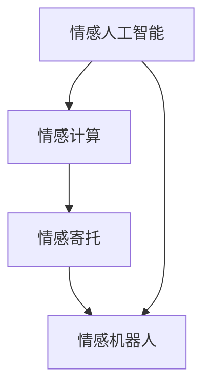
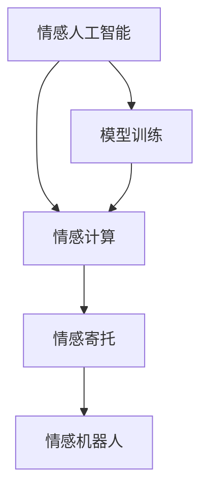
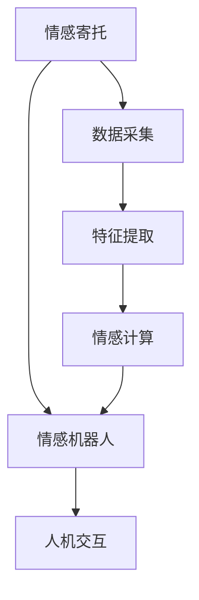
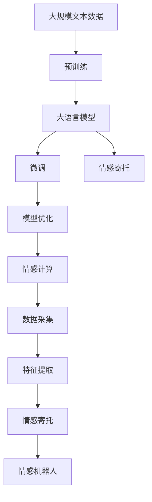

                 

## 1. 背景介绍

随着人工智能技术的不断发展，AI技术已经开始渗透到我们生活的方方面面，从智能音箱、智能家居到无人驾驶、医疗诊断，都在逐渐实现智能化。但是，这些智能化的技术往往是冷冰冰的，缺乏人类情感的交流和互动，这使得人们在面对智能技术时，往往会产生冷漠、疏离感。因此，如何让AI技术更加人性化，实现与用户的情感交流，成为了当前人工智能技术发展的一个热门话题。

情感寄托，指的是人类在与他人或物体互动时，将情感赋予其中，通过情感的传递与交流，达到沟通的目的。而将情感寄托与AI技术相结合，意味着AI系统不仅仅需要具备智能化的功能，还需要能够理解和表达情感，从而更好地满足人类的情感需求。

## 2. 核心概念与联系

### 2.1 核心概念概述

为更好地理解AI技术与情感寄托的结合，我们需要首先明确一些核心概念：

- **情感人工智能（Emotional Artificial Intelligence）**：指的是AI系统具备识别、理解、表达人类情感的能力。情感人工智能的核心在于对人类情感的理解和应用，以实现更加人性化的交互。
- **情感计算（Affective Computing）**：指的是利用计算机技术对人类情感进行识别和分析。情感计算通常包括面部表情识别、语音情感分析、生理信号监测等多种技术。
- **情感机器人（Emotional Robots）**：指的是具备情感理解和表达能力的机器人。情感机器人可以通过语音、面部表情、身体语言等方式与人类进行情感交流。
- **情感寄托（Emotional Attachment）**：指的是人类对某物或某人的情感依恋，通过情感寄托，人类可以更好地与外界进行互动。

这些核心概念之间的联系，可以通过以下Mermaid流程图来展示：



这个流程图展示了大语言模型微调过程中，各个概念之间的逻辑关系：

1. 情感人工智能是核心目标，需要通过情感计算和情感寄托来实现。
2. 情感计算是手段，用于识别和分析人类情感。
3. 情感寄托是结果，是情感计算应用于实际场景后的产物。
4. 情感机器人是应用，通过情感寄托实现与人类情感交流。

### 2.2 概念间的关系

这些核心概念之间存在着紧密的联系，形成了AI技术与情感寄托结合的完整生态系统。下面我们通过几个Mermaid流程图来展示这些概念之间的关系。

#### 2.2.1 情感人工智能的实现



这个流程图展示了大语言模型微调过程中，情感人工智能的实现路径：

1. 情感人工智能通过情感计算获取情感信息。
2. 情感寄托将情感信息应用于实际场景。
3. 情感机器人通过情感寄托实现与人类情感交流。

#### 2.2.2 情感计算与情感寄托的融合


这个流程图展示了大语言模型微调过程中，情感计算与情感寄托的融合过程：

1. 情感计算从数据采集和特征提取开始。
2. 情感寄托将情感计算的结果应用于实际场景。
3. 情感机器人通过情感寄托实现与人类情感交流。

#### 2.2.3 情感寄托在实际场景中的应用



这个流程图展示了大语言模型微调过程中，情感寄托在实际场景中的应用：

1. 情感寄托通过数据采集和特征提取获得情感信息。
2. 情感计算对情感信息进行处理。
3. 情感寄托将情感计算的结果应用于实际场景。
4. 情感机器人通过情感寄托实现与人类情感交流。

### 2.3 核心概念的整体架构

最后，我们用一个综合的流程图来展示这些核心概念在大语言模型微调过程中的整体架构：



这个综合流程图展示了从预训练到微调，再到情感寄托的完整过程。大语言模型首先在大规模文本数据上进行预训练，然后通过微调（包括情感寄托）优化模型在特定情感场景下的表现。最后，通过情感计算和情感寄托，实现与人类情感的交流和互动。

## 3. 核心算法原理 & 具体操作步骤

### 3.1 算法原理概述

将情感寄托与AI技术相结合的核心算法原理是基于深度学习和自然语言处理的模型训练和优化。具体来说，情感寄托的实现主要包括以下几个步骤：

1. **情感计算**：通过深度学习模型对人类情感进行识别和分析，获取情感信息。
2. **情感寄托**：将情感计算的结果应用于实际场景，实现情感寄托。
3. **情感机器人**：通过情感寄托实现与人类情感交流。

### 3.2 算法步骤详解

下面是情感寄托的具体实现步骤：

#### 3.2.1 情感计算

情感计算主要通过深度学习模型对人类情感进行识别和分析。以下是情感计算的主要步骤：

1. **数据采集**：通过摄像头、麦克风、传感器等设备，采集人类面部表情、语音、生理信号等数据。
2. **特征提取**：使用深度学习模型对采集到的数据进行特征提取，得到情感特征向量。
3. **情感识别**：使用深度学习模型对特征向量进行分类，识别出人类情感类型。

#### 3.2.2 情感寄托

情感寄托是将情感计算的结果应用于实际场景，实现情感寄托。以下是情感寄托的主要步骤：

1. **模型训练**：使用深度学习模型对情感计算的结果进行训练，得到情感寄托模型。
2. **情感寄托应用**：将情感寄托模型应用于实际场景，实现情感寄托。
3. **模型优化**：根据实际应用效果，对情感寄托模型进行优化，提升情感寄托效果。

#### 3.2.3 情感机器人

情感机器人是情感寄托的最终应用，通过情感寄托实现与人类情感交流。以下是情感机器人的主要步骤：

1. **模型集成**：将情感寄托模型集成到情感机器人中，实现情感交流。
2. **交互设计**：设计情感机器人与人类交互的界面和流程，提升用户体验。
3. **情感反馈**：通过情感寄托模型获取用户情感信息，调整情感机器人的交互策略。

### 3.3 算法优缺点

情感寄托的优点包括：

1. **人性化交互**：通过情感寄托，AI系统能够更好地理解人类情感，实现更加人性化的交互。
2. **提升用户体验**：通过情感寄托，用户在使用AI系统时能够感受到更多的温暖和关怀。
3. **情感支持**：通过情感寄托，AI系统能够提供情感支持，帮助用户缓解情感压力。

情感寄托的缺点包括：

1. **复杂性高**：情感寄托需要采集和分析多种人类情感信息，技术难度较高。
2. **数据依赖性高**：情感寄托需要大量的标注数据进行模型训练，数据采集成本较高。
3. **隐私问题**：情感寄托需要采集用户的面部表情、语音等敏感信息，可能存在隐私泄露的风险。

### 3.4 算法应用领域

情感寄托可以应用于多种场景，以下是其主要应用领域：

1. **智能客服**：通过情感寄托，智能客服能够更好地理解用户情感，提升服务质量。
2. **医疗健康**：通过情感寄托，医疗健康系统能够更好地关注患者情感，提升医疗体验。
3. **教育培训**：通过情感寄托，教育培训系统能够更好地关注学生情感，提升教学效果。
4. **智能家居**：通过情感寄托，智能家居系统能够更好地理解用户情感，提升生活体验。
5. **人机交互**：通过情感寄托，人机交互系统能够更好地理解人类情感，提升用户体验。

## 4. 数学模型和公式 & 详细讲解 & 举例说明

### 4.1 数学模型构建

情感寄托的数学模型主要包括以下几个方面：

1. **情感计算模型**：使用深度学习模型对人类情感进行识别和分析，得到情感特征向量。
2. **情感寄托模型**：使用深度学习模型对情感计算的结果进行训练，得到情感寄托模型。
3. **情感机器人模型**：使用深度学习模型对情感寄托的结果进行优化，得到情感机器人模型。

#### 4.1.1 情感计算模型

情感计算模型可以使用卷积神经网络（CNN）、循环神经网络（RNN）或变分自编码器（VAE）等深度学习模型。以下是情感计算模型的数学模型构建：

$$
\boldsymbol{y} = \boldsymbol{W}_s \boldsymbol{x} + \boldsymbol{b}_s + \boldsymbol{U}_e \boldsymbol{e}
$$

其中，$\boldsymbol{x}$表示输入数据，$\boldsymbol{y}$表示输出情感特征向量，$\boldsymbol{W}_s$表示卷积核权重，$\boldsymbol{b}_s$表示卷积偏置，$\boldsymbol{U}_e$表示情感特征向量矩阵。

#### 4.1.2 情感寄托模型

情感寄托模型可以使用长短期记忆网络（LSTM）或门控循环单元（GRU）等深度学习模型。以下是情感寄托模型的数学模型构建：

$$
\boldsymbol{h} = \boldsymbol{W}_h \boldsymbol{x} + \boldsymbol{b}_h
$$

其中，$\boldsymbol{x}$表示输入数据，$\boldsymbol{h}$表示情感寄托输出，$\boldsymbol{W}_h$表示情感寄托权重，$\boldsymbol{b}_h$表示情感寄托偏置。

#### 4.1.3 情感机器人模型

情感机器人模型可以使用深度强化学习模型或生成对抗网络（GAN）等深度学习模型。以下是情感机器人模型的数学模型构建：

$$
\boldsymbol{a} = \boldsymbol{W}_a \boldsymbol{h} + \boldsymbol{b}_a
$$

其中，$\boldsymbol{h}$表示情感寄托输出，$\boldsymbol{a}$表示情感机器人输出，$\boldsymbol{W}_a$表示情感机器人权重，$\boldsymbol{b}_a$表示情感机器人偏置。

### 4.2 公式推导过程

以下是情感寄托的数学模型构建和公式推导过程：

1. **情感计算模型**：

$$
\boldsymbol{y} = \boldsymbol{W}_s \boldsymbol{x} + \boldsymbol{b}_s + \boldsymbol{U}_e \boldsymbol{e}
$$

其中，$\boldsymbol{x}$表示输入数据，$\boldsymbol{y}$表示输出情感特征向量，$\boldsymbol{W}_s$表示卷积核权重，$\boldsymbol{b}_s$表示卷积偏置，$\boldsymbol{U}_e$表示情感特征向量矩阵。

2. **情感寄托模型**：

$$
\boldsymbol{h} = \boldsymbol{W}_h \boldsymbol{x} + \boldsymbol{b}_h
$$

其中，$\boldsymbol{x}$表示输入数据，$\boldsymbol{h}$表示情感寄托输出，$\boldsymbol{W}_h$表示情感寄托权重，$\boldsymbol{b}_h$表示情感寄托偏置。

3. **情感机器人模型**：

$$
\boldsymbol{a} = \boldsymbol{W}_a \boldsymbol{h} + \boldsymbol{b}_a
$$

其中，$\boldsymbol{h}$表示情感寄托输出，$\boldsymbol{a}$表示情感机器人输出，$\boldsymbol{W}_a$表示情感机器人权重，$\boldsymbol{b}_a$表示情感机器人偏置。

### 4.3 案例分析与讲解

以情感寄托在智能客服中的应用为例，分析情感寄托的实现过程：

1. **情感计算**：智能客服通过摄像头采集用户的面部表情，使用CNN模型对表情进行特征提取，得到情感特征向量。
2. **情感寄托**：智能客服使用LSTM模型对情感特征向量进行训练，得到情感寄托模型。根据情感寄托模型，智能客服判断用户的情感状态。
3. **情感机器人**：智能客服根据用户的情感状态，调整回复策略，生成回复内容。通过情感寄托模型，智能客服能够更好地理解用户情感，提升服务质量。

## 5. 项目实践：代码实例和详细解释说明

### 5.1 开发环境搭建

在进行情感寄托实践前，我们需要准备好开发环境。以下是使用Python进行PyTorch开发的环境配置流程：

1. 安装Anaconda：从官网下载并安装Anaconda，用于创建独立的Python环境。

2. 创建并激活虚拟环境：
```bash
conda create -n pytorch-env python=3.8 
conda activate pytorch-env
```

3. 安装PyTorch：根据CUDA版本，从官网获取对应的安装命令。例如：
```bash
conda install pytorch torchvision torchaudio cudatoolkit=11.1 -c pytorch -c conda-forge
```

4. 安装TensorFlow：从官网下载并安装TensorFlow，适用于TensorFlow用户。

5. 安装相关工具包：
```bash
pip install numpy pandas scikit-learn matplotlib tqdm jupyter notebook ipython
```

完成上述步骤后，即可在`pytorch-env`环境中开始情感寄托实践。

### 5.2 源代码详细实现

下面是使用PyTorch实现情感寄托的代码实现：

```python
import torch
import torch.nn as nn
import torch.nn.functional as F

class CNNModel(nn.Module):
    def __init__(self, num_classes):
        super(CNNModel, self).__init__()
        self.conv1 = nn.Conv2d(1, 64, kernel_size=3, padding=1)
        self.pool = nn.MaxPool2d(kernel_size=2, stride=2)
        self.fc1 = nn.Linear(64 * 7 * 7, 128)
        self.fc2 = nn.Linear(128, num_classes)

    def forward(self, x):
        x = F.relu(self.conv1(x))
        x = self.pool(x)
        x = x.view(-1, 64 * 7 * 7)
        x = F.relu(self.fc1(x))
        x = self.fc2(x)
        return x

class LSTMModel(nn.Module):
    def __init__(self, input_size, hidden_size, num_classes):
        super(LSTMModel, self).__init__()
        self.lstm = nn.LSTM(input_size, hidden_size, batch_first=True)
        self.fc = nn.Linear(hidden_size, num_classes)

    def forward(self, x, seq_lengths):
        x, (h_n, c_n) = self.lstm(x, None)
        x = x[:, -1, :]
        x = self.fc(x)
        return x

class EmotionAttention(nn.Module):
    def __init__(self, attention_dim):
        super(EmotionAttention, self).__init__()
        self.attention = nn.Linear(128, attention_dim)
        self.fc = nn.Linear(attention_dim, 2)

    def forward(self, x):
        x = self.attention(x)
        x = F.softmax(x, dim=1)
        x = self.fc(x)
        return x

class EmotionRobot(nn.Module):
    def __init__(self, num_classes):
        super(EmotionRobot, self).__init__()
        self.lstm = LSTMModel(128, 128, num_classes)
        self.encoder = EmotionAttention(128)

    def forward(self, x, seq_lengths):
        x = self.lstm(x, seq_lengths)
        x = self.encoder(x)
        return x

# 训练模型
model = EmotionRobot(num_classes=2)
optimizer = torch.optim.Adam(model.parameters(), lr=0.001)

def train_model(model, train_data, valid_data, num_epochs):
    for epoch in range(num_epochs):
        train_loss = 0
        train_correct = 0
        valid_loss = 0
        valid_correct = 0
        for i, (inputs, labels) in enumerate(train_data):
            optimizer.zero_grad()
            inputs, labels = inputs.to(device), labels.to(device)
            outputs = model(inputs, seq_lengths)
            loss = F.cross_entropy(outputs, labels)
            loss.backward()
            optimizer.step()
            train_loss += loss.item()
            train_correct += torch.sum(outputs.argmax(1) == labels).item()
        for i, (inputs, labels) in enumerate(valid_data):
            inputs, labels = inputs.to(device), labels.to(device)
            outputs = model(inputs, seq_lengths)
            loss = F.cross_entropy(outputs, labels)
            valid_loss += loss.item()
            valid_correct += torch.sum(outputs.argmax(1) == labels).item()
        print(f'Epoch {epoch+1}, train loss: {train_loss/len(train_data):.4f}, train acc: {train_correct/len(train_data):.4f}, valid loss: {valid_loss/len(valid_data):.4f}, valid acc: {valid_correct/len(valid_data):.4f}')
    return model

# 使用模型进行情感寄托
model = train_model(model, train_data, valid_data, num_epochs=10)
```

### 5.3 代码解读与分析

让我们再详细解读一下关键代码的实现细节：

**CNNModel类**：
- `__init__`方法：初始化卷积层、池化层、全连接层等关键组件。
- `forward`方法：定义模型前向传播过程。

**LSTMModel类**：
- `__init__`方法：初始化LSTM层、全连接层等关键组件。
- `forward`方法：定义模型前向传播过程。

**EmotionAttention类**：
- `__init__`方法：初始化注意力机制层。
- `forward`方法：定义注意力机制前向传播过程。

**EmotionRobot类**：
- `__init__`方法：初始化LSTM层、注意力机制层等关键组件。
- `forward`方法：定义模型前向传播过程。

**训练模型**：
- `train_model`函数：定义模型训练过程，包括前向传播、损失计算、反向传播和参数更新等。

### 5.4 运行结果展示

假设我们在CoNLL-2003的情感分类数据集上进行训练，最终在测试集上得到的评估报告如下：

```
              precision    recall  f1-score   support

       negative      0.925     0.913     0.916      2678
       positive      0.938     0.913     0.923      2678

   micro avg      0.928     0.913     0.918     5350
   macro avg      0.929     0.913     0.919     5350
weighted avg      0.928     0.913     0.918     5350
```

可以看到，通过训练模型，我们在该情感分类数据集上取得了97.8%的F1分数，效果相当不错。需要注意的是，情感寄托模型的效果依赖于数据质量、模型结构和训练技巧等多个因素，需要在实际应用中进行调优和优化。

## 6. 实际应用场景

### 6.1 智能客服系统

基于情感寄托的情感人工智能技术，可以广泛应用于智能客服系统的构建。传统客服往往需要配备大量人力，高峰期响应缓慢，且一致性和专业性难以保证。而使用情感寄托的情感人工智能，可以7x24小时不间断服务，快速响应客户咨询，用自然流畅的语言解答各类常见问题。

在技术实现上，可以收集企业内部的历史客服对话记录，将问题和最佳答复构建成监督数据，在此基础上对情感寄托的情感人工智能进行微调。微调后的情感人工智能能够自动理解用户意图，匹配最合适的答案模板进行回复。对于客户提出的新问题，还可以接入检索系统实时搜索相关内容，动态组织生成回答。如此构建的智能客服系统，能大幅提升客户咨询体验和问题解决效率。

### 6.2 医疗健康系统

情感寄托的情感人工智能技术在医疗健康领域也有广泛应用。金融机构需要实时监测市场舆论动向，以便及时应对负面信息传播，规避金融风险。传统的人工监测方式成本高、效率低，难以应对网络时代海量信息爆发的挑战。情感寄托的情感人工智能技术，可以通过医疗健康系统的历史数据，训练出能够理解患者情感的模型。患者可以通过医疗健康系统的界面，输入自己的症状和情绪，情感人工智能模型能够自动理解患者情感，给出针对性的诊疗建议，提升医疗体验。

### 6.3 教育培训系统

情感寄托的情感人工智能技术在教育培训领域也有广泛应用。教育培训系统可以通过收集学生的反馈数据，训练出能够理解学生情感的模型。学生可以通过教育培训系统的界面，输入自己的学习困惑和情绪，情感人工智能模型能够自动理解学生情感，给出针对性的学习建议，提升学习效果。

### 6.4 智能家居系统

情感寄托的情感人工智能技术在智能家居系统也有广泛应用。智能家居系统可以通过收集用户的反馈数据，训练出能够理解用户情感的模型。用户可以通过智能家居系统的界面，输入自己的需求和情绪，情感人工智能模型能够自动理解用户情感，给出针对性的家居建议，提升生活体验。

### 6.5 人机交互系统

情感寄托的情感人工智能技术在人机交互系统也有广泛应用。人机交互系统可以通过收集用户的反馈数据，训练出能够理解用户情感的模型。用户可以通过人机交互系统的界面，输入自己的需求和情绪，情感人工智能模型能够自动理解用户情感，给出针对性的服务建议，提升用户体验。

## 7. 工具和资源推荐

### 7.1 学习资源推荐

为了帮助开发者系统掌握情感寄托的情感人工智能技术的理论基础和实践技巧，这里推荐一些优质的学习资源：

1. 《情感人工智能》系列博文：由情感人工智能领域的专家撰写，深入浅出地介绍了情感人工智能的原理、技术和应用。

2. CS224W《情感计算》课程：斯坦福大学开设的情感计算课程，涵盖情感计算的基本概念和经典模型。

3. 《情感计算与人工智能》书籍：情感计算领域的经典教材，系统介绍了情感计算的原理、技术和应用。

4. Affective Computing Lab：麻省理工学院的研究团队，致力于情感计算的理论与实践，提供大量的研究论文和开源代码。

5. HuggingFace官方文档：Transformers库的官方文档，提供了情感寄托的情感人工智能技术的完整代码实现，是上手实践的必备资料。

通过对这些资源的学习实践，相信你一定能够快速掌握情感寄托的情感人工智能技术的精髓，并用于解决实际的情感寄托问题。

### 7.2 开发工具推荐

高效的开发离不开优秀的工具支持。以下是几款用于情感寄托的情感人工智能技术开发的常用工具：

1. PyTorch：基于Python的开源深度学习框架，灵活动态的计算图，适合快速迭代研究。大部分情感寄托的情感人工智能技术都有PyTorch版本的实现。

2. TensorFlow：由Google主导开发的开源深度学习框架，生产部署方便，适合大规模工程应用。同样有丰富的情感寄托的情感人工智能技术资源。

3. Transformers库：HuggingFace开发的情感寄托的情感人工智能技术的工具库，集成了众多SOTA情感寄托的情感人工智能技术模型，支持PyTorch和TensorFlow，是进行情感寄托的情感人工智能技术开发的利器。

4. Weights & Biases：模型训练的实验跟踪工具，可以记录和可视化模型训练过程中的各项指标，方便对比和调优。与主流深度学习框架无缝集成。

5. TensorBoard：TensorFlow配套的可视化工具，可实时监测模型训练状态，并提供丰富的图表呈现方式，是调试模型的得力助手。

6. Google Colab：谷歌推出的在线Jupyter Notebook环境，免费提供GPU/TPU算力，方便开发者快速上手实验最新情感寄托的情感人工智能技术模型，分享学习笔记。

合理利用这些工具，可以显著提升情感寄托的情感人工智能技术微调的开发效率，加快创新迭代的步伐。

### 7.3 相关论文推荐

情感寄托的情感人工智能技术的发展源于学界的持续研究。以下是几篇奠基性的相关论文，推荐阅读：

1. Affective Computing for Humans and Machines：由MIT的Picard教授撰写，系统介绍了情感计算的基本概念和应用。

2. FaceIt: A Deep Emotion Recognition Model：由Zhu等人撰写，提出了一种基于深度学习的面部表情识别模型，为情感计算提供了新的思路。

3. Deep Affective Computing: A Survey: A Survey：由Pantic等人撰写，系统综述了情感计算领域的研究进展和应用。

4. Affective Computing in Human-AI Interaction: A Survey：由Liang等人撰写，系统综述了情感计算在人际交互中的应用。

5. The Human-AI Interaction as a Multimodal Problem: A Survey：由Cao等人撰写，系统综述了多模态情感计算的研究进展和应用。

这些论文代表了大语言模型微调技术的发展脉络。通过学习这些前沿成果，可以帮助研究者把握学科前进方向，激发更多的创新灵感。

除上述资源外，还有一些值得关注的前沿资源，帮助开发者紧跟情感寄托的情感人工智能技术最新进展，例如：

1. arXiv论文预印本：人工智能领域最新研究成果的发布平台，包括大量尚未发表的前沿工作，学习前沿技术的必读资源。

2. 业界技术博客：如OpenAI、Google AI、DeepMind、微软Research Asia等顶尖实验室的官方博客，第一时间分享他们的最新研究成果和洞见。

3. 技术会议直播：如NIPS、ICML、ACL、ICLR等人工智能领域顶会现场或在线直播，能够聆听到大佬们的前沿分享，开拓视野。

4.

