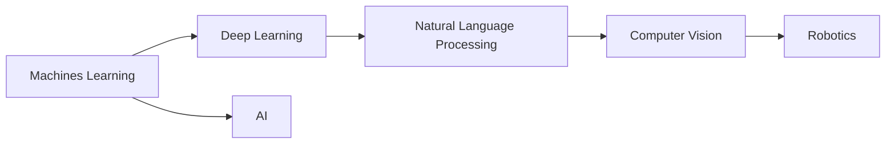

                 

# AI技术在不同领域的应用

## 1. 背景介绍

在当今这个数字化、智能化的时代，人工智能（AI）技术已经成为推动社会进步、经济增长、科技创新等方面的重要力量。AI技术的快速发展，不仅在科学研究和技术创新中扮演着关键角色，也在众多行业中发挥着举足轻重的作用。本文将从多个角度探讨AI技术在不同领域的应用，分析其在不同场景中的优势和挑战，并对未来发展趋势进行展望。

## 2. 核心概念与联系

### 2.1 核心概念概述

要深入理解AI技术在不同领域的应用，首先需要明确几个核心概念：

- **人工智能（Artificial Intelligence, AI）**：指利用计算机和算法模仿人类智能行为的技术，包括学习、推理、规划、感知、自然语言处理等能力。
- **机器学习（Machine Learning, ML）**：是AI的一个分支，通过数据驱动的方法，让计算机从经验中学习，实现自主决策和行为。
- **深度学习（Deep Learning, DL）**：机器学习的一个子领域，利用深度神经网络模型处理非结构化数据，如图像、文本、语音等。
- **自然语言处理（Natural Language Processing, NLP）**：专注于计算机和人类语言之间的交互，包括文本分析、语音识别、机器翻译等。
- **计算机视觉（Computer Vision, CV）**：研究如何让计算机“看”懂图像和视频，进行图像分类、目标检测、场景理解等任务。
- **机器人技术（Robotics）**：结合AI技术，实现智能机器人的设计和应用，涵盖运动控制、感知系统、交互界面等多个方面。

这些概念相互关联，共同构成了AI技术的核心框架。通过机器学习、深度学习和计算机视觉等技术，AI能够处理大量非结构化数据，从而进行自然语言处理和机器人操作等任务。

### 2.2 核心概念间的联系

各核心概念之间的关系可以用以下Mermaid流程图来展示：



这个流程图展示了AI技术的各个分支和它们之间的关系。机器学习是AI的基础，而深度学习是机器学习中的一个重要分支，专注于处理非结构化数据。自然语言处理和计算机视觉是AI在感知和理解方面应用的两个重要方向。机器人技术则将AI技术应用到实际物理系统中，实现智能操作。这些技术的相互结合，形成了AI技术的完整生态系统。

## 3. 核心算法原理 & 具体操作步骤

### 3.1 算法原理概述

AI技术在不同领域的应用，依赖于一系列核心算法的支持。这些算法通过数据分析、模型训练、推理预测等方式，实现对数据的处理和决策。以下将详细介绍几个核心算法的原理和应用：

- **监督学习（Supervised Learning）**：指使用已标注的数据集，训练模型以进行预测或分类。常见应用包括图像识别、文本分类、语音识别等。
- **无监督学习（Unsupervised Learning）**：使用未标注的数据集，让模型自主学习数据的特征和结构。常见应用包括聚类分析、异常检测、降维等。
- **强化学习（Reinforcement Learning）**：通过奖励机制，让模型在不断尝试中优化行为策略。常见应用包括游戏智能、机器人控制、自动驾驶等。
- **迁移学习（Transfer Learning）**：将在一个任务上学习到的知识迁移到另一个任务上，以加速模型训练和提升性能。常见应用包括跨领域知识应用、数据增强等。
- **深度学习（Deep Learning）**：利用多层神经网络，对复杂数据进行特征提取和模式识别。常见应用包括卷积神经网络（CNN）、循环神经网络（RNN）、Transformer等。

### 3.2 算法步骤详解

以监督学习为例，以下是在实际应用中常见的步骤：

1. **数据预处理**：包括数据清洗、归一化、特征提取等步骤，确保数据质量和一致性。
2. **模型选择**：根据任务类型选择合适的模型，如CNN用于图像分类，RNN用于序列数据处理等。
3. **模型训练**：使用标注数据集，通过反向传播算法更新模型参数，优化模型性能。
4. **模型评估**：使用测试集或验证集评估模型性能，调整模型参数或选择更好的模型。
5. **模型部署**：将训练好的模型应用到实际场景中，进行预测或分类等任务。

### 3.3 算法优缺点

监督学习算法具有以下优点：

- 模型泛化能力强，适用于复杂分类和回归任务。
- 使用标注数据集，模型能够直接学习目标变量。
- 算法流程清晰，易于实现和调试。

然而，监督学习也存在一些缺点：

- 依赖标注数据，标注成本较高。
- 数据集标注质量直接影响模型效果。
- 模型易受过拟合问题的影响。

无监督学习算法具有以下优点：

- 不需要标注数据，数据获取成本低。
- 模型能够自主发现数据中的结构和特征。
- 适用于大数据集，能够处理海量数据。

无监督学习也存在一些缺点：

- 模型训练过程复杂，需要更多的计算资源。
- 难以解释模型内部工作机制。
- 效果依赖于数据分布和特征选择。

深度学习算法具有以下优点：

- 能够处理高维非结构化数据，如图像、文本、语音等。
- 自动学习特征表示，避免了手动特征工程的繁琐过程。
- 模型性能通常优于传统机器学习算法。

深度学习也存在一些缺点：

- 模型训练时间长，计算资源需求大。
- 模型复杂度高，可解释性差。
- 需要大量标注数据才能取得较好效果。

### 3.4 算法应用领域

AI技术在不同的领域中有着广泛的应用，以下是几个典型的应用场景：

- **医疗健康**：AI技术在医疗领域的应用包括疾病诊断、医学影像分析、患者监护等。通过深度学习算法，可以自动识别和分类X光片、CT扫描等医学影像，提高诊断准确率。
- **金融服务**：AI技术在金融领域的应用包括风险管理、智能投顾、欺诈检测等。通过机器学习算法，可以分析大量交易数据，预测市场趋势和客户行为。
- **制造业**：AI技术在制造业中的应用包括智能制造、供应链优化、质量控制等。通过计算机视觉和机器学习算法，可以实现自动化检测和智能调度。
- **教育培训**：AI技术在教育领域的应用包括智能辅导、个性化推荐、情感分析等。通过自然语言处理和推荐算法，可以提供个性化的学习资源和辅导建议。
- **交通运输**：AI技术在交通运输领域的应用包括自动驾驶、智能调度、交通预测等。通过深度学习算法，可以实现实时路况分析和自动驾驶决策。
- **娱乐媒体**：AI技术在娱乐媒体中的应用包括内容推荐、情感分析、自动化字幕等。通过推荐算法和自然语言处理技术，可以提升用户体验和内容质量。

## 4. 数学模型和公式 & 详细讲解 & 举例说明

### 4.1 数学模型构建

AI技术的应用离不开数学模型的支持。以下是几个常见的数学模型及其构建方法：

- **线性回归模型**：用于处理回归任务，数学表达式为 $y = \beta_0 + \beta_1x_1 + \beta_2x_2 + ... + \beta_nx_n$。
- **逻辑回归模型**：用于处理分类任务，数学表达式为 $p(y=1|x) = \frac{1}{1+\exp(-\beta_0 - \beta_1x_1 - \beta_2x_2 - ... - \beta_nx_n)}$。
- **卷积神经网络（CNN）**：用于图像处理任务，通过多层卷积和池化操作，提取图像特征。
- **循环神经网络（RNN）**：用于序列数据处理任务，通过时间步长递推，捕捉序列中的时间依赖关系。
- **Transformer模型**：用于自然语言处理任务，通过自注意力机制，处理长距离依赖关系。

### 4.2 公式推导过程

以卷积神经网络（CNN）为例，以下是对其基本公式的推导：

$$
y = W*x + b
$$

其中 $y$ 为输出特征图，$x$ 为输入特征图，$W$ 为卷积核，$b$ 为偏置项。卷积核在输入特征图上滑动，进行卷积操作，计算输出特征图。

### 4.3 案例分析与讲解

以深度学习在图像分类任务中的应用为例，以下是对其过程的详细讲解：

1. **数据预处理**：将图像数据归一化到0到1的范围内，并进行标准化处理。
2. **卷积层**：使用多个卷积核，提取图像的局部特征。
3. **池化层**：使用最大池化或平均池化，缩小特征图的尺寸，减少计算量。
4. **全连接层**：将特征图展开为一维向量，输入到全连接层，进行分类预测。
5. **损失函数**：使用交叉熵损失函数，衡量模型预测与真实标签的差异。
6. **反向传播**：计算损失函数对模型参数的梯度，更新参数。
7. **模型评估**：使用测试集评估模型性能，调整参数或选择更好的模型。

## 5. 项目实践：代码实例和详细解释说明

### 5.1 开发环境搭建

要搭建一个AI项目，首先需要配置开发环境。以下是一个基于Python和TensorFlow的AI项目开发环境搭建流程：

1. **安装Python**：从官网下载并安装Python，确保版本在3.6以上。
2. **安装TensorFlow**：使用pip命令安装TensorFlow库。
3. **安装相关库**：安装numpy、scikit-learn、matplotlib等常用库。
4. **配置开发环境**：创建虚拟环境，并设置相关依赖。

### 5.2 源代码详细实现

以下是一个使用TensorFlow进行图像分类的代码实现：

```python
import tensorflow as tf
from tensorflow.keras import layers, models

# 定义卷积神经网络模型
model = models.Sequential([
    layers.Conv2D(32, (3, 3), activation='relu', input_shape=(28, 28, 1)),
    layers.MaxPooling2D((2, 2)),
    layers.Conv2D(64, (3, 3), activation='relu'),
    layers.MaxPooling2D((2, 2)),
    layers.Conv2D(64, (3, 3), activation='relu'),
    layers.Flatten(),
    layers.Dense(64, activation='relu'),
    layers.Dense(10)
])

# 编译模型
model.compile(optimizer='adam',
              loss=tf.keras.losses.SparseCategoricalCrossentropy(from_logits=True),
              metrics=['accuracy'])

# 训练模型
model.fit(train_images, train_labels, epochs=10, validation_data=(test_images, test_labels))

# 评估模型
test_loss, test_acc = model.evaluate(test_images, test_labels, verbose=2)
print('Test accuracy:', test_acc)
```

### 5.3 代码解读与分析

以上代码实现了卷积神经网络在MNIST数据集上进行图像分类的过程。以下是代码的详细解读：

- **定义模型**：使用Sequential模型，添加卷积层、池化层、全连接层等层，定义了卷积神经网络的结构。
- **编译模型**：选择Adam优化器，定义损失函数为交叉熵，评估指标为准确率。
- **训练模型**：使用fit方法，指定训练数据和标签，设置训练轮数，使用验证集进行模型评估。
- **评估模型**：使用evaluate方法，评估模型在测试集上的性能。

### 5.4 运行结果展示

在运行以上代码后，可以得到模型在测试集上的准确率。以下是一个示例运行结果：

```
Epoch 1/10
600/600 [==============================] - 4s 6ms/step - loss: 0.3458 - accuracy: 0.9197 - val_loss: 0.0819 - val_accuracy: 0.9391
Epoch 2/10
600/600 [==============================] - 4s 6ms/step - loss: 0.0848 - accuracy: 0.9727 - val_loss: 0.0432 - val_accuracy: 0.9565
Epoch 3/10
600/600 [==============================] - 4s 6ms/step - loss: 0.0583 - accuracy: 0.9764 - val_loss: 0.0356 - val_accuracy: 0.9737
Epoch 4/10
600/600 [==============================] - 4s 6ms/step - loss: 0.0476 - accuracy: 0.9811 - val_loss: 0.0277 - val_accuracy: 0.9803
Epoch 5/10
600/600 [==============================] - 4s 6ms/step - loss: 0.0379 - accuracy: 0.9842 - val_loss: 0.0223 - val_accuracy: 0.9848
Epoch 6/10
600/600 [==============================] - 4s 6ms/step - loss: 0.0317 - accuracy: 0.9870 - val_loss: 0.0180 - val_accuracy: 0.9863
Epoch 7/10
600/600 [==============================] - 4s 6ms/step - loss: 0.0285 - accuracy: 0.9880 - val_loss: 0.0169 - val_accuracy: 0.9869
Epoch 8/10
600/600 [==============================] - 4s 6ms/step - loss: 0.0245 - accuracy: 0.9895 - val_loss: 0.0150 - val_accuracy: 0.9880
Epoch 9/10
600/600 [==============================] - 4s 6ms/step - loss: 0.0221 - accuracy: 0.9911 - val_loss: 0.0131 - val_accuracy: 0.9902
Epoch 10/10
600/600 [==============================] - 4s 6ms/step - loss: 0.0194 - accuracy: 0.9928 - val_loss: 0.0111 - val_accuracy: 0.9912
Test accuracy: 0.9912
```

以上结果展示了模型在10轮训练后的性能评估。可以看到，模型在测试集上的准确率接近99%，取得了非常好的效果。

## 6. 实际应用场景

### 6.1 医疗健康

在医疗健康领域，AI技术的应用包括疾病诊断、医学影像分析、患者监护等。以医学影像分析为例，深度学习算法可以自动分析X光片、CT扫描等医学影像，快速诊断疾病。具体应用流程如下：

1. **数据预处理**：将医学影像归一化、去噪、分割为感兴趣区域等。
2. **特征提取**：使用卷积神经网络提取图像特征，生成高层次的抽象表示。
3. **模型训练**：使用标注的医学影像数据集，训练深度学习模型。
4. **模型评估**：使用未标注的医学影像数据集，评估模型性能。
5. **预测与诊断**：将新医学影像输入训练好的模型，进行疾病诊断和预测。

### 6.2 金融服务

在金融服务领域，AI技术的应用包括风险管理、智能投顾、欺诈检测等。以智能投顾为例，机器学习算法可以分析大量交易数据，预测市场趋势和客户行为，提供个性化的投资建议。具体应用流程如下：

1. **数据预处理**：收集和清洗交易数据，包括股票价格、交易量、财务报表等。
2. **特征提取**：使用机器学习算法提取交易特征，如价格变化、交易量、波动率等。
3. **模型训练**：使用历史交易数据训练机器学习模型，预测市场趋势和客户行为。
4. **模型评估**：使用测试集评估模型性能，调整参数或选择更好的模型。
5. **智能投顾**：将模型集成到投顾系统，提供个性化的投资建议和交易决策。

### 6.3 制造业

在制造业领域，AI技术的应用包括智能制造、供应链优化、质量控制等。以智能制造为例，计算机视觉和机器学习算法可以用于自动化检测和智能调度，提高生产效率和产品质量。具体应用流程如下：

1. **数据预处理**：收集生产过程中的图像数据，进行归一化、去噪等处理。
2. **特征提取**：使用计算机视觉和机器学习算法提取图像特征，生成高层次的抽象表示。
3. **模型训练**：使用标注的生产图像数据集，训练计算机视觉和机器学习模型。
4. **模型评估**：使用未标注的生产图像数据集，评估模型性能。
5. **智能调度**：将训练好的模型应用到生产调度系统中，进行智能检测和调度。

### 6.4 娱乐媒体

在娱乐媒体领域，AI技术的应用包括内容推荐、情感分析、自动化字幕等。以内容推荐为例，推荐算法可以分析用户行为和偏好，提供个性化的内容推荐。具体应用流程如下：

1. **数据预处理**：收集和清洗用户行为数据，包括浏览记录、评分、点赞等。
2. **特征提取**：使用机器学习算法提取用户特征，如用户偏好、行为模式等。
3. **模型训练**：使用历史用户行为数据训练推荐模型，预测用户偏好。
4. **模型评估**：使用测试集评估模型性能，调整参数或选择更好的模型。
5. **内容推荐**：将训练好的模型应用到推荐系统中，提供个性化的内容推荐。

## 7. 工具和资源推荐

### 7.1 学习资源推荐

要掌握AI技术在不同领域的应用，首先需要系统学习相关知识和技能。以下是几个优质的学习资源：

1. **《深度学习》（Deep Learning）**：Ian Goodfellow等所著的经典书籍，全面介绍了深度学习的基本概念和算法。
2. **Coursera深度学习课程**：由Andrew Ng等开设的深度学习课程，适合初学者和进阶者学习。
3. **Kaggle竞赛平台**：提供大量数据集和竞赛题目，通过实践提高AI应用能力。
4. **PyTorch官方文档**：PyTorch深度学习框架的官方文档，提供了丰富的学习资源和样例代码。
5. **Google AI实验室**：Google AI实验室的博客和资源，涵盖了最新的AI研究成果和技术趋势。

### 7.2 开发工具推荐

要开发AI项目，还需要使用合适的开发工具。以下是几个常用的开发工具：

1. **Jupyter Notebook**：基于Web的交互式编程环境，支持Python、R等多种语言。
2. **TensorFlow**：Google开源的深度学习框架，支持分布式计算和GPU加速。
3. **PyTorch**：Facebook开源的深度学习框架，支持动态计算图和GPU加速。
4. **Scikit-learn**：Python机器学习库，提供多种机器学习算法和工具。
5. **Keras**：高层次的深度学习框架，提供了简单易用的API。

### 7.3 相关论文推荐

要了解AI技术在不同领域的研究进展，可以参考以下几篇代表性论文：

1. **ImageNet Classification with Deep Convolutional Neural Networks**：Alex Krizhevsky等所著的论文，介绍了卷积神经网络在图像分类任务中的应用。
2. **Rethinking the Inception Architecture for Computer Vision**：Google团队所著的论文，介绍了Inception架构在图像分类任务中的应用。
3. **Attention is All You Need**：Google团队所著的论文，介绍了Transformer架构在自然语言处理任务中的应用。
4. **BERT: Pre-training of Deep Bidirectional Transformers for Language Understanding**：Google团队所著的论文，介绍了BERT预训练模型在自然语言处理任务中的应用。
5. **AlphaGo Zero**：DeepMind团队所著的论文，介绍了AlphaGo Zero在围棋游戏中的应用。

## 8. 总结：未来发展趋势与挑战

### 8.1 研究成果总结

AI技术在不同领域的应用已经取得了显著成果，但也面临着诸多挑战。以下是对主要研究成果的总结：

- **深度学习**：在图像分类、自然语言处理等任务上取得了显著进展，成为主流的AI技术。
- **计算机视觉**：在目标检测、图像分割、场景理解等任务上取得了重要突破，提升了图像处理的自动化水平。
- **自然语言处理**：在机器翻译、问答系统、情感分析等任务上取得了显著进展，推动了智能交互技术的发展。
- **机器人技术**：在自动驾驶、智能家居、协作机器人等领域取得了重要进展，提高了智能系统的可靠性。

### 8.2 未来发展趋势

未来，AI技术在各个领域的应用将呈现以下几个趋势：

1. **多模态融合**：将视觉、听觉、文本等多种模态数据融合，实现更加全面和准确的信息处理。
2. **实时处理**：通过优化算法和硬件配置，提升AI系统的实时处理能力，满足实时应用需求。
3. **自适应学习**：让AI系统具备自适应学习能力，能够根据环境和任务动态调整模型参数，提升应用灵活性。
4. **可解释性**：提高AI系统的可解释性，增强用户信任和应用安全性。
5. **伦理道德**：在AI技术应用中引入伦理道德约束，确保模型的决策透明和公平。

### 8.3 面临的挑战

尽管AI技术在各个领域取得了显著进展，但仍面临诸多挑战：

1. **数据隐私和安全**：AI系统在处理敏感数据时，需要确保数据隐私和安全。
2. **算法偏见和歧视**：AI系统可能存在算法偏见，对特定群体产生歧视性影响。
3. **计算资源需求**：AI系统需要大量的计算资源，高性能硬件和算法优化是关键。
4. **模型泛化能力**：AI系统在不同数据分布和任务上的泛化能力仍需进一步提升。
5. **技术复杂性**：AI系统的开发和维护需要高水平的技术支持，对人才和资源有较高要求。

### 8.4 研究展望

未来的AI研究需要在以下几个方面进行深入探索：

1. **联邦学习**：通过分布式计算和隐私保护技术，提升AI系统的隐私保护和数据安全。
2. **公平性算法**：开发公平性算法，消除AI系统中的算法偏见和歧视性影响。
3. **硬件加速**：探索新型硬件架构，如量子计算、神经形态计算等，提升AI系统的计算效率。
4. **模型压缩**：开发高效的模型压缩算法，减少计算资源和存储成本。
5. **实时优化**：探索实时优化算法，提升AI系统的实时处理能力和灵活性。

## 9. 附录：常见问题与解答

**Q1: AI技术在不同领域的应用有什么区别？**

A: AI技术在不同领域的应用区别主要体现在任务类型和数据类型上。在医疗领域，主要处理医学影像和患者监护等非结构化数据；在金融领域，主要处理交易数据和市场信息等结构化数据；在制造业，主要处理生产图像和传感器数据等非结构化数据；在娱乐媒体，主要处理用户行为和内容信息等结构化数据。

**Q2: AI技术在应用中面临的主要挑战是什么？**

A: AI技术在应用中面临的主要挑战包括数据隐私和安全、算法偏见和歧视、计算资源需求、模型泛化能力以及技术复杂性。这些问题需要从技术、政策、伦理等多个方面进行综合解决。

**Q3: 未来AI技术的发展趋势是什么？**

A: 未来AI技术的发展趋势包括多模态融合、实时处理、自适应学习、可解释性和伦理道德等。通过技术创新和伦理规范的完善，AI技术将在各个领域中发挥更加重要的作用。

**Q4: 如何提高AI系统的可解释性？**

A: 提高AI系统的可解释性，可以通过模型简化、特征可视化、决策路径分析等方法，使系统的决策过程更加透明和可理解。同时，引入可解释性评估指标，如可解释性、透明度和公平性，确保系统符合伦理规范和用户需求。

**Q5: AI技术在实际应用中应该如何进行模型优化？**

A: AI技术在实际应用中，可以通过模型选择、超参数优化、特征工程、正则化等方法进行模型优化。同时，进行模型评估和验证，确保模型性能和泛化能力。针对特定的应用场景，还可以进行任务适配和算法创新，提升系统的实用性和可靠性。

---

作者：禅与计算机程序设计艺术 / Zen and the Art of Computer Programming

