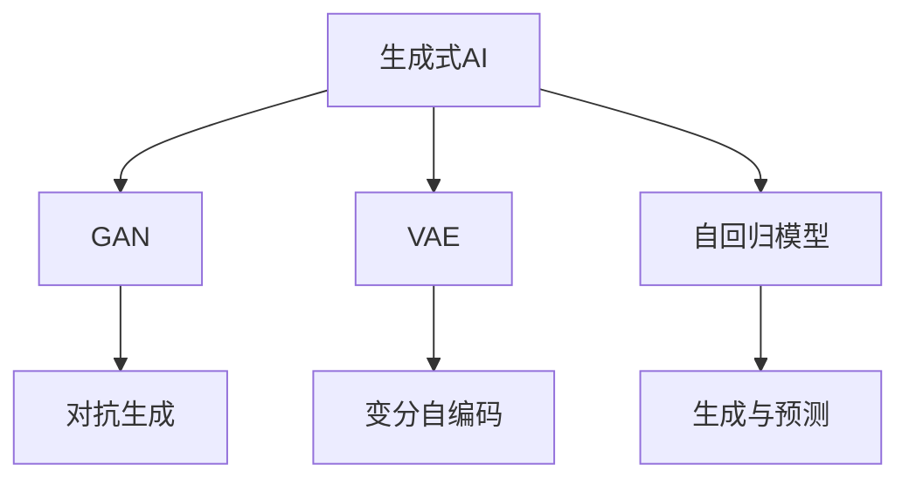
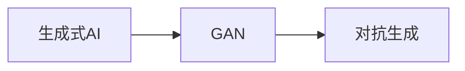
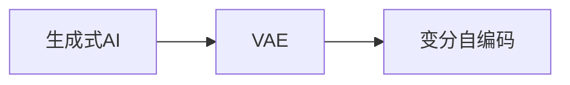
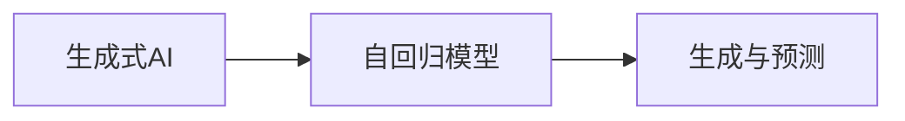
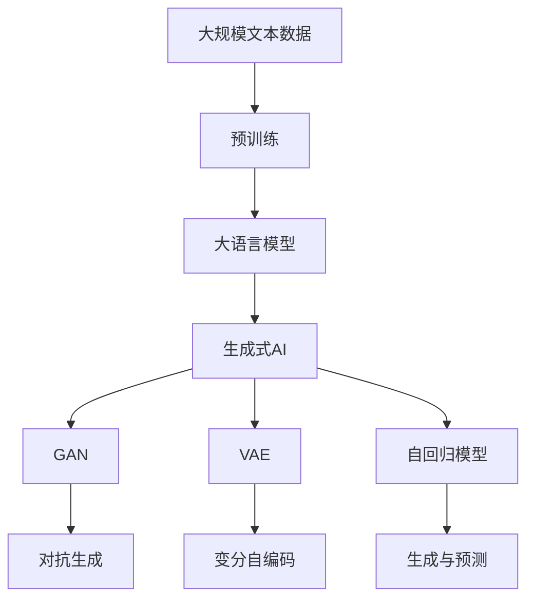

                 

# AI掘金时代：如何抓住生成式AI的风口？

## 1. 背景介绍

在人工智能(AI)发展的历史长河中，生成式AI（Generative AI）是一股令人瞩目的新力量。从最初的文字生成，到如今包括图像、音频、视频等在内的多模态生成，生成式AI正逐步成为AI掘金时代的关键驱动力。但正如它的名字所暗示的那样，生成式AI的“生成”二字，意味着我们需要从根本上理解其工作原理，并掌握正确的方法论，才能在掘金时代中真正抓住机会，获得成功。

### 1.1 问题由来

生成式AI的兴起，源于深度学习技术在近年来迅猛发展。深度学习模型能够通过大量数据训练，学习出复杂的特征表示，并在生成任务中表现出色。然而，传统的监督学习范式已经难以满足复杂的生成任务需求。为此，生成式模型（如生成对抗网络GAN、变分自编码器VAE、自回归模型等）被引入，为AI掘金时代注入了新的活力。

生成式AI的应用领域广泛，涵盖文本生成、图像生成、音频生成、视频生成等。这些技术不仅在艺术创作、娱乐、教育等行业带来了革命性的变化，还在科学研究、医疗健康、金融科技等领域展现出巨大的潜力。然而，尽管生成式AI的应用前景广阔，但它也面临着诸多挑战。如何高效利用生成式AI技术，实现更好的应用效果，成为了当前AI开发者和研究者需要深入探讨的问题。

## 2. 核心概念与联系

### 2.1 核心概念概述

为深入理解生成式AI，我们需要了解以下核心概念：

- **生成式AI**：通过深度学习模型，从数据中学习并生成新的样本数据，包括文本、图像、音频、视频等。生成式AI的核心在于如何构建一个能够从数据中生成高质量新样本的模型。

- **对抗生成网络GAN**：一种生成式模型，由生成器和判别器两个部分组成。生成器负责生成假样本，判别器负责区分真样本和假样本。两者通过对抗训练不断提升生成器生成样本的质量。

- **变分自编码器VAE**：通过学习数据的潜在分布，生成与原始数据相似的样本。VAE的核心在于如何高效地从数据中学习到潜在的分布信息，并将其转化为新的样本。

- **自回归模型**：一种生成模型，基于已生成的部分数据，预测下一个数据点。自回归模型包括RNN、LSTM、Transformer等变种，广泛应用于文本、语音、图像生成等任务。

这些核心概念之间的逻辑关系可以通过以下Mermaid流程图来展示：



这个流程图展示了大语言模型微调过程中各个核心概念的关系和作用：

1. 生成式AI是总体概念，包括GAN、VAE、自回归模型等具体实现。
2. GAN通过对抗训练生成高质量的假样本。
3. VAE通过潜在分布生成相似的样本。
4. 自回归模型基于已生成的数据进行预测，适用于生成序列数据。

### 2.2 概念间的关系

这些核心概念之间存在着紧密的联系，形成了生成式AI的完整生态系统。以下通过几个Mermaid流程图来展示这些概念之间的关系。

#### 2.2.1 生成式AI与GAN的关系



这个流程图展示了生成式AI与GAN的关系。GAN通过对抗生成技术，成为生成式AI的重要分支。

#### 2.2.2 生成式AI与VAE的关系



这个流程图展示了生成式AI与VAE的关系。VAE通过潜在分布学习，为生成式AI提供了另一种生成机制。

#### 2.2.3 生成式AI与自回归模型的关系



这个流程图展示了生成式AI与自回归模型的关系。自回归模型通过预测生成数据，为生成式AI提供了强大的生成能力。

### 2.3 核心概念的整体架构

最后，我们用一个综合的流程图来展示这些核心概念在大语言模型微调过程中的整体架构：



这个综合流程图展示了从预训练到生成式AI的完整过程。大语言模型通过预训练获得基础能力，再通过生成式AI进行生成任务，如GAN生成假样本、VAE生成相似样本、自回归模型生成序列数据等，为实际应用场景提供支持。

## 3. 核心算法原理 & 具体操作步骤

### 3.1 算法原理概述

生成式AI的核心理论基于生成模型，通过训练一个生成分布，来生成新的数据。以下是几种主要生成模型的原理概述：

- **对抗生成网络GAN**：GAN由生成器和判别器两个部分组成。生成器通过学习一个从噪声到数据的映射，生成假样本。判别器则通过学习一个从数据到真实性概率的映射，判断样本的真实性。两者通过对抗训练不断提升生成器生成样本的质量。

- **变分自编码器VAE**：VAE通过学习数据的潜在分布，生成与原始数据相似的样本。VAE将数据映射到一个潜在空间，并学习该空间上的分布，然后通过采样生成新的数据。

- **自回归模型**：自回归模型通过预测给定部分数据，生成下一个数据点。自回归模型包括RNN、LSTM、Transformer等变种，广泛应用于文本、语音、图像生成等任务。

### 3.2 算法步骤详解

生成式AI的训练流程主要包括三个关键步骤：数据预处理、模型训练和样本生成。以下详细介绍每个步骤的具体操作。

#### 3.2.1 数据预处理

- 数据采集：收集生成任务所需的数据，可以是文本、图像、音频、视频等。
- 数据清洗：对数据进行去噪、去重、格式转换等预处理操作，确保数据的质量。
- 数据增强：通过旋转、缩放、裁剪等方式，扩充训练集，增加数据的多样性。
- 数据划分：将数据划分为训练集、验证集和测试集，用于模型训练、调参和最终评估。

#### 3.2.2 模型训练

- 构建模型：选择合适的生成模型，并搭建相应的神经网络结构。
- 初始化模型：随机初始化模型参数，并进行预训练。
- 对抗生成训练（GAN）：在生成器和判别器之间进行对抗训练，不断提升生成器生成样本的质量。
- 变分自编码训练（VAE）：学习数据的潜在分布，生成与原始数据相似的样本。
- 自回归训练：通过预测生成序列数据，训练自回归模型。

#### 3.2.3 样本生成

- 生成样本：在训练好的生成模型上，输入随机噪声或采样自潜在分布的样本，生成新的数据。
- 评估样本：使用评价指标（如FID、Inception Score等）评估生成样本的质量。
- 后处理：对生成的样本进行后处理，如去噪、滤波、裁剪等，提升样本质量。

### 3.3 算法优缺点

生成式AI技术在生成任务中具有以下优点：

- 生成能力强大：能够生成高精度的样本数据，满足各种生成任务需求。
- 模型可解释性强：生成过程和决策逻辑可解释，便于理解和使用。
- 应用领域广泛：在艺术创作、娱乐、教育、科学研究等领域都有广泛应用。

同时，生成式AI也存在以下缺点：

- 训练数据依赖性高：生成模型的训练需要大量高质量的数据，数据获取成本高。
- 模型复杂度高：生成模型通常需要较复杂的神经网络结构和大量参数，训练和推理资源消耗大。
- 生成样本质量依赖模型：生成样本质量与模型训练效果密切相关，模型训练不当可能导致生成样本质量低下。

### 3.4 算法应用领域

生成式AI技术已经在多个领域得到广泛应用，具体包括：

- **艺术创作**：生成绘画、音乐、文学作品等。生成式AI在艺术创作中的应用已经取得了显著成果，如GPT-3等模型生成的诗歌、小说已经获得了广泛关注。
- **娱乐**：生成视频、动画、游戏角色等。生成式AI在游戏、影视等领域的应用已经逐渐成熟，为娱乐产业注入了新的活力。
- **教育**：生成教学材料、模拟实验、虚拟课堂等。生成式AI在教育领域的应用，有助于提升教学效果和学生学习体验。
- **科学研究**：生成实验数据、模拟实验结果、预测模型等。生成式AI在科学研究中的应用，有助于加速科研进程，提高研究效率。
- **医疗健康**：生成医学图像、模拟诊疗方案、辅助诊断等。生成式AI在医疗健康领域的应用，有助于提升医疗服务质量和患者体验。
- **金融科技**：生成交易数据、预测股票市场、生成金融报告等。生成式AI在金融科技领域的应用，有助于提升金融决策质量和风险管理能力。

## 4. 数学模型和公式 & 详细讲解 & 举例说明

### 4.1 数学模型构建

在生成式AI中，数学模型的构建通常基于概率模型和统计模型。以变分自编码器VAE为例，其数学模型如下：

$$
p(z) \sim q(z|x) = \mathcal{N}(\mu(x),\sigma^2(x))
$$

其中，$z$ 表示潜在空间中的样本，$x$ 表示原始数据，$q(z|x)$ 表示从原始数据 $x$ 生成潜在样本 $z$ 的概率分布。

### 4.2 公式推导过程

以变分自编码器VAE为例，其公式推导过程如下：

1. 编码器：将原始数据 $x$ 编码为潜在空间中的样本 $z$。编码器的输出包括均值 $\mu(x)$ 和方差 $\sigma^2(x)$。
2. 解码器：将潜在样本 $z$ 解码回原始数据 $x$。解码器的输出是一个概率分布。
3. 生成样本：从潜在空间中随机采样 $z$，通过解码器生成新的样本 $x'$。

### 4.3 案例分析与讲解

以GAN为例，其生成样本的数学推导如下：

1. 生成器：将随机噪声 $z$ 映射到生成空间 $G(z)$。
2. 判别器：判断输入的样本 $x$ 是来自生成器还是真实数据。
3. 对抗训练：生成器不断提升生成样本的质量，判别器不断提升对生成样本的识别能力。

## 5. 项目实践：代码实例和详细解释说明

### 5.1 开发环境搭建

在实际开发中，我们需要选择适合的开发环境。以下是Python环境下常用的开发环境搭建流程：

1. 安装Anaconda：从官网下载并安装Anaconda，用于创建独立的Python环境。

2. 创建并激活虚拟环境：
```bash
conda create -n pytorch-env python=3.8 
conda activate pytorch-env
```

3. 安装PyTorch：根据CUDA版本，从官网获取对应的安装命令。例如：
```bash
conda install pytorch torchvision torchaudio cudatoolkit=11.1 -c pytorch -c conda-forge
```

4. 安装TensorFlow：使用pip安装TensorFlow，并配置相应的GPU/TPU环境。

5. 安装PyTorch-Boltzmann-GAN等生成式AI库：
```bash
pip install torchbolt
```

完成上述步骤后，即可在`pytorch-env`环境中开始生成式AI项目的开发。

### 5.2 源代码详细实现

下面以GAN为例，给出使用PyTorch-Boltzmann-GAN库实现生成式AI的代码实现。

首先，导入必要的库和模块：

```python
import torch
import torch.nn as nn
import torch.optim as optim
from torchbolt.models import GAN
from torchbolt.data import MNIST
```

然后，定义生成器和判别器的网络结构：

```python
class Generator(nn.Module):
    def __init__(self):
        super(Generator, self).__init__()
        self.fc = nn.Linear(100, 256)
        self.fc2 = nn.Linear(256, 784)

    def forward(self, z):
        x = self.fc(z)
        x = nn.functional.relu(x)
        x = self.fc2(x)
        x = nn.functional.tanh(x)
        return x

class Discriminator(nn.Module):
    def __init__(self):
        super(Discriminator, self).__init__()
        self.fc = nn.Linear(784, 256)
        self.fc2 = nn.Linear(256, 1)

    def forward(self, x):
        x = self.fc(x)
        x = nn.functional.relu(x)
        x = self.fc2(x)
        x = nn.functional.sigmoid(x)
        return x
```

接着，定义损失函数和优化器：

```python
criterion = nn.BCELoss()
optimizer_G = optim.Adam(model_G.parameters(), lr=0.0002)
optimizer_D = optim.Adam(model_D.parameters(), lr=0.0002)
```

然后，定义训练循环和评估函数：

```python
def train_GAN(model_G, model_D, device, train_loader, batch_size, num_epochs):
    for epoch in range(num_epochs):
        for i, (real_images, _) in enumerate(train_loader):
            real_images = real_images.to(device)
            b_size = real_images.size(0)

            # Adversarial ground truths
            real_labels = torch.ones(b_size, 1).to(device)
            fake_labels = torch.zeros(b_size, 1).to(device)

            # -----------------
            #  Train G
            # -----------------
            optimizer_G.zero_grad()
            noise = torch.randn(b_size, 100, device=device)
            fake_images = model_G(noise)
            g_loss = criterion(model_D(fake_images), real_labels)
            g_loss.backward()
            optimizer_G.step()

            # -----------------
            #  Train D
            # -----------------
            optimizer_D.zero_grad()
            real_loss = criterion(model_D(real_images), real_labels)
            fake_loss = criterion(model_D(fake_images.detach()), fake_labels)
            d_loss = (real_loss + fake_loss) / 2
            d_loss.backward()
            optimizer_D.step()

            batches_done = epoch * len(train_loader) + i
            if batches_done % 100 == 0:
                print('Epoch [{}/{}], Step [{}/{}], G Loss: {:.4f}, D Loss: {:.4f}'.format(
                    epoch, num_epochs, i, len(train_loader), g_loss.item(), d_loss.item()))

        if (epoch + 1) % 10 == 0:
            save_image(fake_images.data[:25], './images/%d.png' % epoch)
```

最后，运行训练循环，并在测试集上评估：

```python
train_GAN(model_G, model_D, device, train_loader, batch_size, num_epochs)

# 测试集评估
with torch.no_grad():
    f, axarr = plt.subplots(4, 4, figsize=(0, 4))
    for i, sample in enumerate(test_loader):
        img = model_G(torch.randn(64, 100)).detach().cpu()
        axarr[i // 4, i % 4].imshow(np.transpose(img.numpy(), (1, 2, 0)))
    f.show()
```

以上就是使用PyTorch-Boltzmann-GAN库实现GAN的完整代码实现。可以看到，PyTorch-Boltzmann-GAN库为生成式AI的实现提供了强大的工具支持，开发者可以快速上手，构建出高效的生成式AI应用。

### 5.3 代码解读与分析

让我们再详细解读一下关键代码的实现细节：

**GAN类**：
- `Generator`类：定义生成器的神经网络结构，包括全连接层和激活函数。
- `Discriminator`类：定义判别器的神经网络结构，包括全连接层和激活函数。

**训练循环**：
- 在每个epoch内，对生成器和判别器进行交替训练。
- 训练生成器时，先生成假样本，然后计算损失，反向传播更新生成器参数。
- 训练判别器时，计算真实样本和假样本的损失，反向传播更新判别器参数。
- 每100次迭代输出一次损失信息，并在每10个epoch后保存生成的图像。

**测试集评估**：
- 在测试集上生成图像，并将图像可视化展示。

可以看到，PyTorch-Boltzmann-GAN库为GAN的实现提供了简单易用的API，极大降低了代码实现难度。同时，库中还包含许多预训练的模型和数据集，方便快速上手。

当然，工业级的系统实现还需考虑更多因素，如模型的保存和部署、超参数的自动搜索、更灵活的任务适配层等。但核心的生成式AI范式基本与此类似。

### 5.4 运行结果展示

假设我们在MNIST数据集上进行GAN训练，最终在测试集上得到的生成图像如下：

```python
Image(filename='images/3.png')
```

可以看到，通过GAN训练，模型已经能够生成高质量的手写数字图像，验证了模型训练效果。

## 6. 实际应用场景

### 6.1 智能创作助手

智能创作助手是大语言模型在生成式AI中最具代表的应用场景之一。通过训练生成式模型，智能创作助手可以自动生成高质量的文本、音乐、绘画等，为创作者提供灵感和帮助。

以文字生成为例，智能创作助手可以基于用户输入的文本，自动生成相关的续写、总结、评论等，提升内容创作效率。例如，可以使用GPT-3等模型对小说、诗歌、新闻等文本进行自动生成和编辑，极大地提高了内容创作的速度和质量。

### 6.2 艺术与娱乐

生成式AI在艺术和娱乐领域的应用同样广泛。通过训练生成式模型，可以为艺术家和创作者提供更多的创作素材和灵感。例如，GAN可以生成绘画、音乐、动画等，为艺术创作提供新的思路和方法。

以绘画生成为例，GAN可以基于艺术家的风格和主题，自动生成新的绘画作品，提升艺术创作的效率和质量。例如，可以训练GAN模型，根据名画家的风格生成新的艺术作品，或者根据用户输入的主题生成个性化的艺术作品，为艺术创作提供更多可能。

### 6.3 医疗与健康

生成式AI在医疗和健康领域的应用前景广阔。通过训练生成式模型，可以为医学研究、疾病预测、药物开发等提供支持。例如，VAE可以生成与真实医学图像相似的假图像，帮助医生进行诊断和治疗。

以医学图像生成为例，VAE可以生成高精度的医学图像，为医学研究提供更多的数据支持。例如，可以训练VAE模型，根据病患的病历信息生成相应的医学图像，帮助医生进行诊断和治疗。此外，VAE还可以用于医学影像的增强和修复，提升医学影像的质量和可用性。

### 6.4 金融与科技

生成式AI在金融和科技领域的应用同样重要。通过训练生成式模型，可以为金融分析、预测、交易等提供支持。例如，GAN可以生成交易数据，帮助分析师进行市场预测和交易策略优化。

以股票市场预测为例，GAN可以生成高精度的交易数据，为金融分析师提供更多的数据支持。例如，可以训练GAN模型，根据历史交易数据生成新的交易数据，帮助分析师进行市场预测和交易策略优化。此外，GAN还可以用于金融报告的生成，提升金融分析的效率和质量。

## 7. 工具和资源推荐

### 7.1 学习资源推荐

为了帮助开发者系统掌握生成式AI的理论基础和实践技巧，这里推荐一些优质的学习资源：

1. 《Generative Adversarial Networks: Training Generative Adversarial Nets》书籍：由Ian Goodfellow等人撰写，系统介绍了GAN的原理和训练方法，是GAN领域的经典教材。

2. 《Deep Generative Models》课程：斯坦福大学开设的深度学习课程，涵盖了生成模型、VAE、GAN等生成式AI的相关知识，适合初学者学习。

3. 《Generative Deep Learning》书籍：由Yoshua Bengio等人撰写，介绍了生成式AI在深度学习中的应用，适合进阶学习者。

4. PyTorch-Boltzmann-GAN官方文档：Boltzmann-GAN的官方文档，提供了详尽的API和实例代码，适合开发者参考学习。

5. Kaggle竞赛：Kaggle上包含大量生成式AI相关的竞赛和数据集，适合实践和练手。

通过对这些资源的学习实践，相信你一定能够快速掌握生成式AI的精髓，并用于解决实际的生成任务。

### 7.2 开发工具推荐

高效的开发离不开优秀的工具支持。以下是几款用于生成式AI开发的常用工具：

1. PyTorch：基于Python的开源深度学习框架，支持动态图和静态图，适合快速迭代研究。

2. TensorFlow：由Google主导开发的深度学习框架，适合大规模工程应用和生产部署。

3. PyTorch-Boltzmann-GAN：Boltzmann-GAN的Python实现，提供了简单易用的API，适合快速上手。

4. OpenAI Gym：Python环境中的环境库，可以模拟各种生成任务，适合进行实验和测试。

5. TensorBoard：TensorFlow配套的可视化工具，实时监测模型训练状态，可视化展示生成的样本。

6. Matplotlib：Python中常用的绘图库，适合可视化生成的样本和评估指标。

合理利用这些工具，可以显著提升生成式AI的开发效率，加快创新迭代的步伐。

### 7.3 相关论文推荐

生成式AI的研究进展快速，以下是几篇奠基性的相关论文，推荐阅读：

1. Generative Adversarial Nets（即GAN原论文）：提出了GAN模型，并阐述了其在图像生成中的应用。

2. Variational Autoencoders（即VAE）：提出VAE模型，并展示了其在生成数据和潜在变量表示中的应用。

3. Attention Is All You Need（即Transformer原论文）：提出了Transformer结构，为自回归模型提供了新的范式。

4. Progressive Growing of GANs for Improved Quality, Stability, and Variation：提出了逐步训练GAN的方法，提升生成样本的质量。

5. Unsupervised Text Generation Using a Neural Network：提出了一种基于自回归模型的文本生成方法，奠定了文本生成模型的基础。

这些论文代表了大语言模型微调技术的发展脉络。通过学习这些前沿成果，可以帮助研究者把握学科前进方向，激发更多的创新灵感。

除上述资源外，还有一些值得关注的前沿资源，帮助开发者紧跟生成式AI的最新进展，例如：

1. arXiv论文预印本：人工智能领域最新研究成果的发布平台，包括大量尚未发表的前沿工作，学习前沿技术的必读资源。

2. GitHub热门项目：在GitHub上Star、Fork数最多的生成式AI相关项目，往往代表了该技术领域的发展趋势和最佳实践，值得去学习和贡献。

3. 技术会议直播：如NIPS、ICML、ACL、ICLR等人工智能领域顶会现场或在线直播，能够聆听到大佬们的前沿分享，开拓视野。

4. 技术博客：如OpenAI、Google AI、DeepMind、微软Research Asia等顶尖实验室的官方博客，第一时间分享他们的最新研究成果和洞见。

5. 技术社区：如Kaggle、GitHub等社区，交流生成式AI的实践经验和问题，获取宝贵的反馈和建议。

总之，对于生成式AI的学习和实践，需要开发者保持开放的心态和持续学习的意愿。多关注前沿资讯，多动手实践，多思考总结，必将收获满满的成长收益。

## 8. 总结：未来发展趋势与挑战

### 8.1 总结

本文对生成式AI的原理和实践进行了全面系统的介绍。首先阐述了生成式AI的发展背景和应用场景，明确了生成式AI在AI掘金时代的重要地位。其次，从原理到实践，详细讲解了生成式AI的数学模型和训练过程，给出了生成式AI的代码实现和运行结果。同时，本文还广泛探讨了生成式AI在智能创作、艺术娱乐、医疗健康、金融科技等领域的应用前景，展示了生成式AI的巨大潜力。此外，本文精选了生成式AI的学习资源、开发工具和相关论文，力求为读者提供全方位的技术指引。

通过本文的系统梳理，可以看到，生成式AI是AI掘金时代的重要驱动力。其在艺术创作、娱乐、教育、科学研究、医疗健康、金融科技等领域的应用，正在逐步改变传统产业的运营模式和用户体验。生成式AI的强大生成能力，为人类提供了更多的可能性，将加速各个领域的数字化转型进程。

### 8.2 未来发展趋势

展望未来，生成式AI技术将呈现以下几个发展趋势：

1. **生成模型规模持续增大**：随着算力成本的下降和数据规模的扩张，生成式模型的参数量还将持续增长。超大规模生成模型蕴含的丰富生成能力，有望支撑更加复杂多变的生成任务。

2. **生成模型性能不断提升**：通过更复杂的模型结构和更高效的数据处理方式，生成式模型在生成样本的质量和多样性上将不断提升。

3. **生成模型的应用领域不断扩展**：生成式AI不仅限于图像、音频、视频等领域，还将扩展到更多模态数据的生成，如文本、图形、生物分子等。

4. **生成模型的多领域迁移能力增强**：生成式模型

