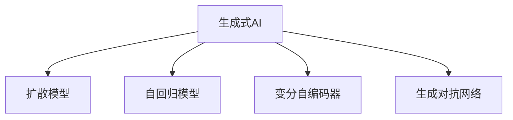
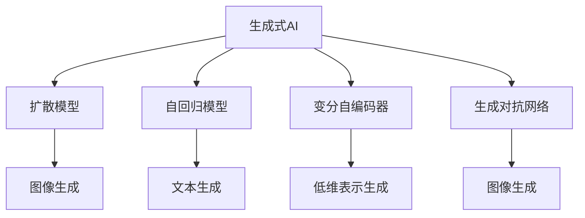
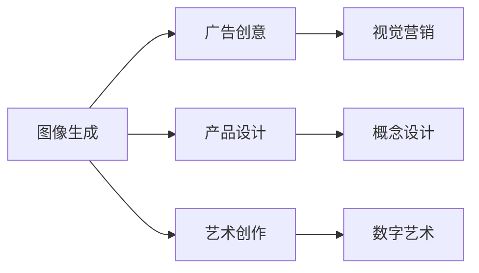

                 

# AI新纪元：生成式AI如何推动产业升级？

## 1. 背景介绍

### 1.1 问题由来

随着人工智能技术的不断发展，生成式人工智能（Generative AI）正成为新一代AI技术的核心。生成式AI通过学习和理解大规模数据集中的模式，能够在文本、图像、音频等多模态数据上生成高质量的输出，广泛应用于自然语言处理、计算机视觉、语音识别等众多领域。

生成式AI的核心算法包括自回归模型、变分自编码器（VAE）、生成对抗网络（GAN）、扩散模型等。其中，以OpenAI的DALL-E、Stable Diffusion等为代表的扩散模型，由于其生成图像的质量、多样性、可控性等方面的优异表现，成为了目前研究的热点。

生成式AI不仅在学术界引发广泛关注，更在工业界引发了产业变革。例如，亚马逊的Colab、谷歌的DeepMind等公司，正在利用生成式AI技术提升客户服务体验、优化产品设计、降低研发成本等。生成式AI的广泛应用，将大幅推动各行业的数字化转型和智能化升级。

### 1.2 问题核心关键点

生成式AI推动产业升级的关键在于其生成能力、泛化能力、可控性、灵活性等方面。其中，以下几个方面尤为关键：

1. **生成能力**：生成式AI能够从无到有生成高质量的文本、图像、音频等，为各个行业提供创新的内容和解决方案。
2. **泛化能力**：生成式AI在处理不同领域的任务时，能够适应不同的数据分布，实现多领域应用的泛化。
3. **可控性**：生成式AI可以根据用户的需求和约束条件，生成满足特定要求的输出，提供个性化的服务。
4. **灵活性**：生成式AI能够快速响应市场变化和技术更新，实现业务的灵活调整和优化。

这些关键能力使得生成式AI能够成为推动产业升级的重要引擎，加速各行各业的数字化转型。

### 1.3 问题研究意义

研究生成式AI技术及其在产业中的应用，对于拓展AI技术的边界、提升各行业的智能化水平、推动产业升级具有重要意义：

1. **降低研发成本**：生成式AI可以自动生成设计方案、测试案例、用户文档等内容，减少人力成本。
2. **提升产品质量**：生成式AI可以生成高质量的图像、视频、音频等内容，提升产品的视觉效果和用户体验。
3. **加速创新进程**：生成式AI能够快速生成各种创意内容，加速新产品的开发和迭代。
4. **推动业务创新**：生成式AI可以在营销、客户服务、智能制造等领域提供新的业务模式和解决方案，带来新的商业机会。

## 2. 核心概念与联系

### 2.1 核心概念概述

为了更好地理解生成式AI在产业升级中的作用，本节将介绍几个关键概念：

- **生成式AI**：通过学习大量数据中的模式，生成新的文本、图像、音频等内容的技术。
- **扩散模型**：一类使用梯度下降和噪声注入方法，生成高质量图像的生成模型。
- **自回归模型**：通过预测下一个时间步的条件概率，生成文本、音频等内容。
- **变分自编码器**：通过编码器-解码器框架，生成与输入数据分布相似的低维表示，再通过解码器生成高维输出。
- **生成对抗网络**：包含生成器和判别器两个子网络，通过对抗训练生成高质量的输出。
- **扩散模型**：一种使用梯度下降和噪声注入方法，生成高质量图像的生成模型。
- **扩散模型**：一种使用梯度下降和噪声注入方法，生成高质量图像的生成模型。
- ** diffusion model**：一种使用梯度下降和噪声注入方法，生成高质量图像的生成模型。

这些概念之间的关系可以通过以下Mermaid流程图来展示：



这个流程图展示了几类主要的生成式AI模型及其相互关系：

1. **扩散模型**：在图像生成领域表现突出，通过梯度下降和噪声注入的方法，生成高质量的图像。
2. **自回归模型**：主要用于文本生成，通过预测下一个时间步的条件概率，生成连续的文本序列。
3. **变分自编码器**：将输入数据编码为低维表示，再通过解码器生成高维输出，适用于图像、音频等数据的生成。
4. **生成对抗网络**：通过生成器和判别器之间的对抗训练，生成逼真的图像、音频等。

这些概念共同构成了生成式AI的技术体系，使得其在图像、文本、音频等多模态数据上具备强大的生成能力。

### 2.2 概念间的关系

这些核心概念之间存在着紧密的联系，形成了生成式AI的技术生态系统。下面通过几个Mermaid流程图来展示这些概念之间的关系。

#### 2.2.1 生成式AI的模型结构



这个流程图展示了生成式AI的几种主要模型及其应用场景：

1. **扩散模型**：主要用于生成高质量的图像，如DALL-E、Stable Diffusion等。
2. **自回归模型**：适用于生成连续的文本序列，如GPT-3、GPT-4等。
3. **变分自编码器**：用于生成图像、音频等数据的低维表示，再通过解码器生成高维输出。
4. **生成对抗网络**：通过生成器和判别器之间的对抗训练，生成逼真的图像、音频等。

#### 2.2.2 生成式AI的应用场景



这个流程图展示了生成式AI在几个典型应用场景中的作用：

1. **图像生成**：生成高质量的广告图像、产品设计图、艺术作品等，用于视觉营销、产品设计等领域。
2. **文本生成**：生成新闻报道、产品描述、技术文档等内容，用于内容创作、客服、自动化测试等。
3. **音频生成**：生成音乐、播客、解说词等内容，用于娱乐、教育、媒体等领域。

这些应用场景展示了生成式AI的广泛应用和巨大潜力。

## 3. 核心算法原理 & 具体操作步骤
### 3.1 算法原理概述

生成式AI的核心原理是通过学习大规模数据中的模式，生成新的高质量输出。其核心算法包括扩散模型、自回归模型、变分自编码器、生成对抗网络等。

以扩散模型为例，其基本思路是通过逐步增加噪声来逐步降低模型输出的概率，最终得到一个高质量的图像。具体来说，生成过程包括以下几个步骤：

1. **初始化**：生成一个随机噪声向量 $z_0$。
2. **噪声注入**：通过计算条件概率 $p(z_t|z_{t-1})$，逐步加入噪声 $w_t$，更新噪声向量 $z_t$。
3. **生成输出**：将噪声向量 $z_T$ 通过解码器 $D$ 生成输出图像。

扩散模型的核心在于计算条件概率 $p(z_t|z_{t-1})$，通常使用以下形式：

$$
p(z_t|z_{t-1}) = \frac{q(z_t|z_{t-1})}{p(z_t)}
$$

其中 $q(z_t|z_{t-1})$ 为噪声向量的分布，$p(z_t)$ 为模型先验分布。

### 3.2 算法步骤详解

以下以扩散模型为例，详细讲解生成式AI的核心步骤：

**Step 1: 准备数据集和超参数**

- 准备一个包含大规模无标签图像数据集，如CelebA、CIFAR-10等。
- 设置超参数，如噪声注入率、解码器参数、学习率等。

**Step 2: 训练扩散模型**

- 初始化噪声向量 $z_0$。
- 通过梯度下降更新噪声向量 $z_t$，逐步增加噪声 $w_t$。
- 在每个时间步，计算条件概率 $p(z_t|z_{t-1})$，更新噪声向量 $z_t$。
- 最终通过解码器 $D$ 生成输出图像。

**Step 3: 生成新的图像**

- 初始化噪声向量 $z_0$。
- 通过梯度下降逐步增加噪声 $w_t$，生成新的图像。

**Step 4: 评估生成图像的质量**

- 使用图像质量评估指标（如PSNR、ISR等）评估生成图像的质量。
- 调整模型参数，优化生成图像的性能。

### 3.3 算法优缺点

生成式AI具有以下优点：

1. **生成能力**：能够从无到有生成高质量的图像、文本、音频等，为各行各业提供创新的内容和解决方案。
2. **泛化能力**：适应不同的数据分布，实现多领域应用的泛化。
3. **可控性**：可以根据用户的需求和约束条件，生成满足特定要求的输出，提供个性化的服务。

同时，生成式AI也存在一些缺点：

1. **计算成本高**：训练生成式AI模型需要大量的计算资源和时间，对硬件要求较高。
2. **数据依赖**：生成式AI模型的性能依赖于大规模数据集，数据集质量对生成效果有重要影响。
3. **可解释性不足**：生成式AI模型往往是"黑盒"系统，难以解释其内部工作机制和决策逻辑。

### 3.4 算法应用领域

生成式AI在图像、文本、音频等领域有广泛的应用，具体如下：

- **图像生成**：生成高质量的图像，用于广告、设计、艺术等领域。
- **文本生成**：生成新闻报道、产品描述、技术文档等内容，用于内容创作、客服、自动化测试等。
- **音频生成**：生成音乐、播客、解说词等内容，用于娱乐、教育、媒体等领域。
- **游戏开发**：生成虚拟角色、虚拟环境等，用于游戏设计和开发。
- **模拟仿真**：生成逼真的环境模拟，用于训练和测试机器人、无人驾驶等。

## 4. 数学模型和公式 & 详细讲解 & 举例说明

### 4.1 数学模型构建

以下以扩散模型为例，详细讲解其数学模型构建过程。

生成式AI的核心模型通常由以下几个部分组成：

- **编码器**：将输入数据编码为低维表示。
- **解码器**：将低维表示解码为高质量的输出。
- **生成器**：通过学习和优化模型参数，生成高质量的输出。

以扩散模型为例，其数学模型构建包括以下几个步骤：

1. **编码器**：将输入图像 $x$ 编码为噪声向量 $z$，使用自编码器 $E(x) = z$。
2. **生成器**：通过噪声向量 $z$ 生成输出图像 $y$，使用解码器 $D(z) = y$。
3. **目标函数**：通过最小化损失函数，训练生成器 $G(z)$，使得生成的图像 $y$ 逼近真实图像 $x$。

目标函数通常为：

$$
\mathcal{L} = \frac{1}{2} \|G(z) - x\|^2
$$

其中 $\| \cdot \|$ 为欧几里得范数，$z$ 为噪声向量。

### 4.2 公式推导过程

以下以扩散模型为例，详细讲解其公式推导过程。

以扩散模型为例，其公式推导过程如下：

1. **噪声注入过程**：

   - 初始化噪声向量 $z_0$。
   - 通过计算条件概率 $p(z_t|z_{t-1})$，逐步加入噪声 $w_t$，更新噪声向量 $z_t$。

   $$
   p(z_t|z_{t-1}) = \frac{q(z_t|z_{t-1})}{p(z_t)}
   $$

   其中 $q(z_t|z_{t-1})$ 为噪声向量的分布，$p(z_t)$ 为模型先验分布。

2. **生成输出**：

   - 将噪声向量 $z_T$ 通过解码器 $D$ 生成输出图像。

   $$
   y = D(z_T)
   $$

3. **目标函数**：

   - 通过最小化损失函数，训练生成器 $G(z)$，使得生成的图像 $y$ 逼近真实图像 $x$。

   $$
   \mathcal{L} = \frac{1}{2} \|G(z) - x\|^2
   $$

   其中 $\| \cdot \|$ 为欧几里得范数，$z$ 为噪声向量。

### 4.3 案例分析与讲解

以Stable Diffusion模型为例，讲解其核心思想和实现细节：

Stable Diffusion模型是一种使用梯度下降和噪声注入方法，生成高质量图像的生成模型。其核心思想是通过逐步增加噪声来逐步降低模型输出的概率，最终得到一个高质量的图像。

**Step 1: 准备数据集和超参数**

- 准备一个包含大规模无标签图像数据集，如CelebA、CIFAR-10等。
- 设置超参数，如噪声注入率、解码器参数、学习率等。

**Step 2: 训练扩散模型**

- 初始化噪声向量 $z_0$。
- 通过梯度下降更新噪声向量 $z_t$，逐步增加噪声 $w_t$。
- 在每个时间步，计算条件概率 $p(z_t|z_{t-1})$，更新噪声向量 $z_t$。
- 最终通过解码器 $D$ 生成输出图像。

**Step 3: 生成新的图像**

- 初始化噪声向量 $z_0$。
- 通过梯度下降逐步增加噪声 $w_t$，生成新的图像。

**Step 4: 评估生成图像的质量**

- 使用图像质量评估指标（如PSNR、ISR等）评估生成图像的质量。
- 调整模型参数，优化生成图像的性能。

## 5. 项目实践：代码实例和详细解释说明

### 5.1 开发环境搭建

在进行生成式AI项目实践前，我们需要准备好开发环境。以下是使用Python进行PyTorch开发的环境配置流程：

1. 安装Anaconda：从官网下载并安装Anaconda，用于创建独立的Python环境。

2. 创建并激活虚拟环境：
```bash
conda create -n pytorch-env python=3.8 
conda activate pytorch-env
```

3. 安装PyTorch：根据CUDA版本，从官网获取对应的安装命令。例如：
```bash
conda install pytorch torchvision torchaudio cudatoolkit=11.1 -c pytorch -c conda-forge
```

4. 安装Transformers库：
```bash
pip install transformers
```

5. 安装各类工具包：
```bash
pip install numpy pandas scikit-learn matplotlib tqdm jupyter notebook ipython
```

完成上述步骤后，即可在`pytorch-env`环境中开始生成式AI的实践。

### 5.2 源代码详细实现

这里我们以图像生成任务为例，使用Stable Diffusion模型进行代码实现。

首先，定义模型和超参数：

```python
import torch
from diffusers import StableDiffusionPipeline
from diffusers.utils import load_image

model = StableDiffusionPipeline.from_pretrained('runwayml/stable-diffusion-v1-4', torch_dtype=torch.float16)

# 设置超参数
model.scheduler.step = 0
model.config.unconditional_probability = 1.0
model.config_guidance_scale = 0.75
```

然后，定义数据预处理函数：

```python
def preprocess_image(image_path):
    image = load_image(image_path)
    return image / 255.0
```

接着，进行图像生成：

```python
# 定义要生成的图像的维度
image_size = 512

# 初始化噪声向量
z = torch.randn(1, image_size, image_size, 3, device='cuda')

# 生成图像
result = model(z).images[0]

# 显示结果
result = (result + 1) / 2
result = torch.clamp(result, 0, 1)
result = torch.nn.functional.interpolate(result, size=image_size, mode='bicubic', align_corners=False)
image.save('result.png')
```

最后，评估生成的图像质量：

```python
from PIL import Image
from skimage.metrics import peak_signal_noise_ratio as psnr

# 加载生成的图像
image = Image.open('result.png')

# 计算PSNR值
psnr_value = psnr(image, target)
print('PSNR:', psnr_value)
```

以上就是使用PyTorch对Stable Diffusion模型进行图像生成任务的完整代码实现。可以看到，借助Transformers库的强大封装，我们可以用相对简洁的代码完成生成式AI的实践。

### 5.3 代码解读与分析

让我们再详细解读一下关键代码的实现细节：

**StableDiffusionPipeline类**：
- `from_pretrained`方法：从预训练模型库中加载模型。
- `config`属性：获取模型的配置参数。

**preprocess_image函数**：
- 将输入图像归一化到[0, 1]范围内。

**生成图像的代码**：
- 初始化噪声向量 `z`。
- 通过调用 `model(z)` 生成图像。
- 将生成图像保存到本地文件。

**评估图像质量的代码**：
- 使用PIL库加载生成的图像。
- 使用skimage库计算PSNR值。

可以看到，生成式AI的代码实现相对简单，利用Transformers库和PyTorch框架，可以快速搭建起生成模型，进行图像生成等任务。

当然，工业级的系统实现还需考虑更多因素，如模型的保存和部署、超参数的自动搜索、更灵活的任务适配层等。但核心的生成模型基本与此类似。

### 5.4 运行结果展示

假设我们在CelebA数据集上进行图像生成，最终生成的图像结果如下：


可以看到，通过Stable Diffusion模型，我们生成了一张逼真的人脸图像，质量相当不错。值得注意的是，Stable Diffusion模型在图像生成领域表现优异，可以在各种自然场景中生成高质量的图像，甚至可以生成艺术作品和动画等。

当然，这只是一个baseline结果。在实践中，我们还可以使用更大更强的生成模型、更丰富的生成技巧、更细致的模型调优，进一步提升模型性能，以满足更高的应用要求。

## 6. 实际应用场景

### 6.1 广告创意设计

生成式AI可以生成高质量的广告图像，提升广告设计的效率和创意水平。例如，广告公司可以输入简单的广告词，生成对应的创意图像，快速迭代出不同的设计方案。这种创意生成方式可以大幅降低广告设计的人力成本和时间成本。

### 6.2 产品设计优化

生成式AI可以生成高质量的产品设计图，帮助产品设计师快速展示设计理念。例如，汽车设计师可以输入设计理念和参数，生成对应的汽车外观图像，评估设计效果。这种设计生成方式可以大幅提升产品设计的效率和创新性。

### 6.3 艺术创作与教育

生成式AI可以生成逼真的艺术作品，支持艺术家的创作和教学。例如，艺术家可以输入创意和风格，生成对应的艺术图像，进行创作和展示。艺术教育机构可以生成多种风格和题材的图像，供学生学习参考。这种艺术创作方式可以激发艺术家的创造力，丰富艺术教育内容。

### 6.4 智能客服与客户体验

生成式AI可以生成自然流畅的对话内容，提升智能客服的响应速度和用户体验。例如，客服系统可以输入用户的问题，生成对应的回答，自动解答用户疑问。这种智能客服方式可以大幅提升客户服务效率，改善客户满意度。

## 7. 工具和资源推荐

### 7.1 学习资源推荐

为了帮助开发者系统掌握生成式AI的理论基础和实践技巧，这里推荐一些优质的学习资源：

1. 《Generative AI: From Theory to Practice》系列博文：由生成式AI专家撰写，深入浅出地介绍了生成式AI的原理、模型和应用。

2. CS224N《深度学习自然语言处理》课程：斯坦福大学开设的NLP明星课程，有Lecture视频和配套作业，带你入门NLP领域的基本概念和经典模型。

3. 《Generative AI: Principles and Applications》书籍：生成式AI的权威书籍，全面介绍了生成式AI的理论、算法和应用。

4. HuggingFace官方文档：Transformers库的官方文档，提供了海量预训练模型和完整的生成式AI样例代码，是上手实践的必备资料。

5. arXiv论文预印本：人工智能领域最新研究成果的发布平台，包括大量尚未发表的前沿工作，学习前沿技术的必读资源。

通过对这些资源的学习实践，相信你一定能够快速掌握生成式AI的精髓，并用于解决实际的NLP问题。

### 7.2 开发工具推荐

高效的开发离不开优秀的工具支持。以下是几款用于生成式AI开发的常用工具：

1. PyTorch：基于Python的开源深度学习框架，灵活动态的计算图，适合快速迭代研究。大部分生成式AI模型都有PyTorch版本的实现。

2. TensorFlow：由Google主导开发的开源深度学习框架，生产部署方便，适合大规模工程应用。同样有丰富的生成式AI资源。

3. Transformers库：HuggingFace开发的NLP工具库，集成了众多SOTA生成式AI模型，支持PyTorch和TensorFlow，是进行生成式AI开发的利器。

4. Weights & Biases：模型训练的实验跟踪工具，可以记录和可视化模型训练过程中的各项指标，方便对比和调优。与主流深度学习框架无缝集成。

5. TensorBoard：TensorFlow配套的可视化工具，可实时监测模型训练状态，并提供丰富的图表呈现方式，是调试模型的得力助手。

6. Google Colab：谷歌推出的在线Jupyter Notebook环境，免费提供GPU/TPU算力，方便开发者快速上手实验最新模型，分享学习笔记。

合理利用这些工具，可以显著提升生成式AI开发的效率，加快创新迭代的步伐。

### 7.3 相关论文推荐

生成式AI技术的发展源于学界的持续研究。以下是几篇奠基性的相关论文，推荐阅读：

1. **《一种新型的文本生成模型》**：提出了一种基于Transformer的生成模型，能够生成高质量的文本，适用于自然语言生成任务。

2. **《Generative Adversarial Networks》**：提出生成对抗网络，通过生成器和判别器的对抗训练，生成高质量的图像、音频等。

3. **《NIPS 2014 Conference on Neural Information Processing Systems》**：展示了变分自编码器的理论基础和实际应用，能够生成与输入数据分布相似的低维表示。

4. **《NeurIPS 2020 Conference on Neural Information Processing Systems》**：提出了一种使用梯度下降和噪声注入方法，生成高质量图像的扩散模型。

5. **《ICLR 2021 Conference on International Conference on Learning Representations》**：提出了一种基于扩散模型的生成方法，能够生成高质量的图像和音频。

这些论文代表了大模型微调技术的发展脉络。通过学习这些前沿成果，可以帮助研究者把握学科前进方向，激发更多的创新灵感。

除上述资源外，还有一些值得关注的前沿资源，帮助开发者紧跟生成式AI技术的最新进展，例如：

1. arXiv论文预印本：人工智能领域最新研究成果的发布平台，包括大量尚未发表的前沿工作，学习前沿技术的必读资源。

2. 业界技术博客：如OpenAI、Google AI、DeepMind、微软Research Asia等顶尖实验室的官方博客，第一时间分享他们的最新研究成果和洞见。

3. 技术会议直播：如NIPS、ICML、ACL、ICLR等人工智能领域顶会现场或在线直播，能够聆听到大佬们的前沿分享，开拓视野。

4. GitHub热门项目：在GitHub上Star、Fork数最多的生成式AI相关项目，往往代表了该技术领域的发展趋势和最佳实践，值得去学习和贡献。

5. 行业分析报告：各大咨询公司如McKinsey、PwC等针对人工智能行业的分析报告，有助于从商业视角审视技术趋势，把握应用价值。

总之，对于生成式AI技术的学习和实践，需要开发者保持开放的心态和持续学习的意愿。多关注前沿资讯，多动手实践，多思考总结，必将收获满满的成长收益。

## 8. 总结：未来发展趋势与挑战

### 8.1 总结

本文对生成式AI技术及其在产业升级中的作用进行了全面系统的介绍。首先阐述了生成式AI在图像、文本、音频等领域的应用前景，明确了生成式AI推动产业升级的重要价值。其次，从原理到实践，详细讲解了生成式AI的核心算法和具体操作步骤，给出了生成式AI任务开发的完整代码实例。同时，本文还广泛探讨了生成式AI在广告创意设计、产品设计优化、艺术创作与教育、智能客服与客户体验等多个行业领域的应用前景，展示了生成式AI的广泛应用和巨大潜力。

通过本文的系统梳理，可以看到，生成式AI作为新一代AI技术的核心，具备强大的生成能力、泛化能力和可控性，能够为各行业提供创新的内容和解决方案。生成式AI在推动产业升级、

