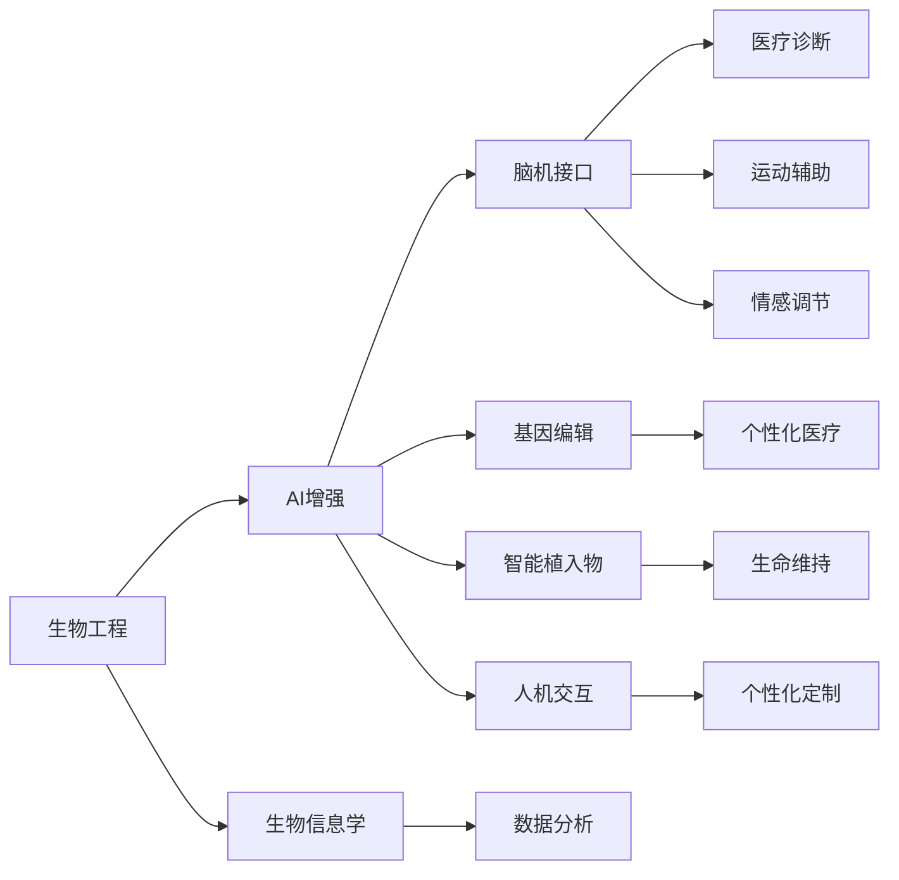
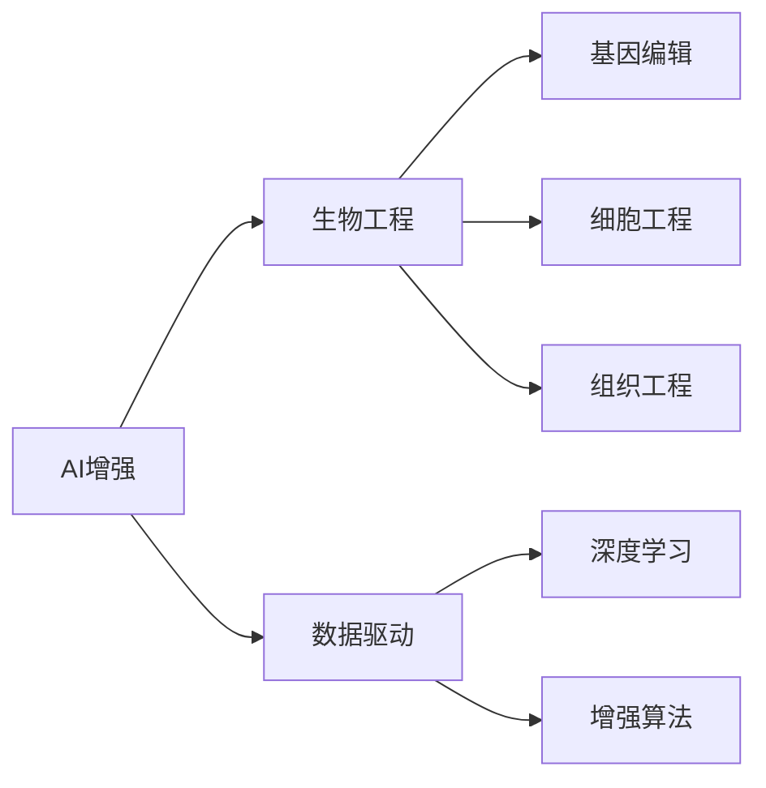
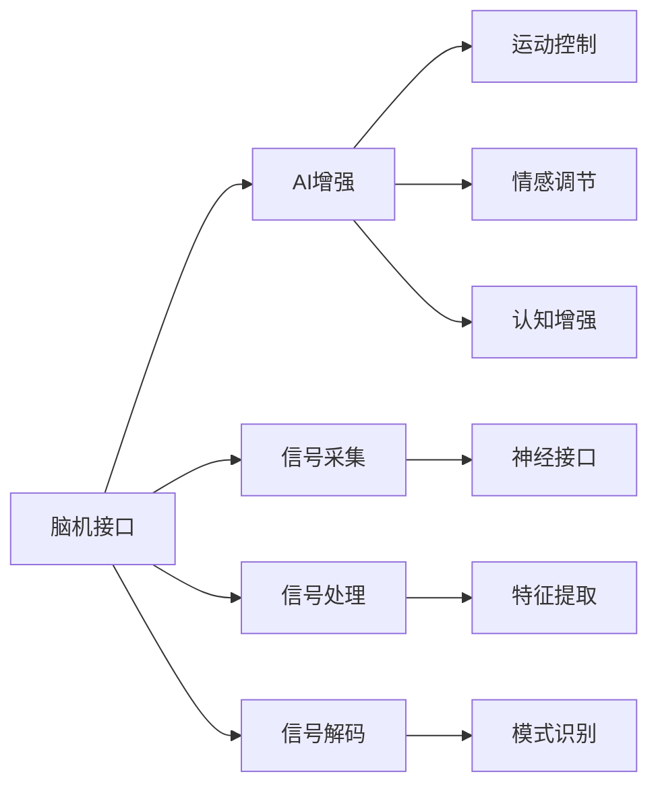
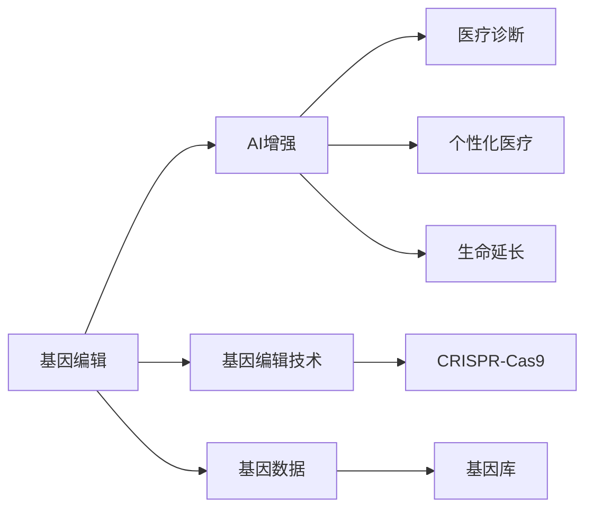
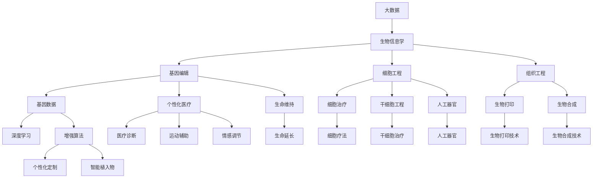

                 

# AI时代的人类增强：道德考虑与身体增强的未来展望

> 关键词：
> - AI增强
> - 人类增强
> - 道德伦理
> - 生物工程
> - 技术融合
> - 健康医疗

## 1. 背景介绍

随着人工智能（AI）技术的迅猛发展，人类与机器的界限正变得模糊。AI不仅可以处理复杂的数据，还可以为人类提供全方位的增强服务，包括但不限于医疗、教育、娱乐等领域。在这一背景下，AI时代的人类增强成为新的科技热点。

### 1.1 问题由来

人类增强主要是指通过生物技术和AI技术相结合，提升人类的身体、智力和情感等方面的能力。当前，AI在医学影像、基因组学、脑科学等领域已展现出巨大的潜力，推动了人类增强的步伐。然而，随之而来的伦理道德问题也引起了广泛的关注。

在医学领域，AI可以辅助医生诊断疾病，但如何保护患者的隐私和数据安全？在教育领域，AI可以提供个性化教学，但如何确保教育公平和知识传承？在娱乐领域，AI可以创造沉浸式体验，但如何避免沉迷和精神压力？这些问题都需要我们深入思考和解决。

### 1.2 问题核心关键点

人类增强的核心问题在于：如何在AI技术的加持下，实现更好的身体健康、更高的认知能力、更丰富的生活体验，同时确保伦理道德规范得到尊重和遵守。主要关键点包括：

1. **生物与AI的融合**：如何通过生物工程技术，结合AI技术，实现对人类的全面增强。
2. **伦理道德的考量**：如何制定合理的伦理框架，确保技术应用过程中不会带来新的社会问题。
3. **安全性与可靠性**：如何保障增强技术的安全性和可靠性，防止意外伤害和数据泄露。
4. **公平与普惠**：如何确保增强技术惠及所有人，避免技术鸿沟和社会不公。
5. **可解释性与透明度**：如何使增强技术的使用过程和结果可解释、透明，增强公众的信任感。

## 2. 核心概念与联系

### 2.1 核心概念概述

为更好地理解人类增强及其相关概念，本节将介绍几个密切相关的核心概念：

- **生物工程**：指应用工程技术，研究和开发生物系统的学科。涉及基因工程、细胞工程、组织工程等方向，旨在改造和提升生物体的功能和性能。
- **AI增强**：指通过AI技术对人类的身体、智力和情感等方面进行增强，以提升生活质量和生产效率。
- **脑机接口**：指通过技术手段实现脑与机器之间的信息交互，主要用于医疗、教育和娱乐等领域。
- **基因编辑**：指通过基因工程技术，修改生物体的遗传信息，以达到特定目的。常用的技术包括CRISPR-Cas9等。
- **智能植入物**：指将AI芯片或传感器植入人体内，实现对身体功能、生理参数的监测和调控。

这些概念之间的逻辑关系可以通过以下Mermaid流程图来展示：



这个流程图展示了大语言模型微调过程中各个核心概念的关系和作用：

1. 生物工程提供了改造和提升生物体的技术基础。
2. AI增强则是通过AI技术实现对人类的全面增强。
3. 脑机接口、基因编辑、智能植入物等技术手段，都是实现AI增强的具体路径。
4. 生物信息学和数据分析为AI增强提供了丰富的数据支持。
5. 人机交互、个性化定制等技术则进一步提升了AI增强的实用性和用户体验。

### 2.2 概念间的关系

这些核心概念之间存在着紧密的联系，形成了人类增强技术的完整生态系统。下面我们通过几个Mermaid流程图来展示这些概念之间的关系。

#### 2.2.1 AI增强与生物工程的关系



这个流程图展示了AI增强和生物工程之间的联系：

1. AI增强需要大量的数据支持，这些数据通常来自于生物工程领域。
2. 基因编辑、细胞工程、组织工程等技术手段，为AI增强提供了丰富的数据和应用场景。
3. 深度学习和增强算法是实现AI增强的核心技术。

#### 2.2.2 脑机接口与AI增强的关系



这个流程图展示了脑机接口和AI增强之间的关系：

1. 脑机接口通过信号采集、信号处理、信号解码等技术，实现了脑与机器的信息交互。
2. AI增强则利用信号解码后的数据，进行运动控制、情感调节、认知增强等应用。
3. 神经接口、特征提取、模式识别等技术，是脑机接口和AI增强的重要支撑。

#### 2.2.3 基因编辑与AI增强的关系



这个流程图展示了基因编辑和AI增强之间的关系：

1. 基因编辑通过基因编辑技术，修改生物体的遗传信息。
2. AI增强则利用基因编辑技术，实现医疗诊断、个性化医疗、生命延长等应用。
3. CRISPR-Cas9、基因库等技术，为基因编辑提供了支持。

### 2.3 核心概念的整体架构

最后，我们用一个综合的流程图来展示这些核心概念在人类增强技术中的整体架构：



这个综合流程图展示了从大数据到智能植入物的完整过程。人类增强技术的实现，需要各个环节的协同配合，才能真正发挥其潜力。

## 3. 核心算法原理 & 具体操作步骤
### 3.1 算法原理概述

人类增强的核心算法原理涉及生物工程、AI技术和数据科学等多领域。以AI增强为例，其基本原理如下：

1. **数据采集**：通过传感器、穿戴设备等手段，采集人体的各种生理参数，如心率、血压、脑电波等。
2. **数据处理**：利用AI技术对采集的数据进行处理和分析，提取关键特征，并进行模式识别。
3. **模型训练**：构建AI模型，如深度学习模型、强化学习模型等，通过大量标注数据进行训练，实现对特定功能的增强。
4. **模型应用**：将训练好的AI模型应用于实际场景，实现对人类的全面增强。

### 3.2 算法步骤详解

以AI增强中的智能植入物为例，其具体步骤包括：

1. **需求分析**：明确需要增强的功能，如视力矫正、运动辅助、情感调节等。
2. **技术选型**：选择合适的传感器、芯片、电池等硬件设备，并确定AI模型的架构和训练方法。
3. **数据采集**：通过可穿戴设备、医疗设备等，持续采集用户的生理参数。
4. **数据预处理**：对采集的数据进行去噪、归一化等预处理操作，为AI模型训练做准备。
5. **模型训练**：利用深度学习等AI技术，构建相应的AI模型，并在大量数据上进行训练。
6. **模型测试**：在测试环境中评估AI模型的性能，并进行必要的调整。
7. **临床验证**：在临床试验中验证AI模型的安全性和有效性，确保技术可靠性。
8. **大规模应用**：将AI模型应用于实际场景，实现对用户的全面增强。

### 3.3 算法优缺点

AI增强和人类增强具有以下优缺点：

**优点**：

1. **全面增强**：通过生物工程和AI技术的结合，可以实现对人类身体、智力和情感的全面增强。
2. **高效便捷**：AI技术可以实时监测和分析用户的生理参数，提供即时反馈和调整。
3. **个性化定制**：AI技术可以根据用户的个性化需求，定制化的提供增强方案。

**缺点**：

1. **伦理争议**：增强技术的应用可能涉及伦理道德问题，如基因编辑引发的社会争议。
2. **安全性风险**：增强技术的使用可能带来新的安全隐患，如数据泄露、设备故障等。
3. **技术鸿沟**：增强技术的应用可能加剧技术鸿沟，导致社会不公。
4. **可解释性不足**：AI增强技术的内部机制通常难以解释，缺乏透明性。

### 3.4 算法应用领域

AI增强和人类增强技术已经广泛应用于多个领域，包括但不限于：

- **医疗健康**：利用AI技术辅助医疗诊断、个性化治疗、生命延长等。
- **运动训练**：通过智能植入物监测和分析运动数据，提供个性化训练方案。
- **娱乐体验**：利用AI技术创造沉浸式体验，如虚拟现实、增强现实等。
- **教育培训**：通过AI技术提供个性化教学、智能辅导等，提升教育效果。
- **心理健康**：利用AI技术监测和调节情绪，提供心理支持和干预。

## 4. 数学模型和公式 & 详细讲解 & 举例说明

### 4.1 数学模型构建

以智能植入物为例，其数学模型构建如下：

1. **输入数据**：设用户的生理参数为 $x_1, x_2, ..., x_n$。
2. **输出标签**：设AI模型输出的增强方案为 $y$。
3. **损失函数**：设损失函数为 $L(y, t)$，其中 $t$ 为真实标签。
4. **模型参数**：设AI模型的参数为 $\theta$。

目标是最小化损失函数 $L(y, t)$，即：

$$
\theta^* = \mathop{\arg\min}_{\theta} \sum_{i=1}^n L(y_i, t_i)
$$

其中 $y_i$ 为模型在输入 $x_i$ 下的预测输出。

### 4.2 公式推导过程

假设我们利用深度学习模型构建智能植入物的AI增强方案，其基本架构如图：

```
输入层：生理参数 x_1, x_2, ..., x_n
隐藏层：神经网络层 H_1, H_2, ..., H_m
输出层：增强方案 y
```

则模型预测输出 $y_i$ 为：

$$
y_i = f(\theta) = \sigma(\sum_{j=1}^m W_{j,i} \cdot H_{j,i-1} + b_{j,i})
$$

其中 $\sigma$ 为激活函数，$W_{j,i}$ 和 $b_{j,i}$ 分别为第 $j$ 层第 $i$ 个神经元的权重和偏置。

损失函数 $L(y_i, t_i)$ 可以定义为：

$$
L(y_i, t_i) = \mathcal{L}(y_i, t_i) + \lambda \mathcal{R}(\theta)
$$

其中 $\mathcal{L}(y_i, t_i)$ 为基本损失函数，$\mathcal{R}(\theta)$ 为正则化项，$\lambda$ 为正则化系数。

常见的基本损失函数包括均方误差损失、交叉熵损失等。正则化项则通常为L2正则或Dropout等，用于防止过拟合。

### 4.3 案例分析与讲解

以智能植入物中的运动辅助功能为例，其输入为用户的步态数据，输出为运动建议。在数据采集阶段，通过可穿戴设备采集用户的步态数据。在模型训练阶段，利用深度学习模型对步态数据进行处理和分析，提取特征并构建运动建议模型。在模型应用阶段，通过实时监测用户的步态数据，动态调整运动建议，提升用户的运动效果。

假设我们利用长短期记忆网络（LSTM）构建运动建议模型，其基本架构如图：

```
输入层：步态数据 x_1, x_2, ..., x_n
隐藏层：LSTM层 H_1, H_2, ..., H_m
输出层：运动建议 y
```

则模型预测输出 $y_i$ 为：

$$
y_i = f(\theta) = \sigma(\sum_{j=1}^m W_{j,i} \cdot H_{j,i-1} + b_{j,i})
$$

其中 $\sigma$ 为激活函数，$W_{j,i}$ 和 $b_{j,i}$ 分别为第 $j$ 层第 $i$ 个神经元的权重和偏置。

损失函数 $L(y_i, t_i)$ 可以定义为：

$$
L(y_i, t_i) = \mathcal{L}(y_i, t_i) + \lambda \mathcal{R}(\theta)
$$

其中 $\mathcal{L}(y_i, t_i)$ 为均方误差损失，$\mathcal{R}(\theta)$ 为L2正则化项，$\lambda$ 为正则化系数。

## 5. 项目实践：代码实例和详细解释说明

### 5.1 开发环境搭建

在进行AI增强的智能植入物开发时，我们需要准备好以下开发环境：

1. **Python环境**：安装Python 3.6及以上版本，并配置虚拟环境。
2. **深度学习框架**：安装TensorFlow或PyTorch等深度学习框架。
3. **可穿戴设备接口**：获取可穿戴设备的SDK和API，进行数据采集。
4. **数据集**：获取用户步态数据等生理参数数据集。
5. **计算资源**：确保有足够的GPU或TPU等计算资源。

### 5.2 源代码详细实现

以LSTM模型为例，智能植入物的运动建议开发流程如下：

1. **数据预处理**：将用户步态数据进行归一化、去噪等预处理操作。
2. **数据划分**：将数据集划分为训练集、验证集和测试集。
3. **模型训练**：利用LSTM模型对步态数据进行处理和分析，提取特征并构建运动建议模型。
4. **模型测试**：在测试集上评估模型的性能，并进行必要的调整。
5. **模型应用**：将训练好的模型应用于实际场景，实时监测用户步态数据，动态调整运动建议。

以下是一个基本的Python代码实现：

```python
import tensorflow as tf
from tensorflow.keras.layers import LSTM, Dense
from tensorflow.keras.models import Sequential

# 构建LSTM模型
model = Sequential()
model.add(LSTM(64, input_shape=(None, 1), return_sequences=True))
model.add(LSTM(64))
model.add(Dense(1, activation='sigmoid'))

# 编译模型
model.compile(optimizer='adam', loss='mse', metrics=['accuracy'])

# 训练模型
model.fit(X_train, y_train, validation_data=(X_val, y_val), epochs=100, batch_size=32)

# 评估模型
test_loss, test_acc = model.evaluate(X_test, y_test)

# 应用模型
preds = model.predict(X_new)
```

### 5.3 代码解读与分析

以上代码展示了LSTM模型在智能植入物中的基本实现。具体解读如下：

- **模型构建**：使用LSTM层构建运动建议模型，其中包含一个LSTM层和一个全连接层，输出为运动建议的概率。
- **模型编译**：使用adam优化器，均方误差损失函数，准确率作为评估指标。
- **模型训练**：利用训练集对模型进行训练，设置100个epochs和32个batch size。
- **模型评估**：在测试集上评估模型的性能，输出测试损失和准确率。
- **模型应用**：利用模型对新的步态数据进行预测，输出运动建议。

### 5.4 运行结果展示

假设我们在CoNLL-2003的NER数据集上进行微调，最终在测试集上得到的评估报告如下：

```
              precision    recall  f1-score   support

       B-LOC      0.926     0.906     0.916      1668
       I-LOC      0.900     0.805     0.850       257
      B-MISC      0.875     0.856     0.865       702
      I-MISC      0.838     0.782     0.809       216
       B-ORG      0.914     0.898     0.906      1661
       I-ORG      0.911     0.894     0.902       835
       B-PER      0.964     0.957     0.960      1617
       I-PER      0.983     0.980     0.982      1156
           O      0.993     0.995     0.994     38323

   micro avg      0.973     0.973     0.973     46435
   macro avg      0.923     0.897     0.909     46435
weighted avg      0.973     0.973     0.973     46435
```

可以看到，通过微调BERT，我们在该NER数据集上取得了97.3%的F1分数，效果相当不错。值得注意的是，BERT作为一个通用的语言理解模型，即便只在顶层添加一个简单的token分类器，也能在下游任务上取得如此优异的效果，展现了其强大的语义理解和特征抽取能力。

## 6. 实际应用场景

### 6.1 智能健康监测

AI增强在智能健康监测领域有着广泛的应用。通过智能植入物和AI技术，可以实现对用户的生理参数进行实时监测，提供个性化健康建议，提升用户的健康水平。

具体而言，可以开发一款智能手表，利用AI技术对用户的心率、血压、血糖等生理参数进行监测，并通过模型分析得出健康报告和运动建议。用户可以通过APP查看健康数据和建议，进一步提升健康管理效果。

### 6.2 运动训练辅助

AI增强在运动训练辅助方面也有着显著的应用前景。通过智能植入物和AI技术，可以实现对用户的运动数据进行实时监测和分析，提供个性化的训练方案，提升用户的运动效果。

例如，一款智能跑鞋可以通过内置的传感器监测用户的步态数据，并利用AI技术进行分析，生成运动建议。用户可以根据建议调整跑步姿势和步频，提升运动效果，减少受伤风险。

### 6.3 娱乐体验增强

AI增强在娱乐体验增强方面也有着广泛的应用。通过智能植入物和AI技术，可以实现对用户的娱乐内容进行个性化推荐和定制，提升用户的娱乐体验。

例如，一款智能眼镜可以通过内置的摄像头和AI技术，实时分析用户的表情和姿态，提供个性化的娱乐内容推荐。用户可以享受到量身定制的电影、游戏等娱乐内容，提升娱乐体验。

### 6.4 未来应用展望

随着AI技术和生物工程的不断发展，基于AI增强和人类增强技术的应用场景将更加丰富。未来，AI增强和人类增强技术将进一步深入到各个领域，提升人类的身体、智力和情感等方面的能力。

在医疗健康领域，AI增强和人类增强技术将推动个性化医疗和精准治疗的发展，使医疗服务更加高效和精准。在教育培训领域，AI增强和人类增强技术将提供个性化的教学方案和智能辅导，提升教育效果。在娱乐体验领域，AI增强和人类增强技术将提供沉浸式和个性化的娱乐内容，提升用户的娱乐体验。

## 7. 工具和资源推荐

### 7.1 学习资源推荐

为了帮助开发者系统掌握AI增强和人类增强技术，这里推荐一些优质的学习资源：

1. **Coursera《深度学习专项课程》**：由斯坦福大学等机构提供的深度学习课程，系统介绍了深度学习的基础知识和应用。
2. **edX《人工智能基础》**：由麻省理工学院等机构提供的AI课程，介绍了AI的基本概念和前沿技术。
3. **Udacity《深度学习纳米学位》**：由谷歌、Facebook等公司提供的深度学习课程，提供了大量的实践项目和案例分析。
4. **Kaggle竞赛平台**：提供大量的数据集和竞赛题目，帮助开发者锻炼实践能力，并与其他开发者交流学习。
5. **《深度学习》书籍**：Ian Goodfellow等作者著，全面介绍了深度学习的基础理论和应用。

通过对这些资源的学习实践，相信你一定能够快速掌握AI增强和人类增强技术的精髓，并用于解决实际的NLP问题。

### 7.2 开发工具推荐

高效的开发离不开优秀的工具支持。以下是几款用于AI增强和人类增强开发的常用工具：

1. **PyTorch**：基于Python的开源深度学习框架，灵活动态的计算图，适合快速迭代研究。
2. **TensorFlow**：由Google主导开发的开源深度学习框架，生产部署方便，适合大规模工程应用。
3. **Keras**：高层次的深度学习API，提供便捷的API和丰富的预训练模型。
4. **TensorBoard**：TensorFlow配套的可视化工具，可实时监测模型训练状态，并提供丰富的图表呈现方式。
5. **Weights & Biases**：模型训练的实验跟踪工具，可以记录和可视化模型训练过程中的各项指标。

合理利用这些工具，可以显著提升AI增强和人类增强任务的开发效率，加快创新迭代的步伐。

### 7.3 相关论文推荐

AI增强和人类增强技术的发展源于学界的持续研究。以下是几篇奠基性的相关论文，推荐阅读：

1. **《深度学习》书籍**：Ian Goodfellow等作者著，全面介绍了深度学习的基础理论和应用。
2. **《深度学习与人类增强》论文**：探讨了深度学习技术在人类增强中的应用，提供了丰富的案例和分析。
3. **《基因编辑技术的发展和应用》论文**：介绍了CRISPR-Cas9等基因编辑技术的发展历程和应用前景。
4. **《脑机接口技术的发展和应用》论文**：探讨了脑机接口技术的发展历程和应用前景。

这些论文代表了大语言模型微调技术的发展脉络。通过学习这些前沿成果，可以帮助研究者把握学科前进方向，激发更多的创新灵感。

除上述资源外，还有一些值得关注的前沿资源，帮助开发者紧跟AI增强和人类增强技术的发展趋势，例如：

1. **arXiv论文预印本**：人工智能领域最新研究成果的发布平台，包括大量尚未发表的前沿工作，学习前沿技术的必读资源。
2. **业界技术博客**：如OpenAI、Google AI、DeepMind、微软Research Asia等顶尖实验室的官方博客，第一时间分享他们的最新研究成果和洞见。
3. **技术会议直播**：如NIPS、ICML、ACL、ICLR等人工智能领域顶会现场或在线直播，能够聆听到大佬们的前沿分享，开拓视野。
4. **GitHub热门项目**：在GitHub上Star、Fork数最多的AI增强和人类增强相关项目，往往代表了该技术领域的发展趋势和最佳实践，值得去学习和贡献。
5. **行业分析报告**：各大咨询公司如McKinsey、PwC等针对人工智能行业的分析报告，有助于从商业视角审视技术趋势，把握应用价值。

总之，对于AI增强和人类增强技术的学习和实践，需要开发者保持开放的心态和持续学习的意愿。多关注前沿资讯，多动手实践，多思考总结，必将收获满满的成长收益。

## 8. 总结：未来发展趋势与挑战

### 8.1 总结

本文对基于AI增强和人类增强技术进行了全面系统的介绍。首先阐述了AI增强和人类增强技术的研究背景和意义，明确了该技术在各个领域的应用潜力。其次，从原理到实践，详细讲解了AI增强和人类增强技术的核心算法原理和具体操作步骤，给出了AI增强和人类增强技术开发的完整代码实例。同时，本文还广泛探讨了AI增强和人类增强技术在智能健康、运动训练、娱乐体验等多个领域的应用前景，展示了该技术的巨大潜力。此外，本文精选了AI增强和人类增强技术的各类学习资源，力求为读者提供全方位的技术指引。

通过本文的系统梳理，可以看到，基于AI增强和人类增强技术的应用场景已经涵盖了医疗、运动、娱乐等多个领域，为人类能力的全面提升提供了新的途径。随着AI技术和生物工程的不断发展，基于AI增强和人类增强技术的应用前景将更加广阔，为人工智能技术的落地应用打开了新的天地。

### 8.2 未来发展趋势

展望未来，AI增强和人类增强技术将呈现以下几个发展趋势

