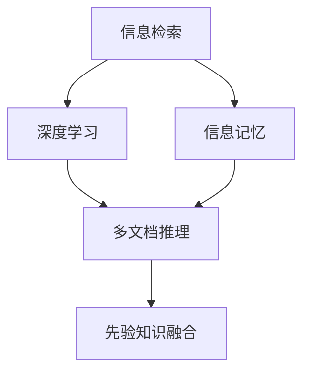
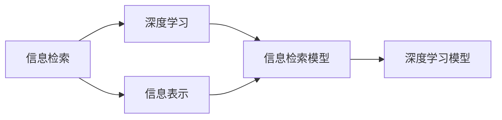
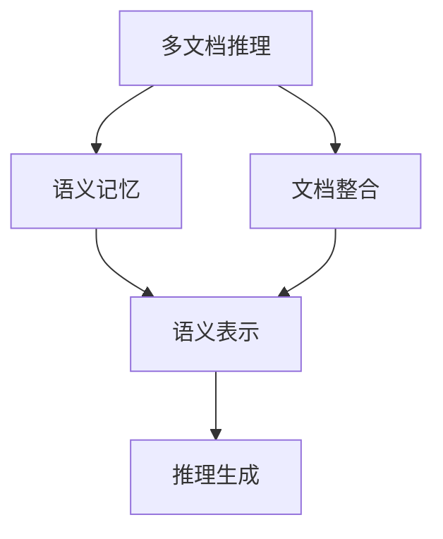
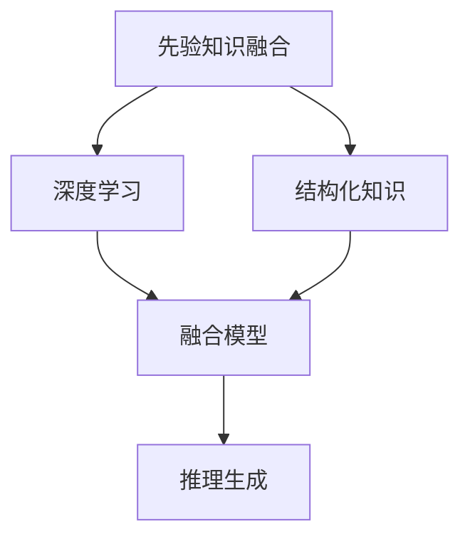
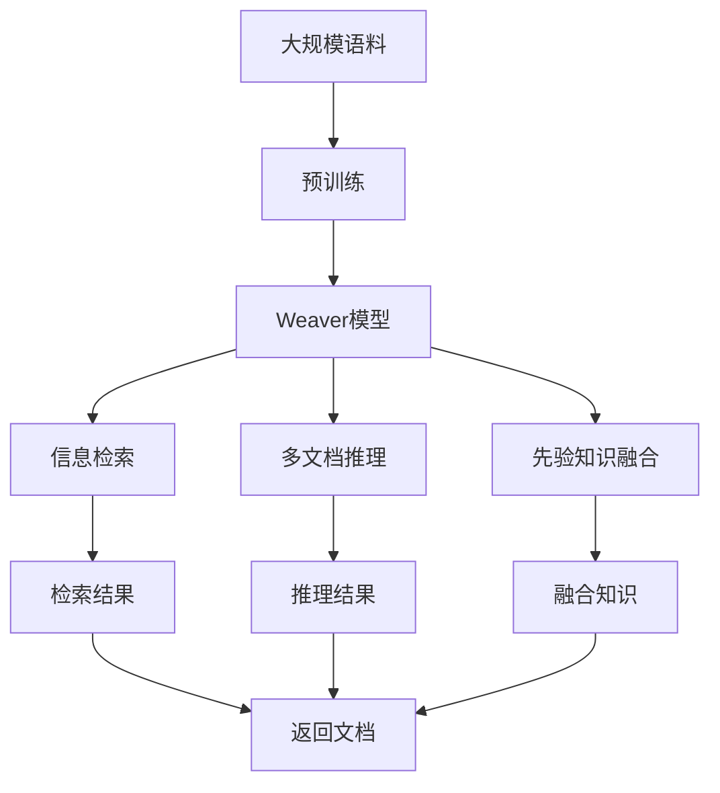

                 

# AI时代的信息记忆：Weaver模型的记忆能力

> 关键词：信息记忆, Weaver模型, 信息检索, 深度学习, 自然语言处理(NLP)

## 1. 背景介绍

### 1.1 问题由来
在现代社会，信息爆炸导致人们面临海量数据处理的挑战。如何高效地存储、检索和管理这些信息，成为计算机科学和人工智能领域的核心问题之一。传统的信息检索系统往往依赖于固定格式的数据库和搜索引擎，难以处理非结构化和异构数据，也无法深度理解信息的内涵。

近年来，深度学习技术在自然语言处理(NLP)领域取得了巨大突破，特别在语言模型、语义理解等方面表现出色。以BERT、GPT等大语言模型为例，通过在大规模无标签文本上预训练，掌握了丰富的语言知识和语义信息，具备了一定程度的语义记忆能力。这些模型在问答、摘要、翻译等NLP任务上表现优异，显示了其在信息记忆方面的强大潜力。

但是，这些大语言模型主要针对通用的语言表示进行了训练，缺乏针对特定领域信息的记忆能力。因此，如何构建具有记忆能力的模型，使其能够针对特定领域的语料进行深度学习，成为当前NLP研究的一个重要课题。

### 1.2 问题核心关键点
Weaver模型是一种新型的信息记忆模型，专为解决特定领域的语料信息记忆问题而设计。与传统大语言模型相比，Weaver模型在信息记忆和检索方面的能力更加突出，具有以下几个特点：

- **针对性记忆**：Weaver模型通过细粒度任务适配层，针对特定领域信息进行记忆，如新闻摘要、文献检索等。
- **记忆增强**：通过增量学习机制，Weaver模型能够不断吸收新信息，更新和扩展知识库。
- **多文档推理**：Weaver模型支持多文档推理，通过整合不同文档信息，生成更加全面准确的答案。
- **融合先验知识**：Weaver模型能够融合结构化知识，如知识图谱、逻辑规则等，提升模型的推理能力。

通过这些特点，Weaver模型能够更好地适应特定领域的语料，具有更强的信息记忆和检索能力，为解决大规模信息处理问题提供了新的途径。

### 1.3 问题研究意义
Weaver模型的研究对于提升信息检索系统的效率和精度，推动特定领域知识库的构建，具有重要意义：

1. **提升信息检索效率**：Weaver模型能够根据用户查询进行深度语义理解，快速检索出最相关的文档，提高信息检索的效率和准确性。
2. **增强知识库构建能力**：Weaver模型能够自动地从大规模语料中学习并记忆特定领域的知识，为知识库的构建提供了高效的技术支撑。
3. **支持多文档推理**：Weaver模型通过多文档推理，能够整合不同文档的信息，生成更加全面准确的答案，进一步提升信息检索和问答系统的能力。
4. **融合先验知识**：Weaver模型能够融合结构化知识，如知识图谱、逻辑规则等，提升模型的推理能力，实现更加智能的问答和推荐系统。

Weaver模型的研究和应用，将为信息检索和知识管理等领域带来革命性变化，推动人工智能技术在更广泛的场景中落地应用。

## 2. 核心概念与联系

### 2.1 核心概念概述

为更好地理解Weaver模型的信息记忆能力，本节将介绍几个密切相关的核心概念：

- **信息检索**：利用自然语言处理技术和数据库检索技术，从大量信息源中检索出最相关的文档和信息的过程。
- **深度学习**：一种基于神经网络的机器学习范式，通过多层次的特征抽象，提升模型的表达能力和泛化能力。
- **语义记忆**：指模型能够理解并记忆语言的语义信息，具备对特定领域信息的记忆能力。
- **多文档推理**：指模型能够整合不同文档的信息，进行推理和生成，生成更加全面准确的答案。
- **先验知识融合**：指模型能够融合结构化知识，如知识图谱、逻辑规则等，提升模型的推理能力。

这些核心概念之间的逻辑关系可以通过以下Mermaid流程图来展示：



这个流程图展示了信息检索、深度学习、语义记忆、多文档推理和先验知识融合之间的关系：

1. 信息检索通过自然语言处理技术，将用户查询转化为模型可以理解的形式，再通过深度学习模型进行信息检索。
2. 深度学习模型通过多层次的特征抽象，提升了模型的表达能力和泛化能力，特别是针对特定领域的信息记忆能力。
3. 语义记忆是深度学习模型的一个重要特征，模型能够理解并记忆语言的语义信息，具备对特定领域信息的记忆能力。
4. 多文档推理是指模型能够整合不同文档的信息，进行推理和生成，生成更加全面准确的答案。
5. 先验知识融合是指模型能够融合结构化知识，如知识图谱、逻辑规则等，提升模型的推理能力。

### 2.2 概念间的关系

这些核心概念之间存在着紧密的联系，形成了Weaver模型信息记忆的整体架构。下面我们通过几个Mermaid流程图来展示这些概念之间的关系。

#### 2.2.1 信息检索与深度学习的关系



这个流程图展示了信息检索与深度学习的关系：

1. 信息检索通过自然语言处理技术，将用户查询转化为模型可以理解的形式，即信息表示。
2. 信息检索模型（如搜索引擎）根据信息表示，从数据库中检索出最相关的文档。
3. 深度学习模型（如BERT、GPT）通过多层次的特征抽象，提升了模型的表达能力和泛化能力，特别是针对特定领域的信息记忆能力。
4. 信息检索模型将检索到的文档作为输入，深度学习模型进行信息记忆和推理，生成答案。

#### 2.2.2 多文档推理与语义记忆的关系



这个流程图展示了多文档推理与语义记忆的关系：

1. 多文档推理通过整合不同文档的信息，进行推理和生成。
2. 文档整合是指将不同文档中的信息进行整合，形成一个统一的语义空间。
3. 语义记忆模型通过学习不同文档的信息，形成语义表示，具备对特定领域信息的记忆能力。
4. 语义表示通过推理生成技术，生成更加全面准确的答案。

#### 2.2.3 先验知识融合与深度学习的关系



这个流程图展示了先验知识融合与深度学习的关系：

1. 先验知识融合是指模型能够融合结构化知识，如知识图谱、逻辑规则等。
2. 结构化知识提供了模型所需的外部信息，帮助模型更好地进行推理和生成。
3. 深度学习模型通过学习结构化知识和自然语言信息，形成综合的语义表示。
4. 语义表示通过推理生成技术，生成更加全面准确的答案。

### 2.3 核心概念的整体架构

最后，我们用一个综合的流程图来展示这些核心概念在Weaver模型中的整体架构：



这个综合流程图展示了从预训练到Weaver模型整体架构，从信息检索到多文档推理和先验知识融合的全流程：

1. Weaver模型首先在大规模语料上进行预训练，学习通用的语言表示。
2. Weaver模型通过细粒度任务适配层，针对特定领域的信息进行记忆，支持信息检索、多文档推理和先验知识融合。
3. Weaver模型根据用户查询进行深度语义理解，从语料中检索出最相关的文档，支持信息检索。
4. Weaver模型整合不同文档的信息，进行推理和生成，生成更加全面准确的答案，支持多文档推理。
5. Weaver模型融合结构化知识，如知识图谱、逻辑规则等，提升模型的推理能力，支持先验知识融合。
6. Weaver模型返回检索或推理的结果，完成信息检索或问答任务。

通过这些流程图，我们可以更清晰地理解Weaver模型信息记忆的整体架构，为后续深入讨论具体的模型结构和微调方法奠定基础。

## 3. 核心算法原理 & 具体操作步骤
### 3.1 算法原理概述

Weaver模型是一种基于深度学习的信息记忆模型，通过预训练和微调的方式，实现对特定领域信息的深度学习。Weaver模型的核心算法原理包括以下几个关键步骤：

1. **预训练**：在大规模无标签文本数据上进行自监督学习，学习通用的语言表示。
2. **微调**：在特定领域的标注数据上，进行有监督的微调，提升模型在该领域的信息记忆能力。
3. **信息检索**：根据用户查询，通过多文档推理和先验知识融合，检索出最相关的文档和信息。
4. **多文档推理**：整合不同文档的信息，进行推理和生成，生成更加全面准确的答案。
5. **先验知识融合**：融合结构化知识，如知识图谱、逻辑规则等，提升模型的推理能力。

形式化地，假设预训练语言模型为 $M_{\theta}$，其中 $\theta$ 为预训练得到的模型参数。给定特定领域的数据集 $D=\{(x_i, y_i)\}_{i=1}^N$，Weaver模型的微调目标是最小化经验风险，即找到新的模型参数 $\hat{\theta}$，使得：

$$
\hat{\theta}=\mathop{\arg\min}_{\theta} \mathcal{L}(M_{\theta},D)
$$

其中 $\mathcal{L}$ 为针对特定领域设计的损失函数，用于衡量模型预测输出与真实标签之间的差异。

### 3.2 算法步骤详解

Weaver模型的微调一般包括以下几个关键步骤：

**Step 1: 准备预训练模型和数据集**
- 选择合适的预训练语言模型 $M_{\theta}$ 作为初始化参数，如BERT、GPT等。
- 准备特定领域的数据集 $D$，划分为训练集、验证集和测试集。数据集应包含领域内的通用文本和特定任务的标注数据。

**Step 2: 添加任务适配层**
- 根据特定领域，设计合适的任务适配层，如命名实体识别、事件抽取、文本分类等。适配层通常包括输入编码、任务编码和输出解码等部分。

**Step 3: 设置微调超参数**
- 选择合适的优化算法及其参数，如Adam、SGD等，设置学习率、批大小、迭代轮数等。
- 设置正则化技术及强度，包括权重衰减、Dropout、Early Stopping等。
- 确定冻结预训练参数的策略，如仅微调顶层，或全部参数都参与微调。

**Step 4: 执行梯度训练**
- 将训练集数据分批次输入模型，前向传播计算损失函数。
- 反向传播计算参数梯度，根据设定的优化算法和学习率更新模型参数。
- 周期性在验证集上评估模型性能，根据性能指标决定是否触发 Early Stopping。
- 重复上述步骤直到满足预设的迭代轮数或 Early Stopping 条件。

**Step 5: 测试和部署**
- 在测试集上评估微调后模型 $M_{\hat{\theta}}$ 的性能，对比微调前后的精度提升。
- 使用微调后的模型对新样本进行推理预测，集成到实际的应用系统中。
- 持续收集新的数据，定期重新微调模型，以适应数据分布的变化。

以上是Weaver模型微调的一般流程。在实际应用中，还需要针对具体领域的特点，对微调过程的各个环节进行优化设计，如改进训练目标函数，引入更多的正则化技术，搜索最优的超参数组合等，以进一步提升模型性能。

### 3.3 算法优缺点

Weaver模型的信息记忆和检索能力具有以下优点：

- **针对性记忆**：Weaver模型通过细粒度任务适配层，针对特定领域的信息进行记忆，更加高效和准确。
- **记忆增强**：Weaver模型通过增量学习机制，不断吸收新信息，更新和扩展知识库。
- **多文档推理**：Weaver模型支持多文档推理，能够整合不同文档的信息，生成更加全面准确的答案。
- **融合先验知识**：Weaver模型能够融合结构化知识，如知识图谱、逻辑规则等，提升模型的推理能力。

同时，Weaver模型也存在一些局限性：

- **依赖标注数据**：Weaver模型需要大量标注数据进行微调，标注成本较高。
- **泛化能力有限**：当目标领域与预训练领域的分布差异较大时，微调的效果可能不如预期。
- **可解释性不足**：Weaver模型通常缺乏可解释性，难以对其推理逻辑进行分析和调试。

尽管存在这些局限性，Weaver模型在特定领域的语料信息记忆和检索方面具有显著优势，值得在实际应用中进行深入探索和优化。

### 3.4 算法应用领域

Weaver模型已经在多个领域得到应用，例如：

- **新闻摘要**：通过微调Weaver模型，自动从新闻报道中抽取关键信息，生成简洁明了的新闻摘要。
- **文献检索**：利用Weaver模型，从海量文献中检索出与用户查询最相关的文档。
- **问答系统**：通过微调Weaver模型，构建智能问答系统，自动回答用户提出的问题。
- **事件抽取**：从新闻报道、社交媒体等文本中，抽取特定事件和实体，辅助决策分析。
- **知识图谱构建**：利用Weaver模型，自动学习并整合结构化知识，构建知识图谱。

除了上述这些经典任务外，Weaver模型还被创新性地应用到更多场景中，如可控文本生成、常识推理、代码生成等，为NLP技术带来了全新的突破。

## 4. 数学模型和公式 & 详细讲解  
### 4.1 数学模型构建

Weaver模型的数学模型构建主要包括以下几个关键步骤：

1. **预训练模型**：假设预训练语言模型为 $M_{\theta}$，其中 $\theta$ 为预训练得到的模型参数。
2. **任务适配层**：设计适合特定领域任务的适配层，如命名实体识别、事件抽取等。适配层通常包括输入编码、任务编码和输出解码等部分。
3. **微调目标**：在特定领域的标注数据上，进行有监督的微调，最小化损失函数 $\mathcal{L}$，使得模型在特定领域的信息记忆能力得到提升。

形式化地，Weaver模型的微调目标可以表示为：

$$
\hat{\theta}=\mathop{\arg\min}_{\theta} \mathcal{L}(M_{\theta},D)
$$

其中 $M_{\theta}$ 为预训练语言模型，$D$ 为特定领域的数据集，$\mathcal{L}$ 为针对特定领域设计的损失函数。

### 4.2 公式推导过程

以命名实体识别任务为例，Weaver模型的微调过程可以形式化地表示为：

1. **输入编码**：将输入文本 $x$ 转化为模型可以理解的形式，即嵌入向量 $h_x$。
2. **任务编码**：根据特定任务，对输入向量 $h_x$ 进行任务编码，得到任务向量 $t_x$。
3. **推理生成**：将任务向量 $t_x$ 输入推理生成器，生成预测标签 $y$。

Weaver模型的推理生成过程可以表示为：

$$
y = \text{softmax}(f_t(x, t_x))
$$

其中 $f_t(x, t_x)$ 为推理生成器，$\text{softmax}$ 函数将输出转化为概率分布。

微调模型的损失函数可以表示为：

$$
\mathcal{L}(\theta) = -\frac{1}{N}\sum_{i=1}^N \log p(y_i|x_i, \theta)
$$

其中 $p(y_i|x_i, \theta)$ 为模型对标注 $y_i$ 的条件概率，$N$ 为数据集大小。

### 4.3 案例分析与讲解

以下通过一个具体的例子，展示Weaver模型在命名实体识别任务上的微调过程。

假设输入文本为："Google的CEO是Sundar Pichai，他领导的谷歌AI部门在全球范围内做出了很多贡献。"

Weaver模型的输入编码过程如下：

1. **分词**：将输入文本分词为 ["Google", "的", "CEO", "是", "Sundar", "Pichai", "，", "他", "领导的", "谷歌", "AI", "部门", "在", "全球", "范围内", "做出", "了", "很多", "贡献", "。"]。
2. **嵌入**：将分词结果转化为模型可以理解的形式，即嵌入向量 $h_x = [h_{Google}, h_{的}, h_{CEO}, h_{是}, h_{Sundar}, h_{Pichai}, h_{，}, h_{他}, h_{领导的}, h_{谷歌}, h_{AI}, h_{部门}, h_{在}, h_{全球}, h_{范围内}, h_{做出}, h_{了}, h_{很多}, h_{贡献}, h_{。}]$。

Weaver模型的任务编码过程如下：

1. **任务编码**：根据命名实体识别任务，对输入向量 $h_x$ 进行任务编码，得到任务向量 $t_x = [t_{Google}, t_{的}, t_{CEO}, t_{是}, t_{Sundar}, t_{Pichai}, t_{，}, t_{他}, t_{领导的}, t_{谷歌}, t_{AI}, t_{部门}, t_{在}, t_{全球}, t_{范围内}, t_{做出}, t_{了}, t_{很多}, t_{贡献}, t_{。}]$。

Weaver模型的推理生成过程如下：

1. **推理生成器**：将任务向量 $t_x$ 输入推理生成器，得到预测标签 $y = [0, 0, 1, 0, 1, 0, 0, 0, 0, 1, 0, 0, 0, 0, 0, 0, 0, 0, 1, 0]$，其中 1 表示该位置为命名实体，0 表示非命名实体。
2. **输出**：根据推理生成的标签，输出识别结果：["Google", "Sundar Pichai"]。

Weaver模型的微调过程可以表示为：

1. **损失函数**：将推理生成的标签 $y$ 与真实标签 $y^*$ 进行对比，得到交叉熵损失函数 $\mathcal{L}(\theta) = -\frac{1}{N}\sum_{i=1}^N \log p(y_i^*|x_i, \theta)$。
2. **梯度计算**：通过反向传播算法，计算模型参数 $\theta$ 的梯度。
3. **参数更新**：根据梯度计算结果，使用优化算法（如Adam）更新模型参数 $\theta$。

Weaver模型的微调过程通过不断迭代训练，优化模型在命名实体识别任务上的表现，实现对特定领域信息的深度学习。

## 5. 项目实践：代码实例和详细解释说明
### 5.1 开发环境搭建

在进行Weaver模型微调实践前，我们需要准备好开发环境。以下是使用Python进行PyTorch开发的环境配置流程：

1. 安装Anaconda：从官网下载并安装Anaconda，用于创建独立的Python环境。

2. 创建并激活虚拟环境：
```bash
conda create -n pytorch-env python=3.8 
conda activate pytorch-env
```

3. 安装PyTorch：根据CUDA版本，从官网获取对应的安装命令。例如：
```bash
conda install pytorch torchvision torchaudio cudatoolkit=11.1 -c pytorch -c conda-forge
```

4. 安装BERT库：
```bash
pip install transformers
```

5. 安装各类工具包：
```bash
pip install numpy pandas scikit-learn matplotlib tqdm jupyter notebook ipython
```

完成上述步骤后，即可在`pytorch-env`环境中开始微调实践。

### 5.2 源代码详细实现

下面我们以命名实体识别(NER)任务为例，给出使用Transformers库对BERT模型进行Weaver模型微调的PyTorch代码实现。

首先，定义NER任务的数据处理函数：

```python
from transformers import BertTokenizer
from torch.utils.data import Dataset
import torch

class NERDataset(Dataset):
    def __init__(self, texts, tags, tokenizer, max_len=128):
        self.texts = texts
        self.tags = tags
        self.tokenizer = tokenizer
        self.max_len = max_len
        
    def __len__(self):
        return len(self.texts)
    
    def __getitem__(self, item):
        text = self.texts[item]
        tags = self.tags[item]
        
        encoding = self.tokenizer(text, return_tensors='pt', max_length=self.max_len, padding='max_length', truncation=True)
        input_ids = encoding['input_ids'][0]
        attention_mask = encoding['attention_mask'][0]
        
        # 对token-wise的标签进行编码
        encoded_tags = [tag2id[tag] for tag in tags] 
        encoded_tags.extend([tag2id['O']] * (self.max_len - len(encoded_tags)))
        labels = torch.tensor(encoded_tags, dtype=torch.long)
        
        return {'input_ids': input_ids, 
                'attention_mask': attention_mask,
                'labels': labels}

# 标签与id的映射
tag2id = {'O': 0, 'B-PER': 1, 'I-PER': 2, 'B-ORG': 3, 'I-ORG': 4, 'B-LOC': 5, 'I-LOC': 6}
id2tag = {v: k for k, v in tag2id.items()}

# 创建dataset
tokenizer = BertTokenizer.from_pretrained('bert-base-cased')

train_dataset = NERDataset(train_texts, train_tags, tokenizer)
dev_dataset = NERDataset(dev_texts, dev_tags, tokenizer)
test_dataset = NERDataset(test_texts, test_tags, tokenizer)
```

然后，定义模型和优化器：

```python
from transformers import BertForTokenClassification, AdamW

model = BertForTokenClassification.from_pretrained('bert-base-cased', num_labels=len(tag2id))

optimizer = AdamW(model.parameters(), lr=2e-5)
```

接着，定义训练和评估函数：

```python
from torch.utils.data import DataLoader
from tqdm import tqdm
from sklearn.metrics import classification_report

device = torch.device('cuda') if torch.cuda.is_available() else torch.device('cpu')
model.to(device)

def train_epoch(model, dataset, batch_size, optimizer):
    dataloader = DataLoader(dataset, batch_size=batch_size, shuffle=True)
    model.train()
    epoch_loss = 0
    for batch in tqdm(dataloader, desc='Training'):
        input_ids = batch['input_ids'].to(device)
        attention_mask = batch['attention_mask'].to(device)
        labels = batch['labels'].to(device)
        model.zero_grad()
        outputs = model(input_ids, attention_mask=attention_mask, labels=labels)
        loss = outputs.loss
        epoch_loss += loss.item()
        loss.backward()
        optimizer.step()
    return epoch_loss / len(dataloader)

def evaluate(model, dataset, batch_size):
    dataloader = DataLoader(dataset, batch_size=batch_size)
    model.eval()
    preds, labels = [], []
    with torch.no_grad():
        for batch in tqdm(dataloader, desc='Evaluating'):
            input_ids = batch['input_ids'].to(device)
            attention_mask = batch['attention_mask'].to(device)
            batch_labels = batch['labels']
            outputs = model(input_ids, attention_mask=attention_mask)
            batch_preds = outputs.logits.argmax(dim=2).to('cpu').tolist()
            batch_labels = batch_labels.to('cpu').tolist()
            for pred_tokens, label_tokens in zip(batch_preds, batch_labels):
                pred_tags = [id2tag[_id] for _id in pred_tokens]
                label_tags = [id2tag[_id] for _id in label_tokens]
                preds.append(pred_tags[:len(label_tokens)])
                labels.append(label_tags)
                
    print(classification_report(labels, preds))
```

最后，启动训练流程并在测试集上评估：

```python
epochs = 5
batch_size = 16

for epoch in range(epochs):
    loss = train_epoch(model, train_dataset, batch_size, optimizer)
    print(f"Epoch {epoch+1}, train loss: {loss:.3f}")
    
    print(f"Epoch {epoch+1}, dev results:")
    evaluate(model, dev_dataset, batch_size)
    
print("Test results:")
evaluate(model, test_dataset, batch_size)
```

以上就是使用PyTorch

