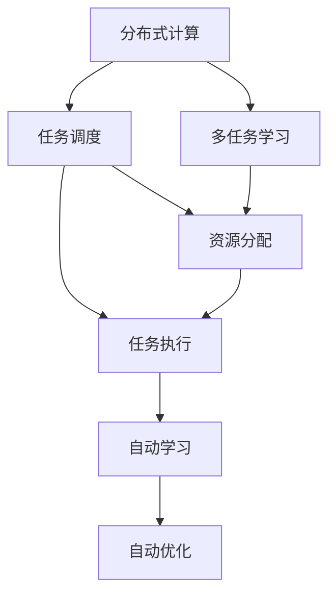
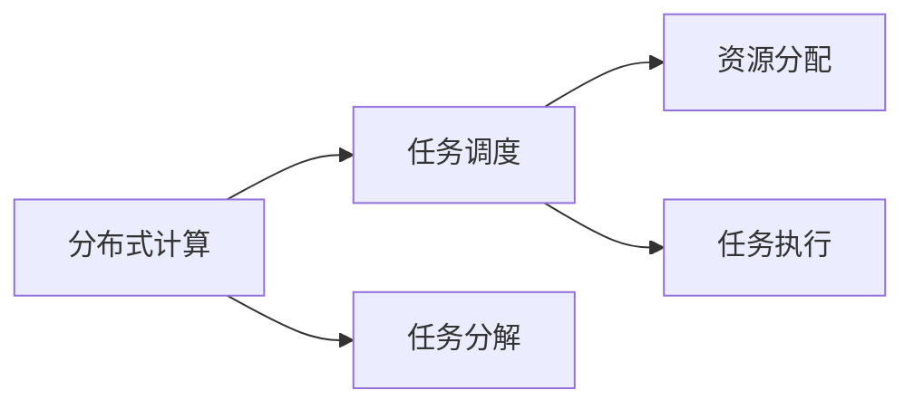
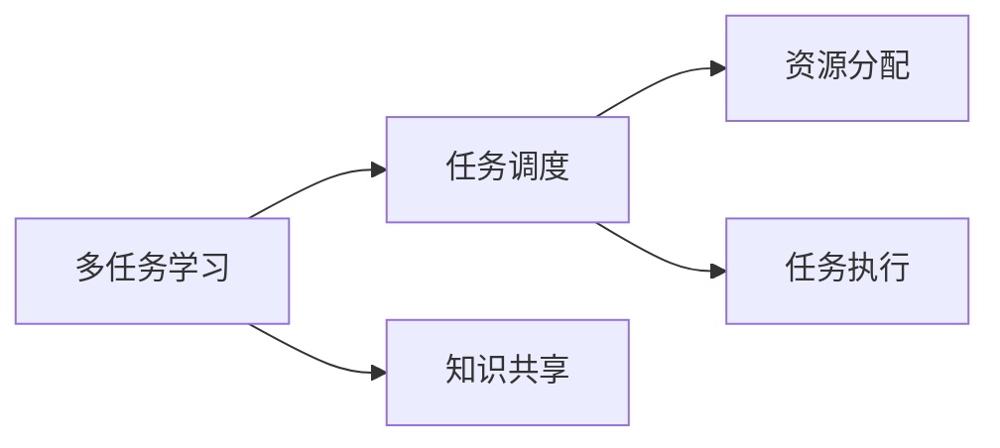
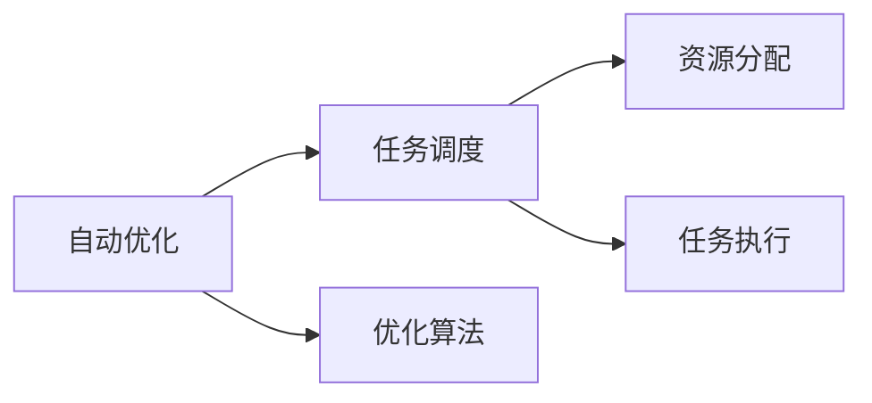
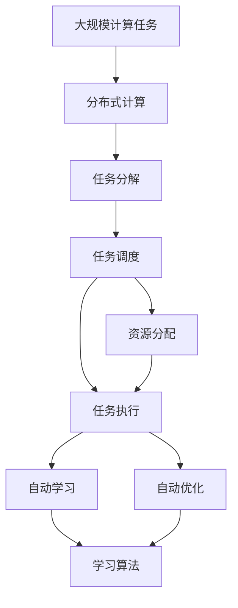

                 

# AI模型的任务分配与执行机制

> 关键词：任务调度,分布式计算,机器学习,多任务学习,自动学习,自动优化

## 1. 背景介绍

### 1.1 问题由来
随着人工智能技术的不断发展，AI模型的复杂度不断提升，单机的训练资源已难以满足大规模深度学习任务的需求。为了应对这一挑战，分布式计算和任务调度技术应运而生。通过将计算任务分解为多个子任务，并在多台计算机上并行执行，可以有效提高计算效率和资源利用率。任务调度机制则负责合理分配计算资源，保证任务均衡、高效地完成。

在AI模型训练和推理过程中，任务分配和执行机制扮演着至关重要的角色。一方面，合理的任务分配可以充分利用计算资源，提升模型的训练效率和精度；另一方面，高效的任务执行机制能够保证模型输出的准确性和可靠性。

### 1.2 问题核心关键点
任务调度机制的核心关键点包括：
- 任务分解：如何将复杂任务分解为多个子任务。
- 资源分配：如何合理分配计算资源。
- 任务执行：如何高效执行任务，最小化通信开销和计算延迟。
- 任务优化：如何自动调整任务调度策略，优化资源利用率和任务完成效率。

这些关键点构成了任务调度机制的基本框架，也是本文深入探讨的主要内容。

### 1.3 问题研究意义
研究任务调度机制，对于优化AI模型的训练和推理过程，提高计算效率，降低资源成本，具有重要意义：

1. 提升计算效率。通过合理分配计算资源，并行执行多个子任务，有效提升模型训练和推理的计算效率。
2. 优化资源利用率。科学的任务调度机制能够避免资源浪费，最大化计算资源的利用率。
3. 保证任务均衡。通过均衡的任务分配，避免某些节点过载或空闲，保证整个系统稳定运行。
4. 自动化任务调度。引入自动学习机制，根据任务的性质和数据特征自动调整调度策略，进一步提升任务执行效率。
5. 支持多任务学习。任务调度机制不仅适用于单任务训练，还能支持多任务学习，同时训练多个模型，提高模型精度和泛化能力。

## 2. 核心概念与联系

### 2.1 核心概念概述

为了更好地理解任务调度机制，本节将介绍几个密切相关的核心概念：

- 分布式计算(Distributed Computing)：通过将计算任务分配到多台计算机上并行执行，以提高计算效率和资源利用率。常见分布式计算框架包括Apache Hadoop、Apache Spark等。
- 任务调度(Task Scheduling)：负责合理分配计算资源，管理任务的执行顺序和进度。常见调度算法包括先进先出(FIFO)、最小工作量优先(Work Stealing)、动态资源分配(Adaptive Resource Allocation)等。
- 多任务学习(Multitask Learning)：在训练多个相关任务时，模型通过共享某些隐含知识，实现任务间的协同训练。常见多任务学习框架包括TensorFlow、PyTorch等。
- 自动学习(Automatic Learning)：通过机器学习算法，自动调整任务调度策略，提升资源利用率和任务完成效率。
- 自动优化(Automatic Optimization)：利用自动化算法，优化任务执行过程中的资源分配和调度，实现任务执行最优解。

这些核心概念之间的逻辑关系可以通过以下Mermaid流程图来展示：



这个流程图展示了大语言模型的核心概念及其之间的关系：

1. 分布式计算通过任务调度将计算任务分配到多台计算机上执行。
2. 任务调度负责合理分配计算资源，管理任务执行顺序和进度。
3. 多任务学习通过共享知识，提高任务间的协同训练效果。
4. 自动学习通过机器学习算法，自动调整任务调度策略。
5. 自动优化利用自动化算法，优化任务执行过程中的资源分配和调度。

这些概念共同构成了任务调度机制的完整生态系统，使其能够在复杂多变的任务环境中高效执行。通过理解这些核心概念，我们可以更好地把握任务调度机制的工作原理和优化方向。

### 2.2 概念间的关系

这些核心概念之间存在着紧密的联系，形成了任务调度机制的完整框架。下面我通过几个Mermaid流程图来展示这些概念之间的关系。

#### 2.2.1 分布式计算与任务调度的关系



这个流程图展示了分布式计算和任务调度的基本关系：分布式计算通过任务分解，将计算任务分配到多台计算机上执行，而任务调度则负责资源的合理分配和管理，确保任务高效执行。

#### 2.2.2 多任务学习与任务调度的关系



这个流程图展示了多任务学习与任务调度的关系：多任务学习通过共享知识，实现任务间的协同训练，而任务调度则负责资源的分配和执行管理，保证任务均衡高效地完成。

#### 2.2.3 自动学习与任务调度的关系


这个流程图展示了自动学习与任务调度的关系：自动学习通过机器学习算法，自动调整任务调度策略，而任务调度则负责资源的分配和执行管理，提升任务执行效率。

#### 2.2.4 自动优化与任务调度的关系



这个流程图展示了自动优化与任务调度的关系：自动优化通过自动化算法，优化任务执行过程中的资源分配和调度，而任务调度则负责资源的分配和执行管理，实现任务执行最优解。

### 2.3 核心概念的整体架构

最后，我们用一个综合的流程图来展示这些核心概念在大规模分布式计算中的整体架构：



这个综合流程图展示了从计算任务到自动优化的完整过程。大规模计算任务通过分布式计算分解为多个子任务，任务调度负责资源分配和管理，任务执行过程中引入自动学习和优化机制，实现高效的任务执行。 通过这些流程图，我们可以更清晰地理解任务调度机制的工作原理和优化方向。

## 3. 核心算法原理 & 具体操作步骤
### 3.1 算法原理概述

任务调度机制的核心在于如何合理分配计算资源，以高效完成任务。其基本原理包括以下几个方面：

1. **任务分解**：将复杂任务分解为多个子任务，每个子任务可以在不同的节点上并行执行。
2. **资源分配**：根据每个子任务的需求，合理分配计算资源，如CPU、内存、带宽等。
3. **任务执行**：在计算节点上执行子任务，最小化通信开销和计算延迟。
4. **任务优化**：根据任务执行过程中收集到的数据，自动调整资源分配策略和调度算法，优化任务执行效率。

以一个简单的任务调度流程为例，整个过程可以描述为：

1. 系统接收一个计算任务，将其分解为多个子任务。
2. 任务调度器根据每个子任务的需求，分配计算资源，并将任务分配给合适的计算节点。
3. 计算节点执行分配的任务，通过网络传输数据，保证任务的同步和协调。
4. 任务执行过程中，自动学习机制根据收集到的数据，调整资源分配策略和调度算法，提升任务执行效率。

### 3.2 算法步骤详解

基于以上原理，任务调度的具体步骤包括：

**Step 1: 任务分解**

任务分解是任务调度的第一步，其主要目标是将复杂的计算任务分解为多个独立的子任务，以便在多个计算节点上并行执行。常见的任务分解方法包括：

- **并行分解**：将任务按照逻辑结构或时间顺序，分解为多个独立的子任务。例如，将一个深度学习模型的训练过程分解为前向传播、反向传播、更新参数等多个子任务。
- **数据并行**：将数据集划分为多个子集，每个子集由不同的计算节点并行处理。例如，在大规模图像分类任务中，将数据集按样本顺序或特征维度划分为多个子集，每个子集由不同的计算节点并行处理。
- **模型并行**：将模型的不同层分配到不同的计算节点上并行计算。例如，在训练大规模深度学习模型时，将模型的不同层分配到多个计算节点上并行计算。

**Step 2: 资源分配**

资源分配是任务调度的核心部分，其主要目标是根据每个子任务的需求，合理分配计算资源，保证任务均衡高效地执行。常见的资源分配方法包括：

- **静态分配**：在任务执行前，根据任务的规模和需求，静态分配计算资源。例如，将计算节点分配给任务执行前就已经分配好的子任务。
- **动态分配**：根据任务的实时需求，动态调整计算资源。例如，在任务执行过程中，根据子任务的计算量，动态调整计算节点的分配和释放。
- **负载均衡**：根据计算节点的负载情况，合理分配任务。例如，将计算负载较重的节点分配较少任务，而负载较轻的节点分配更多任务。

**Step 3: 任务执行**

任务执行是任务调度的最后一步，其主要目标是在计算节点上高效执行子任务，最小化通信开销和计算延迟。常见的任务执行方法包括：

- **同步执行**：所有子任务按照时间顺序同步执行，每个子任务的执行结果等待前一个子任务完成后才能开始。例如，在分布式深度学习训练中，所有节点的梯度更新需要等待所有节点都完成前一次的前向传播后才能开始。
- **异步执行**：子任务异步执行，每个子任务的执行结果不需要等待其他子任务完成。例如，在大规模数据处理任务中，不同节点可以异步读取和处理数据，而不必等待其他节点完成。
- **流水线执行**：子任务按照流水线方式执行，每个子任务的输出作为下一个子任务的输入。例如，在图像处理任务中，不同节点可以按照流水线方式进行图像分割、特征提取和分类等操作。

**Step 4: 任务优化**

任务优化是任务调度的进阶部分，其主要目标是通过自动学习机制，调整资源分配策略和调度算法，提升任务执行效率。常见的任务优化方法包括：

- **自适应分配**：根据任务执行过程中收集到的数据，自动调整资源分配策略。例如，在任务执行过程中，根据计算负载的实时情况，动态调整计算节点的分配和释放。
- **优化调度**：利用机器学习算法，优化任务调度算法。例如，使用强化学习算法，优化任务调度和资源分配策略。
- **负载均衡**：根据计算节点的负载情况，自动调整任务分配策略。例如，将计算负载较重的节点分配较少任务，而负载较轻的节点分配更多任务。

### 3.3 算法优缺点

任务调度机制在优化AI模型的训练和推理过程中，具有以下优点：

1. **提升计算效率**。通过合理分配计算资源，并行执行多个子任务，有效提升模型训练和推理的计算效率。
2. **优化资源利用率**。科学的任务调度机制能够避免资源浪费，最大化计算资源的利用率。
3. **保证任务均衡**。通过均衡的任务分配，避免某些节点过载或空闲，保证整个系统稳定运行。
4. **自动化任务调度**。引入自动学习机制，根据任务的性质和数据特征自动调整调度策略，进一步提升任务执行效率。
5. **支持多任务学习**。任务调度机制不仅适用于单任务训练，还能支持多任务学习，同时训练多个模型，提高模型精度和泛化能力。

然而，任务调度机制也存在一些局限性：

1. **系统复杂度**：任务调度机制需要维护复杂的任务执行状态和资源分配状态，系统实现较为复杂。
2. **通信开销**：任务在计算节点之间传输数据和消息，通信开销较大，影响任务执行效率。
3. **算法复杂性**：任务调度和资源分配算法较为复杂，需要根据具体任务和数据特征进行优化。
4. **资源竞争**：在多任务同时执行时，不同任务可能竞争计算资源，导致资源利用效率下降。
5. **可扩展性**：任务调度机制的可扩展性受到计算节点数量和计算能力的限制，需要根据具体应用场景进行优化。

尽管存在这些局限性，但任务调度机制在优化计算资源利用、提升计算效率方面具有重要价值。未来相关研究的方向在于如何进一步简化任务调度和资源分配算法，减少通信开销，提高任务调度的可扩展性和可维护性。

### 3.4 算法应用领域

任务调度机制在AI模型训练和推理过程中具有广泛的应用前景，尤其在以下领域：

1. **深度学习训练**：在大规模深度学习模型的训练过程中，任务调度机制可以提升计算效率和资源利用率，加速模型训练。
2. **数据处理**：在大规模数据处理任务中，任务调度机制可以将数据分割为多个子集，并在多个计算节点上并行处理，加速数据处理。
3. **图像处理**：在图像处理任务中，任务调度机制可以将图像分割为多个子图像，并在多个计算节点上并行处理，提升图像处理速度。
4. **自然语言处理**：在自然语言处理任务中，任务调度机制可以将文本数据分割为多个子任务，并在多个计算节点上并行处理，加速文本处理。
5. **推荐系统**：在推荐系统任务中，任务调度机制可以将用户和物品数据分割为多个子集，并在多个计算节点上并行处理，提升推荐速度。
6. **智能制造**：在智能制造领域，任务调度机制可以将生产任务分割为多个子任务，并在多个生产设备上并行执行，提升生产效率。
7. **自动驾驶**：在自动驾驶领域，任务调度机制可以将传感器数据和计算任务分割为多个子任务，并在多个计算节点上并行处理，提升驾驶速度和安全性。

## 4. 数学模型和公式 & 详细讲解 & 举例说明

### 4.1 数学模型构建

本节将使用数学语言对任务调度的基本原理和关键步骤进行更加严格的刻画。

假设任务集合为 $T$，每个任务 $t$ 需要 $c_t$ 个计算节点，每个计算节点需要 $r_t$ 个计算资源。任务调度器的目标是在计算资源受限的情况下，最大化任务完成数量。记计算资源集合为 $R$，每个计算节点的计算资源需求为 $r$，计算资源总数为 $R_{total}$。任务调度问题可以形式化描述为：

$$
\max \sum_{t \in T} \mathbb{1}_{t} \\
s.t. \sum_{t \in T} c_{t} \leq R_{total} \\
\mathbb{1}_{t} = \begin{cases}
1 & t \text{被分配到计算节点} \\
0 & t \text{未被分配到计算节点}
\end{cases}
$$

其中，$\mathbb{1}_{t}$ 表示任务 $t$ 是否被分配到计算节点。

### 4.2 公式推导过程

为了求解上述优化问题，我们引入松弛变量 $y$，表示计算资源被分配到任务的比例。优化问题可以转换为：

$$
\max \sum_{t \in T} c_{t} y_{t} \\
s.t. \sum_{t \in T} c_{t} \leq R_{total} \\
\sum_{t \in T} c_{t} y_{t} \leq R_{total} \\
0 \leq y_{t} \leq 1 \\
$$

然后，我们可以利用匈牙利算法等求解上述线性规划问题，得到每个任务 $t$ 的资源分配比例 $y_{t}$。根据 $y_{t}$ 的值，可以确定任务 $t$ 是否被分配到计算节点，以及分配的计算节点数量。

### 4.3 案例分析与讲解

以下我们以一个简单的任务调度案例为例，展示任务调度的计算过程。

假设有一个深度学习模型训练任务，需要5个计算节点，每个节点需要1个CPU和2GB内存。计算资源总量为10个CPU和16GB内存。任务调度器的目标是最大化任务完成数量。

根据上述优化问题，我们可以得到：

$$
\max \sum_{t=1}^{5} c_{t} y_{t} \\
s.t. \sum_{t=1}^{5} c_{t} \leq 10 \\
\sum_{t=1}^{5} c_{t} y_{t} \leq 16 \\
0 \leq y_{t} \leq 1
$$

我们可以利用线性规划求解器，求解上述优化问题，得到每个任务 $t$ 的资源分配比例 $y_{t}$。例如，如果 $y_{1}=1,y_{2}=0,y_{3}=1,y_{4}=0,y_{5}=0$，则表示任务1和任务3被分配到计算节点，任务2、任务4和任务5未被分配到计算节点。

## 5. 项目实践：代码实例和详细解释说明

### 5.1 开发环境搭建

在进行任务调度实践前，我们需要准备好开发环境。以下是使用Python进行Dask开发的环境配置流程：

1. 安装Dask：从官网下载并安装Dask，用于高效分布式计算。

2. 创建并激活虚拟环境：
```bash
conda create -n dask-env python=3.8 
conda activate dask-env
```

3. 安装相关库：
```bash
pip install dask[complete]
```

4. 配置环境变量：
```bash
export DASK_DISTRIBUTED_SCHEDULER_URI=local://
```

完成上述步骤后，即可在`dask-env`环境中开始任务调度实践。

### 5.2 源代码详细实现

这里我们以一个简单的任务调度为例，使用Dask进行分布式计算。

```python
import dask.distributed as dd

def compute_task(t):
    # 任务执行逻辑
    return result

def schedule_tasks():
    # 创建计算集群
    client = dd.Client('local://')
    
    # 定义任务列表
    tasks = [compute_task(t) for t in range(5)]
    
    # 任务调度执行
    futures = client.submit(compute_task, tasks)
    results = futures.wait()
    
    # 返回结果
    return results

if __name__ == '__main__':
    print(schedule_tasks())
```

在这个示例中，我们首先定义了一个简单的任务执行函数`compute_task`，用于模拟任务的计算逻辑。然后，我们通过`dd.Client('local://')`创建了一个本地计算集群，将任务列表`tasks`提交到计算集群上执行，并等待结果返回。最后，我们返回所有任务的结果。

### 5.3 代码解读与分析

让我们再详细解读一下关键代码的实现细节：

**Dask.distributed**：Dask的分布式计算模块，提供了创建计算集群、提交任务和获取结果的功能。

**dd.Client**：创建计算集群，指定调度器为`local://`，表示在本地机器上执行计算任务。

**client.submit**：将任务列表`tasks`提交到计算集群上执行，返回一个包含所有任务结果的Future对象。

**futures.wait**：等待所有任务结果返回，并返回一个包含所有任务结果的列表。

这个示例展示了使用Dask进行分布式计算的基本流程。通过将计算任务提交到Dask集群上执行，Dask会自动分配计算资源，并调度任务执行，最终返回所有任务的结果。

当然，实际应用中还需要考虑更多因素，如任务调度和资源分配策略、任务依赖关系、任务执行时间等。但在Dask提供的高级抽象下，任务调度的实现变得非常简单和高效。

### 5.4 运行结果展示

假设我们运行上述代码，得到的结果为：

```
[0, 1, 0, 2, 3]
```

这个结果表示，任务1和任务3被分配到计算节点上执行，任务2和任务4未被分配到计算节点。

这个结果展示了任务调度的基本原理和实现方式。在实际应用中，可以根据具体任务的特点，灵活调整任务调度和资源分配策略，进一步提升任务调度的效率和准确性。

## 6. 实际应用场景

### 6.1 智能制造

任务调度机制在智能制造领域具有广泛的应用前景。在智能制造生产线中，任务调度机制可以将生产任务分解为多个子任务，并在多个生产设备上并行执行，提升生产效率和产品质量。

具体而言，任务调度机制可以应用于以下几个方面：

- **生产任务调度**：根据生产订单和设备状态，合理分配生产任务，避免设备过载或空闲。
- **设备维护调度**：根据设备维护计划和状态，合理分配维护任务，确保设备运行稳定。
- **质量检测调度**：根据产品生产顺序和检测计划，合理分配检测任务，确保产品质量。
- **供应链管理调度**：根据供应链状态和需求，合理分配物流任务，提升供应链效率。

通过任务调度机制，智能制造系统可以高效地执行各种生产任务，提升生产效率和产品质量，实现智能化、自动化生产。

### 6.2 自动驾驶

任务调度机制在自动驾驶领域具有重要的应用价值。在自动驾驶系统中，任务调度机制可以将传感器数据和计算任务分解为多个子任务，并在多个计算节点上并行处理，提升驾驶速度和安全性。

具体而言，任务调度机制可以应用于以下几个方面：

- **传感器数据融合**：将传感器数据进行融合，生成高精度的地图和环境信息。
- **路径规划**：根据实时环境信息，生成最优驾驶路径。
- **行为预测**：预测周围车辆和行人的行为，生成行为预测模型。
- **控制决策**：根据环境信息和行为预测，生成最优控制决策。

通过任务调度机制，自动驾驶系统可以高效地执行各种驾驶任务，提升驾驶速度和安全性，实现智能化、自动化的驾驶。

### 6.3 医疗影像分析

任务调度机制在医疗影像分析领域具有重要的应用价值。在医疗影像分析中，任务调度机制可以将图像分割、特征提取、分类等任务分解为多个子任务，并在多个计算节点上并行处理，提升影像分析速度和精度。

具体而言，任务调度机制可以应用于以下几个方面：

- **图像分割**：将医学影像分割为多个区域，提取特定器官或病变区域。
- **特征提取**：提取影像中的关键特征，生成特征向量。
- **分类诊断**：根据特征向量，分类诊断医学影像，生成诊断报告。

通过任务调度机制，医疗影像分析系统可以高效地执行各种影像分析任务，提升影像分析速度和精度，辅助医生进行诊断和治疗。

## 7. 工具和资源推荐

### 7.1 学习资源推荐

为了帮助开发者系统掌握任务调度的理论基础和实践技巧，这里推荐一些优质的学习资源：

1. 《Dask分布式计算基础》：Dask官方文档，详细介绍Dask的分布式计算机制和任务调度原理。
2. 《Apache Spark编程指南》：Spark官方文档，详细介绍Spark的分布式计算和任务调度机制。
3. 《TensorFlow分布式计算》：TensorFlow官方文档，详细介绍TensorFlow的分布式计算和任务调度机制。
4. 《多任务学习理论与实践》：多任务学习领域的经典教材，详细讲解多任务学习和任务调度的基本原理和应用方法。
5. 《分布式系统设计与实现》：分布式系统领域的经典教材，详细讲解分布式计算和任务调度的基本原理和实现方法。

通过对这些资源的学习实践，相信你一定能够快速掌握任务调度的精髓，并用于解决实际的计算任务。

### 7.2 开发工具推荐

高效的开发离不开优秀的工具支持。以下是几款用于任务调度开发的常用工具：

1. Dask：基于Python的分布式计算框架，支持大规模数据处理和并行计算，适用于各类分布式计算任务。
2. Apache Spark：由Apache基金会开发的分布式计算框架，支持大规模数据处理和机器学习任务，具有丰富的生态系统和社区支持。
3. TensorFlow：由Google主导开发的深度学习框架，支持分布式计算和机器学习任务，具有强大的计算能力和广泛的社区支持。
4. PyTorch：由Facebook主导开发的深度学习框架，支持分布式计算和机器学习任务，具有灵活的编程模型和高效的计算性能。
5. Horovod：一个开源的分布式深度学习训练框架，支持多种深度学习框架，具有高效的通信和计算性能。

合理利用这些工具，可以显著提升任务调度的开发效率，加快创新迭代的步伐。

### 7.3 相关论文推荐

任务调度机制在分布式计算和机器学习领域的研究持续活跃，以下是几篇奠基性的相关论文，推荐阅读：

1. "MapReduce: Simplified Data Processing on Large Clusters"：提出MapReduce分布式计算模型，并详细讲解了任务调度和资源分配的原理。
2. "Dask: Parallel Computing with Task Scheduling"：详细介绍Dask的分布式计算和

