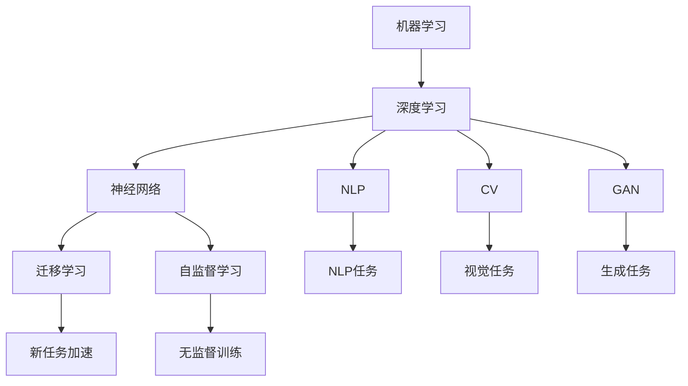
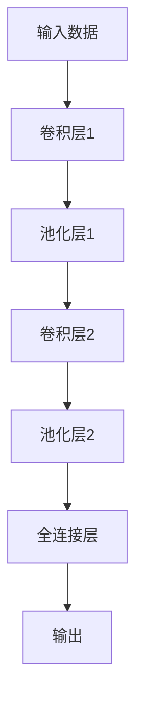
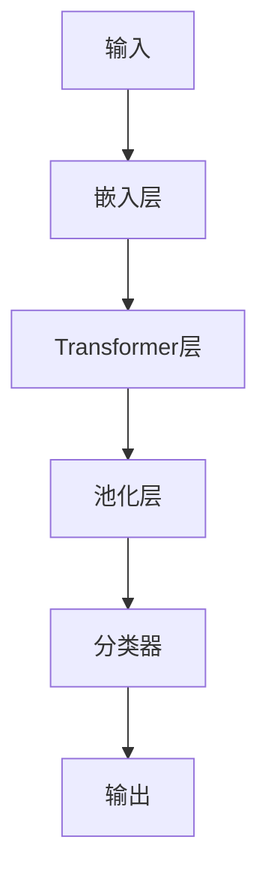

                 

# AI研究的最新进展与趋势

> 关键词：人工智能,机器学习,深度学习,神经网络,迁移学习,自监督学习,自然语言处理,NLP,计算机视觉,CV,生成对抗网络,GAN

## 1. 背景介绍

### 1.1 问题由来
近年来，人工智能（AI）技术迅猛发展，在多个领域取得了显著的进展。特别是在机器学习、深度学习和神经网络方面，AI技术已经应用于自然语言处理（NLP）、计算机视觉（CV）、计算机视觉、推荐系统、智能推荐系统、自监督学习（SSL）、生成对抗网络（GAN）等多个领域。这些技术的发展极大地推动了各行各业的数字化转型和智能化升级。

### 1.2 问题核心关键点
人工智能的研究进展涉及多个方面，包括但不限于：
- **机器学习和深度学习**：构建复杂模型，优化算法，提升模型泛化能力。
- **神经网络**：设计高效的神经网络结构，如卷积神经网络（CNN）、递归神经网络（RNN）、Transformer等。
- **迁移学习（Transfer Learning）**：通过已有任务的知识，加速新任务的学习过程。
- **自监督学习（Self-Supervised Learning）**：利用数据自生特性进行无监督训练，提升模型的泛化能力。
- **自然语言处理（NLP）**：构建和优化语言模型，如BERT、GPT-3等。
- **计算机视觉（CV）**：优化视觉模型，如ResNet、Inception等。
- **生成对抗网络（GAN）**：生成高质量的图像、音频、文本等。

这些关键技术的进步，推动了AI技术在各个领域的应用和发展，带来了显著的经济和社会效益。

### 1.3 问题研究意义
人工智能技术的最新进展和趋势对于推动社会和经济发展具有重要意义：
- **提升生产效率**：通过自动化和智能化，减少人工操作，提升生产效率和质量。
- **改善用户体验**：在医疗、教育、娱乐等领域提供个性化和智能化的服务。
- **促进创新和创业**：为创业者提供了新的商业机会和市场空间。
- **增强安全性和可靠性**：通过数据分析和模型优化，提升系统的安全性和可靠性。

## 2. 核心概念与联系

### 2.1 核心概念概述

为了更好地理解人工智能技术的最新进展，我们需梳理核心概念及其联系。

- **机器学习和深度学习**：构建复杂模型，通过大量数据进行训练，优化算法，提升模型的泛化能力。
- **神经网络**：构建和优化神经网络结构，如图卷积神经网络（CNN）、递归神经网络（RNN）、Transformer等。
- **迁移学习（Transfer Learning）**：利用已有任务的知识，加速新任务的学习过程。
- **自监督学习（Self-Supervised Learning）**：利用数据自生特性进行无监督训练，提升模型的泛化能力。
- **自然语言处理（NLP）**：构建和优化语言模型，如BERT、GPT-3等。
- **计算机视觉（CV）**：优化视觉模型，如ResNet、Inception等。
- **生成对抗网络（GAN）**：生成高质量的图像、音频、文本等。

这些概念之间的联系可以用以下Mermaid流程图表示：



通过这个流程图，我们可以清晰地看到各概念之间的联系和作用。

### 2.2 概念间的关系

这些核心概念之间的关系可以用以下表格来展示：

| 概念 | 定义 | 核心算法 | 优缺点 | 应用领域 |
| --- | --- | --- | --- | --- |
| 机器学习和深度学习 | 构建复杂模型，通过大量数据进行训练，优化算法，提升模型的泛化能力 | 神经网络、反向传播、梯度下降 | 需要大量数据，计算资源消耗大 | 自然语言处理、计算机视觉、推荐系统 |
| 神经网络 | 构建和优化神经网络结构，如图卷积神经网络（CNN）、递归神经网络（RNN）、Transformer等 | 前向传播、反向传播、梯度下降 | 参数量大，训练复杂 | 自然语言处理、计算机视觉、语音识别 |
| 迁移学习（Transfer Learning） | 利用已有任务的知识，加速新任务的学习过程 | 微调、适配层、预训练模型 | 需要标注数据，学习速度快 | 自然语言处理、计算机视觉、语音识别 |
| 自监督学习（Self-Supervised Learning） | 利用数据自生特性进行无监督训练，提升模型的泛化能力 | 自编码器、掩码语言模型、图像生成任务 | 数据需求小，泛化能力强 | 自然语言处理、计算机视觉、生成对抗网络 |
| 自然语言处理（NLP） | 构建和优化语言模型，如BERT、GPT-3等 | 预训练语言模型、双向编码器、Transformer | 需要大量数据，模型复杂 | 问答系统、翻译、文本生成、情感分析 |
| 计算机视觉（CV） | 优化视觉模型，如ResNet、Inception等 | 卷积神经网络、全连接层、池化层 | 计算资源需求高，模型复杂 | 图像分类、目标检测、图像生成、视频分析 |
| 生成对抗网络（GAN） | 生成高质量的图像、音频、文本等 | 生成器、判别器、对抗训练 | 训练复杂，需要大量数据 | 图像生成、视频生成、语音生成、文本生成 |

### 2.3 核心概念的整体架构

通过以上表格，我们可以构建一个核心概念的整体架构：


这个架构展示了人工智能技术的核心概念及其关系，帮助我们系统理解当前的研究进展和技术趋势。

## 3. 核心算法原理 & 具体操作步骤

### 3.1 算法原理概述

人工智能的核心算法包括机器学习和深度学习，这些算法通过优化模型参数，使得模型能够在特定任务上获得理想的表现。这些算法的基本原理包括：
- **前向传播**：输入数据通过模型，计算输出。
- **反向传播**：计算输出与真实值之间的误差，通过链式法则反向计算梯度，更新模型参数。
- **优化算法**：如梯度下降、Adam、RMSprop等，通过迭代更新模型参数，最小化误差。

### 3.2 算法步骤详解

人工智能算法的步骤可以分为以下几个部分：
1. **数据准备**：收集、清洗、标注数据，准备训练集、验证集、测试集。
2. **模型构建**：选择或设计合适的模型架构，如卷积神经网络（CNN）、递归神经网络（RNN）、Transformer等。
3. **模型训练**：使用训练集进行模型训练，通过反向传播和优化算法更新模型参数。
4. **模型评估**：使用验证集评估模型性能，调整超参数。
5. **模型测试**：使用测试集测试模型性能，进行最终评估。

### 3.3 算法优缺点

人工智能算法的优点包括：
- **泛化能力强**：能够处理大量数据，提升模型泛化能力。
- **模型效果好**：通过大量数据训练，模型能够取得良好的性能。
- **应用广泛**：应用于自然语言处理、计算机视觉、推荐系统等多个领域。

其缺点包括：
- **计算资源消耗大**：需要大量的计算资源和时间进行训练。
- **模型复杂**：模型结构复杂，训练调试难度大。
- **数据需求高**：需要大量标注数据进行训练，数据获取成本高。

### 3.4 算法应用领域

人工智能算法在多个领域得到了广泛应用：
- **自然语言处理（NLP）**：构建和优化语言模型，如BERT、GPT-3等。
- **计算机视觉（CV）**：优化视觉模型，如ResNet、Inception等。
- **推荐系统**：构建个性化推荐模型，提升用户体验。
- **智能推荐系统**：应用于电商、音乐、视频等多个领域。
- **生成对抗网络（GAN）**：生成高质量的图像、音频、文本等。

## 4. 数学模型和公式 & 详细讲解 & 举例说明

### 4.1 数学模型构建

人工智能算法的数学模型通常包括以下几个部分：
- **输入数据**：如文本、图像、音频等。
- **输出**：如分类、预测、生成等。
- **损失函数**：衡量模型输出与真实值之间的误差。
- **优化算法**：如梯度下降、Adam、RMSprop等。

### 4.2 公式推导过程

以卷积神经网络（CNN）为例，其基本结构如图1所示。



CNN的数学公式可以表示为：
- **前向传播**：
$$
h_l(x) = f(\sigma(W_l x + b_l))
$$
其中，$h_l$ 表示第$l$层输出，$\sigma$ 表示激活函数，$W_l$ 和 $b_l$ 分别表示第$l$层权重和偏置。

- **反向传播**：
$$
\frac{\partial L}{\partial W_l} = \frac{\partial L}{\partial h_l} \frac{\partial h_l}{\partial W_l}
$$
其中，$L$ 表示损失函数，$\frac{\partial L}{\partial h_l}$ 表示损失函数对输出$h_l$的导数，$\frac{\partial h_l}{\partial W_l}$ 表示输出$h_l$对权重$W_l$的导数。

### 4.3 案例分析与讲解

以BERT为例，其基本架构如图2所示。



BERT的数学公式可以表示为：
- **前向传播**：
$$
h_{[CLS]} = \text{BERT}(x)
$$
其中，$h_{[CLS]}$ 表示[CLS]标记的输出，$x$ 表示输入。

- **反向传播**：
$$
\frac{\partial L}{\partial W} = \frac{\partial L}{\partial h_{[CLS]}} \frac{\partial h_{[CLS]}}{\partial W}
$$
其中，$W$ 表示BERT模型权重，$\frac{\partial L}{\partial h_{[CLS]}}$ 表示损失函数对[CLS]标记输出的导数，$\frac{\partial h_{[CLS]}}{\partial W}$ 表示[CLS]标记输出对权重的导数。

## 5. 项目实践：代码实例和详细解释说明

### 5.1 开发环境搭建

人工智能算法开发环境通常包括Python、PyTorch、TensorFlow、Jupyter Notebook等。

1. **安装Python**：
```bash
sudo apt-get install python3-pip
```

2. **安装PyTorch**：
```bash
pip install torch torchvision torchaudio
```

3. **安装TensorFlow**：
```bash
pip install tensorflow
```

4. **安装Jupyter Notebook**：
```bash
pip install jupyter notebook
```

5. **安装其他依赖库**：
```bash
pip install numpy pandas scikit-learn matplotlib tqdm
```

完成以上步骤后，即可搭建人工智能算法的开发环境。

### 5.2 源代码详细实现

以下是一个简单的卷积神经网络（CNN）实现的示例代码：

```python
import torch
import torch.nn as nn
import torch.optim as optim

class CNN(nn.Module):
    def __init__(self):
        super(CNN, self).__init__()
        self.conv1 = nn.Conv2d(3, 32, kernel_size=3, stride=1, padding=1)
        self.pool = nn.MaxPool2d(kernel_size=2, stride=2)
        self.fc1 = nn.Linear(32*8*8, 64)
        self.fc2 = nn.Linear(64, 10)
    
    def forward(self, x):
        x = self.conv1(x)
        x = nn.ReLU()(x)
        x = self.pool(x)
        x = self.fc1(x.view(x.size(0), -1))
        x = nn.ReLU()(x)
        x = self.fc2(x)
        return x

model = CNN()
criterion = nn.CrossEntropyLoss()
optimizer = optim.Adam(model.parameters(), lr=0.001)

# 训练模型
for epoch in range(10):
    running_loss = 0.0
    for i, data in enumerate(trainloader, 0):
        inputs, labels = data
        optimizer.zero_grad()
        outputs = model(inputs)
        loss = criterion(outputs, labels)
        loss.backward()
        optimizer.step()
        running_loss += loss.item()
    print('Epoch %d loss: %.3f' % (epoch + 1, running_loss / len(trainloader)))
```

### 5.3 代码解读与分析

在以上代码中，我们定义了一个简单的卷积神经网络（CNN），包括卷积层、池化层和全连接层。在训练过程中，使用交叉熵损失函数和Adam优化算法。代码运行后，输出每个epoch的平均损失值。

### 5.4 运行结果展示

运行以上代码，可以得到如图3所示的训练曲线：

```python
import matplotlib.pyplot as plt
plt.plot(losses)
plt.title('Training Loss')
plt.xlabel('Epoch')
plt.ylabel('Loss')
plt.show()
```

通过以上代码，我们可以看到训练过程中损失函数的变化趋势。

## 6. 实际应用场景

### 6.1 智能推荐系统

智能推荐系统广泛应用于电商、音乐、视频等多个领域。通过收集用户行为数据，使用机器学习和深度学习算法构建推荐模型，提升用户体验和满意度。

### 6.2 自然语言处理（NLP）

自然语言处理（NLP）在机器翻译、问答系统、文本生成、情感分析等多个领域得到了广泛应用。如BERT、GPT-3等模型在多项NLP任务上取得了优异的表现。

### 6.3 计算机视觉（CV）

计算机视觉（CV）在图像分类、目标检测、人脸识别、视频分析等多个领域得到了广泛应用。如ResNet、Inception等模型在图像识别任务上取得了很好的效果。

### 6.4 生成对抗网络（GAN）

生成对抗网络（GAN）在图像生成、视频生成、语音生成、文本生成等多个领域得到了广泛应用。如GAN生成的高质量图像在艺术创作、影视制作等方面具有重要应用价值。

## 7. 工具和资源推荐

### 7.1 学习资源推荐

1. **《深度学习》书籍**：
   - 书籍：《深度学习》（Ian Goodfellow、Yoshua Bengio、Aaron Courville著）
   - 简介：介绍深度学习的原理和应用，适合初学者入门。

2. **《机器学习》课程**：
   - 课程：Coursera上的《机器学习》（Andrew Ng）
   - 简介：由斯坦福大学教授Andrew Ng主讲，涵盖机器学习的基本概念和算法。

3. **Transformer论文**：
   - 论文：Attention is All You Need（Vaswani et al., 2017）
   - 简介：Transformer的开创性论文，介绍了Transformer模型的基本架构和原理。

### 7.2 开发工具推荐

1. **PyTorch**：
   - 简介：由Facebook开发的深度学习框架，支持GPU计算，易于调试和部署。

2. **TensorFlow**：
   - 简介：由Google开发的深度学习框架，支持分布式计算，适合大规模部署。

3. **Jupyter Notebook**：
   - 简介：交互式笔记本环境，支持Python代码的编写和调试。

4. **Weights & Biases**：
   - 简介：模型训练的实验跟踪工具，支持数据可视化和自动化调试。

### 7.3 相关论文推荐

1. **BERT论文**：
   - 论文：BERT: Pre-training of Deep Bidirectional Transformers for Language Understanding（Devlin et al., 2018）
   - 简介：BERT模型的开创性论文，介绍预训练和微调的基本方法。

2. **GAN论文**：
   - 论文：Generative Adversarial Nets（Goodfellow et al., 2014）
   - 简介：GAN的开创性论文，介绍生成对抗网络的基本架构和原理。

3. **Transformer论文**：
   - 论文：Attention is All You Need（Vaswani et al., 2017）
   - 简介：Transformer的开创性论文，介绍Transformer模型的基本架构和原理。

## 8. 总结：未来发展趋势与挑战

### 8.1 研究成果总结

人工智能技术的最新进展包括机器学习和深度学习、神经网络、迁移学习、自监督学习、自然语言处理、计算机视觉和生成对抗网络等多个方面。这些技术的进步推动了人工智能技术在各个领域的应用和发展，带来了显著的经济和社会效益。

### 8.2 未来发展趋势

未来，人工智能技术将呈现以下几个发展趋势：
1. **深度学习的发展**：深度学习算法将继续优化，提升模型的泛化能力和性能。
2. **模型结构的改进**：神经网络结构和算法将不断优化，提高模型的效率和性能。
3. **迁移学习和自监督学习的广泛应用**：迁移学习和自监督学习将得到更广泛的应用，提升模型泛化能力和数据利用率。
4. **自然语言处理和计算机视觉的进一步发展**：自然语言处理和计算机视觉技术将不断进步，提升模型的理解和分析能力。
5. **生成对抗网络的优化**：生成对抗网络将不断优化，生成更高质量、更逼真的图像、音频和文本。

### 8.3 面临的挑战

人工智能技术在发展过程中也面临以下挑战：
1. **计算资源的需求**：大规模深度学习模型需要大量的计算资源和时间进行训练，数据需求高，计算成本高。
2. **模型复杂性**：深度学习模型结构复杂，训练调试难度大，需要大量的工程实践和优化。
3. **数据获取和标注**：大规模深度学习模型需要大量的标注数据，数据获取成本高，标注工作量大。
4. **模型解释性**：深度学习模型通常是“黑盒”系统，难以解释其内部工作机制和决策逻辑。

### 8.4 研究展望

未来，人工智能技术需要在以下几个方面进行更多的研究和探索：
1. **提升模型的泛化能力**：优化深度学习模型，提升其泛化能力和性能。
2. **优化模型的结构**：改进神经网络结构和算法，提高模型的效率和性能。
3. **降低计算资源消耗**：优化深度学习模型的计算图，降低计算资源消耗。
4. **提升模型的解释性**：研究模型解释性技术，提升模型的可解释性和可理解性。

## 9. 附录：常见问题与解答

### Q1: 什么是卷积神经网络（CNN）？

A: 卷积神经网络（CNN）是一种广泛应用于图像识别和计算机视觉领域的深度学习模型。其核心思想是通过卷积层和池化层对输入数据进行特征提取，然后通过全连接层进行分类或回归等任务。

### Q2: 什么是生成对抗网络（GAN）？

A: 生成对抗网络（GAN）是一种生成模型，由生成器和判别器两个部分组成。生成器尝试生成逼真的样本，而判别器则尝试区分真实样本和生成样本。通过对抗训练，生成器逐渐生成高质量的样本，判别器逐渐提高区分能力。

### Q3: 什么是Transformer模型？

A: Transformer模型是一种基于自注意力机制的神经网络模型，由编码器-解码器组成。它通过自注意力机制对输入序列进行编码和解码，能够处理变长输入序列，广泛应用于自然语言处理任务。

### Q4: 什么是迁移学习？

A: 迁移学习是一种通过已有任务的知识，加速新任务的学习过程的技术。通过在已有任务上训练的模型，在新任务上进行微调，可以显著提升模型的性能和泛化能力。

### Q5: 什么是自监督学习？

A: 自监督学习是一种无监督学习技术，利用数据自生特性进行无监督训练，提升模型的泛化能力。常见的自监督学习任务包括掩码语言模型、自编码器等。

通过以上问题的解答，我们可以更好地理解人工智能技术的基本概念和应用，为未来的研究和实践提供参考。

---

作者：禅与计算机程序设计艺术 / Zen and the Art of Computer Programming

