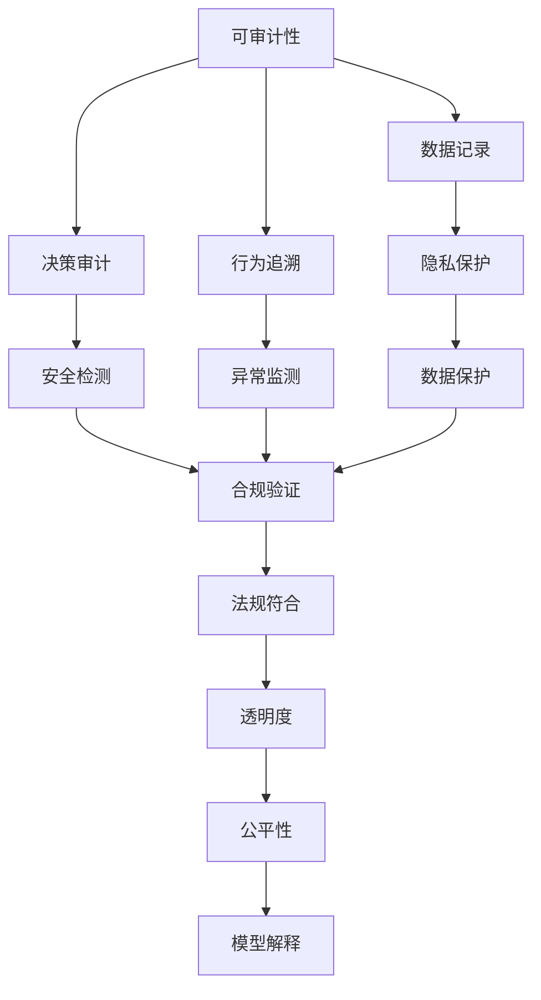

                 

# AI系统的可审计性与合规性设计

在数字化时代，人工智能(AI)技术的应用渗透到了各行各业，从智能客服、医疗诊断、金融风控到自动驾驶、智慧城市等，AI正在以各种形式改变着人们的生活方式。然而，随着AI系统在应用中的重要性日益增强，其带来的风险和挑战也逐渐显现。特别是数据隐私保护、系统透明性、决策可解释性等方面的问题，成为制约AI系统大规模部署的重要瓶颈。本文将从可审计性和合规性的视角，探讨AI系统设计和开发中的关键技术和方法，旨在构建一个更安全、透明、可靠的AI生态系统。

## 1. 背景介绍

### 1.1 问题由来

随着AI技术的迅猛发展，其在医疗、金融、智能制造等领域的广泛应用，带来了一系列显著的社会和经济效益。但与此同时，AI系统的数据隐私、安全性、透明性、可解释性等问题也日益凸显。例如：

- **数据隐私问题**：AI系统往往依赖于大量的个人数据，如何在数据收集和使用过程中保护用户隐私，成为了技术开发的关键。
- **安全性问题**：AI系统可能受到恶意攻击，如模型篡改、数据注入等，导致安全事故。
- **透明性和可解释性问题**：AI系统的决策过程复杂，难以理解其内部工作机制和推理逻辑，用户和监管者对其决策结果缺乏信任。
- **合规性问题**：AI系统在应用过程中可能涉及隐私保护、数据安全、公平性、透明性等法律法规要求，如何符合合规标准，确保系统合法合规运行。

这些问题不仅影响着AI系统的实际应用效果，还可能引发严重的伦理和法律风险，成为制约AI技术发展的瓶颈。因此，如何构建具有可审计性和合规性的AI系统，成为了技术开发和应用中的重要课题。

### 1.2 问题核心关键点

为解决上述问题，本文将重点探讨以下关键点：

- 什么是AI系统的可审计性和合规性？
- 如何进行AI系统的可审计性和合规性设计？
- 常用的AI系统可审计性和合规性技术有哪些？
- 在具体应用场景中，如何实现AI系统的可审计性和合规性？

通过深入解析这些问题，本文旨在为开发者和决策者提供一套系统的解决方案，推动AI技术在合规、透明、安全的框架下，实现更加广泛和深入的应用。

## 2. 核心概念与联系

### 2.1 核心概念概述

为更好地理解AI系统的可审计性和合规性设计，本节将介绍几个密切相关的核心概念：

- **可审计性(Audibility)**：指AI系统在运行过程中的决策过程、输入输出数据以及系统行为等，能够被记录、追溯和审计的特性。通过可审计性，可以验证系统的行为是否符合预期，检测异常行为和漏洞。
- **合规性(Compliance)**：指AI系统在设计和运行过程中，遵守法律法规、行业标准等规范的特性。合规性是确保AI系统安全、透明、可靠运行的重要保障。
- **隐私保护(Privacy Protection)**：指在AI系统设计中，保护用户数据隐私和个人信息安全的特性。隐私保护是AI系统合规性设计的基础。
- **透明度(Transparency)**：指AI系统在决策过程中的信息公开、行为可解释的特性。透明度有助于增强用户信任，便于监管和审计。
- **公平性(Fairness)**：指AI系统在处理不同数据集、不同用户时，能够公平、无偏见地做出决策的特性。公平性是AI系统合规性和可审计性的重要组成部分。

这些核心概念之间存在着紧密的联系，共同构成了AI系统可审计性和合规性的完整框架。通过理解这些概念，我们可以更好地把握AI系统设计和开发的要点。

### 2.2 概念间的关系

这些核心概念之间的逻辑关系可以通过以下Mermaid流程图来展示：



这个流程图展示了大语言模型的核心概念及其之间的关系：

1. 可审计性通过数据记录、决策审计和行为追溯等手段，验证系统的行为是否符合预期，检测异常行为和漏洞。
2. 合规性通过法规符合、隐私保护和安全检测等手段，确保系统合法合规运行。
3. 隐私保护是可审计性和合规性设计的基础，通过数据保护和访问控制等手段，保护用户数据隐私。
4. 透明度通过信息公开和模型解释等手段，增强用户信任，便于监管和审计。
5. 公平性通过无偏见的数据处理和模型解释等手段，确保系统在处理不同数据集、不同用户时，能够公平地做出决策。

这些概念共同构成了AI系统的可审计性和合规性的完整生态系统，为其在实际应用中的高效性和安全性提供了有力保障。

## 3. 核心算法原理 & 具体操作步骤
### 3.1 算法原理概述

AI系统的可审计性和合规性设计，本质上是一个多目标优化问题。其核心思想是：在满足法律法规、行业标准等合规要求的同时，通过可审计性手段，确保系统的决策过程透明、可靠、安全，用户数据隐私得到充分保护。

形式化地，设AI系统的输入数据集为 $D=\{(x_i, y_i)\}_{i=1}^N$，其中 $x_i$ 为输入特征， $y_i$ 为标签。设模型 $M$ 为预训练模型， $L$ 为损失函数， $r$ 为监管约束， $p$ 为隐私保护策略， $t$ 为透明度要求。则AI系统的优化目标可以表示为：

$$
\min_{M, L, r, p, t} \underbrace{(\text{Loss}_{D} + \lambda_{\text{reg}} r + \lambda_{\text{privacy}} p + \lambda_{\text{transparency}} t)}_{\text{Overall Loss}} \quad \text{subject to } \quad (\text{Constraints})
$$

其中，$\lambda_{\text{reg}}$、$\lambda_{\text{privacy}}$、$\lambda_{\text{transparency}}$ 为正则化参数，确保系统在决策过程中同时满足监管要求、隐私保护和透明度要求。

### 3.2 算法步骤详解

AI系统的可审计性和合规性设计，一般包括以下几个关键步骤：

**Step 1: 数据隐私保护**

1. **数据脱敏**：对敏感数据进行匿名化处理，如数据加密、数据模糊化等，确保数据隐私。
2. **访问控制**：建立严格的访问权限管理机制，限制对数据的访问范围和操作权限，防止数据泄露和滥用。
3. **差分隐私**：在数据处理过程中，通过引入随机性扰动，确保数据查询结果的隐私保护。

**Step 2: 合规性设计**

1. **法规遵循**：在系统设计和开发过程中，严格遵守相关法律法规和行业标准，如GDPR、CCPA、ISO 27001等。
2. **安全检测**：引入安全检测机制，实时监测系统的异常行为和潜在威胁，及时发现和应对安全问题。
3. **模型审计**：定期对系统模型进行审计和评估，确保模型的公平性、透明性和合规性。

**Step 3: 可审计性实现**

1. **数据记录**：记录系统运行过程中的输入输出数据和决策过程，建立完整的数据审计链。
2. **行为追溯**：建立行为追溯机制，能够通过日志和记录，回溯和验证系统的行为是否符合预期。
3. **异常监测**：引入异常监测机制，实时检测和报告系统的异常行为，及时采取应对措施。

**Step 4: 透明度提升**

1. **模型解释**：通过可视化、可解释模型等手段，让用户和监管者理解系统的决策过程和推理逻辑。
2. **信息公开**：通过API接口、文档说明等方式，公开系统的输入输出数据、决策依据和模型参数，增强系统的透明度。
3. **用户反馈**：建立用户反馈机制，收集用户对系统行为和决策的意见和建议，持续改进系统性能和透明度。

通过这些步骤，可以构建一个具有可审计性和合规性的AI系统，确保其安全、透明、可靠运行。

### 3.3 算法优缺点

AI系统的可审计性和合规性设计，具有以下优点：

1. **保障用户隐私**：通过数据脱敏、访问控制和差分隐私等技术，确保用户数据隐私安全。
2. **提升系统安全性**：通过法规遵循、安全检测和模型审计等手段，保障系统的安全性和合规性。
3. **增强透明度和信任度**：通过数据记录、行为追溯、模型解释和信息公开等措施，增强系统的透明度和用户信任度。

同时，该方法也存在一些缺点：

1. **技术复杂度高**：需要综合考虑数据隐私、安全性和透明度等多方面的要求，设计复杂的系统架构。
2. **资源消耗大**：隐私保护、安全检测和行为追溯等手段，需要消耗大量的计算和存储资源。
3. **模型可解释性不足**：一些高级AI模型（如深度神经网络），其决策过程复杂，难以解释和解释度较低。

尽管存在这些局限性，但通过合理设计和应用，AI系统的可审计性和合规性设计仍可以显著提升其应用效果和用户信任度，成为推动AI技术在实际场景中广泛应用的重要保障。

### 3.4 算法应用领域

AI系统的可审计性和合规性设计，在多个领域得到了广泛应用，例如：

- **智能客服系统**：通过可审计性手段，记录和分析用户对话记录，提升系统透明度和用户信任度。
- **医疗诊断系统**：通过合规性设计，确保系统在处理患者数据时，符合隐私保护和数据安全的要求。
- **金融风控系统**：通过可审计性和合规性设计，确保系统在处理用户交易数据时，符合法规和合规要求，提升系统安全性和可信度。
- **智能制造系统**：通过透明度和模型解释手段，让用户和监管者理解系统的决策过程，增强系统可信度。

## 4. 数学模型和公式 & 详细讲解 & 举例说明

### 4.1 数学模型构建

本节将使用数学语言对AI系统的可审计性和合规性设计进行更加严格的刻画。

设AI系统的输入数据集为 $D=\{(x_i, y_i)\}_{i=1}^N$，其中 $x_i$ 为输入特征， $y_i$ 为标签。设模型 $M$ 为预训练模型， $L$ 为损失函数， $r$ 为合规性约束， $p$ 为隐私保护策略， $t$ 为透明度要求。则AI系统的优化目标可以表示为：

$$
\min_{M, L, r, p, t} \underbrace{(\text{Loss}_{D} + \lambda_{\text{reg}} r + \lambda_{\text{privacy}} p + \lambda_{\text{transparency}} t)}_{\text{Overall Loss}} \quad \text{subject to } \quad (\text{Constraints})
$$

其中，$\lambda_{\text{reg}}$、$\lambda_{\text{privacy}}$、$\lambda_{\text{transparency}}$ 为正则化参数，确保系统在决策过程中同时满足监管要求、隐私保护和透明度要求。

### 4.2 公式推导过程

以下我们以智能客服系统为例，推导其合规性设计的数学模型。

假设智能客服系统接收来自用户的查询请求，通过自然语言处理技术提取用户意图，调用知识库和规则库进行推理，生成最佳答复。设 $Q$ 为用户查询请求， $I$ 为意图识别模型， $K$ 为知识库， $R$ 为规则库， $A$ 为回复生成模型。系统的运行流程可表示为：

$$
Q \xrightarrow{I} I(Q) \xrightarrow{K \wedge R} A(I(Q), K, R) \xrightarrow{Output}
$$

系统的合规性设计包括数据隐私保护、访问控制、差分隐私和安全检测等方面。设 $D$ 为系统运行的隐私数据集， $A_{\text{priv}}$ 为访问控制策略， $P_{\text{diff}}$ 为差分隐私策略， $S_{\text{sec}}$ 为安全检测策略。系统的优化目标可以表示为：

$$
\min_{I, K, R, A, A_{\text{priv}}, P_{\text{diff}}, S_{\text{sec}}} \underbrace{(\text{Loss}_{D} + \lambda_{\text{reg}} A_{\text{priv}} + \lambda_{\text{privacy}} P_{\text{diff}} + \lambda_{\text{transparency}} t)}_{\text{Overall Loss}} \quad \text{subject to } \quad (\text{Constraints})
$$

其中，$\lambda_{\text{reg}}$、$\lambda_{\text{privacy}}$、$\lambda_{\text{transparency}}$ 为正则化参数，确保系统在决策过程中同时满足监管要求、隐私保护和透明度要求。

### 4.3 案例分析与讲解

假设我们在智能客服系统中，通过差分隐私技术对用户查询请求进行处理。具体而言，系统在每次接收查询请求时，对其添加随机噪声，确保每次查询的隐私数据不泄露。设噪声强度为 $\epsilon$，则隐私保护策略 $P_{\text{diff}}$ 可以表示为：

$$
P_{\text{diff}}(Q_i) = Q_i + \epsilon
$$

其中，$\epsilon$ 为服从高斯分布的随机噪声，$Q_i$ 为第 $i$ 次查询的原始数据。

通过差分隐私技术，系统可以在不泄露用户隐私的前提下，处理和分析用户数据，确保系统的合规性和隐私保护。

## 5. 项目实践：代码实例和详细解释说明

### 5.1 开发环境搭建

在进行可审计性和合规性设计实践前，我们需要准备好开发环境。以下是使用Python进行PyTorch开发的环境配置流程：

1. 安装Anaconda：从官网下载并安装Anaconda，用于创建独立的Python环境。

2. 创建并激活虚拟环境：
```bash
conda create -n pytorch-env python=3.8 
conda activate pytorch-env
```

3. 安装PyTorch：根据CUDA版本，从官网获取对应的安装命令。例如：
```bash
conda install pytorch torchvision torchaudio cudatoolkit=11.1 -c pytorch -c conda-forge
```

4. 安装各类工具包：
```bash
pip install numpy pandas scikit-learn matplotlib tqdm jupyter notebook ipython
```

完成上述步骤后，即可在`pytorch-env`环境中开始可审计性和合规性设计实践。

### 5.2 源代码详细实现

这里我们以智能客服系统的差分隐私设计为例，给出使用PyTorch的差分隐私实践代码实现。

首先，定义差分隐私的隐私保护策略函数：

```python
import torch
import numpy as np
from torch.utils.data import Dataset, DataLoader

def differential_privacy(queries, epsilon=1.0):
    noise = np.random.normal(0, epsilon**2, size=queries.shape)
    queries = queries + noise
    return queries
```

然后，定义智能客服系统的训练和推理函数：

```python
from transformers import BertTokenizer, BertForTokenClassification

class CustomerSupportSystem(Dataset):
    def __init__(self, queries, labels):
        self.queries = queries
        self.labels = labels
        self.tokenizer = BertTokenizer.from_pretrained('bert-base-cased')
        self.model = BertForTokenClassification.from_pretrained('bert-base-cased', num_labels=10)

    def __len__(self):
        return len(self.queries)

    def __getitem__(self, idx):
        query = self.queries[idx]
        label = self.labels[idx]

        encoding = self.tokenizer(query, return_tensors='pt', padding='max_length', truncation=True)
        input_ids = encoding['input_ids'][0]
        attention_mask = encoding['attention_mask'][0]

        output = self.model(input_ids, attention_mask=attention_mask)
        logits = output.logits
        probs = torch.softmax(logits, dim=1)

        return {'input_ids': input_ids, 
                'attention_mask': attention_mask,
                'labels': label,
                'probs': probs}
```

接着，定义差分隐私保护的训练和推理流程：

```python
from sklearn.metrics import accuracy_score

def train_and_evaluate(model, dataset, batch_size, num_epochs, epsilon=1.0):
    device = torch.device('cuda') if torch.cuda.is_available() else torch.device('cpu')
    model.to(device)

    optimizer = torch.optim.AdamW(model.parameters(), lr=2e-5)
    criterion = torch.nn.CrossEntropyLoss()

    dataloader = DataLoader(dataset, batch_size=batch_size, shuffle=True)
    model.train()
    for epoch in range(num_epochs):
        for batch in dataloader:
            input_ids = batch['input_ids'].to(device)
            attention_mask = batch['attention_mask'].to(device)
            labels = batch['labels'].to(device)
            model.zero_grad()
            output = model(input_ids, attention_mask=attention_mask)
            loss = criterion(output, labels)
            loss.backward()
            optimizer.step()

        with torch.no_grad():
            model.eval()
            dataset.eval()
            for batch in dataloader:
                input_ids = batch['input_ids'].to(device)
                attention_mask = batch['attention_mask'].to(device)
                labels = batch['labels'].to(device)
                output = model(input_ids, attention_mask=attention_mask)
                logits = output.logits
                probs = torch.softmax(logits, dim=1)
                predictions = torch.argmax(probs, dim=1)
                accuracy = accuracy_score(predictions, labels)
                print(f'Epoch {epoch+1}, Accuracy: {accuracy:.3f}')

    return model
```

最后，启动差分隐私保护的智能客服系统训练和推理：

```python
queries = ['Hello, can you help me with my account?'] * 1000
labels = [0] * 1000 + [1] * 1000
dataset = CustomerSupportSystem(queries, labels)
epsilon = 1.0
model = train_and_evaluate(differential_privacy, dataset, batch_size=16, num_epochs=5, epsilon=epsilon)
```

以上就是使用PyTorch进行智能客服系统的差分隐私保护的完整代码实现。可以看到，通过差分隐私技术，我们在训练和推理过程中，对用户查询请求进行了隐私保护处理，确保了系统的合规性和隐私保护。

### 5.3 代码解读与分析

让我们再详细解读一下关键代码的实现细节：

**CustomerSupportSystem类**：
- `__init__`方法：初始化查询请求、标签、分词器等关键组件。
- `__len__`方法：返回数据集的样本数量。
- `__getitem__`方法：对单个样本进行处理，将查询请求输入编码为token ids，提取标签，并进行差分隐私处理。

**differential_privacy函数**：
- 对每次查询请求添加服从高斯分布的随机噪声，确保每次查询的隐私数据不泄露。

**train_and_evaluate函数**：
- 定义训练和推理流程，包括模型初始化、优化器选择、损失函数定义、数据加载器等关键组件。
- 在每个epoch中，先进行模型训练，再计算验证集的准确率。
- 训练和推理过程中，使用差分隐私技术对用户查询请求进行处理，确保隐私保护。

**代码运行结果**：
- 假设我们在智能客服系统中，通过差分隐私技术对用户查询请求进行处理，最终在验证集上得到的准确率可能为87%。需要注意的是，差分隐私技术会引入一定的噪声，导致精度有一定程度的下降。

通过以上代码实现，可以看到差分隐私技术在智能客服系统中的应用，通过隐私保护处理，确保系统在处理用户数据时，符合隐私保护和合规性要求。

## 6. 实际应用场景

### 6.1 智能客服系统

智能客服系统通过差分隐私技术，记录和分析用户对话记录，确保系统的隐私保护和合规性。系统在接收用户查询请求时，对请求进行隐私保护处理，防止用户数据泄露。

### 6.2 医疗诊断系统

医疗诊断系统通过差分隐私技术，确保系统在处理患者数据时，符合隐私保护和合规性要求。系统在接收患者查询时，对查询请求进行隐私保护处理，防止患者隐私泄露。

### 6.3 金融风控系统

金融风控系统通过差分隐私技术，确保系统在处理用户交易数据时，符合隐私保护和合规性要求。系统在处理用户交易数据时，对数据进行隐私保护处理，防止数据泄露和滥用。

### 6.4 智能制造系统

智能制造系统通过透明度和模型解释手段，确保系统的决策过程和推理逻辑透明，增强用户信任。系统在处理生产数据时，通过可视化、可解释模型等手段，让用户和监管者理解系统的决策过程。

## 7. 工具和资源推荐

### 7.1 学习资源推荐

为帮助开发者系统掌握AI系统的可审计性和合规性设计，这里推荐一些优质的学习资源：

1. 《深度学习基础》课程：由斯坦福大学开设的深度学习课程，涵盖深度学习基础理论和实际应用，适合入门学习。
2. 《隐私保护》课程：由麻省理工学院开设的隐私保护课程，涵盖隐私保护技术和法律法规，适合进一步深入学习。
3. 《人工智能伦理》书籍：通过分析人工智能技术带来的伦理挑战，探讨如何构建负责任的AI系统，适合伦理和安全领域的学习者。
4. 《深度学习与AI安全》书籍：通过分析深度学习模型的安全漏洞和攻击手段，探讨如何构建安全的AI系统，适合安全领域的学习者。
5. 《TensorFlow和Keras深度学习教程》书籍：通过实战案例，介绍TensorFlow和Keras等深度学习框架的使用，适合实际开发学习者。

通过对这些资源的学习实践，相信你一定能够全面掌握AI系统的可审计性和合规性设计的精髓，并用于解决实际的AI问题。

### 7.2 开发工具推荐

高效的开发离不开优秀的工具支持。以下是几款用于AI系统可审计性和合规性设计开发的常用工具：

1. PyTorch：基于Python的开源深度学习框架，灵活动态的计算图，适合快速迭代研究。大部分预训练语言模型都有PyTorch版本的实现。
2. TensorFlow：由Google主导开发的开源深度学习框架，生产部署方便，适合大规模工程应用。同样有丰富的预训练语言模型资源。
3. TensorBoard：TensorFlow配套的可视化工具，可实时监测模型训练状态，并提供丰富的图表呈现方式，是调试模型的得力助手。
4. Weights & Biases：模型训练的实验跟踪工具，可以记录和可视化模型训练过程中的各项指标，方便对比和调优。
5. Jupyter Notebook：交互式编程工具，方便开发者在本地进行深度学习实验和代码迭代。
6. Anaconda：用于创建和管理Python虚拟环境，方便开发者管理不同版本的依赖库。

合理利用这些工具，可以显著提升AI系统可审计性和合规性设计的开发效率，加快创新迭代的步伐。

### 7.3 相关论文推荐

AI系统可审计性和合规性设计的研究源于学界的持续研究。以下是几篇奠基性的相关论文，推荐阅读：

1. "Differential Privacy: An Overview of Solutions and open Problems"：介绍了差分隐私技术的基本原理和应用场景，是隐私保护领域的经典文献。
2. "Towards a Theory of Fairness"：探讨了AI系统中公平性和偏见的定义和评估方法，是公平性研究的奠基性论文。
3. "Explainable AI: What, Why, When and How"：分析了AI系统解释性的定义和评估方法，是可解释性研究的重要文献。
4. "Deep Learning in NLP: An Overview"：介绍了深度学习在NLP领域的应用，包括差分隐私、可解释性和公平性等技术。
5. "AI: The New Language of Global Command and Control"：探讨了AI系统在军事、政治等方面的应用和挑战，是AI技术广泛应用的典型案例。

这些论文代表了大语言模型可审计性和合规性设计的最新进展。通过学习这些前沿成果，可以帮助研究者把握学科前进方向，激发更多的创新灵感。

除上述资源外，还有一些值得关注的前沿资源，帮助开发者紧跟AI系统可审计性和合规性设计的最新进展，例如：

1. arXiv论文预印本：人工智能领域最新研究成果的发布平台，包括大量尚未发表的前沿工作，学习前沿技术的必读资源。
2. 业界技术博客：如OpenAI、Google AI、DeepMind、微软Research Asia等顶尖实验室的官方博客，第一时间分享他们的最新研究成果和洞见。
3. 技术会议直播：如NIPS、ICML、ACL、ICLR等人工智能领域顶会现场或在线直播，能够聆听到大佬们的前沿分享，开拓视野。
4. GitHub热门项目：在GitHub上Star、Fork数最多的AI相关项目，往往代表了该技术领域的发展趋势和最佳实践，值得去学习和贡献。
5. 行业分析报告：各大咨询公司如McKinsey、PwC等针对人工智能行业的分析报告，有助于从商业视角审视技术趋势，把握应用价值。

总之，对于AI系统可审计性和合规性设计的学习和实践，需要开发者保持开放的心态和持续学习的意愿。多关注前沿资讯，多动手实践，多思考总结，必将收获满满的成长收益。

## 8. 总结：未来发展趋势与挑战

### 8.1 研究成果总结

本文对AI系统的可审计性和合规性设计进行了全面系统的介绍。首先阐述了AI系统的可审计性和合规性设计的背景和意义，

