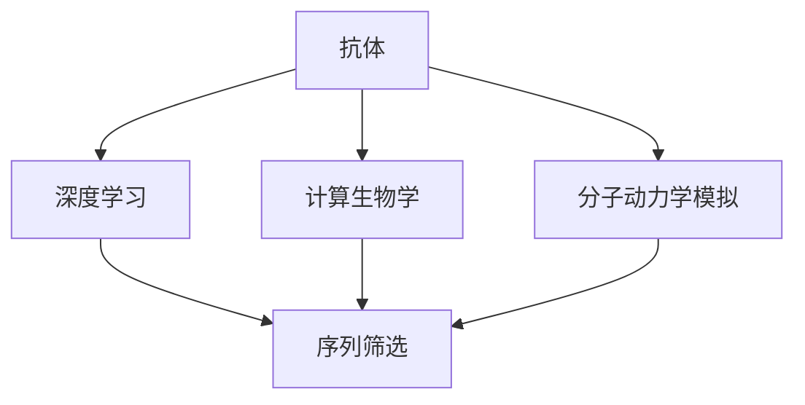

                 

# AI辅助抗体设计：加速疫苗研发

> 关键词：人工智能(AI)、抗体设计、疫苗研发、深度学习、计算生物学、分子模拟、药物发现

## 1. 背景介绍

### 1.1 问题由来

近年来，人工智能(AI)技术在生物医药领域的应用日益广泛，特别是在疫苗研发和抗体设计等方面，AI辅助工具已展现出巨大的潜力。在新冠疫情等重大公共卫生事件中，AI加速了疫苗研发和生产的进程，显著缩短了疫苗从实验室到市场的周期。尽管AI技术带来了诸多变革，但疫苗研发和抗体设计仍然面临诸多挑战，如高昂的成本、漫长的周期、复杂的实验验证等。

抗体作为免疫系统的关键分子，在治疗癌症、自身免疫疾病、传染病等方面发挥着重要作用。传统的抗体设计依赖于昂贵的实验和经验，耗时长且成功率低。随着AI技术的崛起，利用深度学习、计算生物学和分子模拟等方法，可以在短时间内生成大量候选抗体，大幅提升设计和筛选的效率。AI技术不仅在抗体设计中发挥着重要作用，还在药物发现、分子动力学模拟、药物-蛋白质结合预测等方面展现了卓越的性能。

### 1.2 问题核心关键点

AI辅助抗体设计的核心在于利用机器学习和计算模拟技术，对大量的生物数据进行分析和处理，从而加速抗体分子的设计、筛选和优化过程。与传统方法相比，AI技术可以大幅降低研发成本和时间，提高成功的可能性。

AI在抗体设计中的应用主要包括：

1. **序列筛选**：通过对大量已知的抗体序列进行建模，筛选出具有潜在功能的抗体片段。
2. **结构预测**：预测抗体的三维结构，分析其与目标抗原的结合位点。
3. **亲和力优化**：利用机器学习模型预测抗体的亲和力，并进行定向优化。
4. **分子动力学模拟**：通过模拟抗体与抗原的相互作用，预测抗体的结合稳定性和免疫反应。
5. **药物设计**：将抗体与小分子药物结合，设计新的复合药物。

这些技术的应用，使得AI在抗体设计中展现出高效、准确、低成本的优势。特别是在紧急疫苗研发中，AI辅助工具已成为不可替代的重要工具。

### 1.3 问题研究意义

AI辅助抗体设计的研究意义在于：

1. **提升研发效率**：AI可以快速筛选和设计大量候选抗体，大幅缩短研发周期，降低研发成本。
2. **提高成功率**：通过AI技术进行精确的预测和优化，提高筛选和设计的成功率，减少失败的概率。
3. **加速新药上市**：AI辅助工具可以加快新药的临床试验和上市进程，为患者提供更快速有效的治疗方案。
4. **推动技术创新**：AI在抗体设计中的应用，推动了生物技术领域的创新，开拓了新的研究方向和应用场景。
5. **应对公共卫生危机**：在疫情等紧急情况下，AI辅助工具可以快速响应，为疫苗研发提供关键支持，助力公共卫生事业。

## 2. 核心概念与联系

### 2.1 核心概念概述

为了深入理解AI在抗体设计中的应用，我们首先介绍几个关键概念：

- **抗体**：是一类能特异性结合抗原（如病毒、细菌、癌细胞等）的蛋白质分子，是免疫系统的重要组成部分。
- **深度学习**：一种基于神经网络的机器学习方法，通过多层次的特征提取和变换，实现复杂的模式识别和预测。
- **计算生物学**：利用计算机和数学方法，研究生物系统的结构和功能，特别是在蛋白质和核酸序列分析、分子模拟等方面。
- **分子动力学模拟**：通过计算分子间的相互作用和运动，模拟生物分子的动态行为，预测其功能和性质。
- **药物设计**：利用计算机辅助工具，设计新的药物分子，提高药物的活性和选择性，减少副作用。

这些概念构成了AI辅助抗体设计的基础，其中深度学习和计算生物学是其核心技术手段。

### 2.2 概念间的关系

这些核心概念之间存在着紧密的联系，形成了AI辅助抗体设计的完整生态系统。我们可以用以下Mermaid流程图来展示它们之间的关系：



这个流程图展示了抗体设计过程中各个核心概念的关系：

1. 抗体作为研究对象，利用深度学习和计算生物学进行序列分析和结构预测。
2. 通过分子动力学模拟，分析抗体与抗原的相互作用，优化抗体的结构和功能。
3. 利用深度学习进行抗体序列的筛选和设计，同时结合药物设计技术，设计新的抗体药物。

这些概念共同构成了AI辅助抗体设计的完整流程，为抗体分子的设计和优化提供了技术保障。

## 3. 核心算法原理 & 具体操作步骤
### 3.1 算法原理概述

AI辅助抗体设计的核心算法原理基于深度学习、计算生物学和分子模拟的结合。其基本流程如下：

1. **数据预处理**：收集大量已知的抗体序列和结构数据，进行预处理和标注。
2. **序列建模**：利用深度学习模型，如卷积神经网络(CNN)、循环神经网络(RNN)、变分自编码器(VAE)等，对抗体序列进行建模和特征提取。
3. **结构预测**：使用分子动力学模拟和深度学习模型，预测抗体的三维结构和结合位点。
4. **亲和力预测**：利用深度学习模型，如支持向量机(SVM)、神经网络(NN)等，预测抗体的亲和力，并进行优化。
5. **分子模拟**：通过分子动力学模拟，分析抗体与抗原的相互作用，预测抗体的结合稳定性和免疫反应。
6. **药物设计**：将抗体与小分子药物结合，利用深度学习模型设计新的复合药物。

### 3.2 算法步骤详解

以下是AI辅助抗体设计的主要操作步骤：

**Step 1: 数据预处理**

收集和整理大量的抗体序列和结构数据，包括已知的抗体序列、结构、功能和结合位点等信息。利用预处理工具进行清洗、归一化、标注等工作，确保数据的完整性和一致性。

**Step 2: 序列建模**

利用深度学习模型对抗体序列进行建模和特征提取。常用的深度学习模型包括卷积神经网络(CNN)、循环神经网络(RNN)和变分自编码器(VAE)等。这些模型可以自动学习序列中的关键特征，识别出重要的氨基酸残基和空间构型。

**Step 3: 结构预测**

使用分子动力学模拟和深度学习模型，预测抗体的三维结构和结合位点。常用的分子动力学模拟软件包括GROMACS、AMBER等，可以模拟抗体分子的动态行为，计算分子间的相互作用。同时，利用深度学习模型，如卷积神经网络(CNN)、卷积递归神经网络(CRNN)等，预测抗体的结合位点，识别出与抗原结合的关键残基和构型。

**Step 4: 亲和力预测**

利用深度学习模型预测抗体的亲和力，并进行优化。常用的深度学习模型包括支持向量机(SVM)、神经网络(NN)等。通过训练大量已知的抗体-抗原结合数据，模型可以预测抗体的亲和力，识别出具有高亲和力的抗体片段。同时，利用遗传算法、粒子群优化等方法，对高亲和力的抗体片段进行定向优化，提高其结合稳定性和亲和力。

**Step 5: 分子模拟**

通过分子动力学模拟，分析抗体与抗原的相互作用，预测抗体的结合稳定性和免疫反应。常用的分子动力学模拟方法包括分子动力学模拟(MD)、蒙特卡罗模拟(MC)等。模拟结果可以用于评估抗体的免疫反应和稳定性，优化抗体的设计和筛选过程。

**Step 6: 药物设计**

将抗体与小分子药物结合，利用深度学习模型设计新的复合药物。常用的深度学习模型包括生成对抗网络(GAN)、变分自编码器(VAE)等。这些模型可以生成新的分子结构，预测其与抗体结合的稳定性和活性，进行定向优化，设计出具有高亲和力和活性的新型药物。

### 3.3 算法优缺点

AI辅助抗体设计的算法具有以下优点：

1. **高效率**：利用深度学习和大规模计算，可以在短时间内生成和筛选大量候选抗体，大幅缩短研发周期。
2. **高准确性**：通过精确的预测和优化，提高筛选和设计的成功率，减少失败的概率。
3. **低成本**：减少对昂贵的实验和人工的依赖，降低研发成本。
4. **创新性**：结合深度学习、计算生物学和分子模拟，开拓了新的研究方向和应用场景，推动技术创新。

但同时也存在一些缺点：

1. **数据依赖**：需要大量高质量的数据进行训练和验证，数据收集和预处理成本较高。
2. **模型复杂**：深度学习模型和分子模拟的计算复杂度高，需要高性能的计算资源。
3. **解释性不足**：模型的决策过程难以解释，难以理解其内部工作机制和推理逻辑。
4. **伦理问题**：模型的使用可能涉及隐私保护和伦理道德问题，需要严格监管和管理。

### 3.4 算法应用领域

AI辅助抗体设计技术可以应用于多个领域，包括疫苗研发、癌症治疗、自身免疫疾病、传染病防治等。以下是一些典型的应用场景：

- **疫苗研发**：利用AI进行序列筛选和结构预测，设计新的疫苗分子，加速疫苗的研发进程。
- **癌症治疗**：利用AI进行抗体序列的筛选和优化，设计具有高亲和力和活性的抗体分子，用于癌症治疗。
- **自身免疫疾病**：利用AI进行抗体设计，开发针对自身免疫疾病的抗体药物，减少疾病的复发和恶化。
- **传染病防治**：利用AI进行抗体设计，开发针对传染病的抗体药物，减少疾病的传播和流行。

## 4. 数学模型和公式 & 详细讲解  
### 4.1 数学模型构建

为了更好地理解AI在抗体设计中的应用，我们通过数学模型来阐述其基本原理。

假设抗体序列为 $S$，长度为 $L$，氨基酸序列为 $a_1, a_2, ..., a_L$。利用深度学习模型 $f$ 对序列进行特征提取，得到特征向量 $F$。利用分子动力学模拟，预测抗体的三维结构，得到结构向量 $G$。利用深度学习模型 $h$ 对抗体-抗原结合位点进行预测，得到结合位点向量 $H$。利用支持向量机(SVM)模型 $s$ 对抗体亲和力进行预测，得到亲和力向量 $A$。

上述过程可以表示为数学公式：

$$
F = f(S)
$$

$$
G = \text{MD}(S)
$$

$$
H = h(S)
$$

$$
A = s(S)
$$

### 4.2 公式推导过程

以深度学习模型 $f$ 为例，其基本结构包括卷积层、池化层、全连接层等。假设抗体序列 $S$ 被编码为向量 $x_1, x_2, ..., x_L$，则深度学习模型的输出为：

$$
F = f(x_1, x_2, ..., x_L) = \text{Conv}(x_1, x_2, ..., x_L) + \text{Pool}(\text{Conv}(x_1, x_2, ..., x_L)) + \text{FC}(\text{Pool}(\text{Conv}(x_1, x_2, ..., x_L)))
$$

其中 $\text{Conv}$ 表示卷积层，$\text{Pool}$ 表示池化层，$\text{FC}$ 表示全连接层。

通过上述公式，深度学习模型可以自动学习抗体序列中的关键特征，识别出重要的氨基酸残基和空间构型，从而用于序列筛选和结构预测。

### 4.3 案例分析与讲解

以新冠疫苗研发为例，利用AI辅助抗体设计，可以大幅度缩短研发周期。其基本流程如下：

**Step 1: 数据收集**

收集已知的病毒序列和抗体序列数据，作为训练数据。利用Bioconductor等工具进行数据预处理，包括去除重复、去除噪声等。

**Step 2: 序列建模**

利用深度学习模型对病毒序列进行建模和特征提取。常用的模型包括卷积神经网络(CNN)、循环神经网络(RNN)等。通过训练大量已知的病毒序列数据，模型可以自动学习病毒序列中的关键特征，识别出重要的氨基酸残基和空间构型。

**Step 3: 结构预测**

使用分子动力学模拟和深度学习模型，预测病毒的三维结构和结合位点。利用GROMACS等软件进行病毒分子的动态模拟，计算分子间的相互作用。同时，利用卷积神经网络(CNN)等模型，预测病毒结合位点，识别出与抗体结合的关键残基和构型。

**Step 4: 亲和力预测**

利用深度学习模型预测抗体的亲和力，并进行优化。常用的深度学习模型包括支持向量机(SVM)、神经网络(NN)等。通过训练大量已知的抗体-病毒结合数据，模型可以预测抗体的亲和力，识别出具有高亲和力的抗体片段。同时，利用遗传算法、粒子群优化等方法，对高亲和力的抗体片段进行定向优化，提高其结合稳定性和亲和力。

**Step 5: 分子模拟**

通过分子动力学模拟，分析抗体与病毒的相互作用，预测抗体的结合稳定性和免疫反应。利用分子动力学模拟软件进行抗体病毒结合的模拟，计算结合稳定性和免疫反应。模拟结果可以用于评估抗体的免疫反应和稳定性，优化抗体的设计和筛选过程。

**Step 6: 药物设计**

将抗体与小分子药物结合，利用深度学习模型设计新的复合药物。常用的深度学习模型包括生成对抗网络(GAN)、变分自编码器(VAE)等。这些模型可以生成新的分子结构，预测其与抗体结合的稳定性和活性，进行定向优化，设计出具有高亲和力和活性的新型药物。

## 5. 项目实践：代码实例和详细解释说明
### 5.1 开发环境搭建

在进行AI辅助抗体设计实践前，我们需要准备好开发环境。以下是使用Python进行深度学习开发的环境配置流程：

1. 安装Anaconda：从官网下载并安装Anaconda，用于创建独立的Python环境。

2. 创建并激活虚拟环境：
```bash
conda create -n pytorch-env python=3.8 
conda activate pytorch-env
```

3. 安装PyTorch：根据CUDA版本，从官网获取对应的安装命令。例如：
```bash
conda install pytorch torchvision torchaudio cudatoolkit=11.1 -c pytorch -c conda-forge
```

4. 安装必要的深度学习库：
```bash
pip install numpy pandas scikit-learn matplotlib tqdm jupyter notebook ipython
```

5. 安装BioPython库：
```bash
pip install biopython
```

完成上述步骤后，即可在`pytorch-env`环境中开始AI辅助抗体设计实践。

### 5.2 源代码详细实现

这里我们以利用深度学习模型进行抗体序列建模和亲和力预测为例，给出Python代码实现。

```python
import torch
from torch import nn
from torch.nn import functional as F
from biopython import SeqIO
import numpy as np

class CNNModel(nn.Module):
    def __init__(self, input_size, output_size):
        super(CNNModel, self).__init__()
        self.conv1 = nn.Conv1d(input_size, 32, 3)
        self.pool1 = nn.MaxPool1d(2)
        self.conv2 = nn.Conv1d(32, 64, 3)
        self.pool2 = nn.MaxPool1d(2)
        self.fc1 = nn.Linear(64 * (len(seq) - 2), 128)
        self.fc2 = nn.Linear(128, output_size)

    def forward(self, x):
        x = x.view(len(x), -1)
        x = F.relu(self.conv1(x))
        x = self.pool1(x)
        x = F.relu(self.conv2(x))
        x = self.pool2(x)
        x = x.view(len(x), -1)
        x = F.relu(self.fc1(x))
        x = self.fc2(x)
        return x

# 假设抗体序列为 "AISGADYGVVSVGLVLRSVQGQGEVQVDIPGTEAVIDGAFSERQIKLTSGGASGSQKLTEYISLVQQGHPGLRSMGPVVGTDLAFGISEYDYIPGPTFGGADSVGLGEGYSVQPVIPGDVPITRSALNIAGLTGGSFGETFTGSKTRQAIPGGLIYKIINLIQGAVADADVCGSVGTDGTTLVGQGGTGSVVLTLTFPAPVYDVGAVNKTPVTPKSFNLKLKLPINQRPVDVSGEYISGLRTIGAPPLITAADLGVGGSFIVEALQDSGVGEQIGVVKGVVGPVVPKVGKIVRVFELRLLGRARIGVHADVVSLGGVVLTIPEGRGDLKVLTSGEVFEGSTVEGGGRTEFDLRGELFFVDEGLLGDVQGGSGVNVLGIQAASDFSRKRPIDGDPAPVIFLSVAQGSKFAFPGAIARRSFPVFAVGGLGRRGRRVYIPNKFQGDDVGRRNAGNGEQSKAPISVQFQKLPGDGGVVAIAEGFSYDIARESGRVDVFPYFGKVIKLRRIVGSESGSHNIVQFDSVFEGLDVNLNGYGIRRPFERLGSSVADTPDGEVLYGEGVRRLADGPFSGGGIGRKTTDLFEGKVGCSVIGSREFGIKETLPQIVKVFNGSLKTYTDPVIGRRVASDVGLFDRGPTGQEHSKQRIPGQNDDGEGGDLGYINLLGNAFYVDEVEKIVDLRVVALVDPVGPVRIKLNGTPGLGFKKVPKRTSEADDIQDLDFKKKSVVDPGGSVSLGQGTGSGSGGGSVGPGGKTTSEFKGIAEALVPGDSGDADFQPFKGGSGVGDYFSSAVLEEQGSLDEGLEYYGVRGDPGQGDPQVKRYDDGKTPVDRDLFGDDAEEGEEGDGLYDGFFHNVNKFFQGEGARVGPRRLVPAVSRLGPAPSVRVTLGSNKEDGVALQARQLKRRNGEQGGRGPVALPAFIDSRGSFPQDGFAADSKLTAGTPGTVSLGSHGIGGNTPTDVADLLSQVTLYDVGGLFYENGGRRVFGSFDGGELGDDSSFTGGLAQEGLVKEGGDVQKIFSGRVVNTGTPQRNFDGIFQEVRKADVAEAVGAVDPAPAKKTLSRPGRTEVDEGLSQVDFGEGIRSPGVLSRGGSEFGRGDGRLLADGALDDVTDIKADVDPFASFRPVLSDFRGGSGFQGQVNVDPGLGEEVTDPFFRYIQDDRYAASAQRVLFGDPFEGGALRRPRGPVADLIDYDRGDGYAVGPVSGLDGIFHGSLFFGVKSAEAPTVTGALIDVRFQGTEGEVIGSFNKNGGADVGPDGKTPFLRDDRKGQDAEYSYYEGGAVAAFLEPVQNQKRPTVGFIKKDAPSPGYFKPDGSARLLAAARPLAARQVDSGLRGGFLGAIFFGDDGHPRIEGVNDDDDTVGAYSPGPAGLLAAAPGQEYDDGKGDYFARFGGSLVFVPAGDVVDGYGPFEQVTPGDPGVDEEGVLRRITDDSTTYGPGLDIQEGGKAVQAIPDMDVGDPGQGPQSLELTITGAYERDAERIGGDDIPGVLKMRPLPRRPQIVVESGHPAQQSLSVGAEVYIVHDDGELQGQSGGVALRREVSFGDPVNPGYRKGDPGTADGGEQYEGTPGYTGDVKGAEVVDGDDPGGEGSARPRFETGGSDEQKFVLSFHSFEEFLGQQGRTIDVYDDGGLHTEAPGPFFKAFPEQLERATYVPGRVQFGGFRFFELGGIGTGIPQGFPFATGEEADGAGPGQALNPLGAKTLKTEAPPSVGNGKVGFGQGGVSFGGAHLGFQGGLGTVTGNGQTRADADASVQEGLQQDGEELSVQQNFGGGEALRLDPGEEGEEGLQGADGASDEGGEVNLGDAATYYIPGGSPFKGATDVDPGDAPGLFQDLGSPRFDGEEIKNYSGGADGDDVPQQGFGVRGKVGALVRLLGSGVQEGSGGRLGASIQEQGGGGLGLGKRPRDRGQGFGARSGGSPVTPGVDGPVNVHGGGRRDPGRRGGEGYTYDVEGTYGAPFGVTLTGVSQGGGTGAGGATVPDEGFGGAVKFQEQQDFGGMKQGDASRHKKSHGPDGGVDPGDGGSGDVGAAALDDGVRAPGTVEGGEINNQRSVGGGTYDDGDVQARFTRITGGDGKAEVPGSPGFGYLVGEGMGYYPTGDDLYFGLHGRGKTEQSVLYITVAVGTGGGEELGGGVGGSVLLGQAIGLVFDGIAQDDGDTVTKKPGGGRHITKTLGGGVVDPGTPFGLEELKDGEELATGGVGALLGGVDGTPKPVQEVLFVTRGFFKGGGQVDFDGGVVEVQGGRVGGVIGDLGAPGTEGAAATGHSRGQDGLGDPGVSPLFQAADVGGEVGGLVDDDRGGTGEEGSLAVRGEKDKVLGGEILNGSGGGGKTLGSKKQVDDGQSPGGNVVATAVDIEGRVGGRYNNFQYVGERATDASVQDGGGSVFLDPEGGMDPIPVVLHDKYFNTGNAQLGLSVPDEEERGFPGADSVYRLLAVVQGGGVDAVFSGDGGEFEAVGGYIRQVGLVKGVNDFGVQGIPLGGIGTGEGGSAEIRNTYRRGFFDSIGGRRVGYRDDGVSDGVHTRGVDLGGVGQDVEGGGDVAEGGVSGKRKDPGEGGLRIEGRGADGEPFGTPGPGRGIAKKYSVGPGRVSGDGKQIRLAVNVVDGDGVEVRIEFGDVVDVRGGLPPGDTGVPVYYVGKPGFVDPGEGGGRRVGRPDPLFGFKPDGGIPVLDPGSGYSGGASGIPGGMGNIGDGRGVFEGGAFEGGFDSGLEEVNPQGVLIPVRKGGGYSLADDSFQGAPGGGDVVGRIADGGPPYVGDGIVLTLSGDFEEVQGFEGGGGFGGEGAYRRGYRGFFQGKYMDAAFGVRDGEVPGRGDDGRYIGTPFGGFIPEYIPPGGSGPGNGDVGEVYATGKGYGGGAVDILGATVGEVGVSFGGFGGPGLGQAEGQRATGGGAGGFGGDGLYTGYADNGGSGVGGVGGEVVGPVVYAEGSVLTASVGEGVFLGEFEDGGEASGGGGKVQRQGFRYSGGGVPGVFDAEVGGGSAEGVGGVDEGKAALGGGATLGSGDVEVGAFSGGPVGGDDDVGGRVGQVVGHSFAEVGAPGDGGGEVNGLGGYVFYDRGIPAVGVAEVGGGVVGDVFEGGAFRRGQEVAFFVPFDDIPAQGSGGALRRGAVVDDGGGTYDVPFFQGVEGGGDDLVYDDGGGVGGLDDDGGVDGDRAGARVGDDAGGYGGTVTVDVGRRERGGGQGFDVGASSGTSGGITRVFDPGVEGYTRDLGADRGTVGGGLDRGDDPGYGSKAEVGVQSQVLEGVAPGAGGQEAAARFVDPGQEEDYKGGKVFDPGVTVYLTGDDDYVSPPVYPRYLVGQLRGNGPDGDIPGVTGADFYFGEVVDAYGEYDTRGRRGAVVLGDGAPGTGAPGEGGGKELDEEKRYVVVGQGGVVIGGGRGQGDISSGGGNNADVFDGEGGIGGSPGVRGFLVEGTPDVVGAVVGVGDGGFGAYGTYTYTDEGVVQGPVDVTDGGRVGGGGRYGKVAPGGLALAQLLYVGVFPETGPRYSGGDPGKQEPGIVFDGDDGFTSVGALGQRGGDKFADGARVGGVSGGIGRVTPGGAGGIRGVPDPGVEVLGAYLGEVGARVLDGRADFQNVGADGFEIGELLYGYYTVGG

