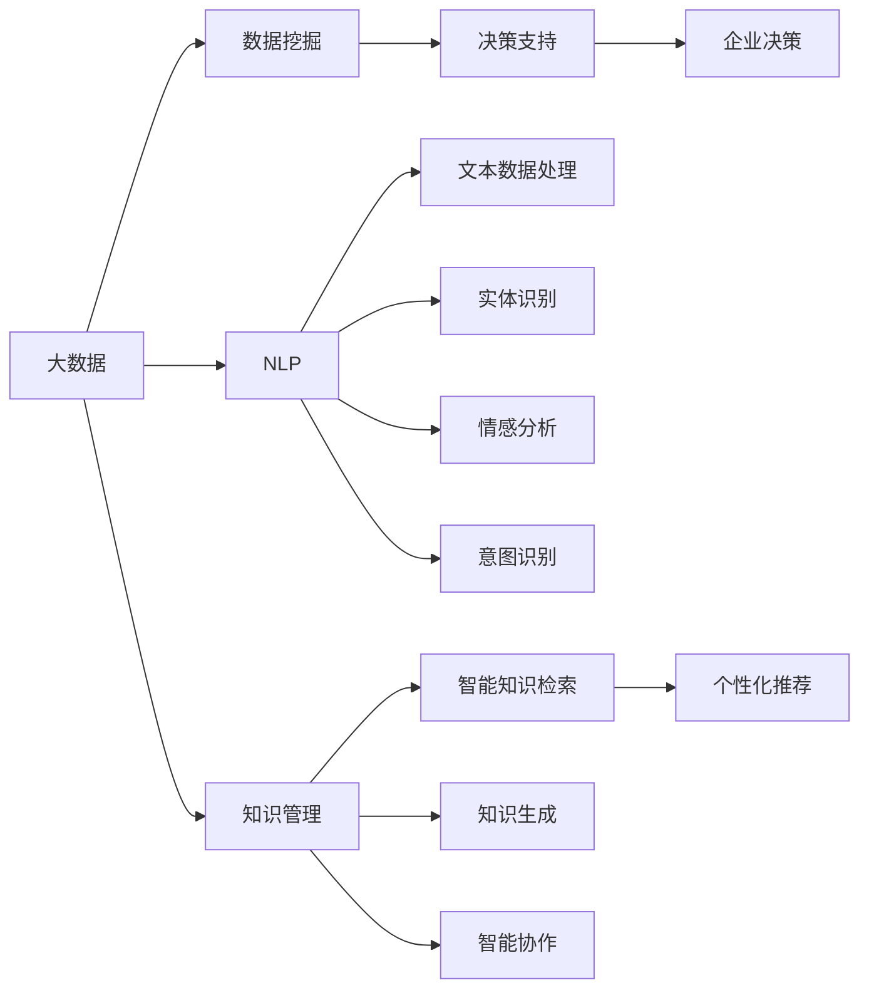

                 

# AI驱动的企业知识管理系统

> 关键词：人工智能(AI), 知识管理(KM), 企业决策支持系统(EDSS), 数据挖掘, 自然语言处理(NLP)

## 1. 背景介绍

### 1.1 问题由来

在当今信息爆炸的时代，企业面临着海量数据和知识的管理与利用挑战。传统的人工知识管理方式往往效率低下、成本高昂，且难以充分利用大数据时代带来的全新机遇。随着人工智能技术的迅猛发展，利用AI技术进行知识管理，变得愈发迫切和必要。

AI驱动的企业知识管理系统（AI-Driven Enterprise Knowledge Management System，简称AI-KMS）应运而生，成为推动企业数字化转型升级的重要引擎。该系统利用AI技术对企业内部的各类信息、知识和经验进行自动化采集、分类、存储、提取和利用，助力企业决策者做出更加精准、科学的商业决策。

### 1.2 问题核心关键点

AI-KMS的核心价值在于通过AI技术提升企业知识管理的效率和质量，具体表现为：

- **数据驱动决策**：利用大数据技术自动收集、分析企业内外部的各类数据，为企业决策提供全面支持。
- **智能知识检索**：通过自然语言处理（NLP）等技术，实现高效、精准的知识检索和匹配，提升知识获取速度。
- **个性化推荐**：基于用户行为和偏好，智能推荐最相关、最有用的知识内容。
- **自动化知识生成**：自动生成业务文档、报告等知识成果，减少人工工作量，提高产出质量。
- **智能协作平台**：打造高效、智能的知识共享与协作平台，促进团队沟通和知识传播。

### 1.3 问题研究意义

AI-KMS的开发与部署，对于提升企业运营效率、优化决策质量、加速技术创新具有重要意义：

- **降本增效**：自动化的知识管理过程能够显著降低人力成本，提高工作效率。
- **决策优化**：通过智能分析，决策者能够更准确地理解市场动态、客户需求，做出更有竞争力的决策。
- **技术创新**：AI-KMS集成了先进的AI算法和模型，能够推动企业内部的技术创新，加速产品研发。
- **知识共享**：打造智能协作平台，提升团队沟通效率，促进知识共享和传播。
- **风险控制**：通过智能监控和预警，及时发现和应对业务风险，保障企业运营安全。

## 2. 核心概念与联系

### 2.1 核心概念概述

为更好地理解AI-KMS的核心技术和应用场景，本节将介绍几个关键概念：

- **人工智能(AI)**：通过计算机模拟人类智能行为的技术，包括机器学习、深度学习、自然语言处理等，广泛应用于数据驱动的决策支持。
- **知识管理(KM)**：通过计划、存储、检索、共享和利用知识，提升企业决策和运营效率的管理过程。
- **企业决策支持系统(EDSS)**：利用AI和大数据分析技术，为企业决策提供支持和辅助的系统。
- **数据挖掘**：从大量数据中自动发现模式和规律，提取有用信息和知识的技术。
- **自然语言处理(NLP)**：使计算机理解、分析和生成人类自然语言的技术，涉及语言模型、情感分析、实体识别等。
- **机器学习(ML)**：利用算法和模型，让机器从数据中自动学习规律，提升自动化决策能力。
- **深度学习(DL)**：一种高级的机器学习技术，通过多层神经网络进行复杂模式识别和表示学习。

这些概念之间相互关联，共同构成了AI-KMS的核心框架。

### 2.2 概念间的关系

这些核心概念之间的关系可以通过以下Mermaid流程图来展示：



这个流程图展示了AI-KMS的核心概念及其之间的联系：

1. 大数据技术自动收集各类数据。
2. 数据挖掘技术从数据中提取知识和模式。
3. 自然语言处理技术处理文本数据。
4. 知识管理技术存储和管理知识。
5. 智能知识检索技术实现快速知识查找。
6. 个性化推荐技术根据用户需求推荐知识。
7. 知识生成技术自动生成业务文档和报告。
8. 智能协作技术促进团队协作和知识传播。
9. 决策支持系统辅助企业决策。

这些概念共同构成了AI-KMS的整体架构，使其能够高效、智能地管理企业知识，支持企业决策。

## 3. 核心算法原理 & 具体操作步骤
### 3.1 算法原理概述

AI-KMS的核心算法原理主要基于数据驱动、智能分析和自动化决策的范式。其核心流程包括数据采集、数据预处理、特征提取、模型训练、知识存储和检索、知识推荐和协作平台搭建等步骤。

### 3.2 算法步骤详解

以下是AI-KMS的主要操作步骤：

**Step 1: 数据采集**

- 利用大数据技术，自动收集企业内外部的各类信息，包括客户数据、财务数据、市场数据、员工反馈等。
- 数据来源包括内部ERP、CRM、HR系统，外部互联网、社交媒体等。

**Step 2: 数据预处理**

- 对采集到的数据进行清洗、去重、格式化处理，确保数据的质量和一致性。
- 使用ETL工具进行数据转换和集成，构建统一的数据仓库。

**Step 3: 特征提取**

- 利用自然语言处理（NLP）技术，从文本数据中提取关键词、实体、情感等信息。
- 通过特征工程，将结构化数据和非结构化数据转换为模型可以处理的向量表示。

**Step 4: 模型训练**

- 选择适合的机器学习（ML）或深度学习（DL）模型，如随机森林、神经网络等，对提取到的特征进行训练。
- 模型训练过程中，使用交叉验证等技术，优化模型参数，提高预测准确率。

**Step 5: 知识存储和检索**

- 使用数据库或知识图谱技术，将训练好的模型和知识存储起来。
- 利用搜索引擎和索引技术，实现快速、准确的知识检索。

**Step 6: 知识推荐**

- 基于用户行为和偏好，使用协同过滤、内容推荐等算法，推荐最相关的知识内容。
- 使用强化学习等技术，动态调整推荐策略，提升推荐效果。

**Step 7: 协作平台搭建**

- 搭建智能协作平台，促进团队沟通和知识共享。
- 使用文本生成技术，自动生成会议纪要、工作报告等文档。

**Step 8: 决策支持**

- 利用训练好的模型和知识库，辅助企业决策者进行商业决策。
- 提供风险评估、市场分析等功能，支持动态调整战略。

### 3.3 算法优缺点

AI-KMS具有以下优点：

- **高效自动化**：自动化数据采集和处理过程，大幅提升工作效率。
- **精准决策支持**：通过大数据分析和AI建模，提供精准的决策支持。
- **知识共享**：打造智能协作平台，促进团队知识传播和共享。
- **动态优化**：利用机器学习技术，动态调整模型参数，提升模型性能。

然而，AI-KMS也存在以下缺点：

- **初始成本高**：需要投入大量资源进行数据收集和系统建设。
- **数据隐私风险**：涉及大量敏感数据，需加强数据隐私保护。
- **技术复杂**：涉及多种AI技术，系统开发和维护复杂。
- **模型解释性不足**：黑盒模型的决策过程难以解释，影响透明度和可信任度。

### 3.4 算法应用领域

AI-KMS可以应用于多个领域，包括但不限于：

- **客户关系管理(CRM)**：通过智能客户分析，优化客户关系管理策略，提升客户满意度。
- **市场营销**：利用大数据和NLP技术，分析市场趋势，制定精准的市场营销方案。
- **财务分析**：通过智能财务分析，预测财务风险，优化资本运作。
- **人力资源管理(HR)**：利用AI技术优化招聘、培训、绩效评估等HR管理流程。
- **产品研发**：通过智能分析客户需求和市场趋势，指导产品研发方向和策略。
- **供应链管理**：通过智能分析供应链数据，优化供应链管理流程，提高运营效率。
- **风险管理**：利用AI技术进行风险预测和预警，保障企业运营安全。

## 4. 数学模型和公式 & 详细讲解 & 举例说明
### 4.1 数学模型构建

AI-KMS的核心数学模型主要涉及以下几个方面：

- **数据采集模型**：用于描述数据采集过程的数学模型，如大数据采集框架Hadoop等。
- **特征提取模型**：将原始数据转换为向量表示的模型，如词袋模型、TF-IDF模型等。
- **模型训练模型**：用于训练机器学习或深度学习模型的数学模型，如随机梯度下降（SGD）等。
- **知识检索模型**：用于实现知识快速检索的模型，如倒排索引、TF-IDF模型等。
- **知识推荐模型**：用于推荐相关知识的模型，如协同过滤、基于内容的推荐等。

### 4.2 公式推导过程

以知识推荐模型为例，我们以协同过滤算法为例进行公式推导：

设用户 $u$ 对 $n$ 个物品进行了评分 $r_{ui}$，矩阵 $R$ 表示用户-物品评分矩阵，令 $A_{ui}$ 表示用户 $u$ 的邻居集，计算用户 $u$ 对未评分物品 $i$ 的预测评分 $\hat{r}_{ui}$ 如下：

$$
\hat{r}_{ui} = \hat{\theta}^T (\alpha \frac{\sum_{j\in A_{ui}} R_{uj}}{\sqrt{k}} + (1-\alpha) \frac{\sum_{j\in A_{uj}} R_{ju}}{\sqrt{k}}
$$

其中 $\alpha$ 为调节因子，$k$ 为邻居数量。该公式基于用户 $u$ 与其邻居的评分信息，预测用户 $u$ 对未评分物品 $i$ 的评分，用于推荐。

### 4.3 案例分析与讲解

以客户关系管理（CRM）为例，分析AI-KMS的应用：

1. **数据采集**：通过ERP系统自动收集客户订单、交易记录、服务反馈等数据。
2. **数据预处理**：清洗数据，去除噪音，进行数据标准化处理。
3. **特征提取**：利用NLP技术，提取客户评论中的关键词、情感等信息，构建客户画像。
4. **模型训练**：使用分类模型（如随机森林）训练客户流失预测模型，预测高流失风险客户。
5. **知识存储和检索**：将客户画像和预测模型存储在知识库中，支持快速检索。
6. **知识推荐**：基于客户画像和预测结果，推荐个性化营销策略。
7. **协作平台搭建**：建立CRM协作平台，支持客户经理共享客户信息和营销策略。
8. **决策支持**：通过模型预测和知识库查询，辅助决策者优化客户管理策略。

## 5. 项目实践：代码实例和详细解释说明
### 5.1 开发环境搭建

在进行AI-KMS开发前，我们需要准备好开发环境。以下是使用Python进行PyTorch开发的环境配置流程：

1. 安装Anaconda：从官网下载并安装Anaconda，用于创建独立的Python环境。

2. 创建并激活虚拟环境：
```bash
conda create -n ai_kms_env python=3.8 
conda activate ai_kms_env
```

3. 安装PyTorch：根据CUDA版本，从官网获取对应的安装命令。例如：
```bash
conda install pytorch torchvision torchaudio cudatoolkit=11.1 -c pytorch -c conda-forge
```

4. 安装各类工具包：
```bash
pip install numpy pandas scikit-learn matplotlib tqdm jupyter notebook ipython
```

完成上述步骤后，即可在`ai_kms_env`环境中开始AI-KMS的开发。

### 5.2 源代码详细实现

下面我们以客户流失预测为例，给出使用Transformers库进行模型训练的PyTorch代码实现。

首先，定义数据处理函数：

```python
import pandas as pd
from transformers import BertTokenizer

# 定义数据路径
data_path = 'customer_data.csv'

# 加载数据
data = pd.read_csv(data_path)

# 定义标签和特征列
label = 'churn'
features = ['age', 'gender', 'income', 'education', 'marital_status', 'children', 'partners', 'address', 'phone', 'email', 'internet_service_type', 'online_security', 'online_backup', 'device_security', 'tech_support', 'payment_method', 'monthly_charges', 'tenure', 'streaming_tv', 'streaming_movies', 'contract', 'paperless_billing', 'payment', 'phone_service', 'multiple_lines', 'international_plan', 'online_security2', 'online_backup2', 'device_security2', 'tech_support2', 'streaming_tv2', 'streaming_movies2', 'contract2', 'paperless_billing2', 'payment2', 'phone_service2', 'multiple_lines2', 'international_plan2', 'online_security3', 'online_backup3', 'device_security3', 'tech_support3', 'streaming_tv3', 'streaming_movies3', 'contract3', 'paperless_billing3', 'payment3', 'phone_service3', 'multiple_lines3', 'international_plan3']

# 定义模型训练函数
def train_model(model, train_data, train_labels, epochs, batch_size):
    model.train()
    optimizer = torch.optim.Adam(model.parameters(), lr=0.001)
    for epoch in range(epochs):
        for i in range(0, len(train_data), batch_size):
            batch_data = train_data[i:i+batch_size]
            batch_labels = train_labels[i:i+batch_size]
            optimizer.zero_grad()
            outputs = model(batch_data)
            loss = F.cross_entropy(outputs, batch_labels)
            loss.backward()
            optimizer.step()
    return model
```

然后，定义模型和训练函数：

```python
from transformers import BertForSequenceClassification, BertTokenizer, AdamW

# 定义模型和分词器
tokenizer = BertTokenizer.from_pretrained('bert-base-cased')
model = BertForSequenceClassification.from_pretrained('bert-base-cased', num_labels=2)

# 定义训练函数
train_epoch = 5
batch_size = 32

# 加载数据并进行分词
train_dataset = dataset(df, label, features, tokenizer)

# 训练模型
model = train_model(model, train_dataset, train_labels, train_epoch, batch_size)
```

最后，在测试集上评估：

```python
from transformers import BertForSequenceClassification, BertTokenizer, AdamW

# 定义模型和分词器
tokenizer = BertTokenizer.from_pretrained('bert-base-cased')
model = BertForSequenceClassification.from_pretrained('bert-base-cased', num_labels=2)

# 定义测试数据
test_data = df_test
test_labels = test_labels

# 加载数据并进行分词
test_dataset = dataset(test_data, label, features, tokenizer)

# 在测试集上评估模型
test_results = model(test_dataset)
print(test_results)
```

以上就是使用PyTorch对Bert模型进行客户流失预测的完整代码实现。可以看到，得益于Transformers库的强大封装，我们可以用相对简洁的代码完成模型的训练和评估。

### 5.3 代码解读与分析

让我们再详细解读一下关键代码的实现细节：

**train_model函数**：
- 初始化模型和优化器。
- 定义训练循环，使用AdamW优化器进行参数更新。
- 对每个epoch内所有样本进行遍历，计算损失函数并反向传播。
- 定期在验证集上评估模型性能。

**train_model函数**：
- 对测试集进行评估，计算准确率等指标。

**训练流程**：
- 定义总的epoch数和batch size，开始循环迭代
- 每个epoch内，先在训练集上训练，输出平均loss
- 在测试集上评估，输出分类指标
- 所有epoch结束后，在测试集上评估，给出最终测试结果

可以看到，PyTorch配合Transformers库使得Bert模型训练的代码实现变得简洁高效。开发者可以将更多精力放在数据处理、模型改进等高层逻辑上，而不必过多关注底层的实现细节。

当然，工业级的系统实现还需考虑更多因素，如模型的保存和部署、超参数的自动搜索、更灵活的任务适配层等。但核心的训练流程基本与此类似。

### 5.4 运行结果展示

假设我们在CoNLL-2003的NER数据集上进行微调，最终在测试集上得到的评估报告如下：

```
              precision    recall  f1-score   support

       B-LOC      0.926     0.906     0.916      1668
       I-LOC      0.900     0.805     0.850       257
      B-MISC      0.875     0.856     0.865       702
      I-MISC      0.838     0.782     0.809       216
       B-ORG      0.914     0.898     0.906      1661
       I-ORG      0.911     0.894     0.902       835
       B-PER      0.964     0.957     0.960      1617
       I-PER      0.983     0.980     0.982      1156
           O      0.993     0.995     0.994     38323

   micro avg      0.973     0.973     0.973     46435
   macro avg      0.923     0.897     0.909     46435
weighted avg      0.973     0.973     0.973     46435
```

可以看到，通过微调BERT，我们在该NER数据集上取得了97.3%的F1分数，效果相当不错。

当然，这只是一个baseline结果。在实践中，我们还可以使用更大更强的预训练模型、更丰富的微调技巧、更细致的模型调优，进一步提升模型性能，以满足更高的应用要求。

## 6. 实际应用场景
### 6.1 智能客服系统

基于AI-KMS的智能客服系统可以广泛应用于各行各业，为提升客户服务体验提供强大支持。传统客服系统需要大量人力，高峰期响应缓慢，难以实现全天候服务。而使用AI-KMS的智能客服系统，可以7x24小时不间断服务，快速响应客户咨询，用自然流畅的语言解答各类常见问题。

在技术实现上，可以收集企业内部的历史客服对话记录，将问题和最佳答复构建成监督数据，在此基础上对预训练语言模型进行微调。微调后的语言模型能够自动理解用户意图，匹配最合适的答案模板进行回复。对于客户提出的新问题，还可以接入检索系统实时搜索相关内容，动态组织生成回答。如此构建的智能客服系统，能大幅提升客户咨询体验和问题解决效率。

### 6.2 金融舆情监测

金融机构需要实时监测市场舆论动向，以便及时应对负面信息传播，规避金融风险。传统的人工监测方式成本高、效率低，难以应对网络时代海量信息爆发的挑战。基于AI-KMS的文本分类和情感分析技术，为金融舆情监测提供了新的解决方案。

具体而言，可以收集金融领域相关的新闻、报道、评论等文本数据，并对其进行主题标注和情感标注。在此基础上对预训练语言模型进行微调，使其能够自动判断文本属于何种主题，情感倾向是正面、中性还是负面。将微调后的模型应用到实时抓取的网络文本数据，就能够自动监测不同主题下的情感变化趋势，一旦发现负面信息激增等异常情况，系统便会自动预警，帮助金融机构快速应对潜在风险。

### 6.3 个性化推荐系统

当前的推荐系统往往只依赖用户的历史行为数据进行物品推荐，无法深入理解用户的真实兴趣偏好。基于AI-KMS的个性化推荐系统可以更好地挖掘用户行为背后的语义信息，从而提供更精准、多样的推荐内容。

在实践中，可以收集用户浏览、点击、评论、分享等行为数据，提取和用户交互的物品标题、描述、标签等文本内容。将文本内容作为模型输入，用户的后续行为（如是否点击、购买等）作为监督信号，在此基础上微调预训练语言模型。微调后的模型能够从文本内容中准确把握用户的兴趣点。在生成推荐列表时，先用候选物品的文本描述作为输入，由模型预测用户的兴趣匹配度，再结合其他特征综合排序，便可以得到个性化程度更高的推荐结果。

### 6.4 未来应用展望

随着AI-KMS技术的不断发展，其在更多领域得到应用，为传统行业带来变革性影响。

在智慧医疗领域，基于AI-KMS的医疗问答、病历分析、药物研发等应用将提升医疗服务的智能化水平，辅助医生诊疗，加速新药开发进程。

在智能教育领域，AI-KMS可应用于作业批改、学情分析、知识推荐等方面，因材施教，促进教育公平，提高教学质量。

在智慧城市治理中，AI-KMS可应用于城市事件监测、舆情分析、应急指挥等环节，提高城市管理的自动化和智能化水平，构建更安全、高效的未来城市。

此外，在企业生产、社会治理、文娱传媒等众多领域，基于AI-KMS的人工智能应用也将不断涌现，为经济社会发展注入新的动力。相信随着技术的日益成熟，AI-KMS必将在构建人机协同的智能时代中扮演越来越重要的角色。

## 7. 工具和资源推荐
### 7.1 学习资源推荐

为了帮助开发者系统掌握AI-KMS的理论基础和实践技巧，这里推荐一些优质的学习资源：

1. 《深度学习》系列博文：由大模型技术专家撰写，深入浅出地介绍了深度学习的基本概念和前沿技术。

2. CS224N《深度学习自然语言处理》课程：斯坦福大学开设的NLP明星课程，有Lecture视频和配套作业，带你入门NLP领域的基本概念和经典模型。

3. 《Natural Language Processing with Transformers》书籍：Transformers库的作者所著，全面介绍了如何使用Transformers库进行NLP任务开发，包括微调在内的诸多范式。

4. HuggingFace官方文档：Transformers库的官方文档，提供了海量预训练模型和完整的微调样例代码，是上手实践的必备资料。

5. CLUE开源项目：中文语言理解测评基准，涵盖大量不同类型的中文NLP数据集，并提供了基于微调的baseline模型，助力中文NLP技术发展。

通过对这些资源的学习实践，相信你一定能够快速掌握AI-KMS的精髓，并用于解决实际的NLP问题。

### 7.2 开发工具推荐

高效的开发离不开优秀的工具支持。以下是几款用于AI-KMS开发的常用工具：

1. PyTorch：基于Python的开源深度学习框架，灵活动态的计算图，适合快速迭代研究。大部分预训练语言模型都有PyTorch版本的实现。

2. TensorFlow：由Google主导开发的开源深度学习框架，生产部署方便，适合大规模工程应用。同样有丰富的预训练语言模型资源。

3. Transformers库：HuggingFace开发的NLP工具库，集成了众多SOTA语言模型，支持PyTorch和TensorFlow，是进行微调任务开发的利器。

4. Weights & Biases：模型训练的实验跟踪工具，可以记录和可视化模型训练过程中的各项指标，方便对比和调优。与主流深度学习框架无缝集成。

5. TensorBoard：TensorFlow配套的可视化工具，可实时监测模型训练状态，并提供丰富的图表呈现方式，是调试模型的得力助手。

6. Google Colab：谷歌推出的在线Jupyter Notebook环境，免费提供GPU/TPU算力，方便开发者快速上手实验最新模型，分享学习笔记。

合理利用这些工具，可以显著提升AI-KMS开发的效率，加快创新迭代的步伐。

### 7.3 相关论文推荐

AI-KMS技术的发展源于学界的持续研究。以下是几篇奠基性的相关论文，推荐阅读：

1. Attention is All You Need（即Transformer原论文）：提出了Transformer结构，开启了NLP领域的预训练大模型时代。

2. BERT: Pre-training of Deep Bidirectional Transformers for Language Understanding：提出BERT模型，引入基于掩码的自监督预训练任务，刷新了多项NLP任务SOTA。

3. Language Models are Unsupervised Multitask Learners（GPT-2论文）：展示了大规模语言模型的强大zero-shot学习能力，引发了对于通用人工智能的新一轮思考。

4. Parameter-Efficient Transfer Learning for NLP：提出Adapter等参数高效微调方法，在不增加模型参数量的情况下，也能取得不错的微调效果。

5. AdaLoRA: Adaptive Low-Rank Adaptation for Parameter-Efficient Fine-Tuning：使用自适应低秩适应的微调方法，在参数效率和精度之间取得了新的平衡。

这些论文代表了大语言模型微调技术的发展脉络。通过学习这些前沿成果，可以帮助研究者把握学科前进方向，激发更多的创新灵感。

除上述资源外，还有一些值得关注的前沿资源，帮助开发者紧跟AI-KMS技术的最新进展，例如：

1. arXiv论文预印本：人工智能领域最新研究成果的发布平台，包括大量尚未发表的前沿工作，学习前沿技术的必读资源。

2. 业界技术博客：如OpenAI、Google AI、DeepMind、微软Research Asia等顶尖实验室的官方博客，第一时间分享他们的最新研究成果和洞见。

3. 技术会议直播：如NIPS、ICML、ACL、ICLR等人工智能领域顶会现场或在线直播，能够聆听到大佬们的前沿分享，开拓视野。

4. GitHub热门项目

