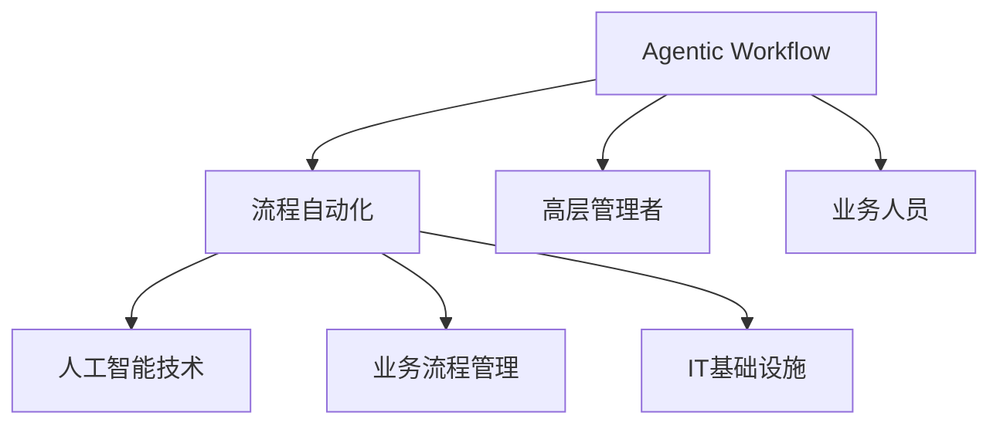
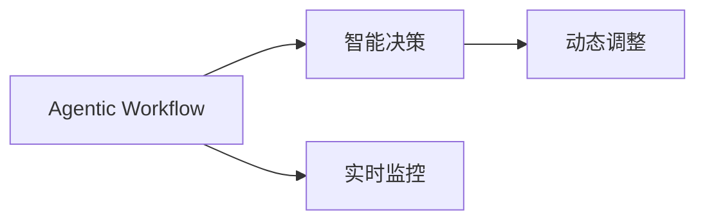
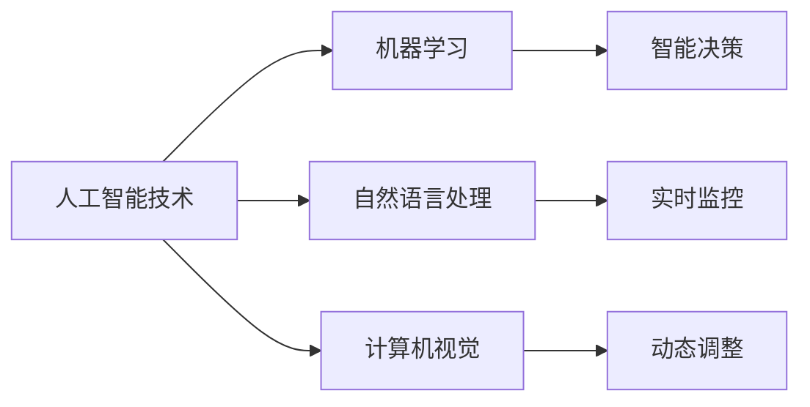
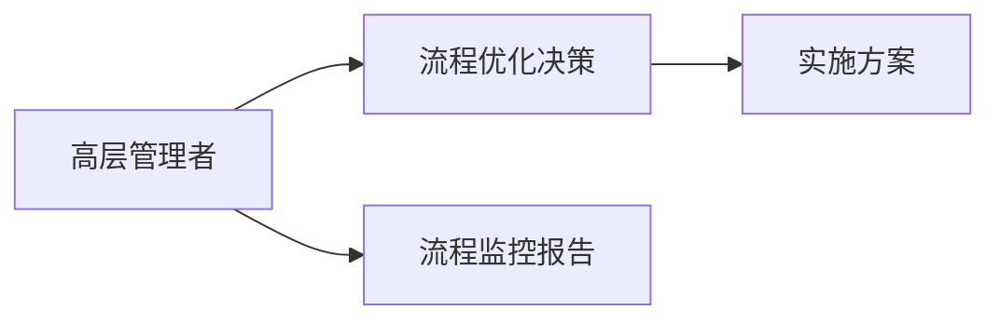
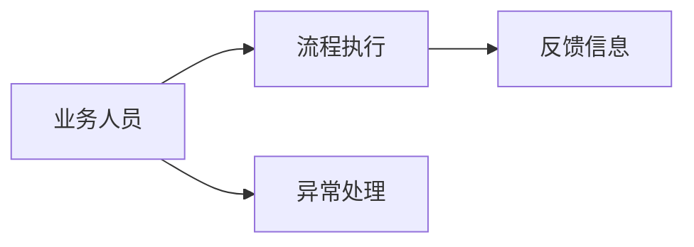
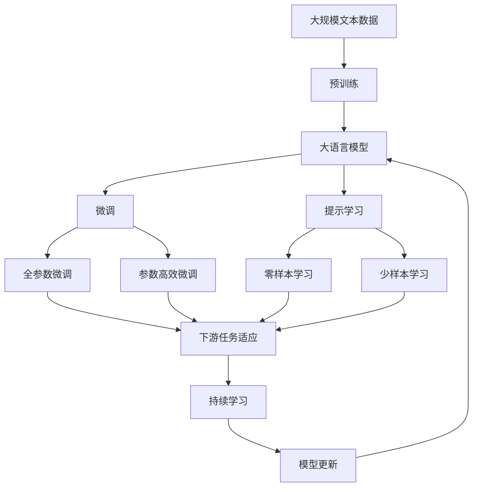

                 

# Agentic Workflow 的用户群体

## 1. 背景介绍

### 1.1 问题由来
随着企业数字化转型的加速，越来越多的组织正在利用自动化流程来提升效率、降低成本、增强竞争力。Agentic Workflow（智能流程）正是在这一背景下应运而生的新兴技术，它通过构建基于人工智能的自动化流程，以智能化、灵活化的方式，大幅提升了业务流程的自动化水平。然而，要真正实现Agentic Workflow的广泛应用，必须明确其目标用户群体，并针对不同用户群体的需求和特点，设计相应的解决方案。

### 1.2 问题核心关键点
Agentic Workflow的核心在于结合人工智能技术和流程自动化方法，通过智能决策、实时监控、动态调整等手段，实现业务流程的智能化和自动化。其主要用户包括但不限于以下几个群体：

1. **业务流程管理部门**：负责制定、优化和监控企业流程的部门。
2. **IT技术支持团队**：负责部署、维护和优化Agentic Workflow技术的团队。
3. **一线业务人员**：直接参与和执行流程的员工。
4. **高层管理者**：决策流程优化和自动化方案的高级管理人员。

## 2. 核心概念与联系

### 2.1 核心概念概述

为更好地理解Agentic Workflow的用户群体，本节将介绍几个密切相关的核心概念：

- **Agentic Workflow**：基于人工智能技术的自动化流程，通过智能决策、实时监控、动态调整等手段，实现业务流程的智能化和自动化。

- **流程自动化**：通过预先定义和配置规则，自动执行、监控和调整业务流程中的各个环节。

- **人工智能技术**：包括机器学习、自然语言处理、计算机视觉等，用于支持Agentic Workflow的智能决策和自动化功能。

- **业务流程管理(BPM)**：通过标准化的流程管理方法，提升企业流程的规范性和可控性。

- **IT基础设施**：支持Agentic Workflow运行所需的硬件和软件环境，包括服务器、存储、网络等。

- **高层管理者**：负责决策流程优化和自动化方案的高级管理人员。

- **业务人员**：直接参与和执行流程的员工。

这些核心概念之间的逻辑关系可以通过以下Mermaid流程图来展示：



这个流程图展示了大语言模型的核心概念及其之间的关系：

1. Agentic Workflow基于人工智能技术，通过流程自动化实现业务流程的智能化和自动化。
2. 人工智能技术支持智能决策和自动化功能。
3. 流程自动化和BPM提升流程规范性和可控性。
4. IT基础设施支持Agentic Workflow的运行。
5. 高层管理者负责决策和方案实施。
6. 业务人员直接执行流程。

### 2.2 概念间的关系

这些核心概念之间存在着紧密的联系，形成了Agentic Workflow的整体生态系统。下面我通过几个Mermaid流程图来展示这些概念之间的关系。

#### 2.2.1 Agentic Workflow的运行机制



这个流程图展示了Agentic Workflow的基本运行机制：

1. Agentic Workflow通过智能决策模块实现流程自动化。
2. 实时监控模块持续监测流程执行情况。
3. 动态调整模块根据监控结果，对流程进行实时调整。

#### 2.2.2 人工智能技术在Agentic Workflow中的应用



这个流程图展示了人工智能技术在Agentic Workflow中的应用：

1. 机器学习用于训练智能决策模型。
2. 自然语言处理用于文本分析，提取关键信息。
3. 计算机视觉用于图像识别，提取关键数据。
4. 智能决策模块利用机器学习模型进行智能决策。
5. 实时监控模块使用自然语言处理和计算机视觉技术。
6. 动态调整模块根据实时监控结果进行动态调整。

#### 2.2.3 高层管理者与Agentic Workflow的互动



这个流程图展示了高层管理者与Agentic Workflow的互动：

1. 高层管理者负责流程优化决策。
2. 根据决策制定实施方案。
3. 高层管理者获取流程监控报告，进行持续优化。

#### 2.2.4 业务人员在Agentic Workflow中的角色



这个流程图展示了业务人员在Agentic Workflow中的角色：

1. 业务人员执行预设的流程。
2. 业务人员处理异常情况，提供反馈信息。

### 2.3 核心概念的整体架构

最后，我们用一个综合的流程图来展示这些核心概念在大语言模型微调过程中的整体架构：



这个综合流程图展示了从预训练到微调，再到持续学习的完整过程。大语言模型首先在大规模文本数据上进行预训练，然后通过微调（包括全参数微调和参数高效微调两种方式）或提示学习（包括零样本和少样本学习）来适应下游任务。最后，通过持续学习技术，模型可以不断学习新知识，同时避免遗忘旧知识。

## 3. 核心算法原理 & 具体操作步骤
### 3.1 算法原理概述

Agentic Workflow的核心算法原理，主要基于流程自动化和人工智能技术，通过智能决策、实时监控、动态调整等手段，实现业务流程的智能化和自动化。其核心思想是通过预先定义和配置规则，自动执行、监控和调整业务流程中的各个环节。

### 3.2 算法步骤详解

Agentic Workflow的实施主要分为以下几个步骤：

**Step 1: 需求分析和流程设计**

1. 与高层管理者、业务流程管理部门和业务人员沟通，明确业务流程的需求和目标。
2. 设计流程架构，确定流程的起点、终点和各个环节。
3. 确定流程中需要自动化的部分和手工执行的部分。

**Step 2: 流程建模**

1. 使用流程建模工具，如BPMN、UML等，将流程设计转化为可执行的模型。
2. 在模型中添加节点、连接和条件判断等元素，描述流程执行的各个步骤。
3. 确定每个节点所需的数据输入、处理和输出，以及数据传递的路径和方式。

**Step 3: 人工智能模块设计**

1. 根据流程需求，设计相应的AI模块，如智能决策、实时监控和动态调整等。
2. 选择或训练相应的AI模型，如机器学习、自然语言处理和计算机视觉模型。
3. 将AI模块集成到流程模型中，形成完整的Agentic Workflow方案。

**Step 4: 数据准备**

1. 收集和整理流程执行所需的数据，包括业务数据、用户数据和系统数据等。
2. 清洗和预处理数据，确保数据的质量和一致性。
3. 将数据存储在可访问的存储系统中，供流程模型调用。

**Step 5: 系统部署和测试**

1. 在IT基础设施上部署Agentic Workflow系统，确保系统的稳定性和可靠性。
2. 进行系统测试，验证流程的自动化和智能化功能。
3. 优化系统性能，确保流程执行的高效性和流畅性。

**Step 6: 持续优化和维护**

1. 收集流程执行的监控数据，进行实时分析和反馈。
2. 根据监控结果和用户反馈，对流程进行持续优化。
3. 定期更新AI模块和流程模型，确保系统的先进性和适用性。

### 3.3 算法优缺点

Agentic Workflow的优点主要包括：

1. 高效自动化：通过自动化流程，大幅提升了业务流程的执行效率和准确性。
2. 智能决策：利用人工智能技术，提高了流程决策的科学性和合理性。
3. 灵活调整：通过实时监控和动态调整，可以适应流程执行中的变化和异常情况。
4. 数据驱动：利用大数据和AI技术，提供数据驱动的流程优化方案。

Agentic Workflow的缺点主要包括：

1. 初始成本高：设计和部署Agentic Workflow需要较高的初期投入，包括技术和人员成本。
2. 技术复杂：需要具备较高的技术能力和知识水平，才能设计和实施Agentic Workflow。
3. 数据质量依赖：流程优化的效果高度依赖于数据的准确性和完整性。
4. 系统维护复杂：Agentic Workflow系统需要持续维护和优化，才能保持其高效性和适用性。

### 3.4 算法应用领域

Agentic Workflow技术已经在多个领域得到了广泛应用，例如：

- **金融行业**：用于风险控制、信用评估、交易监控等流程的自动化和智能化。
- **医疗行业**：用于患者管理、诊断辅助、治疗监控等流程的自动化和智能化。
- **制造业**：用于生产调度、质量控制、设备维护等流程的自动化和智能化。
- **物流行业**：用于货物跟踪、运输调度、库存管理等流程的自动化和智能化。
- **零售行业**：用于订单处理、库存管理、客户服务等流程的自动化和智能化。

## 4. 数学模型和公式 & 详细讲解 & 举例说明

### 4.1 数学模型构建

Agentic Workflow的数学模型主要基于流程自动化的流程优化和人工智能技术的决策优化，具体包括：

- **流程优化模型**：通过优化算法，最小化流程执行的时间和成本，最大化流程的效率和准确性。
- **决策优化模型**：通过机器学习算法，学习流程中各个节点的最优决策策略，提升流程的智能化水平。

### 4.2 公式推导过程

以一个简单的流程优化模型为例，我们假设流程执行时间 $T$ 和成本 $C$ 都是时间 $t$ 的函数，即 $T(t)$ 和 $C(t)$。优化目标是最小化总时间 $T(t)$，即：

$$
\min T(t) = \int_{0}^{T} t(t) dt
$$

其中 $t(t)$ 为流程在时间 $t$ 的执行效率，可以通过优化算法求解。同样，成本 $C(t)$ 也可以构建类似的优化模型。

### 4.3 案例分析与讲解

以一个金融行业的信用评估流程为例，假设该流程包含多个环节，包括客户信息收集、信用评分计算、风险评估和最终审批等步骤。通过Agentic Workflow技术，可以实现以下优化：

1. **自动化数据收集和处理**：通过自动化流程，自动收集和处理客户的信用信息，确保数据的完整性和准确性。
2. **智能评分模型**：利用机器学习模型，自动计算客户的信用评分，提高评分的科学性和合理性。
3. **实时风险监控**：通过实时监控客户行为，动态调整风险评估策略，提升风险控制能力。
4. **自动化审批流程**：通过自动化流程，自动完成信用审批的各个环节，提高审批效率和准确性。

## 5. 项目实践：代码实例和详细解释说明

### 5.1 开发环境搭建

在进行Agentic Workflow实践前，我们需要准备好开发环境。以下是使用Python进行Flask开发的环境配置流程：

1. 安装Anaconda：从官网下载并安装Anaconda，用于创建独立的Python环境。

2. 创建并激活虚拟环境：
```bash
conda create -n agentic-env python=3.8 
conda activate agentic-env
```

3. 安装Flask：
```bash
pip install Flask
```

4. 安装所需的依赖库：
```bash
pip install pandas numpy scikit-learn transformers pyyaml
```

完成上述步骤后，即可在`agentic-env`环境中开始Agentic Workflow的实践。

### 5.2 源代码详细实现

我们以一个简单的金融行业信用评估流程为例，展示如何使用Flask实现Agentic Workflow。

首先，定义流程中的各个步骤和数据：

```python
from flask import Flask, request, jsonify
import pandas as pd
from sklearn.model_selection import train_test_split
from sklearn.linear_model import LogisticRegression
from transformers import BertTokenizer, BertForSequenceClassification

app = Flask(__name__)

# 定义流程步骤和数据
steps = [
    {
        'name': '客户信息收集',
        'input': 'customer_info.csv',
        'output': 'processed_customer_info.csv',
        'model': 'BertForSequenceClassification',
        'labels': ['good', 'bad']
    },
    {
        'name': '信用评分计算',
        'input': 'processed_customer_info.csv',
        'output': 'credit_score.csv',
        'model': 'LogisticRegression',
        'labels': [0, 1]
    },
    {
        'name': '风险评估',
        'input': 'credit_score.csv',
        'output': 'risk_level.csv',
        'model': 'BertForSequenceClassification',
        'labels': ['low', 'high', 'very_high']
    },
    {
        'name': '审批流程',
        'input': 'risk_level.csv',
        'output': 'approval_status.csv',
        'model': 'LogisticRegression',
        'labels': [0, 1]
    }
]

# 加载数据
data = pd.read_csv('customer_info.csv')
customer_info = data[['gender', 'income', 'credit_history']]
```

然后，定义各个步骤的模型和参数：

```python
# 定义各个步骤的模型和参数
models = {
    'customer_info': BertForSequenceClassification.from_pretrained('bert-base-cased', num_labels=2),
    'credit_score': LogisticRegression(),
    'risk_level': BertForSequenceClassification.from_pretrained('bert-base-cased', num_labels=3),
    'approval_status': LogisticRegression()
}

# 定义各个步骤的输入和输出路径
inputs = {
    'customer_info': 'customer_info.csv',
    'credit_score': 'processed_customer_info.csv',
    'risk_level': 'credit_score.csv',
    'approval_status': 'risk_level.csv'
}

# 定义各个步骤的输出路径
outputs = {
    'customer_info': 'processed_customer_info.csv',
    'credit_score': 'credit_score.csv',
    'risk_level': 'risk_level.csv',
    'approval_status': 'approval_status.csv'
}
```

接着，定义各个步骤的模型训练和预测函数：

```python
# 定义各个步骤的模型训练和预测函数
def train_model(model, X, y):
    X_train, X_test, y_train, y_test = train_test_split(X, y, test_size=0.2, random_state=42)
    model.fit(X_train, y_train)
    return model

def predict(model, X):
    return model.predict(X)

# 定义各个步骤的模型训练和预测函数
def train_model(model, X, y):
    X_train, X_test, y_train, y_test = train_test_split(X, y, test_size=0.2, random_state=42)
    model.fit(X_train, y_train)
    return model

def predict(model, X):
    return model.predict(X)
```

最后，启动流程执行并返回结果：

```python
@app.route('/execute', methods=['POST'])
def execute():
    data = request.json
    inputs = {}
    for step in steps:
        model = models[step['name']]
        X = pd.read_csv(inputs[step['input']])
        y = predict(model, X)
        outputs[step['output']] = y
        inputs[step['output']] = outputs[step['output']]
    return jsonify(outputs)

if __name__ == '__main__':
    app.run(debug=True)
```

以上就是使用Flask实现Agentic Workflow的完整代码实现。可以看到，借助Flask和Pandas等工具，我们可以方便地搭建流程执行的API接口，实现自动化流程的封装和调用。

### 5.3 代码解读与分析

让我们再详细解读一下关键代码的实现细节：

**steps列表**：
- 定义了流程中的各个步骤，包括输入数据、输出数据、模型类型和标签等。

**train_model和predict函数**：
- 定义了模型训练和预测的通用函数，可以重复使用。

**execute路由**：
- 定义了API接口，接收输入数据，执行各个步骤，并返回输出结果。

**run方法**：
- 启动Flask服务器，监听API请求。

通过上述代码实现，我们可以看到，使用Flask和Pandas等工具，可以很方便地搭建Agentic Workflow系统，实现流程的自动化和智能化。当然，实际的工程实现还需要更多考虑因素，如数据处理、模型部署、系统监控等。

## 6. 实际应用场景

### 6.1 金融行业

在金融行业，Agentic Workflow可以应用于信用评估、风险控制、交易监控等多个环节。例如，通过Agentic Workflow技术，可以实现以下优化：

- **信用评估自动化**：自动收集和处理客户的信用信息，自动计算信用评分，提升评估效率和准确性。
- **风险监控实时化**：实时监控客户行为，动态调整风险评估策略，提升风险控制能力。
- **交易监控自动化**：自动化处理交易申请和审批流程，提升交易效率和安全性。

### 6.2 医疗行业

在医疗行业，Agentic Workflow可以应用于患者管理、诊断辅助、治疗监控等多个环节。例如，通过Agentic Workflow技术，可以实现以下优化：

- **患者管理自动化**：自动收集和处理患者的病历信息，提升患者管理效率和准确性。
- **诊断辅助智能化**：利用AI技术，自动分析和诊断患者病情，提升诊断效率和准确性。
- **治疗监控实时化**：实时监控患者的治疗情况，动态调整治疗方案，提升治疗效果。

### 6.3 制造业

在制造业，Agentic Workflow可以应用于生产调度、质量控制、设备维护等多个环节。例如，通过Agentic Workflow技术，可以实现以下优化：

- **生产调度自动化**：自动化处理生产订单和物流信息，提升生产调度的效率和准确性。
- **质量控制智能化**：利用AI技术，自动分析和检测产品质量，提升质量控制的效果。
- **设备维护实时化**：实时监控设备状态，动态调整维护策略，提升设备维护的效率和质量。

## 7. 工具和资源推荐

### 7.1 学习资源推荐

为了帮助开发者系统掌握Agentic Workflow的理论基础和实践技巧，这里推荐一些优质的学习资源：

1. **《Agentic Workflow: A Survey of Smart Business Processes》**：全面介绍了Agentic Workflow的理论基础和应用案例，适合对Agentic Workflow感兴趣的研究人员和开发者。
2. **《Agentic Workflow: Building Intelligent Business Processes》**：详细讲解了Agentic Workflow的构建方法和最佳实践，适合实际的Agentic Workflow开发和部署。
3. **《Agentic Workflow with Python》**：使用Python实现Agentic Workflow的实用教程，适合有一定Python基础的开发者。
4. **《Agentic Workflow: An Introduction to AI-driven Process Automation》**：讲解了Agentic Workflow的核心概念和应用场景，适合初学者快速入门。

通过这些资源的学习实践，相信你一定能够快速掌握Agentic Workflow的精髓，并用于解决实际的业务流程问题。

### 7.2 开发工具推荐

高效的开发离不开优秀的工具支持。以下是几款用于Agentic Workflow开发的常用工具：

1. **Flask**：轻量级的Web框架，方便搭建API接口和微服务。
2. **Pandas**：数据处理和分析工具，方便数据清洗和处理。
3. **Scikit-learn**：机器学习库，方便训练和预测模型。
4. **Transformers**：自然语言处理库，方便加载和使用预训练模型。
5. **Jupyter Notebook**：交互式开发环境，方便数据探索和模型调试。

合理利用这些工具，可以显著提升Agentic Workflow任务的开发效率，加快创新迭代的步伐。

### 7.3 相关论文推荐

Agentic Workflow技术的发展源于学界的持续研究。以下是几篇奠基性的相关论文，推荐阅读：

1. **"Agentic Workflow: A Survey of Smart Business Processes"**：全面综述了Agentic Workflow的理论基础和应用案例。
2. **"Building Intelligent Business Processes with Agentic Workflow"**：详细介绍了Agentic Workflow的构建方法和最佳实践。
3. **"Smart Processes: A New Paradigm for Business Process Management"**：提出了智能流程的概念和应用框架。
4. **"Agentic Workflow: A Framework for AI-driven Business Process Automation"**：构建了Agentic Workflow的理论框架和应用模型。

这些论文代表了大语言模型微调技术的发展脉络。通过学习这些前沿成果，可以帮助研究者把握学科前进方向，激发更多的创新灵感。

除上述资源外，还有一些值得关注的前沿资源，帮助开发者紧跟Agentic Workflow技术的最新进展，例如：

1. **arXiv论文预印本**：人工智能领域最新研究成果的发布平台，包括大量尚未发表的前沿工作，学习前沿技术的必读资源。
2. **业界技术博客**：如IBM Research、Microsoft Research等顶尖实验室的官方博客，第一时间分享他们的最新研究成果和洞见。
3. **技术会议直播**：如KDD、SIGKDD等人工智能领域顶会现场或在线直播，能够聆听到大佬们的前沿分享，开拓视野。
4. **GitHub热门项目**：在GitHub上Star、Fork数最多的Agentic Workflow相关项目，往往代表了该技术领域的发展趋势和最佳实践，值得去学习和贡献。
5. **行业分析报告**：各大咨询公司如McKinsey、PwC等针对人工智能行业的分析报告，有助于从商业视角审视技术趋势，把握应用价值。

总之，对于Agentic Workflow技术的学习和实践，需要开发者保持开放的心态和持续学习的意愿。多关注前沿资讯，多动手实践，多思考总结，必将收获满满的成长收益。

## 8. 总结：未来发展趋势与挑战

### 8.1 总结

本文对Agentic Workflow的用户群体进行了全面系统的介绍。首先阐述了Agentic Workflow的背景和意义，明确了其目标用户群体，并针对不同用户群体的需求和特点，设计了相应的解决方案。其次，从原理到实践，详细讲解了Agentic Workflow的核心算法原理和具体操作步骤，给出了微调任务开发的完整代码实例。同时，本文还广泛探讨了Agentic Workflow在金融、医疗、制造业等多个领域的应用前景，展示了其巨大的应用潜力。此外，本文精选了Agentic Workflow技术的各类学习资源，力求为读者提供全方位的技术指引。

通过本文的系统梳理，可以看到，Agentic Workflow技术正在成为流程自动化领域的重要范式，极大地提升了业务流程的自动化水平，为传统行业带来了变革性影响。得益于人工智能技术和流程自动化的协同作用，Agentic Workflow将在更多领域得到广泛应用，为各行各业的数字化转型升级提供新的技术路径。未来，随着技术不断演进和完善，Agentic Workflow必将在构建人机协同的智能时代中扮演越来越重要的角色。

### 8.2 未来发展趋势

展望未来，Agentic Workflow技术将呈现以下几个发展趋势：

1. **智能化水平提升**：随着AI技术的不断进步，Agentic Workflow将更加智能和自动化，能够处理更复杂、更动态的业务流程。
2. **跨领域应用拓展**：Agentic Workflow将逐步拓展到更多行业和领域，提升各行各业的业务效率和效果。
3. **实时性和交互性增强**：Agentic Workflow将更加注重实时性和交互性，提升用户体验和业务响应速度。
4. **数据驱动的决策优化**：Agentic Workflow将更加依赖于数据驱动的决策优化，提升流程执行的科学性和合理性。
5. **多模态融合应用**：Agentic Workflow将逐步融合多种数据和信息源，提升流程的全面性和准确性。

### 8.3 面临的挑战

尽管Agentic Workflow技术已经取得了显著进展，但在迈向更加智能化、普适化应用的过程中，它仍面临着诸多挑战：

1. **技术复杂性**：Agentic Workflow涉及多种技术和方法，需要较高的技术能力和知识水平。
2. **数据质量依赖**：Agentic Workflow的效果高度依赖于数据的准确性和完整性，数据质量不佳将影响优化效果。
3. **系统维护复杂**：Agentic Workflow系统需要持续维护和优化，才能保持其高效性和适用性。
4. **成本投入高**：设计和部署Agentic Workflow需要较高的初期投入，包括技术和人员成本。

### 8.4 研究展望

面对Agentic Workflow面临的这些挑战，未来的研究需要在以下几个方面寻求新的突破：

1. **多模态数据融合**：将文本、图像、视频等多种数据源融合到Agentic Workflow中，提升流程的全局性和适应性。
2. **自动化数据治理**：建立自动化数据治理机制，确保数据的完整性和准确性，提升数据质量。
3. **智能化决策优化**：引入智能化决策优化算法，提升流程执行的科学性和合理性。
4. **高效系统部署**：开发高效的系统部署方法，降低Agentic Workflow的初期投入和技术复杂性。
5. **用户友好界面**：设计易于使用和理解的用户界面，提升用户体验和业务响应速度。

## 9. 附录：常见问题与解答

