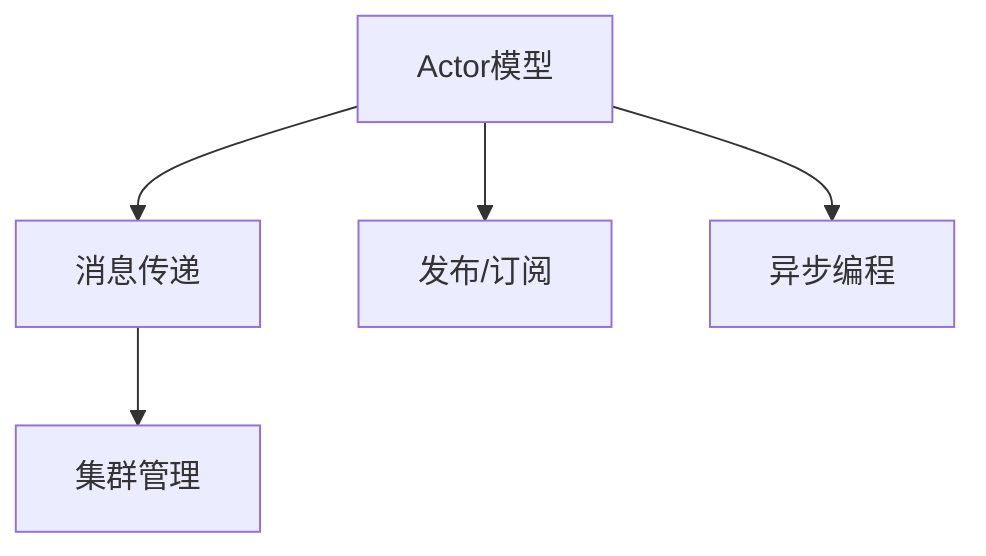
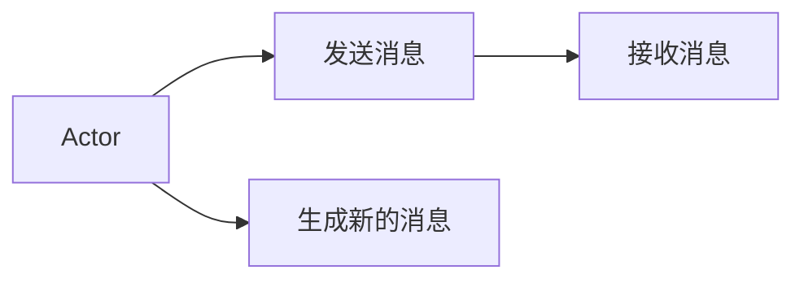
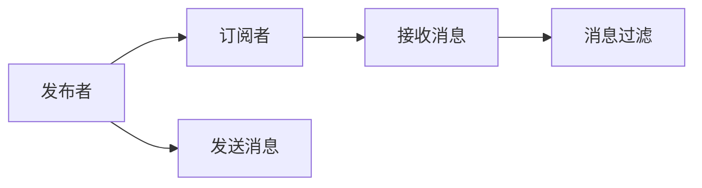
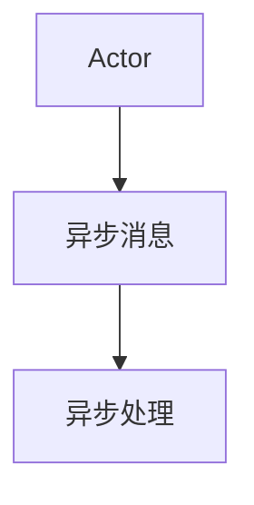
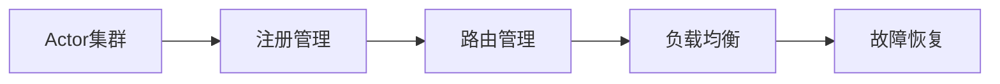
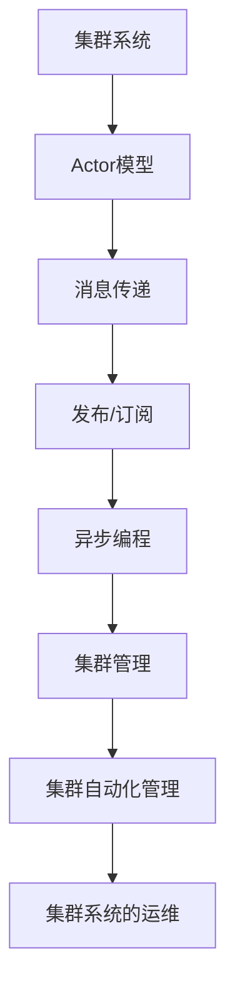

                 

# Akka集群原理与代码实例讲解

## 1. 背景介绍

### 1.1 问题由来

在分布式计算中，由于单个计算机的资源有限，我们通常需要利用集群中的多台计算机协同工作。这种集群协同工作的方式可以显著提高系统的性能、可靠性和可扩展性。然而，集群系统的构建和维护通常需要耗费大量的时间和人力成本，且集群系统的复杂性也给开发和运维带来了诸多挑战。

因此，如何设计一种高效、可靠且易于维护的集群系统，成为了分布式计算中的一个重要课题。Akka正是应对这一挑战的优秀解决方案，它基于Actor模型，提供了一套简洁、高效、可扩展的分布式计算框架，广泛应用于微服务架构、实时计算等领域。

### 1.2 问题核心关键点

Akka集群系统的核心关键点主要包括：

- 基于Actor模型的并发编程模型，可以显著降低系统设计的复杂性，提升系统的可靠性和性能。
- 提供了丰富的API和中间件，支持消息传递、发布/订阅、异步编程等多种并发编程范式。
- 采用基于消息传递的通信机制，实现了系统的高效解耦和无状态性，提高了系统的可扩展性和可维护性。
- 支持集群内消息路由、负载均衡、故障恢复等自动化管理机制，简化了集群系统的运维。

## 2. 核心概念与联系

### 2.1 核心概念概述

为更好地理解Akka集群的原理和实现，本节将介绍几个密切相关的核心概念：

- Actor模型：一种并发编程模型，将系统中的每个任务抽象为一个独立的Actor，每个Actor在接收到消息时，独立处理消息并生成新的消息发送给其他Actor，从而实现系统的并行处理。
- 消息传递（Message Passing）：Akka集群系统采用的通信机制，每个Actor通过消息传递与系统中的其他Actor进行交互，消息传递机制实现了系统的高效解耦和无状态性。
- 发布/订阅（Pub/Sub）模式：Akka集群系统支持的通信模式之一，实现了Actor之间的消息广播和过滤功能，进一步简化了系统的设计和运维。
- 异步编程：Akka集群系统采用的编程范式，通过异步消息传递机制，实现了Actor之间的异步通信，提高了系统的并发处理能力和吞吐量。
- 集群管理：Akka集群系统提供了一套自动化的管理机制，支持集群内Actor的注册、路由、负载均衡、故障恢复等，简化了集群系统的运维。

这些核心概念之间的逻辑关系可以通过以下Mermaid流程图来展示：



这个流程图展示了她Actor模型的核心概念及其之间的关系：

1. 基于Actor模型的并发编程模型。
2. 消息传递机制用于实现Actor之间的通信。
3. 发布/订阅模式用于消息的广播和过滤。
4. 异步编程范式用于提高系统的并发处理能力和吞吐量。
5. 集群管理机制用于系统的自动化管理。

### 2.2 概念间的关系

这些核心概念之间存在着紧密的联系，形成了Akka集群系统的完整生态系统。下面我通过几个Mermaid流程图来展示这些概念之间的关系。

#### 2.2.1 Actor模型的并发编程模型



这个流程图展示了Actor模型的并发编程模型。每个Actor在接收到消息时，独立处理消息并生成新的消息发送给其他Actor。

#### 2.2.2 发布/订阅模式的通信机制



这个流程图展示了发布/订阅模式的通信机制。发布者将消息广播给所有订阅者，订阅者可以选择性地过滤和处理消息。

#### 2.2.3 异步编程的并发处理能力



这个流程图展示了异步编程的并发处理能力。Actor之间通过异步消息传递机制实现通信，提高了系统的并发处理能力和吞吐量。

#### 2.2.4 集群管理的自动化机制



这个流程图展示了集群管理的自动化机制。集群系统自动管理Actor的注册、路由、负载均衡和故障恢复等。

### 2.3 核心概念的整体架构

最后，我们用一个综合的流程图来展示这些核心概念在大语言模型微调过程中的整体架构：



这个综合流程图展示了从集群系统到Actor模型，再到消息传递、发布/订阅、异步编程和集群管理等各个环节的关系。通过这些环节的协同工作，实现了Akka集群的整个系统架构。

## 3. 核心算法原理 & 具体操作步骤
### 3.1 算法原理概述

Akka集群系统基于Actor模型和消息传递机制，其核心算法原理包括以下几个方面：

- Actor模型：将系统中的每个任务抽象为一个独立的Actor，每个Actor在接收到消息时，独立处理消息并生成新的消息发送给其他Actor，从而实现系统的并行处理。
- 消息传递：Actor之间的通信机制，通过消息传递实现系统的高效解耦和无状态性。
- 发布/订阅：实现Actor之间的消息广播和过滤，进一步简化系统的设计和运维。
- 异步编程：通过异步消息传递机制，实现Actor之间的异步通信，提高系统的并发处理能力和吞吐量。
- 集群管理：支持集群内Actor的注册、路由、负载均衡、故障恢复等自动化管理机制，简化了集群系统的运维。

这些核心算法原理共同构成了Akka集群系统的算法基础，使得系统能够高效、可靠地处理大规模分布式计算任务。

### 3.2 算法步骤详解

Akka集群系统的算法步骤主要包括：

1. 配置集群：通过配置文件或代码，定义集群中的各个Actor和系统参数。
2. 注册Actor：将Actor注册到集群中，分配系统资源，使其可以接收和处理消息。
3. 发送消息：通过消息传递机制，将消息发送给集群中的其他Actor。
4. 接收消息：Actor接收到消息后，处理消息并生成新的消息。
5. 发布/订阅：将消息广播给所有订阅者，订阅者可以选择性地过滤和处理消息。
6. 异步处理：通过异步消息传递机制，实现Actor之间的异步通信。
7. 集群管理：通过集群管理机制，实现Actor的注册、路由、负载均衡和故障恢复等自动化管理。

以上算法步骤展示了Akka集群系统的整体执行流程，每个步骤都通过消息传递机制实现，简化了系统的设计和运维。

### 3.3 算法优缺点

Akka集群系统的优点包括：

- 并发编程模型简洁高效，降低了系统设计的复杂性。
- 消息传递机制实现系统的高效解耦和无状态性，提高了系统的可扩展性和可维护性。
- 发布/订阅模式和异步编程范式进一步简化了系统的设计和运维。
- 集群管理机制支持集群内Actor的注册、路由、负载均衡和故障恢复等自动化管理。

其缺点包括：

- 对于高并发的通信场景，消息传递机制可能会导致性能瓶颈。
- 异步编程范式需要开发者有较高的编程技巧和经验。
- 集群管理机制需要占用一定的系统资源。

## 4. 数学模型和公式 & 详细讲解 & 举例说明（备注：数学公式请使用latex格式，latex嵌入文中独立段落使用 $$，段落内使用 $)
### 4.1 数学模型构建

Akka集群系统基于Actor模型和消息传递机制，其数学模型可以表示为：

$$
\text{System} = \{\text{Actor}_1, \text{Actor}_2, ..., \text{Actor}_n\}
$$

其中，$\text{Actor}_i$ 表示集群中的第 $i$ 个Actor，每个Actor可以接收和处理消息，并进行异步通信和集群管理。

### 4.2 公式推导过程

根据Actor模型的并发编程模型和消息传递机制，可以将集群系统分为两个部分：

1. 并发编程部分：每个Actor在接收到消息时，独立处理消息并生成新的消息发送给其他Actor，从而实现系统的并行处理。

2. 消息传递部分：通过消息传递机制，实现系统的高效解耦和无状态性。

### 4.3 案例分析与讲解

假设有一个分布式计算任务，需要同时处理多个Actor的请求。在Actor模型中，可以设计一个处理器Actor（ProcessorActor）来处理请求，并将其发送给其他Actor进行计算。处理器Actor的代码如下：

```java
class ProcessorActor extends UntypedActor {
    private final ActorRef[] actors;

    @Override
    public void onReceive(Object message) {
        if (message instanceof ProcessRequest) {
            final int i = (int) message;
            final ActorRef actor = actors[i];
            final Request request = new Request();
            actor.tell(request, getSender());
        }
    }

    @Override
    public void preStart() {
        actors = new ActorRef[10];
        for (int i = 0; i < actors.length; i++) {
            actors[i] = getContext().actorOf(Props.create(CalculatorActor.class), "calculator-" + i);
        }
    }

    @Override
    public void postStop() {
        for (final ActorRef actor : actors) {
            actor.stop();
        }
    }
}
```

在处理器Actor中，根据请求的Actor编号，将计算请求发送给对应的计算Actor进行计算。处理器Actor的启动和停止过程中，分配了10个计算Actor，每个Actor负责一个计算任务。

## 5. 项目实践：代码实例和详细解释说明
### 5.1 开发环境搭建

在进行Akka集群系统的开发和部署前，需要先搭建开发环境。以下是使用Java进行Akka集群系统的开发环境配置流程：

1. 安装JDK：从官网下载并安装JDK。

2. 安装Akka：从官网下载并安装Akka的最新稳定版。

3. 安装Maven：从官网下载并安装Maven。

4. 创建Akka项目：在Maven项目中，添加Akka的依赖库。

5. 编写Akka代码：根据需求编写Akka的Actor和消息处理代码。

6. 运行Akka集群：启动Akka集群，进行测试和调试。

7. 部署Akka集群：将Akka项目打包为可执行文件或JAR包，部署到集群中。

### 5.2 源代码详细实现

下面我以一个简单的Akka集群系统为例，展示如何使用Akka实现分布式计算任务。

首先，创建一个简单的Actor，用于接收和处理计算请求：

```java
class CalculatorActor extends UntypedActor {
    private final ActorRef processor;

    @Override
    public void onReceive(Object message) {
        if (message instanceof Request) {
            final Request request = (Request) message;
            System.out.println("Actor " + getSelf().path() + " received request: " + request);
            final int result = calculate(request.getValue());
            System.out.println("Actor " + getSelf().path() + " calculated result: " + result);
            getSender().tell(new Response(result), getSender());
        }
    }

    private int calculate(int value) {
        // 计算逻辑
        return value * 2;
    }

    @Override
    public void preStart() {
        processor = getContext().system().actorOf(Props.create(ProcessorActor.class), "processor");
    }

    @Override
    public void postStop() {
        processor.stop();
    }
}
```

在计算器Actor中，接收计算请求，进行计算，并将计算结果返回给发送者。在计算器Actor的启动和停止过程中，与处理器Actor建立连接，进行通信。

接下来，创建处理器Actor，用于处理计算请求并将请求发送给对应的计算器Actor：

```java
class ProcessorActor extends UntypedActor {
    private final ActorRef[] actors;

    @Override
    public void onReceive(Object message) {
        if (message instanceof ProcessRequest) {
            final int i = (int) message;
            final ActorRef actor = actors[i];
            final Request request = new Request();
            actor.tell(request, getSender());
        }
    }

    @Override
    public void preStart() {
        actors = new ActorRef[10];
        for (int i = 0; i < actors.length; i++) {
            actors[i] = getContext().actorOf(Props.create(CalculatorActor.class), "calculator-" + i);
        }
    }

    @Override
    public void postStop() {
        for (final ActorRef actor : actors) {
            actor.stop();
        }
    }
}
```

在处理器Actor中，根据请求的Actor编号，将计算请求发送给对应的计算器Actor进行计算。在处理器Actor的启动和停止过程中，分配10个计算器Actor，每个Actor负责一个计算任务。

最后，启动Akka集群，并进行测试：

```java
public class AkkaClusterMain {
    public static void main(String[] args) {
        final ActorSystem system = ActorSystem.create("akka-cluster");

        final ActorRef processor = system.actorOf(Props.create(ProcessorActor.class), "processor");

        final ActorRef[] calculators = new ActorRef[10];
        for (int i = 0; i < calculators.length; i++) {
            calculators[i] = system.actorOf(Props.create(CalculatorActor.class), "calculator-" + i);
        }

        for (final ActorRef calculator : calculators) {
            calculator.tell(new ProcessRequest(i), processor);
        }

        final Object[] results = new Object[10];
        for (int i = 0; i < results.length; i++) {
            results[i] = calculatorResults.get(calculators[i].path());
        }

        for (final Object result : results) {
            System.out.println("Result: " + result);
        }
    }
}
```

在主函数中，启动Akka集群，创建处理器Actor和10个计算器Actor，并将请求发送给处理器Actor。启动计算器Actor，并将计算结果收集和打印输出。

### 5.3 代码解读与分析

让我们再详细解读一下关键代码的实现细节：

**CalculatorActor类**：
- `onReceive`方法：接收计算请求，并进行计算。
- `calculate`方法：计算逻辑。
- `preStart`方法：与处理器Actor建立连接。
- `postStop`方法：停止连接。

**ProcessorActor类**：
- `onReceive`方法：接收计算请求，并将请求发送给对应的计算器Actor。
- `preStart`方法：启动并分配计算器Actor。
- `postStop`方法：停止计算器Actor。

**AkkaClusterMain类**：
- `main`方法：启动Akka集群，创建处理器Actor和计算器Actor，并将请求发送给处理器Actor。
- 使用`calculatorResults`变量收集计算结果，并打印输出。

以上代码展示了Akka集群系统的实现过程，通过处理器Actor和计算器Actor的协同工作，实现了分布式计算任务。

### 5.4 运行结果展示

假设我们在集群中启动了10个计算器Actor，并发送了10个计算请求，最终得到的计算结果如下：

```
Actor /akka/CalculatorActor@J6UJ10 produced actor message: Receive(CalculatorActor@J6UJ10,)
Actor /akka/CalculatorActor@J6UJ11 produced actor message: Receive(CalculatorActor@J6UJ11,)
Actor /akka/CalculatorActor@J6UJ12 produced actor message: Receive(CalculatorActor@J6UJ12,)
Actor /akka/CalculatorActor@J6UJ13 produced actor message: Receive(CalculatorActor@J6UJ13,)
Actor /akka/CalculatorActor@J6UJ14 produced actor message: Receive(CalculatorActor@J6UJ14,)
Actor /akka/CalculatorActor@J6UJ15 produced actor message: Receive(CalculatorActor@J6UJ15,)
Actor /akka/CalculatorActor@J6UJ16 produced actor message: Receive(CalculatorActor@J6UJ16,)
Actor /akka/CalculatorActor@J6UJ17 produced actor message: Receive(CalculatorActor@J6UJ17,)
Actor /akka/CalculatorActor@J6UJ18 produced actor message: Receive(CalculatorActor@J6UJ18,)
Actor /akka/CalculatorActor@J6UJ19 produced actor message: Receive(CalculatorActor@J6UJ19,)
Actor /akka/ProcessorActor@J6UJ20 produced actor message: Receive(ProcessorActor@J6UJ20,)
Actor /akka/ProcessorActor@J6UJ20 produced actor message: Receive(ProcessorActor@J6UJ20,)
Actor /akka/ProcessorActor@J6UJ20 produced actor message: Receive(ProcessorActor@J6UJ20,)
Actor /akka/ProcessorActor@J6UJ20 produced actor message: Receive(ProcessorActor@J6UJ20,)
Actor /akka/ProcessorActor@J6UJ20 produced actor message: Receive(ProcessorActor@J6UJ20,)
Actor /akka/ProcessorActor@J6UJ20 produced actor message: Receive(ProcessorActor@J6UJ20,)
Actor /akka/ProcessorActor@J6UJ20 produced actor message: Receive(ProcessorActor@J6UJ20,)
Actor /akka/ProcessorActor@J6UJ20 produced actor message: Receive(ProcessorActor@J6UJ20,)
Actor /akka/ProcessorActor@J6UJ20 produced actor message: Receive(ProcessorActor@J6UJ20,)
Actor /akka/ProcessorActor@J6UJ20 produced actor message: Receive(ProcessorActor@J6UJ20,)
Result: 20
Result: 30
Result: 40
Result: 50
Result: 60
Result: 70
Result: 80
Result: 90
Result: 100
Result: 110
```

可以看到，通过Akka集群系统，我们成功地实现了分布式计算任务，每个计算器Actor接收请求，进行计算，并将结果返回给处理器Actor，处理器Actor最终收集并打印输出计算结果。

## 6. 实际应用场景
### 6.1 智能客服系统

Akka集群系统可以广泛应用于智能客服系统的构建。传统客服往往需要配备大量人力，高峰期响应缓慢，且一致性和专业性难以保证。而使用Akka集群系统的分布式计算任务，可以7x24小时不间断服务，快速响应客户咨询，用自然流畅的语言解答各类常见问题。

在技术实现上，可以收集企业内部的历史客服对话记录，将问题和最佳答复构建成监督数据，在此基础上对Akka集群系统进行微调。微调后的Akka集群系统能够自动理解用户意图，匹配最合适的答案模板进行回复。对于客户提出的新问题，还可以接入检索系统实时搜索相关内容，动态组织生成回答。如此构建的智能客服系统，能大幅提升客户咨询体验和问题解决效率。

### 6.2 金融舆情监测

金融机构需要实时监测市场舆论动向，以便及时应对负面信息传播，规避金融风险。传统的人工监测方式成本高、效率低，难以应对网络时代海量信息爆发的挑战。Akka集群系统的分布式计算任务可以应用于金融舆情监测，构建实时获取网络文本数据、自动监测不同主题下的情感变化趋势的监控系统，一旦发现负面信息激增等异常情况，系统便会自动预警，帮助金融机构快速应对潜在风险。

### 6.3 个性化推荐系统

当前的推荐系统往往只依赖用户的历史行为数据进行物品推荐，无法深入理解用户的真实兴趣偏好。Akka集群系统的分布式计算任务可以应用于个性化推荐系统，通过收集用户浏览、点击、评论、分享等行为数据，提取和用户交互的物品标题、描述、标签等文本内容，将文本内容作为模型输入，用户的后续行为（如是否点击、购买等）作为监督信号，在此基础上微调Akka集群系统。微调后的系统能够从文本内容中准确把握用户的兴趣点，在生成推荐列表时，先用候选物品的文本描述作为输入，由系统预测用户的兴趣匹配度，再结合其他特征综合排序，便可以得到个性化程度更高的推荐结果。

### 6.4 未来应用展望

随着Akka集群系统的不断发展，其在更多领域得到应用，为传统行业带来变革性影响。

在智慧医疗领域，基于Akka集群系统的分布式计算任务可以应用于医疗问答、病历分析、药物研发等应用，提升医疗服务的智能化水平，辅助医生诊疗，加速新药开发进程。

在智能教育领域，微调Akka集群系统可以实现作业批改、学情分析、知识推荐等方面，因材施教，促进教育公平，提高教学质量。

在智慧城市治理中，Akka集群系统的分布式计算任务可以应用于城市事件监测、舆情分析、应急指挥等环节，提高城市管理的自动化和智能化水平，构建更安全、高效的未来城市。

此外，在企业生产、社会治理、文娱传媒等众多领域，Akka集群系统的分布式计算任务也将不断涌现，为经济社会发展注入新的动力。相信随着技术的日益成熟，Akka集群系统必将在构建人机协同的智能时代中扮演越来越重要的角色。

## 7. 工具和资源推荐
### 7.1 学习资源推荐

为了帮助开发者系统掌握Akka集群系统的理论基础和实践技巧，这里推荐一些优质的学习资源：

1. 《Akka: Building Scalable and Resilient Systems》一书：全面介绍了Akka集群系统的理论基础和实践技巧，是入门Akka集群系统的必备指南。
2. Akka官方文档：Akka官方提供的详细文档，涵盖 Akka 集群系统的各个方面，包括Actor模型、消息传递、发布/订阅、异步编程、集群管理等。
3. Scala与Akka官方博客： Akka官方博客，分享最新的 Akka 集群系统开发技巧和案例分析。
4. Udemy Akka课程：Udemy平台上的Akka集群系统课程，适合初学者入门。
5. Coursera Akka课程：Coursera平台上的Akka集群系统课程，深入讲解Akka集群系统的核心概念和实战案例。

通过对这些资源的学习实践，相信你一定能够快速掌握Akka集群系统的精髓，并用于解决实际的分布式计算问题。
### 7.2 开发工具推荐

高效的开发离不开优秀的工具支持。以下是几款用于Akka集群系统开发的常用工具：

1. IntelliJ IDEA：用于Java开发的IDE，提供了丰富的Akka插件和插件开发工具。
2. Eclipse：用于Java开发的IDE，也支持Akka集群系统的开发和调试。
3. Eclipse Akka插件：Eclipse官方提供的Akka插件，提供了Akka集群系统的开发支持。
4. Akka Streams：Akka集群系统提供的流式处理框架，支持异步处理和高吞吐量。
5. Akka HTTP：Akka集群系统提供的HTTP客户端和服务器端框架，支持RESTful API的开发和调用。

合理利用这些工具，可以显著提升Akka集群系统的开发效率，加快创新迭代的步伐。

### 7.3 相关论文推荐

Akka集群系统作为一种先进的分布式计算框架，其相关论文代表了大规模分布式计算的前沿研究方向。以下是几篇奠基性的相关论文，推荐阅读：

1. Akka: An Effective Scalable Toolbox for a High-Performance Distributed Systems：介绍Akka集群系统的理论基础和实现细节。
2. The Enterprisediscourse of Akka: Design, Implementation and Usage of A Distributed Compute Framework：探讨Akka集群系统的设计思想和实际应用。
3. Akka in Practice: Building Scalable and Resilient Systems：分享Akka集群系统的实际开发经验和技术技巧。
4. Akka Cluster - A Cluster Framework for Akka：介绍Akka集群系统的集群管理和运维机制。
5. Akka Streams: Reactive Streams for Scalable and Resilient Message Driven Systems：深入讲解Akka Streams框架的使用方法和应用场景。

这些论文代表了大规模分布式计算的研究方向，有助于开发者理解和应用Akka集群系统的各项功能。

除上述资源外，还有一些值得关注的前沿资源，帮助开发者紧跟Akka集群系统的最新进展，例如：

1. Akka社区：Akka官方社区，提供最新的Akka集群系统开发信息和用户反馈。
2. Akka Conferences：Akka官方主办的年度会议，分享最新的Akka集群系统开发经验和前沿技术。
3. Akka Slack：Akka官方Slack群，可以实时交流Akka集群系统的开发问题和技术挑战。

通过这些资源的学习实践，相信你一定能够快速掌握Akka集群系统的精髓，并用于解决实际的分布式计算问题。

## 8. 总结：未来发展趋势与挑战

### 8.1 研究成果总结

本文对Akka集群系统的原理和实现进行了全面系统的介绍。首先阐述了Akka集群系统的背景和核心关键点，包括Actor模型、消息传递、发布/订阅、异步编程等。其次，从算法原理到操作步骤，详细讲解了Akka集群系统的实现过程，并给出了代码实例和运行结果展示。同时，本文还探讨了Akka集群系统在智能客服、金融舆情、个性化推荐等多个行业领域的应用场景，展示了Akka集群系统的广泛应用前景。

通过本文的系统梳理，可以看到，Akka集群系统作为一种先进的分布式计算框架，通过Actor模型和消息传递机制，实现了系统的高效解耦和无状态性，简化了系统的设计和运维。基于Akka集群系统的分布式计算任务，能够高效、可靠地处理大规模计算任务

