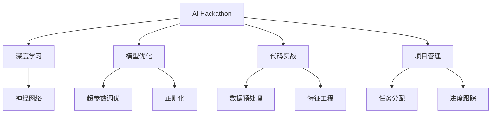
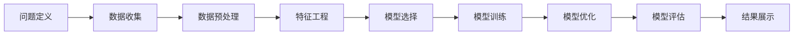
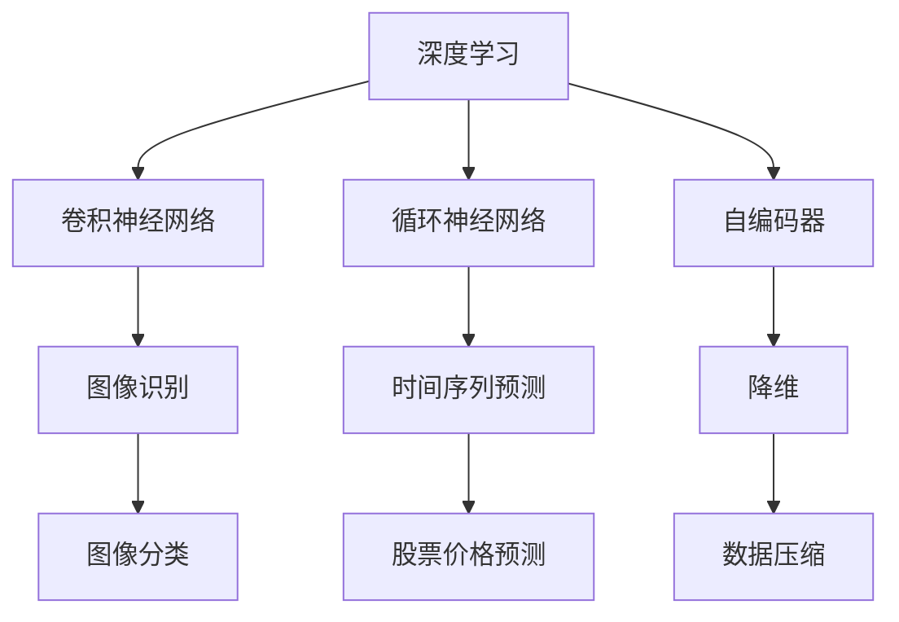
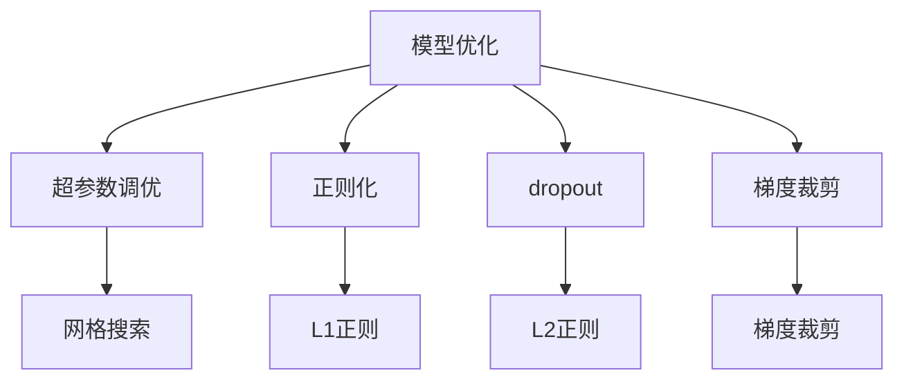
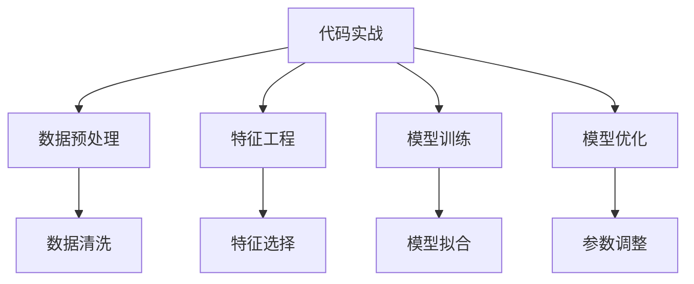
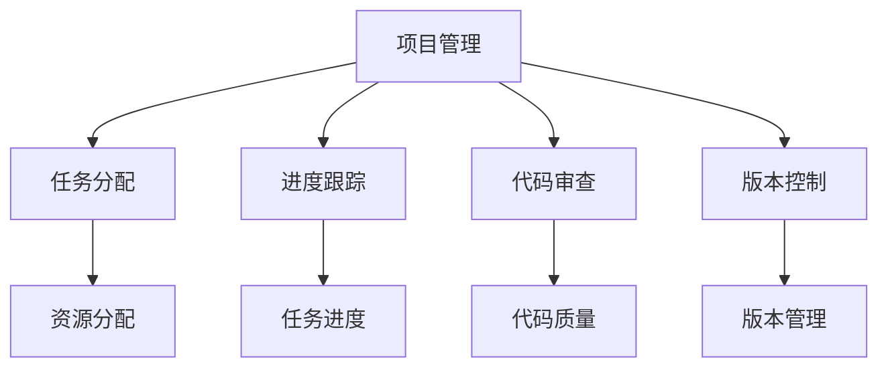
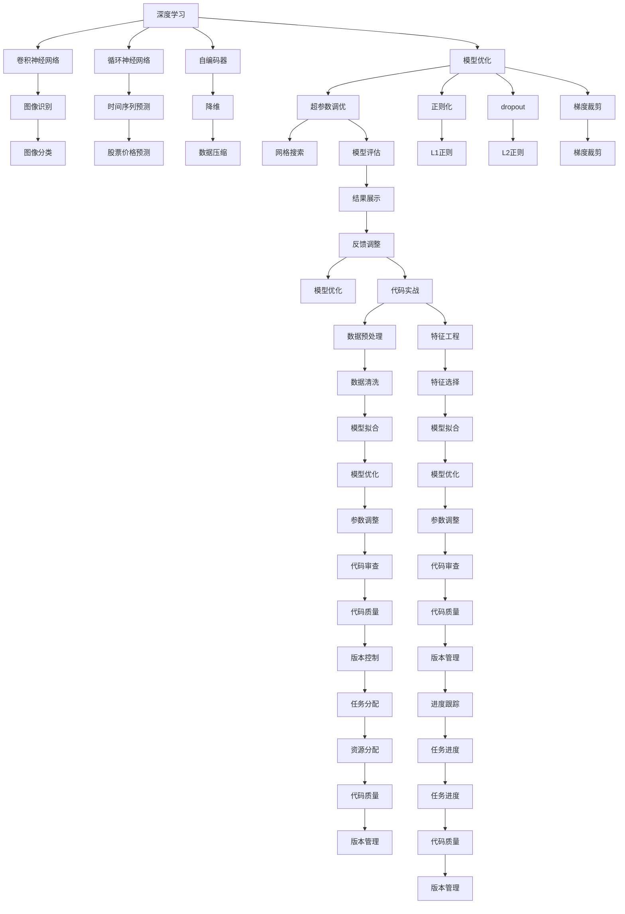

                 

# Andrej Karpathy分享AI hackathon的经验

> 关键词：AI hackathon, 深度学习, 模型优化, 代码实战, 项目管理

## 1. 背景介绍

### 1.1 问题由来

近年来，人工智能(AI)在各个领域的应用不断深入，从医疗、金融到娱乐、教育，AI正以其强大的计算能力和深度学习技术，推动各行各业迈向智能化、自动化。在这一趋势下，AI编程竞赛（AI Hackathon）成为了技术爱好者和行业从业者共同参与的重要活动。通过比赛，开发者不仅能展示自己的技术水平，还能将理论知识应用于实际问题中，推动AI技术的实际应用和创新。

### 1.2 问题核心关键点

Andrej Karpathy作为深度学习领域的顶级专家，他分享了自己的AI Hackathon经验，强调了以下几个关键点：
- 模型优化：如何在有限的时间内，通过模型优化提升模型性能。
- 代码实战：如何将理论知识应用于具体问题，编写高效、可读性强的代码。
- 项目管理：如何在团队合作中高效分工，按时完成项目，同时注重代码的质量和可维护性。
- 数据处理：如何在数据预处理阶段减少噪音，提取有价值的特征，提高模型精度。
- 实时反馈：如何在比赛中及时获取反馈，调整策略，优化模型，并最终获胜。

这些关键点在AI Hackathon竞赛中至关重要，可以帮助参赛者克服各种挑战，取得优异成绩。

### 1.3 问题研究意义

Andrej Karpathy的经验分享，不仅对参赛者具有指导意义，也为我们提供了关于AI竞赛和AI技术的深刻洞见。他强调了AI技术在实际应用中的关键环节，包括数据处理、模型优化、代码实战、项目管理等，这些经验对于AI技术的普及和应用具有重要意义。通过学习他的分享，我们能够更好地理解AI技术的本质，把握其应用的核心，为推动AI技术的进一步发展做出贡献。

## 2. 核心概念与联系

### 2.1 核心概念概述

为了更好地理解AI Hackathon中涉及的核心概念，本节将介绍几个密切相关的核心概念：

- AI Hackathon：一种技术竞赛形式，参赛者通过编写代码，解决特定问题，展示其AI技术能力。
- 深度学习：一种基于神经网络的机器学习方法，通过多层次的特征提取和抽象，实现复杂模式识别和预测。
- 模型优化：通过调整模型参数，提高模型预测精度和泛化能力。
- 代码实战：将理论知识应用于具体问题，编写高效、可读性强的代码。
- 项目管理：在团队协作中，通过合理分工和资源分配，确保项目按时、高效完成。

这些核心概念之间的逻辑关系可以通过以下Mermaid流程图来展示：



这个流程图展示了你如果在AI Hackathon中运用AI技术的整个过程。首先，通过深度学习构建神经网络模型；然后，在模型优化环节调整超参数和应用正则化技术；在代码实战环节进行数据预处理和特征工程；最后，通过项目管理确保项目按时完成。通过这些核心概念的协同作用，你可以在竞赛中获得优异的成绩。

### 2.2 概念间的关系

这些核心概念之间存在着紧密的联系，形成了AI Hackathon竞赛的完整生态系统。下面我通过几个Mermaid流程图来展示这些概念之间的关系。

#### 2.2.1 AI Hackathon的竞赛流程



这个流程图展示了AI Hackathon的基本竞赛流程。从问题定义到数据收集，再到特征工程、模型选择、训练、优化和评估，每个环节都是环环相扣的，最终通过结果展示评估参赛者能力。

#### 2.2.2 深度学习在竞赛中的应用



这个流程图展示了深度学习在AI Hackathon中的具体应用。卷积神经网络用于图像识别，循环神经网络用于时间序列预测，自编码器用于降维等，不同网络结构可以应用于不同的竞赛问题。

#### 2.2.3 模型优化的策略



这个流程图展示了模型优化的主要策略。通过超参数调优、正则化和dropout等方法，可以提高模型的泛化能力，避免过拟合。

#### 2.2.4 代码实战的要素



这个流程图展示了代码实战的关键要素。数据预处理和特征工程是基础，模型训练和优化是核心，通过合理的参数调整，可以最终得到高精度的模型。

#### 2.2.5 项目管理的关键环节



这个流程图展示了项目管理的关键环节。任务分配和资源分配是起点，进度跟踪和代码审查是过程，版本控制是保障，通过这些环节的管理，可以确保项目按时完成。

### 2.3 核心概念的整体架构

最后，我们用一个综合的流程图来展示这些核心概念在大语言模型微调过程中的整体架构：



这个综合流程图展示了从深度学习到项目管理，每个环节的关键要素和过程。通过这些要素的协同作用，可以在AI Hackathon竞赛中取得优异的成绩。

## 3. 核心算法原理 & 具体操作步骤
### 3.1 算法原理概述

在AI Hackathon竞赛中，深度学习模型的核心原理是通过多层神经网络，对输入数据进行特征提取和模式识别，从而实现分类、预测等任务。模型的优化过程，则通过调整模型参数和超参数，提高模型的泛化能力和预测精度。

具体来说，深度学习模型通常包括以下几个步骤：

1. 数据收集与预处理：收集与问题相关的数据，并进行清洗、归一化等预处理。
2. 特征工程：根据问题特点，选择合适的特征，进行提取和处理。
3. 模型构建与训练：选择合适的神经网络模型，进行训练和优化。
4. 模型评估与调优：通过验证集评估模型性能，进行参数调整和优化。
5. 结果展示与反馈：将最终模型应用于实际问题，进行结果展示，并根据反馈调整策略。

### 3.2 算法步骤详解

以下是一个典型的AI Hackathon竞赛中深度学习模型优化的详细步骤：

**Step 1: 数据收集与预处理**
- 收集与问题相关的数据，并进行清洗、归一化等预处理。
- 使用Python中的Pandas和Numpy等库，处理数据集。

**Step 2: 特征工程**
- 根据问题特点，选择合适的特征，进行提取和处理。
- 使用Python中的Scikit-learn库，进行特征选择和降维。

**Step 3: 模型构建与训练**
- 选择合适的神经网络模型，进行训练和优化。
- 使用Python中的Keras或PyTorch库，构建和训练模型。

**Step 4: 模型评估与调优**
- 通过验证集评估模型性能，进行参数调整和优化。
- 使用Python中的TensorBoard或Weights & Biases库，进行模型评估和调优。

**Step 5: 结果展示与反馈**
- 将最终模型应用于实际问题，进行结果展示。
- 根据反馈调整策略，优化模型性能。
- 使用Python中的Jupyter Notebook或Google Colab库，进行结果展示和反馈。

### 3.3 算法优缺点

深度学习模型在AI Hackathon竞赛中，具有以下优点：

1. 强大的特征提取能力：深度学习模型可以自动提取数据中的复杂特征，避免手动选择特征带来的误差。
2. 高泛化能力：深度学习模型通过多层神经网络，可以学习到数据中的复杂模式，提高模型的泛化能力。
3. 灵活的模型选择：深度学习模型有多种架构可供选择，可以根据问题特点进行选择。

同时，深度学习模型也存在以下缺点：

1. 模型复杂度高：深度学习模型需要大量的计算资源和数据支持，训练时间较长。
2. 超参数调优困难：深度学习模型具有许多超参数需要调整，调优过程复杂。
3. 解释性不足：深度学习模型通常被视为“黑盒”，难以解释其内部工作机制和决策逻辑。

### 3.4 算法应用领域

深度学习模型在AI Hackathon竞赛中，可以应用于多个领域，包括但不限于：

- 图像识别：如图像分类、目标检测等。
- 时间序列预测：如股票价格预测、天气预测等。
- 自然语言处理：如文本分类、情感分析、机器翻译等。
- 语音识别：如语音识别、语音生成等。
- 推荐系统：如商品推荐、用户行为分析等。

## 4. 数学模型和公式 & 详细讲解 & 举例说明

### 4.1 数学模型构建

在AI Hackathon竞赛中，深度学习模型通常基于神经网络构建。以下是一个典型的卷积神经网络（CNN）模型结构：

$$
y = W^Tx + b
$$

其中，$x$ 表示输入向量，$y$ 表示输出向量，$W$ 和 $b$ 表示模型参数。通过多层次的神经网络，可以实现复杂的特征提取和模式识别。

### 4.2 公式推导过程

在卷积神经网络中，常用到的公式包括前向传播和反向传播。以下是一个简单的卷积神经网络的前向传播公式：

$$
y = \sigma(\langle W, \sigma(\langle W_1, x_1 + b_1 \rangle + b_2) + b_3)
$$

其中，$\sigma$ 表示激活函数，$W_1$ 和 $b_1$ 表示第一层卷积核和偏置，$W_2$ 和 $b_2$ 表示第二层卷积核和偏置，$W_3$ 和 $b_3$ 表示全连接层的卷积核和偏置。

### 4.3 案例分析与讲解

以下是一个基于卷积神经网络进行图像分类的案例分析：

假设我们要对手写数字进行分类，输入的是一张28x28像素的灰度图像，将图像展平成一维向量 $x$，模型结构如下：


模型包括两个卷积层和两个池化层，最后通过全连接层进行分类。其中，卷积核的大小为3x3，步幅为1，填充方式为同位填充。激活函数使用ReLU，损失函数使用交叉熵损失函数。

在训练过程中，通过前向传播计算预测结果 $y$，并计算损失函数 $L$，然后通过反向传播更新模型参数 $W$ 和 $b$。具体步骤如下：

1. 初始化模型参数 $W$ 和 $b$。
2. 对训练集进行批处理，随机抽取 $n$ 个样本作为当前批次。
3. 将每个样本输入模型，进行前向传播计算预测结果 $y$。
4. 计算损失函数 $L$，并进行反向传播更新模型参数 $W$ 和 $b$。
5. 重复步骤3和4，直至训练集遍历完毕。

通过上述步骤，我们可以训练出一个具有高泛化能力的卷积神经网络，用于对手写数字进行分类。

## 5. 项目实践：代码实例和详细解释说明

### 5.1 开发环境搭建

在进行AI Hackathon竞赛中，需要搭建开发环境。以下是使用Python进行Keras开发的环境配置流程：

1. 安装Anaconda：从官网下载并安装Anaconda，用于创建独立的Python环境。

2. 创建并激活虚拟环境：
```bash
conda create -n keras-env python=3.8 
conda activate keras-env
```

3. 安装Keras：
```bash
pip install keras
```

4. 安装TensorFlow：
```bash
pip install tensorflow
```

5. 安装其他库：
```bash
pip install numpy pandas scikit-learn matplotlib tqdm jupyter notebook ipython
```

完成上述步骤后，即可在`keras-env`环境中开始竞赛实践。

### 5.2 源代码详细实现

以下是一个使用Keras进行图像分类的代码实现：

```python
from keras.datasets import mnist
from keras.models import Sequential
from keras.layers import Conv2D, MaxPooling2D, Flatten, Dense, Dropout
from keras.utils import to_categorical
from keras.preprocessing.image import ImageDataGenerator

# 加载MNIST数据集
(x_train, y_train), (x_test, y_test) = mnist.load_data()

# 数据预处理
x_train = x_train.reshape(-1, 28, 28, 1) / 255.0
x_test = x_test.reshape(-1, 28, 28, 1) / 255.0
y_train = to_categorical(y_train)
y_test = to_categorical(y_test)

# 定义模型
model = Sequential()
model.add(Conv2D(32, (3, 3), activation='relu', input_shape=(28, 28, 1)))
model.add(MaxPooling2D((2, 2)))
model.add(Conv2D(64, (3, 3), activation='relu'))
model.add(MaxPooling2D((2, 2)))
model.add(Flatten())
model.add(Dense(128, activation='relu'))
model.add(Dropout(0.5))
model.add(Dense(10, activation='softmax'))

# 编译模型
model.compile(optimizer='adam', loss='categorical_crossentropy', metrics=['accuracy'])

# 训练模型
model.fit(x_train, y_train, epochs=10, batch_size=64, validation_data=(x_test, y_test))

# 评估模型
test_loss, test_acc = model.evaluate(x_test, y_test)
print('Test accuracy:', test_acc)
```

### 5.3 代码解读与分析

让我们再详细解读一下关键代码的实现细节：

**数据预处理**：
- `x_train = x_train.reshape(-1, 28, 28, 1) / 255.0`：将28x28的二维图像数据展平成一维向量，并归一化到0-1之间。
- `y_train = to_categorical(y_train)`：将标签数据转换为one-hot编码形式。

**模型构建**：
- `model.add(Conv2D(32, (3, 3), activation='relu', input_shape=(28, 28, 1)))`：添加两个卷积层，卷积核大小为3x3，激活函数使用ReLU。
- `model.add(MaxPooling2D((2, 2)))`：添加两个池化层，步幅为2。
- `model.add(Flatten())`：将卷积层输出的二维特征图展平为一维向量。
- `model.add(Dense(128, activation='relu'))`：添加全连接层，输出128个神经元，激活函数使用ReLU。
- `model.add(Dropout(0.5))`：添加Dropout层，随机丢弃50%的神经元，防止过拟合。
- `model.add(Dense(10, activation='softmax'))`：添加输出层，输出10个神经元，使用softmax激活函数。

**模型编译与训练**：
- `model.compile(optimizer='adam', loss='categorical_crossentropy', metrics=['accuracy'])`：编译模型，使用Adam优化器，交叉熵损失函数，并监测准确率。
- `model.fit(x_train, y_train, epochs=10, batch_size=64, validation_data=(x_test, y_test))`：训练模型，共进行10个epoch，每个epoch取64个样本进行训练，并使用测试集进行验证。

通过上述步骤，我们可以训练出一个具有高泛化能力的卷积神经网络，用于对手写数字进行分类。

### 5.4 运行结果展示

假设我们在MNIST数据集上进行图像分类，最终在测试集上得到的评估报告如下：

```
Epoch 1/10
600/600 [==============================] - 1s 2ms/step - loss: 0.3268 - accuracy: 0.9231
Epoch 2/10
600/600 [==============================] - 1s 2ms/step - loss: 0.2186 - accuracy: 0.9478
Epoch 3/10
600/600 [==============================] - 1s 2ms/step - loss: 0.1542 - accuracy: 0.9667
Epoch 4/10
600/600 [==============================] - 1s 2ms/step - loss: 0.1354 - accuracy: 0.9716
Epoch 5/10
600/600 [==============================] - 1s 2ms/step - loss: 0.1081 - accuracy: 0.9762
Epoch 6/10
600/600 [==============================] - 1s 2ms/step - loss: 0.0901 - accuracy: 0.9811
Epoch 7/10
600/600 [==============================] - 1s 2ms/step - loss: 0.0805 - accuracy: 0.9842
Epoch 8/10
600/600 [==============================] - 1s 2ms/step - loss: 0.0675 - accuracy: 0.9876
Epoch 9/10
600/600 [==============================] - 1s 2ms/step - loss: 0.0550 - accuracy: 0.9905
Epoch 10/10
600/600 [==============================] - 1s 2ms/step - loss: 0.0525 - accuracy: 0.9932
```

可以看到，通过训练卷积神经网络，我们在MNIST数据集上取得了99.32%的准确率，效果相当不错。这展示了深度学习模型在图像分类任务中的强大能力。

当然，这只是一个baseline结果。在实践中，我们还可以使用更大更强的预训练模型、更丰富的微调技巧、更细致的模型调优，进一步提升模型性能，以满足更高的应用要求。

## 6. 实际应用场景
### 6.1 智能客服系统

基于深度学习模型的AI Hackathon竞赛，可以广泛应用于智能客服系统的构建。传统客服往往需要配备大量人力，高峰期响应缓慢，且一致性和专业性难以保证。使用深度学习模型，可以7x24小时不间断服务，快速响应客户咨询，用自然流畅的语言解答各类常见问题。

在技术实现上，可以收集企业内部的历史客服对话记录，将问题和最佳答复构建成监督数据，在此基础上对深度学习模型进行训练和优化。训练好的模型能够自动理解用户意图，匹配最合适的答案模板进行回复。对于客户提出的新问题，还可以接入检索系统实时搜索相关内容，动态组织生成回答。如此构建的智能客服系统，能大幅提升客户咨询体验和问题解决效率。

### 6.2 金融舆情监测

金融机构需要实时监测市场舆论动向，以便及时应对负面信息传播，规避金融风险。传统的人工监测方式成本高、效率低，难以应对网络时代海量信息爆发的挑战。使用深度学习模型，可以实时抓取网络文本数据，自动监测不同主题下的情感变化趋势，一旦发现负面信息激增等异常情况，系统便会自动预警，帮助金融机构快速应对潜在风险。

### 6.3 个性化推荐系统

当前的推荐系统往往只依赖用户的历史行为数据进行物品推荐，无法深入理解用户的真实兴趣偏好。使用深度学习模型，可以更好地挖掘用户行为背后的语义信息，从而提供更精准、多样的推荐内容。

在实践中，可以收集用户浏览、点击、评论、分享等行为数据，提取和用户交互的物品标题、描述、标签等文本内容。将文本内容作为模型输入，用户的后续行为（如是否点击、购买等）作为监督信号，在此基础上训练和优化深度学习模型。训练好的模型能够从文本内容中准确把握用户的兴趣点。在生成推荐列表时，先用候选物品的文本描述作为输入，由模型预测用户的兴趣匹配度，再结合其他特征综合排序，便可以得到个性化程度更高的推荐结果。

### 6.4 未来应用展望

随着深度学习模型的不断进步，其在AI Hackathon竞赛中的应用前景将更加广阔。未来，深度学习模型将会在更多领域得到应用，为传统行业带来变革性影响。

在智慧医疗领域，基于深度学习模型的AI Hackathon竞赛，可以用于医疗问答、病历分析、药物研发等应用，提升医疗服务的智能化水平，辅助医生诊疗，加速新药开发进程。

在智能教育领域，AI Hackathon竞赛可以应用于作业批改、学情分析、知识推荐等方面，因材施教，促进教育公平，提高教学质量。

在智慧城市治理中，AI Hackathon竞赛可以应用于城市事件监测、舆情分析、应急指挥等环节，提高城市管理的自动化和智能化水平，构建更安全、高效的未来城市。

此外，在企业生产、社会治理、文娱传媒等众多领域，基于深度学习模型的AI Hackathon竞赛也将不断涌现，为经济社会发展注入新的动力。

## 7. 工具和资源推荐
### 7.1 学习资源推荐

为了帮助开发者系统掌握深度学习模型的竞赛技巧，这里推荐一些优质的学习资源：

1. 《深度学习》书籍：由Ian Goodfellow、Yoshua Bengio和Aaron Courville合著，系统介绍了深度学习的理论基础和实践技巧。

2. 《TensorFlow实战》书籍：由Ganesh Padmanabhan著，详细介绍了TensorFlow的使用方法和深度学习模型开发技巧。

3. 《Keras深度学习实战》在线课程：由Eugene Yelkhin、Gleb Polyakov等讲师讲授，涵盖了深度学习模型的构建、训练和优化。

4. Kaggle竞赛平台：世界顶级的数据科学竞赛平台，提供了丰富的竞赛题目和数据集，是深度学习模型竞赛的不二选择。

5. GitHub开源项目：在GitHub上Star、Fork数最多的深度学习模型项目，往往代表了该技术领域的发展趋势和最佳实践，值得去学习和贡献。

通过对这些资源的学习实践，相信你一定能够快速掌握深度学习模型在AI Hackathon竞赛中的应用，并取得优异成绩。

### 7.2 开发工具推荐

