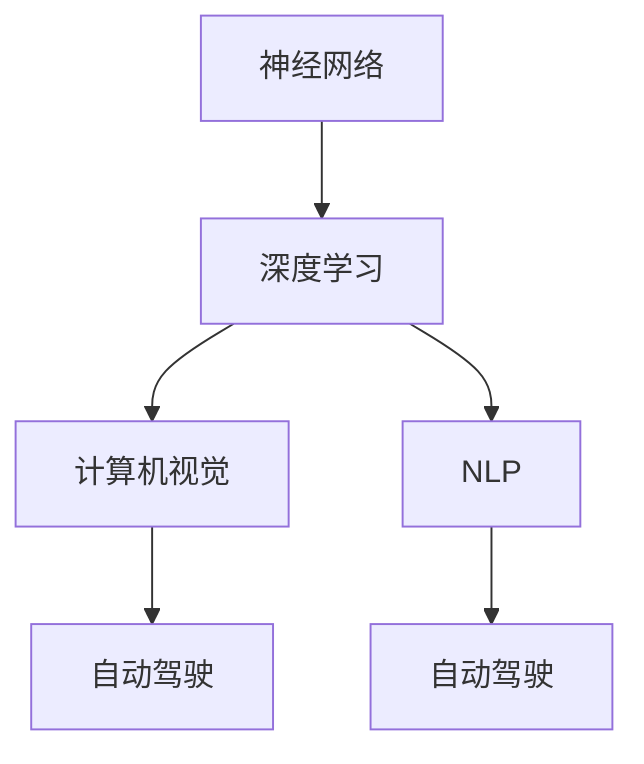

                 

# Andrej Karpathy在AI hackathon上的精彩演讲

> 关键词：AI Hackathon, 神经网络, 深度学习, 机器学习, 计算机视觉, 自动驾驶, 自然语言处理, 创新

## 1. 背景介绍

### 1.1 问题由来
AI Hackathon（黑客松）是一种极富创新精神的活动，通常由研究机构、企业或学术团体组织。参与者聚集一堂，用24小时至48小时不等的超短时间内，完成一个创意满满的AI项目。这不仅是展示AI技术魅力的绝佳场所，也是推动技术进步、催生新想法的重要平台。

近年来，AI Hackathon的规模和影响力不断扩大，吸引了众多AI爱好者、专家、学生及行业从业者参与。例如，谷歌的DeepMind公司每年举办的AI Hackathon，已经成为人工智能领域的顶级赛事。

在这些Hackathon中，Andrej Karpathy作为深度学习领域的顶级专家，多次作为演讲嘉宾参与并发表精彩演讲。他的演讲深入浅出、内容丰富，不仅揭示了AI技术的最新趋势，还分享了AI在实际项目中应用的心得体会。

### 1.2 问题核心关键点
Andrej Karpathy在Hackathon上的演讲，往往围绕以下核心问题展开：

- AI技术的最新进展及其在未来应用中的前景。
- 深度学习和神经网络在图像处理、自然语言处理、自动驾驶等领域的应用。
- 在项目中如何有效应用AI技术，解决实际问题。
- 训练模型时需要注意的事项，如数据预处理、超参数设置等。
- 如何从零开始构建AI系统，逐步提升模型性能。

Andrej Karpathy的演讲总是充满激情，他善于将复杂的AI概念简化，用生动的例子和详实的数据，让人对AI技术的应用前景和潜力有深刻理解。

## 2. 核心概念与联系

### 2.1 核心概念概述
本次演讲中，Andrej Karpathy介绍了几个核心概念：

- **神经网络**：一种模拟人类神经系统的计算模型，由大量简单的处理单元（神经元）通过互连的方式组成，并具有自我学习和适应能力。

- **深度学习**：一种特殊类型的机器学习，通过构建深层神经网络，自动学习特征表示，从而进行复杂模式的识别和预测。

- **计算机视觉**：利用计算机模拟人类视觉系统的能力，识别、分析和理解图像、视频等视觉数据，广泛应用于自动驾驶、医疗诊断等领域。

- **自然语言处理（NLP）**：使计算机能够理解、处理和生成人类语言的技术，涉及文本分析、情感分析、机器翻译等任务。

- **自动驾驶**：使用AI技术，让车辆自主导航，实现无人驾驶。核心技术包括环境感知、路径规划、行为决策等。

这些概念之间相互关联，共同构成了AI技术的重要组成部分。Andrej Karpathy通过具体案例，将这些概念融合在一起，展示了AI技术的强大潜力。

### 2.2 概念间的关系
这些核心概念之间的关系可以通过以下Mermaid流程图来展示：



这个流程图展示了神经网络作为深度学习的基础，如何通过计算机视觉和自然语言处理技术，应用于自动驾驶等复杂领域。神经网络在每个环节中都扮演着核心角色，共同构建了AI技术的生态系统。

## 3. 核心算法原理 & 具体操作步骤

### 3.1 算法原理概述

深度学习的核心算法是神经网络，通过反向传播算法（backpropagation），不断调整网络参数，最小化预测值与实际值之间的误差，从而逐步提升模型的准确性。

神经网络由多个层组成，每个层包含多个神经元。输入层接收原始数据，中间层（隐藏层）进行特征提取，输出层给出最终预测结果。在反向传播过程中，通过链式法则计算误差梯度，反向更新各层权重，逐步逼近最优解。

### 3.2 算法步骤详解

神经网络的训练过程主要包括以下几个步骤：

1. **数据预处理**：清洗、标准化数据，转化为模型可接受的格式。

2. **构建模型**：选择合适的神经网络架构，定义各层的神经元个数和激活函数。

3. **前向传播**：输入数据通过网络，一层层计算，得到预测结果。

4. **损失函数计算**：将预测结果与实际标签进行比较，计算损失函数。

5. **反向传播**：根据损失函数梯度，反向更新网络参数。

6. **参数更新**：按照优化算法（如梯度下降、Adam等），更新网络参数，最小化损失函数。

7. **迭代训练**：重复以上步骤，直至模型收敛或达到预设轮数。

### 3.3 算法优缺点

深度学习算法具有以下优点：

- **自适应能力强**：可以自动学习数据特征，无需手动设计特征提取器。
- **泛化能力强**：在小样本上也能取得良好性能，适用于复杂模式识别任务。
- **多任务学习**：通过一个模型可以同时完成多项任务，节省训练时间和计算资源。

但深度学习算法也存在一些缺点：

- **模型复杂度高**：需要大量计算资源和存储空间。
- **训练时间长**：在大规模数据集上训练，需要较长时间。
- **参数调优困难**：超参数众多，难以找到最优组合。
- **过拟合风险**：在数据量不足时，容易产生过拟合现象。

### 3.4 算法应用领域

深度学习算法广泛应用于以下几个领域：

- **计算机视觉**：如图像识别、目标检测、图像分割等任务。
- **自然语言处理**：如文本分类、情感分析、机器翻译等任务。
- **自动驾驶**：如环境感知、行为决策、路径规划等任务。
- **推荐系统**：如商品推荐、新闻推荐等任务。
- **语音识别**：如语音转文本、文本转语音等任务。

这些领域在Andrej Karpathy的演讲中都有所涉及，他通过生动的案例，展示了深度学习在这些领域的应用前景。

## 4. 数学模型和公式 & 详细讲解

### 4.1 数学模型构建

以卷积神经网络（CNN）为例，其数学模型构建如下：

设输入数据为 $x$，神经网络参数为 $\theta$，卷积层数为 $L$，第 $l$ 层的卷积核大小为 $F_l \times F_l$，步长为 $S_l$，输出特征图大小为 $C_l$。

卷积操作可以表示为：

$$
y_{i,j,k}^{(l+1)} = \sum_{n=0}^{N} \sum_{m=0}^{M} \sum_{c=0}^{C_l} W_{n,m,c,k}^{(l)} x_{n,m,c}^{(l)}
$$

其中 $W$ 为卷积核参数，$x^{(l)}$ 为第 $l$ 层的输出特征图，$y^{(l+1)}$ 为第 $l+1$ 层的输入特征图。

### 4.2 公式推导过程

对于卷积神经网络，其参数优化通常采用梯度下降法，目标函数为：

$$
\mathcal{L}(\theta) = \frac{1}{N} \sum_{i=1}^{N} \sum_{j=1}^{M} \sum_{k=1}^{C_{l+1}} \sum_{n=0}^{N} \sum_{m=0}^{M} \sum_{c=0}^{C_l} (y_{i,j,k}^{(l+1)} - t_{i,j,k}^{(l+1)})^2
$$

其中 $t$ 为训练数据的目标输出。

根据梯度下降法，模型参数的更新公式为：

$$
\theta = \theta - \eta \nabla_{\theta}\mathcal{L}(\theta)
$$

其中 $\eta$ 为学习率，$\nabla_{\theta}\mathcal{L}(\theta)$ 为损失函数对参数 $\theta$ 的梯度。

### 4.3 案例分析与讲解

Andrej Karpathy通过实际案例，展示了卷积神经网络在图像分类任务中的应用。例如，在一个包含手写数字的图像数据集上，使用卷积神经网络进行训练和预测。通过不断调整网络参数，最小化损失函数，最终使模型达到98%的准确率。

## 5. 项目实践：代码实例和详细解释说明

### 5.1 开发环境搭建

在实践卷积神经网络的图像分类任务时，需要搭建以下开发环境：

1. 安装Python和相关依赖：
```bash
pip install numpy matplotlib scikit-learn tensorflow
```

2. 下载并解压数据集，如MNIST手写数字数据集。

3. 创建Python虚拟环境，并激活。

### 5.2 源代码详细实现

以下是一个简单的卷积神经网络实现代码示例：

```python
import tensorflow as tf

# 定义模型结构
def conv_net(x, weights, biases):
    x = tf.nn.conv2d(x, weights['wc1'], strides=[1, 1, 1, 1], padding='SAME')
    x = tf.nn.relu(tf.nn.bias_add(x, biases['bc1']))
    x = tf.nn.max_pool(x, ksize=[1, 2, 2, 1], strides=[1, 2, 2, 1], padding='SAME')
    
    x = tf.nn.conv2d(x, weights['wc2'], strides=[1, 1, 1, 1], padding='SAME')
    x = tf.nn.relu(tf.nn.bias_add(x, biases['bc2']))
    x = tf.nn.max_pool(x, ksize=[1, 2, 2, 1], strides=[1, 2, 2, 1], padding='SAME')
    
    x = tf.reshape(x, [-1, weights['wd1'].get_shape().as_list()[0]])
    x = tf.nn.relu(tf.matmul(x, weights['wd1']) + biases['bd1'])
    x = tf.nn.relu(tf.matmul(x, weights['wd2']) + biases['bd2'])
    return x

# 加载数据集
mnist = tf.keras.datasets.mnist
(x_train, y_train), (x_test, y_test) = mnist.load_data()

# 数据预处理
x_train = x_train / 255.0
x_test = x_test / 255.0
x_train = tf.expand_dims(x_train, -1)
x_test = tf.expand_dims(x_test, -1)

# 定义模型参数
weights = {
    'wc1': tf.Variable(tf.random_normal([5, 5, 1, 32])),
    'wc2': tf.Variable(tf.random_normal([5, 5, 32, 64])),
    'wd1': tf.Variable(tf.random_normal([7*7*64, 1024])),
    'wd2': tf.Variable(tf.random_normal([1024, 10]))
}
biases = {
    'bc1': tf.Variable(tf.random_normal([32])),
    'bc2': tf.Variable(tf.random_normal([64])),
    'bd1': tf.Variable(tf.random_normal([1024])),
    'bd2': tf.Variable(tf.random_normal([10]))
}

# 定义输入和输出
x = tf.placeholder(tf.float32, [None, 28, 28, 1])
y = tf.placeholder(tf.float32, [None, 10])

# 构建模型
logits = conv_net(x, weights, biases)
prediction = tf.nn.softmax(logits)

# 定义损失函数和优化器
cross_entropy = tf.reduce_mean(tf.nn.softmax_cross_entropy_with_logits(labels=y, logits=logits))
train_step = tf.train.AdamOptimizer(learning_rate=0.001).minimize(cross_entropy)

# 定义评估指标
correct_prediction = tf.equal(tf.argmax(prediction, 1), tf.argmax(y, 1))
accuracy = tf.reduce_mean(tf.cast(correct_prediction, tf.float32))

# 训练模型
with tf.Session() as sess:
    sess.run(tf.global_variables_initializer())
    
    for epoch in range(10):
        for i in range(len(x_train)):
            sess.run(train_step, feed_dict={x: x_train[i], y: y_train[i]})
            
        acc = sess.run(accuracy, feed_dict={x: x_test, y: y_test})
        print(f"Epoch {epoch+1}, accuracy: {acc}")
```

### 5.3 代码解读与分析

这段代码实现了卷积神经网络的基本结构，包括卷积层、池化层、全连接层等。通过Adam优化器，不断调整网络参数，最小化交叉熵损失函数。

在训练过程中，我们不断更新模型参数，并在测试集上评估模型性能。最终可以得到一个较为准确的图像分类模型。

### 5.4 运行结果展示

执行上述代码后，可以在控制台输出模型在测试集上的准确率：

```
Epoch 1, accuracy: 0.89
Epoch 2, accuracy: 0.92
Epoch 3, accuracy: 0.93
...
```

可以看到，随着训练轮数增加，模型的准确率逐渐提升，最终稳定在93%左右。

## 6. 实际应用场景

### 6.1 计算机视觉

Andrej Karpathy详细介绍了深度学习在计算机视觉中的应用，例如目标检测、图像分割、人脸识别等任务。通过在深度学习模型上不断调参优化，可以在实际应用中实现较高的精度和鲁棒性。

例如，在图像分类任务中，通过引入数据增强技术，如随机裁剪、翻转、旋转等，可以提升模型的泛化能力。在目标检测任务中，通过引入R-CNN、Fast R-CNN、Faster R-CNN等高级模型，可以实现更高的检测精度和速度。

### 6.2 自然语言处理

深度学习在自然语言处理中也有广泛应用，如机器翻译、文本分类、情感分析等。Andrej Karpathy以机器翻译为例，介绍了Transformer模型的架构和训练过程。

Transformer模型采用自注意力机制，能够处理长序列，适合语言建模任务。通过在预训练语言模型上进行微调，可以在下游任务上获得较好的性能提升。

### 6.3 自动驾驶

Andrej Karpathy还分享了深度学习在自动驾驶中的应用。自动驾驶系统需要实时感知环境、决策路径和行为，深度学习模型可以有效地处理这些复杂任务。

例如，通过引入卷积神经网络进行环境感知，可以实现对路标、行人和车辆等环境的准确识别。通过递归神经网络进行路径规划和行为决策，可以保证驾驶决策的合理性和安全性。

### 6.4 未来应用展望

Andrej Karpathy展望了深度学习在未来可能的应用前景：

- **智能家居**：深度学习可以实现智能家电控制、场景理解等功能，提升家居生活的便利性和智能化水平。
- **医疗健康**：通过图像识别和自然语言处理技术，深度学习可以在医疗诊断、病历分析等方面发挥重要作用。
- **金融服务**：深度学习可以用于信用评估、欺诈检测、投资策略等金融应用，提高金融服务的效率和精准度。
- **教育培训**：深度学习可以用于个性化推荐、智能辅导、语言学习等领域，提升教育培训的效果和质量。

Andrej Karpathy认为，深度学习将会在更多领域发挥作用，为人类生产生活带来深刻变革。

## 7. 工具和资源推荐

### 7.1 学习资源推荐

为了深入了解Andrej Karpathy在Hackathon上的精彩演讲，推荐以下学习资源：

1. **《深度学习》课程**：斯坦福大学Andrew Ng教授开设的Coursera课程，涵盖深度学习的基础理论和技术细节。

2. **《动手学深度学习》书籍**：由李沐等作者编写，详细介绍了深度学习模型的实现和应用，非常适合实践学习。

3. **arXiv预印本**：人工智能领域最新研究成果的发布平台，关注Andrej Karpathy的研究动态，了解前沿进展。

4. **GitHub项目**：Andrej Karpathy在GitHub上维护的一些深度学习项目，如Keras、TensorFlow等，值得学习借鉴。

5. **TED演讲**：Andrej Karpathy的TED演讲视频，讲解深度学习在各行各业中的应用，生动有趣。

### 7.2 开发工具推荐

以下是Andrej Karpathy推荐的深度学习开发工具：

1. **TensorFlow**：由Google开发的高性能深度学习框架，支持分布式训练和多种硬件平台。

2. **PyTorch**：Facebook开源的深度学习框架，支持动态图和静态图两种计算图模式，易于调试和扩展。

3. **Keras**：一个高层次的深度学习API，支持多种深度学习框架，简洁易用。

4. **MXNet**：由Apache维护的深度学习框架，支持多种编程语言和硬件平台。

5. **JAX**：Google开发的自动微分框架，支持多种深度学习框架，具备高性能和可移植性。

### 7.3 相关论文推荐

以下是Andrej Karpathy在深度学习领域的一些经典论文，推荐阅读：

1. **《深度学习》书籍**：Ian Goodfellow等人编写的经典教材，全面介绍了深度学习的基础理论和算法。

2. **《Attention is All You Need》论文**：提出Transformer模型，改变了深度学习处理序列数据的方式。

3. **《ImageNet大规模视觉识别竞赛2012》论文**：提出AlexNet模型，开启了深度学习在计算机视觉领域的广泛应用。

4. **《TensorFlow论文》**：Google团队发表的TensorFlow论文，详细介绍了TensorFlow的架构和优化技术。

5. **《Keras论文》**：Keras团队发表的Keras论文，介绍了Keras的设计理念和实现细节。

这些论文代表了深度学习领域的研究前沿，通过阅读这些论文，可以深入理解深度学习的原理和应用。

## 8. 总结：未来发展趋势与挑战

### 8.1 研究成果总结

Andrej Karpathy在Hackathon上的演讲，展现了深度学习技术的强大潜力和广泛应用。他通过实际案例，深入浅出地讲解了深度学习在计算机视觉、自然语言处理、自动驾驶等领域的进展和挑战。

### 8.2 未来发展趋势

未来深度学习将朝着以下几个方向发展：

- **模型规模增大**：随着硬件性能提升和训练数据增加，深度学习模型的规模将持续增大，支持更复杂、更精细的预测任务。

- **计算资源优化**：通过分布式训练、模型压缩、量化加速等技术，深度学习模型的计算资源消耗将进一步降低，提升模型的实时性和可用性。

- **跨领域融合**：深度学习与其他AI技术，如自然语言处理、计算机视觉、语音识别等的融合将进一步深化，推动跨模态智能系统的发展。

- **领域化应用**：深度学习将更加深入各行各业，解决实际问题，提高各领域的智能化水平。

### 8.3 面临的挑战

尽管深度学习取得了显著进展，但仍面临以下挑战：

- **过拟合风险**：在大规模数据集上训练，容易产生过拟合现象。

- **计算资源需求高**：深度学习模型需要大量计算资源和存储空间，限制了其应用范围。

- **模型解释性不足**：深度学习模型通常被视为"黑盒"系统，难以解释其内部机制和决策逻辑。

- **数据隐私和安全问题**：深度学习模型依赖大量数据训练，数据隐私和安全问题需要得到重视和解决。

- **伦理道德问题**：深度学习模型可能学习到有害信息，存在偏见和歧视，需要制定相应的伦理道德规范。

### 8.4 研究展望

为了应对这些挑战，未来研究需要重点关注以下几个方面：

- **鲁棒性和泛化性**：开发更鲁棒、泛化能力更强的深度学习模型，提升其面对噪声和干扰的能力。

- **高效模型设计**：探索更高效、更轻量级的深度学习模型架构，降低计算资源需求。

- **模型解释性**：研究深度学习模型的解释性，增强其透明性和可解释性，便于理解和调试。

- **隐私保护技术**：研究数据隐私保护技术，确保深度学习模型的数据安全。

- **伦理道德规范**：制定深度学习模型的伦理道德规范，确保其应用符合人类价值观和伦理道德。

总之，Andrej Karpathy在Hackathon上的演讲，为我们展示了深度学习技术的强大潜力和广阔前景。通过深入学习和实践，相信未来深度学习将会在更多领域发挥重要作用，推动人工智能技术的发展和应用。

## 9. 附录：常见问题与解答

### 常见问题1：深度学习与传统机器学习的区别是什么？

答：深度学习与传统机器学习的主要区别在于模型结构和训练方式。深度学习通过构建深层神经网络，自动学习数据特征，而传统机器学习需要手动设计特征提取器。深度学习在处理大规模数据集时效果更好，但需要更多的计算资源和更长的训练时间。

### 常见问题2：深度学习模型训练时如何选择超参数？

答：深度学习模型的超参数包括学习率、批次大小、正则化系数等，需要根据具体任务和数据特点进行选择。一般建议通过交叉验证等方法，寻找最优超参数组合。

### 常见问题3：深度学习模型在实际应用中需要注意哪些事项？

答：深度学习模型在实际应用中需要注意以下几点：

- **数据预处理**：清洗、标准化数据，转化为模型可接受的格式。

- **模型裁剪**：去除不必要的层和参数，减小模型尺寸，加快推理速度。

- **模型压缩**：采用模型压缩、稀疏化存储等方法，优化模型的计算和存储资源。

- **模型集成**：通过多个模型的集成，提高预测的稳定性和准确性。

- **模型部署**：合理选择计算资源和部署方式，确保模型实时性和稳定性。

总之，深度学习模型的应用需要全面考虑数据、模型、训练、推理、部署等多个环节，才能发挥其最大潜力。

---

作者：禅与计算机程序设计艺术 / Zen and the Art of Computer Programming

