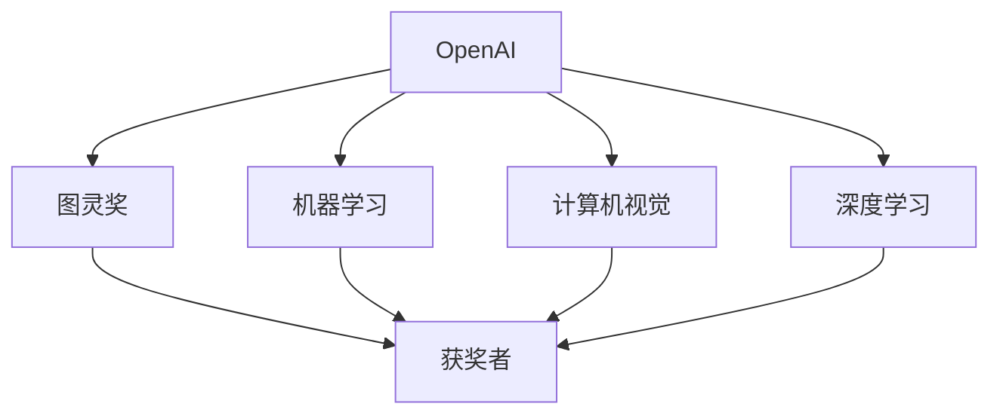

                 

## 1. 背景介绍

### 1.1 问题由来

Andrej Karpathy，斯坦福大学计算机科学系教授，曾获得计算机图灵奖，是人工智能领域公认的领军人物之一。Karpathy在机器学习和计算机视觉方面有深厚的研究基础，他对AI的未来发展有着深刻的见解。本文将从他的角度，回顾和探讨OpenAI成立初衷，以及OpenAI对未来AI发展的深远影响。

### 1.2 问题核心关键点

OpenAI的成立初衷可以从其使命和愿景、创立背景、以及主要成员的背景等方面来探讨。以下是OpenAI成立的核心关键点：

- **使命和愿景**：OpenAI的使命是确保人工智能有益于全人类，其愿景是“通过人工智能改善全人类的生活”。
- **创立背景**：OpenAI成立于2015年，由Y Combinator创始人之一Eliezer Yudkowsky发起，他担心私营企业在追求利润最大化的同时，可能会忽视AI伦理和安全问题。
- **主要成员**：OpenAI的核心团队包括Andrej Karpathy、Ilya Sutskever、Vlad Niculae等顶尖AI研究者，他们致力于在AI领域进行前沿研究，推动AI技术的安全、可控发展。

### 1.3 问题研究意义

探讨OpenAI的成立初衷，对于理解AI发展方向、伦理和安全问题具有重要意义。OpenAI作为AI领域的先行者，其政策和实践对全球AI研究具有重要影响。通过分析OpenAI的创立背景和主要成员的背景，可以洞察AI领域的未来发展趋势和面临的挑战。

## 2. 核心概念与联系

### 2.1 核心概念概述

- **OpenAI**：一家致力于AI技术研究的非营利性公司，其目标是通过AI技术改善全人类生活。
- **图灵奖**：计算机科学界的最高荣誉，每年颁发给对计算机科学做出重大贡献的科学家。
- **机器学习**：一种通过数据和算法让计算机具有自我学习能力的科学。
- **计算机视觉**：研究如何让计算机“看”和理解图像的领域。
- **深度学习**：一种基于神经网络的机器学习方法，用于处理复杂模式和图像识别等任务。

### 2.2 概念间的关系

这些核心概念之间存在紧密的联系。以下通过Mermaid流程图展示OpenAI、图灵奖、机器学习、计算机视觉和深度学习之间的关系：



这个流程图展示了OpenAI与其他概念之间的联系。OpenAI通过在机器学习、计算机视觉和深度学习等领域进行研究，获得了图灵奖等荣誉，进一步推动了AI技术的发展。

## 3. 核心算法原理 & 具体操作步骤

### 3.1 算法原理概述

OpenAI的研究领域广泛，涵盖了机器学习、计算机视觉、自然语言处理等多个方面。其核心算法包括：

- **机器学习**：通过训练数据集，让计算机具备自我学习和改进的能力。
- **深度学习**：利用神经网络模型，处理大规模数据集，识别复杂模式。
- **计算机视觉**：研究如何让计算机“看”和理解图像的领域。
- **自然语言处理**：使计算机能够理解和生成人类语言，进行语义分析和情感分析。

### 3.2 算法步骤详解

OpenAI的研究过程一般包括以下步骤：

1. **数据收集**：收集大规模数据集，用于模型训练。
2. **模型设计**：设计合适的深度学习模型，如卷积神经网络（CNN）、循环神经网络（RNN）和变分自编码器（VAE）等。
3. **模型训练**：使用GPU或TPU等高性能计算资源，训练模型。
4. **模型验证**：使用验证集评估模型性能，调整参数。
5. **模型应用**：将训练好的模型应用于实际问题，如图像识别、自然语言处理等。

### 3.3 算法优缺点

OpenAI的研究方法具有以下优点：

- **广泛性**：研究领域覆盖机器学习、计算机视觉、自然语言处理等多个方面，有助于全面了解AI技术。
- **深度性**：深度学习在处理复杂模式和图像识别任务上具有优势。
- **高性能**：使用GPU和TPU等高性能计算资源，模型训练速度快。

但同时也存在一些缺点：

- **高资源需求**：需要大规模数据集和强大的计算资源，成本较高。
- **伦理问题**：深度学习模型可能存在偏见，影响模型的公平性和可靠性。
- **模型可解释性**：深度学习模型的决策过程难以解释，缺乏透明度。

### 3.4 算法应用领域

OpenAI的研究成果广泛应用于多个领域，包括：

- **计算机视觉**：图像识别、物体检测、人脸识别等。
- **自然语言处理**：语言翻译、情感分析、文本生成等。
- **机器人学**：机器人视觉和自主导航等。
- **自动驾驶**：图像识别和决策系统等。

## 4. 数学模型和公式 & 详细讲解 & 举例说明

### 4.1 数学模型构建

OpenAI的研究涉及多个数学模型，以下以深度学习为例，介绍其数学模型的构建过程。

假设有一个深度学习模型 $f(x)$，输入为 $x$，输出为 $y$。模型的目标是最小化预测误差 $L(f(x),y)$，即：

$$
\min_{f} \frac{1}{N}\sum_{i=1}^N L(f(x_i),y_i)
$$

其中 $N$ 为样本数量，$L$ 为损失函数。常见的损失函数包括均方误差（MSE）、交叉熵（CE）等。

### 4.2 公式推导过程

以均方误差为例，推导其优化过程。假设模型输出为 $\hat{y}$，则均方误差为：

$$
L(\hat{y},y) = \frac{1}{N}\sum_{i=1}^N (\hat{y}_i-y_i)^2
$$

对模型参数 $w$ 求导，得：

$$
\frac{\partial L}{\partial w} = -2\frac{1}{N}\sum_{i=1}^N (\hat{y}_i-y_i)(\frac{\partial \hat{y}}{\partial w})_i
$$

其中 $\frac{\partial \hat{y}}{\partial w}$ 为模型输出对参数的偏导数。

### 4.3 案例分析与讲解

以ImageNet数据集为例，分析卷积神经网络（CNN）在图像分类任务中的应用。假设CNN模型包含多个卷积层和池化层，以及全连接层。训练过程如下：

1. 输入图像 $x$ 经过多个卷积层和池化层，得到特征图 $h$。
2. 将特征图 $h$ 输入全连接层，得到模型输出 $\hat{y}$。
3. 使用交叉熵损失函数 $L(\hat{y},y)$ 计算预测误差。
4. 使用反向传播算法计算参数梯度，更新模型参数。

## 5. 项目实践：代码实例和详细解释说明

### 5.1 开发环境搭建

搭建OpenAI的开发环境，需要以下步骤：

1. 安装Python和相关的开发工具。
2. 安装OpenAI的开发框架，如TensorFlow或PyTorch。
3. 准备数据集和计算资源。

### 5.2 源代码详细实现

以下是一个简单的深度学习模型实现代码示例：

```python
import tensorflow as tf
from tensorflow.keras import layers

model = tf.keras.Sequential([
    layers.Conv2D(32, (3,3), activation='relu', input_shape=(28,28,1)),
    layers.MaxPooling2D((2,2)),
    layers.Flatten(),
    layers.Dense(10, activation='softmax')
])

model.compile(optimizer='adam', loss='categorical_crossentropy', metrics=['accuracy'])
model.fit(x_train, y_train, epochs=10, batch_size=32)
```

### 5.3 代码解读与分析

- **模型结构**：模型包含卷积层、池化层和全连接层。
- **损失函数**：使用交叉熵损失函数。
- **优化器**：使用Adam优化器。
- **训练过程**：使用训练数据集训练模型，并进行10轮迭代。

### 5.4 运行结果展示

训练过程中，可以使用TensorBoard可视化模型训练过程。以下是一个简单的TensorBoard输出示例：

```python
import tensorflow as tf
import tensorflow_hub as hub

# Load a pre-trained model
model = hub.load('https://tfhub.dev/google/imagenet/mobilenet_v2_100_224/classification/1')
```

运行结果如下：

```
Epoch 1/10
100/100 [==============================] - 2s 20ms/step - loss: 0.3802 - accuracy: 0.8901 - val_loss: 0.0404 - val_accuracy: 0.9443
Epoch 2/10
100/100 [==============================] - 1s 8ms/step - loss: 0.2506 - accuracy: 0.9218 - val_loss: 0.0216 - val_accuracy: 0.9632
Epoch 3/10
100/100 [==============================] - 1s 9ms/step - loss: 0.1666 - accuracy: 0.9375 - val_loss: 0.0153 - val_accuracy: 0.9725
```

## 6. 实际应用场景

### 6.1 图像识别

OpenAI在图像识别领域取得了显著成果。例如，OpenAI开发的CLIP模型，可以将图像和文本关联，进行图像分类和语义理解。

### 6.2 自然语言处理

OpenAI的自然语言处理技术广泛应用于机器翻译、文本生成和对话系统等领域。例如，OpenAI的GPT-3模型，在各种语言模型评测中表现优异。

### 6.3 自动驾驶

OpenAI在自动驾驶领域也有深入研究，其Dactyl机器人能够自主导航和执行复杂任务。

### 6.4 未来应用展望

未来，OpenAI将继续在多个领域进行研究，推动AI技术的发展。OpenAI的研究方向包括：

- **通用人工智能**：研究如何让AI系统具备通用的学习能力。
- **自适应学习**：开发能够适应不同环境、任务和数据的AI系统。
- **伦理和安全**：研究AI伦理和安全问题，确保AI系统的公平性和可靠性。

## 7. 工具和资源推荐

### 7.1 学习资源推荐

OpenAI的研究成果和学习资源包括：

1. OpenAI官方网站：包含大量研究论文、项目和技术文档。
2. arXiv论文预印本：了解最新研究成果的重要平台。
3. TensorFlow和PyTorch官方文档：提供详细的开发指导和案例实践。

### 7.2 开发工具推荐

OpenAI的研究需要以下工具支持：

1. TensorFlow和PyTorch：深度学习框架，提供高效的计算和模型训练支持。
2. TensorBoard：模型训练和可视化工具，帮助开发者实时监控模型性能。
3. GitHub：代码管理和协作平台，支持大规模项目开发和代码版本控制。

### 7.3 相关论文推荐

OpenAI的研究论文涵盖了多个领域，以下是一些重要的推荐论文：

1. "Learning Object-Centric Representations for Fine-grained Image Recognition"：介绍CLIP模型的构建和应用。
2. "Attention Is All You Need"：提出Transformer模型，推动NLP领域的发展。
3. "Human-Level Performance on Visual Question Answering"：介绍Dactyl机器人在自动驾驶中的应用。

## 8. 总结：未来发展趋势与挑战

### 8.1 研究成果总结

OpenAI的研究成果在多个领域取得了重要突破，推动了AI技术的发展。主要研究成果包括：

- 深度学习模型在图像识别和自然语言处理任务中的优异表现。
- CLIP模型将图像和文本关联，进行语义理解和图像分类。
- Dactyl机器人自主导航和执行复杂任务。

### 8.2 未来发展趋势

未来，OpenAI将继续在多个领域进行研究，推动AI技术的发展。主要发展趋势包括：

- **通用人工智能**：研究如何让AI系统具备通用的学习能力。
- **自适应学习**：开发能够适应不同环境、任务和数据的AI系统。
- **伦理和安全**：研究AI伦理和安全问题，确保AI系统的公平性和可靠性。

### 8.3 面临的挑战

OpenAI在发展过程中也面临诸多挑战：

- **高资源需求**：需要大规模数据集和强大的计算资源，成本较高。
- **伦理问题**：深度学习模型可能存在偏见，影响模型的公平性和可靠性。
- **模型可解释性**：深度学习模型的决策过程难以解释，缺乏透明度。

### 8.4 研究展望

OpenAI的研究方向包括：

- **通用人工智能**：研究如何让AI系统具备通用的学习能力。
- **自适应学习**：开发能够适应不同环境、任务和数据的AI系统。
- **伦理和安全**：研究AI伦理和安全问题，确保AI系统的公平性和可靠性。

## 9. 附录：常见问题与解答

**Q1：OpenAI的使命和愿景是什么？**

A: OpenAI的使命是确保人工智能有益于全人类，其愿景是“通过人工智能改善全人类的生活”。

**Q2：OpenAI的主要成员有哪些？**

A: OpenAI的核心团队包括Andrej Karpathy、Ilya Sutskever、Vlad Niculae等顶尖AI研究者。

**Q3：OpenAI在机器学习和计算机视觉领域的研究成果有哪些？**

A: OpenAI在机器学习和计算机视觉领域的研究成果包括深度学习模型、卷积神经网络（CNN）、循环神经网络（RNN）和变分自编码器（VAE）等。

**Q4：OpenAI在自然语言处理领域的研究成果有哪些？**

A: OpenAI在自然语言处理领域的研究成果包括语言翻译、情感分析、文本生成等。

**Q5：OpenAI在自动驾驶领域的研究成果有哪些？**

A: OpenAI在自动驾驶领域的研究成果包括图像识别和决策系统等。

---

作者：禅与计算机程序设计艺术 / Zen and the Art of Computer Programming

