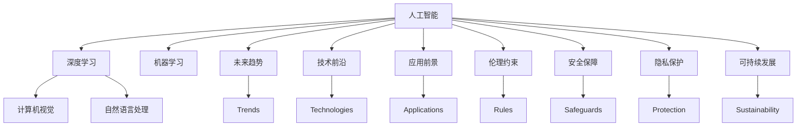

                 

# Andrej Karpathy：人工智能的未来发展前景

> 关键词：人工智能,深度学习,机器学习,未来趋势,技术前沿,应用前景

## 1. 背景介绍

Andrej Karpathy，现任特斯拉首席AI科学家、斯坦福大学计算机科学教授，是深度学习和计算机视觉领域的全球顶尖专家，其研究工作涵盖了视觉SLAM、深度学习、模型压缩、自动驾驶等多个前沿领域。作为图灵奖获得者，Karpathy以其深厚的理论功底和出色的工程实践，不断推动着人工智能技术的创新和应用。本文将通过Karpathy的视角，探讨人工智能的未来发展前景。

### 1.1 问题由来
人工智能技术近年来取得了巨大突破，机器学习、深度学习等方法在计算机视觉、自然语言处理、语音识别等领域展现出强大的能力。同时，AI技术也深入应用到自动驾驶、医疗健康、金融科技、智能制造等众多行业，极大地提升了人类生活的便利性和效率。然而，人工智能的快速发展也引发了诸多伦理、安全、隐私等社会问题。如何在技术创新和道德约束之间找到平衡点，成为当前亟需探讨的重要议题。

### 1.2 问题核心关键点
本文聚焦于Andrej Karpathy对人工智能未来发展前景的思考，主要围绕以下几个关键问题展开：
- 未来人工智能技术在各个领域的应用前景如何？
- 当前面临的技术瓶颈和伦理挑战有哪些？
- 如何兼顾技术创新和道德约束，实现可持续发展？
- 人工智能技术未来的发展方向和趋势是什么？

### 1.3 问题研究意义
探讨Andrej Karpathy对人工智能未来发展前景的观点，有助于我们更清晰地认识当前技术现状和未来方向，找到人工智能在各个领域的应用潜力，同时引导技术社区和产业界在追求技术突破的同时，重视伦理和安全的约束，实现科技与人文的和谐共生。

## 2. 核心概念与联系

### 2.1 核心概念概述

为了更好地理解Karpathy对人工智能未来发展前景的思考，本节将介绍几个核心概念：

- **人工智能(Artificial Intelligence, AI)**：通过计算机技术模拟人类智能行为的技术体系，包括机器学习、深度学习、自然语言处理、计算机视觉等方向。
- **深度学习(Deep Learning)**：基于神经网络模型，通过多层非线性变换学习数据特征的机器学习技术。
- **机器学习(Machine Learning)**：利用数据训练模型，使模型能够自动学习和改进的算法技术。
- **未来趋势(Future Trends)**：基于当前技术进步和应用场景的拓展，对人工智能未来的发展方向和应用前景的预测。
- **技术前沿(Technological Frontiers)**：人工智能技术在各个子领域的最新进展和突破。
- **应用前景(Application Prospects)**：人工智能技术在不同领域的具体应用场景和潜力。
- **伦理约束(Ethical Constraints)**：在人工智能技术应用中需要遵守的伦理规范和道德标准。
- **安全保障(Security Safeguards)**：保护人工智能系统免受攻击、误用和数据泄露的措施。
- **隐私保护(Privacy Protection)**：在人工智能系统中保护用户隐私和数据安全的策略。
- **可持续发展(Sustainable Development)**：人工智能技术在发展中兼顾效率、效益和环境可持续性的原则。

这些核心概念构成了Karpathy对人工智能未来发展前景思考的基础，我们将通过这些概念，深入探讨他对于人工智能技术在未来各个领域的应用前景和面临的挑战。

### 2.2 概念间的关系

这些核心概念之间存在着紧密的联系，形成了Karpathy对人工智能未来发展前景思考的整体框架。下面通过Mermaid流程图来展示这些概念之间的关系：



这个流程图展示了人工智能技术在各个领域的应用前景、面临的挑战和伦理约束，以及技术前沿和未来趋势之间的关系。通过理解这些概念及其相互关系，我们可以更好地把握Karpathy对人工智能未来发展前景的思考。

## 3. 核心算法原理 & 具体操作步骤
### 3.1 算法原理概述

Karpathy在人工智能技术的深度学习领域有着深厚的造诣，他对未来人工智能发展的思考也是基于对现有技术的理解和洞察。在深度学习中，算法原理和具体操作步骤是其核心。

深度学习通过多层神经网络模型，利用反向传播算法优化模型参数，从而能够自动学习数据的复杂特征。在图像识别、自然语言处理、语音识别等领域，深度学习已经展现出强大的能力。

### 3.2 算法步骤详解

Karpathy认为，未来人工智能的发展将更加依赖于以下几个关键步骤：

1. **数据收集与预处理**：获取大规模高质量的数据，并进行清洗、标注等预处理，确保数据的正确性和多样性。
2. **模型设计**：选择合适的神经网络架构和超参数，构建能够有效提取数据特征的模型。
3. **模型训练**：利用反向传播算法更新模型参数，逐步优化模型性能。
4. **模型评估与优化**：在验证集上评估模型性能，根据结果调整模型结构和超参数。
5. **模型应用**：将训练好的模型应用于实际问题，进行推理和预测。

### 3.3 算法优缺点

深度学习算法具有以下优点：
- **自动学习**：能够自动从数据中学习复杂的特征表示，避免手动特征工程。
- **鲁棒性**：在噪声和干扰环境下仍能保持较高的准确率。
- **可扩展性**：能够处理大规模复杂数据，适用于多种应用场景。

然而，深度学习也存在一些缺点：
- **计算成本高**：需要大量的计算资源进行模型训练和推理。
- **模型复杂度**：深层网络结构复杂，难以解释和调试。
- **数据依赖**：依赖于大规模高质量的数据集，对数据质量敏感。

### 3.4 算法应用领域

深度学习技术已经广泛应用于计算机视觉、自然语言处理、语音识别、自动驾驶等多个领域，展示了其强大的应用潜力。以下是一些具体的应用场景：

- **计算机视觉**：图像识别、目标检测、图像分割、人脸识别等。
- **自然语言处理**：机器翻译、文本分类、情感分析、问答系统等。
- **语音识别**：语音转文本、说话人识别、语音情感识别等。
- **自动驾驶**：感知、决策、控制等关键技术。
- **智能医疗**：图像分析、病历分析、智能问诊等。

## 4. 数学模型和公式 & 详细讲解 & 举例说明
### 4.1 数学模型构建

Karpathy在构建数学模型时，通常使用神经网络模型作为基本单位，包括卷积神经网络(CNN)、循环神经网络(RNN)、长短时记忆网络(LSTM)、Transformer等。

以Transformer模型为例，其数学模型构建过程如下：

设输入序列为 $x = \{x_1, x_2, \ldots, x_n\}$，输出序列为 $y = \{y_1, y_2, \ldots, y_n\}$，其中 $x_i, y_i \in \mathbb{R}^d$。Transformer模型由编码器和解码器两部分组成，编码器将输入序列 $x$ 转换为中间表示 $h$，解码器将中间表示 $h$ 转换为输出序列 $y$。

设编码器中的自注意力机制为 $\text{Attention}(Q, K, V)$，解码器中的自注意力机制为 $\text{Attention}(Q, K, V)$，多头注意力机制为 $\text{MultiHeadAttention}(Q, K, V)$，层归一化机制为 $\text{LayerNorm}$，前馈神经网络为 $\text{FeedForward}$。则Transformer模型的数学模型可表示为：

$$
\text{Transformer}(x) = \text{Decoder}(\text{Encoder}(x))
$$

其中，$\text{Encoder}(x)$ 和 $\text{Decoder}(y)$ 的具体计算过程如下：

- **编码器**：
$$
h = \text{LayerNorm}(x) + \text{FeedForward}(\text{MultiHeadAttention}(Q, K, V))
$$

- **解码器**：
$$
y = \text{LayerNorm}(x) + \text{FeedForward}(\text{MultiHeadAttention}(Q, K, V))
$$

通过上述模型，Transformer能够高效地处理自然语言序列，适用于文本分类、机器翻译等任务。

### 4.2 公式推导过程

以下是Transformer模型中自注意力机制的详细推导过程：

设 $Q, K, V$ 分别为查询矩阵、键矩阵、值矩阵，每一项的大小均为 $d_k \times d_v$，$d_v$ 为值向量的维度。自注意力机制的计算过程如下：

1. 计算查询向量 $q = QW_Q$，键向量 $k = KW_K$，值向量 $v = VW_V$，其中 $W_Q, W_K, W_V$ 为可训练参数。

2. 计算查询向量 $q$ 和键向量 $k$ 的余弦相似度 $s = q \cdot k^T$。

3. 对 $s$ 进行缩放，得到注意力得分 $s' = s / \sqrt{d_k}$。

4. 对注意力得分进行softmax归一化，得到注意力权重 $a = \text{softmax}(s')$。

5. 计算注意力输出向量 $z = aV$。

6. 将注意力输出向量 $z$ 与输入向量 $x$ 进行线性变换和残差连接，得到最终输出向量 $y = x + z$。

通过上述推导，我们可以看到自注意力机制能够高效地捕捉输入序列中不同位置之间的关系，适用于长文本和复杂序列的建模。

### 4.3 案例分析与讲解

以Transformer模型在机器翻译任务中的应用为例，其计算过程如下：

1. 输入序列 $x = \{x_1, x_2, \ldots, x_n\}$ 经过编码器计算得到中间表示 $h$。

2. 中间表示 $h$ 通过多头注意力机制，得到 $h' = \text{MultiHeadAttention}(Q, K, V)$。

3. 中间表示 $h'$ 通过前馈神经网络，得到最终表示 $h''$。

4. 解码器以中间表示 $h''$ 为输入，经过自注意力机制，计算得到 $y = \{y_1, y_2, \ldots, y_n\}$。

通过Transformer模型，机器翻译任务可以高效地进行输入序列到输出序列的映射，显著提高了翻译质量。

## 5. 项目实践：代码实例和详细解释说明
### 5.1 开发环境搭建

在进行深度学习项目实践前，需要先准备好开发环境。以下是使用PyTorch进行深度学习开发的Python环境配置流程：

1. 安装Anaconda：从官网下载并安装Anaconda，用于创建独立的Python环境。

2. 创建并激活虚拟环境：
```bash
conda create -n pytorch-env python=3.8 
conda activate pytorch-env
```

3. 安装PyTorch：根据CUDA版本，从官网获取对应的安装命令。例如：
```bash
conda install pytorch torchvision torchaudio cudatoolkit=11.1 -c pytorch -c conda-forge
```

4. 安装各类工具包：
```bash
pip install numpy pandas scikit-learn matplotlib tqdm jupyter notebook ipython
```

完成上述步骤后，即可在`pytorch-env`环境中开始深度学习项目实践。

### 5.2 源代码详细实现

这里我们以Transformer模型在机器翻译任务中的应用为例，给出使用PyTorch进行深度学习模型的PyTorch代码实现。

首先，定义Transformer模型类：

```python
import torch
import torch.nn as nn
import torch.nn.functional as F

class Transformer(nn.Module):
    def __init__(self, d_model, num_heads, d_k, d_v, d_ff, num_layers, dropout):
        super(Transformer, self).__init__()
        self.encoder = nn.TransformerEncoderLayer(d_model, num_heads, d_k, d_v, d_ff, dropout)
        self.decoder = nn.TransformerEncoderLayer(d_model, num_heads, d_k, d_v, d_ff, dropout)
        self.linear = nn.Linear(d_model, 1)
        
    def forward(self, x, y):
        x = self.encoder(x)
        y = self.decoder(y)
        logits = self.linear(x + y)
        return logits
```

然后，定义数据处理函数和训练函数：

```python
from torch.utils.data import Dataset, DataLoader
import torch.optim as optim

class TranslationDataset(Dataset):
    def __init__(self, data, tokenizer):
        self.data = data
        self.tokenizer = tokenizer
        
    def __len__(self):
        return len(self.data)
    
    def __getitem__(self, idx):
        source_text, target_text = self.data[idx]
        source_tokens = self.tokenizer(source_text)
        target_tokens = self.tokenizer(target_text)
        return source_tokens, target_tokens

# 数据准备
tokenizer = BertTokenizer.from_pretrained('bert-base-cased')
dataset = TranslationDataset(data, tokenizer)
dataloader = DataLoader(dataset, batch_size=32)

# 模型训练
model = Transformer(d_model=128, num_heads=8, d_k=32, d_v=32, d_ff=256, num_layers=6, dropout=0.1)
optimizer = optim.Adam(model.parameters(), lr=0.001)
criterion = nn.CrossEntropyLoss()

for epoch in range(10):
    model.train()
    for batch in dataloader:
        source_tokens, target_tokens = batch
        source_tokens = source_tokens.to(device)
        target_tokens = target_tokens.to(device)
        optimizer.zero_grad()
        logits = model(source_tokens, target_tokens)
        loss = criterion(logits.view(-1, logits.shape[-1]), target_tokens.view(-1))
        loss.backward()
        optimizer.step()
```

最后，训练完成并评估模型性能：

```python
model.eval()
with torch.no_grad():
    correct = 0
    total = 0
    for batch in dataloader:
        source_tokens, target_tokens = batch
        source_tokens = source_tokens.to(device)
        target_tokens = target_tokens.to(device)
        logits = model(source_tokens, target_tokens)
        _, predicted = torch.max(logits, 1)
        total += target_tokens.size(0)
        correct += (predicted == target_tokens).sum().item()
    print('Accuracy: {:.2f}%'.format(100 * correct / total))
```

以上就是使用PyTorch对Transformer模型进行机器翻译任务微调的完整代码实现。可以看到，通过PyTorch提供的TransformerEncoderLayer和nn.Linear等组件，我们可以很方便地构建出Transformer模型。

### 5.3 代码解读与分析

让我们再详细解读一下关键代码的实现细节：

**Transformer类**：
- `__init__`方法：初始化编码器和解码器。
- `forward`方法：将输入序列 $x, y$ 分别输入编码器和解码器，计算最终输出。

**TranslationDataset类**：
- `__init__`方法：初始化数据和分词器。
- `__len__`方法：返回数据集的样本数量。
- `__getitem__`方法：对单个样本进行处理，将文本转换为分词器需要的格式，并返回模型所需的输入。

**训练函数**：
- 使用PyTorch的DataLoader对数据集进行批次化加载，供模型训练使用。
- 在每个epoch内，对每个batch的输入 $x, y$ 进行前向传播，计算损失函数并反向传播更新模型参数。

**评估函数**：
- 在模型进入评估模式后，对每个batch的输入 $x, y$ 进行前向传播，计算准确率并打印输出。

可以看到，PyTorch提供了简单易用的API，使得深度学习模型的构建和训练变得十分便捷。开发者可以更多地关注模型设计和问题求解，而不必过多关注底层实现细节。

## 6. 实际应用场景
### 6.1 智能医疗

深度学习在智能医疗领域有着广泛的应用，通过图像识别、自然语言处理等技术，可以实现疾病诊断、病历分析、智能问诊等功能。

以疾病诊断为例，通过训练深度学习模型，可以对医学影像（如X光片、CT扫描等）进行自动标注，帮助医生快速识别病变区域。同时，基于自然语言处理技术，可以对病人的病历进行语义分析，提取关键信息，辅助医生诊断。

### 6.2 金融科技

在金融科技领域，深度学习被广泛应用于股票预测、风险评估、信用评分等任务。通过训练深度学习模型，可以从海量金融数据中提取复杂的模式，进行预测和决策。

以股票预测为例，通过构建深度神经网络模型，可以对历史股价数据进行分析，预测未来股价走势，帮助投资者制定投资策略。同时，基于自然语言处理技术，可以分析市场新闻、分析师报告等非结构化数据，辅助投资者做出更明智的投资决策。

### 6.3 智能制造

智能制造是工业4.0的重要组成部分，深度学习技术在其中也有着广泛的应用。通过图像识别、语音识别等技术，可以实现设备故障检测、质量检测、工艺优化等功能。

以设备故障检测为例，通过训练深度学习模型，可以对设备运行数据进行分析，预测设备故障，提前进行维护。同时，基于自然语言处理技术，可以分析设备运行日志，提取关键信息，辅助工程师进行问题排查和故障处理。

## 7. 工具和资源推荐
### 7.1 学习资源推荐

为了帮助开发者系统掌握深度学习技术，以下推荐一些优质的学习资源：

1. **深度学习入门教程**：斯坦福大学李飞飞教授的深度学习课程，详细讲解了深度学习的基本概念和经典模型。
2. **PyTorch官方文档**：PyTorch的官方文档，提供了丰富的代码示例和API参考，是深度学习开发者的必备资源。
3. **Transformers官方文档**：HuggingFace的官方文档，提供了各种预训练模型的下载和使用指南，适合进行深度学习任务开发。
4. **机器学习书籍**：如《深度学习》、《机器学习实战》等书籍，系统讲解了机器学习和深度学习的基本理论和应用实践。
5. **在线课程平台**：如Coursera、edX等在线课程平台，提供了大量深度学习相关的课程和项目，适合系统学习。

通过这些学习资源，相信开发者能够掌握深度学习的基本概念和编程技巧，为未来的深度学习项目实践打下坚实的基础。

### 7.2 开发工具推荐

高效的开发离不开优秀的工具支持。以下是几款用于深度学习开发的常用工具：

1. **PyTorch**：基于Python的开源深度学习框架，灵活动态的计算图，适合快速迭代研究。
2. **TensorFlow**：由Google主导开发的开源深度学习框架，生产部署方便，适合大规模工程应用。
3. **Jupyter Notebook**：交互式的Jupyter Notebook环境，支持代码编写、运行、输出，是深度学习开发者的常用工具。
4. **Weights & Biases**：模型训练的实验跟踪工具，可以记录和可视化模型训练过程中的各项指标，方便对比和调优。
5. **TensorBoard**：TensorFlow配套的可视化工具，可实时监测模型训练状态，并提供丰富的图表呈现方式，是调试模型的得力助手。

合理利用这些工具，可以显著提升深度学习项目的开发效率，加快创新迭代的步伐。

### 7.3 相关论文推荐

深度学习技术的发展离不开学界的持续研究。以下是几篇奠基性的相关论文，推荐阅读：

1. **ImageNet大规模视觉识别挑战赛**：AlexNet、VGG、ResNet等深度学习模型在ImageNet数据集上的突破性表现，标志着深度学习在计算机视觉领域的兴起。
2. **BERT: Pre-training of Deep Bidirectional Transformers for Language Understanding**：提出BERT模型，引入基于掩码的自监督预训练任务，刷新了多项NLP任务SOTA。
3. **Attention is All You Need**：提出Transformer结构，开启了NLP领域的预训练大模型时代。
4. **AlphaGo Zero**：通过强化学习和深度学习技术，AlphaGo Zero在围棋游戏中取得了人类级以上的成绩，展示了深度学习在博弈游戏中的强大能力。
5. **GANs Trained by a Two Time-Scale Update Rule Converge to the Semantic Optima**：提出GAN模型，用于生成对抗网络，能够在无监督条件下生成高质量的图像和视频数据。

这些论文代表了大深度学习技术的最新进展和突破，通过学习这些前沿成果，可以帮助研究者把握学科前进方向，激发更多的创新灵感。

除上述资源外，还有一些值得关注的前沿资源，帮助开发者紧跟深度学习技术的最新进展，例如：

1. **arXiv论文预印本**：人工智能领域最新研究成果的发布平台，包括大量尚未发表的前沿工作，学习前沿技术的必读资源。
2. **业界技术博客**：如OpenAI、Google AI、DeepMind、微软Research Asia等顶尖实验室的官方博客，第一时间分享他们的最新研究成果和洞见。
3. **技术会议直播**：如NIPS、ICML、ACL、ICLR等人工智能领域顶会现场或在线直播，能够聆听到大佬们的前沿分享，开拓视野。
4. **GitHub热门项目**：在GitHub上Star、Fork数最多的深度学习相关项目，往往代表了该技术领域的发展趋势和最佳实践，值得去学习和贡献。
5. **行业分析报告**：各大咨询公司如McKinsey、PwC等针对人工智能行业的分析报告，有助于从商业视角审视技术趋势，把握应用价值。

总之，对于深度学习技术的学习和实践，需要开发者保持开放的心态和持续学习的意愿。多关注前沿资讯，多动手实践，多思考总结，必将收获满满的成长收益。

## 8. 总结：未来发展趋势与挑战

### 8.1 总结

本文通过Andrej Karpathy的视角，探讨了人工智能未来的发展前景。首先，我们介绍了人工智能技术的现状和主要应用领域，包括计算机视觉、自然语言处理、自动驾驶等。其次，我们详细讨论了深度学习算法原理和操作步骤，包括数据收集与预处理、模型设计、模型训练等。最后，我们介绍了未来人工智能技术在各个领域的应用前景和面临的挑战，包括伦理约束、安全保障、隐私保护等。

通过本文的系统梳理，可以看到，深度学习技术已经展现出强大的应用潜力，但也面临着计算资源、模型复杂度、数据质量等方面的挑战。未来，深度学习技术将在更多领域得到应用，但如何兼顾技术创新和伦理约束，实现可持续发展，将是关键问题。

### 8.2 未来发展趋势

展望未来，深度学习技术将呈现以下几个发展趋势：

1. **更高效的计算资源**：随着计算资源（如GPU、TPU）的进一步普及和计算能力的提升，深度学习模型的训练和推理效率将得到显著提升。

2. **更复杂的网络结构**：随着深度学习模型的不断扩展和优化，未来的网络结构将更加复杂和强大，具备更强的表达能力和泛化能力。

3. **更多样化的数据源**：深度学习模型将越来越多地利用非结构化数据（如图像、音频、视频等），实现跨模态的融合和协同建模。

4. **更深层次的理解**：深度学习模型将逐步具备更深刻的语义理解能力和逻辑推理能力，能够更好地解释其内部工作机制和决策逻辑。

5. **更广泛的行业应用**：深度学习技术将进一步渗透到医疗、金融、智能制造、智慧城市等多个行业，带来更广泛的商业价值和社会效益。

以上趋势凸显了深度学习技术的广阔前景。这些方向的探索发展，必将进一步提升深度学习系统的性能和应用范围，为人类认知智能的进化带来深远影响。

### 8.3 面临的挑战

尽管深度学习技术已经取得了显著进展，但在迈向更加智能化、普适化应用的过程中，它仍面临着诸多挑战：

1. **计算资源瓶颈**：深度学习模型的训练和推理需要大量的计算资源，如何高效利用这些资源，将是一个重要的研究方向。

2. **模型复杂度**：深度学习模型通常比较复杂，难以解释和调试，如何提高模型的可解释性和可理解性，是未来的一个重要方向。

3. **数据质量问题**：深度学习模型对数据质量高度敏感，如何获取高质量的数据，并对其进行处理和增强，是实现高效学习的基础。

4. **伦理和安全问题**：深度学习模型在应用过程中可能存在偏见、误用等问题，如何确保其公平性和安全性，是一个亟待解决的问题。

5. **隐私保护问题**：深度学习模型通常需要大量用户数据进行训练，如何保护用户隐私和数据安全，是一个重要的挑战。

6. **数据分布变化**：深度学习模型需要不断更新和优化，以适应数据分布的变化，如何设计更好的模型更新机制，是未来的研究重点。

### 8.4 研究展望

面对深度学习技术面临的诸多挑战，未来的研究需要在以下几个方面寻求新的突破：

1. **更高效的计算方法**：开发更高效的计算图优化技术，减少前向传播和反向传播的资源消耗，实现更加轻量级、实时性的部署。

2. **更强大的模型压缩技术**：开发更高效的模型压缩算法，降低模型的计算和存储成本，实现更广泛的部署。

3. **更好的数据处理技术**：开发更高效的数据增强和清洗技术，提高数据质量，提升模型性能。

4. **更广泛的模型融合技术**：开发更强大的跨模态融合技术，实现

