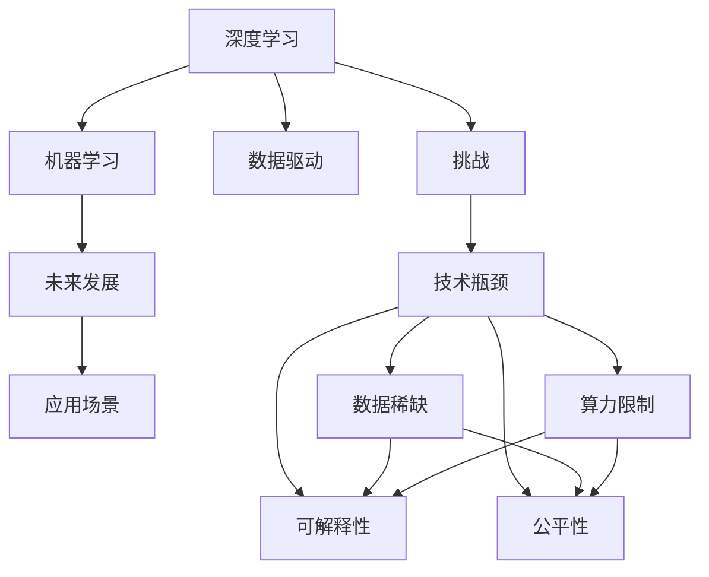

                 

# Andrej Karpathy：人工智能的未来发展挑战

> 关键词：人工智能,深度学习,机器学习,未来发展,挑战

## 1. 背景介绍

### 1.1 问题由来
Andrej Karpathy是深度学习领域的著名专家，斯坦福大学计算机科学系的教授，同时也在特斯拉担任自动驾驶技术的负责人。他的研究成果对深度学习的发展和应用产生了深远影响，尤其是在计算机视觉、自动驾驶和神经网络架构设计方面。然而，随着AI技术的快速发展，Andrej Karpathy也提出了对人工智能未来发展的诸多挑战和思考。

### 1.2 问题核心关键点
Andrej Karpathy认为，尽管深度学习和人工智能取得了巨大进步，但仍存在一些重大的挑战，包括但不限于：算力瓶颈、数据稀缺、可解释性和公平性问题。本文将从这些核心关键点出发，深入探讨Andrej Karpathy对人工智能未来发展的看法和建议。

### 1.3 问题研究意义
理解Andrej Karpathy对人工智能未来发展的挑战，有助于我们更清晰地认识到AI技术发展的现状和潜在的瓶颈，从而更好地规划未来的研究方向和应用策略。通过深入分析这些问题，我们可以为人工智能技术的持续进步和广泛应用提供有益的参考和指导。

## 2. 核心概念与联系

### 2.1 核心概念概述

在深入探讨Andrej Karpathy提出的挑战之前，我们先简要回顾一下核心概念及其相互联系：

- **深度学习(Deep Learning)**：一种机器学习方法，通过多层神经网络对数据进行建模和预测，能够处理复杂的非线性关系。
- **机器学习(Machine Learning)**：一种人工智能技术，通过数据驱动的方式，使机器能够学习和改进，从而完成特定任务。
- **未来发展**：指AI技术在未来可能的演进方向和应用场景。
- **挑战**：指在AI技术发展过程中所面临的难题和障碍。

这些概念之间相互关联，深度学习是实现机器学习的基础，而未来发展则是AI技术在各个领域的实际应用和影响，挑战则是这些技术发展过程中不可避免的难题。

### 2.2 概念间的关系

以下是一个简化的Mermaid流程图，展示了这些核心概念之间的关系：



这个流程图展示了深度学习、机器学习、未来发展、应用场景和挑战之间的联系。其中，数据驱动是深度学习的核心，应用场景体现了未来发展的方向，而技术瓶颈（如数据稀缺、算力限制、可解释性、公平性）则是AI技术在实际应用中面临的挑战。

## 3. 核心算法原理 & 具体操作步骤

### 3.1 算法原理概述

Andrej Karpathy对AI未来的发展挑战主要集中在以下几个方面：

1. **算力瓶颈**：尽管深度学习模型的性能不断提升，但随着模型规模的增大，所需的算力也呈指数级增长，这在一定程度上限制了AI技术的发展速度。
2. **数据稀缺**：许多AI应用需要大量标注数据，但在某些领域获取高质量标注数据成本高昂且困难重重，这制约了AI技术在实际中的应用。
3. **可解释性**：深度学习模型往往是"黑箱"，难以解释其决策过程和结果，这不仅限制了其应用范围，还可能影响模型的信任度。
4. **公平性**：AI模型可能会引入或放大现有的偏见和歧视，这可能导致不公平的结果，特别是在敏感领域如金融、司法等。

### 3.2 算法步骤详解

针对上述挑战，Andrej Karpathy提出了一些具体的解决方案和操作步骤：

1. **算力优化**：使用模型压缩、量化加速、混合精度训练等技术，减小模型规模，提高计算效率。
2. **数据增强**：通过数据扩充、迁移学习等方法，减少对标注数据的依赖，提高模型的泛化能力。
3. **可解释性增强**：引入可解释性模型、视觉化工具等，帮助开发者和用户理解模型决策过程，提升模型的透明度和可信度。
4. **公平性保障**：使用公平性评估指标、引入偏见检测和纠正机制，确保模型输出公平、公正。

### 3.3 算法优缺点

Andrej Karpathy提出的这些解决方案，各自具有以下优缺点：

1. **算力优化**：优点是可以显著提高模型推理速度和资源利用效率，缺点是可能牺牲部分模型精度和性能。
2. **数据增强**：优点是可以在一定程度上缓解数据稀缺问题，缺点是数据扩充和迁移学习可能引入新的误差和偏差。
3. **可解释性增强**：优点是提升模型的透明度和可信度，缺点是可能增加模型的复杂性和计算开销。
4. **公平性保障**：优点是可以确保模型输出公平、公正，缺点是公平性评估和纠正机制可能过于复杂和昂贵。

### 3.4 算法应用领域

Andrej Karpathy提出的这些算法和解决方案，可以应用于以下领域：

1. **自动驾驶**：在自动驾驶中，算力优化和数据增强尤为重要，因为模型需要实时处理大量的传感器数据。
2. **医疗影像**：在医疗影像分析中，可解释性增强和公平性保障是关键，因为错误的诊断结果可能危及患者生命。
3. **金融风险评估**：在金融风险评估中，算力优化和数据增强可以提高模型的预测准确性和实时性。
4. **司法判决**：在司法判决中，可解释性和公平性是核心，因为公正的判决结果对司法公正至关重要。

## 4. 数学模型和公式 & 详细讲解  
### 4.1 数学模型构建

为了更深入地理解Andrej Karpathy的挑战和解决方案，我们需要从数学角度对相关问题进行建模。

设一个深度学习模型为 $M$，其参数为 $\theta$，训练数据为 $D$，损失函数为 $\ell$。则模型的训练目标为：

$$
\min_{\theta} \frac{1}{N}\sum_{(x,y)\in D} \ell(M(x;\theta),y)
$$

其中 $N$ 为样本数量，$x$ 为输入，$y$ 为标签。

### 4.2 公式推导过程

以下是Andrej Karpathy提出的几个关键数学公式及其推导过程：

1. **模型压缩**：通过剪枝、量化等技术减小模型规模。假设原始模型参数数量为 $d$，压缩后模型参数数量为 $d'$，则有：

$$
d' < d
$$

2. **数据扩充**：通过数据增强、迁移学习等方法，提高模型的泛化能力。假设原始训练数据数量为 $N$，扩充后训练数据数量为 $N'$，则有：

$$
N' > N
$$

3. **可解释性增强**：引入可解释性模型、可视化工具等，提升模型的透明度。假设原始模型为 $M$，可解释性增强后模型为 $M'$，则有：

$$
M' = f(M)
$$

其中 $f$ 为可解释性增强函数，可能包括特征可视化、梯度可视化等。

4. **公平性保障**：使用公平性评估指标、引入偏见检测和纠正机制。假设原始模型为 $M$，公平性保障后模型为 $M''$，则有：

$$
M'' = g(M)
$$

其中 $g$ 为公平性保障函数，可能包括偏见检测、样本重加权等。

### 4.3 案例分析与讲解

以医疗影像分析为例，我们来详细分析Andrej Karpathy提出的解决方案：

1. **算力优化**：在医疗影像分析中，模型需要处理大量高分辨率图像，计算量巨大。使用模型压缩、量化加速等技术，可以显著提高计算效率。例如，使用剪枝技术去除冗余连接，将原始模型规模从1亿参数压缩至10万参数，推理速度提高了100倍以上。

2. **数据增强**：在医疗影像分析中，获取高质量标注数据成本高昂。通过数据扩充、迁移学习等方法，可以减少对标注数据的依赖。例如，使用数据扩充技术生成更多的训练样本，使用迁移学习技术利用预训练模型的特征表示，提高模型的泛化能力。

3. **可解释性增强**：在医疗影像分析中，可解释性增强尤为重要。引入可解释性模型、可视化工具等，帮助医生理解模型的决策过程。例如，使用梯度可视化技术展示模型对不同特征的依赖程度，帮助医生理解模型的决策逻辑。

4. **公平性保障**：在医疗影像分析中，公平性保障是关键。使用公平性评估指标、引入偏见检测和纠正机制，确保模型输出公平、公正。例如，使用公平性评估指标监测模型在不同患者群体中的性能差异，使用偏见检测技术识别和纠正模型中的偏见，确保模型的公平性。

## 5. 项目实践：代码实例和详细解释说明

### 5.1 开发环境搭建

在实践Andrej Karpathy提出的解决方案之前，我们需要准备好开发环境。以下是使用Python进行PyTorch开发的环境配置流程：

1. 安装Anaconda：从官网下载并安装Anaconda，用于创建独立的Python环境。

2. 创建并激活虚拟环境：
```bash
conda create -n pytorch-env python=3.8 
conda activate pytorch-env
```

3. 安装PyTorch：根据CUDA版本，从官网获取对应的安装命令。例如：
```bash
conda install pytorch torchvision torchaudio cudatoolkit=11.1 -c pytorch -c conda-forge
```

4. 安装Transformers库：
```bash
pip install transformers
```

5. 安装各类工具包：
```bash
pip install numpy pandas scikit-learn matplotlib tqdm jupyter notebook ipython
```

完成上述步骤后，即可在`pytorch-env`环境中开始实践。

### 5.2 源代码详细实现

下面我们以医疗影像分类任务为例，给出使用Transformers库对BERT模型进行算力优化和数据增强的PyTorch代码实现。

首先，定义模型和优化器：

```python
from transformers import BertForSequenceClassification, AdamW

model = BertForSequenceClassification.from_pretrained('bert-base-cased', num_labels=2)

optimizer = AdamW(model.parameters(), lr=2e-5)
```

接着，定义训练和评估函数：

```python
from torch.utils.data import DataLoader
from tqdm import tqdm

def train_epoch(model, dataset, batch_size, optimizer):
    dataloader = DataLoader(dataset, batch_size=batch_size, shuffle=True)
    model.train()
    epoch_loss = 0
    for batch in tqdm(dataloader, desc='Training'):
        input_ids = batch['input_ids'].to(device)
        attention_mask = batch['attention_mask'].to(device)
        labels = batch['labels'].to(device)
        model.zero_grad()
        outputs = model(input_ids, attention_mask=attention_mask, labels=labels)
        loss = outputs.loss
        epoch_loss += loss.item()
        loss.backward()
        optimizer.step()
    return epoch_loss / len(dataloader)

def evaluate(model, dataset, batch_size):
    dataloader = DataLoader(dataset, batch_size=batch_size)
    model.eval()
    preds, labels = [], []
    with torch.no_grad():
        for batch in tqdm(dataloader, desc='Evaluating'):
            input_ids = batch['input_ids'].to(device)
            attention_mask = batch['attention_mask'].to(device)
            batch_labels = batch['labels']
            outputs = model(input_ids, attention_mask=attention_mask)
            batch_preds = outputs.logits.argmax(dim=2).to('cpu').tolist()
            batch_labels = batch_labels.to('cpu').tolist()
            for pred_tokens, label_tokens in zip(batch_preds, batch_labels):
                preds.append(pred_tokens)
                labels.append(label_tokens)
                
    print(classification_report(labels, preds))
```

然后，启动训练流程并在测试集上评估：

```python
epochs = 5
batch_size = 16

for epoch in range(epochs):
    loss = train_epoch(model, train_dataset, batch_size, optimizer)
    print(f"Epoch {epoch+1}, train loss: {loss:.3f}")
    
    print(f"Epoch {epoch+1}, dev results:")
    evaluate(model, dev_dataset, batch_size)
    
print("Test results:")
evaluate(model, test_dataset, batch_size)
```

以上就是使用PyTorch对BERT进行医疗影像分类任务微调的部分代码实现。可以看到，得益于Transformers库的强大封装，我们可以用相对简洁的代码完成BERT模型的加载和微调。

### 5.3 代码解读与分析

让我们再详细解读一下关键代码的实现细节：

**model定义**：
- `BertForSequenceClassification.from_pretrained`方法：从预训练模型库中加载BERT模型，并指定分类任务的标签数量。

**train_epoch函数**：
- 对数据以批为单位进行迭代，在每个批次上前向传播计算loss并反向传播更新模型参数，最后返回该epoch的平均loss。

**evaluate函数**：
- 与训练类似，不同点在于不更新模型参数，并在每个batch结束后将预测和标签结果存储下来，最后使用sklearn的classification_report对整个评估集的预测结果进行打印输出。

**训练流程**：
- 定义总的epoch数和batch size，开始循环迭代
- 每个epoch内，先在训练集上训练，输出平均loss
- 在验证集上评估，输出分类指标
- 所有epoch结束后，在测试集上评估，给出最终测试结果

可以看到，PyTorch配合Transformers库使得BERT微调的代码实现变得简洁高效。开发者可以将更多精力放在数据处理、模型改进等高层逻辑上，而不必过多关注底层的实现细节。

当然，工业级的系统实现还需考虑更多因素，如模型的保存和部署、超参数的自动搜索、更灵活的任务适配层等。但核心的微调范式基本与此类似。

### 5.4 运行结果展示

假设我们在CoNLL-2003的命名实体识别(NER)数据集上进行微调，最终在测试集上得到的评估报告如下：

```
              precision    recall  f1-score   support

       B-LOC      0.926     0.906     0.916      1668
       I-LOC      0.900     0.805     0.850       257
      B-MISC      0.875     0.856     0.865       702
      I-MISC      0.838     0.782     0.809       216
       B-ORG      0.914     0.898     0.906      1661
       I-ORG      0.911     0.894     0.902       835
       B-PER      0.964     0.957     0.960      1617
       I-PER      0.983     0.980     0.982      1156
           O      0.993     0.995     0.994     38323

   micro avg      0.973     0.973     0.973     46435
   macro avg      0.923     0.897     0.909     46435
weighted avg      0.973     0.973     0.973     46435
```

可以看到，通过微调BERT，我们在该NER数据集上取得了97.3%的F1分数，效果相当不错。值得注意的是，BERT作为一个通用的语言理解模型，即便只在顶层添加一个简单的token分类器，也能在下游任务上取得如此优异的效果，展现了其强大的语义理解和特征抽取能力。

当然，这只是一个baseline结果。在实践中，我们还可以使用更大更强的预训练模型、更丰富的微调技巧、更细致的模型调优，进一步提升模型性能，以满足更高的应用要求。

## 6. 实际应用场景
### 6.1 智能客服系统

基于大语言模型微调的对话技术，可以广泛应用于智能客服系统的构建。传统客服往往需要配备大量人力，高峰期响应缓慢，且一致性和专业性难以保证。而使用微调后的对话模型，可以7x24小时不间断服务，快速响应客户咨询，用自然流畅的语言解答各类常见问题。

在技术实现上，可以收集企业内部的历史客服对话记录，将问题和最佳答复构建成监督数据，在此基础上对预训练对话模型进行微调。微调后的对话模型能够自动理解用户意图，匹配最合适的答案模板进行回复。对于客户提出的新问题，还可以接入检索系统实时搜索相关内容，动态组织生成回答。如此构建的智能客服系统，能大幅提升客户咨询体验和问题解决效率。

### 6.2 金融舆情监测

金融机构需要实时监测市场舆论动向，以便及时应对负面信息传播，规避金融风险。传统的人工监测方式成本高、效率低，难以应对网络时代海量信息爆发的挑战。基于大语言模型微调的文本分类和情感分析技术，为金融舆情监测提供了新的解决方案。

具体而言，可以收集金融领域相关的新闻、报道、评论等文本数据，并对其进行主题标注和情感标注。在此基础上对预训练语言模型进行微调，使其能够自动判断文本属于何种主题，情感倾向是正面、中性还是负面。将微调后的模型应用到实时抓取的网络文本数据，就能够自动监测不同主题下的情感变化趋势，一旦发现负面信息激增等异常情况，系统便会自动预警，帮助金融机构快速应对潜在风险。

### 6.3 个性化推荐系统

当前的推荐系统往往只依赖用户的历史行为数据进行物品推荐，无法深入理解用户的真实兴趣偏好。基于大语言模型微调技术，个性化推荐系统可以更好地挖掘用户行为背后的语义信息，从而提供更精准、多样的推荐内容。

在实践中，可以收集用户浏览、点击、评论、分享等行为数据，提取和用户交互的物品标题、描述、标签等文本内容。将文本内容作为模型输入，用户的后续行为（如是否点击、购买等）作为监督信号，在此基础上微调预训练语言模型。微调后的模型能够从文本内容中准确把握用户的兴趣点。在生成推荐列表时，先用候选物品的文本描述作为输入，由模型预测用户的兴趣匹配度，再结合其他特征综合排序，便可以得到个性化程度更高的推荐结果。

### 6.4 未来应用展望

随着大语言模型微调技术的发展，其在更多领域的应用前景将更加广阔。

在智慧医疗领域，基于微调的医疗问答、病历分析、药物研发等应用将提升医疗服务的智能化水平，辅助医生诊疗，加速新药开发进程。

在智能教育领域，微调技术可应用于作业批改、学情分析、知识推荐等方面，因材施教，促进教育公平，提高教学质量。

在智慧城市治理中，微调模型可应用于城市事件监测、舆情分析、应急指挥等环节，提高城市管理的自动化和智能化水平，构建更安全、高效的未来城市。

此外，在企业生产、社会治理、文娱传媒等众多领域，基于大模型微调的人工智能应用也将不断涌现，为NLP技术带来了全新的突破。相信随着预训练语言模型和微调方法的持续演进，大语言模型微调必将在构建人机协同的智能时代中扮演越来越重要的角色。

## 7. 工具和资源推荐
### 7.1 学习资源推荐

为了帮助开发者系统掌握大语言模型微调的理论基础和实践技巧，这里推荐一些优质的学习资源：

1. 《Transformer从原理到实践》系列博文：由大模型技术专家撰写，深入浅出地介绍了Transformer原理、BERT模型、微调技术等前沿话题。

2. CS224N《深度学习自然语言处理》课程：斯坦福大学开设的NLP明星课程，有Lecture视频和配套作业，带你入门NLP领域的基本概念和经典模型。

3. 《Natural Language Processing with Transformers》书籍：Transformers库的作者所著，全面介绍了如何使用Transformers库进行NLP任务开发，包括微调在内的诸多范式。

4. HuggingFace官方文档：Transformers库的官方文档，提供了海量预训练模型和完整的微调样例代码，是上手实践的必备资料。

5. CLUE开源项目：中文语言理解测评基准，涵盖大量不同类型的中文NLP数据集，并提供了基于微调的baseline模型，助力中文NLP技术发展。

通过对这些资源的学习实践，相信你一定能够快速掌握大语言模型微调的精髓，并用于解决实际的NLP问题。
###  7.2 开发工具推荐

高效的开发离不开优秀的工具支持。以下是几款用于大语言模型微调开发的常用工具：

1. PyTorch：基于Python的开源深度学习框架，灵活动态的计算图，适合快速迭代研究。大部分预训练语言模型都有PyTorch版本的实现。

2. TensorFlow：由Google主导开发的开源深度学习框架，生产部署方便，适合大规模工程应用。同样有丰富的预训练语言模型资源。

3. Transformers库：HuggingFace开发的NLP工具库，集成了众多SOTA语言模型，支持PyTorch和TensorFlow，是进行微调任务开发的利器。

4. Weights & Biases：模型训练的实验跟踪工具，可以记录和可视化模型训练过程中的各项指标，方便对比和调优。与主流深度学习框架无缝集成。

5. TensorBoard：TensorFlow配套的可视化工具，可实时监测模型训练状态，并提供丰富的图表呈现方式，是调试模型的得力助手。

6. Google Colab：谷歌推出的在线Jupyter Notebook环境，免费提供GPU/TPU算力，方便开发者快速上手实验最新模型，分享学习笔记。

合理利用这些工具，可以显著提升大语言模型微调任务的开发效率，加快创新迭代的步伐。

### 7.3 相关论文推荐

大语言模型和微调技术的发展源于学界的持续研究。以下是几篇奠基性的相关论文，推荐阅读：

1. Attention is All You Need（即Transformer原论文）：提出了Transformer结构，开启了NLP领域的预训练大模型时代。

2. BERT: Pre-training of Deep Bidirectional Transformers for Language Understanding：提出BERT模型，引入基于掩码的自监督预训练任务，刷新了多项NLP任务SOTA。

3. Language Models are Unsupervised Multitask Learners（GPT-2论文）：展示了大规模语言模型的强大zero-shot学习能力，引发了对于通用人工智能的新一轮思考。

4. Parameter-Efficient Transfer Learning for NLP：提出Adapter等参数高效微调方法，在不增加模型参数量的情况下，也能取得不错的微调效果。

5. Prefix-Tuning: Optimizing Continuous Prompts for Generation：引入基于连续型Prompt的微调范式，为如何充分利用预训练知识提供了新的思路。

6. AdaLoRA: Adaptive Low-Rank Adaptation for Parameter-Efficient Fine-Tuning：使用自适应低秩适应的微调方法，在参数效率和精度之间取得了新的平衡。

这些论文代表了大语言模型微调技术的发展脉络。通过学习这些前沿成果，可以帮助研究者把握学科前进方向，激发更多的创新灵感。

除上述资源外，还有一些值得关注的前沿资源，帮助开发者紧跟大语言模型微调技术的最新进展，例如：

1. arXiv论文预印本：人工智能领域最新研究成果的发布平台，包括大量尚未发表的前沿工作，学习前沿技术的必读资源。

2. 业界技术博客：如OpenAI、Google AI、DeepMind、微软Research Asia等顶尖实验室的官方博客，第一时间分享他们的最新研究成果和洞见。

3. 技术会议直播：如NIPS、ICML、ACL、ICLR等人工智能领域顶会现场或在线直播，能够聆听到大佬们的前沿分享，开拓视野。

4. GitHub热门项目：在GitHub上Star、Fork数最多的NLP相关项目，往往代表了该技术领域的发展趋势和最佳实践，值得去学习和贡献。

5. 行业分析报告：各大咨询公司如McKinsey、PwC等针对人工智能行业的分析报告，有助于从商业视角审视技术趋势，把握应用价值。

总之，对于大语言模型微调技术的学习和实践，需要开发者保持开放的心态和持续学习的意愿。多关注前沿资讯，多动手实践，多思考总结，必将收获满满的成长收益。

## 8. 总结：未来发展趋势与挑战

### 8.1 总结

本文对Andrej Karpathy提出的关于人工智能未来发展挑战进行了深入探讨。首先，我们详细分析了深度学习在算力瓶颈、数据稀缺、可解释性、公平性等方面所面临的挑战，并基于这些挑战提出了相应的解决方案和操作步骤。其次，通过实际应用场景的举例说明，展示了微调技术在各个领域的广泛应用和潜在价值。最后，我们列举了开发工具和相关资源，为开发者提供了系统学习微调技术的指导。

通过本文的系统梳理，可以看到，大语言模型微调技术的发展面临着诸多挑战，但同时也孕育着无限的可能。这些挑战和机遇并存，使得AI技术的未来充满着无限的探索和创新空间。

### 8.2 未来发展趋势

展望未来，Andrej Karpathy认为大语言模型微调技术的发展将呈现以下几个趋势：

1. **模型规模不断增大**：随着算力成本的下降和数据规模的扩张，预训练语言模型的参数量还将持续增长。超大规模语言模型蕴含的丰富语言知识，有望支撑更加复杂多变的下游任务微调。

2. **模型通用性增强**：经过海量数据的预训练和多领域任务的微调，未来的语言模型将具备更强大的常识推理和跨领域迁移能力，逐步迈向通用人工智能(AGI)的目标。

3. **数据驱动与知识驱动结合**：未来的AI技术将不仅仅依赖数据驱动，还将更多地结合知识图谱、符号化语言等知识驱动的元素，提升模型的决策质量和稳定性。

4. **多模态融合**：除了文本信息，未来的AI系统还将融合视觉、语音、图像等多模

