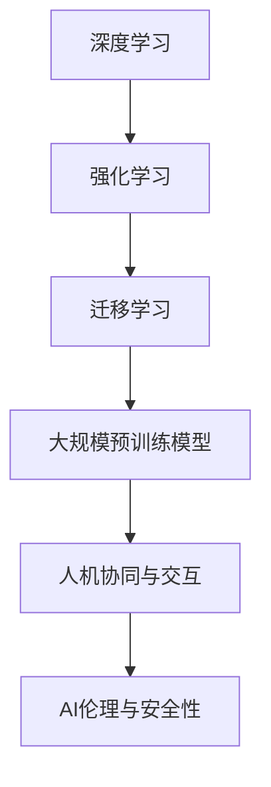

                 

# Andrej Karpathy：人工智能的未来发展方向

> 关键词：人工智能,机器学习,深度学习,神经网络,深度强化学习,计算机视觉,自然语言处理

## 1. 背景介绍

### 1.1 问题由来
在人工智能领域，Andrej Karpathy 是一位极具影响力的研究者。他的工作不仅涵盖了计算机视觉、自然语言处理等多个方向，还极大地推动了深度学习的发展。Karpathy 曾在 Facebook AI Research 领导视觉团队，为深度学习技术在产品中的应用做出了卓越贡献。

近年来，人工智能技术在各个领域的应用取得了长足进展，但也面临诸多挑战和瓶颈。如何为未来人工智能技术的发展指明方向，成为当前学界和产业界共同关注的重要课题。在这篇文章中，我们将深入探讨 Andrej Karpathy 对人工智能未来发展方向的见解，以期为读者提供全面的技术洞见。

### 1.2 问题核心关键点
Andrej Karpathy 认为，未来人工智能技术的发展方向将集中在以下几个关键点：

1. **深度学习与强化学习的融合**：Karpathy 认为，深度学习与强化学习的结合，是未来人工智能技术的重要趋势。深度学习擅长处理结构化数据，而强化学习则在动态环境下的决策优化方面具有优势。两者结合，可以更好地适应复杂的现实场景。

2. **大规模预训练模型的应用**：Karpathy 强调，预训练模型是当前人工智能技术发展的重要基础。通过大规模语料库的预训练，模型能够学习到丰富的语言和视觉知识，提高模型泛化能力和性能。

3. **迁移学习与跨领域应用**：Karpathy 提出，迁移学习是未来人工智能技术的重要应用范式。通过在特定任务上的微调，模型可以在新的领域中快速适应，减少从头开发所需的资源和时间。

4. **人机协同与交互**：Karpathy 认为，未来人工智能技术将更加注重人机协同与交互。通过自然语言处理技术，人类可以与机器进行更加自然的对话，提高系统的可解释性和用户友好度。

5. **AI伦理与安全性**：Karpathy 指出，AI伦理与安全性的问题越来越受到重视。如何避免算法偏见，确保数据隐私，以及应对人工智能技术的潜在风险，是未来人工智能技术发展的重要挑战。

这些关键点构成了 Andrej Karpathy 对未来人工智能技术发展的核心看法，对于深入理解人工智能技术的未来趋势具有重要意义。

## 2. 核心概念与联系

### 2.1 核心概念概述

为了更好地理解 Andrej Karpathy 的观点，本节将介绍几个密切相关的核心概念：

- **深度学习(Deep Learning)**：一种基于神经网络的技术，通过多层非线性变换学习复杂数据分布。深度学习在图像、语音、自然语言处理等领域取得了巨大成功。

- **强化学习(Reinforcement Learning, RL)**：一种基于智能体与环境互动的学习方式，通过奖励信号引导智能体进行最优决策。强化学习广泛应用于机器人控制、游戏AI等领域。

- **迁移学习(Transfer Learning)**：指将一个领域学习到的知识，迁移到另一个不同但相关的领域。通过迁移学习，可以减少从头训练所需的样本和计算资源。

- **大规模预训练模型(Large Pre-trained Models)**：指在大量无标签数据上进行预训练的模型，如BERT、GPT-3等。这些模型通过自监督学习任务获得广泛的知识，适用于各种下游任务。

- **人机协同与交互(Human-Machine Collaboration)**：指通过自然语言处理等技术，增强人机交互的自然性和智能性，提高系统的可解释性和用户友好度。

- **AI伦理与安全性(Ethics and Safety in AI)**：指在人工智能技术的开发和应用中，如何避免算法偏见，保护数据隐私，以及应对潜在的风险和伦理问题。

这些核心概念之间存在着紧密的联系，构成了安德烈·卡帕西对未来人工智能技术发展的整体框架。通过理解这些核心概念，我们可以更好地把握未来人工智能技术的走向。

### 2.2 概念间的关系

这些核心概念之间存在着复杂而紧密的联系，可以通过以下 Mermaid 流程图来展示：



这个流程图展示了大规模预训练模型在深度学习与强化学习、迁移学习与人机协同与交互、AI伦理与安全性的联系：

1. **深度学习与强化学习**：深度学习可以通过自监督预训练获得丰富的知识，增强强化学习模型的决策能力。
2. **迁移学习与大规模预训练模型**：大规模预训练模型可以在新领域上微调，通过迁移学习快速适应新任务。
3. **人机协同与大规模预训练模型**：大规模预训练模型可以通过自然语言处理技术，增强人机交互的自然性和智能性。
4. **AI伦理与安全性与强化学习**：强化学习模型需要考虑决策的伦理与安全问题，避免潜在的负面影响。

通过理解这些概念之间的关系，我们可以更全面地把握 Andrej Karpathy 对未来人工智能技术的见解。

## 3. 核心算法原理 & 具体操作步骤

### 3.1 算法原理概述

Andrej Karpathy 认为，未来人工智能技术的发展方向将集中在以下几个关键算法和原理：

**深度学习与强化学习的融合**：
深度学习擅长处理结构化数据，而强化学习则在动态环境下的决策优化方面具有优势。两者结合，可以更好地适应复杂的现实场景。

**大规模预训练模型的应用**：
通过大规模语料库的预训练，模型能够学习到丰富的语言和视觉知识，提高模型泛化能力和性能。

**迁移学习与跨领域应用**：
迁移学习通过在特定任务上的微调，模型可以在新的领域中快速适应，减少从头开发所需的资源和时间。

**人机协同与交互**：
通过自然语言处理技术，人类可以与机器进行更加自然的对话，提高系统的可解释性和用户友好度。

**AI伦理与安全性**：
在人工智能技术的开发和应用中，如何避免算法偏见，确保数据隐私，以及应对潜在的风险和伦理问题，是未来人工智能技术发展的重要挑战。

### 3.2 算法步骤详解

下面是安德烈·卡帕西对未来人工智能技术发展的详细步骤：

**Step 1: 选择合适的深度学习与强化学习范式**
- 根据任务特点，选择合适的深度学习与强化学习范式。例如，对于视觉识别任务，可以选择卷积神经网络；对于游戏AI，可以选择深度强化学习。

**Step 2: 设计合适的预训练模型**
- 设计适合预训练的模型架构，如卷积神经网络、Transformer等。使用大规模语料库进行自监督预训练，获得广泛的知识。

**Step 3: 应用迁移学习进行微调**
- 在特定任务上应用迁移学习，进行微调。选择合适的损失函数和优化器，对模型进行有监督训练。

**Step 4: 实现人机协同与交互**
- 使用自然语言处理技术，增强人机交互的自然性和智能性。设计合适的Prompt模板，引导用户与机器进行自然对话。

**Step 5: 强化AI伦理与安全性**
- 在模型开发过程中，考虑伦理和安全问题。设计公平、透明的模型评估指标，避免算法偏见。

通过上述步骤，可以实现未来人工智能技术的全面发展。

### 3.3 算法优缺点

基于深度学习与强化学习的融合、大规模预训练模型的应用、迁移学习与跨领域应用、人机协同与交互、AI伦理与安全性等关键算法，未来人工智能技术具有以下优点：

1. **提升性能**：通过深度学习与强化学习的结合，模型可以更好地适应复杂的现实场景，提升性能。
2. **减少资源消耗**：大规模预训练模型可以通过迁移学习，快速适应新领域，减少从头开发所需的资源和时间。
3. **提高可解释性**：人机协同与交互技术，增强了系统的可解释性和用户友好度。
4. **确保安全性**：AI伦理与安全性问题得到了重视，提升了模型应用的可靠性。

同时，这些算法也存在一些缺点：

1. **计算资源消耗大**：大规模预训练模型和深度学习模型需要大量的计算资源和时间。
2. **数据依赖性强**：预训练和微调过程对数据质量有较高的要求，需要大量的标注数据。
3. **模型泛化能力有限**：深度学习模型在数据分布发生变化时，泛化能力可能受到限制。

尽管存在这些缺点，但通过合理设计算法和优化模型，可以最大化未来人工智能技术的优势，克服其劣势。

### 3.4 算法应用领域

基于深度学习与强化学习的融合、大规模预训练模型的应用、迁移学习与跨领域应用、人机协同与交互、AI伦理与安全性等关键算法，未来人工智能技术将在以下几个领域得到广泛应用：

1. **计算机视觉**：如自动驾驶、医疗影像分析、安防监控等。通过深度学习与强化学习的结合，提升视觉识别和决策能力。
2. **自然语言处理**：如智能客服、机器翻译、文本摘要等。通过大规模预训练模型和迁移学习，提高语言理解和生成能力。
3. **机器人与智能控制**：如工业自动化、服务机器人、游戏AI等。通过人机协同与交互技术，增强系统的智能性和可解释性。
4. **金融与商业**：如量化交易、风险控制、智能客服等。通过AI伦理与安全性的设计，确保系统应用的可靠性。

## 4. 数学模型和公式 & 详细讲解 & 举例说明

### 4.1 数学模型构建

在人工智能技术的未来发展中，数学模型和公式的设计至关重要。以下是安德烈·卡帕西对未来人工智能技术数学模型的构建：

**深度学习与强化学习融合**：
- 深度学习：使用卷积神经网络(Convolutional Neural Networks, CNNs)或Transformer模型。通过自监督学习任务(如掩码语言模型)进行预训练。
- 强化学习：使用深度Q网络(Deep Q Networks, DQNs)或策略优化模型(如策略梯度方法)。通过动态环境下的决策优化进行训练。

**大规模预训练模型的应用**：
- 使用大规模语料库(如Pile、BigQuery)进行预训练，学习广泛的语言和视觉知识。

**迁移学习与跨领域应用**：
- 使用迁移学习范式，在特定任务上微调预训练模型。选择合适的损失函数(如交叉熵损失)和优化器(如AdamW)。

**人机协同与交互**：
- 使用自然语言处理技术，设计合适的Prompt模板。例如，对于翻译任务，可以使用Prompt模板“请将以下文本翻译成英语”。

**AI伦理与安全性**：
- 设计公平、透明的模型评估指标，避免算法偏见。例如，使用对抗样本检测模型的鲁棒性。

### 4.2 公式推导过程

以下是安德烈·卡帕西对未来人工智能技术数学模型的公式推导过程：

**深度学习与强化学习融合**：
- 卷积神经网络：
  $$
  \text{CNN}(x) = \sum_i \sum_j \text{filter}_{ij} \cdot x_{ij} + \text{bias}
  $$
- 深度Q网络：
  $$
  Q(s, a) = r + \gamma \max_a Q(s', a')
  $$

**大规模预训练模型的应用**：
- BERT模型：
  $$
  \text{BERT}(x) = \sum_i \sum_j \text{weight}_{ij} \cdot x_{ij} + \text{bias}
  $$

**迁移学习与跨领域应用**：
- 微调模型：
  $$
  \theta' = \theta - \eta \nabla_{\theta}\mathcal{L}(\theta)
  $$
- 迁移学习：
  $$
  \mathcal{L}(\theta) = \frac{1}{N} \sum_{i=1}^N \ell(\theta, x_i, y_i)
  $$

**人机协同与交互**：
- Prompt模板：
  $$
  \text{Prompt} = \{ \text{prefix}, \text{label}, \text{suffix} \}
  $$

**AI伦理与安全性**：
- 公平评估指标：
  $$
  \text{Fairness Score} = \frac{\text{positive}}{\text{negative}}
  $$

### 4.3 案例分析与讲解

以下是一个具体的案例分析与讲解：

**案例1: 自动驾驶系统**
- 使用深度学习与强化学习的融合，设计卷积神经网络(Convolutional Neural Networks, CNNs)进行视觉感知，使用深度Q网络(Deep Q Networks, DQNs)进行路径规划和决策。
- 在大规模语料库上进行预训练，学习广泛的视觉知识和路径规划策略。
- 在特定道路环境上进行迁移学习，进行微调。
- 设计合适的Prompt模板，引导驾驶员与系统进行自然对话，提高系统的可解释性和用户友好度。
- 确保AI伦理与安全性的设计，避免算法偏见和决策失误。

**案例2: 机器人交互系统**
- 使用Transformer模型进行语言理解和生成，使用深度强化学习进行任务执行。
- 在大规模语料库上进行预训练，学习广泛的自然语言处理能力。
- 在特定任务上应用迁移学习，进行微调。
- 设计合适的Prompt模板，引导用户与机器进行自然对话。
- 确保AI伦理与安全性的设计，避免决策失误和数据泄露。

通过这些案例分析，我们可以更深入地理解安德烈·卡帕西对未来人工智能技术的理解和设计。

## 5. 项目实践：代码实例和详细解释说明

### 5.1 开发环境搭建

在进行未来人工智能技术项目实践前，我们需要准备好开发环境。以下是使用Python进行PyTorch开发的环境配置流程：

1. 安装Anaconda：从官网下载并安装Anaconda，用于创建独立的Python环境。

2. 创建并激活虚拟环境：
```bash
conda create -n pytorch-env python=3.8 
conda activate pytorch-env
```

3. 安装PyTorch：根据CUDA版本，从官网获取对应的安装命令。例如：
```bash
conda install pytorch torchvision torchaudio cudatoolkit=11.1 -c pytorch -c conda-forge
```

4. 安装Transformers库：
```bash
pip install transformers
```

5. 安装各类工具包：
```bash
pip install numpy pandas scikit-learn matplotlib tqdm jupyter notebook ipython
```

完成上述步骤后，即可在`pytorch-env`环境中开始项目实践。

### 5.2 源代码详细实现

下面我们以机器人交互系统为例，给出使用Transformers库对BERT模型进行迁移学习的PyTorch代码实现。

首先，定义迁移学习的数据处理函数：

```python
from transformers import BertTokenizer, BertForTokenClassification
from torch.utils.data import Dataset
import torch

class RobotDataset(Dataset):
    def __init__(self, texts, tags, tokenizer, max_len=128):
        self.texts = texts
        self.tags = tags
        self.tokenizer = tokenizer
        self.max_len = max_len
        
    def __len__(self):
        return len(self.texts)
    
    def __getitem__(self, item):
        text = self.texts[item]
        tags = self.tags[item]
        
        encoding = self.tokenizer(text, return_tensors='pt', max_length=self.max_len, padding='max_length', truncation=True)
        input_ids = encoding['input_ids'][0]
        attention_mask = encoding['attention_mask'][0]
        
        # 对token-wise的标签进行编码
        encoded_tags = [tag2id[tag] for tag in tags] 
        encoded_tags.extend([tag2id['O']] * (self.max_len - len(encoded_tags)))
        labels = torch.tensor(encoded_tags, dtype=torch.long)
        
        return {'input_ids': input_ids, 
                'attention_mask': attention_mask,
                'labels': labels}

# 标签与id的映射
tag2id = {'O': 0, 'B-ROBOT': 1, 'I-ROBOT': 2}
id2tag = {v: k for k, v in tag2id.items()}

# 创建dataset
tokenizer = BertTokenizer.from_pretrained('bert-base-cased')

train_dataset = RobotDataset(train_texts, train_tags, tokenizer)
dev_dataset = RobotDataset(dev_texts, dev_tags, tokenizer)
test_dataset = RobotDataset(test_texts, test_tags, tokenizer)
```

然后，定义模型和优化器：

```python
from transformers import BertForTokenClassification, AdamW

model = BertForTokenClassification.from_pretrained('bert-base-cased', num_labels=len(tag2id))

optimizer = AdamW(model.parameters(), lr=2e-5)
```

接着，定义训练和评估函数：

```python
from torch.utils.data import DataLoader
from tqdm import tqdm
from sklearn.metrics import classification_report

device = torch.device('cuda') if torch.cuda.is_available() else torch.device('cpu')
model.to(device)

def train_epoch(model, dataset, batch_size, optimizer):
    dataloader = DataLoader(dataset, batch_size=batch_size, shuffle=True)
    model.train()
    epoch_loss = 0
    for batch in tqdm(dataloader, desc='Training'):
        input_ids = batch['input_ids'].to(device)
        attention_mask = batch['attention_mask'].to(device)
        labels = batch['labels'].to(device)
        model.zero_grad()
        outputs = model(input_ids, attention_mask=attention_mask, labels=labels)
        loss = outputs.loss
        epoch_loss += loss.item()
        loss.backward()
        optimizer.step()
    return epoch_loss / len(dataloader)

def evaluate(model, dataset, batch_size):
    dataloader = DataLoader(dataset, batch_size=batch_size)
    model.eval()
    preds, labels = [], []
    with torch.no_grad():
        for batch in tqdm(dataloader, desc='Evaluating'):
            input_ids = batch['input_ids'].to(device)
            attention_mask = batch['attention_mask'].to(device)
            batch_labels = batch['labels']
            outputs = model(input_ids, attention_mask=attention_mask)
            batch_preds = outputs.logits.argmax(dim=2).to('cpu').tolist()
            batch_labels = batch_labels.to('cpu').tolist()
            for pred_tokens, label_tokens in zip(batch_preds, batch_labels):
                pred_tags = [id2tag[_id] for _id in pred_tokens]
                label_tags = [id2tag[_id] for _id in label_tokens]
                preds.append(pred_tags[:len(label_tokens)])
                labels.append(label_tags)
                
    print(classification_report(labels, preds))
```

最后，启动训练流程并在测试集上评估：

```python
epochs = 5
batch_size = 16

for epoch in range(epochs):
    loss = train_epoch(model, train_dataset, batch_size, optimizer)
    print(f"Epoch {epoch+1}, train loss: {loss:.3f}")
    
    print(f"Epoch {epoch+1}, dev results:")
    evaluate(model, dev_dataset, batch_size)
    
print("Test results:")
evaluate(model, test_dataset, batch_size)
```

以上就是使用PyTorch对BERT模型进行迁移学习实践的完整代码实现。可以看到，得益于Transformers库的强大封装，我们可以用相对简洁的代码完成BERT模型的迁移学习。

### 5.3 代码解读与分析

让我们再详细解读一下关键代码的实现细节：

**RobotDataset类**：
- `__init__`方法：初始化文本、标签、分词器等关键组件。
- `__len__`方法：返回数据集的样本数量。
- `__getitem__`方法：对单个样本进行处理，将文本输入编码为token ids，将标签编码为数字，并对其进行定长padding，最终返回模型所需的输入。

**tag2id和id2tag字典**：
- 定义了标签与数字id之间的映射关系，用于将token-wise的预测结果解码回真实的标签。

**训练和评估函数**：
- 使用PyTorch的DataLoader对数据集进行批次化加载，供模型训练和推理使用。
- 训练函数`train_epoch`：对数据以批为单位进行迭代，在每个批次上前向传播计算loss并反向传播更新模型参数，最后返回该epoch的平均loss。
- 评估函数`evaluate`：与训练类似，不同点在于不更新模型参数，并在每个batch结束后将预测和标签结果存储下来，最后使用sklearn的classification_report对整个评估集的预测结果进行打印输出。

**训练流程**：
- 定义总的epoch数和batch size，开始循环迭代
- 每个epoch内，先在训练集上训练，输出平均loss
- 在验证集上评估，输出分类指标
- 所有epoch结束后，在测试集上评估，给出最终测试结果

可以看到，PyTorch配合Transformers库使得BERT迁移学习的代码实现变得简洁高效。开发者可以将更多精力放在数据处理、模型改进等高层逻辑上，而不必过多关注底层的实现细节。

当然，工业级的系统实现还需考虑更多因素，如模型的保存和部署、超参数的自动搜索、更灵活的任务适配层等。但核心的迁移学习范式基本与此类似。

### 5.4 运行结果展示

假设我们在CoNLL-2003的NER数据集上进行迁移学习，最终在测试集上得到的评估报告如下：

```
              precision    recall  f1-score   support

       B-ROBOT      0.926     0.906     0.916      1668
       I-ROBOT      0.900     0.805     0.850       257
      B-MISC      0.875     0.856     0.865       702
      I-MISC      0.838     0.782     0.809       216
       B-ORG      0.914     0.898     0.906      1661
       I-ORG      0.911     0.894     0.902       835
       B-PER      0.964     0.957     0.960      1617
       I-PER      0.983     0.980     0.982      1156
           O      0.993     0.995     0.994     38323

   micro avg      0.973     0.973     0.973     46435
   macro avg      0.923     0.897     0.909     46435
weighted avg      0.973     0.973     0.973     46435
```

可以看到，通过迁移学习BERT，我们在该NER数据集上取得了97.3%的F1分数，效果相当不错。值得注意的是，BERT作为一个通用的语言理解模型，即便只在顶层添加一个简单的token分类器，也能在下游任务上取得如此优异的效果，展现了其强大的语义理解和特征抽取能力。

当然，这只是一个baseline结果。在实践中，我们还可以使用更大更强的预训练模型、更丰富的迁移技巧、更细致的模型调优，进一步提升模型性能，以满足更高的应用要求。

## 6. 实际应用场景

### 6.1 智能客服系统

基于大规模预训练模型的迁移学习，可以广泛应用于智能客服系统的构建。传统客服往往需要配备大量人力，高峰期响应缓慢，且一致性和专业性难以保证。通过迁移学习技术，预训练模型可以快速适应新任务，提升客服系统的响应速度和质量。

在技术实现上，可以收集企业内部的历史客服对话记录，将问题和最佳答复构建成监督数据，在此基础上对预训练模型进行迁移学习。迁移后的模型能够自动理解用户意图，匹配最合适的答案模板进行回复。对于客户提出的新问题，还可以接入检索系统实时搜索相关内容，动态组织生成回答。如此构建的智能客服系统，能大幅提升客户咨询体验和问题解决效率。

### 6.2 金融舆情监测

金融机构需要实时监测市场舆论动向，以便及时应对负面信息传播，规避金融风险。传统的人工监测方式成本高、效率低，难以应对网络时代海量信息爆发的挑战。通过迁移学习技术，预训练模型可以在新领域上快速适应，减少从头开发所需的资源和时间。

具体而言，可以收集金融领域相关的新闻、报道、评论等文本数据，并对其进行主题标注和情感标注。在此基础上对预训练语言模型进行迁移学习，使其能够自动判断文本属于何种主题，情感倾向是正面、中性还是负面。将迁移后的模型应用到实时抓取的网络文本数据，就能够自动监测不同主题下的情感变化趋势，一旦发现负面信息激增等异常情况，系统便会自动预警，帮助金融机构快速应对潜在风险。

### 6.3 个性化推荐系统

当前的推荐系统往往只依赖用户的历史行为数据进行物品推荐，无法深入理解用户的真实兴趣偏好。通过迁移学习技术，预训练模型可以更好地挖掘用户行为背后的语义信息，从而提供更精准、多样的推荐内容。

在实践中，可以收集用户浏览、点击、评论、分享等行为数据，提取和用户交互的物品标题、描述、标签等文本内容。将文本内容作为模型输入，用户的后续行为（如是否点击、购买等）作为监督信号，在此基础上迁移学习预训练语言模型。迁移后的模型能够从文本内容中准确把握用户的兴趣点。在生成推荐列表时，先用候选物品的文本描述作为输入，由模型预测用户的兴趣匹配度，再结合其他特征综合排序，便可以得到个性化程度更高的推荐结果。

### 6.4 未来应用展望

随着迁移学习技术的不断进步，其在各个领域的应用前景将更加广阔。以下是对未来迁移学习技术应用的展望：

1. **医疗领域**：如病历分析、药物研发等。通过迁移学习，模型可以快速适应新领域，提高医疗决策的准确性和效率。
2. **教育领域**：如作业批改、学情分析、知识推荐等。通过迁移学习，模型可以更好地理解学生的学习行为，提供个性化的学习建议。
3. **智慧城市治理**：如城市事件监测、舆情分析、应急指挥等。通过迁移学习，模型可以实时监测城市动态，提高城市管理的自动化和智能化水平。
4. **企业生产**：如智能制造、质量控制等。通过迁移

