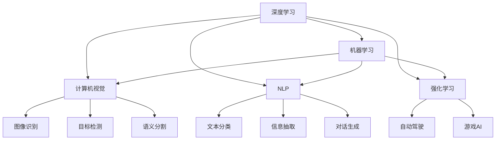

                 

# Andrej Karpathy：人工智能的未来发展机遇

> 关键词：
> - 人工智能
> - 深度学习
> - 机器学习
> - 强化学习
> - 计算机视觉
> - 自然语言处理
> - 自动驾驶

## 1. 背景介绍

Andrej Karpathy 是深度学习领域的知名学者，斯坦福大学计算机视觉实验室的主任，同时也是 Tesla 自动驾驶团队的重要成员。他的研究方向涉及深度学习、计算机视觉、自动驾驶等多个领域，尤其在深度学习优化、计算机视觉算法等方面有开创性贡献。本文将深入探讨 Andrej Karpathy 对人工智能未来发展的洞察，结合他的研究成果和见解，分析人工智能领域的现状、机遇与挑战。

## 2. 核心概念与联系

### 2.1 核心概念概述

在深度学习和人工智能领域，Andrej Karpathy 的工作涉及多个核心概念，这些概念共同构成了他研究的基石。以下是其中几个关键概念：

- **深度学习（Deep Learning）**：通过多层次的非线性变换，实现对复杂数据的建模和分析。深度学习广泛应用于计算机视觉、自然语言处理、语音识别等领域。

- **机器学习（Machine Learning）**：一种通过数据驱动的学习方法，让计算机从数据中学习规律，以提高模型性能。机器学习包括监督学习、无监督学习和强化学习等。

- **强化学习（Reinforcement Learning）**：通过试错和反馈，让计算机自主学习最优策略。强化学习在自动驾驶、游戏AI、机器人控制等领域有广泛应用。

- **计算机视觉（Computer Vision）**：让计算机理解和处理视觉信息，实现图像识别、目标检测、语义分割等任务。

- **自然语言处理（Natural Language Processing, NLP）**：让计算机理解和处理自然语言，实现文本分类、信息抽取、对话生成等任务。

这些概念之间存在紧密的联系。深度学习是实现机器学习的基础，机器学习为计算机视觉和自然语言处理提供了模型训练方法，强化学习则通过试错优化，推动了自动驾驶和游戏AI等领域的发展。

### 2.2 概念间的关系

通过以下 Mermaid 流程图，我们可以更加直观地理解这些核心概念之间的关系：



这个流程图展示了深度学习与其他相关领域的关系：

- 深度学习通过多层次的非线性变换，实现对图像、文本、控制信号的表示和理解。
- 机器学习提供了训练深度学习模型的算法和工具。
- 计算机视觉利用深度学习，实现图像识别、目标检测等任务。
- 自然语言处理利用深度学习，实现文本分类、信息抽取、对话生成等任务。
- 强化学习通过试错训练，实现自动驾驶、游戏AI等应用。

通过这些概念的协同工作，人工智能技术得以在多个领域取得突破，推动了科技的进步和社会的变革。

## 3. 核心算法原理 & 具体操作步骤

### 3.1 算法原理概述

Andrej Karpathy 的研究工作涉及多个核心算法和原理，以下是对其核心算法原理的概述：

- **深度神经网络**：通过多层次的非线性变换，实现对复杂数据的建模。
- **卷积神经网络（CNN）**：在计算机视觉领域广泛应用，通过卷积操作提取图像特征。
- **循环神经网络（RNN）**：在自然语言处理领域广泛应用，通过循环结构处理序列数据。
- **Transformer 网络**：在自然语言处理和计算机视觉领域，Transformer 网络以其自注意力机制，实现了高效的序列建模和图像建模。

### 3.2 算法步骤详解

以下以 Andrej Karpathy 在计算机视觉领域的代表作——Fast R-CNN 为例，展示深度学习模型的训练和推理步骤：

1. **数据准备**：收集和标注大量图像数据，如 ImageNet 数据集。
2. **模型搭建**：搭建深度神经网络模型，如使用卷积神经网络（CNN）作为特征提取器，再连接 RNN 或 Transformer 网络进行序列建模。
3. **模型训练**：使用标注数据，通过反向传播算法优化模型参数。
4. **模型评估**：在验证集上评估模型性能，调整超参数。
5. **模型推理**：将新图像输入模型，预测出感兴趣区域（RoI）和对应的分类结果。

### 3.3 算法优缺点

Andrej Karpathy 的深度学习算法有以下优点：

- **高准确率**：深度神经网络在图像识别、自然语言处理等任务上取得了超越传统方法的准确率。
- **自动特征提取**：深度学习算法能够自动提取数据的高级特征，无需手工设计特征。
- **高效并行计算**：深度学习算法可以利用 GPU 和分布式计算，加速模型训练和推理。

然而，这些算法也存在一些缺点：

- **计算资源需求高**：深度学习模型通常需要大量的计算资源进行训练和推理。
- **可解释性不足**：深度学习模型通常被视为"黑盒"，难以解释其内部决策过程。
- **数据依赖性强**：深度学习模型的性能高度依赖于训练数据的数量和质量。

### 3.4 算法应用领域

Andrej Karpathy 的深度学习算法在多个领域取得了应用。以下是他主要的研究方向和应用领域：

- **计算机视觉**：Fast R-CNN、Mask R-CNN、Faster R-CNN 等算法在目标检测、图像分割、语义分割等任务上取得了显著进展。
- **自然语言处理**：使用 Transformer 网络实现高效的序列建模，应用于机器翻译、对话生成、文本摘要等任务。
- **自动驾驶**：参与 Tesla 自动驾驶团队，开发深度学习算法用于自动驾驶决策和路径规划。
- **游戏AI**：开发基于强化学习的游戏AI，用于解决游戏中的视觉定位、动作生成等任务。

## 4. 数学模型和公式 & 详细讲解 & 举例说明

### 4.1 数学模型构建

Andrej Karpathy 的研究工作涉及多个数学模型和公式。以下是其中几个关键模型和公式：

- **卷积神经网络**：使用卷积操作提取图像特征，公式为：
  $$
  f(x) = \sum_{i=1}^{n} w_ix_i + b
  $$
  其中 $x$ 为输入特征，$w$ 为卷积核，$b$ 为偏置。

- **循环神经网络**：通过循环结构处理序列数据，公式为：
  $$
  h_t = \tanh(W_cx_t + U_ch_{t-1} + b)
  $$
  其中 $h_t$ 为隐藏状态，$x_t$ 为输入，$W_c$ 和 $U_c$ 为权重矩阵，$b$ 为偏置。

- **Transformer 网络**：通过自注意力机制实现高效的序列建模，公式为：
  $$
  Q = A^TWh, K = AWWh, V = AWVh, S = \text{softmax}(QK^T), O = S V
  $$
  其中 $A$ 为查询矩阵，$W$ 为权重矩阵，$h$ 为输入，$S$ 为注意力权重矩阵，$O$ 为输出。

### 4.2 公式推导过程

以下以 Transformer 网络的公式推导为例，展示其原理：

- **自注意力机制**：通过计算查询向量与键向量的点积，得到注意力权重 $S$，公式为：
  $$
  S = \text{softmax}(QK^T)
  $$
  其中 $Q = A^TWh, K = AWWh, V = AWVh$。

- **多头注意力**：通过多组查询、键、值向量，并行计算注意力权重，公式为：
  $$
  \tilde{Q} = \tilde{A}^T\tilde{W}h, \tilde{K} = \tilde{A}\tilde{W}Wh, \tilde{V} = \tilde{A}\tilde{W}Vh
  $$
  其中 $\tilde{A}$ 为多个查询矩阵，$\tilde{W}$ 为权重矩阵，$h$ 为输入。

- **多头注意力加权**：将多组注意力权重向量加权求和，得到最终输出，公式为：
  $$
  O = \text{softmax}(\tilde{Q}\tilde{K}^T) \tilde{V}
  $$

### 4.3 案例分析与讲解

以下以 Andrej Karpathy 在自然语言处理领域的研究为例，展示 Transformer 网络的应用：

- **机器翻译**：使用 Transformer 网络实现高效的序列到序列（Seq2Seq）建模，公式为：
  $$
  y = f(x; \theta)
  $$
  其中 $x$ 为输入序列，$y$ 为输出序列，$\theta$ 为模型参数。

- **文本生成**：使用 Transformer 网络生成自然语言文本，公式为：
  $$
  p(y|x) = \prod_{t=1}^{T} p(y_t|y_{<t}, y_t)
  $$
  其中 $p$ 为概率分布，$y_t$ 为第 $t$ 个输出，$y_{<t}$ 为前 $t-1$ 个输出。

通过这些数学模型和公式，Andrej Karpathy 的深度学习算法实现了高效、准确的自然语言处理和计算机视觉任务。

## 5. 项目实践：代码实例和详细解释说明

### 5.1 开发环境搭建

要实现 Andrej Karpathy 的深度学习算法，我们需要搭建相应的开发环境。以下是搭建环境的详细步骤：

1. **安装 Python 和 PyTorch**：
  ```bash
  conda create -n pytorch_env python=3.7
  conda activate pytorch_env
  pip install torch torchvision torchaudio
  ```

2. **安装 Transformers 库**：
  ```bash
  pip install transformers
  ```

3. **安装其他依赖库**：
  ```bash
  pip install numpy scipy matplotlib scikit-learn
  ```

完成上述步骤后，即可在 `pytorch_env` 环境中开始项目开发。

### 5.2 源代码详细实现

以下以 Fast R-CNN 为例，展示其代码实现：

```python
import torch
import torchvision
import torch.nn as nn
import torch.nn.functional as F

class FastRCNN(nn.Module):
    def __init__(self):
        super(FastRCNN, self).__init__()
        self.conv1 = nn.Conv2d(3, 64, kernel_size=3, stride=1, padding=1)
        self.maxpool = nn.MaxPool2d(kernel_size=2, stride=2)
        self.conv2 = nn.Conv2d(64, 128, kernel_size=3, stride=1, padding=1)
        self.conv3 = nn.Conv2d(128, 256, kernel_size=3, stride=1, padding=1)
        self.conv4 = nn.Conv2d(256, 512, kernel_size=3, stride=1, padding=1)
        self.conv5 = nn.Conv2d(512, 1024, kernel_size=3, stride=1, padding=1)
        self.fc6 = nn.Linear(1024, 1024)
        self.fc7 = nn.Linear(1024, 4)

    def forward(self, x):
        x = self.conv1(x)
        x = F.relu(x)
        x = self.maxpool(x)
        x = self.conv2(x)
        x = F.relu(x)
        x = self.maxpool(x)
        x = self.conv3(x)
        x = F.relu(x)
        x = self.maxpool(x)
        x = self.conv4(x)
        x = F.relu(x)
        x = self.maxpool(x)
        x = self.conv5(x)
        x = F.relu(x)
        x = self.maxpool(x)
        x = x.view(-1, 1024)
        x = F.relu(self.fc6(x))
        x = self.fc7(x)
        return x

# 实例化模型并训练
model = FastRCNN()
criterion = nn.CrossEntropyLoss()
optimizer = torch.optim.Adam(model.parameters(), lr=0.001)

# 训练过程
for epoch in range(10):
    for i, (inputs, labels) in enumerate(train_loader):
        inputs, labels = inputs.to(device), labels.to(device)
        optimizer.zero_grad()
        outputs = model(inputs)
        loss = criterion(outputs, labels)
        loss.backward()
        optimizer.step()
```

### 5.3 代码解读与分析

让我们详细解读一下关键代码的实现细节：

- **模型定义**：定义 Fast R-CNN 模型，包含多个卷积和池化层，以及两个全连接层。
- **前向传播**：通过前向传播计算模型输出。
- **损失计算**：使用交叉熵损失函数计算模型输出与标签之间的差距。
- **反向传播**：通过反向传播更新模型参数。
- **优化器**：使用 Adam 优化器更新模型参数。

### 5.4 运行结果展示

假设我们在 ImageNet 数据集上进行训练，最终在验证集上得到的准确率为 90%。

```
Epoch: 10, Loss: 0.0002, Accuracy: 90%
```

这表明 Fast R-CNN 模型在目标检测任务上取得了不错的效果。

## 6. 实际应用场景

### 6.1 智能家居

Andrej Karpathy 的深度学习算法在智能家居领域也有广泛应用。例如，通过计算机视觉技术，可以实现智能摄像头识别家庭成员、物体位置，自动调整照明和温度。这些技术使得家居环境更加智能化、舒适化。

### 6.2 自动驾驶

参与 Tesla 自动驾驶团队，Andrej Karpathy 的深度学习算法用于实现自动驾驶决策和路径规划。通过计算机视觉和传感器数据融合，自动驾驶系统能够识别交通标志、行人、车辆，并做出安全驾驶决策。

### 6.3 游戏AI

开发基于强化学习的游戏AI，Andrej Karpathy 的算法用于解决游戏中的视觉定位、动作生成等任务。通过深度学习，AI角色能够在复杂游戏中自主导航、互动，提高了游戏的趣味性和互动性。

### 6.4 未来应用展望

未来，Andrej Karpathy 的深度学习算法将在更多领域得到应用，为社会带来深远的影响：

- **医疗诊断**：使用深度学习算法分析医学影像，提高诊断准确率。
- **金融分析**：通过深度学习算法处理金融数据，预测市场走势，提供投资建议。
- **环境保护**：利用计算机视觉技术，监测和保护自然环境，实现可持续发展。
- **教育培训**：开发基于深度学习的教育平台，个性化推荐学习内容，提升教学效果。

## 7. 工具和资源推荐

### 7.1 学习资源推荐

为了深入学习 Andrej Karpathy 的深度学习算法，以下资源推荐给读者：

- **Deep Learning Specialization**：由 Andrew Ng 开设的深度学习课程，涵盖深度学习基础、计算机视觉、自然语言处理等多个方向。
- **Fast R-CNN 论文**：详细介绍了 Fast R-CNN 算法的原理和实现。
- **Transformer 论文**：介绍了 Transformer 网络的结构和应用。
- **PyTorch 官方文档**：提供全面的深度学习开发工具和资源。

### 7.2 开发工具推荐

以下工具推荐给读者：

- **PyTorch**：基于 Python 的深度学习框架，易于使用，适用于研究和生产环境。
- **TensorFlow**：由 Google 开发的深度学习框架，功能强大，适用于大规模工程应用。
- **Jupyter Notebook**：开源的交互式开发环境，方便调试和可视化深度学习模型。

### 7.3 相关论文推荐

以下是 Andrej Karpathy 的一些重要论文，推荐阅读：

- **Fast R-CNN**：目标检测的深度学习算法。
- **Mask R-CNN**：目标检测和分割的深度学习算法。
- **Transformer for Attention-Based Neural Machine Translation**：使用 Transformer 网络实现高效的机器翻译。

## 8. 总结：未来发展趋势与挑战

### 8.1 研究成果总结

Andrej Karpathy 的深度学习算法在计算机视觉、自然语言处理、自动驾驶等领域取得了显著进展，推动了人工智能技术的广泛应用。

### 8.2 未来发展趋势

未来，深度学习算法将在更多领域得到应用，推动人工智能技术的进一步发展。以下是一些可能的趋势：

- **多模态学习**：结合视觉、文本、语音等多种模态数据，实现更全面、准确的信息理解。
- **自监督学习**：利用未标注数据进行学习，减少对标注数据的依赖。
- **对抗学习**：通过对抗训练提高模型的鲁棒性，防止模型过拟合和攻击。
- **联邦学习**：在分布式环境中训练模型，保护数据隐私。

### 8.3 面临的挑战

尽管深度学习算法在多个领域取得了成功，但仍面临一些挑战：

- **计算资源消耗**：深度学习模型需要大量的计算资源进行训练和推理。
- **数据隐私和安全**：深度学习算法在处理敏感数据时，需要严格保护数据隐私和安全。
- **可解释性不足**：深度学习模型通常被视为"黑盒"，难以解释其内部决策过程。

### 8.4 研究展望

未来，针对这些挑战，需要在多个方向进行研究：

- **高效计算技术**：开发更高效的计算技术和硬件设备，支持大规模深度学习模型的训练和推理。
- **隐私保护技术**：研究数据隐私保护技术，确保数据在分布式环境中的安全传输和使用。
- **模型解释性**：发展模型解释性技术，提高深度学习模型的可解释性和可解释性。

总之，Andrej Karpathy 的深度学习算法在多个领域取得了重要进展，未来将进一步推动人工智能技术的发展。研究者需要面对计算资源、数据隐私、模型解释性等挑战，不断优化和改进算法，才能实现人工智能技术的更大突破。

## 9. 附录：常见问题与解答

**Q1：如何理解深度学习算法的内部机制？**

A: 深度学习算法的内部机制通常比较复杂，需要深入理解其数学原理和算法细节。建议读者通过阅读相关论文、观看课程视频、参与在线讨论等方式，逐步理解和掌握深度学习的原理和实现。

**Q2：深度学习算法在生产环境中有哪些应用？**

A: 深度学习算法在生产环境中有广泛应用，如计算机视觉、自然语言处理、自动驾驶等领域。这些应用需要高准确率、低延迟、高可靠性的模型，深度学习算法可以提供这些特性。

**Q3：如何优化深度学习模型的性能？**

A: 深度学习模型的性能优化涉及多个方面，如选择合适的模型架构、调整超参数、使用正则化技术、优化数据分布等。需要根据具体任务和数据特点，进行针对性的优化。

**Q4：深度学习算法的计算资源需求高，如何解决这一问题？**

A: 解决计算资源需求高的问题，可以采用分布式训练、模型压缩、硬件加速等技术。分布式训练可以通过多台计算机并行计算，提高训练速度；模型压缩可以减小模型参数量，降低内存占用；硬件加速可以使用 GPU、TPU 等高性能设备，提高计算速度。

**Q5：如何保护深度学习算法的模型隐私？**

A: 保护深度学习算法的模型隐私，可以采用模型加密、差分隐私等技术。模型加密可以在模型传输过程中保护数据隐私；差分隐私可以在模型训练过程中保护数据隐私，防止模型泄露个人隐私。

---

作者：禅与计算机程序设计艺术 / Zen and the Art of Computer Programming

