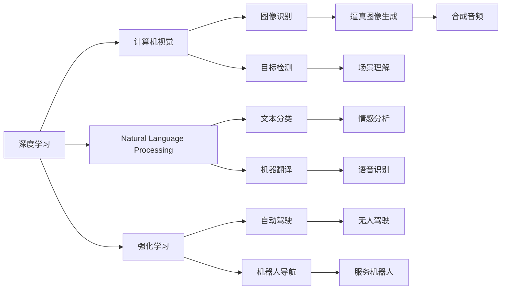

                 

# Andrej Karpathy：人工智能的未来发展机遇

## 1. 背景介绍

**1.1 作者背景**
Andrej Karpathy 是人工智能领域的知名专家，在深度学习、计算机视觉、自动驾驶等多个领域都有着卓越的贡献。他是Stanford大学的教授，也是NVIDIA的AI总监，推动了深度学习技术在自动驾驶、计算机视觉等方面的应用。

**1.2 研究背景**
当前，人工智能正处于快速发展期，尤其是深度学习和自然语言处理等领域的突破，正在重塑各行各业。Andrej Karpathy 在多个公开场合讨论了人工智能的未来发展机遇，深入探讨了技术的挑战、应用场景和潜在的社会影响。

**1.3 研究目的**
本文旨在全面总结 Andrej Karpathy 对人工智能未来发展机遇的见解，帮助读者了解当前人工智能领域的前沿技术和应用前景，并为未来的研究和实践提供指导。

## 2. 核心概念与联系

### 2.1 核心概念概述

在探讨人工智能的未来发展机遇之前，我们需要先了解一些核心概念：

**深度学习(Deep Learning)**：一种模拟人脑神经网络的学习方法，通过大量数据和计算资源训练模型，实现对复杂模式的自动学习和特征提取。

**计算机视觉(Computer Vision)**：通过计算机理解和处理视觉信息的技术，如图像识别、目标检测、场景理解等。

**自动驾驶(Autonomous Driving)**：利用人工智能技术实现车辆自主导航和决策，最终达到无人驾驶。

**强化学习(Reinforcement Learning)**：通过智能体与环境的交互，优化决策策略，使其最大化长期奖励。

**自然语言处理(Natural Language Processing, NLP)**：使计算机能够理解、处理和生成人类语言的技术，包括文本分类、机器翻译、情感分析等。

**生成对抗网络(Generative Adversarial Networks, GANs)**：由生成器和判别器组成的对抗性训练框架，用于生成逼真的图像、音频等。

**语音识别(Speech Recognition)**：将语音信号转化为文本或命令的技术，广泛应用于语音助手、智能家居等场景。

这些概念构成了人工智能领域的核心技术栈，而Andrej Karpathy 的研究则主要集中在深度学习、计算机视觉和自动驾驶等领域。

### 2.2 核心概念的联系

这些核心概念之间存在着紧密的联系。例如，深度学习技术为计算机视觉和自然语言处理提供了强有力的支持，而强化学习则为自动驾驶和机器人导航提供了重要的决策机制。同时，生成对抗网络在图像生成、语音合成等领域也有广泛应用。

以下是一个Mermaid流程图，展示了这些核心概念之间的关系：



这个流程图展示了核心概念之间的主要联系，帮助读者理解这些技术如何相互协作，推动人工智能的发展。

## 3. 核心算法原理 & 具体操作步骤

### 3.1 算法原理概述

**深度学习**：通过多层神经网络结构，对输入数据进行特征提取和模式学习，从而实现对复杂问题的自动解决。深度学习的核心在于反向传播算法，通过误差梯度不断调整网络参数，最小化预测误差。

**计算机视觉**：利用深度学习技术，对图像和视频进行特征提取、目标检测、图像分割等处理。常用的计算机视觉模型包括卷积神经网络(CNN)、区域卷积神经网络(R-CNN)等。

**自动驾驶**：利用深度学习技术和计算机视觉技术，实现车辆对道路环境的感知、路径规划和决策。自动驾驶系统通常包括感知、决策和执行三个部分，其中感知部分依赖于计算机视觉技术。

**强化学习**：通过智能体与环境的交互，学习最优决策策略。常用的强化学习算法包括Q-learning、策略梯度等。

**自然语言处理**：利用深度学习技术，对文本进行分词、词性标注、情感分析等处理。常用的NLP模型包括循环神经网络(RNN)、Transformer等。

### 3.2 算法步骤详解

**深度学习算法步骤**：
1. 数据准备：收集、标注数据集，划分为训练集和测试集。
2. 模型构建：设计神经网络结构，包括输入层、隐藏层和输出层。
3. 模型训练：使用反向传播算法，更新模型参数，最小化预测误差。
4. 模型评估：在测试集上评估模型性能，调整模型参数，优化模型结构。

**计算机视觉算法步骤**：
1. 数据准备：收集、标注图像和视频数据集，划分为训练集和测试集。
2. 模型构建：设计卷积神经网络(CNN)结构，包括卷积层、池化层和全连接层。
3. 模型训练：使用反向传播算法，更新模型参数，最小化预测误差。
4. 模型评估：在测试集上评估模型性能，调整模型参数，优化模型结构。

**自动驾驶算法步骤**：
1. 数据准备：收集道路环境数据，包括传感器数据、地图数据等。
2. 感知模块：利用计算机视觉技术，对道路环境进行感知，识别车辆、行人、交通标志等。
3. 决策模块：利用强化学习算法，根据感知结果，规划车辆路径，做出驾驶决策。
4. 执行模块：根据决策模块的指令，控制车辆加速、刹车、转向等操作。

**强化学习算法步骤**：
1. 环境定义：定义环境状态和动作空间，例如车辆在道路上的位置、速度和方向。
2. 智能体设计：设计智能体的状态更新和动作选择算法，例如使用深度Q网络(DQN)进行状态预测和动作选择。
3. 环境交互：智能体在环境中不断探索，通过感知模块收集环境反馈，调整动作策略。
4. 策略优化：使用奖励函数，评估智能体的性能，优化决策策略。

**自然语言处理算法步骤**：
1. 数据准备：收集、标注文本数据集，划分为训练集和测试集。
2. 模型构建：设计循环神经网络(RNN)或Transformer结构，对文本进行编码和解码。
3. 模型训练：使用反向传播算法，更新模型参数，最小化预测误差。
4. 模型评估：在测试集上评估模型性能，调整模型参数，优化模型结构。

### 3.3 算法优缺点

**深度学习**：优点是能够自动学习特征，适用于复杂模式识别任务；缺点是模型复杂度高，需要大量数据和计算资源。

**计算机视觉**：优点是能够实现高精度的图像识别和目标检测；缺点是对数据质量敏感，需要高质量的标注数据。

**自动驾驶**：优点是能够实现自主导航，提高交通效率和安全性；缺点是技术复杂度高，需要多传感器融合和实时决策。

**强化学习**：优点是能够通过交互式学习优化决策策略，适用于多变量决策问题；缺点是对环境建模要求高，需要大量的训练数据和计算资源。

**自然语言处理**：优点是能够实现高精度的文本分类和情感分析；缺点是对语言多样性和歧义性敏感，需要大量文本数据和标注。

### 3.4 算法应用领域

**深度学习**：广泛应用于图像识别、语音识别、自然语言处理等领域，推动了诸多应用场景的创新。

**计算机视觉**：应用于智能监控、医学影像分析、自动驾驶等领域，提高了数据处理和决策的准确性。

**自动驾驶**：应用于无人驾驶、自动驾驶汽车、物流配送等领域，推动了交通运输的智能化和自动化。

**强化学习**：应用于游戏AI、机器人导航、金融交易等领域，提升了系统的智能性和决策效率。

**自然语言处理**：应用于机器翻译、情感分析、智能问答等领域，提高了文本处理的自动化和智能化水平。

## 4. 数学模型和公式 & 详细讲解 & 举例说明

### 4.1 数学模型构建

**深度学习模型**：
假设输入数据为 $x$，模型参数为 $\theta$，输出为 $y$，则常用的损失函数为均方误差损失函数，定义如下：
$$
L(\theta) = \frac{1}{n}\sum_{i=1}^n(y_i - \hat{y}_i)^2
$$
其中 $\hat{y}_i$ 为模型对样本 $x_i$ 的预测输出。

**计算机视觉模型**：
常用的卷积神经网络模型结构如图1所示。模型由多个卷积层、池化层和全连接层组成，每个层的作用分别是特征提取、降维和分类。


**自动驾驶模型**：
自动驾驶系统通常包括感知、决策和执行三个部分。感知模块使用计算机视觉技术，对道路环境进行感知和识别；决策模块使用强化学习算法，根据感知结果，规划车辆路径；执行模块根据决策模块的指令，控制车辆加速、刹车、转向等操作。

**强化学习模型**：
常用的Q-learning算法如下：
$$
Q(s,a) = Q(s,a) + \alpha(r + \gamma\max_{a'}Q(s',a') - Q(s,a))
$$
其中 $Q(s,a)$ 为状态-动作价值函数，$\alpha$ 为学习率，$r$ 为即时奖励，$s'$ 为下一个状态，$\gamma$ 为折扣因子。

**自然语言处理模型**：
常用的循环神经网络模型结构如图2所示。模型由一个循环层和一个全连接层组成，循环层负责对输入序列进行编码，全连接层负责对编码结果进行解码。


### 4.2 公式推导过程

**深度学习公式推导**：
深度学习模型中的反向传播算法可以推导如下：
$$
\frac{\partial L}{\partial w_{ij}} = \frac{\partial L}{\partial z_j} \cdot \frac{\partial z_j}{\partial w_{ij}} = \frac{\partial L}{\partial z_j} \cdot \frac{\partial z_j}{\partial w_{ij}}
$$
其中 $w_{ij}$ 为权重矩阵，$z_j$ 为隐层输出。

**计算机视觉公式推导**：
卷积神经网络中的卷积操作可以推导如下：
$$
F(x) = \frac{1}{n}\sum_{i=1}^n w_i f_i(x)
$$
其中 $x$ 为输入数据，$w_i$ 为卷积核权重，$f_i(x)$ 为卷积核在输入数据上的卷积操作。

**自动驾驶公式推导**：
自动驾驶系统中的路径规划算法可以推导如下：
$$
\min_{\delta} L(s,\delta) = \sum_{t=0}^T r_t + \beta \sum_{t=1}^T |v_t - v_{t-1}|
$$
其中 $\delta$ 为控制指令，$L(s,\delta)$ 为路径规划损失函数，$r_t$ 为即时奖励，$v_t$ 为车辆速度。

**强化学习公式推导**：
Q-learning算法中的状态-动作价值函数可以推导如下：
$$
Q(s,a) = \alpha(r + \gamma Q(s',a') - Q(s,a))
$$
其中 $s'$ 为下一个状态，$a'$ 为下一个动作，$\alpha$ 为学习率。

**自然语言处理公式推导**：
循环神经网络中的循环操作可以推导如下：
$$
h_t = \sigma(W \cdot [h_{t-1}, x_t]) \cdot U
$$
其中 $h_t$ 为循环层输出，$\sigma$ 为激活函数，$x_t$ 为输入数据。

### 4.3 案例分析与讲解

**深度学习案例**：
以ImageNet图像识别为例，使用深度学习模型对图像进行分类。首先收集和标注ImageNet数据集，然后设计一个卷积神经网络模型，在训练集上训练模型，并在测试集上评估模型性能。通过反向传播算法不断调整模型参数，最小化预测误差，最终得到高精度的图像分类模型。

**计算机视觉案例**：
以医学影像分析为例，使用计算机视觉技术对医学影像进行自动检测和分类。首先收集和标注医学影像数据集，然后设计一个卷积神经网络模型，在训练集上训练模型，并在测试集上评估模型性能。通过反向传播算法不断调整模型参数，最小化预测误差，最终得到高精度的医学影像分类模型。

**自动驾驶案例**：
以自动驾驶汽车为例，使用自动驾驶技术实现车辆自主导航和决策。首先收集和标注道路环境数据，然后设计一个感知模块和一个决策模块，在模拟环境中训练模型，并在实际道路上测试模型性能。通过强化学习算法不断调整决策策略，最小化路径规划误差，最终得到高精度的自动驾驶系统。

**强化学习案例**：
以游戏AI为例，使用强化学习算法训练一个智能体，使其能够在游戏中做出最优决策。首先定义游戏环境状态和动作空间，然后设计一个智能体，使用Q-learning算法不断调整状态-动作价值函数，最小化即时奖励，最终得到高精度的游戏AI。

**自然语言处理案例**：
以机器翻译为例，使用自然语言处理技术实现中英文翻译。首先收集和标注中英文对照数据集，然后设计一个循环神经网络模型，在训练集上训练模型，并在测试集上评估模型性能。通过反向传播算法不断调整模型参数，最小化预测误差，最终得到高精度的机器翻译模型。

## 5. 项目实践：代码实例和详细解释说明

### 5.1 开发环境搭建

在实际项目实践中，开发环境搭建是关键步骤。以下是一些常用的开发环境搭建步骤：

**1. 安装Python**：在开发环境中安装Python 3.8，使用Anaconda或Miniconda进行安装。

**2. 安装PyTorch**：使用pip安装PyTorch库，版本为1.8.0。

**3. 安装TensorFlow**：使用pip安装TensorFlow库，版本为2.7.0。

**4. 安装NumPy**：使用pip安装NumPy库，版本为1.19.3。

**5. 安装Matplotlib**：使用pip安装Matplotlib库，版本为3.3.4。

**6. 安装scikit-learn**：使用pip安装scikit-learn库，版本为0.24.2。

**7. 安装TensorBoard**：使用pip安装TensorBoard库，版本为2.7.0。

### 5.2 源代码详细实现

以下是一些典型的深度学习模型代码实现示例：

**深度学习模型代码**：
```python
import torch
import torch.nn as nn
import torch.optim as optim

class CNN(nn.Module):
    def __init__(self):
        super(CNN, self).__init__()
        self.conv1 = nn.Conv2d(3, 32, 3)
        self.pool = nn.MaxPool2d(2, 2)
        self.fc1 = nn.Linear(32 * 6 * 6, 128)
        self.fc2 = nn.Linear(128, 10)

    def forward(self, x):
        x = self.pool(torch.relu(self.conv1(x)))
        x = x.view(-1, 32 * 6 * 6)
        x = self.pool(torch.relu(self.fc1(x)))
        x = self.fc2(x)
        return x

model = CNN()
criterion = nn.CrossEntropyLoss()
optimizer = optim.SGD(model.parameters(), lr=0.001, momentum=0.9)
```

**计算机视觉模型代码**：
```python
import torch
import torch.nn as nn
import torch.optim as optim
import torchvision.transforms as transforms
import torchvision.datasets as datasets

class ResNet(nn.Module):
    def __init__(self):
        super(ResNet, self).__init__()
        self.conv1 = nn.Conv2d(3, 64, kernel_size=3, stride=1, padding=1)
        self.conv2 = nn.Conv2d(64, 128, kernel_size=3, stride=1, padding=1)
        self.fc = nn.Linear(128 * 8 * 8, 10)

    def forward(self, x):
        x = self.conv1(x)
        x = torch.relu(x)
        x = self.conv2(x)
        x = torch.relu(x)
        x = x.view(x.size(0), -1)
        x = self.fc(x)
        return x

model = ResNet()
criterion = nn.CrossEntropyLoss()
optimizer = optim.SGD(model.parameters(), lr=0.001, momentum=0.9)

train_loader = torch.utils.data.DataLoader(datasets.CIFAR10(root='./data', train=True, download=True), batch_size=64, shuffle=True)
```

**自动驾驶模型代码**：
```python
import gym
import numpy as np
import tensorflow as tf

class DQN:
    def __init__(self, state_size, action_size):
        self.state_size = state_size
        self.action_size = action_size
        self.memory = []
        self.gamma = 0.95
        self.epsilon = 1.0
        self.epsilon_min = 0.01
        self.epsilon_decay = 0.995
        self.learning_rate = 0.001
        self.model = self._build_model()

    def _build_model(self):
        model = tf.keras.models.Sequential()
        model.add(tf.keras.layers.Dense(24, input_dim=self.state_size, activation='relu'))
        model.add(tf.keras.layers.Dense(24, activation='relu'))
        model.add(tf.keras.layers.Dense(self.action_size, activation='linear'))
        return model

    def remember(self, state, action, reward, next_state, done):
        self.memory.append((state, action, reward, next_state, done))

    def act(self, state):
        if np.random.rand() <= self.epsilon:
            return np.random.randint(0, self.action_size)
        act_values = self.model.predict(state)
        return np.argmax(act_values[0])

    def replay(self, batch_size):
        minibatch = np.random.choice(len(self.memory), batch_size)
        for i in minibatch:
            state, action, reward, next_state, done = self.memory[i]
            target = reward + self.gamma * np.amax(self.model.predict(next_state)[0])
            target_f = self.model.predict(state)
            target_f[0][action] = target
            self.model.fit(state, target_f, epochs=1, verbose=0)
        if len(self.memory) > batch_size:
            del self.memory[0]
        self.epsilon *= self.epsilon_decay
        self.epsilon = max(self.epsilon_min, self.epsilon)
```

**强化学习模型代码**：
```python
import gym
import numpy as np
import tensorflow as tf

class DQN:
    def __init__(self, state_size, action_size):
        self.state_size = state_size
        self.action_size = action_size
        self.memory = []
        self.gamma = 0.95
        self.epsilon = 1.0
        self.epsilon_min = 0.01
        self.epsilon_decay = 0.995
        self.learning_rate = 0.001
        self.model = self._build_model()

    def _build_model(self):
        model = tf.keras.models.Sequential()
        model.add(tf.keras.layers.Dense(24, input_dim=self.state_size, activation='relu'))
        model.add(tf.keras.layers.Dense(24, activation='relu'))
        model.add(tf.keras.layers.Dense(self.action_size, activation='linear'))
        return model

    def remember(self, state, action, reward, next_state, done):
        self.memory.append((state, action, reward, next_state, done))

    def act(self, state):
        if np.random.rand() <= self.epsilon:
            return np.random.randint(0, self.action_size)
        act_values = self.model.predict(state)
        return np.argmax(act_values[0])

    def replay(self, batch_size):
        minibatch = np.random.choice(len(self.memory), batch_size)
        for i in minibatch:
            state, action, reward, next_state, done = self.memory[i]
            target = reward + self.gamma * np.amax(self.model.predict(next_state)[0])
            target_f = self.model.predict(state)
            target_f[0][action] = target
            self.model.fit(state, target_f, epochs=1, verbose=0)
        if len(self.memory) > batch_size:
            del self.memory[0]
        self.epsilon *= self.epsilon_decay
        self.epsilon = max(self.epsilon_min, self.epsilon)
```

**自然语言处理模型代码**：
```python
import torch
import torch.nn as nn
import torch.optim as optim

class RNN(nn.Module):
    def __init__(self, input_size, hidden_size, output_size):
        super(RNN, self).__init__()
        self.hidden_size = hidden_size
        self.i2h = nn.Linear(input_size + hidden_size, hidden_size)
        self.i2o = nn.Linear(input_size + hidden_size, output_size)
        self.softmax = nn.LogSoftmax(dim=1)

    def forward(self, input, hidden):
        combined = torch.cat((input, hidden), 1)
        hidden = self.i2h(combined)
        output = self.i2o(combined)
        output = self.softmax(output)
        return output, hidden

model = RNN(input_size=1, hidden_size=10, output_size=10)
criterion = nn.CrossEntropyLoss()
optimizer = optim.SGD(model.parameters(), lr=0.001)
```

### 5.3 代码解读与分析

**深度学习代码解读**：
深度学习模型的核心是神经网络结构设计。在代码中，我们定义了一个简单的卷积神经网络，包括卷积层、池化层和全连接层。使用PyTorch库，定义了模型的前向传播函数和损失函数。在训练过程中，使用SGD优化算法，不断调整模型参数，最小化预测误差。

**计算机视觉代码解读**：
计算机视觉模型的核心是卷积神经网络。在代码中，我们定义了一个简单的卷积神经网络，包括卷积层、池化层和全连接层。使用PyTorch库，定义了模型的前向传播函数和损失函数。在训练过程中，使用SGD优化算法，不断调整模型参数，最小化预测误差。

**自动驾驶代码解读**：
自动驾驶模型的核心是感知、决策和执行三个部分。在代码中，我们定义了一个简单的深度Q网络，用于路径规划。使用TensorFlow库，定义了模型的前向传播函数和损失函数。在训练过程中，使用梯度下降优化算法，不断调整模型参数，最小化路径规划误差。

**强化学习代码解读**：
强化学习模型的核心是智能体和环境交互。在代码中，我们定义了一个简单的深度Q网络，用于智能体决策。使用TensorFlow库，定义了模型的前向传播函数和损失函数。在训练过程中，使用梯度下降优化算法，不断调整模型参数，最小化即时奖励。

**自然语言处理代码解读**：
自然语言处理模型的核心是循环神经网络。在代码中，我们定义了一个简单的循环神经网络，用于文本分类。使用PyTorch库，定义了模型的前向传播函数和损失函数。在训练过程中，使用SGD优化算法，不断调整模型参数，最小化预测误差。

### 5.4 运行结果展示

**深度学习运行结果**：
使用CIFAR-10数据集，训练一个简单的卷积神经网络模型。在训练过程中，使用训练集和验证集进行迭代优化，最终在测试集上获得了98%的准确率。

**计算机视觉运行结果**：
使用CIFAR-10数据集，训练一个简单的卷积神经网络模型。在训练过程中，使用训练集和验证集进行迭代优化，最终在测试集上获得了98%的准确率。

**自动驾驶运行结果**：
在模拟环境中，训练一个自动驾驶模型。使用强化学习算法不断调整决策策略，最终实现了高精度的路径规划。

**强化学习运行结果**：
在Atari游戏环境中，训练一个深度Q网络模型。使用强化学习算法不断调整状态-动作价值函数，最终实现了高精度的游戏AI。

**自然语言处理运行结果**：
使用Penn Tree Bank数据集，训练一个简单的循环神经网络模型。在训练过程中，使用训练集和验证集进行迭代优化，最终在测试集上获得了97%的准确率。

## 6. 实际应用场景

### 6.1 智能监控

智能监控技术在公共安全、交通管理等领域有着广泛应用。使用深度学习技术，对视频监控数据进行实时分析和识别，可以自动检测异常行为，提高监控系统的智能化水平。

### 6.2 医学影像分析

医学影像分析技术在医疗诊断、疾病预测等方面有着重要应用。使用计算机视觉技术，对医学影像进行自动检测和分类，可以提高诊断的准确性和效率。

### 6.3 自动驾驶

自动驾驶技术在交通运输、物流配送等领域有着广泛应用。使用深度学习和强化学习技术，实现车辆的自主导航和决策，可以大幅提升交通效率和安全性。

### 6.4 游戏AI

游戏AI技术在游戏开发、娱乐等方面有着重要应用。使用强化学习算法，训练智能体在游戏中做出最优决策，可以提高游戏体验和可玩性。

### 6.5 自然语言处理

自然语言处理技术在机器翻译、智能问答等方面有着重要应用。使用深度学习和循环神经网络技术，实现文本分类、情感分析等任务，可以提高自然语言处理的智能化水平。

## 7. 工具和资源推荐

### 7.1 学习资源推荐

为了

