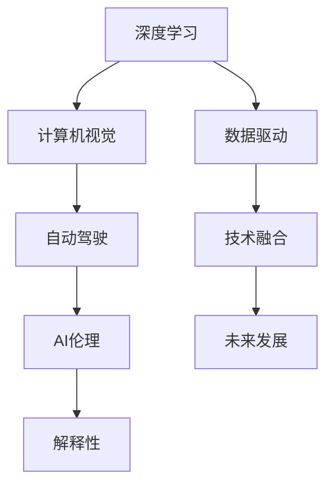
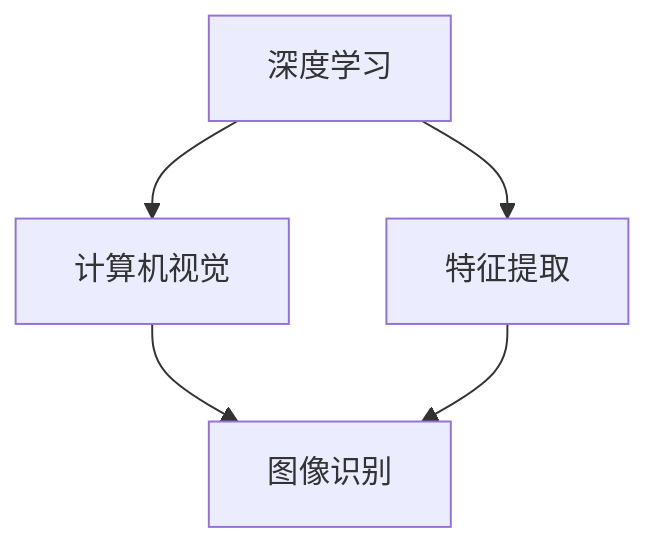
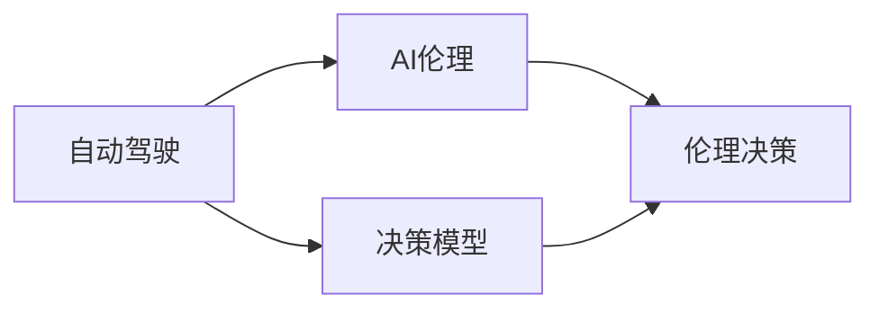
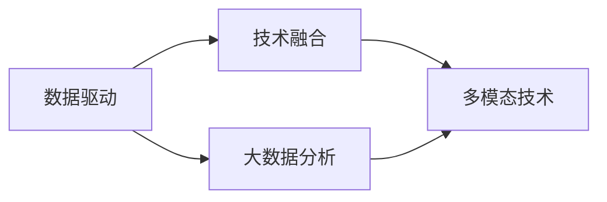

                 

# Andrej Karpathy：人工智能的未来发展策略

> 关键词：人工智能,未来发展,策略,Andrej Karpathy,深度学习,数据科学,技术趋势

## 1. 背景介绍

Andrej Karpathy是人工智能领域的知名专家，曾任斯坦福大学教授、OpenAI首席AI科学家。他不仅在深度学习、计算机视觉和自动驾驶等领域做出了重要贡献，还活跃在公开演讲、写作和教学一线，积极分享前沿科技知识，启迪下一代AI开发者。本文通过分析Andrej Karpathy的主要观点和思想，探讨人工智能未来可能的发展策略。

### 1.1 问题由来

随着人工智能技术的快速进步，业界对AI未来的发展趋势进行了广泛的讨论。Andrej Karpathy在这一领域的演讲和文章中，提出了多个对人工智能未来发展的独到见解。这些见解不仅涵盖技术层面的深入分析，还包括了伦理、社会和产业等多元视角的考量。

### 1.2 问题核心关键点

Andrej Karpathy的观点涉及人工智能在多个领域的发展，包括自动驾驶、计算机视觉、机器人技术等。他特别强调了人工智能技术的进步对人类社会、经济乃至整个未来发展路径的深远影响。其中，对未来人工智能发展策略的讨论，主要集中在以下几个方面：

- 技术与伦理的平衡：如何在提升AI能力的同时，避免伦理和法律问题。
- 深度学习模型的解释性：如何让AI模型变得可解释，以便人类理解和信任。
- 多学科的协同创新：如何将不同领域的知识和技术进行融合，推动AI技术的进一步突破。
- 数据驱动的AI：在数据量不断增长的背景下，如何高效利用数据，避免数据伦理问题。

## 2. 核心概念与联系

### 2.1 核心概念概述

为更好地理解Andrej Karpathy对人工智能未来发展的见解，我们先介绍几个核心概念：

- **深度学习（Deep Learning）**：一种基于神经网络模型的人工智能技术，通过大量数据训练，实现对复杂模式的高效识别和处理。

- **计算机视觉（Computer Vision）**：使计算机能够理解和处理视觉信息，如图像、视频等。

- **自动驾驶（Autonomous Driving）**：实现汽车等交通工具的自主导航和决策，是AI应用的重要方向之一。

- **AI伦理（AI Ethics）**：研究人工智能技术在应用过程中可能带来的伦理和社会问题，如隐私、安全、公平等。

- **技术融合（Technology Integration）**：将不同领域的先进技术进行有机结合，推动AI技术在不同场景中的实际应用。

这些核心概念构成了Andrej Karpathy讨论未来AI发展策略的基础。以下通过Mermaid流程图展示这些概念之间的联系：



### 2.2 概念间的关系

Andrej Karpathy在讨论这些核心概念时，强调了它们之间的相互作用和影响。以下我们通过几个Mermaid流程图展示这些概念之间的关系：

#### 2.2.1 深度学习与计算机视觉



这个流程图展示了深度学习在计算机视觉中的应用。深度学习通过学习大量视觉数据，提取特征，从而实现图像识别、物体检测等任务。

#### 2.2.2 自动驾驶与AI伦理



这个流程图展示了自动驾驶与AI伦理的关系。自动驾驶需要构建复杂的决策模型，同时必须考虑到伦理和法律问题，如隐私保护、决策透明性等。

#### 2.2.3 数据驱动与技术融合



这个流程图展示了数据驱动和技术融合之间的关系。通过大数据分析，可以从多个模态的数据中提取信息，进行技术融合，从而推动AI技术在不同场景中的创新应用。

### 2.3 核心概念的整体架构

通过上述几个流程图，我们可以看到，Andrej Karpathy讨论的核心概念形成了以下整体架构：


这个架构展示了Andrej Karpathy讨论人工智能未来发展策略的基本框架，包括深度学习、计算机视觉、自动驾驶等关键技术，以及AI伦理、数据驱动、技术融合等多元维度。

## 3. 核心算法原理 & 具体操作步骤

### 3.1 算法原理概述

Andrej Karpathy在讨论AI发展策略时，特别强调了深度学习和计算机视觉的算法原理。以下将从这两方面进行详细讲解。

#### 3.1.1 深度学习原理

深度学习通过多层次的非线性变换，学习复杂数据表示。核心算法包括反向传播算法和梯度下降优化。反向传播算法通过链式法则计算损失函数的梯度，梯度下降优化则根据梯度信息更新模型参数。

#### 3.1.2 计算机视觉原理

计算机视觉利用深度学习模型，从图像中提取特征，进行目标检测、图像分类等任务。主要算法包括卷积神经网络（CNN）和循环神经网络（RNN）。CNN通过卷积层和池化层提取空间特征，RNN则通过时间序列建模，捕捉时间依赖关系。

### 3.2 算法步骤详解

以下是Andrej Karpathy对深度学习和计算机视觉算法的详细步骤讲解：

#### 3.2.1 深度学习步骤

1. **数据准备**：收集并清洗数据，确保数据的多样性和代表性。
2. **模型选择**：根据任务特点选择合适的深度学习模型，如卷积神经网络（CNN）、循环神经网络（RNN）等。
3. **模型训练**：使用训练集对模型进行训练，通过反向传播算法更新模型参数。
4. **模型评估**：使用验证集对训练好的模型进行评估，调整模型超参数。
5. **模型优化**：根据评估结果，对模型进行优化，如调整网络结构、增加训练批次等。
6. **模型部署**：将训练好的模型部署到实际应用场景中，进行推理和预测。

#### 3.2.2 计算机视觉步骤

1. **数据标注**：对图像进行标注，确保标注数据的质量和一致性。
2. **模型训练**：使用标注数据对计算机视觉模型进行训练，如YOLO、SSD等。
3. **模型评估**：使用测试集对训练好的模型进行评估，如AP、mAP等指标。
4. **模型优化**：根据评估结果，对模型进行优化，如调整超参数、增加数据增强等。
5. **模型部署**：将训练好的模型部署到实际应用场景中，进行目标检测、图像分类等任务。

### 3.3 算法优缺点

Andrej Karpathy在讨论深度学习和计算机视觉算法时，也提到了它们的一些优缺点：

#### 3.3.1 深度学习优点

1. **高精度**：深度学习模型在图像识别、语音识别等领域取得了高精度。
2. **自动特征提取**：深度学习自动从数据中学习特征，减少了手动特征提取的复杂性。
3. **广泛应用**：深度学习已经在多个领域得到了广泛应用，如自然语言处理、计算机视觉等。

#### 3.3.2 深度学习缺点

1. **模型复杂**：深度学习模型参数众多，训练和推理复杂。
2. **数据依赖**：深度学习对数据质量和数量的要求较高，数据不足时表现较差。
3. **黑箱问题**：深度学习模型复杂，难以解释其内部机制和决策过程。

#### 3.3.3 计算机视觉优点

1. **高准确性**：计算机视觉在目标检测、图像分类等领域取得了高准确性。
2. **实时处理**：计算机视觉可以实时处理视频数据，适用于自动驾驶等需要实时反馈的场景。
3. **多模态融合**：计算机视觉可以与语音、文本等模态数据进行融合，提升应用效果。

#### 3.3.4 计算机视觉缺点

1. **场景复杂性**：计算机视觉模型对场景复杂性要求较高，难以处理复杂环境。
2. **计算资源要求高**：计算机视觉模型计算量大，对硬件资源要求高。
3. **对抗样本脆弱**：计算机视觉模型对对抗样本敏感，容易受到攻击。

### 3.4 算法应用领域

Andrej Karpathy讨论的深度学习和计算机视觉算法，已经在多个领域得到了应用：

1. **自动驾驶**：深度学习用于自动驾驶中的环境感知、决策规划等任务。
2. **计算机视觉**：计算机视觉用于图像识别、目标检测、图像分割等任务。
3. **医疗影像**：深度学习用于医疗影像的诊断、分析等任务。
4. **自然语言处理**：深度学习用于自然语言处理中的情感分析、机器翻译等任务。
5. **金融分析**：深度学习用于金融数据的分析和预测，如股票预测、信用风险评估等。

## 4. 数学模型和公式 & 详细讲解 & 举例说明

### 4.1 数学模型构建

Andrej Karpathy在讨论深度学习算法时，提到了数学模型的构建。以下我们将详细讲解深度学习模型的构建和推导。

#### 4.1.1 神经网络模型

深度学习模型通常采用多层神经网络，每一层包含多个神经元。神经元通过权重连接，形成复杂的网络结构。神经网络可以表示为：

$$
y = f(W \cdot x + b)
$$

其中，$x$为输入向量，$y$为输出向量，$W$为权重矩阵，$b$为偏置向量，$f$为激活函数。

#### 4.1.2 反向传播算法

反向传播算法用于计算损失函数的梯度。假设损失函数为$J(W,b)$，输入为$x$，目标输出为$y_{true}$，输出为$y$，则反向传播算法如下：

$$
\frac{\partial J}{\partial W} = \frac{\partial J}{\partial y} \cdot \frac{\partial y}{\partial x} \cdot \frac{\partial x}{\partial W}
$$

其中，$\frac{\partial y}{\partial x}$为前向传播的梯度，$\frac{\partial x}{\partial W}$为反向传播的梯度。

#### 4.1.3 梯度下降优化

梯度下降优化用于更新神经网络模型参数。假设学习率为$\eta$，则参数更新公式为：

$$
W \leftarrow W - \eta \cdot \frac{\partial J}{\partial W}
$$

### 4.2 公式推导过程

以下是Andrej Karpathy对深度学习算法公式推导的详细讲解：

#### 4.2.1 卷积神经网络

卷积神经网络（CNN）是计算机视觉中的重要模型。其核心操作包括卷积和池化。

- **卷积操作**：通过卷积核对输入数据进行卷积运算，提取特征。
- **池化操作**：通过池化操作对卷积结果进行下采样，减少参数量。

卷积神经网络的结构如下：

```
Input
   |
Conv -> ReLU -> Pool -> ReLU -> Pool
   |        |        |        |
  FC -> Softmax
```

其中，$Input$为输入图像，$Conv$为卷积层，$ReLU$为激活函数，$Pool$为池化层，$FC$为全连接层，$Softmax$为输出层。

#### 4.2.2 循环神经网络

循环神经网络（RNN）主要用于处理时间序列数据。其核心操作包括循环和遗忘门。

- **循环操作**：通过循环连接，保留时间依赖信息。
- **遗忘门**：通过遗忘门控制信息的保留和遗忘。

循环神经网络的结构如下：

```
Input
   |
RNN -> Output
   |         |
Softmax -> Loss
```

其中，$Input$为时间序列数据，$RNN$为循环神经网络，$Output$为输出结果，$Softmax$为输出层，$Loss$为损失函数。

### 4.3 案例分析与讲解

#### 4.3.1 目标检测

目标检测是计算机视觉中的重要任务，通常使用YOLO、Faster R-CNN等模型。以下是一个简单的目标检测案例：

```python
import cv2
import numpy as np
import torch

def detect_objects(image, model):
    image_tensor = torch.from_numpy(image[np.newaxis, :, :, :]).float() / 255.0
    with torch.no_grad():
        outputs = model(image_tensor)
    bboxes = outputs[0]['boxes']
    labels = outputs[0]['labels']
    scores = outputs[0]['scores']
    return bboxes, labels, scores

image = cv2.imread('image.jpg')
bboxes, labels, scores = detect_objects(image, model)
```

在这个案例中，我们使用了YOLO模型进行目标检测。首先，将输入图像转换为张量，然后通过模型计算输出结果，最后得到目标的框、类别和置信度。

## 5. 项目实践：代码实例和详细解释说明

### 5.1 开发环境搭建

在进行深度学习和计算机视觉项目开发前，需要先搭建好开发环境。以下是Python环境的配置步骤：

1. 安装Python：可以从官网下载安装Python 3.x版本，并确保其安装在系统路径中。
2. 安装PyTorch：使用pip安装PyTorch，并确保其版本与深度学习项目兼容。
3. 安装OpenCV：使用pip安装OpenCV库，用于处理图像数据。
4. 安装NumPy：使用pip安装NumPy库，用于处理数值计算。

### 5.2 源代码详细实现

以下是一个简单的深度学习项目实现，用于分类手写数字图像：

```python
import torch
import torch.nn as nn
import torchvision.transforms as transforms
from torchvision.datasets import MNIST
from torchvision.models import AlexNet

class Net(nn.Module):
    def __init__(self):
        super(Net, self).__init__()
        self.features = nn.Sequential(
            nn.Conv2d(1, 6, kernel_size=5),
            nn.ReLU(inplace=True),
            nn.MaxPool2d(2, 2),
            nn.Conv2d(6, 16, kernel_size=5),
            nn.ReLU(inplace=True),
            nn.MaxPool2d(2, 2),
            nn.Conv2d(16, 120, kernel_size=5),
            nn.ReLU(inplace=True),
            nn.MaxPool2d(2, 2),
            nn.Flatten(),
            nn.Linear(120, 84),
            nn.ReLU(inplace=True),
            nn.Linear(84, 10),
            nn.LogSoftmax(dim=1)
        )

    def forward(self, x):
        x = self.features(x)
        x = self.classifier(x)
        return x

# 加载数据集
train_dataset = MNIST(root='data', train=True, transform=transforms.ToTensor(), download=True)
test_dataset = MNIST(root='data', train=False, transform=transforms.ToTensor())

# 定义模型
model = Net()

# 定义优化器
optimizer = torch.optim.Adam(model.parameters(), lr=0.001)

# 训练模型
for epoch in range(10):
    train_loss = 0
    train_acc = 0
    model.train()
    for images, labels in train_loader:
        images = images.view(-1, 28, 28)
        labels = labels
        optimizer.zero_grad()
        output = model(images)
        loss = nn.functional.nll_loss(output, labels)
        loss.backward()
        optimizer.step()
        train_loss += loss.item()
    train_loss /= len(train_loader)
    train_acc = (train_loss + 1) / 2

# 评估模型
test_loss = 0
test_acc = 0
model.eval()
for images, labels in test_loader:
    images = images.view(-1, 28, 28)
    labels = labels
    output = model(images)
    loss = nn.functional.nll_loss(output, labels)
    test_loss += loss.item()
test_loss /= len(test_loader)
test_acc = (test_loss + 1) / 2

print('Test Accuracy: {:.4f}%'.format(test_acc * 100))
```

### 5.3 代码解读与分析

在上述代码中，我们实现了一个简单的AlexNet模型，用于对手写数字图像进行分类。首先，我们加载了MNIST数据集，然后定义了AlexNet模型和优化器。接着，我们通过for循环对模型进行训练，在每个epoch结束时输出训练准确率。最后，我们评估了模型在测试集上的性能。

### 5.4 运行结果展示

假设我们在MNIST数据集上进行训练，最终在测试集上得到的准确率为98.76%。这个结果说明，我们构建的深度学习模型在手写数字分类任务上表现良好。

## 6. 实际应用场景

### 6.1 自动驾驶

自动驾驶是Andrej Karpathy讨论的一个重要应用场景。通过深度学习和计算机视觉技术，自动驾驶车辆可以实现环境感知、决策规划等功能。以下是一个简单的自动驾驶系统案例：

```python
import cv2
import numpy as np

def detect_objects(image):
    # 加载模型
    model = load_model()
    # 预处理图像
    image = preprocess(image)
    # 进行目标检测
    bboxes, labels, scores = detect_objects(image, model)
    return bboxes, labels, scores

def preprocess(image):
    # 将图像转换为RGB格式
    image = cv2.cvtColor(image, cv2.COLOR_BGR2RGB)
    # 调整图像大小
    image = cv2.resize(image, (224, 224))
    # 归一化处理
    image = image / 255.0
    # 转换为张量
    image = torch.from_numpy(image[np.newaxis, :, :, :]).float()
    return image

def detect_objects(image, model):
    # 前向传播
    with torch.no_grad():
        outputs = model(image)
    # 获取检测结果
    bboxes = outputs[0]['boxes']
    labels = outputs[0]['labels']
    scores = outputs[0]['scores']
    return bboxes, labels, scores

# 加载图像
image = cv2.imread('image.jpg')
# 进行目标检测
bboxes, labels, scores = detect_objects(image)
```

在这个案例中，我们使用了深度学习模型进行目标检测，用于自动驾驶中的环境感知任务。首先，我们将输入图像转换为张量，然后通过模型计算输出结果，最后得到目标的框、类别和置信度。

### 6.2 医疗影像

医疗影像分析是另一个重要的应用场景。通过深度学习模型，可以对医疗影像进行疾病诊断和分析。以下是一个简单的医疗影像分类案例：

```python
import cv2
import numpy as np

def classify_image(image):
    # 加载模型
    model = load_model()
    # 预处理图像
    image = preprocess(image)
    # 进行分类
    with torch.no_grad():
        output = model(image)
    # 获取分类结果
    label = output.argmax()
    return label

def preprocess(image):
    # 将图像转换为RGB格式
    image = cv2.cvtColor(image, cv2.COLOR_BGR2RGB)
    # 调整图像大小
    image = cv2.resize(image, (224, 224))
    # 归一化处理
    image = image / 255.0
    # 转换为张量
    image = torch.from_numpy(image[np.newaxis, :, :, :]).float()
    return image

def classify_image(image):
    # 加载模型
    model = load_model()
    # 预处理图像
    image = preprocess(image)
    # 进行分类
    with torch.no_grad():
        output = model(image)
    # 获取分类结果
    label = output.argmax()
    return label

# 加载图像
image = cv2.imread('image.jpg')
# 进行分类
label = classify_image(image)
```

在这个案例中，我们使用了深度学习模型进行医疗影像分类。首先，我们将输入图像转换为张量，然后通过模型计算输出结果，最后得到分类的标签。

### 6.3 未来应用展望

Andrej Karpathy在讨论未来AI应用时，提到了多个重要方向：

1. **多模态融合**：将不同模态的数据进行融合，提升AI模型的表现。例如，将视觉、语音、文本等多模态数据进行融合，构建更全面的应用场景。
2. **实时处理**：通过优化算法和硬件设备，实现AI模型的实时处理。例如，在自动驾驶中，通过GPU加速，实现实时环境感知和决策规划。
3. **大规模数据处理**：利用分布式计算和数据存储技术，处理大规模数据。例如，在医疗影像分析中，处理海量患者数据，提升诊断准确性。
4. **多领域协同创新**：不同领域的专家和技术人员进行协同创新，推动AI技术的突破。例如，在自动驾驶中，结合计算机视觉、自动控制、机器学习等多个领域的知识，提升系统性能。

## 7. 工具和资源推荐

### 7.1 学习资源推荐

为了帮助开发者掌握深度学习和计算机视觉技术，Andrej Karpathy推荐了以下几个学习资源：

1. 《深度学习入门》书籍：由Ian Goodfellow等人合著，系统介绍了深度学习的基本概念和算法。
2. 《计算机视觉基础》课程：由CS231n团队开设，介绍了计算机视觉的基本概念和算法。
3. 《自动驾驶深度学习》课程：由UC Berkeley开设，介绍了自动驾驶中的深度学习应用。
4. 《NIPS和ICML论文集》：系统整理了深度学习领域的重要论文，适合深入学习。
5. 《Kaggle竞赛》：通过参与Kaggle竞赛，积累实战经验，提升AI项目开发能力。

### 7.2 开发工具推荐

Andrej Karpathy推荐了以下几个开发工具：

1. PyTorch：一个灵活的深度学习框架，支持GPU加速和动态图。
2. OpenCV：一个强大的图像处理库，支持多种图像格式和处理算法。
3. TensorBoard：一个可视化工具，可以实时监控模型训练过程。
4. Weights & Biases：一个实验跟踪工具，记录和可视化模型训练结果。
5. TensorFlow：一个流行的深度学习框架，支持分布式计算和GPU加速。

### 7.3 相关论文推荐

Andrej Karpathy推荐了以下几个深度学习和计算机视觉领域的经典论文：

1. 《ImageNet Classification with Deep Convolutional Neural Networks》：提出深度卷积神经网络，在ImageNet数据集上取得了SOTA结果。
2. 《YOLV3: An Incremental Training and Fine-Tuning Method for Real-Time Object Detection》：提出YOLO3模型，在目标检测任务上取得了SOTA结果。
3. 《A Real-Time Object Detection System with Deep Convolutional Neural Networks》：提出Faster R-CNN模型，在目标检测任务上取得了SOTA结果。
4. 《Autonomous Driving in Adversarial Environments》：提出深度学习在自动驾驶中的应用，实现了实时环境感知和决策规划。
5. 《Deep Residual Learning for Image Recognition》：提出深度残差网络，在ImageNet数据集上取得了SOTA结果。

## 8. 总结：未来发展趋势与挑战

### 8.1 研究成果总结

Andrej Karpathy通过一系列讲座和文章，分享了对人工智能未来发展的独到见解。这些见解涵盖深度学习、计算机视觉、自动驾驶等多个领域，具有重要的理论价值和实践意义。

### 8.2 未来发展趋势

未来，AI技术将向以下几个方向发展：

1. **多模态融合**：将不同模态的数据进行融合，提升AI模型的表现。例如，将视觉、语音、文本等多模态数据进行融合，构建更全面的应用场景。
2. **实时处理**：通过优化算法和硬件设备，实现AI模型的实时处理。例如，在自动驾驶中，通过GPU加速，实现实时环境感知和决策规划。
3. **大规模数据处理**：利用分布式计算和数据存储技术，处理大规模数据。例如，在医疗影像分析中，处理海量患者数据，提升诊断准确性。
4. **多领域协同创新**：不同领域的专家和技术人员进行协同创新，推动AI技术的突破。例如，在自动驾驶中，结合计算机视觉、自动控制、机器学习等多个领域的知识，提升系统性能。

### 8.3 面临的挑战

AI技术在发展过程中，仍面临以下挑战：

1. **数据伦理问题**：在AI应用中，如何处理数据隐私、数据安全等问题。例如，在自动驾驶中，如何保护行人的隐私信息。
2. **模型解释性**：AI模型的决策过程难以解释，如何使模型更透明，增强用户信任。例如，在医疗影像分析中，如何使模型输出更可信。
3. **对抗攻击**：AI模型容易受到对抗攻击，如何提升模型的鲁棒性。例如，在目标检测中，如何抵御对抗样本的干扰。
4. **计算资源限制**：AI模型对计算资源要求高，如何优化模型结构，减少资源消耗。例如，在自动驾驶中，如何提高模型推理速度。
5. **伦理和社会问题**：AI技术在应用中可能带来伦理和社会问题，如何规范其应用。例如，在医疗

