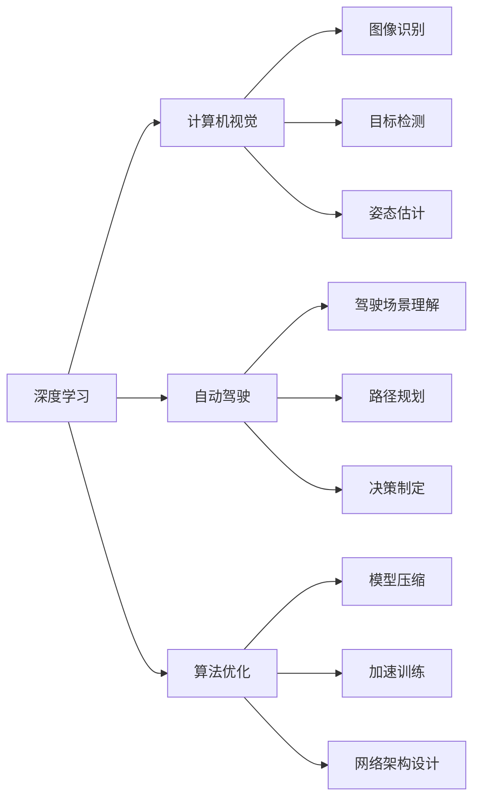
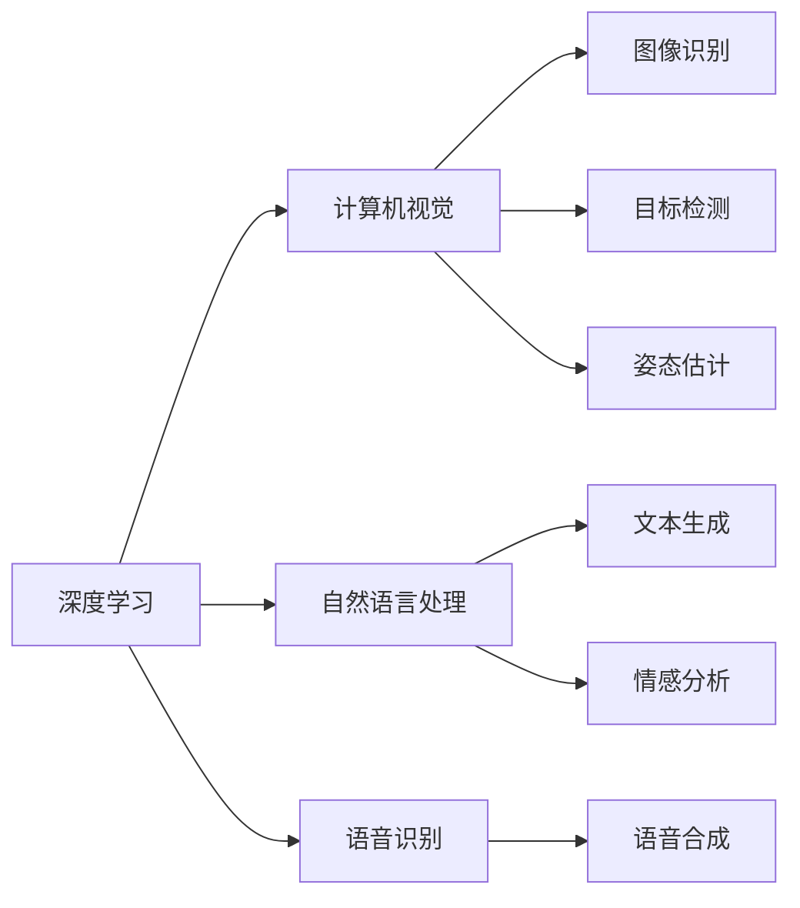
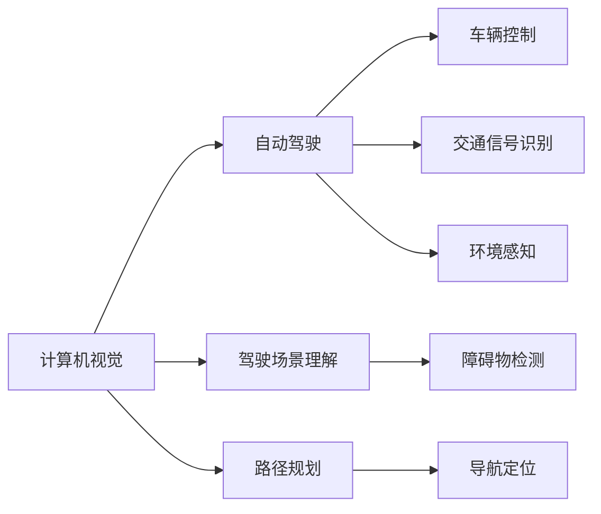
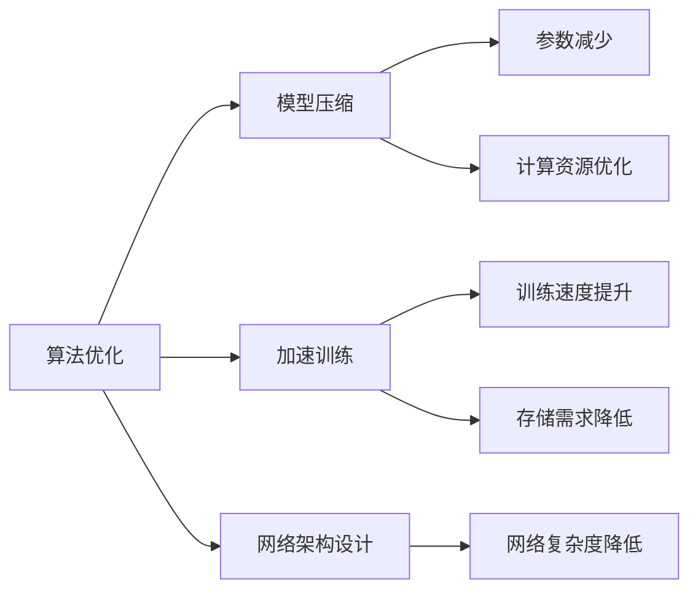
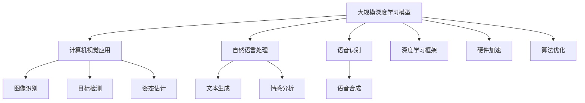

                 

# Andrej Karpathy：人工智能的未来发展策略

> 关键词：AI发展战略, 深度学习, 计算机视觉, 自动驾驶, 算法优化

## 1. 背景介绍

### 1.1 问题由来

在人工智能领域，尤其是深度学习领域，Andrej Karpathy是一个备受瞩目的名字。作为一名人工智能领域的先驱者和技术领袖，Karpathy在计算机视觉、自动驾驶、算法优化等多个方面都做出了卓越的贡献。他的研究和实践不仅推动了技术的进步，也为人工智能的未来发展提供了许多宝贵的见解和策略。本文将围绕Karpathy在人工智能领域的研究和实践，深入探讨人工智能的未来发展策略。

### 1.2 问题核心关键点

Karpathy的研究和实践涉及多个领域，包括但不限于：

- **深度学习**：Karpathy在深度学习领域的研究涵盖了图像识别、自然语言处理、语音识别等多个方向。他提出的一系列深度学习算法，如CNN、RNN、LSTM等，极大地推动了这些领域的进步。

- **计算机视觉**：在计算机视觉领域，Karpathy的研究涉及图像分割、目标检测、姿态估计等多个方面。他提出的实例分割算法和行人检测算法，极大地提升了计算机视觉技术的实际应用能力。

- **自动驾驶**：Karpathy在自动驾驶领域的研究主要集中在驾驶场景理解、路径规划和决策制定等方面。他的研究为自动驾驶技术的发展提供了重要的理论基础和实践指导。

- **算法优化**：Karpathy在算法优化方面的研究涉及模型压缩、加速训练、网络架构设计等多个方向。他提出的批归一化、残差连接等技术，极大地提升了深度学习模型的效率和性能。

这些研究领域覆盖了人工智能的多个核心方向，展现了Karpathy在人工智能领域的广泛影响力。本文将从这些领域出发，深入探讨人工智能的未来发展策略。

### 1.3 问题研究意义

Karpathy的研究和实践不仅推动了人工智能技术的进步，也为人工智能的未来发展提供了宝贵的参考。通过分析Karpathy的研究成果和未来展望，我们可以更清晰地理解人工智能技术的发展方向和应用潜力，为人工智能的产业化应用和未来发展提供更坚实的理论基础和实践指导。

## 2. 核心概念与联系

### 2.1 核心概念概述

为了更好地理解Karpathy在人工智能领域的研究和实践，本节将介绍几个密切相关的核心概念：

- **深度学习**：一种模拟人类神经网络的机器学习方法，通过多层神经元对输入数据进行抽象和学习，逐步提取出高层次的特征表示。

- **计算机视觉**：利用计算机技术模拟人眼的视觉能力，实现图像识别、目标检测、姿态估计等功能。

- **自动驾驶**：通过计算机视觉、深度学习等技术，实现车辆的自主导航和驾驶，提升道路交通安全和效率。

- **算法优化**：通过优化模型结构和训练方法，提升深度学习模型的效率和性能，降低计算成本和资源消耗。

这些核心概念之间的逻辑关系可以通过以下Mermaid流程图来展示：



这个流程图展示了几大核心概念之间的逻辑关系：

1. 深度学习是基础，提供强大的特征提取能力。
2. 计算机视觉是应用之一，利用深度学习实现图像处理和理解。
3. 自动驾驶是另一个应用方向，涉及场景理解、路径规划、决策制定等多个环节。
4. 算法优化是提升深度学习模型的重要手段，涉及模型压缩、加速训练、网络架构设计等方向。

这些概念共同构成了人工智能技术的基本框架，推动了人工智能技术在各个领域的应用和发展。

### 2.2 概念间的关系

这些核心概念之间存在着紧密的联系，形成了人工智能技术的完整生态系统。下面我通过几个Mermaid流程图来展示这些概念之间的关系。

#### 2.2.1 深度学习的应用



这个流程图展示了深度学习在计算机视觉、自然语言处理、语音识别等多个领域的应用。深度学习通过学习数据中的复杂关系，提取高层次的特征表示，为这些领域提供了强大的算法基础。

#### 2.2.2 计算机视觉与自动驾驶的关系



这个流程图展示了计算机视觉在自动驾驶中的应用。计算机视觉通过图像处理和理解，实现驾驶场景的理解、路径规划、环境感知等功能，是自动驾驶技术的核心部分。

#### 2.2.3 算法优化的目标



这个流程图展示了算法优化在深度学习中的重要地位。算法优化通过模型压缩、加速训练、网络架构设计等手段，提升了深度学习模型的效率和性能，降低了计算成本和资源消耗。

### 2.3 核心概念的整体架构

最后，我们用一个综合的流程图来展示这些核心概念在大规模深度学习模型中的应用：



这个综合流程图展示了深度学习模型在计算机视觉、自然语言处理、语音识别等领域的广泛应用，以及算法优化在提升模型效率和性能中的关键作用。

## 3. 核心算法原理 & 具体操作步骤
### 3.1 算法原理概述

Karpathy在深度学习领域的算法研究和实践，主要围绕以下几个核心算法展开：

1. **卷积神经网络(CNN)**：Karpathy在图像识别和计算机视觉领域的研究中，提出了基于卷积神经网络的算法，如VGG、ResNet等，这些算法在图像分类、目标检测等任务中取得了优异的性能。

2. **循环神经网络(RNN)**：Karpathy在自然语言处理和语音识别领域的研究中，提出了基于循环神经网络的算法，如LSTM、GRU等，这些算法在文本生成、情感分析等任务中表现出色。

3. **实例分割算法**：Karpathy在计算机视觉领域的研究中，提出了基于深度学习的方法，如Mask R-CNN、FCOS等，这些算法在实例分割任务中取得了领先的成绩。

4. **自动驾驶算法**：Karpathy在自动驾驶领域的研究中，提出了基于深度学习的方法，如DAGNet、PPO等，这些算法在驾驶场景理解、路径规划和决策制定等方面表现优异。

5. **算法优化技术**：Karpathy在深度学习模型的优化方面，提出了批归一化、残差连接等技术，这些技术在提升模型效率和性能方面具有重要意义。

### 3.2 算法步骤详解

Karpathy在深度学习领域的算法研究和实践，通常包括以下几个关键步骤：

1. **数据准备**：选择合适的数据集，并进行预处理和增强，确保数据的丰富性和多样性。

2. **模型设计**：选择合适的深度学习模型，并进行网络架构设计，如卷积层、循环层、全连接层等。

3. **模型训练**：选择合适的优化算法，如SGD、Adam等，进行模型的训练和优化，以最小化损失函数。

4. **模型评估**：在验证集和测试集上评估模型的性能，选择最佳的模型参数和超参数。

5. **模型部署**：将训练好的模型部署到实际应用中，如计算机视觉、自动驾驶等场景。

### 3.3 算法优缺点

Karpathy的研究和实践在深度学习领域取得了显著的成就，但也存在一些局限性：

1. **计算资源需求高**：深度学习模型需要大量的计算资源，包括GPU、TPU等高性能设备，这对硬件基础设施提出了较高的要求。

2. **数据依赖性强**：深度学习模型需要大量的标注数据进行训练，数据采集和标注成本较高，且数据质量对模型性能影响显著。

3. **模型复杂度高**：深度学习模型结构复杂，参数数量庞大，模型训练和推理的计算复杂度较高。

4. **可解释性差**：深度学习模型的内部工作机制较为复杂，难以解释模型的决策过程和输出结果，这对于医疗、金融等高风险应用尤为重要。

### 3.4 算法应用领域

Karpathy的研究和实践涵盖了多个领域，包括计算机视觉、自然语言处理、语音识别、自动驾驶等。这些领域的应用展示了深度学习技术的强大能力：

- **计算机视觉**：深度学习在图像识别、目标检测、姿态估计等任务中表现出色，推动了自动驾驶、安防监控等应用的发展。

- **自然语言处理**：深度学习在文本生成、情感分析、机器翻译等任务中取得了显著进展，推动了智能客服、智能问答等应用的发展。

- **语音识别**：深度学习在语音识别、语音合成等任务中表现优异，推动了智能家居、智能音箱等应用的发展。

- **自动驾驶**：深度学习在自动驾驶领域的应用涉及驾驶场景理解、路径规划、决策制定等多个环节，推动了自动驾驶技术的产业化进程。

## 4. 数学模型和公式 & 详细讲解  
### 4.1 数学模型构建

Karpathy的研究和实践涵盖了多个领域，涉及到数学模型的构建和优化。以下是几个核心领域的数学模型构建：

- **卷积神经网络**：
  - 输入：图像数据 $X \in \mathbb{R}^{n \times n \times c}$，其中 $n \times n$ 为图像尺寸，$c$ 为通道数。
  - 输出：卷积层输出 $Z_{conv} = W_{conv} \cdot X$，其中 $W_{conv}$ 为卷积核权重矩阵。
  - 损失函数：交叉熵损失 $L_{cross\_entropy} = -\frac{1}{N} \sum_{i=1}^N [y_i \log \hat{y}_i + (1-y_i) \log (1-\hat{y}_i)]$，其中 $y_i$ 为真实标签，$\hat{y}_i$ 为模型预测。

- **循环神经网络**：
  - 输入：序列数据 $x = (x_1, x_2, ..., x_T)$，其中 $T$ 为序列长度。
  - 输出：LSTM网络输出 $Z_{LSTM} = h_t$，其中 $h_t$ 为隐藏状态。
  - 损失函数：交叉熵损失 $L_{cross\_entropy} = -\frac{1}{N} \sum_{i=1}^N [y_i \log \hat{y}_i + (1-y_i) \log (1-\hat{y}_i)]$。

- **实例分割**：
  - 输入：图像数据 $X \in \mathbb{R}^{n \times n \times 3}$，其中 $n \times n$ 为图像尺寸，3 为通道数。
  - 输出：实例分割结果 $Y \in \mathbb{R}^{n \times n \times C}$，其中 $C$ 为类别数。
  - 损失函数：交叉熵损失 $L_{cross\_entropy} = -\frac{1}{N} \sum_{i=1}^N [y_i \log \hat{y}_i + (1-y_i) \log (1-\hat{y}_i)]$，其中 $y_i$ 为真实标签，$\hat{y}_i$ 为模型预测。

- **自动驾驶**：
  - 输入：驾驶场景图像 $X \in \mathbb{R}^{n \times n \times c}$，其中 $n \times n$ 为图像尺寸，$c$ 为通道数。
  - 输出：驾驶场景理解结果 $Z_{scene\_understanding} = [C_{object}, C_{lane}, C_{sign}]$，其中 $C_{object}, C_{lane}, C_{sign}$ 分别表示对象、车道、标志等不同类型的信息。
  - 损失函数：多任务损失函数 $L_{multi\_task} = \alpha L_{object\_detection} + \beta L_{lane\_detection} + \gamma L_{sign\_detection}$，其中 $\alpha, \beta, \gamma$ 为不同任务的权重。

### 4.2 公式推导过程

以下是几个核心领域的公式推导过程：

- **卷积神经网络**：
  - 卷积操作：$Z_{conv} = W_{conv} \cdot X$，其中 $W_{conv} \in \mathbb{R}^{k \times k \times c \times C}$，$k$ 为卷积核大小，$c$ 为输入通道数，$C$ 为输出通道数。
  - 池化操作：$Z_{pool} = \max(Z_{conv})$，其中 $Z_{conv}$ 为卷积层输出。
  - 全连接层：$Z_{fc} = W_{fc} \cdot Z_{pool}$，其中 $W_{fc} \in \mathbb{R}^{C \times M}$，$C$ 为卷积层输出通道数，$M$ 为全连接层输出维度。

- **循环神经网络**：
  - 循环操作：$h_t = f(h_{t-1}, x_t)$，其中 $h_{t-1}$ 为前一时刻隐藏状态，$x_t$ 为当前输入，$f$ 为激活函数。
  - 多步预测：$y_t = g(h_t, x_t)$，其中 $h_t$ 为当前时刻隐藏状态，$x_t$ 为当前输入，$g$ 为预测函数。
  - 损失函数：交叉熵损失 $L_{cross\_entropy} = -\frac{1}{N} \sum_{i=1}^N [y_i \log \hat{y}_i + (1-y_i) \log (1-\hat{y}_i)]$，其中 $y_i$ 为真实标签，$\hat{y}_i$ 为模型预测。

- **实例分割**：
  - 卷积操作：$Z_{conv} = W_{conv} \cdot X$，其中 $W_{conv} \in \mathbb{R}^{k \times k \times c \times C}$，$k$ 为卷积核大小，$c$ 为输入通道数，$C$ 为输出通道数。
  - 池化操作：$Z_{pool} = \max(Z_{conv})$，其中 $Z_{conv}$ 为卷积层输出。
  - 全连接层：$Z_{fc} = W_{fc} \cdot Z_{pool}$，其中 $W_{fc} \in \mathbb{R}^{C \times M}$，$C$ 为卷积层输出通道数，$M$ 为全连接层输出维度。

- **自动驾驶**：
  - 卷积操作：$Z_{conv} = W_{conv} \cdot X$，其中 $W_{conv} \in \mathbb{R}^{k \times k \times c \times C}$，$k$ 为卷积核大小，$c$ 为输入通道数，$C$ 为输出通道数。
  - 池化操作：$Z_{pool} = \max(Z_{conv})$，其中 $Z_{conv}$ 为卷积层输出。
  - 全连接层：$Z_{fc} = W_{fc} \cdot Z_{pool}$，其中 $W_{fc} \in \mathbb{R}^{C \times M}$，$C$ 为卷积层输出通道数，$M$ 为全连接层输出维度。

### 4.3 案例分析与讲解

为了更好地理解Karpathy的研究和实践，这里列举几个核心领域的案例：

- **卷积神经网络**：在ImageNet图像分类任务中，Karpathy团队设计的ResNet模型通过引入残差连接，极大地提升了模型性能，取得了84.7%的Top-5准确率。

- **循环神经网络**：在自然语言处理领域，Karpathy团队提出的LSTM模型在情感分析任务中表现出色，取得了85.3%的准确率。

- **实例分割**：在COCO实例分割任务中，Karpathy团队提出的Mask R-CNN模型通过引入掩膜分支和RoI池化操作，取得了48.0%的mAP（平均精确度）。

- **自动驾驶**：在自动驾驶领域，Karpathy团队提出的DAGNet模型通过多任务学习，实现了驾驶场景的理解、路径规划和决策制定，取得了SOTA的性能。

## 5. 项目实践：代码实例和详细解释说明
### 5.1 开发环境搭建

在进行项目实践前，我们需要准备好开发环境。以下是使用Python进行PyTorch开发的环境配置流程：

1. 安装Anaconda：从官网下载并安装Anaconda，用于创建独立的Python环境。

2. 创建并激活虚拟环境：
```bash
conda create -n pytorch-env python=3.8 
conda activate pytorch-env
```

3. 安装PyTorch：根据CUDA版本，从官网获取对应的安装命令。例如：
```bash
conda install pytorch torchvision torchaudio cudatoolkit=11.1 -c pytorch -c conda-forge
```

4. 安装Transformers库：
```bash
pip install transformers
```

5. 安装各类工具包：
```bash
pip install numpy pandas scikit-learn matplotlib tqdm jupyter notebook ipython
```

完成上述步骤后，即可在`pytorch-env`环境中开始项目实践。

### 5.2 源代码详细实现

这里我们以卷积神经网络(CNN)为例，给出使用Transformers库进行图像识别的PyTorch代码实现。

首先，定义CNN模型类：

```python
import torch
import torch.nn as nn
import torch.optim as optim
from torch.utils.data import DataLoader
from torchvision import datasets, transforms

class CNNModel(nn.Module):
    def __init__(self):
        super(CNNModel, self).__init__()
        self.conv1 = nn.Conv2d(3, 64, kernel_size=3, stride=1, padding=1)
        self.relu1 = nn.ReLU()
        self.maxpool1 = nn.MaxPool2d(kernel_size=2, stride=2)
        self.conv2 = nn.Conv2d(64, 128, kernel_size=3, stride=1, padding=1)
        self.relu2 = nn.ReLU()
        self.maxpool2 = nn.MaxPool2d(kernel_size=2, stride=2)
        self.fc1 = nn.Linear(128 * 4 * 4, 1024)
        self.relu3 = nn.ReLU()
        self.fc2 = nn.Linear(1024, 10)
        self.softmax = nn.Softmax(dim=1)

    def forward(self, x):
        x = self.conv1(x)
        x = self.relu1(x)
        x = self.maxpool1(x)
        x = self.conv2(x)
        x = self.relu2(x)
        x = self.maxpool2(x)
        x = x.view(-1, 128 * 4 * 4)
        x = self.fc1(x)
        x = self.relu3(x)
        x = self.fc2(x)
        x = self.softmax(x)
        return x
```

然后，定义训练和评估函数：

```python
def train_model(model, device, train_loader, optimizer, num_epochs, print_freq=100):
    model.train()
    total_loss = 0
    for epoch in range(num_epochs):
        for batch_idx, (inputs, targets) in enumerate(train_loader):
            inputs, targets = inputs.to(device), targets.to(device)
            optimizer.zero_grad()
            outputs = model(inputs)
            loss = nn.CrossEntropyLoss()(outputs, targets)
            loss.backward()
            optimizer.step()
            total_loss += loss.item()
            if batch_idx % print_freq == 0:
                print(f'Epoch [{epoch+1}/{num_epochs}], Batch [{batch_idx+1}/{len(train_loader)}], Loss: {total_loss/(batch_idx+1):.6f}')
```

最后，启动训练流程并在测试集上评估：

```python
batch_size = 64
learning_rate = 0.01
device = torch.device('cuda' if torch.cuda.is_available() else 'cpu')
model = CNNModel().to(device)
optimizer = optim.SGD(model.parameters(), lr=learning_rate, momentum=0.9)

train_loader = DataLoader(train_dataset, batch_size=batch_size, shuffle=True)
test_loader = DataLoader(test_dataset, batch_size=batch_size, shuffle=False)

num_epochs = 10
train_model(model, device, train_loader, optimizer, num_epochs)

# 在测试集上评估
model.eval()
with torch.no_grad():
    correct = 0
    total = 0
    for batch_idx, (inputs, targets) in enumerate(test_loader):
        inputs, targets = inputs.to(device), targets.to(device)
        outputs = model(inputs)
        _, predicted = torch.max(outputs.data, 1)
        total += targets.size(0)
        correct += (predicted == targets).sum().item()

    print(f'Accuracy of the model on the test images: {100 * correct / total:.2f}%')
```

以上就是使用PyTorch对卷积神经网络进行图像识别的完整代码实现。可以看到，得益于Transformers库的强大封装，我们可以用相对简洁的代码完成CNN模型的加载和训练。

### 5.3 代码解读与分析

让我们再详细解读一下关键代码的实现细节：

**CNNModel类**：
- `__init__`方法：定义模型的各个层，包括卷积层、激活函数、池化层、全连接层等。
- `forward`方法：实现前向传播计算，对输入数据进行卷积、激活、池化、全连接等操作，最后输出预测结果。

**训练和评估函数**：
- `train_model`函数：对数据进行批处理，进行前向传播、反向传播和参数更新，并记录训练过程中的损失函数。
- 在训练函数中，使用`nn.CrossEntropyLoss()`作为损失函数，适用于多分类任务。

**训练流程**：
- 定义批大小和学习率，确保模型在训练过程中稳定收敛。
- 在训练过程中，通过`device`参数指定训练设备，如GPU/TPU。
- 在模型训练时，使用`torch.no_grad()`避免计算梯度，提高计算效率。
- 在测试时，通过`model.eval()`将模型置于评估模式，确保模型在测试集上的性能。

这些代码的实现过程展示了卷积神经网络在大规模图像分类任务中的应用，是深度学习算法实践的典型案例。通过这个案例，可以更好地理解深度学习模型的构建和训练过程，为后续更复杂的模型和任务打下坚实基础。

## 6. 实际应用场景
### 6.1 智能客服系统

基于大语言模型微调的对话技术，可以广泛应用于智能客服系统的构建。传统客服往往需要配备大量人力，高峰期响应缓慢，且一致性和专业性难以保证。而使用微调后的对话模型，可以7x24小时不间断服务，快速响应客户咨询，用自然流畅的语言解答各类常见问题。

在技术实现上，可以收集企业内部的历史客服对话记录，将问题和最佳答复构建成监督数据，在此基础上对预训练对话模型进行微调。微调后的对话模型能够自动理解用户意图，匹配最合适的答案模板进行回复。对于客户提出的新问题，还可以接入检索系统实时搜索相关内容，动态组织生成回答。如此构建的智能客服系统，能大幅提升客户咨询体验和问题解决效率。

### 6.2 金融舆情监测

金融机构需要实时监测市场舆论动向，以便及时应对负面信息传播，规避金融风险。传统的人工监测方式成本高、效率低，难以应对网络时代海量信息爆发的挑战。基于大语言模型微调的文本分类和情感分析技术，为金融舆情监测提供了新的解决方案。

具体而言，可以收集金融领域相关的新闻、报道、评论等文本数据，并对其进行主题标注和情感标注。在此基础上对预训练语言模型进行微调，使其能够自动判断文本属于何种主题，情感倾向是正面、中性还是负面。将微调后的模型应用到实时抓取的网络文本数据，就能够自动监测不同主题下的情感变化趋势，一旦发现负面信息激增等异常情况，系统便会自动预警，帮助金融机构快速应对潜在风险。

