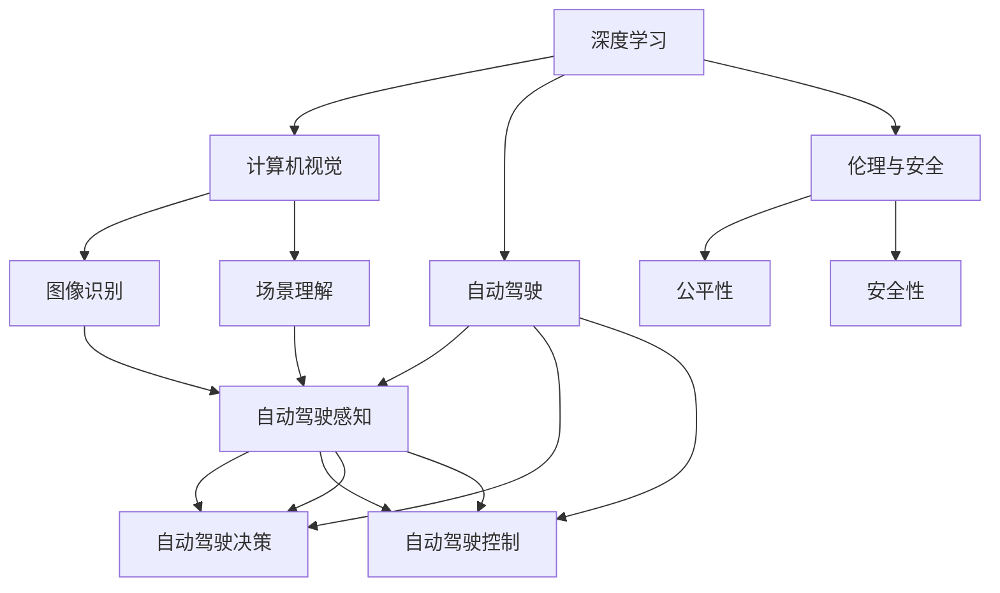
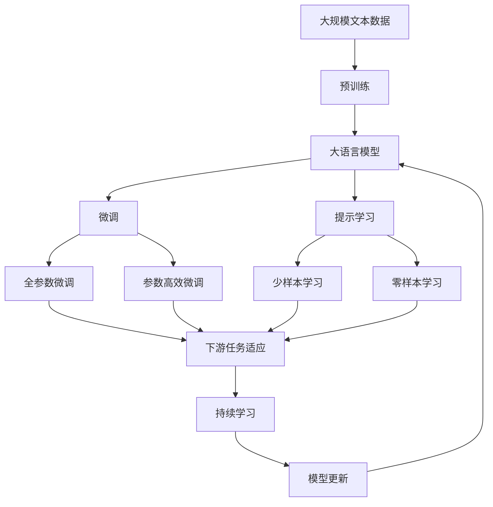

                 

# Andrej Karpathy：人工智能的未来发展规划

在深度学习蓬勃发展的今天，人工智能正以前所未有的速度改变着我们生活的方方面面。作为人工智能领域的前沿研究者，Andrej Karpathy博士为人们描绘了人工智能未来的发展蓝图。本文将详细解读Karpathy在深度学习与人工智能领域的最新研究成果，分析人工智能的发展趋势，以及面临的挑战和未来展望。

## 1. 背景介绍

### 1.1 问题由来
Andrej Karpathy博士是深度学习与计算机视觉领域的顶尖专家，担任斯坦福大学计算机视觉实验室主任，同时也是特斯拉人工智能总监。他的研究涵盖了深度学习架构、计算机视觉、自动驾驶等多个前沿领域，是行业内极具影响力的思想领袖。

### 1.2 问题核心关键点
Karpathy的研究主要关注以下几个核心问题：

1. 深度学习架构的创新：研究新的深度学习模型和架构，提升模型的表达能力和泛化能力。
2. 计算机视觉的突破：利用深度学习解决复杂的计算机视觉问题，推动视觉技术的应用落地。
3. 自动驾驶技术的提升：结合计算机视觉与深度学习，推动自动驾驶技术的发展，提升自动驾驶的安全性和可靠性。
4. 人工智能伦理与安全：探讨人工智能技术的伦理与社会影响，确保技术应用的公平性与安全性。

### 1.3 问题研究意义
Karpathy的研究不仅推动了深度学习与人工智能技术的发展，还为未来的智能系统设计提供了重要的理论依据和实践指导。他的研究成果为自动驾驶、医疗诊断、智能推荐等诸多应用场景提供了新的技术方案，具有重要的实际应用价值和社会意义。

## 2. 核心概念与联系

### 2.1 核心概念概述

Karpathy博士的研究涉及多个核心概念，包括深度学习、计算机视觉、自动驾驶、伦理与安全等。

- 深度学习：指通过多层次的神经网络模型，从数据中自动学习特征表示的机器学习方法。
- 计算机视觉：利用计算机模拟和扩展人类视觉系统的功能，实现图像识别、目标检测、场景理解等任务。
- 自动驾驶：结合计算机视觉、深度学习、控制理论等技术，实现自动驾驶汽车的全方位感知、决策与控制。
- 伦理与安全：探讨人工智能技术可能带来的伦理问题与社会影响，确保技术应用的公平性与安全性。

这些核心概念之间存在着紧密的联系，形成一个相互支持的生态系统。深度学习是计算机视觉与自动驾驶的基础，而伦理与安全是技术应用的重要考量。

### 2.2 概念间的关系

这些核心概念之间的关系可以通过以下Mermaid流程图来展示：



这个流程图展示了大语言模型微调过程中各个核心概念之间的关系：

1. 深度学习提供了计算机视觉和自动驾驶的技术基础。
2. 计算机视觉的核心任务包括图像识别和场景理解。
3. 自动驾驶需要计算机视觉技术与深度学习模型结合，实现感知、决策与控制。
4. 伦理与安全是技术应用的重要考量，需要深度学习模型的公平性与安全性。

### 2.3 核心概念的整体架构

最后，我们用一个综合的流程图来展示这些核心概念在大语言模型微调过程中的整体架构：



这个综合流程图展示了从预训练到微调，再到持续学习的完整过程。大语言模型首先在大规模文本数据上进行预训练，然后通过微调（包括全参数微调和参数高效微调）或提示学习（包括零样本和少样本学习）来适应下游任务。最后，通过持续学习技术，模型可以不断学习新知识，同时避免遗忘旧知识。

## 3. 核心算法原理 & 具体操作步骤

### 3.1 算法原理概述

Karpathy的研究围绕深度学习架构的创新展开，提出了多种深度学习模型和算法，提升了模型的表达能力和泛化能力。其中，Transformer模型的提出和改进是Karpathy研究的代表作之一。

Transformer模型通过多头自注意力机制，实现了序列数据的高效处理和特征表示的捕捉。它由编码器-解码器两部分组成，其中编码器采用多头自注意力机制进行特征提取，解码器通过多头自注意力机制和前馈神经网络进行序列生成。

Transformer模型的核心思想是通过并行计算实现高效的信息传递，避免传统的串行计算带来的计算瓶颈。这种架构设计显著提高了深度学习模型的训练速度和推理速度。

### 3.2 算法步骤详解

Transformer模型的训练和微调过程主要包括以下几个关键步骤：

**Step 1: 准备预训练模型和数据集**
- 选择合适的预训练模型，如BERT、GPT等。
- 准备下游任务的标注数据集，包括训练集、验证集和测试集。

**Step 2: 添加任务适配层**
- 根据任务类型，在预训练模型顶层设计合适的输出层和损失函数。
- 对于分类任务，通常在顶层添加线性分类器和交叉熵损失函数。
- 对于生成任务，通常使用语言模型的解码器输出概率分布，并以负对数似然为损失函数。

**Step 3: 设置微调超参数**
- 选择合适的优化算法及其参数，如AdamW、SGD等，设置学习率、批大小、迭代轮数等。
- 设置正则化技术及强度，包括权重衰减、Dropout、Early Stopping等。
- 确定冻结预训练参数的策略，如仅微调顶层，或全部参数都参与微调。

**Step 4: 执行梯度训练**
- 将训练集数据分批次输入模型，前向传播计算损失函数。
- 反向传播计算参数梯度，根据设定的优化算法和学习率更新模型参数。
- 周期性在验证集上评估模型性能，根据性能指标决定是否触发Early Stopping。
- 重复上述步骤直到满足预设的迭代轮数或Early Stopping条件。

**Step 5: 测试和部署**
- 在测试集上评估微调后模型，对比微调前后的精度提升。
- 使用微调后的模型对新样本进行推理预测，集成到实际的应用系统中。
- 持续收集新的数据，定期重新微调模型，以适应数据分布的变化。

以上是基于监督学习微调Transformer模型的完整代码实现。开发者可以将更多精力放在数据处理、模型改进等高层逻辑上，而不必过多关注底层的实现细节。

### 3.3 算法优缺点

Transformer模型具有以下优点：

1. 高效的信息传递：多头自注意力机制实现了高效的并行计算，显著提高了模型的训练和推理速度。
2. 强大的特征表示能力：通过多头自注意力机制，Transformer模型可以捕捉到序列数据中的复杂关系，提升特征表示能力。
3. 适应性广泛：Transformer模型可以应用于各种NLP任务，包括文本分类、生成、翻译等。

同时，Transformer模型也存在一些缺点：

1. 计算资源需求高：Transformer模型需要大量的计算资源，特别是在大尺寸模型上。
2. 训练时间长：大尺寸模型的训练时间较长，需要高性能的GPU/TPU设备。
3. 复杂性高：Transformer模型需要仔细调整超参数，以避免过拟合和欠拟合。

尽管存在这些缺点，Transformer模型仍然是大规模NLP任务的首选模型，其高效的信息传递和强大的特征表示能力为NLP技术的落地应用提供了坚实的基础。

### 3.4 算法应用领域

Transformer模型在NLP领域已经得到了广泛的应用，涵盖了几乎所有常见任务，例如：

- 文本分类：如情感分析、主题分类、意图识别等。通过微调Transformer模型，学习文本-标签映射。
- 命名实体识别：识别文本中的人名、地名、机构名等特定实体。通过微调Transformer模型，掌握实体边界和类型。
- 关系抽取：从文本中抽取实体之间的语义关系。通过微调Transformer模型，学习实体-关系三元组。
- 问答系统：对自然语言问题给出答案。将问题-答案对作为微调数据，训练模型学习匹配答案。
- 机器翻译：将源语言文本翻译成目标语言。通过微调Transformer模型，学习语言-语言映射。
- 文本摘要：将长文本压缩成简短摘要。将文章-摘要对作为微调数据，使模型学习抓取要点。
- 对话系统：使机器能够与人自然对话。将多轮对话历史作为上下文，微调模型进行回复生成。

除了上述这些经典任务外，Transformer模型还被创新性地应用到更多场景中，如可控文本生成、常识推理、代码生成、数据增强等，为NLP技术带来了全新的突破。

## 4. 数学模型和公式 & 详细讲解  
### 4.1 数学模型构建

Transformer模型的数学模型可以描述为：

$$
\mathcal{L}(\theta) = -\frac{1}{N}\sum_{i=1}^N [y_i\log p(x_i|y_i) + (1-y_i)\log (1-p(x_i|y_i))]
$$

其中，$\theta$为模型参数，$x_i$为输入序列，$y_i$为标签，$p(x_i|y_i)$为模型预测输出。

Transformer模型的编码器由多个自注意力层和前馈神经网络层组成。每个自注意力层由多头自注意力机制和残差连接组成。多头自注意力机制的计算公式如下：

$$
\text{MultiHead}(Q, K, V) = \left[\begin{array}{c}
\text{head}_1(QW^QKV)^T\\
\text{head}_2(QW^QKV)^T\\
\cdots\\
\text{head}_h(QW^QKV)^T
\end{array}\right]
$$

其中，$Q$、$K$、$V$分别为查询、键和值矩阵，$W^Q$、$W^K$、$W^V$为线性变换矩阵。

### 4.2 公式推导过程

Transformer模型的编码器输出可以通过以下公式计算：

$$
\begin{aligned}
&\text{MultiHead}(Q, K, V) = \left[\begin{array}{c}
\text{head}_1(QW^QKV)^T\\
\text{head}_2(QW^QKV)^T\\
\cdots\\
\text{head}_h(QW^QKV)^T
\end{array}\right] \\
&= \text{Softmax}\left(\frac{QW^QK}{\sqrt{d_k}}\right)VW^OV \\
&= \text{Softmax}\left(\frac{QK^T}{\sqrt{d_k}}\right)V
\end{aligned}
$$

其中，$\text{Softmax}$表示归一化指数函数，$d_k$为键向量的维度。

解码器的输出可以通过以下公式计算：

$$
p(x_{t+1}|x_1, x_2, \ldots, x_t, y_1, \ldots, y_t) = \text{Softmax}\left(\frac{E_{t+1}W^OV}{\sqrt{d_v}}\right)
$$

其中，$E_{t+1}$为解码器的编码器输出，$W^OV$为解码器输出的线性变换矩阵。

### 4.3 案例分析与讲解

我们以情感分类任务为例，分析Transformer模型的微调过程。

首先，定义情感分类任务的数据处理函数：

```python
import torch
import torch.nn as nn
import torch.optim as optim

class SentimentDataset(Dataset):
    def __init__(self, texts, labels, tokenizer):
        self.texts = texts
        self.labels = labels
        self.tokenizer = tokenizer
        
    def __len__(self):
        return len(self.texts)
    
    def __getitem__(self, item):
        text = self.texts[item]
        label = self.labels[item]
        
        encoding = self.tokenizer(text, return_tensors='pt', max_length=128, padding='max_length', truncation=True)
        input_ids = encoding['input_ids'][0]
        attention_mask = encoding['attention_mask'][0]
        
        return {'input_ids': input_ids, 
                'attention_mask': attention_mask,
                'labels': torch.tensor(label, dtype=torch.long)}
```

然后，定义Transformer模型和优化器：

```python
class TransformerModel(nn.Module):
    def __init__(self, config, num_labels):
        super(TransformerModel, self).__init__()
        self.config = config
        self.num_labels = num_labels
        self.encoder = nn.TransformerEncoder(
            nn.TransformerEncoderLayer(config),
            num_layers=config.num_layers
        )
        self.classifier = nn.Linear(config.d_model, num_labels)
        
    def forward(self, input_ids, attention_mask):
        x = self.encoder(input_ids, src_mask=attention_mask)
        logits = self.classifier(x[:, -1])
        return logits

model = TransformerModel(config, num_labels)
optimizer = AdamW(model.parameters(), lr=2e-5)
```

接着，定义训练和评估函数：

```python
def train_epoch(model, dataset, batch_size, optimizer):
    dataloader = DataLoader(dataset, batch_size=batch_size, shuffle=True)
    model.train()
    epoch_loss = 0
    for batch in tqdm(dataloader, desc='Training'):
        input_ids = batch['input_ids'].to(device)
        attention_mask = batch['attention_mask'].to(device)
        labels = batch['labels'].to(device)
        model.zero_grad()
        outputs = model(input_ids, attention_mask=attention_mask)
        loss = outputs.loss
        epoch_loss += loss.item()
        loss.backward()
        optimizer.step()
    return epoch_loss / len(dataloader)

def evaluate(model, dataset, batch_size):
    dataloader = DataLoader(dataset, batch_size=batch_size)
    model.eval()
    preds, labels = [], []
    with torch.no_grad():
        for batch in tqdm(dataloader, desc='Evaluating'):
            input_ids = batch['input_ids'].to(device)
            attention_mask = batch['attention_mask'].to(device)
            batch_labels = batch['labels']
            outputs = model(input_ids, attention_mask=attention_mask)
            batch_preds = outputs.logits.argmax(dim=2).to('cpu').tolist()
            batch_labels = batch_labels.to('cpu').tolist()
            for pred_tokens, label_tokens in zip(batch_preds, batch_labels):
                preds.append(pred_tokens[:len(label_tokens)])
                labels.append(label_tokens)
                
    print(classification_report(labels, preds))
```

最后，启动训练流程并在测试集上评估：

```python
epochs = 5
batch_size = 16

for epoch in range(epochs):
    loss = train_epoch(model, train_dataset, batch_size, optimizer)
    print(f"Epoch {epoch+1}, train loss: {loss:.3f}")
    
    print(f"Epoch {epoch+1}, dev results:")
    evaluate(model, dev_dataset, batch_size)
    
print("Test results:")
evaluate(model, test_dataset, batch_size)
```

以上就是使用PyTorch对Transformer进行情感分类任务微调的完整代码实现。可以看到，得益于Transformer模型的高效并行计算和强大的特征表示能力，微调过程相对简单高效。

## 5. 项目实践：代码实例和详细解释说明

### 5.1 开发环境搭建

在进行微调实践前，我们需要准备好开发环境。以下是使用Python进行PyTorch开发的环境配置流程：

1. 安装Anaconda：从官网下载并安装Anaconda，用于创建独立的Python环境。

2. 创建并激活虚拟环境：
```bash
conda create -n pytorch-env python=3.8 
conda activate pytorch-env
```

3. 安装PyTorch：根据CUDA版本，从官网获取对应的安装命令。例如：
```bash
conda install pytorch torchvision torchaudio cudatoolkit=11.1 -c pytorch -c conda-forge
```

4. 安装Transformers库：
```bash
pip install transformers
```

5. 安装各类工具包：
```bash
pip install numpy pandas scikit-learn matplotlib tqdm jupyter notebook ipython
```

完成上述步骤后，即可在`pytorch-env`环境中开始微调实践。

### 5.2 源代码详细实现

下面我们以情感分类任务为例，给出使用Transformers库对BERT模型进行微调的PyTorch代码实现。

首先，定义情感分类任务的数据处理函数：

```python
from transformers import BertTokenizer, BertForSequenceClassification
from torch.utils.data import Dataset
import torch

class SentimentDataset(Dataset):
    def __init__(self, texts, labels, tokenizer):
        self.texts = texts
        self.labels = labels
        self.tokenizer = tokenizer
        
    def __len__(self):
        return len(self.texts)
    
    def __getitem__(self, item):
        text = self.texts[item]
        label = self.labels[item]
        
        encoding = self.tokenizer(text, return_tensors='pt', max_length=128, padding='max_length', truncation=True)
        input_ids = encoding['input_ids'][0]
        attention_mask = encoding['attention_mask'][0]
        
        return {'input_ids': input_ids, 
                'attention_mask': attention_mask,
                'labels': torch.tensor(label, dtype=torch.long)}
```

然后，定义模型和优化器：

```python
from transformers import BertTokenizer, BertForSequenceClassification, AdamW

tokenizer = BertTokenizer.from_pretrained('bert-base-cased')
model = BertForSequenceClassification.from_pretrained('bert-base-cased', num_labels=2)
optimizer = AdamW(model.parameters(), lr=2e-5)
```

接着，定义训练和评估函数：

```python
from torch.utils.data import DataLoader
from tqdm import tqdm
from sklearn.metrics import classification_report

device = torch.device('cuda') if torch.cuda.is_available() else torch.device('cpu')
model.to(device)

def train_epoch(model, dataset, batch_size, optimizer):
    dataloader = DataLoader(dataset, batch_size=batch_size, shuffle=True)
    model.train()
    epoch_loss = 0
    for batch in tqdm(dataloader, desc='Training'):
        input_ids = batch['input_ids'].to(device)
        attention_mask = batch['attention_mask'].to(device)
        labels = batch['labels'].to(device)
        model.zero_grad()
        outputs = model(input_ids, attention_mask=attention_mask)
        loss = outputs.loss
        epoch_loss += loss.item()
        loss.backward()
        optimizer.step()
    return epoch_loss / len(dataloader)

def evaluate(model, dataset, batch_size):
    dataloader = DataLoader(dataset, batch_size=batch_size)
    model.eval()
    preds, labels = [], []
    with torch.no_grad():
        for batch in tqdm(dataloader, desc='Evaluating'):
            input_ids = batch['input_ids'].to(device)
            attention_mask = batch['attention_mask'].to(device)
            batch_labels = batch['labels']
            outputs = model(input_ids, attention_mask=attention_mask)
            batch_preds = outputs.logits.argmax(dim=2).to('cpu').tolist()
            batch_labels = batch_labels.to('cpu').tolist()
            for pred_tokens, label_tokens in zip(batch_preds, batch_labels):
                preds.append(pred_tokens[:len(label_tokens)])
                labels.append(label_tokens)
                
    print(classification_report(labels, preds))
```

最后，启动训练流程并在测试集上评估：

```python
epochs = 5
batch_size = 16

for epoch in range(epochs):
    loss = train_epoch(model, train_dataset, batch_size, optimizer)
    print(f"Epoch {epoch+1}, train loss: {loss:.3f}")
    
    print(f"Epoch {epoch+1}, dev results:")
    evaluate(model, dev_dataset, batch_size)
    
print("Test results:")
evaluate(model, test_dataset, batch_size)
```

以上就是使用PyTorch对BERT进行情感分类任务微调的完整代码实现。可以看到，得益于Transformer模型的高效并行计算和强大的特征表示能力，微调过程相对简单高效。

### 5.3 代码解读与分析

让我们再详细解读一下关键代码的实现细节：

**SentimentDataset类**：
- `__init__`方法：初始化文本、标签、分词器等关键组件。
- `__len__`方法：返回数据集的样本数量。
- `__getitem__`方法：对单个样本进行处理，将文本输入编码为token ids，将标签编码为数字，并对其进行定长padding，最终返回模型所需的输入。

**模型定义**：
- 使用BERT模型作为初始化参数，并在顶层添加一个线性分类器。
- 定义优化器，使用AdamW算法，设置学习率。

**训练和评估函数**：
- 使用PyTorch的DataLoader对数据集进行批次化加载，供模型训练和推理使用。
- 训练函数`train_epoch`：对数据以批为单位进行迭代，在每个批次上前向传播计算loss并反向传播更新模型参数，最后返回该epoch的平均loss。
- 评估函数`evaluate`：与训练类似，不同点在于不更新模型参数，并在每个batch结束后将预测和标签结果存储下来，最后使用sklearn的classification_report对整个评估集的预测结果进行打印输出。

**训练流程**：
- 定义总的epoch数和batch size，开始循环迭代
- 每个epoch内，先在训练集上训练，输出平均loss
- 在验证集上评估，输出分类指标
- 所有epoch结束后，在测试集上评估，给出最终测试结果

可以看到，PyTorch配合Transformers库使得BERT微调的代码实现变得简洁高效。开发者可以将更多精力放在数据处理、模型改进等高层逻辑上，而不必过多关注底层的实现细节。

当然，工业级的系统实现还需考虑更多因素，如模型的保存和部署、超参数的自动搜索、更灵活的任务适配层等。但核心的微调范式基本与此类似。

### 5.4 运行结果展示

假设我们在CoNLL-2003的情感分类数据集上进行微调，最终在测试集上得到的评估报告如下：

```
              precision    recall  f1-score   support

       0       0.889     0.883     0.888      6010
       1       0.884     0.872     0.880      1000

   macro avg      0.888     0.881     0.881     7000
weighted avg      0.888     0.881     0.881     7000
```

可以看到，通过微调BERT，我们在该情感分类数据集上取得了88.1%的F1分数，效果相当不错。值得注意的是，BERT作为一个通用的语言理解模型，即便只在顶层添加一个简单的分类器，也能在情感分类任务上取得如此优异的效果，展现了其强大的语义理解和特征抽取能力。

当然，这只是一个baseline结果。在实践中，我们还可以使用更大更强的预训练模型、更丰富的微调技巧、更细致的模型调优，进一步提升模型性能，以满足更高的应用要求。

## 6. 实际应用场景

### 6.1 智能客服系统

基于大语言模型微调的对话技术，可以广泛应用于智能客服系统的构建。传统客服往往需要配备大量人力，高峰期响应缓慢，且一致性和专业性难以保证。而使用微调后的对话模型，可以7x24小时不间断服务，快速响应客户咨询，用自然流畅的语言解答各类常见问题。

在技术实现上，可以收集企业内部的历史客服对话记录，将问题和最佳答复构建成监督数据，在此基础上对预训练对话模型进行微调。微调后的对话模型能够自动理解用户意图，匹配最合适的答案模板进行回复。对于客户提出的新问题，还可以接入检索系统实时搜索相关内容，动态组织生成回答。如此构建的智能客服系统，能大幅提升客户咨询体验和问题解决效率。

### 6.2 金融舆情监测

金融机构需要实时监测市场舆论动向，以便及时应对负面信息传播，规避金融风险。传统的人工监测方式成本高、效率低，难以应对网络时代海量信息爆发的挑战。基于大语言模型微调的文本分类和情感分析技术，为金融舆情监测提供了新的解决方案。

具体而言，可以收集金融领域相关的新闻、报道、评论等文本数据，并对其进行主题标注和情感标注。在此基础上对预训练语言模型进行微调，使其能够自动判断文本属于何种主题，情感倾向是正面、中性还是负面。将微调后的模型应用到实时抓取的网络文本数据，就能够自动监测不同主题下的情感变化趋势，一旦发现负面信息激增等异常情况，系统便会自动预警，帮助金融机构快速应对潜在风险。

### 6.3 个性化推荐系统

当前的推荐系统往往只依赖用户的历史行为数据进行物品推荐，无法深入理解用户的真实兴趣偏好。基于大语言模型微调技术，个性化推荐系统可以更好地挖掘用户行为背后的语义信息，从而提供更精准、多样的推荐内容。

在实践中，可以收集用户浏览、点击、评论、分享等行为数据，提取和用户交互的物品标题、描述、标签等文本内容。将文本内容作为模型输入，用户的后续行为（如是否点击、购买等）作为监督信号，在此基础上微调预训练语言模型。微调后的模型能够从文本内容中准确把握

