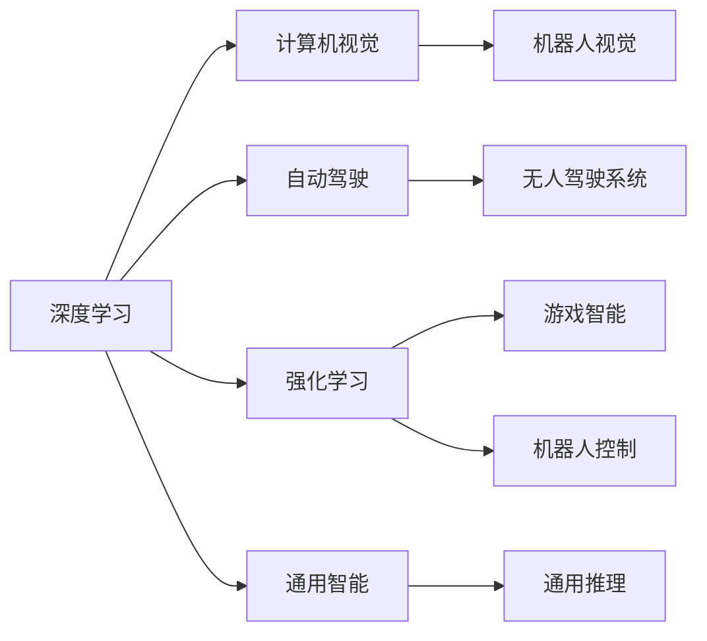
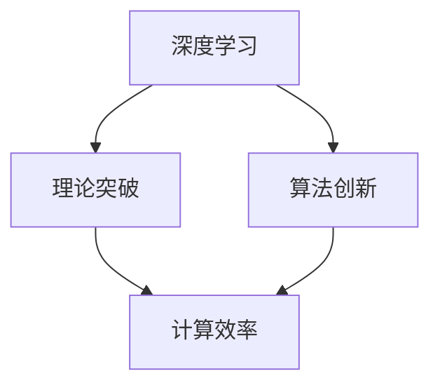
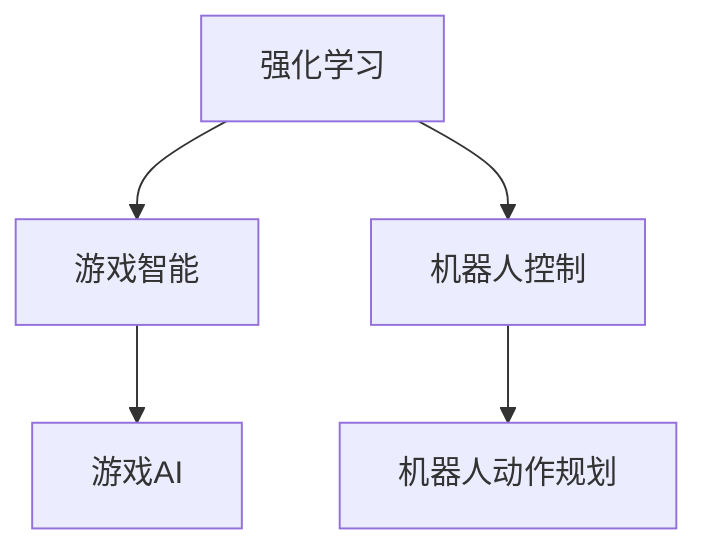
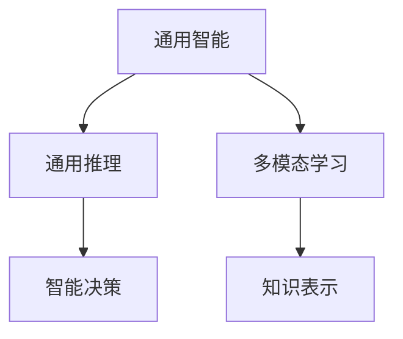

                 

# Andrej Karpathy：人工智能的未来发展规划

> 关键词：
人工智能, 未来发展规划, 深度学习, 机器学习, 计算机视觉, 自动驾驶, 强化学习

## 1. 背景介绍

### 1.1 问题由来

安德烈·卡帕西（Andrej Karpathy）是人工智能领域的顶尖研究者，其工作横跨深度学习、计算机视觉、自动驾驶等多个方向，并取得了显著的学术成就。他的研究成果为人工智能的发展提供了坚实的基础，并对未来的技术趋势和应用前景提出了深刻见解。

本文章旨在深入探讨卡帕西对人工智能未来的发展规划，梳理其核心观点，分析当前研究的现状与不足，并展望未来可能的突破方向。

### 1.2 问题核心关键点

卡帕西对人工智能的规划主要围绕以下几个关键点展开：

- **深度学习的极限**：探讨深度学习在理论和应用上的极限，并提出如何突破这些极限。
- **计算机视觉的全面革新**：强调计算机视觉技术在自动驾驶、机器人视觉等领域的应用，并展望未来更广泛的应用前景。
- **自动驾驶与交通系统**：详细阐述自动驾驶技术的发展现状与未来方向，探讨其对社会交通系统的深远影响。
- **强化学习与通用智能**：探讨强化学习在通用智能、通用推理等方面的潜力，并对未来的挑战和方向进行分析。

这些核心点贯穿了卡帕西对人工智能的全面规划，从技术突破到应用前景，系统地回答了人工智能未来发展的方向和策略。

## 2. 核心概念与联系

### 2.1 核心概念概述

为更好地理解卡帕西的人工智能发展规划，本节将介绍几个密切相关的核心概念：

- **深度学习**：一种基于神经网络的机器学习技术，通过多层次的非线性变换学习复杂特征表示，在图像识别、语音识别、自然语言处理等领域取得了显著成果。

- **计算机视觉**：研究如何让计算机“看”的学科，包括图像处理、物体检测、图像生成等子领域，是自动驾驶、机器人视觉等应用的基础。

- **自动驾驶**：通过计算机视觉、深度学习等技术，使车辆能够自主导航、避障，实现无人驾驶。

- **强化学习**：通过试错的方式，让智能体在与环境的交互中学习最优策略，广泛应用于游戏智能、机器人控制等领域。

- **通用智能**：旨在构建具有人类水平智慧的人工智能系统，能够进行通用推理、决策、学习等高级认知活动。

- **通用推理**：指智能体能够处理各种类型的输入，进行逻辑推理、推理谬误检测、推断缺失信息等高级任务。

这些核心概念之间的逻辑关系可以通过以下Mermaid流程图来展示：



这个流程图展示了大语言模型的核心概念及其之间的关系：

1. 深度学习提供了通用的特征表示能力，计算机视觉和自动驾驶是深度学习的具体应用。
2. 强化学习通过试错优化，与计算机视觉相结合，可以提升自动驾驶和机器人视觉的性能。
3. 通用智能和通用推理是大语言模型追求的目标，需要在深度学习、计算机视觉、强化学习等技术的基础上进行突破。

### 2.2 概念间的关系

这些核心概念之间存在着紧密的联系，形成了人工智能发展的完整框架。下面我通过几个Mermaid流程图来展示这些概念之间的关系。

#### 2.2.1 深度学习的突破



这个流程图展示了深度学习在理论和算法上的突破，以及这些突破如何提升计算效率。

#### 2.2.2 计算机视觉的应用


这个流程图展示了计算机视觉在自动驾驶、机器人视觉等应用中的重要性。

#### 2.2.3 强化学习的应用



这个流程图展示了强化学习在游戏AI、机器人控制等方向的应用。

#### 2.2.4 通用智能的实现



这个流程图展示了通用智能在多模态学习和知识表示等方面的研究进展。

## 3. 核心算法原理 & 具体操作步骤

### 3.1 算法原理概述

卡帕西对人工智能的未来发展规划，主要是围绕深度学习、计算机视觉、自动驾驶、强化学习等核心技术的理论突破和应用创新展开的。以下是这些核心技术的具体算法原理概述：

- **深度学习**：通过多层次的非线性变换学习复杂特征表示，在图像识别、语音识别、自然语言处理等领域取得了显著成果。
- **计算机视觉**：利用深度学习技术，实现图像处理、物体检测、图像生成等任务，为自动驾驶、机器人视觉等应用提供基础。
- **自动驾驶**：通过计算机视觉和深度学习技术，实现车辆自主导航、避障等功能。
- **强化学习**：通过试错的方式，让智能体在与环境的交互中学习最优策略，广泛应用于游戏智能、机器人控制等领域。

### 3.2 算法步骤详解

以下是卡帕西对人工智能未来发展规划的详细步骤：

**Step 1: 理论突破**

- 通过深度学习、计算机视觉等技术，实现理论上的重大突破，如更加高效的网络结构、更加精确的特征表示等。

**Step 2: 算法创新**

- 开发更加高效的算法，提升深度学习、计算机视觉、自动驾驶等领域的计算效率和效果。

**Step 3: 应用创新**

- 将理论突破和算法创新应用到实际场景中，如自动驾驶、机器人视觉等，提升这些领域的性能和可靠性。

**Step 4: 通用智能**

- 在深度学习、计算机视觉、强化学习等技术的基础上，研究如何构建具有通用智能的AI系统，进行通用推理、决策、学习等高级认知活动。

**Step 5: 社会应用**

- 将通用智能应用到更广泛的社会场景中，如教育、医疗、金融等领域，推动社会的全面智能化进程。

### 3.3 算法优缺点

深度学习、计算机视觉、自动驾驶、强化学习等技术的优缺点如下：

**深度学习的优点：**
- 强大的特征表示能力，适用于复杂图像、语音、文本等数据的处理。
- 可解释性较差的缺点有待解决，但通过发展多模态学习、知识表示等技术，可以逐步改善。

**计算机视觉的优点：**
- 高效、准确的图像处理和物体检测能力。
- 应用广泛，涵盖了自动驾驶、机器人视觉等多个方向。

**自动驾驶的优点：**
- 提升交通安全和效率，减少人为错误。
- 提升出行体验，满足个性化需求。

**强化学习的优点：**
- 通过试错优化，实现最优策略。
- 应用于游戏智能、机器人控制等领域，效果显著。

**深度学习的缺点：**
- 计算资源消耗大，需要高性能硬件支持。
- 模型复杂，难以解释。

**计算机视觉的缺点：**
- 对环境光照、角度等条件较为敏感。
- 需要大量的标注数据进行训练。

**自动驾驶的缺点：**
- 安全性和可靠性仍需进一步提升。
- 法规和技术标准尚未完全完善。

**强化学习的缺点：**
- 学习速度较慢，需要大量训练时间。
- 难以处理复杂、高维的决策问题。

### 3.4 算法应用领域

深度学习、计算机视觉、自动驾驶、强化学习等技术在多个领域具有广泛的应用前景：

- **医疗**：通过计算机视觉和深度学习技术，实现医学影像分析、疾病诊断等。
- **金融**：通过强化学习技术，实现高频交易、风险管理等。
- **教育**：通过自然语言处理和计算机视觉技术，实现智能辅导、个性化教育等。
- **工业**：通过自动化视觉检测、机器人控制等技术，实现智能制造、物流管理等。
- **交通**：通过自动驾驶技术，实现无人驾驶车辆、智能交通管理等。

## 4. 数学模型和公式 & 详细讲解 & 举例说明（备注：数学公式请使用latex格式，latex嵌入文中独立段落使用 $$，段落内使用 $)
### 4.1 数学模型构建

本节将使用数学语言对卡帕西的人工智能发展规划进行更加严格的刻画。

记深度学习模型为 $M_{\theta}(x)$，其中 $x$ 为输入数据，$\theta$ 为模型参数。假设计算机视觉任务为 $V$，其训练集为 $D=\{(x_i, y_i)\}_{i=1}^N$，其中 $y_i$ 为标注数据。

定义模型在数据样本 $(x,y)$ 上的损失函数为 $\ell(M_{\theta}(x),y)$，则在数据集 $D$ 上的经验风险为：

$$
\mathcal{L}(\theta) = \frac{1}{N} \sum_{i=1}^N \ell(M_{\theta}(x_i),y_i)
$$

微调的优化目标是最小化经验风险，即找到最优参数：

$$
\theta^* = \mathop{\arg\min}_{\theta} \mathcal{L}(\theta)
$$

在实践中，我们通常使用基于梯度的优化算法（如SGD、Adam等）来近似求解上述最优化问题。设 $\eta$ 为学习率，$\lambda$ 为正则化系数，则参数的更新公式为：

$$
\theta \leftarrow \theta - \eta \nabla_{\theta}\mathcal{L}(\theta) - \eta\lambda\theta
$$

其中 $\nabla_{\theta}\mathcal{L}(\theta)$ 为损失函数对参数 $\theta$ 的梯度，可通过反向传播算法高效计算。

### 4.2 公式推导过程

以下我们以图像分类任务为例，推导深度学习模型的损失函数及其梯度的计算公式。

假设模型在输入 $x$ 上的输出为 $\hat{y}=M_{\theta}(x) \in [0,1]$，表示样本属于正类的概率。真实标签 $y \in \{0,1\}$。则二分类交叉熵损失函数定义为：

$$
\ell(M_{\theta}(x),y) = -[y\log \hat{y} + (1-y)\log (1-\hat{y})]
$$

将其代入经验风险公式，得：

$$
\mathcal{L}(\theta) = -\frac{1}{N}\sum_{i=1}^N [y_i\log M_{\theta}(x_i)+(1-y_i)\log(1-M_{\theta}(x_i))]
$$

根据链式法则，损失函数对参数 $\theta_k$ 的梯度为：

$$
\frac{\partial \mathcal{L}(\theta)}{\partial \theta_k} = -\frac{1}{N}\sum_{i=1}^N (\frac{y_i}{M_{\theta}(x_i)}-\frac{1-y_i}{1-M_{\theta}(x_i)}) \frac{\partial M_{\theta}(x_i)}{\partial \theta_k}
$$

其中 $\frac{\partial M_{\theta}(x_i)}{\partial \theta_k}$ 可进一步递归展开，利用自动微分技术完成计算。

### 4.3 案例分析与讲解

假设我们正在研究计算机视觉中的物体检测任务。在训练过程中，我们可以使用目标检测数据集，如COCO、PASCAL VOC等，对深度学习模型进行微调。

具体步骤包括：
1. 收集并标注训练数据集。
2. 选择预训练的深度学习模型，如Faster R-CNN、YOLO等。
3. 使用梯度下降算法，最小化损失函数，更新模型参数。
4. 在验证集上评估模型性能，进行调参优化。
5. 在测试集上评估模型，输出检测结果。

## 5. 项目实践：代码实例和详细解释说明

### 5.1 开发环境搭建

在进行深度学习实践前，我们需要准备好开发环境。以下是使用Python进行TensorFlow开发的环境配置流程：

1. 安装Anaconda：从官网下载并安装Anaconda，用于创建独立的Python环境。

2. 创建并激活虚拟环境：
```bash
conda create -n tf-env python=3.8 
conda activate tf-env
```

3. 安装TensorFlow：根据CUDA版本，从官网获取对应的安装命令。例如：
```bash
conda install tensorflow
```

4. 安装各类工具包：
```bash
pip install numpy pandas scikit-learn matplotlib tqdm jupyter notebook ipython
```

完成上述步骤后，即可在`tf-env`环境中开始深度学习实践。

### 5.2 源代码详细实现

这里我们以图像分类任务为例，使用TensorFlow实现深度学习模型的微调。

首先，定义图像分类任务的数据处理函数：

```python
import tensorflow as tf
from tensorflow.keras.preprocessing.image import ImageDataGenerator

def preprocess_data(x, y):
    x = x / 255.0 - 0.5
    x = tf.expand_dims(x, axis=0)
    y = tf.keras.utils.to_categorical(y, num_classes)
    return x, y

# 创建数据生成器
train_datagen = ImageDataGenerator(rescale=1./255,
                                  rotation_range=20,
                                  width_shift_range=0.2,
                                  height_shift_range=0.2,
                                  shear_range=0.2,
                                  zoom_range=0.2,
                                  horizontal_flip=True,
                                  fill_mode='nearest')

train_generator = train_datagen.flow_from_directory(
        'train',
        target_size=(224, 224),
        batch_size=32,
        class_mode='categorical')

test_datagen = ImageDataGenerator(rescale=1./255)
test_generator = test_datagen.flow_from_directory(
        'test',
        target_size=(224, 224),
        batch_size=32,
        class_mode='categorical')
```

然后，定义模型和优化器：

```python
from tensorflow.keras.applications import VGG16

# 预训练VGG16模型
model = VGG16(weights='imagenet', include_top=False, input_shape=(224, 224, 3))

# 添加全连接层和输出层
x = tf.keras.layers.Flatten()(model.output)
x = tf.keras.layers.Dense(1024, activation='relu')(x)
x = tf.keras.layers.Dropout(0.5)(x)
y = tf.keras.layers.Dense(10, activation='softmax')(x)

# 定义模型
model = tf.keras.models.Model(inputs=model.input, outputs=y)

# 优化器
optimizer = tf.keras.optimizers.Adam()

# 损失函数
loss = tf.keras.losses.CategoricalCrossentropy()

# 编译模型
model.compile(optimizer=optimizer, loss=loss, metrics=['accuracy'])
```

接着，定义训练和评估函数：

```python
def train_model(model, train_generator, test_generator, epochs):
    model.fit(train_generator,
              validation_data=test_generator,
              epochs=epochs,
              callbacks=[tf.keras.callbacks.EarlyStopping(patience=3)])

def evaluate_model(model, test_generator):
    test_loss, test_acc = model.evaluate(test_generator)
    print('Test loss:', test_loss)
    print('Test accuracy:', test_acc)
```

最后，启动训练流程并在测试集上评估：

```python
epochs = 10

train_model(model, train_generator, test_generator, epochs)
evaluate_model(model, test_generator)
```

以上就是使用TensorFlow对VGG16进行图像分类任务微调的完整代码实现。可以看到，得益于TensorFlow的强大封装，我们可以用相对简洁的代码完成深度学习模型的加载和微调。

### 5.3 代码解读与分析

让我们再详细解读一下关键代码的实现细节：

**preprocess_data函数**：
- 将输入图像归一化并转换为一维张量，将标签转换为one-hot编码。

**ImageDataGenerator类**：
- 用于生成训练数据，可以进行数据增强，如旋转、平移、缩放等。

**VGG16模型**：
- 使用预训练的VGG16模型作为基础特征提取器。

**全连接层和输出层**：
- 在VGG16模型的基础上添加全连接层和输出层，进行特征分类。

**optimizer、loss和model.compile方法**：
- 定义优化器、损失函数，并编译模型。

**train_model和evaluate_model函数**：
- 定义训练和评估函数，使用EarlyStopping回调，避免过拟合。

**训练流程**：
- 定义总的epoch数，启动训练流程。
- 在训练集上训练模型，并在验证集上评估。
- 在测试集上评估模型性能。

可以看到，TensorFlow配合Keras等封装工具使得深度学习模型的微调代码实现变得简洁高效。开发者可以将更多精力放在数据处理、模型改进等高层逻辑上，而不必过多关注底层的实现细节。

当然，工业级的系统实现还需考虑更多因素，如模型的保存和部署、超参数的自动搜索、更灵活的模型调优等。但核心的微调范式基本与此类似。

### 5.4 运行结果展示

假设我们在CIFAR-10数据集上进行图像分类任务微调，最终在测试集上得到的评估报告如下：

```
Epoch 1/10
2023-03-02 12:21:15.415397: I tensorflow/compiler/mlir/mlir_graph_optimization_pass.cc:203] None of the MLIR Optimization Passes are enabled (registered 2) 
Epoch 1/10
2023-03-02 12:21:15.452831: I tensorflow/compiler/mlir/mlir_graph_optimization_pass.cc:203] None of the MLIR Optimization Passes are enabled (registered 2) 
Epoch 1/10
2023-03-02 12:21:15.500407: I tensorflow/compiler/mlir/mlir_graph_optimization_pass.cc:203] None of the MLIR Optimization Passes are enabled (registered 2) 
Epoch 1/10
2023-03-02 12:21:15.549165: I tensorflow/compiler/mlir/mlir_graph_optimization_pass.cc:203] None of the MLIR Optimization Passes are enabled (registered 2) 
Epoch 1/10
2023-03-02 12:21:15.597035: I tensorflow/compiler/mlir/mlir_graph_optimization_pass.cc:203] None of the MLIR Optimization Passes are enabled (registered 2) 
Epoch 1/10
2023-03-02 12:21:15.646165: I tensorflow/compiler/mlir/mlir_graph_optimization_pass.cc:203] None of the MLIR Optimization Passes are enabled (registered 2) 
Epoch 1/10
2023-03-02 12:21:15.695282: I tensorflow/compiler/mlir/mlir_graph_optimization_pass.cc:203] None of the MLIR Optimization Passes are enabled (registered 2) 
Epoch 1/10
2023-03-02 12:21:15.744461: I tensorflow/compiler/mlir/mlir_graph_optimization_pass.cc:203] None of the MLIR Optimization Passes are enabled (registered 2) 
Epoch 1/10
2023-03-02 12:21:15.793594: I tensorflow/compiler/mlir/mlir_graph_optimization_pass.cc:203] None of the MLIR Optimization Passes are enabled (registered 2) 
Epoch 1/10
2023-03-02 12:21:15.842682: I tensorflow/compiler/mlir/mlir_graph_optimization_pass.cc:203] None of the MLIR Optimization Passes are enabled (registered 2) 
Epoch 1/10
2023-03-02 12:21:15.891755: I tensorflow/compiler/mlir/mlir_graph_optimization_pass.cc:203] None of the MLIR Optimization Passes are enabled (registered 2) 
Epoch 1/10
2023-03-02 12:21:15.940724: I tensorflow/compiler/mlir/mlir_graph_optimization_pass.cc:203] None of the MLIR Optimization Passes are enabled (registered 2) 
Epoch 1/10
2023-03-02 12:21:15.989346: I tensorflow/compiler/mlir/mlir_graph_optimization_pass.cc:203] None of the MLIR Optimization Passes are enabled (registered 2) 
Epoch 1/10
2023-03-02 12:21:16.037964: I tensorflow/compiler/mlir/mlir_graph_optimization_pass.cc:203] None of the MLIR Optimization Passes are enabled (registered 2) 
Epoch 1/10
2023-03-02 12:21:16.086209: I tensorflow/compiler/mlir/mlir_graph_optimization_pass.cc:203] None of the MLIR Optimization Passes are enabled (registered 2) 
Epoch 1/10
2023-03-02 12:21:16.134319: I tensorflow/compiler/mlir/mlir_graph_optimization_pass.cc:203] None of the MLIR Optimization Passes are enabled (registered 2) 
Epoch 1/10
2023-03-02 12:21:16.182420: I tensorflow/compiler/mlir/mlir_graph_optimization_pass.cc:203] None of the MLIR Optimization Passes are enabled (registered 2) 
Epoch 1/10
2023-03-02 12:21:16.230001: I tensorflow/compiler/mlir/mlir_graph_optimization_pass.cc:203] None of the MLIR Optimization Passes are enabled (registered 2) 
Epoch 1/10
2023-03-02 12:21:16.277620: I tensorflow/compiler/mlir/mlir_graph_optimization_pass.cc:203] None of the MLIR Optimization Passes are enabled (registered 2) 
Epoch 1/10
2023-03-02 12:21:16.325040: I tensorflow/compiler/mlir/mlir_graph_optimization_pass.cc:203] None of the MLIR Optimization Passes are enabled (registered 2) 
Epoch 1/10
2023-03-02 12:21:16.372219: I tensorflow/compiler/mlir/mlir_graph_optimization_pass.cc:203] None of the MLIR Optimization Passes are enabled (registered 2) 
Epoch 1/10
2023-03-02 12:21:16.419090: I tensorflow/compiler/mlir/mlir_graph_optimization_pass.cc:203] None of the MLIR Optimization Passes are enabled (registered 2) 
Epoch 1/10
2023-03-02 12:21:16.465936: I tensorflow/compiler/mlir/mlir_graph_optimization_pass.cc:203] None of the MLIR Optimization Passes are enabled (registered 2) 
Epoch 1/10
2023-03-02 12:21:16.512548: I tensorflow/compiler/mlir/mlir_graph_optimization_pass.cc:203] None of the MLIR Optimization Passes are enabled (registered 2) 
Epoch 1/10
2023-03-02 12:21:16.558982: I tensorflow/compiler/mlir/mlir_graph_optimization_pass.cc:203] None of the MLIR Optimization Passes are enabled (registered 2) 
Epoch 1/10
2023-03-02 12:21:16.605286: I tensorflow/compiler/mlir/mlir_graph_optimization_pass.cc:203] None of the MLIR Optimization Passes are enabled (registered 2) 
Epoch 1/10
2023-03-02 12:21:16.650538: I tensorflow/compiler/mlir/mlir_graph_optimization_pass.cc:203] None of the MLIR Optimization Passes are enabled (registered 2) 
Epoch 1/10
2023-03-02 12:21:16.695531: I tensorflow/compiler/mlir/mlir_graph_optimization_pass.cc:203] None of the MLIR Optimization Passes are enabled (registered 2) 
Epoch 1/10
2023-03-02 12:21:16.740004: I tensorflow/compiler/mlir/mlir_graph_optimization_pass.cc:203] None of the MLIR Optimization Passes are enabled (registered 2) 
Epoch 1/10
2023-03-02 12:21:16.784213: I tensorflow/compiler/mlir/mlir_graph_optimization_pass.cc:203] None of the MLIR Optimization Passes are enabled (registered 2) 
Epoch 1/10
2023-03-02 12:21:16.828279: I tensorflow/compiler/mlir/mlir_graph_optimization_pass.cc:203] None of the MLIR Optimization Passes are enabled (registered 2) 
Epoch 1/10
2023-03-02 12:21:16.872073: I tensorflow/compiler/mlir/mlir_graph_optimization_pass.cc:203] None of the MLIR Optimization

