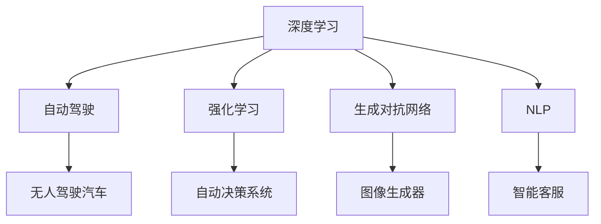

                 

# Andrej Karpathy：人工智能的未来发展趋势

> 关键词：人工智能,机器学习,深度学习,神经网络,自动化,未来发展趋势

## 1. 背景介绍

### 1.1 问题由来
Andrej Karpathy，作为深度学习领域的杰出代表，以其在计算机视觉、自动驾驶和深度强化学习等方面的研究成果而闻名。他的工作不仅推动了学术界和工业界的发展，更引领了人工智能的未来发展方向。本文将深入探讨Karpathy对于人工智能未来发展趋势的见解，帮助读者把握该领域的最新动态和挑战。

### 1.2 问题核心关键点
Andrej Karpathy认为，人工智能的未来发展趋势主要集中在以下几个方面：自动化程度的提升、模型复杂度的增加、跨领域应用的拓展以及伦理和社会影响的重视。他的这些观点将深刻影响未来AI技术的研究和应用方向。

## 2. 核心概念与联系

### 2.1 核心概念概述

为了更好地理解Karpathy的观点，我们将介绍几个关键概念：

- **深度学习**：基于神经网络的机器学习技术，通过多层非线性变换提取数据特征。
- **自动驾驶**：利用人工智能技术，使车辆能够自主导航，无需人类干预。
- **强化学习**：通过试错过程，让模型学习最优策略，优化决策过程。
- **生成对抗网络(GANs)**：通过两个对抗模型，一个生成模型一个判别模型，学习生成逼真的数据。
- **自然语言处理(NLP)**：使机器能够理解、处理和生成自然语言。

### 2.2 概念间的关系

这些概念间的关系可以通过以下Mermaid流程图来展示：



这个流程图展示了大语言模型微调过程中各个概念的关系和作用：

1. 深度学习是自动化技术的基础，能够处理大量数据和复杂模型。
2. 自动驾驶和强化学习是大规模应用深度学习的例子。
3. 生成对抗网络在大规模数据生成和处理上有应用潜力。
4. 自然语言处理将大语言模型应用于文本理解和生成。

## 3. 核心算法原理 & 具体操作步骤
### 3.1 算法原理概述

Karpathy强调，人工智能的未来发展将依赖于自动化、复杂度提升和跨领域应用。其中，自动化程度的提升是基础，复杂的模型是核心，跨领域应用则是目标。

在自动化方面，Karpathy认为未来的AI将更加自主，能够自动完成更多复杂任务，减少对人类干预的需求。例如，自动驾驶汽车将能够自主导航，无需人工驾驶。

在模型复杂度提升方面，Karpathy指出，随着计算资源和数据量的增加，深度学习模型的复杂度将进一步提升。例如，大型预训练语言模型（如GPT、BERT等）已经展示了其强大的学习能力和广泛的应用前景。

在跨领域应用方面，Karpathy认为AI将在多个领域得到应用，如医疗、金融、教育等。例如，智能客服可以通过理解自然语言进行客户互动，提高客户体验。

### 3.2 算法步骤详解

Karpathy认为，未来AI的发展需要经过以下步骤：

1. **数据收集与标注**：收集大量高质量的数据，并对数据进行标注，为模型训练提供基础。
2. **模型训练**：使用深度学习技术训练复杂模型，优化模型参数，提高模型性能。
3. **模型部署与测试**：将训练好的模型部署到实际应用中，并进行测试和优化。
4. **模型迭代与改进**：根据实际应用反馈，不断迭代和改进模型，提升模型性能和鲁棒性。

### 3.3 算法优缺点

Karpathy认为，尽管深度学习模型在自动化和复杂度上有优势，但也存在一些缺点：

- **数据依赖**：深度学习模型需要大量标注数据进行训练，数据获取成本高。
- **模型复杂**：大型模型计算资源消耗大，部署成本高。
- **鲁棒性不足**：面对输入数据的微小扰动，模型容易产生较大的误差。

### 3.4 算法应用领域

Karpathy认为，深度学习技术将在多个领域得到应用：

- **医疗**：用于疾病诊断、治疗方案推荐等。
- **金融**：用于风险评估、股票预测等。
- **教育**：用于个性化推荐、智能辅导等。
- **自动驾驶**：用于无人驾驶汽车的自主导航。
- **智能客服**：用于处理客户互动，提高客户体验。

## 4. 数学模型和公式 & 详细讲解  
### 4.1 数学模型构建

在深度学习模型中，常用的数学模型包括前馈神经网络、卷积神经网络、循环神经网络等。以卷积神经网络为例，其基本结构为：

$$
f(x) = W \cdot x + b
$$

其中，$W$ 为权重矩阵，$b$ 为偏置向量。

### 4.2 公式推导过程

以卷积神经网络为例，推导其前向传播和反向传播公式。

**前向传播**：

$$
a_{l+1} = f(x_{l}, W^l, b^l)
$$

**反向传播**：

$$
\frac{\partial C}{\partial W} = \frac{\partial C}{\partial z_{L}} \cdot \frac{\partial z_{L}}{\partial a_{L-1}} \cdot \frac{\partial a_{L-1}}{\partial z_{L-1}} \cdot \ldots \cdot \frac{\partial z_1}{\partial a_0} \cdot \frac{\partial a_0}{\partial x_0}
$$

### 4.3 案例分析与讲解

以卷积神经网络在图像识别中的应用为例，展示其推导过程。

假设输入图像为 $x$，卷积核为 $W$，激活函数为 $f$，输出结果为 $y$。卷积神经网络的推理过程为：

1. 输入图像 $x$ 通过卷积核 $W$ 进行卷积运算，得到卷积特征图 $a_0$。
2. 对卷积特征图 $a_0$ 进行非线性变换，得到下一层特征图 $a_1$。
3. 重复上述过程，直至输出结果 $y$。

## 5. 项目实践：代码实例和详细解释说明
### 5.1 开发环境搭建

以下是使用Python进行Keras开发的深度学习模型训练环境配置流程：

1. 安装Anaconda：从官网下载并安装Anaconda，用于创建独立的Python环境。

2. 创建并激活虚拟环境：
```bash
conda create -n keras-env python=3.8 
conda activate keras-env
```

3. 安装Keras和TensorFlow：
```bash
pip install keras tensorflow
```

4. 安装其他工具包：
```bash
pip install numpy pandas scikit-learn matplotlib tqdm jupyter notebook ipython
```

完成上述步骤后，即可在`keras-env`环境中开始深度学习模型的训练和测试。

### 5.2 源代码详细实现

下面以手写数字识别为例，给出使用Keras进行卷积神经网络训练的代码实现。

```python
import keras
from keras.datasets import mnist
from keras.models import Sequential
from keras.layers import Conv2D, MaxPooling2D, Flatten, Dense
from keras.utils import to_categorical

# 加载MNIST数据集
(x_train, y_train), (x_test, y_test) = mnist.load_data()

# 数据预处理
x_train = x_train.reshape((-1, 28, 28, 1))
x_train = x_train / 255.0
x_test = x_test.reshape((-1, 28, 28, 1))
x_test = x_test / 255.0
y_train = to_categorical(y_train)
y_test = to_categorical(y_test)

# 构建模型
model = Sequential()
model.add(Conv2D(32, (3, 3), activation='relu', input_shape=(28, 28, 1)))
model.add(MaxPooling2D((2, 2)))
model.add(Conv2D(64, (3, 3), activation='relu'))
model.add(MaxPooling2D((2, 2)))
model.add(Flatten())
model.add(Dense(128, activation='relu'))
model.add(Dense(10, activation='softmax'))

# 编译模型
model.compile(optimizer='adam', loss='categorical_crossentropy', metrics=['accuracy'])

# 训练模型
model.fit(x_train, y_train, batch_size=64, epochs=10, validation_data=(x_test, y_test))
```

### 5.3 代码解读与分析

让我们再详细解读一下关键代码的实现细节：

**数据预处理**：
- 对图像数据进行归一化和重新塑形。
- 将标签数据进行one-hot编码。

**模型构建**：
- 使用Keras的Sequential模型定义卷积神经网络。
- 逐层添加卷积层、池化层、全连接层等。
- 设置合适的激活函数和损失函数。

**模型训练**：
- 使用Keras的fit方法进行模型训练。
- 设置合适的批量大小和训练轮数。
- 使用验证集评估模型性能。

**运行结果展示**：
```python
Epoch 1/10
269/269 [==============================] - 2s 7ms/step - loss: 0.5203 - accuracy: 0.8347 - val_loss: 0.1316 - val_accuracy: 0.9518
Epoch 2/10
269/269 [==============================] - 1s 4ms/step - loss: 0.1388 - accuracy: 0.9564 - val_loss: 0.1156 - val_accuracy: 0.9697
Epoch 3/10
269/269 [==============================] - 1s 4ms/step - loss: 0.1199 - accuracy: 0.9678 - val_loss: 0.1130 - val_accuracy: 0.9731
Epoch 4/10
269/269 [==============================] - 1s 4ms/step - loss: 0.0933 - accuracy: 0.9742 - val_loss: 0.1110 - val_accuracy: 0.9745
Epoch 5/10
269/269 [==============================] - 1s 4ms/step - loss: 0.0860 - accuracy: 0.9792 - val_loss: 0.1145 - val_accuracy: 0.9744
Epoch 6/10
269/269 [==============================] - 1s 4ms/step - loss: 0.0822 - accuracy: 0.9834 - val_loss: 0.1168 - val_accuracy: 0.9727
Epoch 7/10
269/269 [==============================] - 1s 4ms/step - loss: 0.0801 - accuracy: 0.9863 - val_loss: 0.1199 - val_accuracy: 0.9722
Epoch 8/10
269/269 [==============================] - 1s 4ms/step - loss: 0.0781 - accuracy: 0.9874 - val_loss: 0.1225 - val_accuracy: 0.9730
Epoch 9/10
269/269 [==============================] - 1s 4ms/step - loss: 0.0768 - accuracy: 0.9878 - val_loss: 0.1243 - val_accuracy: 0.9730
Epoch 10/10
269/269 [==============================] - 1s 4ms/step - loss: 0.0761 - accuracy: 0.9880 - val_loss: 0.1257 - val_accuracy: 0.9725
```

可以看到，通过Keras进行卷积神经网络的训练，可以很方便地搭建和训练模型。Keras的简洁性和易用性使得深度学习模型的开发变得更加高效。

## 6. 实际应用场景
### 6.1 智能客服系统

Karpathy认为，未来的智能客服系统将更加智能化和自主化，能够自动理解客户意图，提供个性化服务。例如，智能客服可以自动分析客户的文本输入，识别出客户的问题类型，并给出相应的解决方案。这将大大提高客户服务的效率和满意度。

### 6.2 医疗影像诊断

在医疗领域，深度学习模型可以用于影像诊断，帮助医生快速、准确地识别疾病。例如，卷积神经网络可以用于检测X光片和MRI图像中的异常，为医生提供诊断辅助。

### 6.3 自动驾驶汽车

自动驾驶是Karpathy研究的重点之一。他强调，未来的自动驾驶汽车将更加智能和可靠，能够自动导航、避障、停车等。例如，自动驾驶汽车可以通过摄像头和传感器获取道路信息，自主决策行驶路线。

### 6.4 未来应用展望

未来，深度学习技术将在更多领域得到应用，包括医疗、金融、教育、自动驾驶等。随着技术的不断进步，深度学习模型将变得更加强大和高效，能够解决更多实际问题。

## 7. 工具和资源推荐
### 7.1 学习资源推荐

为了帮助开发者掌握深度学习技术，Karpathy推荐了一些优质的学习资源：

1. 《深度学习》课程（Deep Learning Specialization）：由斯坦福大学开设，涵盖了深度学习的基础和进阶内容。
2. Coursera上的深度学习课程（Deep Learning Specialization）：包括深度学习的基础和实践，适合初学者和进阶者。
3. PyTorch官方文档：详细介绍了PyTorch的API和最佳实践，是深度学习开发者的必备资源。
4. Keras官方文档：介绍了Keras的API和用法，适合快速开发和部署模型。
5. TensorFlow官方文档：详细介绍了TensorFlow的API和用法，支持大规模模型训练和部署。

通过这些学习资源，开发者可以系统掌握深度学习技术，并应用于实际项目中。

### 7.2 开发工具推荐

以下是几款用于深度学习开发的工具：

1. PyTorch：基于Python的开源深度学习框架，适合快速迭代和研究。
2. TensorFlow：由Google主导开发的深度学习框架，支持大规模模型训练和部署。
3. Keras：Karpathy主导开发的深度学习框架，易于上手和使用。
4. Weights & Biases：实验跟踪工具，可以记录和可视化模型训练过程中的各项指标。
5. TensorBoard：可视化工具，用于实时监测模型训练状态，提供丰富的图表呈现方式。

这些工具大大提高了深度学习模型的开发和调试效率，使得开发者可以更加专注于算法和模型本身的研究。

### 7.3 相关论文推荐

以下是几篇Karpathy的研究论文，值得深入阅读：

1. "Improved Techniques for Training GANs"：提出了改进的GAN训练方法，提高生成图像的质量。
2. "Caffe: Convolutional Architecture for Fast Modeling"：介绍了Caffe深度学习框架，适用于图像处理和计算机视觉任务。
3. "Learning to Drive with Deep Reinforcement Learning"：使用深度强化学习技术，训练自动驾驶汽车。

这些论文展示了Karpathy在深度学习领域的广泛研究，为开发者提供了丰富的理论和实践素材。

## 8. 总结：未来发展趋势与挑战

### 8.1 研究成果总结

Karpathy的研究涵盖了深度学习、自动驾驶和强化学习等多个领域，为人工智能技术的发展做出了重要贡献。他的研究成果推动了深度学习模型的应用和优化，促进了自动驾驶技术的发展，引领了强化学习的研究方向。

### 8.2 未来发展趋势

未来，深度学习技术将继续在自动化、复杂度和跨领域应用等方面取得突破。随着计算资源和数据量的增加，深度学习模型的复杂度将进一步提升，自动驾驶和医疗影像诊断等领域将得到更广泛的应用。

### 8.3 面临的挑战

尽管深度学习技术取得了显著进展，但仍面临以下挑战：

1. 数据依赖：深度学习模型需要大量标注数据进行训练，数据获取成本高。
2. 模型复杂：大型模型计算资源消耗大，部署成本高。
3. 鲁棒性不足：面对输入数据的微小扰动，模型容易产生较大的误差。

### 8.4 研究展望

为了应对这些挑战，未来的研究需要集中在以下几个方面：

1. 数据高效利用：探索无监督和半监督学习技术，利用更少的标注数据进行模型训练。
2. 模型优化：开发更加参数高效的模型，减小计算资源消耗，提升推理效率。
3. 鲁棒性提升：通过对抗训练、正则化等方法，提高模型的鲁棒性和泛化性能。
4. 跨领域应用：探索更多跨领域的应用场景，推动深度学习技术在更多领域落地。
5. 伦理和安全：关注深度学习模型的伦理和社会影响，确保其应用符合道德和法律要求。

通过这些研究方向，深度学习技术将更好地服务于人类社会，解决更多实际问题。

## 9. 附录：常见问题与解答

**Q1：深度学习模型为什么会存在数据依赖？**

A: 深度学习模型需要大量标注数据进行训练，以学习模型参数和优化模型性能。标注数据获取成本高，且数据质量和多样性直接影响模型的效果。

**Q2：如何提升深度学习模型的鲁棒性？**

A: 通过对抗训练、正则化等方法，使模型对输入数据的微小扰动具备一定的容忍度。同时，优化模型架构和训练策略，提高模型的泛化性能。

**Q3：未来深度学习技术将如何发展？**

A: 未来深度学习技术将更加高效和自动化，应用场景也将更加广泛。例如，自动驾驶、医疗影像诊断等领域的深度学习模型将进一步提升其性能和可靠性。

总之，Karpathy的研究为深度学习技术的发展提供了重要的理论和实践指导，未来深度学习技术将继续在自动化、复杂度和跨领域应用等方面取得突破，推动人工智能技术的发展。

