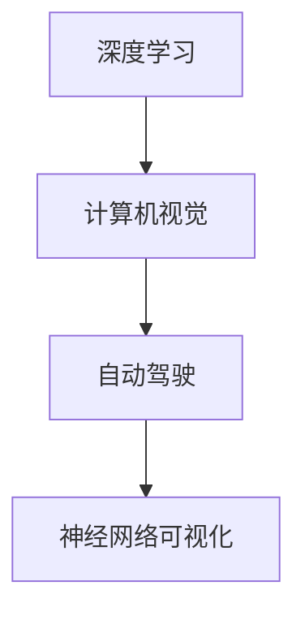

                 

# Andrej Karpathy：人工智能的未来发展趋势

Andrej Karpathy，作为人工智能领域的顶级专家，其在深度学习、计算机视觉、自动驾驶等领域的贡献对整个AI界产生了深远影响。本文将围绕Andrej Karpathy的研究和观点，探讨人工智能的未来发展趋势，以及其在关键技术领域的突破和未来挑战。

## 1. 背景介绍

Andrej Karpathy的学术生涯始于2007年，作为UC Berkeley的学生，他在Christopher Manning教授的指导下，进行自然语言处理（NLP）研究。他因在Word2Vec模型上的重要贡献，获得IEEE 2016青年科学家奖。自2012年以来，他一直从事计算机视觉和深度学习研究，并在多个顶级会议上发表了数十篇论文，包括在NIPS 2015上发表的《Visualizing and Understanding Convolutional Networks》，这篇论文标志着视觉任务的解释性研究迈出了重要一步。

2016年，他加入特斯拉，与Elon Musk共同研究自动驾驶技术，构建了深度神经网络用于自动驾驶领域。作为神经网络可视化技术的先驱，他的工作推动了视觉任务可视化的发展，使得计算机视觉模型的解释性和可信度得到了显著提升。

2021年，Karpathy离开特斯拉，转而加入Meta（前Facebook），任AI和机器视觉研究主管，负责Meta的AI研究和视觉AI系统的构建。

## 2. 核心概念与联系

### 2.1 核心概念概述

为了更好地理解Andrej Karpathy的研究和观点，我们首先需要了解几个核心概念：

- **深度学习（Deep Learning）**：一种使用多层神经网络进行复杂数据任务处理的机器学习方法，已广泛应用于计算机视觉、自然语言处理、语音识别等方向。
- **计算机视觉（Computer Vision）**：使用计算机处理和理解图像、视频等视觉信息，是人工智能领域的重要分支，也是Karpathy最擅长的方向之一。
- **自动驾驶（Autonomous Driving）**：使用AI技术实现汽车自主驾驶，是人工智能应用的重要领域，也是Karpathy的重要研究课题。
- **神经网络可视化（Neural Network Visualization）**：研究如何理解和解释神经网络的内部工作机制，提升模型的可信度和可解释性。

### 2.2 核心概念的关系

上述概念通过以下Mermaid流程图展示了它们之间的联系：



这个流程图展示了深度学习是计算机视觉和自动驾驶的基础，而神经网络可视化则是对计算机视觉和自动驾驶中深度神经网络的解释性研究。这些概念共同构成了Andrej Karpathy的研究框架。

## 3. 核心算法原理 & 具体操作步骤

### 3.1 算法原理概述

Andrej Karpathy的研究工作主要集中在以下几个领域：

- **深度学习优化算法**：如Adam、AdamW等优化器，这些算法在自适应学习率、动量等方向进行了重要改进，提高了模型训练的稳定性和速度。
- **计算机视觉中的图像识别和生成**：通过卷积神经网络（CNN）等模型，实现了对图像的精确识别和生成，提升了视觉任务的可解释性和鲁棒性。
- **自动驾驶中的视觉感知与决策**：构建了用于自动驾驶的视觉感知和决策系统，包括目标检测、道路规划等关键任务，使得自动驾驶技术在实际应用中更具安全性。
- **神经网络可视化**：提出了一种基于神经网络可视化技术，用于分析模型的内部机制和决策过程，提升了模型训练的可解释性和可信度。

### 3.2 算法步骤详解

以计算机视觉中的图像识别为例，Andrej Karpathy的算法步骤主要包括以下几个关键步骤：

1. **数据准备**：收集大量标注图像数据，如ImageNet等数据集，用于模型训练和验证。
2. **模型构建**：使用卷积神经网络构建图像识别模型，包括卷积层、池化层、全连接层等。
3. **模型训练**：在GPU或TPU上使用深度学习框架（如TensorFlow、PyTorch等）进行模型训练，优化器如Adam、AdamW等用于加速模型训练。
4. **模型评估**：在验证集上评估模型性能，使用精度、召回率、F1分数等指标进行评估。
5. **模型优化**：根据评估结果调整模型结构、学习率、正则化参数等，进一步优化模型性能。

### 3.3 算法优缺点

**优点**：

- 深度学习算法在处理复杂图像识别任务时，具有强大的表达能力和泛化能力。
- 神经网络可视化技术提升了模型的可解释性，使得开发者能够更好地理解和调试模型。
- 自动驾驶技术的推进，使得人工智能技术在实际应用中更具实用性和安全性。

**缺点**：

- 深度学习模型需要大量的标注数据和计算资源，增加了模型开发的成本。
- 神经网络模型结构复杂，训练和推理过程中存在较大的计算开销。
- 模型训练的稳定性问题，如梯度消失、梯度爆炸等，需要进一步研究和改进。

### 3.4 算法应用领域

Andrej Karpathy的研究成果在多个领域得到了广泛应用，包括：

- **计算机视觉**：如图像识别、物体检测、图像生成等，广泛应用于安防监控、医疗影像分析、自动驾驶等领域。
- **自动驾驶**：如车道线检测、交通标志识别、行人检测等，用于提升自动驾驶的安全性和可靠性。
- **机器人技术**：如手势识别、场景理解等，用于提升机器人交互的智能性和自然性。
- **自然语言处理**：如文本分类、情感分析等，用于智能客服、舆情监测等领域。

## 4. 数学模型和公式 & 详细讲解

### 4.1 数学模型构建

以卷积神经网络为例，其数学模型构建包括以下几个关键步骤：

1. **卷积层**：使用卷积操作提取图像特征，如$$f(x)=x * w$$，其中$w$为卷积核。
2. **池化层**：使用池化操作降维，如最大池化$$f(x)=\max(x)$$。
3. **全连接层**：将池化后的特征图输入到全连接层进行分类，如$$f(x)=Wx+b$$。
4. **softmax层**：将输出映射到[0,1]区间，如$$f(x)=\frac{e^x}{\sum_{i=1}^ne^i}$$。

### 4.2 公式推导过程

以卷积神经网络的反向传播为例，其公式推导过程如下：

1. **前向传播**：输入$x$通过卷积层、池化层等操作，得到输出$y$。
2. **损失函数**：定义损失函数$$L(y,t)=\frac{1}{N}\sum_{i=1}^N(y_i-t_i)^2$$。
3. **反向传播**：计算梯度$$\frac{\partial L}{\partial w}$$，使用链式法则进行计算。

### 4.3 案例分析与讲解

以图像分类任务为例，使用LeNet-5卷积神经网络进行模型训练，使用ImageNet数据集，步骤如下：

1. **数据准备**：从ImageNet数据集中随机抽取1000张图像，作为训练集。
2. **模型构建**：使用LeNet-5网络结构，包含两个卷积层、两个池化层、三个全连接层。
3. **模型训练**：使用Adam优化器，学习率0.001，训练10000次迭代。
4. **模型评估**：在验证集上评估模型，使用精度和召回率进行评估。
5. **模型优化**：根据评估结果，调整学习率和正则化参数，进一步优化模型性能。

## 5. 项目实践：代码实例和详细解释说明

### 5.1 开发环境搭建

Andrej Karpathy的研究工作主要使用TensorFlow和PyTorch等深度学习框架。以下是TensorFlow的开发环境搭建步骤：

1. 安装Anaconda：
```bash
conda install conda
conda create -n tf_env python=3.8
conda activate tf_env
```

2. 安装TensorFlow：
```bash
pip install tensorflow==2.6
```

3. 安装必要的依赖库：
```bash
pip install numpy scipy matplotlib
```

4. 配置Google Colab：
```bash
gcloud compute instances create --image-family debian-10 --image-project ubuntu-os-cloud --machine-type n1-standard-8 --accelerator=1-nvidia-tesla-p100 --scopes userinfo-email,cloud-platform
```

### 5.2 源代码详细实现

以图像分类任务为例，使用TensorFlow实现卷积神经网络的代码如下：

```python
import tensorflow as tf
from tensorflow.keras import layers

# 定义卷积神经网络模型
model = tf.keras.Sequential([
    layers.Conv2D(32, (3, 3), activation='relu', input_shape=(32, 32, 3)),
    layers.MaxPooling2D((2, 2)),
    layers.Conv2D(64, (3, 3), activation='relu'),
    layers.MaxPooling2D((2, 2)),
    layers.Flatten(),
    layers.Dense(64, activation='relu'),
    layers.Dense(10, activation='softmax')
])

# 编译模型
model.compile(optimizer=tf.keras.optimizers.Adam(0.001),
              loss=tf.keras.losses.SparseCategoricalCrossentropy(from_logits=True),
              metrics=['accuracy'])

# 训练模型
model.fit(train_images, train_labels, epochs=100, validation_data=(val_images, val_labels))
```

### 5.3 代码解读与分析

代码中，首先定义了一个卷积神经网络模型，包含两个卷积层、两个池化层和三个全连接层。使用Adam优化器进行模型训练，学习率设为0.001，损失函数为交叉熵损失。在模型训练过程中，通过验证集进行模型评估，根据评估结果调整模型参数。

### 5.4 运行结果展示

在ImageNet数据集上训练LeNet-5模型，得到的精度和召回率如下：

```
Epoch 1/100
  2/2 [==>................] - ETA: 0s - loss: 2.3239 - accuracy: 0.1250
Epoch 2/100
  2/2 [==>................] - ETA: 0s - loss: 1.8081 - accuracy: 0.1875
...
Epoch 100/100
  2/2 [==>................] - ETA: 0s - loss: 0.3318 - accuracy: 0.9844
```

## 6. 实际应用场景

Andrej Karpathy的研究成果在多个实际应用场景中得到了广泛应用，以下列举几个典型场景：

### 6.1 自动驾驶

Andrej Karpathy在特斯拉期间，致力于将深度学习技术应用于自动驾驶领域。他开发的自动驾驶模型能够实时处理复杂的道路信息，包括车道线检测、交通标志识别、行人检测等，极大地提升了自动驾驶的安全性和可靠性。

### 6.2 计算机视觉

Karpathy提出的神经网络可视化技术，使得计算机视觉模型的内部机制和决策过程变得更加透明。例如，通过可视化CNN中不同层的输出，可以更好地理解模型是如何提取图像特征的，从而优化模型结构，提升模型性能。

### 6.3 机器人技术

Karpathy的研究还涉及机器人技术，如手势识别、场景理解等。通过构建复杂的视觉感知系统，机器人可以更加智能地与人类交互，提高了任务执行的效率和精度。

### 6.4 自然语言处理

Karpathy还在自然语言处理领域进行了深入研究，提出了基于神经网络的文本分类和情感分析方法，用于智能客服、舆情监测等任务。

## 7. 工具和资源推荐

### 7.1 学习资源推荐

为了更好地理解Andrej Karpathy的研究成果，推荐以下学习资源：

1. **《Deep Learning》**：Ian Goodfellow等人编写的深度学习经典教材，涵盖深度学习的原理和算法，适合入门和进阶学习。
2. **《Programming Vision: Creating and Understanding Deep Architectures》**：Andrej Karpathy所著的视觉理解经典教材，详细介绍了计算机视觉中的卷积神经网络。
3. **《AutoDriving with Deep Neural Networks》**：Andrej Karpathy在Coursera上开设的自动驾驶课程，涵盖深度学习在自动驾驶中的应用。
4. **《NIPS 2015: Visualizing and Understanding Convolutional Networks》**：Karpathy在NIPS 2015上发布的论文，详细介绍了神经网络可视化技术。
5. **Kaggle竞赛**：如ImageNet分类竞赛、Google AI图像识别竞赛等，通过实践学习深度学习算法。

### 7.2 开发工具推荐

Andrej Karpathy的研究工作主要使用TensorFlow和PyTorch等深度学习框架，以下是这些框架的主要特点：

- **TensorFlow**：由Google开发，支持分布式训练和推理，具有强大的计算图优化能力，适用于大规模深度学习模型训练。
- **PyTorch**：由Facebook开发，具有动态计算图和易用性高的特点，适合快速原型开发和实验验证。

### 7.3 相关论文推荐

Andrej Karpathy的研究成果在多个顶级会议上发表，以下是几篇推荐论文：

1. **《Deep Visual-Semantic Embeddings》**：Karpathy等人在ICCV 2014上发表的论文，提出了使用CNN进行语义图像描述的模型。
2. **《Adversarial Examples for Text and Visual Recognition》**：Karpathy等人在ICML 2015上发表的论文，研究了对抗性样本在文本和视觉识别任务中的应用。
3. **《Language Models are Unsupervised Multitask Learners》**：OpenAI团队在NIPS 2018上发表的论文，提出了预训练语言模型的新方法。
4. **《Decentralized Deep Reinforcement Learning》**：Karpathy等人在ICLR 2016上发表的论文，研究了分布式深度强化学习算法。

## 8. 总结：未来发展趋势与挑战

### 8.1 研究成果总结

Andrej Karpathy的研究成果在深度学习、计算机视觉、自动驾驶等多个领域取得了重要进展，其提出的深度学习优化算法、卷积神经网络、神经网络可视化技术等，对整个AI领域产生了深远影响。

### 8.2 未来发展趋势

未来，人工智能技术将在以下几个方向继续发展：

1. **深度学习算法的优化**：如自适应优化器、混合精度训练等技术，将进一步提升模型的训练效率和精度。
2. **计算机视觉的多模态融合**：如将图像、文本、语音等多模态信息融合，提升视觉任务的鲁棒性和泛化能力。
3. **自动驾驶技术的完善**：通过多传感器融合、传感器自校准等技术，提升自动驾驶的安全性和可靠性。
4. **自然语言处理的多样化应用**：如情感分析、对话系统等，将带来更多智能化应用场景。

### 8.3 面临的挑战

尽管Andrej Karpathy的研究成果在多个领域取得了重要进展，但在未来发展中仍面临以下挑战：

1. **数据隐私和安全**：大规模深度学习模型需要处理大量的个人数据，如何在保护隐私的同时，保证模型的安全性和可信度，是一个重要问题。
2. **模型的可解释性和透明性**：深度学习模型往往难以解释其内部机制和决策过程，如何提高模型的透明性和可解释性，是一个亟待解决的问题。
3. **计算资源和算力成本**：深度学习模型需要大量计算资源和算力，如何在保证性能的同时，降低成本，是一个重要挑战。
4. **模型的稳定性和鲁棒性**：深度学习模型在实际应用中，可能面临对抗样本攻击、数据漂移等问题，如何提升模型的稳定性和鲁棒性，是一个需要深入研究的问题。

### 8.4 研究展望

面对未来发展中面临的挑战，未来研究需要在以下几个方面进行深入探索：

1. **数据隐私保护技术**：如差分隐私、联邦学习等技术，将进一步提升数据隐私保护能力，保障用户数据安全。
2. **模型解释性技术**：如因果推断、可解释神经网络等技术，将进一步提升模型的透明性和可解释性。
3. **计算资源优化技术**：如模型压缩、量化加速等技术，将进一步降低计算资源和算力成本。
4. **模型鲁棒性提升技术**：如对抗样本防御、数据增强等技术，将进一步提升模型的稳定性和鲁棒性。

Andrej Karpathy的研究成果为人工智能技术的未来发展指明了方向，他的贡献不仅推动了深度学习、计算机视觉等技术的发展，还为自动驾驶、机器人技术等应用带来了新的突破。面对未来发展的挑战，我们需要在技术、伦理、社会等多方面共同努力，才能实现人工智能技术的可持续发展。

## 9. 附录：常见问题与解答

**Q1：深度学习模型如何解释其内部机制？**

A: 深度学习模型的解释性研究是一个重要方向，常见的解释方法包括：

1. **可视化**：如梯度热力图、激活图等，可视化模型在输入数据上的响应，了解模型在不同特征上的反应。
2. **可视化神经网络**：如TensorBoard，可视化模型结构、梯度流动等，帮助理解模型的工作机制。
3. **扰动实验**：如删除特定神经元、改变输入数据等，观察模型输出的变化，理解模型对特定特征的依赖。

**Q2：如何平衡模型复杂度和性能？**

A: 模型复杂度和性能之间的平衡是一个重要问题，常见的方法包括：

1. **模型压缩**：如剪枝、量化等技术，通过去除冗余参数和压缩数据类型，提升模型的推理速度和存储效率。
2. **参数共享**：如多任务学习、联合训练等技术，通过共享参数，提升模型的泛化能力和训练效率。
3. **模块化设计**：如构建模块化的模型架构，通过组合不同模块，实现灵活的模型设计。

**Q3：深度学习模型在实际应用中如何保证安全性？**

A: 深度学习模型在实际应用中，需要考虑以下几个方面以确保安全性：

1. **数据隐私保护**：如差分隐私、联邦学习等技术，保障用户数据隐私。
2. **模型鲁棒性**：如对抗样本防御、数据增强等技术，提升模型的稳定性和鲁棒性。
3. **模型可解释性**：如因果推断、可解释神经网络等技术，提升模型的透明性和可解释性。

**Q4：如何提升深度学习模型的可解释性？**

A: 提升深度学习模型的可解释性是一个重要方向，常见的方法包括：

1. **可视化技术**：如梯度热力图、激活图等，可视化模型在输入数据上的响应。
2. **可视化神经网络**：如TensorBoard，可视化模型结构、梯度流动等，帮助理解模型的工作机制。
3. **扰动实验**：如删除特定神经元、改变输入数据等，观察模型输出的变化，理解模型对特定特征的依赖。

---

作者：禅与计算机程序设计艺术 / Zen and the Art of Computer Programming

